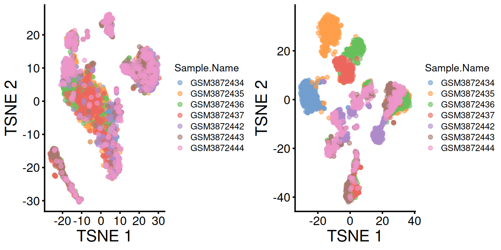
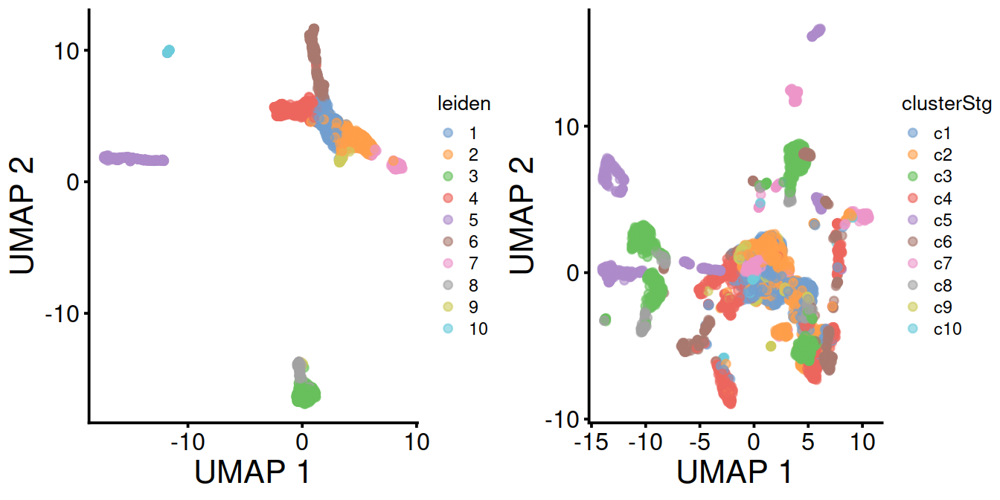
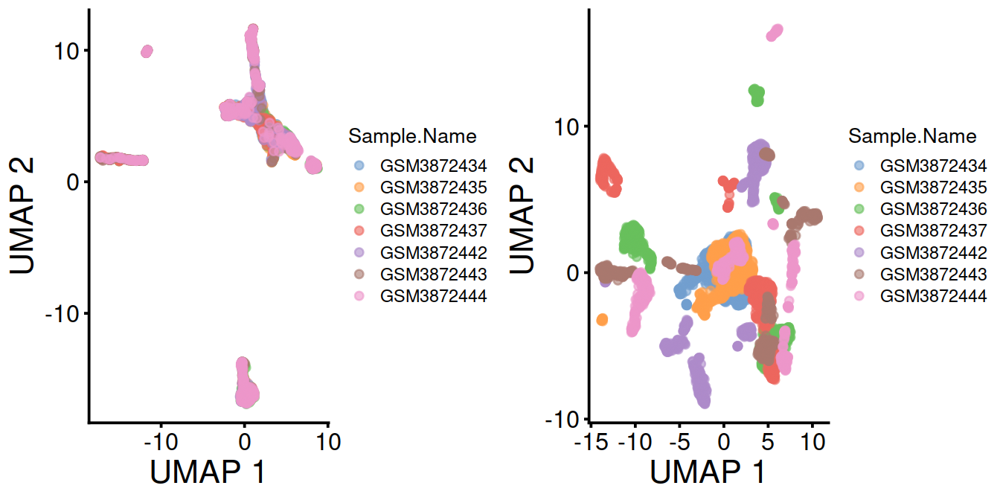
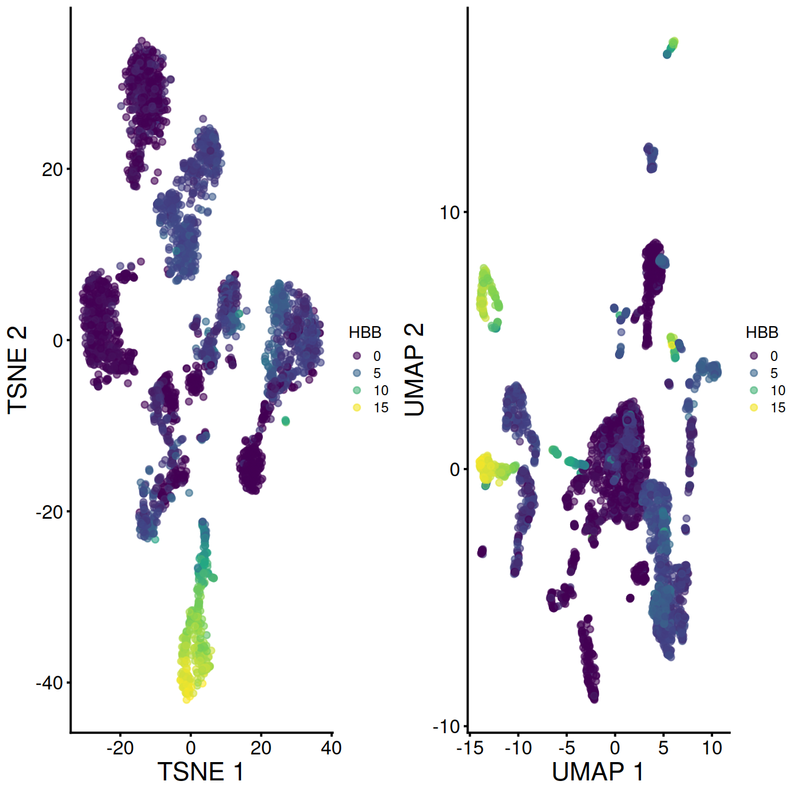
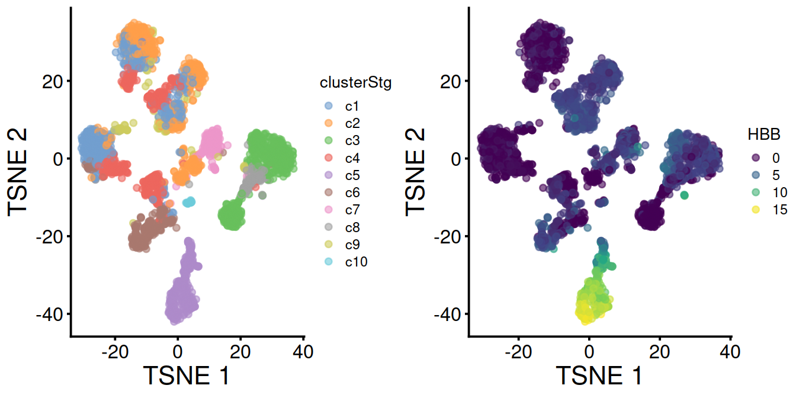
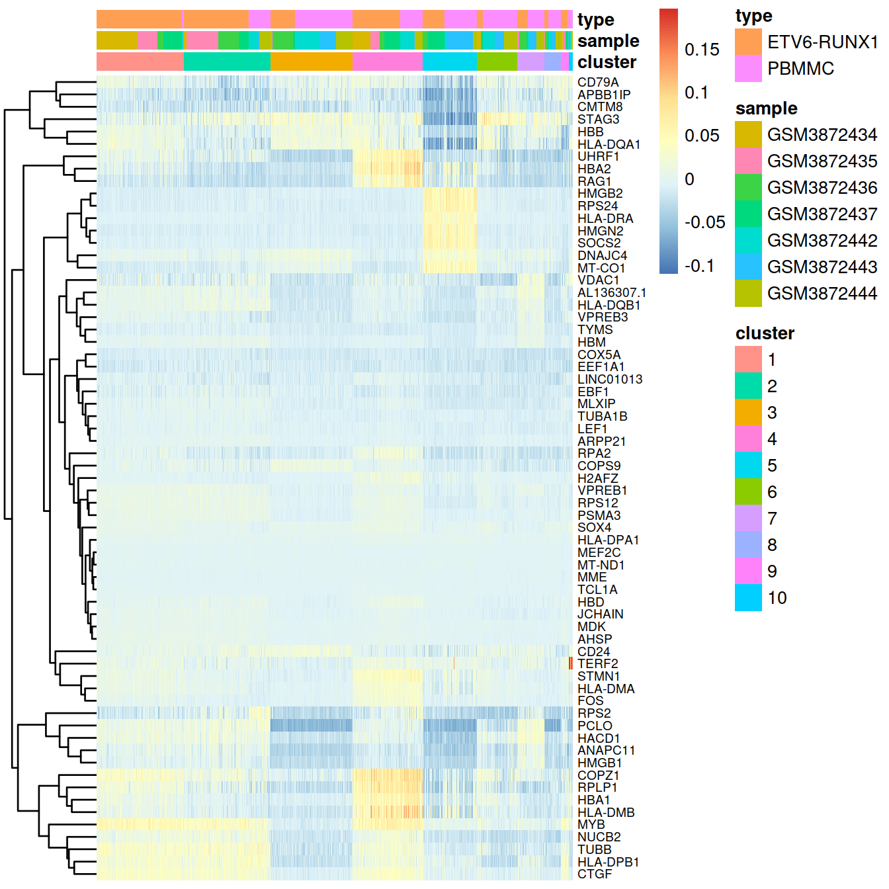
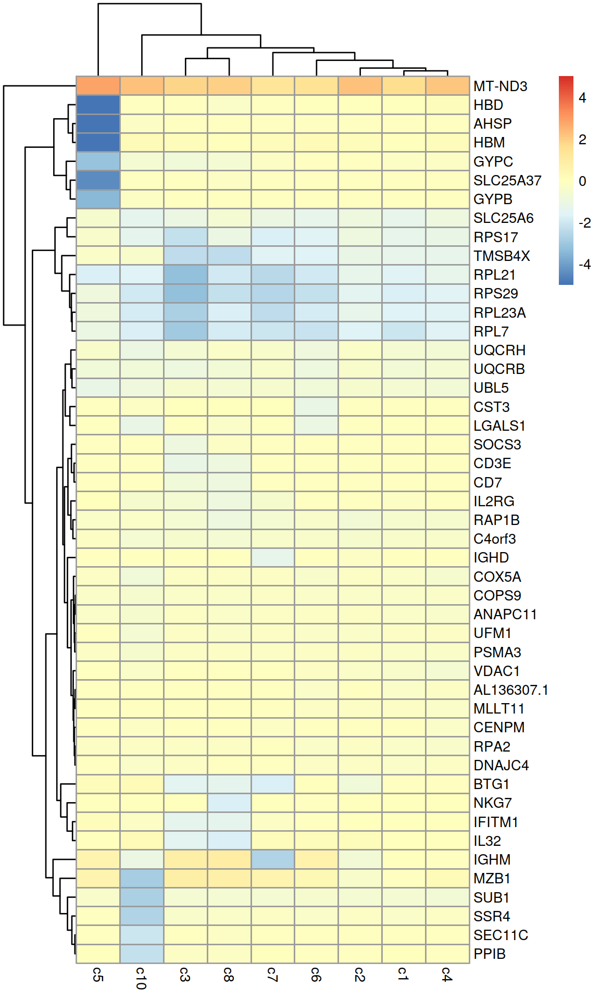
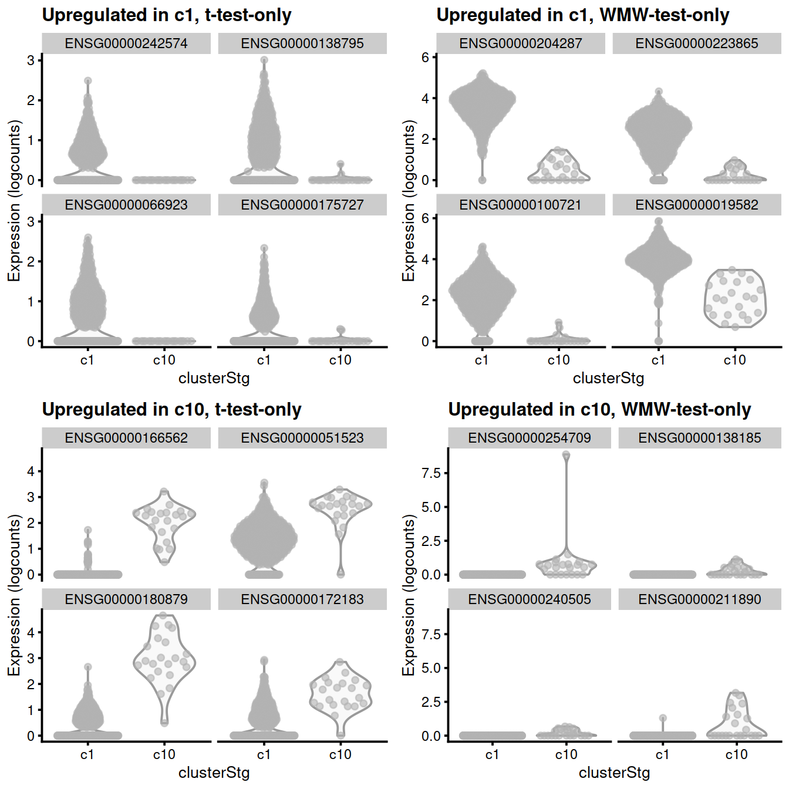

# Cluster marker genes {#clusterMarkerGenesTop}


```r
if(interactive()) {
  paramsToUse <- params2
} else {
  paramsToUse <- params
}

projDir <- paramsToUse$projDir
dirRel <- paramsToUse$dirRel
outDirBit <- paramsToUse$outDirBit
cacheBool <- paramsToUse$cacheBool
setName <- paramsToUse$setName
splSetToGet <- paramsToUse$splSetToGet
setSuf <- paramsToUse$setSuf
dsiSuf <- paramsToUse$dsiSuf # 'dsi' for data set integration
if(paramsToUse$bookType == "mk"){
	setName <- "caron"
	splSetToGet <- "PBMMC,ETV6-RUNX1"
	setSuf <- "_5hCellPerSpl"
	dsiSuf <- '_dsi'
}
splSetVec <- unlist(strsplit(splSetToGet, ",")) # params may not be read in if knitting book.
splSetToGet2 <- gsub(",", "_", splSetToGet)
nbPcToComp <- 50
figSize <- 7
```


```r
library(ggplot2)
library(scater)
library(scran)
library(dplyr)
library(RColorBrewer)
library(pheatmap)
library(Cairo)
library(glue)

fontsize <- theme(axis.text=element_text(size=12), axis.title=element_text(size=16))
```

Source: we will follow the [OSCA chapter on marker detection](https://bioconductor.org/books/release/OSCA/marker-detection.html) (with some of its text copied here with little modification). See also the Hemberg group chapter on [differential analysis section](https://scrnaseq-course.cog.sanger.ac.uk/website/biological-analysis.html#dechapter).

To interpret our clustering results, we identify the genes that drive separation between clusters. These marker genes allow us to assign biological meaning to each cluster based on their functional annotation. In the most obvious case, the marker genes for each cluster are a priori associated with particular cell types, allowing us to treat the clustering as a proxy for cell type identity. The same principle can be applied to discover more subtle differences between clusters (e.g., changes in activation or differentiation state) based on the behavior of genes in the affected pathways.

Identification of marker genes is usually based around the retrospective detection of differential expression between clusters. Genes that are more strongly DE are more likely to have caused separate clustering of cells in the first place. Several different statistical tests are available to quantify the differences in expression profiles, and different approaches can be used to consolidate test results into a single ranking of genes for each cluster.

## Learning objectives

* identify genes that differentially expressed between clusters,
* exclusively or not,
* using different methods that test:
  * the mean expression level,
  * the whole distribution,
  * or the proportion of cells expressing the gene
* compile a summary table.

## Load data

We will load the R file keeping the SCE (SingleCellExperiment) object with the outcome of the clustering performed after feature selection and dimensionality reduction of the normalised counts for 500 cells per sample.


```r
# read uncorrected counts
fn <- sprintf("%s/%s/Robjects/%s_sce_nz_postDeconv%s%s_%s_uncorr.Rds",
              projDir,
              outDirBit,
              setName,
              setSuf,
              dsiSuf,
              splSetToGet2) # 'dsi' for data set integration
uncorrected <- readRDS(file=fn)

# Read object in:
#tmpFn <- sprintf("%s/%s/Robjects/%s_sce_nz_postDeconv%s_clustered.Rds", projDir, outDirBit, setName, setSuf)
#tmpFn <- sprintf("%s/%s/Robjects/%s_sce_nz_postDeconv%s_clust.Rds",
#                 projDir, outDirBit, setName, setSuf)
tmpFn <- sprintf("%s/%s/Robjects/%s_sce_nz_postDeconv%s%s_%s_clust.Rds",
                 projDir, outDirBit, setName, setSuf, dsiSuf, splSetToGet2)

print(tmpFn)
```

```
## [1] "/ssd/personal/baller01/20200511_FernandesM_ME_crukBiSs2020/AnaWiSce/AnaCourse1/Robjects/caron_sce_nz_postDeconv_5hCellPerSpl_dsi_PBMMC_ETV6-RUNX1_clust.Rds"
```

```r
if(!file.exists(tmpFn))
{
	knitr::knit_exit()
}
mnn.out <- readRDS(tmpFn)
rm(tmpFn)

mnn.out <- runUMAP(mnn.out, dimred="corrected")

# copy clustering output to uncorrected SCE
sce <- uncorrected
x <- colData(mnn.out)[,c("Barcode","leiden")] %>% data.frame()
colData(sce) <- colData(uncorrected) %>%
  data.frame() %>%
  dplyr::left_join(x, by="Barcode") %>%
  DataFrame
colData(sce)$cluster <- colData(sce)$leiden
sce$clusterStg <- factor(paste0("c", sce$cluster),
			 levels = paste0("c", levels(sce$cluster)))
rm(uncorrected)
```

Number of cells: .

Number of genes: 16629.

## Detecting genes differentially expressed between clusters

The TSNE plots below show the structure observed with and without data set integration
Cells colored by cluster:


```r
tsney <- plotTSNE(mnn.out, colour_by="leiden") + fontsize
tsnex <- plotTSNE(sce, colour_by="clusterStg") + fontsize
gridExtra::grid.arrange(tsney, tsnex, ncol=2)
```


Cells colored by sample name:


```r
p1 <- plotTSNE(mnn.out, colour_by="Sample.Name") + fontsize
p2 <- plotTSNE(sce, colour_by="Sample.Name") + fontsize
gridExtra::grid.arrange(p1, p2, ncol=2)
```



```r
rm(p1, p2)
```

The UMAP plots below show the structure observed with and without data set integration:

Cells colored by cluster:


```r
umapy <- plotUMAP(mnn.out, colour_by="leiden") + fontsize
umapx <- plotUMAP(sce, colour_by="clusterStg") + fontsize
gridExtra::grid.arrange(umapy, umapx, ncol=2)
```



Cells colored by sample name:


```r
p1 <- plotUMAP(mnn.out, colour_by="Sample.Name") + fontsize
p2 <- plotUMAP(sce, colour_by="Sample.Name") + fontsize
gridExtra::grid.arrange(p1, p2, ncol=2)
```



```r
rm(p1, p2)
```

### Differential expression analysis

For each cluster, we will identify genes whose expression differ to that of other clusters, for each pair of cluster, using `scran::findMarkers()`. The function  fits a linear model to the log-expression values for each gene using limma [@doi:10.1093/nar/gkv007] and allows testing for differential expression in each cluster compared to the others while accounting for known, uninteresting factors.

We will first identify genes whose average expression differ between clusters, using the Welch t-test (default) with a log-fold change
threshold of 0 (default) and ranking genes based on the outcome of any of the pairwise comparisons (default).


```r
# Clusters called with igraph::cluster_walktrap() are named with digits.
# We add a 'c' prefix (for-cluster) to avoid any confusion: these values are labels, not numerical values

# run scran::findMarkers()
# with default parameters for now
# check the function's manual for details (?scran::findMarkers)
# (the test.type and pval.type options are covered below)
markersWoBatch <- findMarkers(x=sce,
                       groups=sce$clusterStg)
```


```r
markersWiBatch <- findMarkers(x=sce,
                     groups=sce$clusterStg,
                     block=sce$block,
                     #direction="up",
                     #lfc=1,
                     row.data=rowData(sce)[,
                                           #c("Symbol", "ensembl_gene_id"),
                                           ,
                                           drop=FALSE])

 # A cell type of some sort:
demo <- markersWiBatch[["c4"]]
```


```r
as.data.frame(demo[1:20,c("Symbol", "Top", "p.value", "FDR")]) 
```

```
##                  Symbol Top       p.value           FDR
## ENSG00000117632   STMN1   1 1.289261e-255 4.287824e-252
## ENSG00000123416  TUBA1B   1 2.206400e-240 5.241461e-237
## ENSG00000124795     DEK   1 5.629134e-102  1.088452e-99
## ENSG00000164104   HMGB2   1 5.471063e-198 5.054350e-195
## ENSG00000177954   RPS27   1 7.116798e-300 5.917262e-296
## ENSG00000189403   HMGB1   1 1.710272e-217 2.187701e-214
## ENSG00000213585   VDAC1   1  3.551566e-62  2.938259e-60
## ENSG00000244734     HBB   1  0.000000e+00  0.000000e+00
## ENSG00000087086     FTL   2 8.984861e-117 2.298604e-114
## ENSG00000117748    RPA2   2  1.813523e-60  1.429245e-58
## ENSG00000124766    SOX4   2  1.835594e-79  2.438379e-77
## ENSG00000196230    TUBB   2 1.033082e-233 1.908792e-230
## ENSG00000206172    HBA1   2 1.091060e-286 6.047743e-283
## ENSG00000122026   RPL21   3 9.779062e-235 2.032700e-231
## ENSG00000128218  VPREB3   3 4.163338e-128 1.357493e-125
## ENSG00000128322   IGLL1   3  1.027465e-91  1.779762e-89
## ENSG00000178741   COX5A   3  4.164852e-59  3.133816e-57
## ENSG00000188536    HBA2   3 7.344382e-284 3.053243e-280
## ENSG00000141552 ANAPC11   4  9.869646e-55  6.361331e-53
## ENSG00000164032   H2AFZ   4 1.942589e-155 1.076777e-152
```

```r
featx <- demo[1,"ensembl_gene_id"]
featy <- demo %>% data.frame %>%
  filter(ensembl_gene_id == featx) %>%
  pull("Symbol")
```


```r
plotExpression(sce,
               x=I(factor(sce$clusterStg)),
               features=featx, # "ENSG00000007312",
               colour_by="block") +
  facet_wrap(~colour_by) +
  ggtitle(glue('{featx} aka {featy}'))
```


```r
markers <- markersWiBatch
```

Results are compiled in a single table per cluster that stores the outcome of comparisons against the other clusters.
One can then select differentially expressed genes from each pairwise comparison between clusters.

We will define a set of genes for cluster 1 by selecting the top 10 genes of each comparison, and check the test output, eg adjusted p-values and log-fold changes.


```r
clux <- "c1"

# get output table for cluster of interest:
marker.set <- markers[[clux]]
head(marker.set, 3)
```

```
## DataFrame with 3 rows and 24 columns
##                 ensembl_gene_id external_gene_name chromosome_name
##                     <character>        <character>     <character>
## ENSG00000123416 ENSG00000123416             TUBA1B              12
## ENSG00000124766 ENSG00000124766               SOX4               6
## ENSG00000128218 ENSG00000128218             VPREB3              22
##                 start_position end_position strandNum      Symbol
##                      <integer>    <integer> <integer> <character>
## ENSG00000123416       49127782     49131397        -1      TUBA1B
## ENSG00000124766       21593751     21598619         1        SOX4
## ENSG00000128218       23752743     23754425        -1      VPREB3
##                            Type      mean  detected gene_sparsity       Top
##                     <character> <numeric> <numeric>     <numeric> <integer>
## ENSG00000123416 Gene Expression   6.13696   55.0540      0.331165         1
## ENSG00000124766 Gene Expression   2.45547   40.8965      0.387268         1
## ENSG00000128218 Gene Expression   1.11073   28.6456      0.547111         1
##                      p.value          FDR summary.logFC   logFC.c2  logFC.c3
##                    <numeric>    <numeric>     <numeric>  <numeric> <numeric>
## ENSG00000123416 3.67661e-161 6.11383e-158      -1.86877  0.2403615  0.742311
## ENSG00000124766  6.33797e-82  1.69990e-79       1.17633  0.2043029  1.037998
## ENSG00000128218 3.18154e-177 8.81764e-174       1.29414 -0.0149894  1.339206
##                  logFC.c4  logFC.c5  logFC.c6  logFC.c7  logFC.c8  logFC.c9
##                 <numeric> <numeric> <numeric> <numeric> <numeric> <numeric>
## ENSG00000123416 -1.868766 -0.452086  0.032636  0.591062  0.709009  0.386867
## ENSG00000124766  0.367174  1.139207  0.734617  1.150730  1.090125  0.334170
## ENSG00000128218  0.177627  1.077620  0.855558  0.702230  1.294140  0.376922
##                 logFC.c10
##                 <numeric>
## ENSG00000123416  0.491658
## ENSG00000124766  1.176332
## ENSG00000128218  1.086622
```

```r
# add gene annotation:
##tmpDf <- marker.set
##tmpDf$ensembl_gene_id <- rownames(tmpDf)
##tmpDf2 <- base::merge(tmpDf, rowData(sce), by="ensembl_gene_id", all.x=TRUE, all.y=F, sort=F)
```

Write table to file:


```r
tmpFn <- sprintf("%s/%s/Robjects/%s_sce_nz_postDeconv%s%s_%s_%s.tsv",
                 projDir, outDirBit, setName, setSuf, dsiSuf, splSetToGet2, clux)
print(tmpFn)
```

```
## [1] "/ssd/personal/baller01/20200511_FernandesM_ME_crukBiSs2020/AnaWiSce/AnaCourse1/Robjects/caron_sce_nz_postDeconv_5hCellPerSpl_dsi_PBMMC_ETV6-RUNX1_c1.tsv"
```

```r
write.table(marker.set, file=tmpFn, sep="\t", quote=FALSE, row.names=FALSE)
rm(tmpFn)
```

Show expression of marker on t-SNE and UMAP:


```r
mrkSet <- marker.set %>%
  data.frame() %>%
  filter(Symbol %in% rowData(mnn.out)$Symbol) %>%
  arrange(FDR)

geneInd <- 2
geneEns <- mrkSet[geneInd,"ensembl_gene_id"]
geneExt <- mrkSet[geneInd,"external_gene_name"] # external_gene_name ~ Symbol

#tsne1 <- plotTSNE(sce, colour_by=mrkSet[geneInd,"ensembl_gene_id"]) + fontsize
tsne1 <- plotTSNE(sce, colour_by=geneEns) +
  fontsize +
  scale_color_continuous(type = 'viridis',
                         guide = guide_legend(title = geneExt))

umap1 <- plotUMAP(sce, colour_by=geneEns) +
  fontsize +
  scale_color_continuous(type = 'viridis',
                         guide = guide_legend(title = geneExt))

tsne1b <- plotTSNE(mnn.out,
                   colour_by=geneExt,
                   by_exprs_values = "reconstructed") + fontsize

umap1b <- plotUMAP(mnn.out,
                   colour_by=mrkSet[geneInd,"Symbol"],
                   by_exprs_values = "reconstructed") + fontsize
```

Expresion levels of ENSG00000244734 aka HBB:


```r
plotExpression(sce,
               x=I(factor(sce$clusterStg)),
               features=geneEns, # "ENSG00000007312",
               colour_by="block") +
  facet_wrap(~colour_by) +
  ggtitle(glue('{geneEns} aka {geneExt}'))
```


Without data set integration (sce) 


```r
#tsne1
#umap1
gridExtra::grid.arrange(tsne1, umap1, ncol=2)
```


With data set integration (mnn.out):


```r
#tsne1b
#umap1b
gridExtra::grid.arrange(tsne1b, umap1b, ncol=2)
```


With data integration (mnn.out), TSNE with leiden clusters and HBB levels:


```r
gridExtra::grid.arrange(tsney, tsne1b, ncol=2)
```


Without data integration (sce), TSNE with leiden clusters and HBB levels:


```r
gridExtra::grid.arrange(tsnex, tsne1, ncol=2)
```



With data integration (mnn.out), UMAP with leiden clusters and HBB levels:


```r
gridExtra::grid.arrange(umapy, umap1b, ncol=2)
```


Without data integration (sce), UMAP with leiden clusters and HBB levels:


```r
gridExtra::grid.arrange(umapx, umap1, ncol=2)
```


```r
rm(tsne1, tsne1b, umap1, umap1b)
rm(tsnex, tsney, umapx, umapy)
```

Gene set enrichment analyses used for bulk RNA-seq may be used to characterise clusters further. 

### Heatmap

As for bulk RNA, differences in expression profiles of the top genes can be visualised with a heatmap. 

Normalised counts:


```r
# select some top genes:
top.markers <- rownames(marker.set)[marker.set$Top <= 10]

# have matrix to annotate sample with cluster and sample:
tmpData <- logcounts(sce)[top.markers,]
# concat sample and barcode names to make unique name across the whole data set
tmpCellNames <- paste(colData(sce)$Sample.Name, colData(sce)$Barcode, sep="_")
# use these to namecolumn of matrix the show as heatmap:
colnames(tmpData) <- tmpCellNames # colData(sce)$Barcode                    

# columns annotation with cell name:
mat_col <- data.frame(cluster = sce$cluster,
		      sample = sce$Sample.Name,
		      type = sce$source_name
		)
rownames(mat_col) <- colnames(tmpData)
rownames(mat_col) <- tmpCellNames # colData(sce)$Barcode

# Prepare colours for clusters:
colourCount = length(unique(sce$cluster))
getPalette = colorRampPalette(brewer.pal(9, "Set1"))

mat_colors <- list(group = getPalette(colourCount))
names(mat_colors$group) <- unique(sce$cluster)

breaksVec = seq(-5, 5, by = 0.1)

# plot heatmap:
pheatmap(tmpData,
           border_color      = NA,
           show_colnames     = FALSE,
           #show_rownames     = FALSE,
           show_rownames     = TRUE,
           drop_levels       = TRUE,
           labels_row        = rowData(sce)[rownames(tmpData),"Symbol"],
           annotation_col    = mat_col,
           annotation_colors = mat_colors,
           color             = colorRampPalette(
             rev(brewer.pal(n = 7,
                            name = "RdYlBu")))(length(breaksVec)),
           breaks            = breaksVec,
	   fontsize_row      = 7
           )
```


```r
# remove MALAT1
tmpData2 <- tmpData %>%
  as.matrix() %>%
  data.frame() %>%
  tibble::rownames_to_column("ensId") %>%
  filter(ensId != "ENSG00000251562") %>%
  tibble::column_to_rownames("ensId")
colnames(tmpData2) <- gsub("\\.", "-", colnames(tmpData2))

pheatmap(tmpData2,
           border_color      = NA,
           show_colnames     = FALSE,
           #show_rownames     = FALSE,
           show_rownames     = TRUE,
           drop_levels       = TRUE,
           labels_row        = rowData(sce)[rownames(tmpData2),"Symbol"],
           annotation_col    = mat_col,
           annotation_colors = mat_colors,
           color             = colorRampPalette(
             rev(brewer.pal(n = 7,
                            name = "RdYlBu")))(length(breaksVec)),
           breaks            = breaksVec,
	   fontsize_row      = 7
           )
rm(tmpData2)
```

<!--
One can sort both the gene and sample dendrograms to improve the heatmap.
-->


```r
library(dendsort)

mat <- tmpData
mat_cluster_cols <- hclust(dist(t(mat)))

sort_hclust <- function(...) as.hclust(dendsort(as.dendrogram(...)))

mat_cluster_cols <- sort_hclust(mat_cluster_cols)
#plot(mat_cluster_cols, main = "Sorted Dendrogram", xlab = "", sub = "")

mat_cluster_rows <- sort_hclust(hclust(dist(mat)))
rm(mat)

pheatmap(tmpData,
           border_color      = NA,
           show_colnames     = FALSE,
           show_rownames     = FALSE,
           drop_levels       = TRUE,
           annotation_col    = mat_col,
           annotation_colors = mat_colors,
           cluster_cols      = mat_cluster_cols,
           cluster_rows      = mat_cluster_rows
         )
```

Counts corrected for batch effect ('corrected'):


```r
# select some top genes:
#top.markers <- rownames(marker.set)[marker.set$Top <= 10]
top.markers <- marker.set[marker.set$Top <= 10,] %>%
  data.frame() %>%
  pull(Symbol)

# have matrix to annotate sample with cluster and sample:
tmpData3 <- assay(mnn.out) %>%
  as.matrix() %>%
  data.frame() %>%
  tibble::rownames_to_column("Symbol") %>%
  filter(Symbol %in% top.markers) %>%
  tibble::column_to_rownames("Symbol")
colnames(tmpData3) <- colData(mnn.out)$Barcode
colnames(tmpData3) <- gsub("\\.", "-", colnames(tmpData3))

# concat sample and barcode names to make unique name across the whole data set
tmpCellNames <- paste(colData(mnn.out)$Sample.Name,
                      colData(mnn.out)$Barcode, sep="_")
# use these to name columns of matrix the show as heatmap:
colnames(tmpData3) <- tmpCellNames # colData(sce)$Barcode                    

# columns annotation with cell name:
mat_col <- data.frame(cluster = sce$cluster,
		      sample = sce$Sample.Name,
		      type = sce$source_name
		)
rownames(mat_col) <- colnames(tmpData)
rownames(mat_col) <- tmpCellNames # colData(sce)$Barcode

# Prepare colours for clusters:
colourCount = length(unique(sce$cluster))
getPalette = colorRampPalette(brewer.pal(9, "Set1"))

mat_colors <- list(group = getPalette(colourCount))
names(mat_colors$group) <- unique(sce$cluster)

# plot heatmap:
pheatmap(tmpData3[,order(colData(sce)$clusterStg)],
           border_color      = NA,
           show_colnames     = FALSE,
           #show_rownames     = FALSE,
           show_rownames     = TRUE,
           drop_levels       = TRUE,
           labels_row        = rowData(sce)[rownames(tmpData),"Symbol"],
           annotation_col    = mat_col,
           annotation_colors = mat_colors,
           cluster_cols      = FALSE,
           fontsize_row      = 7
           )
```



```r
rm(tmpData3)
rm(mnn.out, tmpData)
```

To demonstrate how to interpret the results, we will use cluster 9 as our cluster of interest. The relevant DataFrame contains log2-fold changes of expression in cluster 9 over each other cluster, along with several statistics obtained by combining p-values (Simes 1986) across the pairwise comparisons involving cluster 9.


```r
chosen <- "c9"
interesting <- markers[[chosen]]
print(colnames(interesting))
```

```
##  [1] "ensembl_gene_id"    "external_gene_name" "chromosome_name"   
##  [4] "start_position"     "end_position"       "strandNum"         
##  [7] "Symbol"             "Type"               "mean"              
## [10] "detected"           "gene_sparsity"      "Top"               
## [13] "p.value"            "FDR"                "summary.logFC"     
## [16] "logFC.c1"           "logFC.c2"           "logFC.c3"          
## [19] "logFC.c4"           "logFC.c5"           "logFC.c6"          
## [22] "logFC.c7"           "logFC.c8"           "logFC.c10"
```

Of particular interest is the Top field. The set of genes with Top ≤X is the union of the top X genes (ranked by p-value) from each pairwise comparison involving cluster 9. For example, the set of all genes with Top values of 1 contains the gene with the lowest p-value from each comparison. Similarly, the set of genes with Top values less than or equal to 10 contains the top 10 genes from each comparison. The Top field represents findMarkers()’s approach to consolidating multiple pairwise comparisons into a single ranking for each cluster; each DataFrame produced by findMarkers() will order genes based on the Top value by default.


```r
interesting.coluToShow <- c("Symbol", "Top", "FDR", "summary.logFC")
interesting[1:10,interesting.coluToShow]
```

```
## DataFrame with 10 rows and 4 columns
##                      Symbol       Top          FDR summary.logFC
##                 <character> <integer>    <numeric>     <numeric>
## ENSG00000113387        SUB1         1  6.32981e-12     -2.745184
## ENSG00000127314       RAP1B         1  3.33268e-39     -0.613188
## ENSG00000147454    SLC25A37         1 1.71443e-142     -4.430710
## ENSG00000169100     SLC25A6         1  1.04622e-41     -1.297843
## ENSG00000198851        CD3E         1  4.16157e-66     -1.126555
## ENSG00000205542      TMSB4X         1  6.87247e-18     -2.391993
## ENSG00000211898        IGHD         1  5.34296e-25     -1.270077
## ENSG00000213585       VDAC1         1  3.11388e-65     -0.358800
## ENSG00000105374        NKG7         2  4.07717e-17     -1.765356
## ENSG00000117748        RPA2         2  1.03990e-57     -0.337331
```

We use the Top field to identify a set of genes that is guaranteed to distinguish cluster 9 from any other cluster. Here, we examine the top 6 genes from each pairwise comparison.


```r
best.set <- interesting[interesting$Top <= 6,]
logFCs <- getMarkerEffects(best.set)
logFCs.ens <- rownames(logFCs)
rownames(logFCs) <- rowData(sce)[rownames(logFCs), "Symbol"]

library(pheatmap)
pheatmap(logFCs, breaks=seq(-5, 5, length.out=101))
```



## Using the log-fold change

Our previous findMarkers() call considers both up- and downregulated genes to be potential markers. However, downregulated genes are less appealing as markers as it is more difficult to interpret and experimentally validate an absence of expression. To focus on up-regulated markers, we can instead perform a one-sided t-test to identify genes that are upregulated in each cluster compared to the others. This is achieved by setting direction="up" in the findMarkers() call.


```r
markersWoBatch.up <- findMarkers(sce,
				 groups = sce$clusterStg,
				 direction = "up")
```


```r
markersWiBatch.up <- findMarkers(x = sce,
                     groups = sce$clusterStg,
                     block = sce$block,
                     direction = "up",
                     #lfc=1,
                     row.data = rowData(sce)[,
                                           #c("Symbol", "ensembl_gene_id"),
                                           ,
                                           drop=FALSE])
markers.up <- markersWiBatch.up
```


```r
interesting.up <- markers.up[[chosen]]
interesting.up[1:10,interesting.coluToShow]
```

```
## DataFrame with 10 rows and 4 columns
##                      Symbol       Top         FDR summary.logFC
##                 <character> <integer>   <numeric>     <numeric>
## ENSG00000019582        CD74         1 5.39531e-19       2.53434
## ENSG00000198840      MT-ND3         1 6.24399e-32       2.89198
## ENSG00000198899     MT-ATP6         1 3.93950e-18       2.11267
## ENSG00000251562      MALAT1         1 2.06433e-24       2.46650
## ENSG00000198763      MT-ND2         2 6.00337e-24       2.50605
## ENSG00000198938      MT-CO3         2 8.60452e-14       2.06609
## ENSG00000198712      MT-CO2         3 3.28988e-19       1.99352
## ENSG00000198886      MT-ND4         4 2.10326e-14       1.84384
## ENSG00000198727      MT-CYB         5 7.63237e-11       1.80483
## ENSG00000204287     HLA-DRA         5 4.53827e-11       2.14766
```

The t-test also allows us to specify a non-zero log-fold change as the null hypothesis. This allows us to consider the magnitude of the log-fold change in our p-value calculations, in a manner that is more rigorous than simply filtering directly on the log-fold changes (McCarthy and Smyth 2009). (Specifically, a simple threshold does not consider the variance and can enrich for genes that have both large log-fold changes and large variances.) We perform this by setting lfc= in our findMarkers() call - when combined with direction=, this tests for genes with log-fold changes that are significantly greater than 1:


```r
markersWoBatch.up2 <- findMarkers(sce, groups=sce$clusterStg, direction="up", lfc=1)
```


```r
markersWiBatch.up2 <- findMarkers(x=sce,
                     groups=sce$clusterStg,
                     block=sce$block,
                     direction="up",
                     #lfc=1,
                     row.data=rowData(sce)[,
                                           #c("Symbol", "ensembl_gene_id"),
                                           ,
                                           drop=FALSE])
markers.up2 <- markersWiBatch.up2
```


```r
interesting.up2 <- markers.up2[[chosen]]
interesting.up2[1:10,interesting.coluToShow]
```

```
## DataFrame with 10 rows and 4 columns
##                      Symbol       Top         FDR summary.logFC
##                 <character> <integer>   <numeric>     <numeric>
## ENSG00000019582        CD74         1 5.39531e-19       2.53434
## ENSG00000198840      MT-ND3         1 6.24399e-32       2.89198
## ENSG00000198899     MT-ATP6         1 3.93950e-18       2.11267
## ENSG00000251562      MALAT1         1 2.06433e-24       2.46650
## ENSG00000198763      MT-ND2         2 6.00337e-24       2.50605
## ENSG00000198938      MT-CO3         2 8.60452e-14       2.06609
## ENSG00000198712      MT-CO2         3 3.28988e-19       1.99352
## ENSG00000198886      MT-ND4         4 2.10326e-14       1.84384
## ENSG00000198727      MT-CYB         5 7.63237e-11       1.80483
## ENSG00000204287     HLA-DRA         5 4.53827e-11       2.14766
```

These two settings yield a more focused set of candidate marker genes that are upregulated in cluster 9.


```r
best.set <- interesting.up2[interesting.up2$Top <= 5,]
logFCs <- getMarkerEffects(best.set)
logFCs.ens <- rownames(logFCs)
rownames(logFCs) <- rowData(sce)[rownames(logFCs), "Symbol"]

library(pheatmap)
pheatmap(logFCs, breaks=seq(-5, 5, length.out=101))
```


Of course, this increased stringency is not without cost. If only upregulated genes are requested from findMarkers(), any cluster defined by downregulation of a marker gene will not contain that gene among the top set of features in its DataFrame. This is occasionally relevant for subtypes or other states that are distinguished by high versus low expression of particular genes. Similarly, setting an excessively high log-fold change threshold may discard otherwise useful genes. For example, a gene upregulated in a small proportion of cells of a cluster will have a small log-fold change but can still be an effective marker if the focus is on specificity rather than sensitivity.

## Finding cluster-specific markers

By default, findMarkers() will give a high ranking to genes that are differentially expressed in any pairwise comparison. This is because a gene only needs a very low p
-value in a single pairwise comparison to achieve a low Top value. A more stringent approach would only consider genes that are differentially expressed in all pairwise comparisons involving the cluster of interest. To achieve this, we set pval.type="all" in findMarkers() to use an intersection-union test (Berger and Hsu 1996) where the combined p-value for each gene is the maximum of the p-values from all pairwise comparisons. A gene will only achieve a low combined p-value if it is strongly DE in all comparisons to other clusters.


```r
# We can combine this with 'direction='.
markersWoBatch.up3 <- findMarkers(sce,
				  groups=sce$clusterStg,
				  pval.type="all",
				  direction="up")
```


```r
markersWiBatch.up3 <- findMarkers(x=sce,
                     groups=sce$clusterStg,
                     block=sce$block,
                     pval.type="all",
                     direction="up",
                     #lfc=1,
                     row.data=rowData(sce)[,
                                           #c("Symbol", "ensembl_gene_id"),
                                           ,
                                           drop=FALSE])
markers.up3 <- markersWiBatch.up3
```


```r
interesting.up3 <- markers.up3[[chosen]]
interesting.colu <- intersect(interesting.coluToShow, colnames(interesting.up3))
interesting.up3[1:10,interesting.colu]
```

```
## DataFrame with 10 rows and 3 columns
##                      Symbol        FDR summary.logFC
##                 <character>  <numeric>     <numeric>
## ENSG00000198899     MT-ATP6 0.00160704      1.032391
## ENSG00000198840      MT-ND3 0.00160704      2.293836
## ENSG00000198763      MT-ND2 0.00160704      1.081879
## ENSG00000251562      MALAT1 0.00394722      0.580444
## ENSG00000198712      MT-CO2 0.00536471      1.625607
## ENSG00000198938      MT-CO3 0.01466755      1.339647
## ENSG00000198886      MT-ND4 0.03277462      1.396687
## ENSG00000198727      MT-CYB 1.00000000      0.950516
## ENSG00000244754     N4BP2L2 1.00000000      0.513462
## ENSG00000198786      MT-ND5 1.00000000      0.521689
```

This strategy will only report genes that are highly specific to the cluster of interest. When it works, it can be highly effective as it generates a small focused set of candidate markers. However, any gene that is expressed at the same level in two or more clusters will simply not be detected. This is likely to discard many interesting genes, especially if the clusters are finely resolved with weak separation. To give a concrete example, consider a mixed population of CD4+-only, CD8+-only, double-positive and double-negative T cells. With pval.type="all", neither Cd4 or Cd8 would be detected as subpopulation-specific markers because each gene is expressed in two subpopulations. In comparison, pval.type="any" will detect both of these genes as they will be DE between at least one pair of subpopulations.

If pval.type="all" is too stringent yet pval.type="any" is too generous, a compromise is to set pval.type="some". For each gene, we apply the Holm-Bonferroni correction across its p
-values and take the middle-most value as the combined p-value. This effectively tests the global null hypothesis that at least 50% of the individual pairwise comparisons exhibit no DE. We then rank the genes by their combined p-values to obtain an ordered set of marker candidates. The aim is to improve the conciseness of the top markers for defining a cluster while mitigating the risk of discarding useful genes that are not DE to all other clusters. The downside is that taking this compromise position sacrifices the theoretical guarantees offered at the other two extremes.


```r
markersWoBatch.up4 <- findMarkers(sce,
				  groups=sce$clusterStg,
				  pval.type="some",
				  direction="up")
```


```r
markersWiBatch.up4 <- findMarkers(x=sce,
                     groups=sce$clusterStg,
                     block=sce$block,
                     pval.type="some",
                     direction="up",
                     #lfc=1,
                     row.data=rowData(sce)[,
                                           #c("Symbol", "ensembl_gene_id"),
                                           ,
                                           drop=FALSE])
```


```r
markers.up4 <- markersWiBatch.up4
interesting.up4 <- markers.up4[[chosen]]
interesting.colu <- intersect(interesting.coluToShow, colnames(interesting.up4))
interesting.up4[1:10,interesting.colu]
```

```
## DataFrame with 10 rows and 3 columns
##                      Symbol         FDR summary.logFC
##                 <character>   <numeric>     <numeric>
## ENSG00000198840      MT-ND3 6.08619e-13      1.937097
## ENSG00000251562      MALAT1 5.27427e-11      1.261153
## ENSG00000198763      MT-ND2 8.27824e-11      1.660871
## ENSG00000198712      MT-CO2 1.26691e-09      1.299312
## ENSG00000198899     MT-ATP6 6.20982e-09      1.482559
## ENSG00000198938      MT-CO3 5.95867e-08      1.496933
## ENSG00000198886      MT-ND4 4.48305e-05      1.120305
## ENSG00000198727      MT-CYB 9.89275e-03      0.917140
## ENSG00000198888      MT-ND1 1.00711e-01      1.084596
## ENSG00000100099        HPS4 1.00711e-01      0.684222
```

In both cases, a different method is used to compute the summary effect size compared to pval.type="any". For pval.type="all", the summary log-fold change is defined as that corresponding to the pairwise comparison with the largest p-value, while for pval.type="some", it is defined as the log-fold change for the comparison with the middle-most p-value. This reflects the calculation of the combined p-value and avoids focusing on genes with strong changes in only one comparison.

## Using the Wilcoxon rank sum test

The Wilcoxon rank sum test (also known as the Wilcoxon-Mann-Whitney test, or WMW test) is another widely used method for pairwise comparisons between groups of observations. Its strength lies in the fact that it directly assesses separation between the expression distributions of different clusters. The WMW test statistic is proportional to the area-under-the-curve (AUC), i.e., the concordance probability, which is the probability of a random cell from one cluster having higher expression than a random cell from another cluster. In a pairwise comparison, AUCs of 1 or 0 indicate that the two clusters have perfectly separated expression distributions. Thus, the WMW test directly addresses the most desirable property of a candidate marker gene, while the t-test only does so indirectly via the difference in the means and the intra-group variance.

We perform WMW tests by again using the findMarkers() function, this time with test="wilcox". This returns a list of DataFrames containing ranked candidate markers for each cluster. The direction=, lfc= and pval.type= arguments can be specified and have the same interpretation as described for t-tests. We demonstrate below by detecting upregulated genes in each cluster with direction="up".


```r
markers.wmw <- findMarkers(sce, groups=sce$clusterStg, test="wilcox", direction="up")
```


```r
markersWiBatch.wmw <- findMarkers(x=sce,
                     groups=sce$clusterStg,
                     block=sce$block,
                     test="wilcox",
                     direction="up",
                     row.data=rowData(sce)[,
                                           #c("Symbol", "ensembl_gene_id"),
                                           ,
                                           drop=FALSE])
```


```r
markers.wmw <- markersWiBatch.wmw
#print(names(markers.wmw))
```

To explore the results in more detail, we focus on the DataFrame for cluster 9. The interpretation of Top is the same as described for t-tests, and Simes’ method is again used to combine p-values across pairwise comparisons. If we want more focused sets, we can also change pval.type= as previously described.


```r
interesting.coluToShow <- c("Symbol", "Top", "FDR", "summary.AUC")

interesting.wmw <- markers.wmw[[chosen]]
interesting.wmw[1:10,interesting.coluToShow]
```

```
## DataFrame with 10 rows and 4 columns
##                      Symbol       Top         FDR summary.AUC
##                 <character> <integer>   <numeric>   <numeric>
## ENSG00000019582        CD74         1 5.05721e-24    0.912979
## ENSG00000198840      MT-ND3         1 7.45593e-23    0.959038
## ENSG00000251562      MALAT1         1 5.05721e-24    0.971495
## ENSG00000196628        TCF4         2 4.90193e-23    0.680557
## ENSG00000198712      MT-CO2         2 1.43378e-17    0.905674
## ENSG00000198763      MT-ND2         2 8.03850e-20    0.926217
## ENSG00000198938      MT-CO3         2 3.72034e-16    0.887331
## ENSG00000128218      VPREB3         3 5.30296e-23    0.686888
## ENSG00000105369       CD79A         4 1.09836e-21    0.734337
## ENSG00000198899     MT-ATP6         4 1.20658e-15    0.881893
```

The DataFrame contains the AUCs from comparing cluster 9 to every other cluster. A value greater than 0.5 indicates that the gene is upregulated in the current cluster compared to the other cluster, while values less than 0.5 correspond to downregulation. We would typically expect AUCs of 0.7-0.8 for a strongly upregulated candidate marker.


```r
best.set <- interesting.wmw[interesting.wmw$Top <= 5,]
AUCs <- getMarkerEffects(best.set, prefix="AUC")
AUCs.ens <- rownames(AUCs)
rownames(AUCs) <- rowData(sce)[rownames(AUCs), "Symbol"]


library(pheatmap)
pheatmap(AUCs,
	 breaks = seq(0, 1, length.out=21),
	 color = viridis::viridis(21))
```


One practical advantage of the WMW test over the Welch t-test is that it is symmetric with respect to differences in the size of the groups being compared. This means that, all else being equal, the top-ranked genes on each side of a DE comparison will have similar expression profiles regardless of the number of cells in each group. In contrast, the t-test will favor genes where the larger group has the higher relative variance as this increases the estimated degrees of freedom and decreases the resulting p-value. This can lead to unappealing rankings when the aim is to identify genes upregulated in smaller groups. The WMW test is not completely immune to variance effects - for example, it will slightly favor detection of DEGs at low average abundance where the greater number of ties at zero deflates the approximate variance of the rank sum statistic - but this is relatively benign as the selected genes are still fairly interesting.

<!-- We observe both of these effects in a comparison between alpha and gamma cells in the human pancreas data set from Lawlor et al. (2017) (Figure 11.4). -->


```r
print(head(sce$clusterStg))
```


```r
type1 <- "c1"
#type2 <- "c10"
type2 <- levels(sce$clusterStg)[nlevels(sce$clusterStg)]
marker.t <- findMarkers(sce,
                        groups=sce$clusterStg,
                        direction="up",
                        block=sce$block,
                        restrict=c(type1, type2),
                        row.data=rowData(sce)[,
                                           c("Symbol", "ensembl_gene_id"),
                                           drop=FALSE])
marker.w <- findMarkers(sce,
                        groups=sce$clusterStg,
                        direction="up",
                        block=sce$block,
                        restrict=c(type1, type2),
                        test.type="wilcox",
                        row.data=rowData(sce)[,
                                           c("Symbol", "ensembl_gene_id"),
                                           drop=FALSE]
                        )
```


```r
# Upregulated in type 1:
marker.type1.t <- marker.t[[type1]]
marker.type1.w <- marker.w[[type1]]
chosen.type1.t <- rownames(marker.type1.t)[1:30]
chosen.type1.w <- rownames(marker.type1.w)[1:30]
u.type1.t <- setdiff(chosen.type1.t, chosen.type1.w)
u.type1.w <- setdiff(chosen.type1.w, chosen.type1.t)

# Upregulated in gamma:
marker.type2.t <- marker.t[[type2]]
marker.type2.w <- marker.w[[type2]]
chosen.type2.t <- rownames(marker.type2.t)[1:30]
chosen.type2.w <- rownames(marker.type2.w)[1:30]
u.type2.t <- setdiff(chosen.type2.t, chosen.type2.w)
u.type2.w <- setdiff(chosen.type2.w, chosen.type2.t)

u.type1.t <- u.type1.t[1:min(4,length(u.type1.t))]
u.type1.w <- u.type1.w[1:min(4,length(u.type1.w))]
u.type2.t <- u.type2.t[1:min(4,length(u.type2.t))]
u.type2.w <- u.type2.w[1:min(4,length(u.type2.w))]
```

u.type1.t


```r
marker.type1.t[,] %>%
  data.frame() %>%
  filter(ensembl_gene_id %in% u.type1.t)
```

```
##                  Symbol ensembl_gene_id Top      p.value          FDR
## ENSG00000242574 HLA-DMB ENSG00000242574   3 1.591031e-43 8.819083e-40
## ENSG00000138795    LEF1 ENSG00000138795   4 7.601769e-42 3.160246e-38
## ENSG00000066923   STAG3 ENSG00000066923   5 6.797967e-41 2.260868e-37
## ENSG00000175727   MLXIP ENSG00000175727   6 4.038754e-39 1.119341e-35
##                 summary.logFC logFC.c10
## ENSG00000242574     0.3400197 0.3400197
## ENSG00000138795     0.4215269 0.4215269
## ENSG00000066923     0.3138304 0.3138304
## ENSG00000175727     0.5284546 0.5284546
```

u.type1.w


```r
marker.type1.w[,] %>%
  data.frame() %>%
  filter(ensembl_gene_id %in% u.type1.w)
```

```
##                   Symbol ensembl_gene_id Top      p.value        FDR
## ENSG00000204287  HLA-DRA ENSG00000204287   1 3.657964e-06 0.06082829
## ENSG00000223865 HLA-DPB1 ENSG00000223865   2 2.745894e-05 0.13655164
## ENSG00000100721    TCL1A ENSG00000100721   3 3.854490e-05 0.13655164
## ENSG00000019582     CD74 ENSG00000019582   4 3.988134e-05 0.13655164
##                 summary.AUC   AUC.c10
## ENSG00000204287   0.9923039 0.9923039
## ENSG00000223865   0.9436445 0.9436445
## ENSG00000100721   0.9304866 0.9304866
## ENSG00000019582   0.9364449 0.9364449
```

u.type2.t


```r
marker.type2.t[,] %>%
  data.frame() %>%
  filter(ensembl_gene_id %in% u.type2.t)
```

```
##                 Symbol ensembl_gene_id Top      p.value          FDR
## ENSG00000166562 SEC11C ENSG00000166562   1 6.096755e-12 8.385620e-08
## ENSG00000051523   CYBA ENSG00000051523   2 1.008554e-11 8.385620e-08
## ENSG00000180879   SSR4 ENSG00000180879   3 3.543074e-11 1.963926e-07
## ENSG00000172183  ISG20 ENSG00000172183   4 4.825016e-11 2.005880e-07
##                 summary.logFC logFC.c1
## ENSG00000166562      2.028202 2.028202
## ENSG00000051523      1.589030 1.589030
## ENSG00000180879      2.455082 2.455082
## ENSG00000172183      1.416760 1.416760
```

u.type2.w


```r
marker.type2.w[,] %>%
  data.frame() %>%
  filter(ensembl_gene_id %in% u.type2.w)
```

```
##                    Symbol ensembl_gene_id Top       p.value           FDR
## ENSG00000254709     IGLL5 ENSG00000254709   1 1.634885e-141 2.718650e-137
## ENSG00000138185    ENTPD1 ENSG00000138185   3 1.452621e-117 6.038908e-114
## ENSG00000240505 TNFRSF13B ENSG00000240505   4 1.452621e-117 6.038908e-114
## ENSG00000211890     IGHA2 ENSG00000211890   5  1.874610e-98  6.234577e-95
##                 summary.AUC    AUC.c1
## ENSG00000254709   0.9852284 0.9852284
## ENSG00000138185   0.8990814 0.8990814
## ENSG00000240505   0.8990814 0.8990814
## ENSG00000211890   0.8987090 0.8987090
```


```r
# Examining all uniquely detected markers in each direction.
library(scater)
subset <- sce[,sce$clusterStg %in% c(type1, type2)]
gridExtra::grid.arrange(
    plotExpression(subset, x="clusterStg", features=u.type1.t, ncol=2) +
        ggtitle(sprintf("Upregulated in %s, t-test-only", type1)),
    plotExpression(subset, x="clusterStg", features=u.type1.w, ncol=2) +
        ggtitle(sprintf("Upregulated in %s, WMW-test-only", type1)),
    plotExpression(subset, x="clusterStg", features=u.type2.t, ncol=2) +
        ggtitle(sprintf("Upregulated in %s, t-test-only", type2)),
    plotExpression(subset, x="clusterStg", features=u.type2.w, ncol=2) +
        ggtitle(sprintf("Upregulated in %s, WMW-test-only", type2)),
    ncol=2
)
```



```r
rm(u.type1.t, u.type1.w, u.type2.t, u.type2.w)
```

The main disadvantage of the WMW test is that the AUCs are much slower to compute compared to t-statistics. This may be inconvenient for interactive analyses involving multiple iterations of marker detection. We can mitigate this to some extent by parallelizing these calculations using the BPPARAM= argument in findMarkers().

##  Using a binomial test

The binomial test identifies genes that differ in the proportion of expressing cells between clusters. (For the purposes of this section, a cell is considered to express a gene simply if it has non-zero expression for that gene.) This represents a much more stringent definition of marker genes compared to the other methods, as differences in expression between clusters are effectively ignored if both distributions of expression values are not near zero. The premise is that genes are more likely to contribute to important biological decisions if they were active in one cluster and silent in another, compared to more subtle “tuning” effects from changing the expression of an active gene. From a practical perspective, a binary measure of presence/absence is easier to validate.

We perform pairwise binomial tests between clusters using the findMarkers() function with test="binom". This returns a list of DataFrames containing marker statistics for each cluster such as the Top rank and its p-value. Here, the effect size is reported as the log-fold change in this proportion between each pair of clusters. Large positive log-fold changes indicate that the gene is more frequently expressed in one cluster compared to the other. We focus on genes that are upregulated in each cluster compared to the others by setting direction="up".


```r
markersWoBatch.binom <- findMarkers(sce,
				    test="binom",
				    direction="up",
				    groups=sce$clusterStg)
```


```r
markersWiBatch.binom <- findMarkers(x=sce,
                     groups=sce$clusterStg,
                     block=sce$block,
                     test="binom",
                     direction="up",
                     row.data=rowData(sce)[,
                                           #c("Symbol", "ensembl_gene_id"),
                                           ,
                                           drop=FALSE])
```


```r
markers.binom <- markersWiBatch.binom
print(names(markers.binom))
```

```
##  [1] "c1"  "c2"  "c3"  "c4"  "c5"  "c6"  "c7"  "c8"  "c9"  "c10"
```


```r
interesting.binom <- markers.binom[[chosen]]
print(colnames(interesting.binom))
```

```
##  [1] "ensembl_gene_id"    "external_gene_name" "chromosome_name"   
##  [4] "start_position"     "end_position"       "strandNum"         
##  [7] "Symbol"             "Type"               "mean"              
## [10] "detected"           "gene_sparsity"      "Top"               
## [13] "p.value"            "FDR"                "summary.logFC"     
## [16] "logFC.c1"           "logFC.c2"           "logFC.c3"          
## [19] "logFC.c4"           "logFC.c5"           "logFC.c6"          
## [22] "logFC.c7"           "logFC.c8"           "logFC.c10"
```

The plot below confirms that the top genes exhibit strong differences in the proportion of expressing cells in cluster 9 compared to the others.


```r
top.genes <- head(rownames(interesting.binom))
#plotExpression(sce, x="clusterStg", features=top.genes)
plotExpression(sce, x="clusterStg",
               colour_by="clusterStg",
               features=top.genes[1:4] )
```


```r
plotExpression(sce, x="clusterStg",
               colour_by="clusterStg",
               features=top.genes[1] )
```


```r
plotExpression(sce, x="clusterStg",
               colour_by="clusterStg",
               features=top.genes[2] )
```


```r
plotExpression(sce, x="clusterStg",
               colour_by="clusterStg",
               features=top.genes[3] )
```


```r
plotExpression(sce, x="clusterStg",
               colour_by="clusterStg",
               features=top.genes[4] )
```


## Combining multiple marker statistics

On occasion, we might want to combine marker statistics from several testing regimes into a single DataFrame. This allows us to easily inspect multiple statistics at once to verify that a particular gene is a strong candidate marker. For example, a large AUC from the WMW test indicates that the expression distributions are well-separated between clusters, while the log-fold change reported with the t-test provides a more interpretable measure of the magnitude of the change in expression. We use the multiMarkerStats() to merge the results of separate findMarkers() calls into one DataFrame per cluster, with statistics interleaved to facilitate a direct comparison between different test regimes.


```r
combined <- multiMarkerStats(
    t=findMarkers(sce, groups=sce$clusterStg, direction="up"),
    wilcox=findMarkers(sce, groups=sce$clusterStg, test="wilcox", direction="up"),
    binom=findMarkers(sce, groups=sce$clusterStg, test="binom", direction="up")
)
```


```r
combined <- multiMarkerStats(
    t=findMarkers(sce, groups=sce$clusterStg, direction="up", block=sce$block),
    wilcox=findMarkers(sce, groups=sce$clusterStg, test="wilcox", direction="up", block=sce$block),
    binom=findMarkers(sce, groups=sce$clusterStg, test="binom", direction="up", block=sce$block)
)
```


```r
# Interleaved marker statistics from both tests for each cluster.
print(colnames(combined[["c1"]]))
```

```
##  [1] "Top"                 "p.value"             "FDR"                
##  [4] "t.Top"               "wilcox.Top"          "binom.Top"          
##  [7] "t.p.value"           "wilcox.p.value"      "binom.p.value"      
## [10] "t.FDR"               "wilcox.FDR"          "binom.FDR"          
## [13] "t.summary.logFC"     "wilcox.summary.AUC"  "binom.summary.logFC"
## [16] "t.logFC.c2"          "wilcox.AUC.c2"       "binom.logFC.c2"     
## [19] "t.logFC.c3"          "wilcox.AUC.c3"       "binom.logFC.c3"     
## [22] "t.logFC.c4"          "wilcox.AUC.c4"       "binom.logFC.c4"     
## [25] "t.logFC.c5"          "wilcox.AUC.c5"       "binom.logFC.c5"     
## [28] "t.logFC.c6"          "wilcox.AUC.c6"       "binom.logFC.c6"     
## [31] "t.logFC.c7"          "wilcox.AUC.c7"       "binom.logFC.c7"     
## [34] "t.logFC.c8"          "wilcox.AUC.c8"       "binom.logFC.c8"     
## [37] "t.logFC.c9"          "wilcox.AUC.c9"       "binom.logFC.c9"     
## [40] "t.logFC.c10"         "wilcox.AUC.c10"      "binom.logFC.c10"
```

```r
#head(combined[["c1"]][,1:9])
combined[["c1"]]$Symbol <- rowData(sce)[rownames(combined[["c1"]]), "Symbol"]
tmpCol <- c("Symbol", colnames(combined[["c1"]])[1:9])
head(combined[["c1"]][,tmpCol])
```

```
## DataFrame with 6 rows and 10 columns
##                      Symbol       Top     p.value         FDR     t.Top
##                 <character> <integer>   <numeric>   <numeric> <integer>
## ENSG00000196549         MME         2 1.86762e-44 3.45074e-41         2
## ENSG00000198771       RCSD1         3 7.21345e-40 6.80436e-37         3
## ENSG00000124766        SOX4         4 2.37596e-38 1.88142e-35         1
## ENSG00000128218      VPREB3         4 1.67646e-55 1.39389e-51         1
## ENSG00000231389    HLA-DPA1         4 6.79103e-48 2.82320e-44         1
## ENSG00000081189       MEF2C         5 4.45585e-57 7.40963e-53         1
##                 wilcox.Top binom.Top    t.p.value wilcox.p.value binom.p.value
##                  <integer> <integer>    <numeric>      <numeric>     <numeric>
## ENSG00000196549          2         2 1.05815e-119    1.47856e-55   1.86762e-44
## ENSG00000198771          2         2  9.11728e-88    5.91283e-65   7.21345e-40
## ENSG00000124766          4         1  3.16898e-82    8.46994e-54   2.37596e-38
## ENSG00000128218          4         1 1.59077e-177    2.36837e-75   1.67646e-55
## ENSG00000231389          3         4 5.09978e-218    3.79418e-86   6.79103e-48
## ENSG00000081189          5         1 3.37642e-166    1.48401e-71   4.45585e-57
```

```r
rm(sce)
```

In addition, multiMarkerStats() will compute a number of new statistics by combining the per-regime statistics. The combined Top value is obtained by simply taking the largest Top value across all tests for a given gene, while the reported p.value is obtained by taking the largest p-value. Ranking on either metric focuses on genes with robust differences that are highly ranked and detected by each of the individual testing regimes. Of course, this might be considered an overly conservative approach in practice, so it is entirely permissible to re-rank the DataFrame according to the Top or p.value for an individual regime (effectively limiting the use of the other regimes’ statistics to diagnostics only).

Write list to file:


```r
tmpFn <- sprintf("%s/%s/Robjects/%s_sce_nz_postDeconv%s%s_%s_clustMarkCombi.Rds",
                 projDir, outDirBit, setName, setSuf, dsiSuf, splSetToGet2)
print(tmpFn)
```

```
## [1] "/ssd/personal/baller01/20200511_FernandesM_ME_crukBiSs2020/AnaWiSce/AnaCourse1/Robjects/caron_sce_nz_postDeconv_5hCellPerSpl_dsi_PBMMC_ETV6-RUNX1_clustMarkCombi.Rds"
```

```r
saveRDS(combined, file=tmpFn)
rm(combined,tmpFn)
```

## Invalidity of p-values

### From data snooping

All of our DE strategies for detecting marker genes between clusters are statistically flawed to some extent. The DE analysis is performed on the same data used to obtain the clusters, which represents “data dredging” (also known as fishing or data snooping). The hypothesis of interest - are there differences between clusters? - is formulated from the data, so we are more likely to get a positive result when we re-use the data set to test that hypothesis.

The practical effect of data dredging is best illustrated with a simple simulation. We simulate i.i.d. normal values, perform k-means clustering and test for DE between clusters of cells with findMarkers(). The resulting distribution of p-values is heavily skewed towards low values. Thus, we can detect “significant” differences between clusters even in the absence of any real substructure in the data. This effect arises from the fact that clustering, by definition, yields groups of cells that are separated in expression space. Testing for DE genes between clusters will inevitably yield some significant results as that is how the clusters were defined.

Distribution of $p$-values from a DE analysis between two clusters in a simulation with no true subpopulation structure:


```r
library(scran)
set.seed(0)
y <- matrix(rnorm(100000), ncol=200)
clusters <- kmeans(t(y), centers=2)$cluster
out <- findMarkers(y, clusters)
hist(out[[1]]$p.value, col="grey80", xlab="p-value")
```


For marker gene detection, this effect is largely harmless as the p-values are used only for ranking. However, it becomes an issue when the p-values are used to define “significant differences” between clusters with respect to an error rate threshold. Meaningful interpretation of error rates require consideration of the long-run behavior, i.e., the rate of incorrect rejections if the experiment were repeated many times. The concept of statistical significance for differences between clusters is not applicable if clusters and their interpretations are not stably reproducible across (hypothetical) replicate experiments.

### Nature of replication

The naive application of DE analysis methods will treat counts from the same cluster of cells as replicate observations. This is not the most relevant level of replication when cells are derived from the same biological sample (i.e., cell culture, animal or patient). DE analyses that treat cells as replicates fail to properly model the sample-to-sample variability (Lun and Marioni 2017). The latter is arguably the more important level of replication as different samples will necessarily be generated if the experiment is to be replicated. Indeed, the use of cells as replicates only masks the fact that the sample size is actually one in an experiment involving a single biological sample. This reinforces the inappropriateness of using the marker gene p-values to perform statistical inference.

"We strongly recommend selecting some markers for use in validation studies with an independent replicate population of cells. A typical strategy is to identify a corresponding subset of cells that express the upregulated markers and do not express the downregulated markers. Ideally, a different technique for quantifying expression would also be used during validation, e.g., fluorescent in situ hybridisation or quantitative PCR. This confirms that the subpopulation genuinely exists and is not an artifact of the scRNA-seq protocol or the computational analysis."

See the OSCA chapter on [Marker gene detection](https://osca.bioconductor.org/clustering.html)

**Challenge** Identify markers for a different cluster and try to identify the cell type.

## Session information

<details>

```r
sessionInfo()
```

```
## R version 4.0.3 (2020-10-10)
## Platform: x86_64-pc-linux-gnu (64-bit)
## Running under: CentOS Linux 8
## 
## Matrix products: default
## BLAS:   /opt/R/R-4.0.3/lib64/R/lib/libRblas.so
## LAPACK: /opt/R/R-4.0.3/lib64/R/lib/libRlapack.so
## 
## locale:
##  [1] LC_CTYPE=en_GB.UTF-8       LC_NUMERIC=C              
##  [3] LC_TIME=en_GB.UTF-8        LC_COLLATE=en_GB.UTF-8    
##  [5] LC_MONETARY=en_GB.UTF-8    LC_MESSAGES=en_GB.UTF-8   
##  [7] LC_PAPER=en_GB.UTF-8       LC_NAME=C                 
##  [9] LC_ADDRESS=C               LC_TELEPHONE=C            
## [11] LC_MEASUREMENT=en_GB.UTF-8 LC_IDENTIFICATION=C       
## 
## attached base packages:
## [1] parallel  stats4    stats     graphics  grDevices utils     datasets 
## [8] methods   base     
## 
## other attached packages:
##  [1] glue_1.4.2                  Cairo_1.5-12.2             
##  [3] pheatmap_1.0.12             RColorBrewer_1.1-2         
##  [5] dplyr_1.0.6                 scran_1.18.7               
##  [7] scater_1.18.6               SingleCellExperiment_1.12.0
##  [9] SummarizedExperiment_1.20.0 Biobase_2.50.0             
## [11] GenomicRanges_1.42.0        GenomeInfoDb_1.26.7        
## [13] IRanges_2.24.1              S4Vectors_0.28.1           
## [15] BiocGenerics_0.36.1         MatrixGenerics_1.2.1       
## [17] matrixStats_0.58.0          ggplot2_3.3.3              
## [19] knitr_1.33                 
## 
## loaded via a namespace (and not attached):
##  [1] bitops_1.0-7              tools_4.0.3              
##  [3] bslib_0.2.5               utf8_1.2.1               
##  [5] R6_2.5.0                  irlba_2.3.3              
##  [7] vipor_0.4.5               uwot_0.1.10              
##  [9] DBI_1.1.1                 colorspace_2.0-1         
## [11] withr_2.4.2               tidyselect_1.1.1         
## [13] gridExtra_2.3             compiler_4.0.3           
## [15] BiocNeighbors_1.8.2       DelayedArray_0.16.3      
## [17] labeling_0.4.2            bookdown_0.22            
## [19] sass_0.4.0                scales_1.1.1             
## [21] stringr_1.4.0             digest_0.6.27            
## [23] rmarkdown_2.8             XVector_0.30.0           
## [25] pkgconfig_2.0.3           htmltools_0.5.1.1        
## [27] sparseMatrixStats_1.2.1   highr_0.9                
## [29] limma_3.46.0              rlang_0.4.11             
## [31] FNN_1.1.3                 DelayedMatrixStats_1.12.3
## [33] farver_2.1.0              jquerylib_0.1.4          
## [35] generics_0.1.0            jsonlite_1.7.2           
## [37] BiocParallel_1.24.1       RCurl_1.98-1.3           
## [39] magrittr_2.0.1            BiocSingular_1.6.0       
## [41] GenomeInfoDbData_1.2.4    scuttle_1.0.4            
## [43] Matrix_1.3-3              Rcpp_1.0.6               
## [45] ggbeeswarm_0.6.0          munsell_0.5.0            
## [47] fansi_0.4.2               viridis_0.6.1            
## [49] lifecycle_1.0.0           stringi_1.6.1            
## [51] yaml_2.2.1                edgeR_3.32.1             
## [53] zlibbioc_1.36.0           grid_4.0.3               
## [55] dqrng_0.3.0               crayon_1.4.1             
## [57] lattice_0.20-44           cowplot_1.1.1            
## [59] beachmat_2.6.4            locfit_1.5-9.4           
## [61] pillar_1.6.1              igraph_1.2.6             
## [63] codetools_0.2-18          evaluate_0.14            
## [65] vctrs_0.3.8               gtable_0.3.0             
## [67] purrr_0.3.4               assertthat_0.2.1         
## [69] xfun_0.23                 rsvd_1.0.5               
## [71] RSpectra_0.16-0           viridisLite_0.4.0        
## [73] tibble_3.1.2              beeswarm_0.3.1           
## [75] bluster_1.0.0             statmod_1.4.36           
## [77] ellipsis_0.3.2
```
</details>
