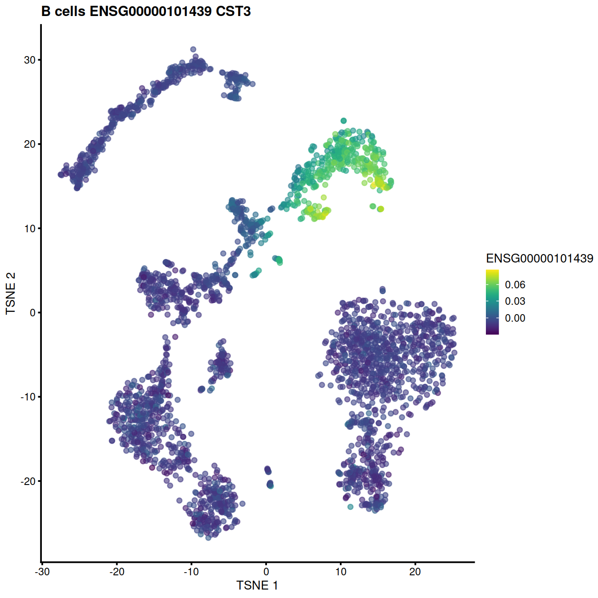
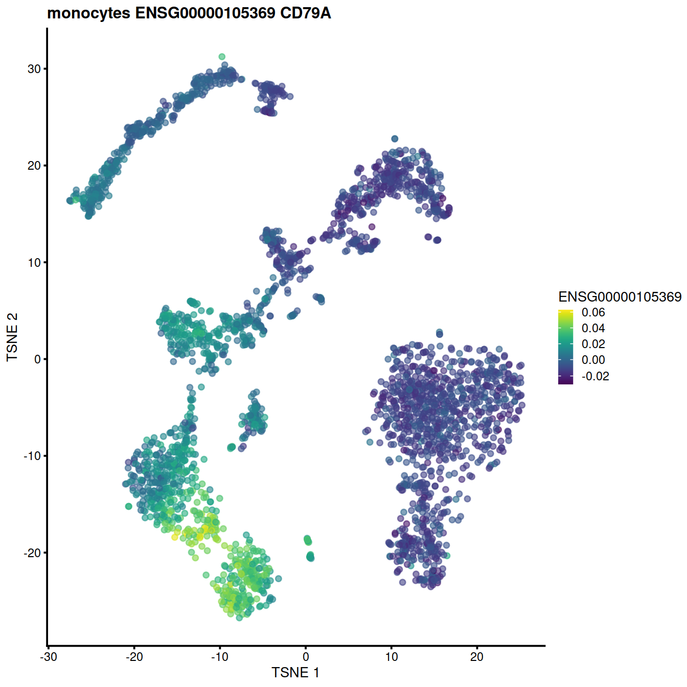
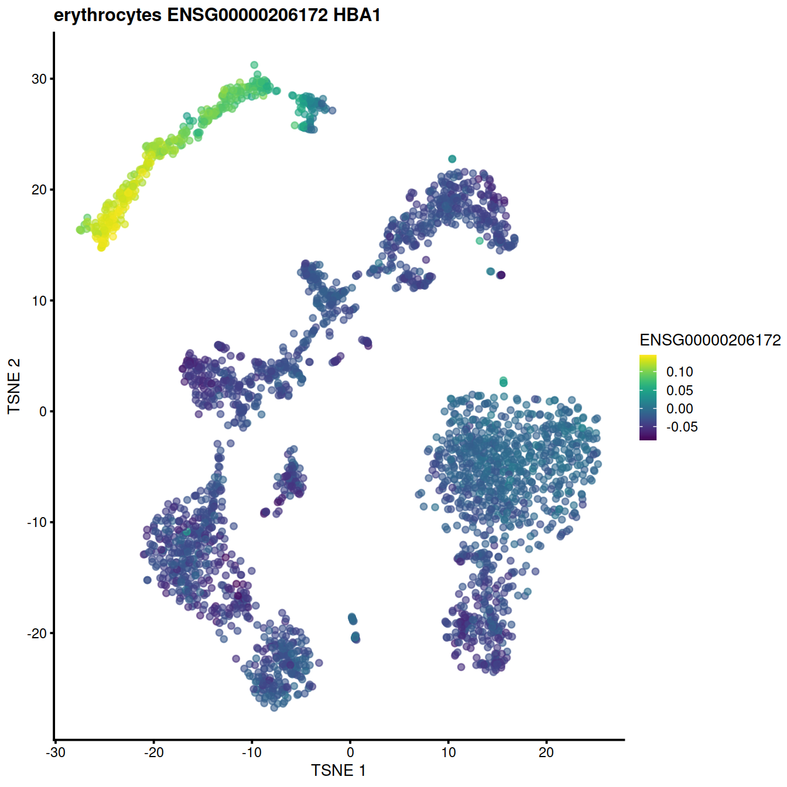
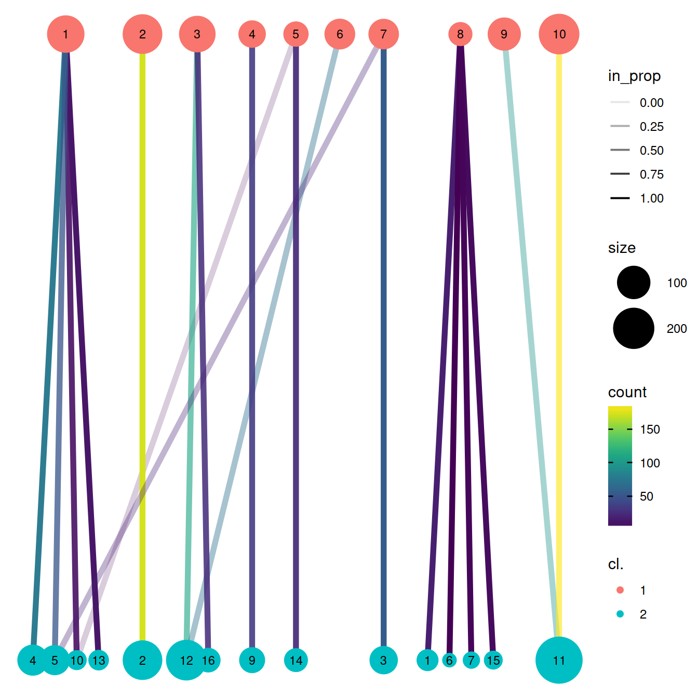
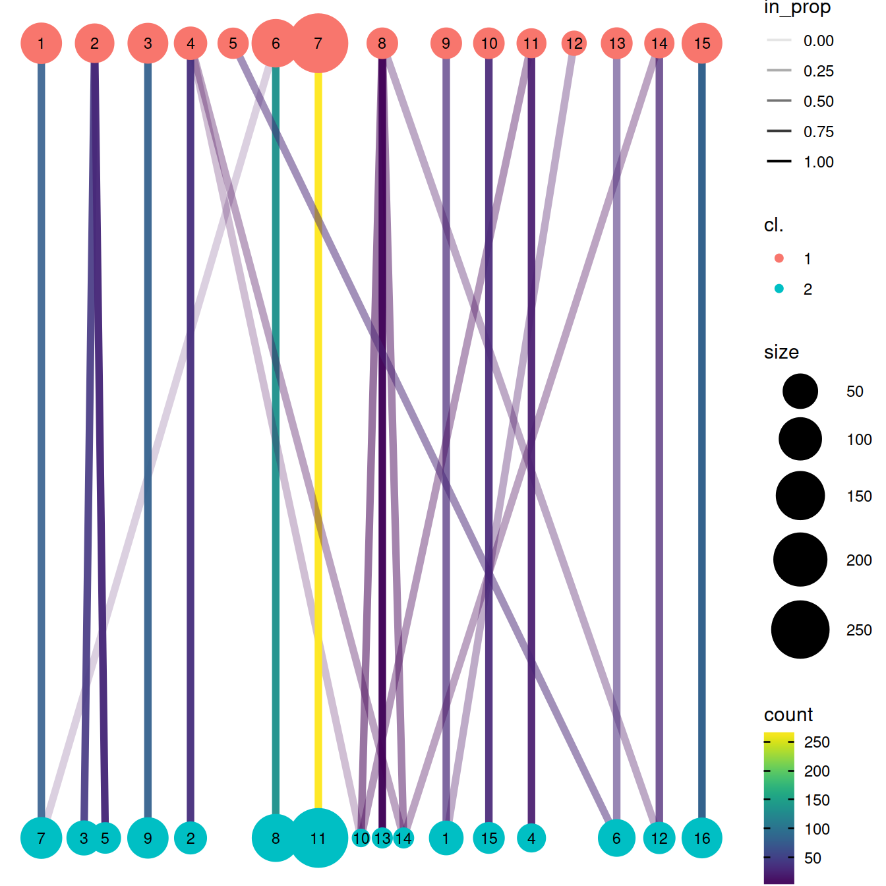
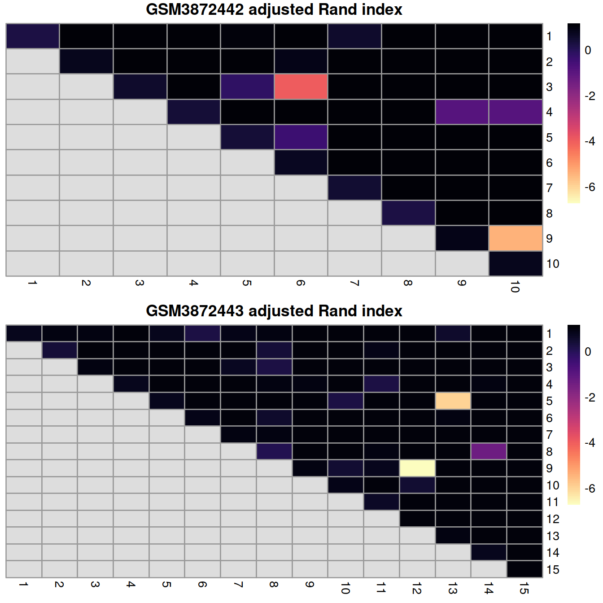
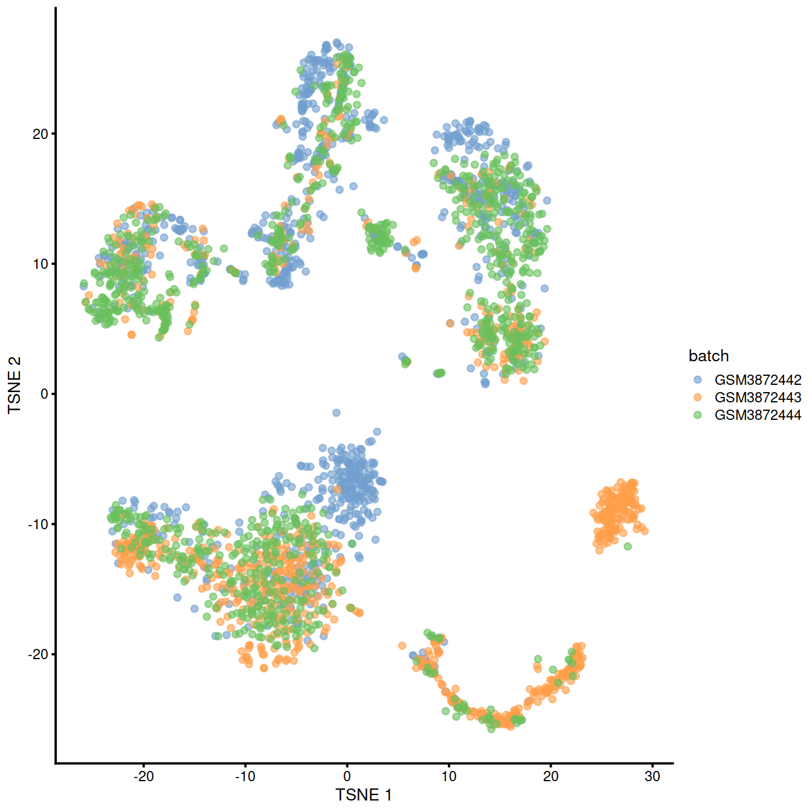
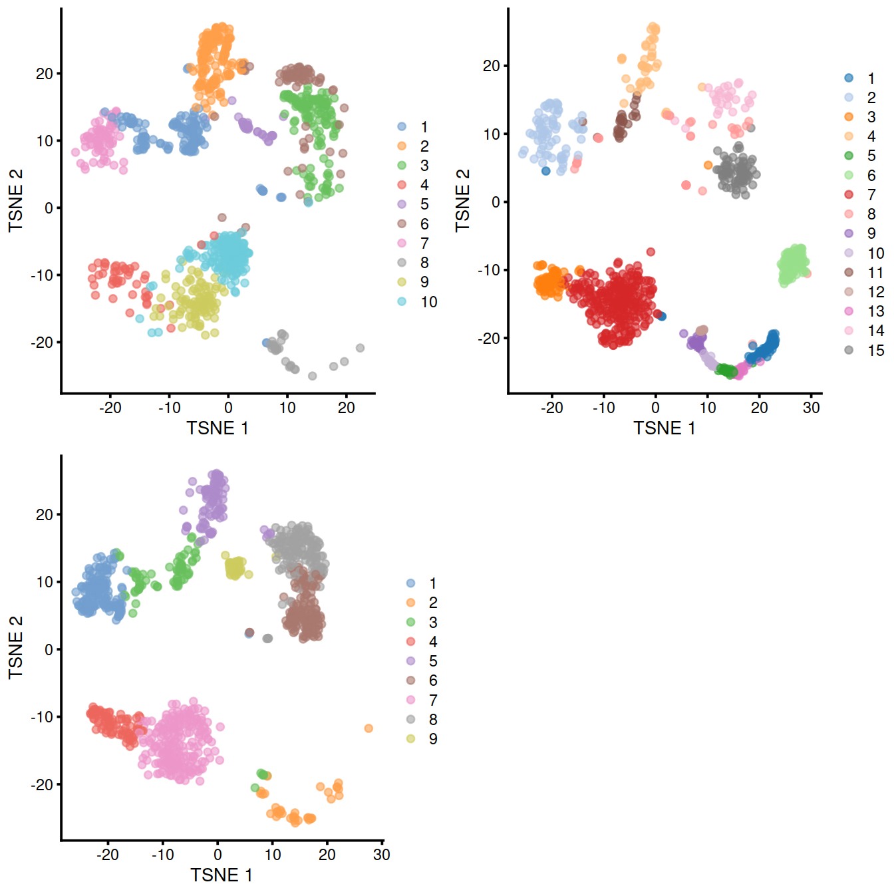
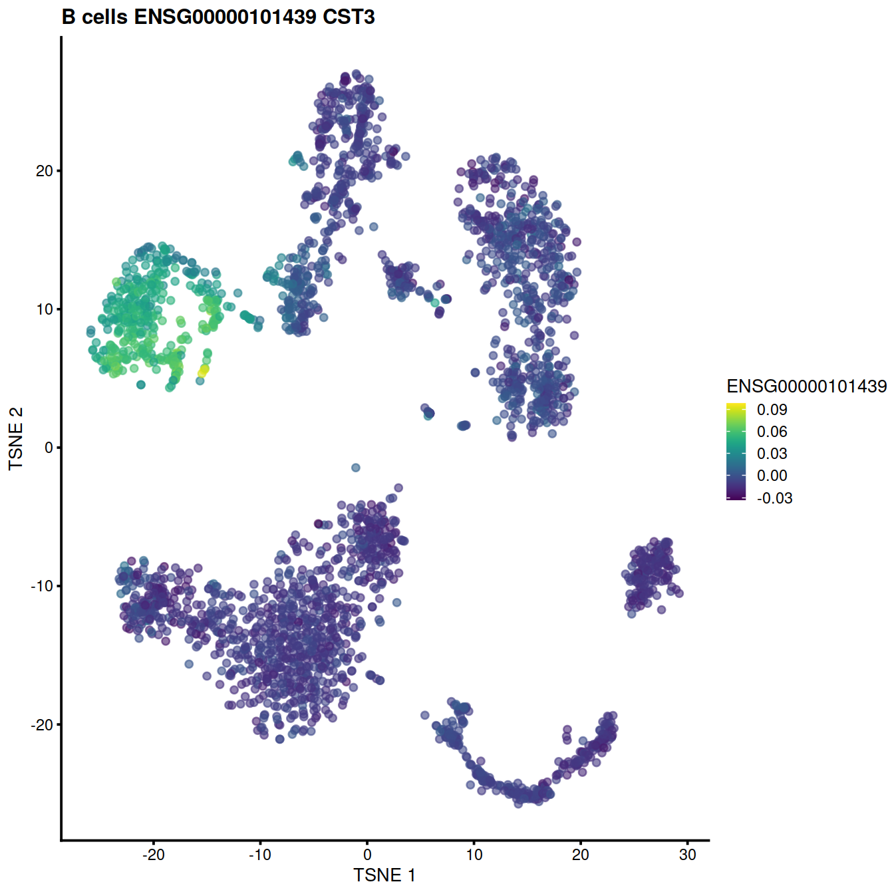

# Data integration - PBMMC {#DataIntegration_PBMMCTop}


```r
projDir <- params$projDir
dirRel <- params$dirRel
outDirBit <- params$outDirBit
cacheBool <- params$cacheBool
setName <- params$setName
splSetToGet <- params$splSetToGet
setSuf <- params$setSuf
dsiSuf <- params$dsiSuf # 'dsi' for data set integration

if(params$bookType == "mk"){
	setName <- "caron"
	splSetToGet <- "PBMMC"
	setSuf <- "_allCells"
}
nbPcToComp <- 50
figSize <- 7
```


Source: ['Integrating Datasets'](https://osca.bioconductor.org/integrating-datasets.html) chapter in the OSCA book. Its text is reproduced below with few modifications to adapt it to the data set under scrutiny here.

## Abbreviations

* HVG: highly variable genes
* MNN: mutual nearest neighbors
* PBMMC: peripheral blood mononuclear cell
* SCE: SingleCellExperiment

## Motivation

Large single-cell RNA sequencing (scRNA-seq) projects usually need to generate data across multiple batches due to logistical constraints. However, the processing of different batches is often subject to uncontrollable differences, e.g., changes in operator, differences in reagent quality. This results in systematic differences in the observed expression in cells from different batches, which we refer to as “batch effects”. Batch effects are problematic as they can be major drivers of heterogeneity in the data, masking the relevant biological differences and complicating interpretation of the results.

Computational correction of these effects is critical for eliminating batch-to-batch variation, allowing data across multiple batches to be combined for common downstream analysis. However, existing methods based on linear models (Ritchie et al. 2015; Leek et al. 2012) assume that the composition of cell populations are either known or the same across batches. To overcome these limitations, bespoke methods have been developed for batch correction of single-cell data (Haghverdi et al. 2018; Butler et al. 2018; Lin et al. 2019) that do not require a priori knowledge about the composition of the population. This allows them to be used in workflows for exploratory analyses of scRNA-seq data where such knowledge is usually unavailable.

## Loading the data

We will load the R file keeping the SCE object with the normalised counts, and subset 1000 cells per sample.


```r
tmpFn <- sprintf("%s/%s/Robjects/%s_sce_nz_postDeconv%s.Rds", projDir, outDirBit, setName, setSuf)

print(tmpFn)
```

```
## [1] "/ssd/personal/baller01/20200511_FernandesM_ME_crukBiSs2020/AnaWiSce/AnaCourse1/Robjects/caron_sce_nz_postDeconv_allCells.Rds"
```

```r
if(!file.exists(tmpFn))
{
	knitr::knit_exit()
}
sce <- readRDS(tmpFn)
sce
```

```
## class: SingleCellExperiment 
## dim: 18431 47830 
## metadata(0):
## assays(2): counts logcounts
## rownames(18431): ENSG00000238009 ENSG00000237491 ... ENSG00000275063
##   ENSG00000271254
## rowData names(11): ensembl_gene_id external_gene_name ... detected
##   gene_sparsity
## colnames: NULL
## colData names(17): Sample Barcode ... cell_sparsity sizeFactor
## reducedDimNames(0):
## altExpNames(0):
```

```r
colnames(rowData(sce))[colnames(rowData(sce)) == "strand"] <- "strandNum"
```

We next subset the data for the PBMMC sample group:


```r
# CaronBourque2020
cb_sampleSheetFn <- file.path(projDir, "Data/CaronBourque2020/SraRunTable.txt")
cb_sampleSheet <- read.table(cb_sampleSheetFn, header=T, sep=",")
splVec <- cb_sampleSheet %>% filter(source_name == splSetToGet) %>%
	pull(Sample.Name) %>% unique()

sourceNames <- unique(colData(sce)$source_name)
sceOrig <- sce
sce <- sceOrig[,sce$source_name == splSetToGet ]
nbCells <- 1000
all.sce <- list()
for(spx in splVec)
{
	vec.bc <- colData(sce) %>%
		data.frame() %>%
		filter(Sample.Name == spx) %>%
		sample_n(nbCells) %>%
		pull(Barcode)
	tmpInd <- which(colData(sce)$Barcode %in% vec.bc)
	
	all.sce[[spx]] <- sce[,tmpInd]
}
nbSpl <- length(all.sce)
```

We then apply the standard workflow to each sample separately:
* normalisation,
* variance modelling
* dimensionality reduction
* clustering


```r
#--- normalization ---#
# use logNormCounts()
all.sce <- lapply(all.sce, logNormCounts)

#--- variance-modelling ---#
# model varaince with modelGeneVar()
# find highly variable genes (HVGs) with getTopHVGs()
#library(scran)
all.dec <- lapply(all.sce, modelGeneVar)
all.hvgs <- lapply(all.dec, getTopHVGs, prop=0.1)

#--- dimensionality-reduction ---#
# use runPCA()
# then compute embeddings with runTSNE() and runUMAP()
library(BiocSingular)
set.seed(10000)
all.sce <- mapply(FUN=runPCA, x=all.sce, subset_row=all.hvgs, 
    MoreArgs=list(ncomponents=25, BSPARAM=RandomParam()), 
    SIMPLIFY=FALSE)

set.seed(100000)
all.sce <- lapply(all.sce, runTSNE, dimred="PCA")

set.seed(1000000)
all.sce <- lapply(all.sce, runUMAP, dimred="PCA")

#--- clustering ---#
# cluster each sample separately
for (n in names(all.sce)) {
    g <- buildSNNGraph(all.sce[[n]], k=10, use.dimred='PCA')
    clust <- igraph::cluster_walktrap(g)$membership
    colLabels(all.sce[[n]])  <- factor(clust)
}
```

To prepare for the batch correction:

* We subset all batches to the common “universe” of features. In this case, it is straightforward as both batches use Ensembl gene annotation.


```r
allNames <- unlist(lapply(all.sce, function(x){rownames(x)}))
allNamesNb <- table(allNames)
universe <- names(allNamesNb)[allNamesNb==nbSpl] 
#length(universe)
```

* The size of this common “universe” of features here is the number of features shared by all 3 samples is: 18431.


```r
# Subsetting the SingleCellExperiment object.
uni.sce <- lapply(all.sce, function(x){x[universe,]})
# Also subsetting the variance modelling results, for convenience.
uni.dec <- lapply(all.dec, function(x){x[universe,]})
```

* We rescale each batch to adjust for differences in sequencing depth between batches. The `multiBatchNorm()` function recomputes log-normalized expression values after adjusting the size factors for systematic differences in coverage between SingleCellExperiment (SCE) objects. (Size factors only remove biases between cells within a single batch.) This improves the quality of the correction by removing one aspect of the technical differences between batches.


```r
# rescale each batch to adjust for differences in sequencing depth between batches
#library(batchelor)
rescaled <- multiBatchNorm(uni.sce, batch = "Sample.Name")
```

* We perform feature selection by averaging the variance components across all batches with the `combineVar()` function. We compute the average as it is responsive to batch-specific highly-variable genes (HVGs) while still preserving the within-batch ranking of genes.


```r
library(scran)
# compute average variance components across samples
combined.dec <- combineVar(uni.dec[[1]], uni.dec[[2]], uni.dec[[3]])
# identify highly variables genes
# here as those with a positive biological component
chosen.hvgs <- combined.dec$bio > 0
# sum(chosen.hvgs)
```

Number of HVGs: 8604.

When integrating datasets of variable composition, it is generally safer to err on the side of including more genes than are used in a single dataset analysis, to ensure that markers are retained for any dataset-specific subpopulations that might be present. For a top X selection, this means using a larger X (say, ~5000), or in this case, we simply take all genes above the trend.

Alternatively, a more forceful approach to feature selection can be used based on marker genes from within-batch comparisons.

## Diagnosing batch effects

Before we actually perform any correction, it is worth examining whether there is any batch effect in this dataset. We combine the three SCE  objects and perform a PCA on the log-expression values for all genes with positive (average) biological components.


```r
# Synchronizing the metadata for cbind()ing.

# before concatenating matrices,
# check that features are identical in all matrices: 
identical(rowData(rescaled[[1]]), rowData(rescaled[[2]]))
```

```
## [1] TRUE
```

```r
identical(rowData(rescaled[[1]]), rowData(rescaled[[3]]))
```

```
## [1] TRUE
```

```r
# have a 'batch' entry in cell meta data:
# (not strikly necessary as any column can be used)
rescaled2 <- lapply(rescaled, function(x){x$batch <- x$Sample.Name; x})
rescaled <- rescaled2
rm(rescaled2)

# concat matrices:
uncorrected <- cbind(rescaled[[1]], rescaled[[2]], rescaled[[3]])

# Perform PCA
# Using RandomParam() as it is more efficient for file-backed matrices.
#library(scater)
set.seed(0010101010)
uncorrected <- runPCA(uncorrected,
		      subset_row=chosen.hvgs,
		      BSPARAM=BiocSingular::RandomParam())
```

We use graph-based clustering on the components to obtain a summary of the population structure.

As the samples should be replicates, each cluster should ideally consist of cells from each batch. However, we instead see clusters that are comprised of cells from a single batch. This indicates that cells of the same type are artificially separated due to technical differences between batches.


```r
#library(scran)
# build shared nearest-neighbour graph
snn.gr <- buildSNNGraph(uncorrected, use.dimred="PCA")
# identify cluster with the walk trap method
clusters <- igraph::cluster_walktrap(snn.gr)$membership
# get number of cells for each {cluster, batch} pair
tab <- table(Cluster=clusters, Batch=uncorrected$batch)
#tab
```


```r
tmpMat <- data.frame("clusters"=clusters, "batch"=uncorrected$batch)
```


Cluster size and cell contribution by sample:


```r
tmpMatTab <- table(tmpMat)
sortVecNames <- tmpMatTab %>% rowSums %>% sort(decreasing=TRUE) %>% names
tmpMat$clusters <- factor(tmpMat$clusters, levels=sortVecNames)
tmpMatDf <- tmpMatTab[sortVecNames,] %>% data.frame()
p1 <- ggplot(data=tmpMatDf, aes(x=clusters,y=Freq, fill=batch)) +
	geom_col() +
  ggtitle("uncorrected, cell numbers")
p2 <- ggplot(data=tmpMat, aes(x=clusters, fill=batch)) +
  geom_bar(position = "fill") +
  scale_y_continuous(labels = scales::percent) +
  ggtitle("uncorrected, proportions")
```

```r
gridExtra::grid.arrange(p1, p2)
```


We can also visualize the uncorrected coordinates using a t-SNE plot. The strong separation between cells from different batches is consistent with the clustering results.


```r
set.seed(1111001)
uncorrected <- runTSNE(uncorrected, dimred="PCA")
plotTSNE(uncorrected, colour_by="batch")
```


Of course, the other explanation for batch-specific clusters is that there are cell types that are unique to each batch. The degree of intermingling of cells from different batches is not an effective diagnostic when the batches involved might actually contain unique cell subpopulations (which is not a consideration in the PBMMC dataset, but the same cannot be said in general). If a cluster only contains cells from a single batch, one can always debate whether that is caused by a failure of the correction method or if there is truly a batch-specific subpopulation. For example, do batch-specific metabolic or differentiation states represent distinct subpopulations? Or should they be merged together? We will not attempt to answer this here, only noting that each batch correction algorithm will make different (and possibly inappropriate) decisions on what constitutes “shared” and “unique” populations.

## Linear regression

Batch effects in bulk RNA sequencing studies are commonly removed with linear regression. This involves fitting a linear model to each gene’s expression profile, setting the undesirable batch term to zero and recomputing the observations sans the batch effect, yielding a set of corrected expression values for downstream analyses. Linear modelling is the basis of the `removeBatchEffect()` function from the `limma` package (Ritchie et al. 2015) as well the `comBat()` function from the `sva` package (Leek et al. 2012).

To use this approach in a scRNA-seq context, we assume that the composition of cell subpopulations is the same across batches. We also assume that the batch effect is additive, i.e., any batch-induced fold-change in expression is the same across different cell subpopulations for any given gene. These are strong assumptions as batches derived from different individuals will naturally exhibit variation in cell type abundances and expression. Nonetheless, they may be acceptable when dealing with batches that are technical replicates generated from the same population of cells. (In fact, when its assumptions hold, linear regression is the most statistically efficient as it uses information from all cells to compute the common batch vector.) Linear modelling can also accommodate situations where the composition is known a priori by including the cell type as a factor in the linear model, but this situation is even less common.

We use the `rescaleBatches()` function from the `batchelor` package to remove the batch effect. This is roughly equivalent to applying a linear regression to the log-expression values per gene, with some adjustments to improve performance and efficiency. For each gene, the mean expression in each batch is scaled down until it is equal to the lowest mean across all batches. We deliberately choose to scale all expression values down as this mitigates differences in variance when batches lie at different positions on the mean-variance trend. (Specifically, the shrinkage effect of the pseudo-count is greater for smaller counts, suppressing any differences in variance across batches.) An additional feature of `rescaleBatches()` is that it will preserve sparsity in the input matrix for greater efficiency, whereas other methods like `removeBatchEffect()` will always return a dense matrix.


```r
#library(batchelor)
rescaled2 <- rescaleBatches(rescaled)
rescaled2
```

```
## class: SingleCellExperiment 
## dim: 18431 3000 
## metadata(0):
## assays(1): corrected
## rownames(18431): ENSG00000000003 ENSG00000000419 ... ENSG00000285486
##   ENSG00000285492
## rowData names(0):
## colnames: NULL
## colData names(1): batch
## reducedDimNames(0):
## altExpNames(0):
```

After clustering, we should observe that most clusters consist of mixtures of cells from the replicate batches, consistent with the removal of the batch effect.


```r
set.seed(1010101010) # To ensure reproducibility of IRLBA.
rescaled2 <- runPCA(rescaled2, subset_row=chosen.hvgs, exprs_values="corrected")

snn.gr <- buildSNNGraph(rescaled2, use.dimred="PCA")
clusters.resc <- igraph::cluster_walktrap(snn.gr)$membership
#tab.resc <- table(Cluster=clusters.resc, Batch=rescaled2$batch)
#tab.resc
```

<!-- Cluster size and cell contribution by sample: -->


```r
tmpMat <- data.frame("clusters"=clusters.resc, "batch"=rescaled2$batch)
```


Cluster size and cell contribution by sample, with clusters sorted by size:


```r
tmpMatTab <- table(tmpMat)
sortVecNames <- tmpMatTab %>% rowSums %>% sort(decreasing=TRUE) %>% names
tmpMat$clusters <- factor(tmpMat$clusters, levels=sortVecNames)
tmpMatDf <- tmpMatTab[sortVecNames,] %>% data.frame()
p1 <- ggplot(data=tmpMatDf, aes(x=clusters,y=Freq, fill=batch)) +
	geom_col()
p2 <- ggplot(data=tmpMat, aes(x=clusters, fill=batch)) +
  geom_bar(position = "fill") +
  scale_y_continuous(labels = scales::percent)
```

```r
gridExtra::grid.arrange(p1, p2)
```


Compute and plot t-SNE:


```r
rescaled2 <- runTSNE(rescaled2, dimred="PCA")
rescaled2$batch <- factor(rescaled2$batch)
plotTSNE(rescaled2, colour_by="batch")
```


## Performing MNN correction

### Algorithm overview

Consider a cell a in batch A, and identify the cells in batch B that are nearest neighbors to a in the expression space defined by the selected features. Repeat this for a cell b in batch B, identifying its nearest neighbors in A. Mutual nearest neighbors (MNN) are pairs of cells from different batches that belong in each other’s set of nearest neighbors. The reasoning is that MNN pairs represent cells from the same biological state prior to the application of a batch effect - see Haghverdi et al. (2018) for full theoretical details. Thus, the difference between cells in MNN pairs can be used as an estimate of the batch effect, the subtraction of which yields batch-corrected values.

Compared to linear regression, MNN correction does not assume that the population composition is the same or known beforehand. This is because it learns the shared population structure via identification of MNN pairs and uses this information to obtain an appropriate estimate of the batch effect. Instead, the key assumption of MNN-based approaches is that the batch effect is orthogonal to the biology in high-dimensional expression space. Violations reduce the effectiveness and accuracy of the correction, with the most common case arising from variations in the direction of the batch effect between clusters. Nonetheless, the assumption is usually reasonable as a random vector is very likely to be orthogonal in high-dimensional space.

### Application to the data

The `batchelor` package provides an implementation of the MNN approach via the `fastMNN()` function. (Unlike the MNN method originally described by Haghverdi et al. (2018), the `fastMNN()` function performs PCA to reduce the dimensions beforehand and speed up the downstream neighbor detection steps.) We apply it to our batches to remove the batch effect across the highly variable genes in `chosen.hvgs`. To reduce computational work and technical noise, all cells in all batches are projected into the low-dimensional space defined by the top d principal components. Identification of MNNs and calculation of correction vectors are then performed in this low-dimensional space.


```r
# Using randomized SVD here, as this is faster than 
# irlba for file-backed matrices.
set.seed(1000101001)
mnn.out <- fastMNN(rescaled,
		   auto.merge=TRUE,
		   d=50,
		   k=20,
		   subset.row=chosen.hvgs,
		   BSPARAM=BiocSingular::RandomParam(deferred=TRUE))
mnn.out
```

```
## class: SingleCellExperiment 
## dim: 8604 3000 
## metadata(2): merge.info pca.info
## assays(1): reconstructed
## rownames(8604): ENSG00000000003 ENSG00000000457 ... ENSG00000285458
##   ENSG00000285476
## rowData names(1): rotation
## colnames: NULL
## colData names(1): batch
## reducedDimNames(1): corrected
## altExpNames(0):
```

```r
mnn.out.corre.dim <- dim(reducedDim(mnn.out, "corrected"))
mnn.out.corre.dim
```

```
## [1] 3000   50
```

```r
mnn.out.recon.dim <- dim(assay(mnn.out, "reconstructed"))
mnn.out.recon.dim
```

```
## [1] 8604 3000
```

The function returns a SCE object containing corrected values for downstream analyses like clustering or visualization. Each column of `mnn.out` corresponds to a cell in one of the batches, while each row corresponds to an input gene in chosen.hvgs. The batch field in the column metadata contains a vector specifying the batch of origin of each cell.


```r
print(head(mnn.out$batch))
```

```
## [1] "GSM3872442" "GSM3872442" "GSM3872442" "GSM3872442" "GSM3872442"
## [6] "GSM3872442"
```

The corrected matrix in the `reducedDims()` contains the low-dimensional corrected coordinates for all cells, which we will use in place of the principal components (PCs) in our downstream analyses (3000 cells and 50 PCs).

A `reconstructed` matrix in the `assays()` contains the corrected expression values for each gene in each cell, obtained by projecting the low-dimensional coordinates in corrected back into gene expression space (8604 genes and 3000 cells). We do not recommend using this for anything other than visualization.


```r
print(assay(mnn.out, "reconstructed"))
```

```
## <8604 x 3000> matrix of class LowRankMatrix and type "double":
##                          [,1]          [,2]          [,3] ...       [,2999]
## ENSG00000000003 -9.693175e-05  1.177007e-04 -1.673004e-04   .  2.055355e-04
## ENSG00000000457  3.065863e-04  2.538019e-04  9.322986e-04   . -1.994157e-04
## ENSG00000000938 -9.292932e-04 -2.415617e-03  1.404325e-03   . -2.982403e-03
## ENSG00000001167  1.860307e-04 -3.200527e-04  3.171867e-04   . -3.775970e-04
## ENSG00000001461 -5.302109e-04  9.167783e-04 -9.285246e-04   . -2.790526e-04
##             ...             .             .             .   .             .
## ENSG00000285437 -1.471949e-03 -2.137265e-03 -3.891309e-03   . -2.256149e-03
## ENSG00000285444  7.318343e-05 -1.387095e-04 -3.779627e-04   . -3.413362e-04
## ENSG00000285447 -1.167881e-04 -5.224395e-05 -2.945133e-04   .  1.850214e-04
## ENSG00000285458 -2.076950e-05  1.076314e-05  1.810845e-04   .  9.591474e-05
## ENSG00000285476 -5.965583e-05  6.250964e-05 -1.062484e-04   .  7.862604e-05
##                       [,3000]
## ENSG00000000003 -2.514390e-04
## ENSG00000000457  1.265962e-04
## ENSG00000000938 -1.385492e-03
## ENSG00000001167 -5.522563e-05
## ENSG00000001461  3.146520e-04
##             ...             .
## ENSG00000285437  1.192830e-03
## ENSG00000285444  1.041148e-04
## ENSG00000285447  2.203375e-04
## ENSG00000285458  1.915324e-04
## ENSG00000285476 -7.949445e-05
```

The most relevant parameter for tuning `fastMNN()` is `k`, which specifies the number of nearest neighbors to consider when defining MNN pairs. This can be interpreted as the minimum anticipated frequency of any shared cell type or state in each batch. Increasing `k` will generally result in more aggressive merging as the algorithm is more generous in matching subpopulations across batches. It can occasionally be desirable to increase `k` if one clearly sees that the same cell types are not being adequately merged across batches.

<!--
See Chapter 32 for an example of a more complex fastMNN() merge involving several human pancreas datasets generated by different authors on different patients with different technologies.
-->

## Correction diagnostics

### Mixing between batches

We cluster on the low-dimensional corrected coordinates to obtain a partitioning of the cells that serves as a proxy for the population structure. If the batch effect is successfully corrected, clusters corresponding to shared cell types or states should contain cells from multiple batches. We see that most clusters contain contributions from each batch after correction, consistent with our expectation that the batches are replicates of each other.


```r
#library(scran)
snn.gr <- buildSNNGraph(mnn.out, use.dimred="corrected")
clusters.mnn <- igraph::cluster_walktrap(snn.gr)$membership
tab.mnn <- table(Cluster=clusters.mnn, Batch=mnn.out$batch)
tab.mnn
```

```
##        Batch
## Cluster GSM3872442 GSM3872443 GSM3872444
##      1          16         46         11
##      2         176         38         96
##      3          54         48        144
##      4          77         23         36
##      5          68         32         48
##      6           1         62         14
##      7           3         89          7
##      8           0        139          2
##      9          37         86         65
##      10          9          6          3
##      11        297        267        230
##      12        191         35        185
##      13         11          7          9
##      14         25          7         39
##      15          6         33          9
##      16         29         82        102
```

Cluster size and cell contribution by sample, with clusters sorted by size:


```r
tmpMat <- data.frame("clusters"=clusters.mnn, "batch"=mnn.out$batch)
tmpMatTab <- table(tmpMat)
sortVecNames <- tmpMatTab %>% rowSums %>% sort(decreasing=TRUE) %>% names
tmpMat$clusters <- factor(tmpMat$clusters, levels=sortVecNames)
tmpMatTab <- table(tmpMat)
tmpMatDf <- tmpMatTab[sortVecNames,] %>% data.frame()
p1 <- ggplot(data=tmpMatDf, aes(x=clusters,y=Freq, fill=batch)) +
	geom_col()
p2 <- ggplot(data=tmpMat, aes(x=clusters, fill=batch)) +
  geom_bar(position = "fill") +
  scale_y_continuous(labels = scales::percent)
```

```r
gridExtra::grid.arrange(p1, p2)
```


We can also compute the variation in the log-abundances to rank the clusters with the greatest variability in their proportional abundances across batches. We can then focus on batch-specific clusters that may be indicative of incomplete batch correction. Obviously, though, this diagnostic is subject to interpretation as the same outcome can be caused by batch-specific populations; some prior knowledge about the biological context is necessary to distinguish between these two possibilities.


```r
# Avoid minor difficulties with the 'table' class.
tab.mnn <- unclass(tab.mnn)

# Using a large pseudo.count to avoid unnecessarily
# large variances when the counts are low.
norm <- normalizeCounts(tab.mnn, pseudo_count=10)

# Ranking clusters by the largest variances.
rv <- rowVars(norm) %>% round(2)

# show
DataFrame(Batch=tab.mnn, var=rv)[order(rv, decreasing=TRUE),]
```

```
## DataFrame with 16 rows and 4 columns
##     Batch.GSM3872442 Batch.GSM3872443 Batch.GSM3872444       var
##            <integer>        <integer>        <integer> <numeric>
## 8                  0              139                2      4.74
## 7                  3               89                7      2.53
## 6                  1               62               14      1.85
## 12               191               35              185      1.52
## 2                176               38               96      0.96
## ...              ...              ...              ...       ...
## 9                 37               86               65      0.27
## 5                 68               32               48      0.20
## 10                 9                6                3      0.08
## 11               297              267              230      0.03
## 13                11                7                9      0.02
```

We can also visualize the corrected coordinates using a t-SNE plot. The presence of visual clusters containing cells from all batches provides a comforting illusion that the correction was successful.


```r
#library(scater)
set.seed(0010101010)
mnn.out <- runTSNE(mnn.out, dimred="corrected")

mnn.out$batch <- factor(mnn.out$batch)
plotTSNE(mnn.out, colour_by="batch")
```


```r
#mnn.out$type <- gsub("_[1-4]","",mnn.out$batch)
#p <- plotTSNE(mnn.out, colour_by="batch", shape_by="type")
#p + facet_wrap(. ~ mnn.out$type)
```

For `fastMNN()`, one useful diagnostic is the proportion of variance within each batch that is lost during MNN correction. Specifically, this refers to the within-batch variance that is removed during orthogonalization with respect to the average correction vector at each merge step. This is returned via the `lost.var` field in the metadata of `mnn.out`, which contains a matrix of the variance lost in each batch (column) at each merge step (row).


```r
round(metadata(mnn.out)$merge.info$lost.var,2)
```

```
##      GSM3872442 GSM3872443 GSM3872444
## [1,]       0.03       0.00       0.04
## [2,]       0.02       0.17       0.03
```

Large proportions of lost variance (>10%) suggest that correction is removing genuine biological heterogeneity. This would occur due to violations of the assumption of orthogonality between the batch effect and the biological subspace (Haghverdi et al. 2018). In this case, the proportion of lost variance is small, indicating that non-orthogonality is not a major concern.

The following t-SNE shows the clusters identified:


```r
mnn.out$cluster <- paste0("c", clusters.mnn)
plotTSNE(mnn.out, colour_by="cluster")
```


The following t-SNE plots show expression levels of known cell type marker genes.


```r
genesToShow <- c(
		 "CD79A", # CD79A 	B ***
		 "CST3", # CST3 	monocytes ***
		 "CD3D", # CD3D 	 T cells ***
		 "HBA1" # HBA1 	 erythrocytes ***
	 	)

tmpInd <- which(rowData(uncorrected)$Symbol %in% genesToShow)
ensToShow <- rowData(uncorrected)$ensembl_gene_id[tmpInd]
```

B cells:


```r
genex <- ensToShow[1]
	p <- plotTSNE(mnn.out, colour_by = genex, by_exprs_values="reconstructed")
	p <- p + ggtitle(
			paste("B cells", genex,
			rowData(uncorrected)[genex,"Symbol"])
		)
	print(p)
```



T cells:


```r
genex <- ensToShow[3]
	p <- plotTSNE(mnn.out, colour_by = genex, by_exprs_values="reconstructed")
	p <- p + ggtitle(
			paste("T cells", genex,
			rowData(uncorrected)[genex,"Symbol"])
		)
	print(p)
```


monocytes:


```r
genex <- ensToShow[2]
	p <- plotTSNE(mnn.out, colour_by = genex, by_exprs_values="reconstructed")
	p <- p + ggtitle(
			paste("monocytes", genex,
			rowData(uncorrected)[genex,"Symbol"])
		)
	print(p)
```



erythrocytes:


```r
genex <- ensToShow[4]
	p <- plotTSNE(mnn.out, colour_by = genex, by_exprs_values="reconstructed")
	p <- p + ggtitle(
			paste("erythrocytes", genex,
			rowData(uncorrected)[genex,"Symbol"])
		)
	print(p)
```



Other genes (exercise)


```r
genesToShow2 <- c(
		 "IL7R", # IL7R, CCR7 	Naive CD4+ T
		 "CCR7", # IL7R, CCR7 	Naive CD4+ T
		 "S100A4", # IL7R, S100A4 	Memory CD4+
		 "CD14", # CD14, LYZ 	CD14+ Mono
		 "LYZ", # CD14, LYZ 	CD14+ Mono
		 "MS4A1", # MS4A1 	B
		 "CD8A", # CD8A 	CD8+ T
		 "FCGR3A", # FCGR3A, MS4A7 	FCGR3A+ Mono
		 "MS4A7", # FCGR3A, MS4A7 	FCGR3A+ Mono
		 "GNLY", # GNLY, NKG7 	NK
		 "NKG7", # GNLY, NKG7 	NK
		 "FCER1A", # DC
		 "CST3", # DC
		 "PPBP" # Platelet
		)
```


```r
tmpInd <- which(rowData(uncorrected)$Symbol %in% genesToShow2)
ensToShow <- rowData(uncorrected)$ensembl_gene_id[tmpInd]
```


```r
for (genex in ensToShow)
{
	p <- plotTSNE(mnn.out, colour_by = genex, by_exprs_values="reconstructed")
	p <- p + ggtitle(paste(genex, rowData(uncorrected)[genex,"Symbol"]))
	print(p)
}
```

## Preserving biological heterogeneity

### Comparison to within-batch clusters

Another useful diagnostic check is to compare the clustering within each batch to the clustering of the merged data. Accurate data integration should preserve variance within each batch as there should be nothing to remove between cells in the same batch. This check complements the previously mentioned diagnostics that only focus on the removal of differences between batches. Specifically, it protects us against cases where the correction method simply aggregates all cells together, which would achieve perfect mixing but also discard the biological heterogeneity of interest.

Ideally, we should see a many-to-1 mapping where the across-batch clustering is nested inside the within-batch clusterings. This indicates that any within-batch structure was preserved after correction while acknowledging that greater resolution is possible with more cells. In practice, more discrepancies can be expected even when the correction is perfect, due to the existence of closely related clusters that were arbitrarily separated in the within-batch clustering. As a general rule, we can be satisfied with the correction if the vast majority of entries are zero, though this may depend on whether specific clusters of interest are gained or lost.

One heatmap is generated for each dataset, where each entry is colored according to the number of cells with each pair of labels (before and after correction), on the log10 scale with a pseudocounts +10 for a smoother color transition (so a minimum value of log10(0+10) == 1). 


```r
#library(pheatmap)

# have common color scale:
# for the number of cells on the log10 scale
breakVec = seq(0, 3, by = 0.2)
colPal <- colorRampPalette(rev(RColorBrewer::brewer.pal(n = 7, name = "RdYlBu")))(length(breakVec))
# Defines the vector of colors for the legend (it has to be of the same length as breakVec)


# For the first batch (adding +10 for a smoother color transition
# from zero to non-zero counts for any given matrix entry).
splIdx <- 1
tab <- table(paste("after", clusters.mnn[rescaled2$batch==splVec[splIdx]]),
    paste("before", colLabels(rescaled[[splIdx]])))
heat1 <- pheatmap(log10(tab+10), cluster_row=FALSE, cluster_col=FALSE,
		main=sprintf("%s comparison (number of cells, log10 scale)", splVec[splIdx]),
		silent=TRUE,
		col=colPal)

library(clustree)
combined <- cbind(cl.1=colLabels(rescaled[[splIdx]]),
		  cl.2=clusters.mnn[rescaled2$batch==splVec[splIdx]])
clustree(combined, prefix="cl.", edge_arrow=FALSE)
```




```r
# For the second batch.
splIdx <- 2
tab <- table(paste("after", clusters.mnn[rescaled2$batch==splVec[splIdx]]),
    paste("before", colLabels(rescaled[[splIdx]])))
heat2 <- pheatmap(log10(tab+10), cluster_row=FALSE, cluster_col=FALSE,
		main=sprintf("%s comparison (number of cells, log10 scale)", splVec[splIdx]),
		silent=TRUE)

#library(clustree)
combined <- cbind(cl.1=colLabels(rescaled[[splIdx]]),
		  cl.2=clusters.mnn[rescaled2$batch==splVec[splIdx]])
clustree(combined, prefix="cl.", edge_arrow=FALSE)
```




```r
gridExtra::grid.arrange(heat1[[4]], heat2[[4]])
```


Another evaluation approach is to compute the **coassignment probabilities**, i.e. the probability that cells from two within-batch clusters are clustered together in the across-batch clustering. High probabilities off the diagonal indicate that within-batch clusters are merged in the across-batch analysis. We would generally expect low off-diagonal probabilities for most pairs of clusters, though this may not be reasonably possible if the within-batch clusters were poorly separated in the first place.

Coassignment probabilities for the within-batch clusters, based on coassignment of cells in the across-batch clusters obtained after MNN correction. One heatmap is generated for each sample, where each entry is colored according to the coassignment probability between each pair of within-batch clusters:


```r
# For the first batch.
splIdx <- 1
tab <- coassignProb(colLabels(rescaled[[splIdx]]), clusters.mnn[rescaled2$batch==splVec[splIdx]])
heat1 <- pheatmap(tab, cluster_row=FALSE, cluster_col=FALSE,
    col=rev(viridis::magma(100)),
    main=sprintf("%s probabilities", splVec[splIdx]),
    silent=TRUE)

# For the second batch.
splIdx <- 2
tab <- coassignProb(colLabels(rescaled[[splIdx]]), clusters.mnn[rescaled2$batch==splVec[splIdx]])
heat2 <- pheatmap(tab, cluster_row=FALSE, cluster_col=FALSE,
    col=rev(viridis::magma(100)),
    main=sprintf("%s probabilities", splVec[splIdx]),
    silent=TRUE)

gridExtra::grid.arrange(heat1[[4]], heat2[[4]])
```


Finally, we can summarize the agreement between clusterings by computing the **Rand index**. This provides a simple metric that we can use to assess the preservation of variation by different correction methods. Larger rand indices (i.e., closer to 1) are more desirable, though this must be balanced against the ability of each method to actually remove the batch effect.


```r
suppressMessages(library(fossil))
ri1 <- rand.index(as.integer(clusters.mnn[rescaled2$batch=="GSM3872443"]),
    as.integer(colLabels(rescaled[[1]])))
#ri1
```


```r
# same as above but with `bluster`
splIdx <- 1

#library(bluster)
ri1 <- pairwiseRand(as.integer(clusters.mnn[rescaled2$batch==splVec[splIdx]]),
		     as.integer(colLabels(rescaled[[splIdx]])),
		     mode="index")
```

Rand index for GSM3872442: 0.64.


```r
splIdx <- 2

ri2 <- pairwiseRand(as.integer(clusters.mnn[rescaled2$batch==splVec[splIdx]]),
		     as.integer(colLabels(rescaled[[splIdx]])),
		     mode="index")
#ri2
```

Rand index for GSM3872443: 0.91

We can also break down the adjusted Rand index (ARI) into per-cluster ratios for more detailed diagnostics. For example, we could see low ratios off the diagonal if distinct clusters in the within-batch clustering were incorrectly aggregated in the merged clustering. Conversely, we might see low ratios on the diagonal if the correction inflated or introduced spurious heterogeneity inside a within-batch cluster.


```r
# For the first batch.
splIdx <- 1

tab <- pairwiseRand(
	as.integer(colLabels(rescaled[[splIdx]])),
  as.integer(clusters.mnn[rescaled2$batch==splVec[splIdx]])
)

heat1 <- pheatmap(tab, cluster_row=FALSE, cluster_col=FALSE,
    col=rev(viridis::magma(100)),
    main=sprintf("%s adjusted Rand index", splVec[splIdx]),
    silent=TRUE)

# For the second batch.
splIdx <- 2

tab <- pairwiseRand(
	as.integer(colLabels(rescaled[[splIdx]])),
  as.integer(clusters.mnn[rescaled2$batch==splVec[splIdx]])
)

heat2 <- pheatmap(tab, cluster_row=FALSE, cluster_col=FALSE,
    col=rev(viridis::magma(100)),
    main=sprintf("%s adjusted Rand index", splVec[splIdx]),
    silent=TRUE)

gridExtra::grid.arrange(heat1[[4]], heat2[[4]])
```


```r
# For the first batch.
splIdx <- 1

tab <- pairwiseRand(
	as.integer(colLabels(rescaled[[splIdx]])),
  as.integer(clusters.mnn[rescaled2$batch==splVec[splIdx]])
)
tab1 <- tab

#heat1 <- pheatmap(tab, cluster_row=FALSE, cluster_col=FALSE,
#    col=rev(viridis::magma(100)),
#    main=sprintf("%s adjusted Rand index", splVec[splIdx]),
#    silent=TRUE)

# For the second batch.
splIdx <- 2

tab <- pairwiseRand(
	as.integer(colLabels(rescaled[[splIdx]])),
  as.integer(clusters.mnn[rescaled2$batch==splVec[splIdx]])
)
tab2 <- tab
rm(tab)

#heat2 <- pheatmap(tab, cluster_row=FALSE, cluster_col=FALSE,
#    col=rev(viridis::magma(100)),
#    main=sprintf("%s adjusted Rand index", splVec[splIdx]),
#    silent=TRUE)

#gridExtra::grid.arrange(heat1[[4]], heat2[[4]])

  ## make breaks from combined range
Breaks <- seq(min(c(tab1, tab2), na.rm = TRUE),
              max(c(tab1, tab2), na.rm = TRUE),
              length = 100)

splIdx <- 1
heat1 <- pheatmap(tab1, cluster_row=FALSE, cluster_col=FALSE,
    col=rev(viridis::magma(100)),
    breaks=Breaks,
    main=sprintf("%s adjusted Rand index", splVec[splIdx]),
    silent=TRUE)

splIdx <- 2
heat2 <- pheatmap(tab2, cluster_row=FALSE, cluster_col=FALSE,
    col=rev(viridis::magma(100)),
    breaks=Breaks,
    main=sprintf("%s adjusted Rand index", splVec[splIdx]),
    silent=TRUE)

gridExtra::grid.arrange(heat1[[4]], heat2[[4]])
```



### Encouraging consistency with marker genes

In some situations, we will already have performed within-batch analyses to characterize salient aspects of population heterogeneity. This is not uncommon when merging datasets from different sources where each dataset has already been analyzed, annotated and interpreted separately. It is subsequently desirable for the integration procedure to retain these “known interesting” aspects of each dataset in the merged dataset. We can encourage this outcome by using the marker genes within each dataset as our selected feature set for `fastMNN()` and related methods. This focuses on the relevant heterogeneity and represents a semi-supervised approach.

To illustrate, we apply this strategy to our datasets. We identify the top marker genes from pairwise Wilcoxon ranked sum tests between every pair of clusters within each batch, analogous to the method used by `[SingleR](https://www.bioconductor.org/packages/release/bioc/html/SingleR.html)`. In this case, we use the top 10 marker genes but any value can be used depending on the acceptable trade-off between signal and noise (and speed). We then take the union across all comparisons in all batches and use that in place of our HVG set in `fastMNN()`.


```r
# Recall that groups for marker detection
# are automatically defined from 'colLabels()'. 
stats1 <- pairwiseWilcox(rescaled[[1]], direction="up")
markers1 <- getTopMarkers(stats1[[1]], stats1[[2]], n=10)

stats2 <- pairwiseWilcox(rescaled[[2]], direction="up")
markers2 <- getTopMarkers(stats2[[1]], stats2[[2]], n=10)

stats3 <- pairwiseWilcox(rescaled[[3]], direction="up")
markers3 <- getTopMarkers(stats3[[1]], stats3[[2]], n=10)

marker.set <- unique(unlist(c(unlist(markers1), unlist(markers2), unlist(markers3))))
length(marker.set) # getting the total number of genes selected in this manner.
```

```
## [1] 435
```

Total number of genes selected in this manner: 435.


```r
set.seed(1000110)
mnn.out2 <- fastMNN(rescaled, subset.row=marker.set,
    BSPARAM=BiocSingular::RandomParam(deferred=TRUE))
# compute t-SNE:
mnn.out2 <- runTSNE(mnn.out2, dimred="corrected")
```

We can also visualize the corrected coordinates using a t-SNE plot:


```r
plotTSNE(mnn.out2, colour_by="batch")
```



A quick inspection indicates that the original within-batch structure is indeed preserved in the corrected data. This highlights the utility of a marker-based feature set for integrating datasets that have already been characterized separately in a manner that preserves existing interpretations of each dataset. We note that some within-batch clusters have merged, most likely due to the lack of robust separation in the first place, though this may also be treated as a diagnostic on the appropriateness of the integration depending on the context.


```r
gridExtra::grid.arrange(
    plotTSNE(mnn.out2[,mnn.out2$batch=="GSM3872442"], colour_by=I(colLabels(rescaled[[1]]))),
    plotTSNE(mnn.out2[,mnn.out2$batch=="GSM3872443"], colour_by=I(colLabels(rescaled[[2]]))),
    plotTSNE(mnn.out2[,mnn.out2$batch=="GSM3872444"], colour_by=I(colLabels(rescaled[[3]]))),
    ncol=2
)
```




```r
# B cells
genex <- ensToShow[1]
p <- plotTSNE(mnn.out2, colour_by = genex, by_exprs_values="reconstructed")
p <- p + ggtitle(
  		paste("B cells", genex,
			rowData(uncorrected)[genex,"Symbol"])
			)
print(p)
```




```r
# cannot find 'ENSG00000115523'
# TODO: use another gene?

# erythrocytes:
genex <- ensToShow[4]
p <- plotTSNE(mnn.out2, colour_by = genex, by_exprs_values="reconstructed")
p <- p + ggtitle(
			paste("erythrocytes", genex,
			rowData(uncorrected)[genex,"Symbol"])
			)
print(p)
```

We suggest limiting the use of per-gene corrected values to visualization, e.g., when coloring points on a t-SNE plot by per-cell expression. This can be more aesthetically pleasing than uncorrected expression values that may contain large shifts on the colour scale between cells in different batches. Use of the corrected values in any quantitative procedure should be treated with caution, and should be backed up by similar results from an analysis on the uncorrected values.


B cells:


```r
m.out <- findMarkers(uncorrected,
                     clusters.mnn,
                     block=uncorrected$batch,
                     direction="up",
                     lfc=1,
                     row.data=rowData(uncorrected)[,c("ensembl_gene_id","Symbol"),
                                                   drop=FALSE])
```

<!-- B cells: -->


Erythrocytes:


```r
demo <- m.out[["11"]] %>% data.frame %>% arrange(FDR)
demo[ensToShow[4],]
```

```
##                 ensembl_gene_id Symbol Top p.value FDR summary.logFC   logFC.1
## ENSG00000206172 ENSG00000206172   HBA1 160       1   1     0.1461401 -2.638346
##                   logFC.2    logFC.3   logFC.4     logFC.5   logFC.6   logFC.7
## ENSG00000206172 0.1126643 -0.3672066 0.0768022 -0.04321104 -5.561042 -5.754414
##                   logFC.8    logFC.9  logFC.10   logFC.12   logFC.13   logFC.14
## ENSG00000206172 -5.734749 -0.2643027 0.1461401 -0.1729262 -0.3015218 0.04455094
##                  logFC.15   logFC.16
## ENSG00000206172 -5.313446 -0.1326186
```

```r
as.data.frame(demo[1:20,c("Symbol", "Top", "p.value", "FDR")]) 
```

```
##                 Symbol Top       p.value           FDR
## ENSG00000161970  RPL26   1 1.381128e-154 2.545558e-150
## ENSG00000105193  RPS16   2 2.109919e-146 1.944396e-142
## ENSG00000171858  RPS21   3 1.151263e-143 7.072978e-140
## ENSG00000071082  RPL31   4 4.726090e-142 2.177664e-138
## ENSG00000100316   RPL3   5 1.558616e-138 5.745372e-135
## ENSG00000166441 RPL27A   6 7.723015e-136 2.372381e-132
## ENSG00000145425  RPS3A   4 1.365755e-135 3.596032e-132
## ENSG00000142937   RPS8   1 3.979392e-135 9.168022e-132
## ENSG00000140988   RPS2   9 1.793490e-134 3.672868e-131
## ENSG00000198755 RPL10A   9 6.611618e-134 1.196538e-130
## ENSG00000131469  RPL27  11 7.141185e-134 1.196538e-130
## ENSG00000110700  RPS13   6 1.027873e-133 1.578727e-130
## ENSG00000197958  RPL12   3 3.133807e-133 4.443015e-130
## ENSG00000143947 RPS27A   9 8.860447e-133 1.166478e-129
## ENSG00000156508 EEF1A1  15 4.768881e-129 5.859684e-126
## ENSG00000198242 RPL23A   7 1.515175e-128 1.745387e-125
## ENSG00000198918  RPL39  16 1.104657e-126 1.197643e-123
## ENSG00000231500  RPS18   9 1.350047e-126 1.382373e-123
## ENSG00000109475  RPL34   5 5.450229e-126 5.287009e-123
## ENSG00000167526  RPL13   4 8.175809e-126 7.534417e-123
```

Expression level for the top gene, ENSG00000161970:


```r
geneEnsId <- rownames(demo)[1]
plotExpression(uncorrected, x=I(factor(clusters.mnn)), 
    features=geneEnsId, colour_by="batch") + facet_wrap(~colour_by)
```


## Session information


```r
sessionInfo()
```

```
## R version 4.0.3 (2020-10-10)
## Platform: x86_64-pc-linux-gnu (64-bit)
## Running under: CentOS Linux 8
## 
## Matrix products: default
## BLAS:   /opt/R/R-4.0.3/lib64/R/lib/libRblas.so
## LAPACK: /opt/R/R-4.0.3/lib64/R/lib/libRlapack.so
## 
## locale:
##  [1] LC_CTYPE=en_GB.UTF-8       LC_NUMERIC=C              
##  [3] LC_TIME=en_GB.UTF-8        LC_COLLATE=en_GB.UTF-8    
##  [5] LC_MONETARY=en_GB.UTF-8    LC_MESSAGES=en_GB.UTF-8   
##  [7] LC_PAPER=en_GB.UTF-8       LC_NAME=C                 
##  [9] LC_ADDRESS=C               LC_TELEPHONE=C            
## [11] LC_MEASUREMENT=en_GB.UTF-8 LC_IDENTIFICATION=C       
## 
## attached base packages:
## [1] parallel  stats4    stats     graphics  grDevices utils     datasets 
## [8] methods   base     
## 
## other attached packages:
##  [1] fossil_0.4.0                shapefiles_0.7             
##  [3] foreign_0.8-81              maps_3.3.0                 
##  [5] sp_1.4-5                    BiocSingular_1.6.0         
##  [7] Cairo_1.5-12.2              clustree_0.4.3             
##  [9] ggraph_2.0.5                pheatmap_1.0.12            
## [11] dplyr_1.0.6                 bluster_1.0.0              
## [13] batchelor_1.6.3             scran_1.18.7               
## [15] scater_1.18.6               SingleCellExperiment_1.12.0
## [17] SummarizedExperiment_1.20.0 Biobase_2.50.0             
## [19] GenomicRanges_1.42.0        GenomeInfoDb_1.26.7        
## [21] IRanges_2.24.1              S4Vectors_0.28.1           
## [23] BiocGenerics_0.36.1         MatrixGenerics_1.2.1       
## [25] matrixStats_0.58.0          ggplot2_3.3.3              
## [27] knitr_1.33                 
## 
## loaded via a namespace (and not attached):
##  [1] Rtsne_0.15                ggbeeswarm_0.6.0         
##  [3] colorspace_2.0-1          ellipsis_0.3.2           
##  [5] scuttle_1.0.4             XVector_0.30.0           
##  [7] BiocNeighbors_1.8.2       farver_2.1.0             
##  [9] graphlayouts_0.7.1        ggrepel_0.9.1            
## [11] RSpectra_0.16-0           fansi_0.4.2              
## [13] codetools_0.2-18          sparseMatrixStats_1.2.1  
## [15] polyclip_1.10-0           jsonlite_1.7.2           
## [17] ResidualMatrix_1.0.0      uwot_0.1.10              
## [19] ggforce_0.3.3             compiler_4.0.3           
## [21] dqrng_0.3.0               backports_1.2.1          
## [23] assertthat_0.2.1          Matrix_1.3-3             
## [25] limma_3.46.0              tweenr_1.0.2             
## [27] htmltools_0.5.1.1         tools_4.0.3              
## [29] rsvd_1.0.5                igraph_1.2.6             
## [31] gtable_0.3.0              glue_1.4.2               
## [33] GenomeInfoDbData_1.2.4    Rcpp_1.0.6               
## [35] jquerylib_0.1.4           vctrs_0.3.8              
## [37] DelayedMatrixStats_1.12.3 xfun_0.23                
## [39] stringr_1.4.0             beachmat_2.6.4           
## [41] lifecycle_1.0.0           irlba_2.3.3              
## [43] statmod_1.4.36            edgeR_3.32.1             
## [45] zlibbioc_1.36.0           MASS_7.3-54              
## [47] scales_1.1.1              tidygraph_1.2.0          
## [49] RColorBrewer_1.1-2        yaml_2.2.1               
## [51] gridExtra_2.3             sass_0.4.0               
## [53] stringi_1.6.1             highr_0.9                
## [55] checkmate_2.0.0           BiocParallel_1.24.1      
## [57] rlang_0.4.11              pkgconfig_2.0.3          
## [59] bitops_1.0-7              evaluate_0.14            
## [61] lattice_0.20-44           purrr_0.3.4              
## [63] labeling_0.4.2            cowplot_1.1.1            
## [65] tidyselect_1.1.1          magrittr_2.0.1           
## [67] bookdown_0.22             R6_2.5.0                 
## [69] generics_0.1.0            DelayedArray_0.16.3      
## [71] DBI_1.1.1                 pillar_1.6.1             
## [73] withr_2.4.2               RCurl_1.98-1.3           
## [75] tibble_3.1.2              crayon_1.4.1             
## [77] utf8_1.2.1                rmarkdown_2.8            
## [79] viridis_0.6.1             locfit_1.5-9.4           
## [81] grid_4.0.3                FNN_1.1.3                
## [83] digest_0.6.27             tidyr_1.1.3              
## [85] munsell_0.5.0             beeswarm_0.3.1           
## [87] viridisLite_0.4.0         vipor_0.4.5              
## [89] bslib_0.2.5
```
