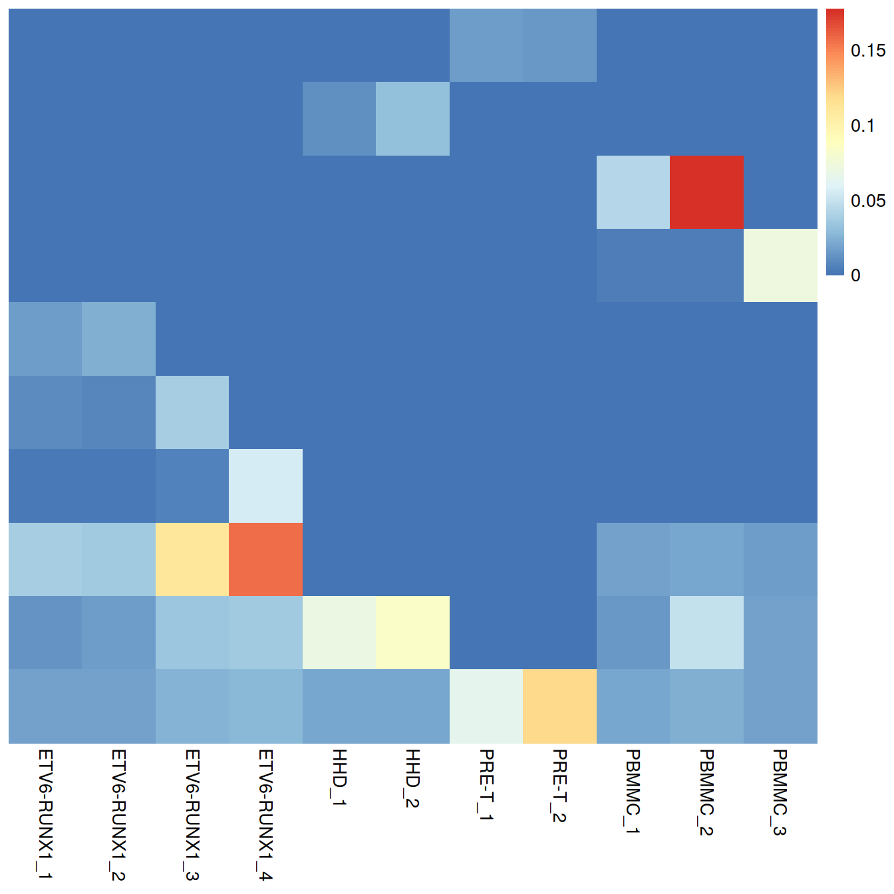
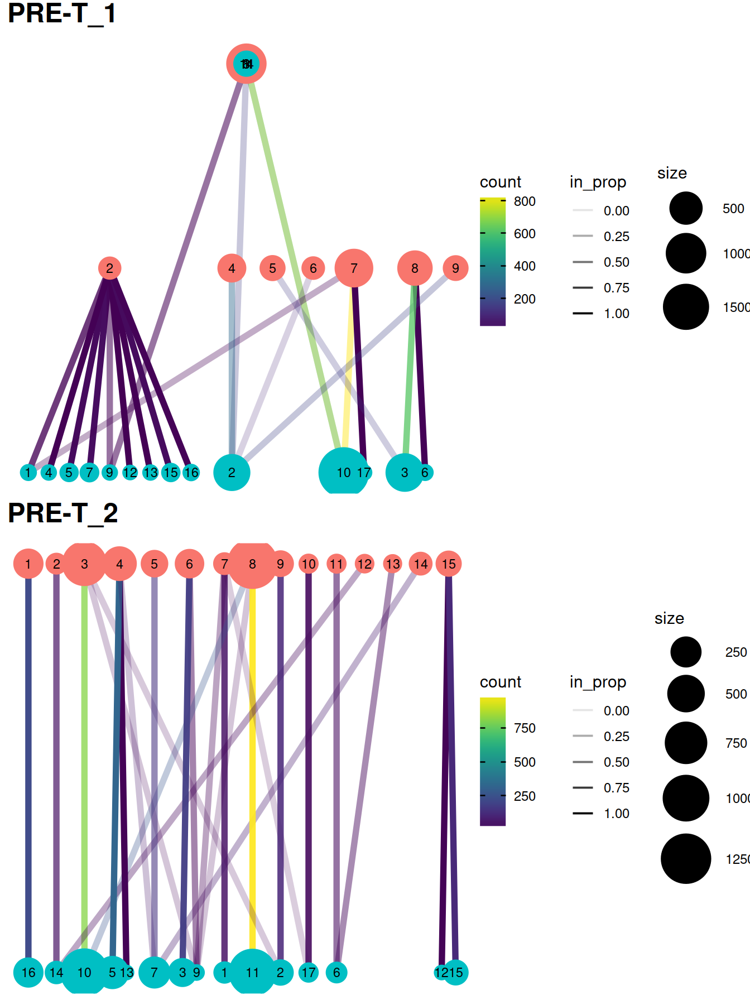

```r
#qcPlotDirBit <- "NormPlots"
#setNameUpp <- "Caron"
projDir <- params$projDir
dirRel <- params$dirRel
outDirBit <- params$outDirBit
cacheBool <- params$cacheBool
```


```r
library(knitr)
```


```r
isChild <- "yes" # TRUE
#src <- lapply(c("_5hCellPerSpl"),
src <- lapply(c("_allCells"),
	      function(setSuf, isChild) {
		      knit_expand(file = "dataSetIntegration_allSets.Rmd")
	      })
```


---
title: "CRUK CI Summer School 2020 - introduction to single-cell RNA-seq analysis"
subtitle: 'Data integration'

author: "Stephane Ballereau, Zeynep Kalender Atak, Katarzyna Kania"
output:
  html_notebook:
    code_folding: hide
    toc: yes
    toc_float: yes
    number_sections: true
  html_document:
    df_print: paged
    toc: yes
    number_sections: true
    code_folding: hide
  html_book:
    code_folding: hide
params:
  projDir: "/ssd/personal/baller01/20200511_FernandesM_ME_crukBiSs2020"
  dirRel: ".."
  inpDirBit: "AnaWiSce/Ana1"
  outDirBit: "AnaWiSce/Ana1"
  bookType: "mk"
  cacheBool: FALSE  
  splSetToGet: "allSets"
  setName: "caron"
  setSuf: "_allCells"
  dsiSuf: '_dsi'
---

<!--
  setSuf: "_5hCellPerSpl"
-->


```r
setSuf <- params$setSuf
if(params$bookType == "mk") {setSuf <- "_allCells"}
if(exists("isChild")) { setSuf <- "_allCells" }
anaStg <- gsub("_", "-", setSuf)
```
 
# Data integration - all Caron sample types {#dsi-allCells-allSetsTop}

## Learning objectives

<style>
div.blue {background-color:#e6f0ff; border-radius: 5px; padding: 20px;}
</style>
<div class = "blue">
* bla
* bla
* bla
</div>


```r
projDir <- params$projDir
dirRel <- params$dirRel
outDirBit <- params$outDirBit
cacheBool <- params$cacheBool
splSetToGet <- params$splSetToGet
setName <- params$setName
setSuf <- params$setSuf
if(exists("isChild")) { setSuf <- "_allCells" }
dsiSuf <- params$dsiSuf # 'dsi' for data set integration

if(params$bookType == "mk"){
	setName <- "caron"
	splSetToGet <- "dummy"
	setSuf <- "_allCells"
}

splSetVec <- unlist(strsplit(splSetToGet, ",")) # params may not be read in if knitting book.
splSetToGet2 <- gsub(",", "_", splSetToGet)
nbPcToComp <- 50
figSize <- 7

library(BiocParallel)
bpp <- MulticoreParam(8)
```


Source: [Integrating Datasets](https://osca.bioconductor.org/integrating-datasets.html) of the OSCA book and the [fastMNN manual](https://rdrr.io/github/LTLA/batchelor/man/fastMNN.html).

## Motivation

Large single-cell RNA sequencing (scRNA-seq) projects usually need to generate data across multiple batches due to logistical constraints. However, the processing of different batches is often subject to uncontrollable differences, e.g., changes in operator, differences in reagent quality. This results in systematic differences in the observed expression in cells from different batches, which we refer to as “batch effects”. Batch effects are problematic as they can be major drivers of heterogeneity in the data, masking the relevant biological differences and complicating interpretation of the results.

Computational correction of these effects is critical for eliminating batch-to-batch variation, allowing data across multiple batches to be combined for common downstream analysis. However, existing methods based on linear models (Ritchie et al. 2015; Leek et al. 2012) assume that the composition of cell populations are either known or the same across batches. To overcome these limitations, bespoke methods have been developed for batch correction of single-cell data (Haghverdi et al. 2018; Butler et al. 2018; Lin et al. 2019) that do not require a priori knowledge about the composition of the population. This allows them to be used in workflows for exploratory analyses of scRNA-seq data where such knowledge is usually unavailable.

## Load the data

We will load the R file keeping the SCE object with the normalised counts.


```r
#setName <- "caron"
# Read object in:
#setSuf <- ""
tmpFn <- sprintf("%s/%s/Robjects/%s_sce_nz_postDeconv%s.Rds",
		 projDir, outDirBit, setName, setSuf)
print(tmpFn)
```

```
## [1] "/ssd/personal/baller01/20200511_FernandesM_ME_crukBiSs2020/AnaWiSce/AnaCourse1/Robjects/caron_sce_nz_postDeconv_allCells.Rds"
```

```r
if(!file.exists(tmpFn))
{
	knitr::knit_exit()
}
sce <- readRDS(tmpFn)
sce
```

```
## class: SingleCellExperiment 
## dim: 18431 47830 
## metadata(0):
## assays(2): counts logcounts
## rownames(18431): ENSG00000238009 ENSG00000237491 ... ENSG00000275063
##   ENSG00000271254
## rowData names(11): ensembl_gene_id external_gene_name ... detected
##   gene_sparsity
## colnames: NULL
## colData names(17): Sample Barcode ... cell_sparsity sizeFactor
## reducedDimNames(0):
## altExpNames(0):
```

```r
colnames(rowData(sce))[colnames(rowData(sce)) == "strand"] <- "strandNum" # to avoid error later

#head(rowData(sce))
#head(colData(sce))
table(colData(sce)$block)
```

```
## 
##      ABMMC ETV6-RUNX1        HHD      PBMMC      PRE-T 
##          0      19488       9988      10885       7469
```

```r
#assayNames(sce)
#reducedDimNames(sce)
```

Read in the sample sheet:


```r
# CaronBourque2020
cb_sampleSheetFn <- file.path(projDir, "Data/CaronBourque2020/SraRunTable.txt")
cb_sampleSheet <- read.table(cb_sampleSheetFn, header=T, sep=",")
cb_sampleSheet <-  cb_sampleSheet %>% filter(!Run == "SRR9264351")
cb_sampleSheet[1:2,]
```

```
##          Run Assay.Type AvgSpotLen       Bases  BioProject    BioSample
## 1 SRR9264343    RNA-Seq        132 27850288884 PRJNA548203 SAMN12011162
## 2 SRR9264344    RNA-Seq        132 43613421192 PRJNA548203 SAMN12011172
##         Bytes                                                      Cell_type
## 1 18644549905 Pre-B t(12;21) [ETV6-RUNX1] acute lymphoblastic leukemia cells
## 2 27638885644 Pre-B t(12;21) [ETV6-RUNX1] acute lymphoblastic leukemia cells
##   Center.Name Consent DATASTORE.filetype DATASTORE.provider
## 1         GEO  public          fastq,sra         gs,ncbi,s3
## 2         GEO  public          fastq,sra         gs,ncbi,s3
##                 DATASTORE.region                          disease_state
## 1 gs.US,ncbi.public,s3.us-east-1 Childhood acute lymphoblastic leukemia
## 2 gs.US,ncbi.public,s3.us-east-1 Childhood acute lymphoblastic leukemia
##   Experiment GEO_Accession..exp.          Instrument LibraryLayout
## 1 SRX6034681          GSM3872434 Illumina HiSeq 4000        PAIRED
## 2 SRX6034682          GSM3872435 Illumina HiSeq 4000        PAIRED
##   LibrarySelection  LibrarySource     Organism Platform          ReleaseDate
## 1             cDNA TRANSCRIPTOMIC Homo sapiens ILLUMINA 2020-02-14T00:00:00Z
## 2             cDNA TRANSCRIPTOMIC Homo sapiens ILLUMINA 2020-02-14T00:00:00Z
##   Sample.Name source_name SRA.Study
## 1  GSM3872434  ETV6-RUNX1 SRP201012
## 2  GSM3872435  ETV6-RUNX1 SRP201012
```

Have informative sample names:


```r
cb_sampleSheet$Sample.Name2 <- "NA"
typeVec <- unique(cb_sampleSheet$source_name)
for (tx in typeVec)
{
	tmpInd <- which(cb_sampleSheet$source_name == tx)
	for (i in 1:length(tmpInd))
	{
		cb_sampleSheet$Sample.Name2[tmpInd[i]] <- sprintf("%s_%s", tx, i)
	}
}

colData(sce)$Sample.Name2 <- colData(sce) %>%
	data.frame() %>%
	left_join( cb_sampleSheet, by="Sample.Name") %>%
	pull(Sample.Name2)

splVec <- cb_sampleSheet %>%
	#filter(source_name == "ETV6-RUNX1") %>%
	pull(Sample.Name2)
splVec
```

```
##  [1] "ETV6-RUNX1_1" "ETV6-RUNX1_2" "ETV6-RUNX1_3" "ETV6-RUNX1_4" "HHD_1"       
##  [6] "HHD_2"        "PRE-T_1"      "PRE-T_2"      "PBMMC_1"      "PBMMC_2"     
## [11] "PBMMC_3"
```

<!--
Subset cells (e.g 500 or 1000 per sample for a faster analysis):
-->


```r
# mind we now have a downsampled set to use all along
# so avoid doing it again
# also, changes setsuf to shorter form eg _5hCps, which we could use from the start TODO

all.sce <- list()

if(setSuf == "_allCells" | setSuf == "_5hCellPerSpl")
{
  for(spx in splVec)
  {
  	vec.bc <- colData(sce) %>%
  		data.frame() %>%
  		filter(Sample.Name2 == spx) %>%
  		pull(Barcode)
  	tmpInd <- which(colData(sce)$Barcode %in% vec.bc)
  	all.sce[[spx]] <- sce[,tmpInd]
  }
} else {  
  nbCells <- 500
  setSuf <- "_5hCps" # "_5hCellPerSpl"

  #nbCells <- 1000
  #setSuf <- "_1kCps" # "_1kCellPerSpl"

  for(spx in splVec)
  {
  	vec.bc <- colData(sce) %>%
  		data.frame() %>%
  		filter(Sample.Name2 == spx) %>%
  		slice_sample(n=nbCells) %>%
  		pull(Barcode)
  	tmpInd <- which(colData(sce)$Barcode %in% vec.bc)
  	all.sce[[spx]] <- sce[,tmpInd]
  }
}

# show size of sets:
lapply(all.sce, dim)
```

```
## $`ETV6-RUNX1_1`
## [1] 18431  2853
## 
## $`ETV6-RUNX1_2`
## [1] 18431  6615
## 
## $`ETV6-RUNX1_3`
## [1] 18431  4727
## 
## $`ETV6-RUNX1_4`
## [1] 18431  5293
## 
## $HHD_1
## [1] 18431  4551
## 
## $HHD_2
## [1] 18431  5437
## 
## $`PRE-T_1`
## [1] 18431  3841
## 
## $`PRE-T_2`
## [1] 18431  3628
## 
## $PBMMC_1
## [1] 18431  2084
## 
## $PBMMC_2
## [1] 18431  4658
## 
## $PBMMC_3
## [1] 18431  4143
```

```r
# set number of samples:
nbSpl <- length(all.sce)
```

We will analyse each sample separately, namely:

* normalise counts
* model gene expression variance
* identify highly variable genes
* perform dimensionality reduction
* cluster cells


```r
#--- normalization ---#
all.sce <- lapply(all.sce, logNormCounts)

#--- variance-modelling ---#
library(scran)
all.dec <- lapply(all.sce, modelGeneVar)
all.hvgs <- lapply(all.dec, getTopHVGs, prop=0.1)

#--- dimensionality-reduction ---#
set.seed(10000)
all.sce <- mapply(FUN=runPCA, x=all.sce, subset_row=all.hvgs, 
    MoreArgs=list(ncomponents=25, BSPARAM=RandomParam()), 
    SIMPLIFY=FALSE)

# TSNE
#set.seed(100000)
#all.sce <- lapply(all.sce, runTSNE, dimred="PCA")

# UMAP
#set.seed(1000000)
#all.sce <- lapply(all.sce, runUMAP, dimred="PCA")

#--- clustering ---#
for (n in names(all.sce)) {
    g <- buildSNNGraph(all.sce[[n]], k=10, use.dimred='PCA', BPPARAM=bpp)
    clust <- igraph::cluster_walktrap(g)$membership
    colLabels(all.sce[[n]])  <- factor(clust)
}
```

To prepare for the batch correction, we need to:

* subset all batches to the common “universe” of features
* rescale each batch to adjust for differences in sequencing depth between batches
* perform feature selection by averaging the variance components across all batches  

We subset all batches to the common “universe” of features. In this case, it is straightforward as batches use Ensembl gene annotation.


```r
allNames <- unlist(lapply(all.sce, function(x){rownames(x)}))
allNamesNb <- table(allNames)
universe <- names(allNamesNb)[allNamesNb==length(splVec)] 
length(universe)
```

```
## [1] 18431
```


```r
# Subsetting the SingleCellExperiment object.
uni.sce <- lapply(all.sce, function(x){x[universe,]})
# Also subsetting the variance modelling results, for convenience.
uni.dec <- lapply(all.dec, function(x){x[universe,]})
```

We rescale each batch to adjust for differences in sequencing depth between batches. The multiBatchNorm() function recomputes log-normalized expression values after adjusting the size factors for systematic differences in coverage between SingleCellExperiment objects. (Size factors only remove biases between cells within a single batch.) This improves the quality of the correction by removing one aspect of the technical differences between batches.


```r
library(batchelor)
rescaled.mbn <- multiBatchNorm(uni.sce, batch = "Sample.Name2")
```

We perform feature selection by averaging the variance components across all batches with the combineVar() function. We compute the average as it is responsive to batch-specific HVGs while still preserving the within-batch ranking of genes. This allows us to use the same strategies described in Section 8.3 to select genes of interest. In contrast, approaches based on taking the intersection or union of HVGs across batches become increasingly conservative or liberal, respectively, with an increasing number of batches.


```r
library(scran)
combined.dec <- combineVar(
  uni.dec[[1]], uni.dec[[2]], uni.dec[[3]], uni.dec[[4]],
  uni.dec[[5]], uni.dec[[6]],
  uni.dec[[7]], uni.dec[[8]],
  uni.dec[[9]], uni.dec[[10]], uni.dec[[11]]
  )
chosen.hvgs <- combined.dec$bio > 0
sum(chosen.hvgs)
```

```
## [1] 12466
```

When integrating datasets of variable composition, it is generally safer to err on the side of including more genes than are used in a single dataset analysis, to ensure that markers are retained for any dataset-specific subpopulations that might be present. For a top X selection, this means using a larger X (say, ~5000), or in this case, we simply take all genes above the trend. That said, many of the signal-to-noise considerations described in Section 8.3 still apply here, so some experimentation may be necessary for best results.

Alternatively, a more forceful approach to feature selection can be used based on marker genes from within-batch comparisons.

## Diagnosing batch effects

Before we actually perform any correction, it is worth examining whether there is any batch effect in this dataset. We combine the SingleCellExperiments and perform a PCA on the log-expression values for all genes with positive (average) biological components.


```r
# Synchronizing the metadata for cbind()ing.
#identical(rowData(rescaled.mbn[[1]]), rowData(rescaled.mbn[[2]]))
#identical(rowData(rescaled.mbn[[1]]), rowData(rescaled.mbn[[3]]))
#identical(rowData(rescaled.mbn[[1]]), rowData(rescaled.mbn[[4]]))

rescaled2 <- lapply(rescaled.mbn, function(x){x$batch <- x$Sample.Name2; x})
rescaled.mbn <- rescaled2
rm(rescaled2)

uncorrected <- do.call(cbind, rescaled.mbn)

# Using RandomParam() as it is more efficient for file-backed matrices.
library(scater)
set.seed(0010101010)
uncorrected <- runPCA(
  uncorrected,
  subset_row=chosen.hvgs,
  BSPARAM=BiocSingular::RandomParam())

# adjust walk.trap number of steps to that of cells
nSteps <- 4 # walktrap default
if(ncol(uncorrected) > 10000){
	nSteps <- 20 # or else get 63 clusters with caron allCells
}
```

We use graph-based clustering on the components to obtain a summary of the population structure. As our each sample group is represented by at least two replicates, each cluster should ideally consist of cells from several batches. This is the case for some but not all clusters. Some clusters comprise of cells from a single sample. This may indicate that cells of the same type are artificially separated due to technical differences between batches. They may also be cancer cell population private to samples. 


```r
# 30+ min run
# see clusterRows below for faster run

ptm <- proc.time()

library(scran)
snn.gr <- buildSNNGraph(uncorrected,
			use.dimred="PCA",
			BPPARAM=bpp)
#clusters <- igraph::cluster_walktrap(snn.gr, steps=nSteps)$membership # slow
clusters <- igraph::cluster_fast_greedy(snn.gr)$membership

proc.time() - ptm
```

```
##    user  system elapsed 
##  50.966   4.818  39.766
```

```r
#tab <- table(Cluster=clusters, Batch=uncorrected$batch)
#tab

df.uncorr <- data.frame("clusters"=clusters, "batch"=uncorrected$batch)
tab.uncorr <- table(df.uncorr)
```


```r
pheatmap::pheatmap(tab.uncorr,
           border_color      = NA,
           drop_levels       = TRUE,
           cluster_cols      = FALSE
           )
```


```r
# NNGraphParam k?
# k is for makeSNNGraph: nearest neighbors to consider during graph construction

ptm <- proc.time()

set.seed(1000)
nSteps <- 4 # walktrap default
clusters <- clusterRows(reducedDim(uncorrected, "PCA"),
				      TwoStepParam(KmeansParam(centers=2000,iter.max=30),
						   NNGraphParam(
								shared = TRUE,
								k=5,
								cluster.fun = "walktrap",
								cluster.args = list(steps=nSteps)
								)))

proc.time() - ptm
```

```
##    user  system elapsed 
##  13.999   0.051  14.068
```

```r
##tab2 <- table(Cluster=clusters, Batch=uncorrected$batch)
##tab2

df.uncorr <- data.frame("clusters"=clusters, "batch"=uncorrected$batch)
tab.uncorr <- table(df.uncorr)
```


```r
pheatmap::pheatmap(tab.uncorr,
           border_color      = NA,
           drop_levels       = TRUE,
           cluster_cols      = FALSE
           )
```


Cluster size and cell contribution by sample:


```r
tmpMat <- df.uncorr
tmpMatTab <- tab.uncorr
sortVecNames <- tmpMatTab %>% rowSums %>% sort(decreasing=TRUE) %>% names
tmpMat$clusters <- factor(tmpMat$clusters, levels=sortVecNames)
tmpMatDf <- tmpMatTab[sortVecNames,] %>% data.frame()
p1 <- ggplot(data=tmpMatDf, aes(x=clusters,y=Freq, fill=batch)) +
	geom_col() +
	theme(axis.text.x=element_text(angle = 90, hjust = 0)) +
  ggtitle("uncorrected, cell numbers") +
  theme(legend.text = element_text(size = 7))
p2 <- ggplot(data=tmpMat, aes(x=clusters, fill=batch)) +
  geom_bar(position = "fill") +
  scale_y_continuous(labels = scales::percent) +
	theme(axis.text.x=element_text(angle = 90, hjust = 0)) +
  ggtitle("uncorrected, proportions") +
  theme(legend.text = element_text(size = 7))
grid.arrange(p1, p2)
```


```r
#legend <- get_legend(p1)
legend <- get_legend(p1 + theme(legend.position="bottom"))
#p1 <- p1 + theme(legend.position="none")
#p2 <- p2 + theme(legend.position="none")
grid.arrange(p1 + theme(legend.position="none"),
                        p2 + theme(legend.position="none"),
                        legend,
			ncol=1,
			heights=c(5, 5, 2)
)
```


```r
legend <- get_legend(p1)
grid.arrange(arrangeGrob(p1 + theme(legend.position="none"),
                         p2 + theme(legend.position="none"),
                         ncol=1),
	     legend,
	     widths=c(5/6, 1/6),
	     ncol=2)
```


We can also visualize the corrected coordinates using a t-SNE plot. The strong separation between cells from different batches is consistent with the clustering results.


```r
set.seed(1111001)
#uncorrected <- runTSNE(uncorrected, dimred="PCA")
uncorrected <- runTSNE(uncorrected, dimred="PCA",
    external_neighbors=TRUE, 
    BNPARAM=AnnoyParam(),
    BPPARAM=bpp,
    n_threads=bpnworkers(bpp))
# draw:
p <- plotTSNE(uncorrected,
	      colour_by="batch",
	      shape_by="source_name") +
theme(legend.text = element_text(size = 7))
```


```r
p
```


```r
p + facet_wrap(~uncorrected$source_name, ncol=2)
```


We can also visualize the corrected coordinates using a UMAP plot:


```r
set.seed(1111001)
#uncorrected <- runUMAP(uncorrected, dimred="PCA")
uncorrected <- runUMAP(uncorrected, dimred="PCA",
    external_neighbors=TRUE, 
    BNPARAM=AnnoyParam(),
    BPPARAM=bpp,
    n_threads=bpnworkers(bpp))
p <- plotUMAP(uncorrected,
	      colour_by="batch",
	      shape_by="source_name")
```


```r
p
```


```r
p + facet_wrap(~uncorrected$source_name, ncol=2)
```


```r
#grid.arrange(
#  p,
#  p + facet_wrap(~uncorrected$source_name, ncol=2),
#  ncol=2)


legend <- get_legend(p)
p <- p + theme(legend.position="none")

grid.arrange(arrangeGrob(p,
			 p + facet_wrap(~uncorrected$source_name, ncol=2),
                         ncol=2),
	     legend,
	     widths=c(5/6, 1/6),
	     ncol=2)
```


Of course, the other explanation for batch-specific clusters is that there are cell types that are unique to each batch. The degree of intermingling of cells from different batches is not an effective diagnostic when the batches involved might actually contain unique cell subpopulations. If a cluster only contains cells from a single batch, one can always debate whether that is caused by a failure of the correction method or if there is truly a batch-specific subpopulation. For example, do batch-specific metabolic or differentiation states represent distinct subpopulations? Or should they be merged together? We will not attempt to answer this here, only noting that each batch correction algorithm will make different (and possibly inappropriate) decisions on what constitutes “shared” and “unique” populations.

## Linear regression

Batch effects in bulk RNA sequencing studies are commonly removed with linear regression. This involves fitting a linear model to each gene’s expression profile, setting the undesirable batch term to zero and recomputing the observations sans the batch effect, yielding a set of corrected expression values for downstream analyses. Linear modelling is the basis of the `removeBatchEffect()` function from the limma package (Ritchie et al. 2015) as well the `comBat()` function from the `sva` package (Leek et al. 2012).

To use this approach in a scRNA-seq context, we assume that the composition of cell subpopulations is the same across batches. We also assume that the batch effect is additive, i.e., any batch-induced fold-change in expression is the same across different cell subpopulations for any given gene. These are strong assumptions as batches derived from different individuals will naturally exhibit variation in cell type abundances and expression. Nonetheless, they may be acceptable when dealing with batches that are technical replicates generated from the same population of cells. (In fact, when its assumptions hold, linear regression is the most statistically efficient as it uses information from all cells to compute the common batch vector.) Linear modelling can also accommodate situations where the composition is known a priori by including the cell type as a factor in the linear model, but this situation is even less common.

We use the `rescaleBatches()` function from the batchelor package to remove the batch effect. This is roughly equivalent to applying a linear regression to the log-expression values per gene, with some adjustments to improve performance and efficiency. For each gene, the mean expression in each batch is scaled down until it is equal to the lowest mean across all batches. We deliberately choose to scale all expression values down as this mitigates differences in variance when batches lie at different positions on the mean-variance trend. (Specifically, the shrinkage effect of the pseudo-count is greater for smaller counts, suppressing any differences in variance across batches.) An additional feature of `rescaleBatches()` is that it will preserve sparsity in the input matrix for greater efficiency, whereas other methods like `removeBatchEffect()` will always return a dense matrix.


```r
#library(batchelor)
rescaled.rb <- rescaleBatches(rescaled.mbn)
rescaled.rb
```

```
## class: SingleCellExperiment 
## dim: 18431 47830 
## metadata(0):
## assays(1): corrected
## rownames(18431): ENSG00000000003 ENSG00000000419 ... ENSG00000285486
##   ENSG00000285492
## rowData names(0):
## colnames: NULL
## colData names(1): batch
## reducedDimNames(0):
## altExpNames(0):
```

After clustering, we observe fewer clusters and these consist of mixtures of cells from the several replicates, consistent with the removal of the batch effect. This conclusion is supported by the apparent mixing of cells from different batches on the TSNE plot below. However, at least one batch-specific cluster is still present, indicating that the correction is not entirely complete. This is attributable to violation of one of the aforementioned assumptions, even in this simple case involving replicated batches.


```r
ptm <- proc.time()

set.seed(1010101010) # To ensure reproducibility of IRLBA.
rescaled.rb <- runPCA(rescaled.rb,
		      subset_row=chosen.hvgs,
		      exprs_values="corrected",
		      #BSPARAM=IrlbaParam(),
		      BSPARAM=RandomParam(),
		      BPPARAM=bpp
)

proc.time() - ptm
```

```
##    user  system elapsed 
##   6.635   8.312 110.580
```

```r
ptm <- proc.time()
snn.gr <- buildSNNGraph(rescaled.rb,
			use.dimred="PCA", # or use BSPARAM
			BPPARAM=bpp)
proc.time() - ptm
```

```
##    user  system elapsed 
## 607.361 136.503  20.507
```

```r
ptm <- proc.time()
#clusters.resc <- igraph::cluster_walktrap(snn.gr, steps=nSteps)$membership # slow
clusters.resc <- igraph::cluster_louvain(snn.gr)$membership
#clusters.resc <- igraph::cluster_fast_greedy(snn.gr)$membership # coarse
proc.time() - ptm
```

```
##    user  system elapsed 
##  33.209   0.839  34.125
```

```r
rescaled.rb$clusters.resc <- factor(clusters.resc)

##tab.resc <- table(Cluster=clusters.resc, Batch=rescaled.rb$batch)
##tab.resc

df.resc <- data.frame("clusters"=clusters.resc, "batch"=rescaled.rb$batch)
tab.resc <- table(df.resc)
```


```r
pheatmap::pheatmap(tab.resc,
           border_color      = NA,
           drop_levels       = TRUE,
           cluster_cols      = FALSE
           )
```


Cluster size and cell contribution by sample, with clusters sorted by size:


```r
tmpMat <- df.resc
tmpMatTab <- tab.resc

sortVecNames <- tmpMatTab %>% rowSums %>% sort(decreasing=TRUE) %>% names
tmpMat$clusters <- factor(tmpMat$clusters, levels=sortVecNames)
tmpMatDf <- tmpMatTab[sortVecNames,] %>% data.frame()
p1 <- ggplot(data=tmpMatDf, aes(x=clusters,y=Freq, fill=batch)) +
	theme(axis.text.x=element_text(angle = 90, hjust = 0)) +
	geom_col() +
	theme(legend.text = element_text(size = 7))
p2 <- ggplot(data=tmpMat, aes(x=clusters, fill=batch)) +
  geom_bar(position = "fill") +
	theme(axis.text.x=element_text(angle = 90, hjust = 0)) +
  scale_y_continuous(labels = scales::percent) +
  theme(legend.text = element_text(size = 7))
#grid.arrange(p1, p2)

legend <- get_legend(p1)
grid.arrange(arrangeGrob(p1 + theme(legend.position="none"),
                         p2 + theme(legend.position="none"),
                         ncol=1),
	     legend,
	     widths=c(5/6, 1/6),
	     ncol=2)
```


<!-- and/or barplots -->

Compute and plot t-SNE:


```r
rescaled.rb <- runTSNE(rescaled.rb, dimred="PCA",
    external_neighbors=TRUE, 
    BNPARAM=AnnoyParam(),
    BPPARAM=bpp,
    n_threads=bpnworkers(bpp))
rescaled.rb$batch <- factor(rescaled.rb$batch)
rescaled.rb$source_name <- uncorrected$source_name
p <- plotTSNE(rescaled.rb, colour_by="batch", point_size=0.3)
```


```r
p
```


```r
p + facet_wrap(~rescaled.rb$source_name)
```


```r
ptm <- proc.time()
p.clu <- plotTSNE(rescaled.rb, colour_by="clusters.resc", point_size=0.3)
p.batch <- plotTSNE(rescaled.rb, colour_by="batch", point_size=0.3)
grid.arrange(p.clu, p.batch, ncol=2)
```


```r
proc.time() - ptm
```

```
##    user  system elapsed 
##   0.539   0.072   0.612
```

## Mutual Nearest Neighbour correction

### Algorithm overview

Consider a cell a in batch A, and identify the cells in batch B that are nearest neighbors to a in the expression space defined by the selected features. Repeat this for a cell b in batch B, identifying its nearest neighbors in A. Mutual nearest neighbors (MNNs) are pairs of cells from different batches that belong in each other’s set of nearest neighbors. The reasoning is that MNN pairs represent cells from the same biological state prior to the application of a batch effect - see Haghverdi et al. (2018) for full theoretical details. Thus, the difference between cells in MNN pairs can be used as an estimate of the batch effect, the subtraction of which yields batch-corrected values.

Compared to linear regression, MNN correction does not assume that the population composition is the same or known beforehand. This is because it learns the shared population structure via identification of MNN pairs and uses this information to obtain an appropriate estimate of the batch effect. Instead, the key assumption of MNN-based approaches is that the batch effect is orthogonal to the biology in high-dimensional expression space. Violations reduce the effectiveness and accuracy of the correction, with the most common case arising from variations in the direction of the batch effect between clusters. Nonetheless, the assumption is usually reasonable as a random vector is very likely to be orthogonal in high-dimensional space.

### Application to the data

The batchelor package provides an implementation of the MNN approach via the fastMNN() function. Unlike the MNN method originally described by Haghverdi et al. (2018), the fastMNN() function performs PCA to reduce the dimensions beforehand and speed up the downstream neighbor detection steps.

We apply it to our two PBMC batches to remove the batch effect across the highly variable genes in chosen.hvgs. To reduce computational work and technical noise, all cells in all batches are projected into the low-dimensional space defined by the top d principal components. Identification of MNNs and calculation of correction vectors are then performed in this low-dimensional space.


```r
# Using randomized SVD here, as this is faster than 
# irlba for file-backed matrices.
set.seed(1000101001)
mnn.out <- fastMNN(
  rescaled.mbn,
  auto.merge=TRUE,
  d=50,
  k=20,
  subset.row=chosen.hvgs,
  BSPARAM=RandomParam(deferred=TRUE),
  BPPARAM=bpp
  )
mnn.out
```

```
## class: SingleCellExperiment 
## dim: 12466 47830 
## metadata(2): merge.info pca.info
## assays(1): reconstructed
## rownames(12466): ENSG00000000003 ENSG00000000457 ... ENSG00000285476
##   ENSG00000285492
## rowData names(1): rotation
## colnames: NULL
## colData names(1): batch
## reducedDimNames(1): corrected
## altExpNames(0):
```

```r
mnn.out$batch <- factor(mnn.out$batch)
mnn.out$splType <- gsub("_[1-4]","",mnn.out$batch)
mnn.out.corre.dim <- dim(reducedDim(mnn.out, "corrected"))
mnn.out.corre.dim
```

```
## [1] 47830    50
```

```r
mnn.out.recon.dim <- dim(assay(mnn.out, "reconstructed"))
mnn.out.recon.dim
```

```
## [1] 12466 47830
```

The function returns a SingleCellExperiment object containing corrected values for downstream analyses like clustering or visualization. Each column of mnn.out corresponds to a cell in one of the batches, while each row corresponds to an input gene in chosen.hvgs. The batch field in the column metadata contains a vector specifying the batch of origin of each cell.

The `corrected` matrix in the `reducedDims()` contains the low-dimensional corrected coordinates for all cells, which we will use in place of the PCs in our downstream analyses (47830 cells and 50 PCs).

A `reconstructed` matrix in the `assays()` contains the corrected expression values for each gene in each cell, obtained by projecting the low-dimensional coordinates in corrected back into gene expression space (12466 genes and 47830 cells). We do not recommend using this for anything other than visualization.


```r
print(assay(mnn.out, "reconstructed")[1:5,1:3])
```

```
## <5 x 3> matrix of class LowRankMatrix and type "double":
##                          [,1]          [,2]          [,3]
## ENSG00000000003 -8.970458e-05 -6.411674e-05 -6.896130e-05
## ENSG00000000457  6.004816e-05  5.014359e-04  2.004637e-04
## ENSG00000000938 -3.567196e-04  3.084119e-04  4.221600e-04
## ENSG00000001167  2.328682e-04  7.270576e-04  6.971589e-04
## ENSG00000001461 -8.717612e-04 -6.734327e-04 -7.530539e-04
```

The most relevant parameter for tuning fastMNN() is k, which specifies the number of nearest neighbors to consider when defining MNN pairs. This can be interpreted as the minimum anticipated frequency of any shared cell type or state in each batch. Increasing k will generally result in more aggressive merging as the algorithm is more generous in matching subpopulations across batches. It can occasionally be desirable to increase k if one clearly sees that the same cell types are not being adequately merged across batches.


```r
colDataList <- lapply(rescaled.mbn, function(x){colData(x)})
colDataDf <- do.call(rbind, colDataList)
#colData(mnn.out) <- cbind(colDataDf, colData(mnn.out)$cluster)
colData(mnn.out) <- DataFrame(cbind(colData(mnn.out), colDataDf)) # no rearranging of columns by mnncorrect
```

<!--
See Chapter 32 for an example of a more complex fastMNN() merge involving several human pancreas datasets generated by different authors on different patients with different technologies.
-->

## Correction diagnostics

We cluster on the low-dimensional corrected coordinates to obtain a partitioning of the cells that serves as a proxy for the population structure. If the batch effect is successfully corrected, clusters corresponding to shared cell types or states should contain cells from multiple batches. We see that all clusters contain contributions from each batch after correction, consistent with our expectation that the two batches are replicates of each other.


```r
snn.gr <- buildSNNGraph(mnn.out,
			use.dimred="corrected", # or use BSPARAM
			BPPARAM=bpp)
#clusters.mnn <- igraph::cluster_walktrap(snn.gr, steps=nSteps)$membership
clusters.mnn <- igraph::cluster_louvain(snn.gr)$membership
#clusters.mnn <- igraph::cluster_fast_greedy(snn.gr)$membership
mnn.out$clusters.mnn <- factor(clusters.mnn)

tab.mnn <- table(Cluster=mnn.out$clusters.mnn,
		 Batch=mnn.out$batch)
tab.mnn
```

```
##        Batch
## Cluster ETV6-RUNX1_1 ETV6-RUNX1_2 ETV6-RUNX1_3 ETV6-RUNX1_4 HHD_1 HHD_2 PBMMC_1
##      1          1155         1552          336         1566   470   349      37
##      2           366          578          113          568   251   491     234
##      3           112         2129         1246          291   188  1278      17
##      4           306          595          194          825   216   514      50
##      5             7          101          462          140   229    37      61
##      6           730          823          191          330  1517  2307      43
##      7             2          192            8            3   588    52       2
##      8           108          372           96          130   439   119      25
##      9            33            6           31           26   178    44     250
##      10            1            1            5            2    32    34      19
##      11            0            7           22           42    51    13     270
##      12            3            3          117          234     1    13      25
##      13            0            2            2            1    11     1     336
##      14           14           75          390          117   159    74      98
##      15           10          144         1306          219   213    86     595
##      16            0           21           10            5     2     6      15
##      17            6           14          198          794     6    19       7
##        Batch
## Cluster PBMMC_2 PBMMC_3 PRE-T_1 PRE-T_2
##      1       25      70       1       0
##      2       87     255     181      22
##      3       18      96       3       1
##      4       18      45      12       5
##      5      422     402      21     114
##      6       22      47       6      49
##      7        1       7       1       0
##      8       24      14     860     211
##      9      321     247     633     237
##      10      14      12    2058    2012
##      11     431     755       6     235
##      12     463      92       1      74
##      13     195     738       1       6
##      14     470     395      28     366
##      15    1050     875      24     251
##      16      33      33       1      25
##      17    1064      60       4      20
```


```r
pheatmap::pheatmap(tab.mnn,
           border_color      = NA,
           drop_levels       = TRUE,
           cluster_cols      = FALSE
           )
```


Cluster size and cell contribution by sample, with clusters sorted by size:


```r
#mnn.out$source_name <- uncorrected$source_name # cell order is maintained by scran functions
mnn.out$Sample.Name <- uncorrected$Sample.Name # cell order is maintained by scran functions

tmpMat <- data.frame("clusters"=clusters.mnn, "batch"=mnn.out$Sample.Name2)
tmpMatTab <- table(tmpMat)
sortVecNames <- tmpMatTab %>% rowSums %>% sort(decreasing=TRUE) %>% names
tmpMat$clusters <- factor(tmpMat$clusters, levels=sortVecNames)
tmpMatTab <- table(tmpMat)
tmpMatDf <- tmpMatTab[sortVecNames,] %>% data.frame()
p1 <- ggplot(data=tmpMatDf, aes(x=clusters,y=Freq, fill=batch)) +
	theme(axis.text.x=element_text(angle = 90, hjust = 0)) +
	geom_col() +
	theme(legend.text = element_text(size = 7))
p2 <- ggplot(data=tmpMat, aes(x=clusters, fill=batch)) +
  geom_bar(position = "fill") +
	theme(axis.text.x=element_text(angle = 90, hjust = 0)) +
  scale_y_continuous(labels = scales::percent) +
  theme(legend.text = element_text(size = 7))

#grid.arrange(p1, p2)
legend <- get_legend(p1)
grid.arrange(arrangeGrob(p1 + theme(legend.position="none"),
                         p2 + theme(legend.position="none"),
                         ncol=1),
	     legend,
	     widths=c(5/6, 1/6),
	     ncol=2)
```


Cluster size and cell contribution by sample type, with clusters sorted by size:


```r
mnn.out$source_name <- factor(uncorrected$source_name) # cell order is maintained by scran functions
tmpMat <- data.frame("clusters"=clusters.mnn, "batch"=mnn.out$source_name)
tmpMatTab <- table(tmpMat)
sortVecNames <- tmpMatTab %>% rowSums %>% sort(decreasing=TRUE) %>% names
tmpMat$clusters <- factor(tmpMat$clusters, levels=sortVecNames)
tmpMatTab <- table(tmpMat)
tmpMatDf <- tmpMatTab[sortVecNames,] %>% data.frame()
p1 <- ggplot(data=tmpMatDf, aes(x=clusters,y=Freq, fill=batch)) +
	theme(axis.text.x=element_text(angle = 90, hjust = 0)) +
	geom_col()
p2 <- ggplot(data=tmpMat, aes(x=clusters, fill=batch)) +
  geom_bar(position = "fill") +
	theme(axis.text.x=element_text(angle = 90, hjust = 0)) +
  scale_y_continuous(labels = scales::percent)

#grid.arrange(p1, p2)
legend <- get_legend(p1)
grid.arrange(arrangeGrob(p1 + theme(legend.position="none"),
                         p2 + theme(legend.position="none"),
                         ncol=1),
	     legend,
	     widths=c(5/6, 1/6),
	     ncol=2)
```


We can also visualize the corrected coordinates using a t-SNE plot. The presence of visual clusters containing cells from batches provides a comforting illusion that the correction was successful.


```r
set.seed(0010101010)
mnn.out <- runTSNE(mnn.out, dimred="corrected",
    external_neighbors=TRUE, 
    BNPARAM=AnnoyParam(),
    BPPARAM=bpp,
    n_threads=bpnworkers(bpp))
p <- plotTSNE(mnn.out, colour_by="batch", point_size=0.3)
```


```r
p
```


```r
mnn.out$splType <- gsub("_[1-4]","",mnn.out$batch) # TODO fix; shouldn't need to; done above already
p + facet_wrap(~mnn.out$splType, ncol=2)
```


```r
# show clusters
p.clu <- plotTSNE(mnn.out, colour_by="clusters.mnn")
p.batch <- plotTSNE(mnn.out, colour_by="batch")
#grid.arrange(p.clu, p.batch, ncol=2)
grid.arrange(p.clu, p.batch+facet_wrap(~mnn.out$splType), ncol=2)
```


We can also compute the variation in the log-abundances to rank the clusters with the greatest variability in their proportional abundances across batches. We can then focus on batch-specific clusters that may be indicative of incomplete batch correction. Obviously, though, this diagnostic is subject to interpretation as the same outcome can be caused by batch-specific populations; some prior knowledge about the biological context is necessary to distinguish between these two possibilities. The table below shows the number of cells for each cluster (row) and sample (column) together with the variance in cell number across these samples ('var' column). 


```r
# Avoid minor difficulties with the 'table' class.
tab.mnn <- unclass(tab.mnn)

# Using a large pseudo.count to avoid unnecessarily
# large variances when the counts are low.
norm <- normalizeCounts(tab.mnn, pseudo_count=10)

# Ranking clusters by the largest variances.
rv <- rowVars(norm) %>% round(2)

# show
#DataFrame(Batch=tab.mnn, var=rv)[order(rv, decreasing=TRUE),]
DataFrame(tab.mnn, var=rv)[order(rv, decreasing=TRUE),]
```

```
## DataFrame with 17 rows and 12 columns
##     ETV6.RUNX1_1 ETV6.RUNX1_2 ETV6.RUNX1_3 ETV6.RUNX1_4     HHD_1     HHD_2
##        <integer>    <integer>    <integer>    <integer> <integer> <integer>
## 10             1            1            5            2        32        34
## 1           1155         1552          336         1566       470       349
## 13             0            2            2            1        11         1
## 3            112         2129         1246          291       188      1278
## 11             0            7           22           42        51        13
## ...          ...          ...          ...          ...       ...       ...
## 8            108          372           96          130       439       119
## 5              7          101          462          140       229        37
## 14            14           75          390          117       159        74
## 2            366          578          113          568       251       491
## 16             0           21           10            5         2         6
##       PBMMC_1   PBMMC_2   PBMMC_3   PRE.T_1   PRE.T_2       var
##     <integer> <integer> <integer> <integer> <integer> <numeric>
## 10         19        14        12      2058      2012      8.20
## 1          37        25        70         1         0      6.99
## 13        336       195       738         1         6      6.35
## 3          17        18        96         3         1      6.29
## 11        270       431       755         6       235      5.47
## ...       ...       ...       ...       ...       ...       ...
## 8          25        24        14       860       211      2.48
## 5          61       422       402        21       114      2.37
## 14         98       470       395        28       366      2.10
## 2         234        87       255       181        22      1.53
## 16         15        33        33         1        25      0.72
```

For fastMNN(), one useful diagnostic is the proportion of variance within each batch that is lost during MNN correction. Specifically, this refers to the within-batch variance that is removed during orthogonalization with respect to the average correction vector at each merge step. This is returned via the lost.var field in the metadata of mnn.out, which contains a matrix of the variance lost in each batch (column) at each merge step (row).


```r
round(metadata(mnn.out)$merge.info$lost.var,2)
```

```
##       ETV6-RUNX1_1 ETV6-RUNX1_2 ETV6-RUNX1_3 ETV6-RUNX1_4 HHD_1 HHD_2 PRE-T_1
##  [1,]         0.00         0.00         0.00         0.00  0.00  0.00    0.00
##  [2,]         0.00         0.00         0.08         0.00  0.00  0.00    0.00
##  [3,]         0.00         0.00         0.01         0.10  0.00  0.00    0.00
##  [4,]         0.00         0.06         0.02         0.04  0.00  0.00    0.00
##  [5,]         0.00         0.01         0.04         0.07  0.05  0.00    0.00
##  [6,]         0.00         0.00         0.00         0.00  0.00  0.07    0.00
##  [7,]         0.00         0.01         0.02         0.03  0.02  0.02    0.00
##  [8,]         0.00         0.01         0.01         0.00  0.01  0.01    0.00
##  [9,]         0.08         0.00         0.01         0.01  0.00  0.00    0.00
## [10,]         0.01         0.01         0.01         0.01  0.01  0.01    0.07
##       PRE-T_2 PBMMC_1 PBMMC_2 PBMMC_3
##  [1,]    0.00    0.00    0.07    0.04
##  [2,]    0.00    0.00    0.00    0.01
##  [3,]    0.00    0.00    0.01    0.00
##  [4,]    0.00    0.00    0.04    0.01
##  [5,]    0.00    0.00    0.08    0.02
##  [6,]    0.00    0.00    0.00    0.00
##  [7,]    0.00    0.08    0.04    0.02
##  [8,]    0.11    0.01    0.00    0.01
##  [9,]    0.01    0.00    0.02    0.01
## [10,]    0.01    0.01    0.02    0.01
```


```r
tmpData <- metadata(mnn.out)$merge.info$lost.var
pheatmap::pheatmap(tmpData,
           border_color      = NA,
           drop_levels       = TRUE,
           cluster_rows      = FALSE,
           cluster_cols      = FALSE
           )
```


```r
rm(tmpData)
```

Large proportions of lost variance (>10%) suggest that correction is removing genuine biological heterogeneity. This would occur due to violations of the assumption of orthogonality between the batch effect and the biological subspace (Haghverdi et al. 2018). In this case, the proportion of lost variance is small, indicating that non-orthogonality is not a major concern.

The following t-SNE shows the clusters identified:


```r
mnn.out$cluster <- paste0("c", clusters.mnn)
p <- plotTSNE(mnn.out,
              colour_by="cluster",
              shape_by="source_name",
              point_size=0.3)
p
```


```r
p + facet_wrap(~colData(mnn.out)$source_name, ncol=2)
```


The following t-SNE plots show expression levels of known cell type marker genes.


```r
genesToShow <- c(
		 "CD79A", # CD79A 	B ***
		 "CST3", # CST3 	monocytes ***
		 "CD3D", # CD3D 	 T cells ***
		 "HBA1" # HBA1 	 erythrocytes ***
	 	)

tmpInd <- which(rowData(uncorrected)$Symbol %in% genesToShow)
ensToShow <- rowData(uncorrected)$ensembl_gene_id[tmpInd]

#B cells:

genex <- ensToShow[1]
p <- plotTSNE(mnn.out, colour_by = genex, by_exprs_values="reconstructed", point_size=0.3)
p <- p + ggtitle(
		paste("B cells", genex,
		rowData(uncorrected)[genex,"Symbol"])
	)
pB <- p

#T cells:

genex <- ensToShow[3]
p <- plotTSNE(mnn.out, colour_by = genex, by_exprs_values="reconstructed", point_size=0.3)
p <- p + ggtitle(
		paste("T cells", genex,
		rowData(uncorrected)[genex,"Symbol"])
	)
pT <- p

#monocytes:

genex <- ensToShow[2]
p <- plotTSNE(mnn.out, colour_by = genex, by_exprs_values="reconstructed", point_size=0.3)
p <- p + ggtitle(
		paste("monocytes", genex,
		rowData(uncorrected)[genex,"Symbol"])
	)
pM <- p

#erythrocytes:

genex <- ensToShow[4]
p <- plotTSNE(mnn.out, colour_by = genex, by_exprs_values="reconstructed", point_size=0.3)
p <- p + ggtitle(
		paste("erythrocytes", genex,
		rowData(uncorrected)[genex,"Symbol"])
	)
pE <- p
```


```r
grid.arrange(pB + theme(legend.position="bottom"),
                        pT + theme(legend.position="bottom"),
                        pM + theme(legend.position="bottom"),
                        pE + theme(legend.position="bottom"),
                        ncol=2)
```


Compare to the uncorrected values:


```r
# B cells
genex <- ensToShow[1]
p <- plotTSNE(uncorrected, colour_by = genex, point_size=0.3)
p <- p + ggtitle(
		paste("B cells", genex,
		rowData(uncorrected)[genex,"Symbol"])
	)
pBu <- p

#Compare to the uncorrected values, T cells:

genex <- ensToShow[3]
p <- plotTSNE(uncorrected, colour_by = genex, point_size=0.3)
p <- p + ggtitle(
		paste("T cells", genex,
		rowData(uncorrected)[genex,"Symbol"])
	)
pTu <- p

#Compare to the uncorrected values, monocytes:

genex <- ensToShow[2]
p <- plotTSNE(uncorrected, colour_by = genex, point_size=0.3)
p <- p + ggtitle(
		paste("monocytes", genex,
		rowData(uncorrected)[genex,"Symbol"])
	)
pMu <- p

#Compare to the uncorrected values, erythrocytes:

genex <- ensToShow[4]
p <- plotTSNE(uncorrected, colour_by = genex, point_size=0.3)
p <- p + ggtitle(
		paste("erythrocytes", genex,
		rowData(uncorrected)[genex,"Symbol"])
	)
pEu <- p
```


```r
grid.arrange(pBu + theme(legend.position="bottom"),
                        pTu + theme(legend.position="bottom"),
                        pMu + theme(legend.position="bottom"),
                        pEu + theme(legend.position="bottom"),
                        ncol=2)
```


### Preserving biological heterogeneity

#### Comparison to within-batch clusters

Another useful diagnostic check is to compare the clustering within each batch to the clustering of the merged data. Accurate data integration should preserve variance within each batch as there should be nothing to remove between cells in the same batch. This check complements the previously mentioned diagnostics that only focus on the removal of differences between batches. Specifically, it protects us against cases where the correction method simply aggregates all cells together, which would achieve perfect mixing but also discard the biological heterogeneity of interest.

Another useful diagnostic check is to compare the clustering within each batch to the clustering of the merged data. Accurate data integration should preserve variance within each batch as there should be nothing to remove between cells in the same batch. This check complements the previously mentioned diagnostics that only focus on the removal of differences between batches. Specifically, it protects us against cases where the correction method simply aggregates all cells together, which would achieve perfect mixing but also discard the biological heterogeneity of interest.

Ideally, we should see a many-to-1 mapping where the across-batch clustering is nested inside the within-batch clusterings. This indicates that any within-batch structure was preserved after correction while acknowledging that greater resolution is possible with more cells. In practice, more discrepancies can be expected even when the correction is perfect, due to the existence of closely related clusters that were arbitrarily separated in the within-batch clustering. As a general rule, we can be satisfied with the correction if the vast majority of entries are zero, though this may depend on whether specific clusters of interest are gained or lost.

One heatmap is generated for each dataset, where each entry is colored according to the number of cells with each pair of labels (before and after correction), on the log10 scale with pseudocounts (+10) for a smoother color transition (so a minimum value of log10(0+10) == 1).


```r
plotList <- vector(mode = "list", length = length(splVec))
treeList <- vector(mode = "list", length = length(splVec))
for (splIdx in 1:length(splVec)) {
  # heatmap
  tab <- table(
    paste("before", colLabels(rescaled.mbn[[splIdx]]), sep="_"),
    paste("after", clusters.mnn[rescaled.rb$batch==splVec[splIdx]], sep="_")
    )
  plotList[[splIdx]] <- pheatmap(log10(tab+10),
                                 cluster_row=FALSE,
                                 cluster_col=FALSE,
                                 col=rev(viridis::magma(100)),
                                 main=sprintf("%s",
                                              splVec[splIdx]),
                                 silent=TRUE,
                                 fontsize=7)
  # cluster tree:
  combined <- cbind(
    cl.1=colLabels(rescaled.mbn[[splIdx]]),
    cl.2=clusters.mnn[rescaled.rb$batch==splVec[splIdx]])
  treeList[[splIdx]]  <- clustree(combined, prefix="cl.", edge_arrow=FALSE) +
    ggtitle(splVec[splIdx]) +
    #theme(legend.background = element_rect(color = "yellow")) +
    #theme(legend.position='bottom') +
    #theme(legend.box="vertical") +
    #theme(legend.box="horizontal") +
    theme(legend.margin=margin()) #+
    #guides(fill=guide_legend(nrow=2, byrow=FALSE))
    #theme(legend.position = "none")
}
```


```r
length(treeList)
```

```
## [1] 11
```

```r
names(treeList)
```

```
## NULL
```

```r
class(treeList[[1]])
```

```
## [1] "ggraph" "gg"     "ggplot"
```

```r
treeList[[1]]
```


```r
# TODO debug
g_legend<-function(a.gplot){
   tmp <- ggplot_gtable(ggplot_build(a.gplot))
   leg <- which(sapply(tmp$grobs, function(x) x$name) == "guide-box")
   legend <- tmp$grobs[[leg]]
   return(legend)
}

redrawClutree <- function(p){
#p <- treeList[[1]] + theme(legend.position='bottom')
#p <- p + theme(legend.background = element_rect(color = "yellow"))
p <- p + theme(legend.justification = "left")
#p <- p + theme(legend.justification = c(0,1))
#lemon::gtable_show_names(p)
pNoLeg <- p + theme(legend.position = "none")
# edge colour:
pEdgeCol <- p +
  #guides(edge_colour = FALSE) +
  guides(edge_alpha = FALSE) +
  guides(size = FALSE) +
  guides(colour = FALSE) 
pEdgeCol.leg <- g_legend(pEdgeCol)
# edge alpha:
pEdgeAlpha <- p +
  guides(edge_colour = FALSE) +
  #guides(edge_alpha = FALSE) +
  guides(size = FALSE) +
  guides(colour = FALSE) 
pEdgeAlpha.leg <- g_legend(pEdgeAlpha)
# size
pSize <- p +
  guides(edge_colour = FALSE) +
  guides(edge_alpha = FALSE) +
  #guides(size = FALSE) +
  guides(colour = FALSE) 
pSize.leg <- g_legend(pSize)
# colour
pColour <- p +
  guides(edge_colour = FALSE) +
  guides(edge_alpha = FALSE) +
  guides(size = FALSE) #+
  #guides(colour = FALSE) 
pColour.leg <- g_legend(pColour)

grobx <- arrangeGrob(pNoLeg,
                        pEdgeCol.leg,
                        pEdgeAlpha.leg,
                        #pColour.leg,
                        pSize.leg,
                        nrow=1, ncol=4,
                        layout_matrix=matrix(c(1,2,3,4), ncol=4, byrow=TRUE),
                        widths=c(unit(.64, "npc"),
                                  unit(.12, "npc"),
                                  unit(.12, "npc"),
                                  unit(.12, "npc"))
                        )
}
##gx <- redrawClutree(treeList[[1]] + theme(legend.position='bottom'))
##grid::grid.draw(gx)
## fine # gxList <- lapply(treeList, function(x){redrawClutree(x+theme(legend.position='bottom'))})
gxList <- lapply(treeList, function(x){redrawClutree(x)})
##marrangeGrob(gxList, nrow=2, ncol=2)
```


```r
grobList <- lapply(plotList, function(x){x[[4]]})
grid.arrange(grobs = grobList,
      ncol=3,
      top = grid::textGrob("clusterings concordance (number of cells, log10 scale)",
                     gp=grid::gpar(fontsize=12,font=3))
)
```


The redistribution of cells from one set of clusters to another, here 'within-batch before' and 'across-batch after' correction, may also be visualized with a clustering tree [clustree](https://cran.r-project.org/package=clustree). Clusters are represented as filled circles colored by cluster set ('before' in pink, 'after' in blue) and sized by cell number. A pair of clusters from two sets are linked according to the number of cells they share with a link that informs on the number of cells shared (color) and the 'incoming node' proportion for the node it points to (transparency). Although these plots convey more information than heatmaps below, they may not be as easy to read.


```r
#```{r biolHet_plotShowTree1_dsi_allCells_allSets, fig.height=figSize*length(treeList)*2/3, fig.width=figSize}
#grid.arrange(grobs = treeList,
grid.arrange(grobs = gxList[1:4],
      ncol=1
)
```


```r
grid.arrange(grobs = gxList[5:6],
      ncol=1
)
```


```r
grid.arrange(grobs = gxList[7:8],
      ncol=1
)
```


```r
grid.arrange(grobs = gxList[9:11],
      ncol=1
)
```

The same plots in more compact form with no legend:

<!-- remove legend and have plots in two columns -->


```r
treeList <- lapply(treeList, function(p){
  p +
    guides(edge_colour = FALSE) +
    guides(edge_alpha = FALSE) +
    guides(size = FALSE) +
    guides(colour = FALSE) 
})
```


```r
grid.arrange(grobs = treeList,
      ncol=2
)
```


#### Coassignment probabilities

Another evaluation approach is to compute the **coassignment probabilities**, i.e. the probability that cells from two within-batch clusters are clustered together in the across-batch clustering. High probabilities off the diagonal indicate that within-batch clusters are merged in the across-batch analysis. We would generally expect low off-diagonal probabilities for most pairs of clusters, though this may not be reasonably possible if the within-batch clusters were poorly separated in the first place.

The plots below display the coassignment probabilities for the within-batch clusters, based on coassignment of cells in the across-batch clusters obtained after MNN correction. One heatmap is generated for each sample, where each entry is colored according to the coassignment probability between each pair of within-batch clusters:


```r
# coassignProb manual: now deprecated for pairwiseRand. 
# Note that the coassignment probability is closely related to the Rand index-based ratios broken down by cluster pair in pairwiseRand with mode="ratio" and adjusted=FALSE. The off-diagonal coassignment probabilities are simply 1 minus the off-diagonal ratio, while the on-diagonal values differ only by the lack of consideration of pairs of the same cell in pairwiseRand. 

plotList <- vector(mode = "list", length = length(splVec))
for (splIdx in 1:length(splVec)) {
  tab <- coassignProb(colLabels(rescaled.mbn[[splIdx]]),
                      clusters.mnn[rescaled.rb$batch==splVec[splIdx]])
  plotList[[splIdx]] <- pheatmap(tab,
                                 cluster_row=FALSE,
                                 cluster_col=FALSE,
                                 col=rev(viridis::magma(100)),
                                 main=sprintf("%s probabilities", splVec[splIdx]),
                                 silent=TRUE)
}
grobList <- lapply(plotList, function(x){x[[4]]})
grid.arrange(grobs = grobList,
      ncol=3
)
```


Note that the coassignment probability is closely related to the Rand index-based ratios broken down by cluster pair (in `pairwiseRand()` with mode="ratio" and adjusted=FALSE). The Rand index is introduced below.
 
#### Rand index

Finally, we can summarize the agreement between clusterings by computing the Rand index. This provides a simple metric that we can use to assess the preservation of variation by different correction methods. Larger rand indices (i.e., closer to 1) are more desirable, though this must be balanced against the ability of each method to actually remove the batch effect.


```r
# OLD


suppressMessages(library(fossil))
batchPlace <- 1
tmpInd <- mnn.out$batch==levels(mnn.out$batch)[batchPlace]
ri1 <- rand.index(as.integer(clusters.mnn[tmpInd]),
    as.integer(colLabels(rescaled.mbn[[batchPlace]])))
ri1

batchPlace <- 2
tmpInd <- mnn.out$batch==levels(mnn.out$batch)[batchPlace]
ri2 <- rand.index(as.integer(clusters.mnn[tmpInd]),
    as.integer(colLabels(rescaled.mbn[[batchPlace]])))
ri2
```


```r
# pairwiseRand(), index, adjusted
ariVec <- vector(mode = "numeric", length = length(splVec))
names(ariVec) <- splVec
for (splIdx in 1:length(splVec)) {
  ariVec[splIdx] <- pairwiseRand(
    ref=as.integer(colLabels(rescaled.mbn[[splIdx]])),
    alt=as.integer(clusters.mnn[rescaled.rb$batch==splVec[splIdx]]),
    mode="index")
}
ariVec <- round(ariVec,2)
ariVec
```

```
## ETV6-RUNX1_1 ETV6-RUNX1_2 ETV6-RUNX1_3 ETV6-RUNX1_4        HHD_1        HHD_2 
##         0.30         0.24         0.73         0.42         0.35         0.48 
##      PRE-T_1      PRE-T_2      PBMMC_1      PBMMC_2      PBMMC_3 
##         0.41         0.54         0.59         0.72         0.69
```

A sample may show a low Rand index value if cells grouped together in a small cluster before correction are split into distinct clusters after correction because the latter comprise cell populations not observed in that sample but present in other samples.

This would be the case of GSM3872434 aka ETV6-RUNX1_1 with far fewer erythrocytes (grouped in a single cluster) than GSM3872443 aka PBMMC_2, in which subtypes can be distinguished.
<!--
-->

We can also break down the **adjusted Rand index (ARI)** into per-cluster ratios for more detailed diagnostics. For example, we could see low ratios off the diagonal if distinct clusters in the within-batch clustering were incorrectly aggregated in the merged clustering. Conversely, we might see low ratios on the diagonal if the correction inflated or introduced spurious heterogeneity inside a within-batch cluster.


```r
# pairwiseRand(), ratio, adjusted
# square numeric matrix is returned with number of rows equal to the number of unique levels in ref.

tabList <- vector(mode = "list", length = length(splVec))
for (splIdx in 1:length(splVec)) {
  tabList[[splIdx]] <- pairwiseRand(
	  ref=as.integer(colLabels(rescaled.mbn[[splIdx]])),
    alt=as.integer(clusters.mnn[rescaled.rb$batch==splVec[splIdx]])
	)
}
randVal <- unlist(tabList) 

## make breaks from combined range
limits <- c(
  min(randVal, na.rm = TRUE),
  max(randVal, na.rm = TRUE))
limits <- quantile(randVal, probs=c(0.05, 0.95), na.rm = TRUE)

Breaks <- seq(limits[1], limits[2],
              length = 100)

plotList <- vector(mode = "list", length = length(splVec))
for (splIdx in 1:length(splVec)) {
  plotList[[splIdx]] <- pheatmap(tabList[[splIdx]],
                                 cluster_row=FALSE,
                                 cluster_col=FALSE,
                                 col=rev(viridis::magma(100)),
                                 breaks=Breaks,
                                 main=sprintf("%s ratio", splVec[splIdx]),
                                 silent=TRUE)
}
grobList <- lapply(plotList, function(x){x[[4]]})
grid.arrange(grobs = grobList,
      ncol=3
)
```


### Encouraging consistency with marker genes

In some situations, we will already have performed within-batch analyses to characterize salient aspects of population heterogeneity. This is not uncommon when merging datasets from different sources where each dataset has already been analyzed, annotated and interpreted separately. It is subsequently desirable for the integration procedure to retain these “known interesting” aspects of each dataset in the merged dataset. We can encourage this outcome by using the marker genes within each dataset as our selected feature set for `fastMNN()` and related methods. This focuses on the relevant heterogeneity and represents a semi-supervised approach that is a natural extension of the strategy described in the feature selection section.

We identify the top marker genes from pairwise Wilcoxon ranked sum tests between every pair of clusters within each batch, analogous to the method used by [SingleR](https://www.bioconductor.org/packages/release/bioc/html/SingleR.html). In this case, we use the top 10 marker genes but any value can be used depending on the acceptable trade-off between signal and noise (and speed). We then take the union across all comparisons in all batches and use that in place of our HVG set in `fastMNN()`.


```r
# OLD

# Recall that groups for marker detection
# are automatically defined from 'colLabels()'. 
stats1 <- pairwiseWilcox(rescaled.mbn[[1]], direction="up")
markers1 <- getTopMarkers(stats1[[1]], stats1[[2]], n=10)

stats2 <- pairwiseWilcox(rescaled.mbn[[2]], direction="up")
markers2 <- getTopMarkers(stats2[[1]], stats2[[2]], n=10)

stats3 <- pairwiseWilcox(rescaled.mbn[[3]], direction="up")
markers3 <- getTopMarkers(stats3[[1]], stats3[[2]], n=10)

stats4 <- pairwiseWilcox(rescaled.mbn[[4]], direction="up")
markers4 <- getTopMarkers(stats4[[1]], stats4[[2]], n=10)

marker.set <- unique(unlist(c(unlist(markers1), unlist(markers2), unlist(markers3), unlist(markers4))))
length(marker.set) # getting the total number of genes selected in this manner.
```


```r
# Recall that groups for marker detection
# are automatically defined from 'colLabels()'. 
markerList <- lapply(rescaled.mbn, function(x){
  y <- pairwiseWilcox(x, direction="up", BPPARAM=bpp)
  getTopMarkers(y[[1]], y[[2]], n=10) %>% unlist %>% unlist
  })
marker.set <- unique(unlist(markerList))
#length(marker.set) # getting the total number of genes selected in this manner.
```


<!-- MIND marker.set is from thr RUN etc and used for all 11 samples -->


```r
set.seed(1000110)
mnn.out2 <- fastMNN(
  rescaled.mbn[1:4],
  subset.row=marker.set,
  BSPARAM=RandomParam(deferred=TRUE),
  BPPARAM=bpp)
```

The total number of genes selected in this manner is: 1188.


```r
set.seed(1000110)
mnn.out2 <- fastMNN(rescaled.mbn,
                    subset.row=marker.set,
                    BSPARAM=RandomParam(deferred=TRUE),
                    BPPARAM=bpp)
mnn.out2$source_name <- uncorrected$source_name # cell order is maintained by scran functions

# compute t-SNE:
mnn.out2 <- runTSNE(mnn.out2,
                    dimred="corrected",
                    external_neighbors=TRUE,
                    BNPARAM=AnnoyParam(),
                    BPPARAM=bpp,
                    n_threads=bpnworkers(bpp))
```

We can also visualize the corrected coordinates using a t-SNE plot:


```r
plotTSNE(mnn.out2, colour_by="batch", shape_by="source_name")
```


```r
plotTSNE(mnn.out2, colour_by="source_name") +
	facet_wrap(~colData(mnn.out2)$source_name, ncol=2)
```


```r
plotTSNE(mnn.out2, colour_by="batch", shape_by="source_name") +
	facet_wrap(~colData(mnn.out2)$batch, ncol=4)
```


A quick inspection indicates that the original within-batch structure is indeed preserved in the corrected data. This highlights the utility of a marker-based feature set for integrating datasets that have already been characterized separately in a manner that preserves existing interpretations of each dataset. We note that some within-batch clusters have merged, most likely due to the lack of robust separation in the first place, though this may also be treated as a diagnostic on the appropriateness of the integration depending on the context.


```r
mnn.out2 <- runTSNE(mnn.out2, dimred="corrected",
    external_neighbors=TRUE, 
    BNPARAM=AnnoyParam(),
    BPPARAM=bpp,
    n_threads=bpnworkers(bpp))
mnn.out$batch <- factor(mnn.out$batch)
batchVec <- levels(mnn.out$batch)
```


```r
# for sample type in batchVec[1]
grid.arrange(
    plotTSNE(mnn.out2[,mnn.out2$batch==batchVec[1]], colour_by=I(colLabels(rescaled.mbn[[1]]))) + ggtitle(batchVec[1]),
    plotTSNE(mnn.out2[,mnn.out2$batch==batchVec[2]], colour_by=I(colLabels(rescaled.mbn[[2]]))) + ggtitle(batchVec[2]),
    plotTSNE(mnn.out2[,mnn.out2$batch==batchVec[3]], colour_by=I(colLabels(rescaled.mbn[[3]]))) + ggtitle(batchVec[3]),
    plotTSNE(mnn.out2[,mnn.out2$batch==batchVec[4]], colour_by=I(colLabels(rescaled.mbn[[4]]))) + ggtitle(batchVec[4]),
    ncol=2
)
```


### Using the corrected values

it is preferable to perform DE analyses using the uncorrected expression values with blocking on the batch. This strategy is based on the expectation that any genuine DE between clusters should still be present in a within-batch comparison where batch effects are absent. It penalizes genes that exhibit inconsistent DE across batches, thus protecting against misleading conclusions when a population in one batch is aligned to a similar-but-not-identical population in another batch. We demonstrate this approach below using a blocked t-test to detect markers in the PBMC dataset, where the presence of the same pattern across clusters within each batch is reassuring. If integration is performed across multiple conditions, it is even more important to use the uncorrected expression values for downstream analyses - see Section 14.5.2 for a discussion.


```r
m.out <- findMarkers(
  uncorrected,
  clusters.mnn,
  block=uncorrected$batch, # TODO batch or type?
  direction="up",
  lfc=1,
  row.data=rowData(uncorrected)[,
                                c("ensembl_gene_id","Symbol"),
                                drop=FALSE])
```


```r
demo <- m.out[["1"]]
as.data.frame(demo[1:20,c("Symbol", "Top", "p.value", "FDR")]) 
#as.data.frame(demo[1:20,c("external_gene_name", "Top", "p.value", "FDR")]) 
```

Expression level for the top gene, :


```r
geneEnsId <- rownames(demo)[1]
plotExpression(uncorrected, x=I(factor(clusters.mnn)), 
    features=geneEnsId, colour_by="batch") + facet_wrap(~colour_by)
```


```r
m.out <- findMarkers(uncorrected,
                     clusters.mnn,
                     block=uncorrected$batch,
                     direction="up",
                     lfc=1,
                     row.data=rowData(uncorrected)[,c("ensembl_gene_id","Symbol"),drop=FALSE],
                     BPPARAM=bpp)

#lapply(m.out, function(x){head(x[,2:6])})

tl1 <- lapply(m.out, function(x){x[x$Symbol=="CD3D" & x$Top <= 50 & x$FDR < 0.10,2:6]}) # T-cell
tl2 <- lapply(m.out, function(x){x[x$Symbol=="CD69" & x$Top <= 50 & x$FDR < 0.20,2:6]}) # activation

tb1 <- unlist(lapply(tl1, nrow)) > 0
tb2 <- unlist(lapply(tl2, nrow)) > 0

cluToGet <- unique(c(which(tb1), which(tb2)))[1] # 3 # 19 # 4
demo <- m.out[[cluToGet]]
#as.data.frame(demo[1:20,c("Symbol", "Top", "p.value", "FDR", "summary.logFC")]) 
geneEnsId <- demo %>% data.frame %>%
  filter(!str_detect(Symbol, "^RP")) %>%
  pull(ensembl_gene_id) %>% head(1)
geneSymbol <- rowData(uncorrected)[geneEnsId,"Symbol"]
```

<!-- OLD Expression level for the top gene, ENSG00000087086 on violin plots: -->


```r
plotExpression(uncorrected,
               x=I(factor(clusters.mnn)),
               features=geneEnsId, colour_by="batch") +
  facet_wrap(~colour_by) +
	theme(axis.text.x=element_text(angle = 90, hjust = 0)) +
  ggtitle(sprintf("%s %s",
          geneEnsId,
          rowData(uncorrected)[geneEnsId,"Symbol"])
          )
```


Expression level for the top gene, FTL on t-SNE plot:

**Not Encouraging consistency** with marker genes


```r
p <- plotTSNE(mnn.out, colour_by = geneEnsId, by_exprs_values="reconstructed", point_size=0.3)
p <- p + ggtitle( paste("cluster", cluToGet, geneEnsId, geneSymbol))
#print(p)
p1 <- p
p2 <- p + facet_wrap(~colData(mnn.out)$batch)
grid.arrange(p1 + theme(legend.position="bottom"),
                        p2 + theme(legend.position="bottom"),
                        ncol=2)
```


**Encouraging consistency** with marker genes


```r
p <- plotTSNE(mnn.out2, colour_by = geneEnsId, by_exprs_values="reconstructed", point_size=0.3)
p <- p + ggtitle( paste("cluster", cluToGet, geneEnsId, geneSymbol))
#print(p)
p1 <- p
p2 <- p + facet_wrap(~colData(mnn.out2)$batch)
grid.arrange(p1 + theme(legend.position="bottom"),
                        p2 + theme(legend.position="bottom"),
                        ncol=2)
```


We suggest limiting the use of per-gene corrected values to visualization, e.g., when coloring points on a t-SNE plot by per-cell expression. This can be more aesthetically pleasing than uncorrected expression values that may contain large shifts on the colour scale between cells in different batches. Use of the corrected values in any quantitative procedure should be treated with caution, and should be backed up by similar results from an analysis on the uncorrected values.


```r
# before we save the mnn.out object in a file,
# we should copy some of the cell meta data over,
# eg Barcode and lib size.

# Mind sets may have been downsampled, eg with nbCells set to 1000.
# But that is not in the file name (yet?)

# save object?
fn <- sprintf("%s/%s/Robjects/%s_sce_nz_postDeconv%s_dsi_%s.Rds",
#fn <- sprintf("%s/%s/Robjects/%s_sce_nz_postDeconv%s_dsi2_%s.Rds",
              projDir,
              outDirBit,
              setName,
              setSuf,
              splSetToGet2) # 'dsi' for data set integration
saveRDS(mnn.out, file=fn)
#saveRDS(mnn.out2, file=fn)
```

## **Challenge** Same but with an ordered merging

We will first merge replicates in each sample group separately, then sample groups, starting with the group with the larger number of 'cell types'.

Hint: use the merge.order option in fastMNN ( ... maybe with "list( list(1,2,3,4), list(9,10,11), list(5,6), list(7,8) )" )


```r
# Using randomized SVD here, as this is faster than 
# irlba for file-backed matrices.
set.seed(1000101001)
rm(mnn.out)
mnn.out <- fastMNN(rescaled.mbn,
		   merge.order=list( list(1,2,3,4), list(9,10,11), list(5,6), list(7,8) ),
		   d=50, k=20, subset.row=chosen.hvgs,
    BSPARAM=RandomParam(deferred=TRUE),
    BPPARAM=bpp
    )
mnn.out
```

```
## class: SingleCellExperiment 
## dim: 12466 47830 
## metadata(2): merge.info pca.info
## assays(1): reconstructed
## rownames(12466): ENSG00000000003 ENSG00000000457 ... ENSG00000285476
##   ENSG00000285492
## rowData names(1): rotation
## colnames: NULL
## colData names(1): batch
## reducedDimNames(1): corrected
## altExpNames(0):
```

```r
mnn.out$batch <- factor(mnn.out$batch)
mnn.out$splType <- gsub("_[1-4]","",mnn.out$batch)
mnn.out$splType <- factor(mnn.out$splType)
```


```r
#class(mnn.out$batch)
#head(mnn.out$batch)
#dim(reducedDim(mnn.out, "corrected"))
#assay(mnn.out, "reconstructed")
print(dim(assay(mnn.out, "reconstructed")))
```

```
## [1] 12466 47830
```

```r
print(assay(mnn.out, "reconstructed")[1:5,1:3])
```

```
## <5 x 3> matrix of class LowRankMatrix and type "double":
##                          [,1]          [,2]          [,3]
## ENSG00000000003 -1.272426e-04 -6.787507e-05 -5.702688e-05
## ENSG00000000457 -3.356405e-05  4.087098e-04  1.054453e-04
## ENSG00000000938 -2.351897e-03 -4.617906e-04 -3.513377e-04
## ENSG00000001167 -6.807745e-05  2.264625e-04  2.274302e-04
## ENSG00000001461 -2.447150e-04 -4.125638e-05 -2.362878e-04
```

Diagnostic table and plots:


```r
snn.gr <- buildSNNGraph(mnn.out, use.dimred="corrected", BPPARAM=bpp)
#clusters.mnn <- igraph::cluster_walktrap(snn.gr)$membership
clusters.mnn <- igraph::cluster_louvain(snn.gr)$membership
mnn.out$clusters.mnn <- sprintf("c%s", clusters.mnn)
tab.mnn <- table(Cluster=mnn.out$clusters.mnn, Batch=mnn.out$batch)
tab.mnn
```

```
##        Batch
## Cluster ETV6-RUNX1_1 ETV6-RUNX1_2 ETV6-RUNX1_3 ETV6-RUNX1_4 HHD_1 HHD_2 PBMMC_1
##     c1           756          696          298          279  1142  1804     166
##     c10            8            1            5            8    24    12      93
##     c11            7           11           39           10     9    14     128
##     c12            0           24            3            2   679   128     221
##     c13            0            1           16           11     1     1     403
##     c14            3            3          138          261     1    15      67
##     c15            6          101          458          140   228    37      62
##     c16            1            7           23           42    51    10     194
##     c17            0           21           10            5     2     7      36
##     c2           384          645          109          582   337   560     319
##     c3           101          374           92           85   353   108      22
##     c4           996          803          175         1433   303   392      27
##     c5            13          138         1350          218   192    89     210
##     c6             6           14          187          781     6    19       7
##     c7            11           80          327          107   175    70      79
##     c8           395          519          195          806   406   595      14
##     c9           166         3177         1302          523   642  1576      36
##        Batch
## Cluster PBMMC_2 PBMMC_3 PRE-T_1 PRE-T_2
##     c1      168     207       4      51
##     c10      44      38    1972    1104
##     c11      21      72     181    1057
##     c12     160     439       1       6
##     c13     186      26       2       6
##     c14     617     144       2      68
##     c15     420     459      23     114
##     c16     337     641       6     224
##     c17      67      60       2      28
##     c2      113     319     736     124
##     c3       31      12     849     189
##     c4       27      61       2       0
##     c5      871     884      22     324
##     c6     1066      59       4      44
##     c7      461     361      28     282
##     c8       24      54       5       0
##     c9       45     307       2       7
```


```r
pheatmap::pheatmap(tab.mnn,
           border_color      = NA,
           drop_levels       = TRUE,
           #cluster_rows      = FALSE,
           cluster_cols      = FALSE
           )
```


```r
set.seed(0010101010)
mnn.out <- runTSNE(mnn.out, dimred="corrected",
    external_neighbors=TRUE, 
    BNPARAM=AnnoyParam(),
    BPPARAM=bpp,
    n_threads=bpnworkers(bpp))

p.batch <- plotTSNE(mnn.out, colour_by="batch", point_size=0.3)
p.clu <- plotTSNE(mnn.out, colour_by="clusters.mnn", point_size=0.3)
#grid.arrange(p.clu, p.batch, ncol=2)
mnn.out$splType <- gsub("_[1-4]","",mnn.out$batch) # TODO fix; shouldn't need to; done above already
grid.arrange(p.clu, p.batch+facet_wrap(~mnn.out$splType), ncol=2)
```


Write mnn.out object to file:


```r
colData(mnn.out) <- cbind(colData(uncorrected),
			  colData(mnn.out)[,c("splType", "clusters.mnn")])
# Write object to file
# fastMnnWholeByList -> Fmwbl
tmpFn <- sprintf("%s/%s/Robjects/%s_sce_nz_postDeconv%s_dsi_%s_Fmwbl.Rds",
		 projDir, outDirBit, setName, setSuf, splSetToGet2)
saveRDS(mnn.out, tmpFn)

tmpFn <- sprintf("%s/%s/Robjects/%s_sce_nz_postDeconv%s_dsi_%s_Fmwbl2.Rds",
		 projDir, outDirBit, setName, setSuf, splSetToGet2)
saveRDS(list("chosen.hvgs"=chosen.hvgs,
	     "uncorrected"=uncorrected,
	     "rescaled.mbn"=rescaled.mbn),
	tmpFn)
```

Proportions of lost variance:


```r
round(metadata(mnn.out)$merge.info$lost.var,2)
```

```
##       ETV6-RUNX1_1 ETV6-RUNX1_2 ETV6-RUNX1_3 ETV6-RUNX1_4 HHD_1 HHD_2 PRE-T_1
##  [1,]         0.00         0.00         0.00         0.00  0.00  0.00    0.02
##  [2,]         0.00         0.00         0.00         0.00  0.01  0.03    0.00
##  [3,]         0.00         0.00         0.00         0.00  0.00  0.00    0.00
##  [4,]         0.00         0.00         0.00         0.00  0.00  0.00    0.00
##  [5,]         0.02         0.02         0.00         0.00  0.00  0.00    0.00
##  [6,]         0.01         0.01         0.04         0.00  0.00  0.00    0.00
##  [7,]         0.00         0.00         0.01         0.06  0.00  0.00    0.00
##  [8,]         0.04         0.04         0.11         0.16  0.00  0.00    0.00
##  [9,]         0.01         0.02         0.03         0.04  0.07  0.08    0.00
## [10,]         0.02         0.02         0.03         0.03  0.02  0.02    0.07
##       PRE-T_2 PBMMC_1 PBMMC_2 PBMMC_3
##  [1,]    0.01    0.00    0.00    0.00
##  [2,]    0.00    0.00    0.00    0.00
##  [3,]    0.00    0.04    0.18    0.00
##  [4,]    0.00    0.00    0.00    0.07
##  [5,]    0.00    0.00    0.00    0.00
##  [6,]    0.00    0.00    0.00    0.00
##  [7,]    0.00    0.00    0.00    0.00
##  [8,]    0.00    0.02    0.02    0.02
##  [9,]    0.00    0.02    0.05    0.02
## [10,]    0.12    0.02    0.02    0.02
```


```r
tmpData <- metadata(mnn.out)$merge.info$lost.var

pheatmap::pheatmap(tmpData,
           border_color      = NA,
           drop_levels       = TRUE,
           cluster_rows      = FALSE,
           cluster_cols      = FALSE
           )
```




### Preserving biological heterogeneity

#### Comparison to within-batch clusters


```r
# OLD

mnn.out$batch <- factor(mnn.out$batch) # somehow need to re-factor batch
levels(mnn.out$batch)

# For the first batch (adding +10 for a smoother color transition
# from zero to non-zero counts for any given matrix entry).
batchPlace <- 1
tmpInd <- mnn.out$batch==levels(mnn.out$batch)[batchPlace]
length(paste("after", clusters.mnn[tmpInd]))
rescaled.mbn[[batchPlace]]
rescaled.mbn[[batchPlace]] %>% colData %>% head

length(paste("before", colLabels(rescaled.mbn[[batchPlace]])))
#save.image("dataSetIntegrationWhole.debug.Rdata")

table(paste("after", clusters.mnn[tmpInd]))
table(paste("before", colLabels(rescaled.mbn[[batchPlace]])))

tab <- table(paste("after", clusters.mnn[tmpInd]),
             paste("before", colLabels(rescaled.mbn[[batchPlace]])))
heat1 <- pheatmap(
  log10(tab+10),
  cluster_row=FALSE,
  cluster_col=FALSE,
  main=sprintf("%s comparison", splVec[batchPlace]),
  silent=TRUE)

# For the second batch.
batchPlace <- 2
tmpInd <- mnn.out$batch==levels(mnn.out$batch)[batchPlace]
tab <- table(paste("after", clusters.mnn[tmpInd]),
    paste("before", colLabels(rescaled.mbn[[batchPlace]])))
heat2 <- pheatmap(
  log10(tab+10),
  cluster_row=FALSE,
  cluster_col=FALSE,
  main=sprintf("%s comparison", splVec[batchPlace]),
  silent=TRUE)

grid.arrange(heat1[[4]], heat2[[4]])
```


```r
plotList <- vector(mode = "list", length = length(splVec))
treeList <- vector(mode = "list", length = length(splVec))
for (splIdx in 1:length(splVec)) {
  # heatmap
  tab <- table(
    paste("before", colLabels(rescaled.mbn[[splIdx]]), sep="_"),
    paste("after", clusters.mnn[rescaled.rb$batch==splVec[splIdx]], sep="_")
    )
  plotList[[splIdx]] <- pheatmap(log10(tab+10),
                                 cluster_row=FALSE,
                                 cluster_col=FALSE,
                                 col=rev(viridis::magma(100)),
                                 main=sprintf("%s",
                                              splVec[splIdx]),
                                 silent=TRUE,
                                 fontsize=7)
  # cluster tree:
  combined <- cbind(
    cl.1=colLabels(rescaled.mbn[[splIdx]]),
    cl.2=clusters.mnn[rescaled.rb$batch==splVec[splIdx]])
  treeList[[splIdx]]  <- clustree(combined, prefix="cl.", edge_arrow=FALSE) +
    ggtitle(splVec[splIdx]) +
    #theme(legend.background = element_rect(color = "yellow")) +
    #theme(legend.position='bottom') +
    #theme(legend.box="vertical") +
    #theme(legend.box="horizontal") +
    theme(legend.margin=margin()) #+
    #guides(fill=guide_legend(nrow=2, byrow=FALSE))
    #theme(legend.position = "none")
}
```


```r
g_legend<-function(a.gplot){
   tmp <- ggplot_gtable(ggplot_build(a.gplot))
   leg <- which(sapply(tmp$grobs, function(x) x$name) == "guide-box")
   legend <- tmp$grobs[[leg]]
   return(legend)
}

redrawClutree <- function(p){
#p <- treeList[[1]] + theme(legend.position='bottom')
#p <- p + theme(legend.background = element_rect(color = "yellow"))
p <- p + theme(legend.justification = "left")
#p <- p + theme(legend.justification = c(0,1))
#lemon::gtable_show_names(p)
pNoLeg <- p + theme(legend.position = "none")
# edge colour:
pEdgeCol <- p +
  #guides(edge_colour = FALSE) +
  guides(edge_alpha = FALSE) +
  guides(size = FALSE) +
  guides(colour = FALSE) 
pEdgeCol.leg <- g_legend(pEdgeCol)
# edge alpha:
pEdgeAlpha <- p +
  guides(edge_colour = FALSE) +
  #guides(edge_alpha = FALSE) +
  guides(size = FALSE) +
  guides(colour = FALSE) 
pEdgeAlpha.leg <- g_legend(pEdgeAlpha)
# size
pSize <- p +
  guides(edge_colour = FALSE) +
  guides(edge_alpha = FALSE) +
  #guides(size = FALSE) +
  guides(colour = FALSE) 
pSize.leg <- g_legend(pSize)
# colour
pColour <- p +
  guides(edge_colour = FALSE) +
  guides(edge_alpha = FALSE) +
  guides(size = FALSE) #+
  #guides(colour = FALSE) 
pColour.leg <- g_legend(pColour)

grobx <- arrangeGrob(pNoLeg,
                        pEdgeCol.leg,
                        pEdgeAlpha.leg,
                        #pColour.leg,
                        pSize.leg,
                        nrow=1, ncol=4,
                        layout_matrix=matrix(c(1,2,3,4), ncol=4, byrow=TRUE),
                        widths=c(unit(.64, "npc"),
                                  unit(.12, "npc"),
                                  unit(.12, "npc"),
                                  unit(.12, "npc"))
                        )
}
##gx <- redrawClutree(treeList[[1]] + theme(legend.position='bottom'))
##grid::grid.draw(gx)
## fine # gxList <- lapply(treeList, function(x){redrawClutree(x+theme(legend.position='bottom'))})
gxList <- lapply(treeList, function(x){redrawClutree(x)})
##marrangeGrob(gxList, nrow=2, ncol=2)
```


```r
grobList <- lapply(plotList, function(x){x[[4]]})
grid.arrange(grobs = grobList,
      ncol=3,
      top = grid::textGrob("clusterings concordance (number of cells, log10 scale)",
                     gp=grid::gpar(fontsize=12,font=3))
)
```


The redistribution of cells from one set of clusters to another, here 'within-batch before' and 'across-batch after' correction, may also be visualized with a clustering tree [clustree](https://cran.r-project.org/package=clustree). Clusters are represented as filled circles colored by cluster set ('before' in pink, 'after' in blue) and sized by cell number. A pair of clusters from two sets are linked according to the number of cells they share with a link that informs on the number of cells shared (color) and the 'incoming node' proportion for the node it points to (transparency). Although these plots convey more information than heatmaps below, they may not be as easy to read.


```r
#```{r, fig.height=figSize*length(treeList)/2, fig.width=figSize}
grid.arrange(grobs = treeList,
      ncol=1
)
```


```r
#```{r, fig.height=figSize*length(treeList)/2, fig.width=figSize}
#grid.arrange(grobs = treeList,
grid.arrange(grobs = gxList[1:4],
      ncol=1
)
```


```r
grid.arrange(grobs = gxList[5:6],
      ncol=1
)
```


```r
grid.arrange(grobs = gxList[7:8],
      ncol=1
)
```




```r
grid.arrange(grobs = gxList[9:11],
      ncol=1
)
```


The same plots in more compact form with no legend:

<!-- remove legend and have plots in two columns -->


```r
treeList <- lapply(treeList, function(p){
  p +
    guides(edge_colour = FALSE) +
    guides(edge_alpha = FALSE) +
    guides(size = FALSE) +
    guides(colour = FALSE) 
})
```


```r
grid.arrange(grobs = treeList,
      ncol=3
)
```


Co-assignment probabilities


```r
# For the first batch.
batchPlace <- 1
tmpInd <- mnn.out$batch==levels(mnn.out$batch)[batchPlace]
tab <- coassignProb(colLabels(rescaled.mbn[[batchPlace]]), clusters.mnn[tmpInd])
heat1 <- pheatmap(
  tab,
  cluster_row=FALSE,
  cluster_col=FALSE,
  col=rev(viridis::magma(100)),
  main=sprintf("%s probabilities", splVec[batchPlace]),
  silent=TRUE)

# For the second batch.
batchPlace <- 2
tmpInd <- mnn.out$batch==levels(mnn.out$batch)[batchPlace]
tab <- coassignProb(colLabels(rescaled.mbn[[batchPlace]]), clusters.mnn[tmpInd])
heat2 <- pheatmap(
  tab,
  cluster_row=FALSE,
  cluster_col=FALSE,
  col=rev(viridis::magma(100)),
  main=sprintf("%s probabilities", splVec[batchPlace]),
  silent=TRUE)

grid.arrange(heat1[[4]], heat2[[4]])
```


```r
# coassignProb manual: now deprecated for pairwiseRand. 
# Note that the coassignment probability is closely related to the Rand index-based ratios broken down by cluster pair in pairwiseRand with mode="ratio" and adjusted=FALSE. The off-diagonal coassignment probabilities are simply 1 minus the off-diagonal ratio, while the on-diagonal values differ only by the lack of consideration of pairs of the same cell in pairwiseRand. 

plotList <- vector(mode = "list", length = length(splVec))
for (splIdx in 1:length(splVec)) {
  tab <- coassignProb(colLabels(rescaled.mbn[[splIdx]]),
                      clusters.mnn[rescaled.rb$batch==splVec[splIdx]])
  plotList[[splIdx]] <- pheatmap(tab,
                                 cluster_row=FALSE,
                                 cluster_col=FALSE,
                                 col=rev(viridis::magma(100)),
                                 #main=sprintf("%s probabilities", splVec[splIdx]),
                                 main=sprintf("%s", splVec[splIdx]),
                                 silent=TRUE)
}
grobList <- lapply(plotList, function(x){x[[4]]})
grid.arrange(grobs = grobList,
      ncol=3
)
```


#### Rand index:


```r
# OLD

library(fossil)
batchPlace <- 1
tmpInd <- mnn.out$batch==levels(mnn.out$batch)[batchPlace]
ri1 <- rand.index(as.integer(clusters.mnn[tmpInd]),
    as.integer(colLabels(rescaled.mbn[[batchPlace]])))
ri1

batchPlace <- 2
tmpInd <- mnn.out$batch==levels(mnn.out$batch)[batchPlace]
ri2 <- rand.index(as.integer(clusters.mnn[tmpInd]),
    as.integer(colLabels(rescaled.mbn[[batchPlace]])))
ri2
```


```r
# pairwiseRand(), index, adjusted
ariVec <- vector(mode = "numeric", length = length(splVec))
names(ariVec) <- splVec
for (splIdx in 1:length(splVec)) {
  ariVec[splIdx] <- pairwiseRand(
    ref=as.integer(clusters.mnn[rescaled.rb$batch==splVec[splIdx]]),
    alt=as.integer(colLabels(rescaled.mbn[[splIdx]])),
    mode="index")
}
ariVec <- round(ariVec,2)
ariVec
```

```
## ETV6-RUNX1_1 ETV6-RUNX1_2 ETV6-RUNX1_3 ETV6-RUNX1_4        HHD_1        HHD_2 
##         0.35         0.25         0.72         0.41         0.34         0.54 
##      PRE-T_1      PRE-T_2      PBMMC_1      PBMMC_2      PBMMC_3 
##         0.36         0.66         0.75         0.64         0.59
```


```r
# pairwiseRand(), ratio, adjusted
# square numeric matrix is returned with number of rows equal to the number of unique levels in ref.

tabList <- vector(mode = "list", length = length(splVec))
for (splIdx in 1:length(splVec)) {
  tabList[[splIdx]] <- pairwiseRand(
    ref=as.integer(clusters.mnn[rescaled.rb$batch==splVec[splIdx]]),
	  alt=as.integer(colLabels(rescaled.mbn[[splIdx]]))
	)
}
randVal <- unlist(tabList) 

## make breaks from combined range
limits <- c(
  min(randVal, na.rm = TRUE),
  max(randVal, na.rm = TRUE))
limits <- quantile(randVal, probs=c(0.05, 0.95), na.rm = TRUE)

Breaks <- seq(limits[1], limits[2],
              length = 100)

plotList <- vector(mode = "list", length = length(splVec))
for (splIdx in 1:length(splVec)) {
  plotList[[splIdx]] <- pheatmap(tabList[[splIdx]],
                                 cluster_row=FALSE,
                                 cluster_col=FALSE,
                                 col=rev(viridis::magma(100)),
                                 breaks=Breaks,
                                 #main=sprintf("%s ratio", splVec[splIdx]),
                                 main=sprintf("%s", splVec[splIdx]),
                                 silent=TRUE)
}
grobList <- lapply(plotList, function(x){x[[4]]})
grid.arrange(grobs = grobList,
      ncol=3
)
```


### Cluster markers:


```r
# OLD

m.out <- findMarkers(
  uncorrected,
  clusters.mnn,
  block=uncorrected$batch,
  direction="up",
  lfc=1,
  row.data=rowData(uncorrected)[,
                                c("ensembl_gene_id","Symbol"),
                                drop=FALSE])
```


```r
#m.out <- findMarkers(uncorrected,
m.out <- findMarkers(uncorrected[rownames(mnn.out),],
                     clusters.mnn,
                     block=uncorrected$batch,
                     direction="up",
                     lfc=1,
                     #row.data=rowData(uncorrected)[,c("ensembl_gene_id","Symbol"),drop=FALSE],
                     row.data=rowData(uncorrected)[rownames(mnn.out),c("ensembl_gene_id","Symbol"),drop=FALSE],
                     BPPARAM=bpp)

#lapply(m.out, function(x){head(x[,2:6])})

tl1 <- lapply(m.out, function(x){x[x$Symbol=="CD3D" & x$Top <= 50 & x$FDR < 0.10,2:6]}) # T-cell
tl2 <- lapply(m.out, function(x){x[x$Symbol=="CD69" & x$Top <= 50 & x$FDR < 0.20,2:6]}) # activation

tb1 <- unlist(lapply(tl1, nrow)) > 0
tb2 <- unlist(lapply(tl2, nrow)) > 0

cluToGet <- unique(c(which(tb1), which(tb2)))[1] # 3 # 19 # 4
demo <- m.out[[cluToGet]]
#as.data.frame(demo[1:20,c("Symbol", "Top", "p.value", "FDR", "summary.logFC")]) 

geneEnsId <- demo %>% data.frame %>%
  filter(!str_detect(Symbol, "^RP")) %>%
  pull(ensembl_gene_id) %>% head(1)
geneSymbol <- rowData(uncorrected)[geneEnsId,"Symbol"]
```

Expression level for the top gene in cluster 5, CD3D, (ENSG00000167286):


```r
# OLD

geneEnsId <- rownames(demo)[1]

plotExpression(
  uncorrected,
  x=I(factor(clusters.mnn)),
  features=geneEnsId,
  colour_by="batch") +
  facet_wrap(~colour_by)
```


```r
#geneEnsId <- rownames(demo)[1]

plotExpression(uncorrected,
               x=I(factor(clusters.mnn)),
               features=geneEnsId,
	       colour_by="batch") +
  facet_wrap(~colour_by) +
	theme(axis.text.x=element_text(angle = 90, hjust = 0)) +
  ggtitle(sprintf("%s %s",
          geneEnsId,
          rowData(uncorrected)[geneEnsId,"Symbol"])
          )
```


Expression level for the top gene, CD3D on t-SNE plot:

**Not Encouraging consistency** with marker genes


```r
p <- plotTSNE(mnn.out,
	      colour_by = geneEnsId,
	      by_exprs_values="reconstructed",
	      point_size=0.3)
p <- p + ggtitle(paste("cluster", cluToGet, geneEnsId,geneSymbol))
#print(p)
p1 <- p
p2 <- p + facet_wrap(~colData(mnn.out)$batch)
grid.arrange(p1 + theme(legend.position="bottom"),
                        p2 + theme(legend.position="bottom"),
                        ncol=2)
```


## Identify clusters with PBMMC cells

<!-- Mind clustering now comes after data set integration
so maybe have the session in a separate file
or point to the clustering chapter -->

Cluster size and cell contribution by sample type, with clusters sorted by size:


```r
mnn.out$source_name <- uncorrected$source_name # cell order is maintained by scran functions
tmpMat <- data.frame("clusters"=clusters.mnn, "batch"=mnn.out$source_name)
tmpMatTab <- table(tmpMat)
sortVecNames <- tmpMatTab %>% rowSums %>% sort(decreasing=TRUE) %>% names
tmpMat$clusters <- factor(tmpMat$clusters, levels=sortVecNames)
tmpMatTab <- table(tmpMat)
tmpMatDf <- tmpMatTab[sortVecNames,] %>% data.frame()
p1 <- ggplot(data=tmpMatDf, aes(x=clusters,y=Freq, fill=batch)) +
	theme(axis.text.x=element_text(angle = 90, hjust = 0)) +
	geom_col()
p2 <- ggplot(data=tmpMat, aes(x=clusters, fill=batch)) +
  geom_bar(position = "fill") +
	theme(axis.text.x=element_text(angle = 90, hjust = 0)) +
  scale_y_continuous(labels = scales::percent)

#grid.arrange(p1, p2)
legend <- get_legend(p1)
grid.arrange(arrangeGrob(p1 + theme(legend.position="none"),
                         p2 + theme(legend.position="none"),
                         ncol=1),
	     legend,
	     widths=c(5/6, 1/6),
	     ncol=2)
```


Cluster size and cell contribution by sample type, with clusters sorted by
decreasing proportion of PBMMC:


```r
tmpMat <- data.frame("clusters"=clusters.mnn,
                     "batch"=factor(mnn.out$source_name),
                     "Sample.Name"=mnn.out$batch
                     )
sortVecNames <- round(tmpMatTab/rowSums(tmpMatTab),2) %>%
  as.data.frame() %>%
  filter(batch=="PBMMC") %>%
  arrange(desc(Freq)) %>%
  pull(clusters)
tmpMat$clusters <- factor(tmpMat$clusters, levels=sortVecNames)
tmpMatTab <- table("clusters"=tmpMat$clusters, "batch"=tmpMat$batch)
#tmpMatDf <- tmpMatTab[sortVecNames,] %>% data.frame()
tmpMatDf <- tmpMatTab[,] %>% data.frame()
p1 <- ggplot(data=tmpMatDf, aes(x=clusters,y=Freq, fill=batch)) +
	theme(axis.text.x=element_text(angle = 90, hjust = 0)) +
	geom_col()

p2 <- ggplot(data=tmpMat, aes(x=clusters, fill=batch)) +
  geom_bar(position = "fill") +
	theme(axis.text.x=element_text(angle = 90, hjust = 0)) +
  scale_y_continuous(labels = scales::percent)
#grid.arrange(p1, p2)

p3 <- ggplot(data=tmpMat, aes(x=clusters, fill=Sample.Name)) +
  geom_bar(position = "fill") +
	theme(axis.text.x=element_text(angle = 90, hjust = 0)) 

p4 <- p3 + scale_y_continuous(labels = scales::percent)

p1 <- p1 + theme(legend.text = element_text(size = 5))
p2 <- p2 + theme(legend.text = element_text(size = 5))
p3 <- p3 + theme(legend.text = element_text(size = 5)) + facet_wrap(~tmpMat$batch)
p4 <- p4 + theme(legend.text = element_text(size = 5))
#grid.arrange(p1, p2, p3)
```


```r
#grid.arrange(p1, p2, p4, p3, ncol=1)
legend <- get_legend(p1)
grid.arrange(arrangeGrob(p1 + theme(legend.position="none"),
                         p2 + theme(legend.position="none"),
                         ncol=1),
	     legend,
	     widths=c(5/6, 1/6),
	     ncol=2)
```


```r
ggplot(data=tmpMat, aes(x=clusters, fill=Sample.Name)) +
  geom_bar() +
  facet_wrap(~tmpMat$batch)
```


```r
legend <- get_legend(p3)
grid.arrange(arrangeGrob(p4 + theme(legend.position="none"),
                         p3 + theme(legend.position="none"),
                         ncol=1),
	     legend,
	     widths=c(5/6, 1/6),
	     ncol=2)
```


```r
#rm(p1, p2, p3, p4)
```

<!-- Split by sample type: -->


```r
tab.mnn <- table(Cluster=clusters.mnn,
                 Batch=as.character(mnn.out$batch))
                 #Batch=as.character(mnn.out$source_name))
#tab.mnn <- as.data.frame(tab.mnn, stringsAsFactors=FALSE)
##tab.mnn

# Using a large pseudo.count to avoid unnecessarily
# large variances when the counts are low.
norm <- normalizeCounts(tab.mnn, pseudo_count=10)

normNoLog <- normalizeCounts(tab.mnn, pseudo_count=10, log=FALSE)

sortVecNames <- rowSums(normNoLog) %>% round(2) %>%
  sort(decreasing=TRUE) %>%
  names
```


```r
tab.mnn <- table(Cluster=clusters.mnn,
		 Batch=as.character(mnn.out$source_name))
##tab.mnn

# Using a large pseudo.count to avoid unnecessarily
# large variances when the counts are low.
#norm <- normalizeCounts(tab.mnn, pseudo_count=10)

normNoLog <- normalizeCounts(tab.mnn, pseudo_count=10, log=FALSE)
normNoLog <- normNoLog %>% as.data.frame.matrix()

# sort by PBMMC proportion:
normNoLog <- normNoLog %>% mutate(sum=rowSums(.))
normNoLog <- normNoLog %>% mutate(prop=PBMMC/sum)

sortVecNames <- normNoLog %>%
  tibble::rownames_to_column("clusters") %>% 
  arrange(desc(prop)) %>%
  pull(clusters)
```


Some clusters with a high proportion of PBMMC cells also comprise a large number
of cancer cells. To select clusters to keep, we could use the following inclusion
criteria:

* proportion of PBMMC cells in cluster is lower than the threshold for the
  proportion of PBMMC cells in a cluster, eg 50%
* proportion of cancer cells in cluster higher than 5% of cells of that sample
  type

The bar plots below show the clusters ordered by decreasing proportion of PBMMC
and also split by selection outcome (where 'TRUE' means inclusion).


```r
normNoLog <- normNoLog %>% tibble::rownames_to_column("cluster")
normNoLog$cluster <- paste0("c", normNoLog$cluster)

splSetVec <- colnames(tab.mnn)
otherSplType <- setdiff(colnames(tab.mnn), "PBMMC") # ok for pairs of sample types
thdSize <- sum(normNoLog[,otherSplType])*0.02
#thdSize <- sum(normNoLog[,otherSplType])*0.05
thdPropPbmmc <- 0.5
normNoLog <- normNoLog %>%
  mutate(Non_PBMMC=rowSums(normNoLog[,otherSplType]))
otherSplType <- "Non_PBMMC"
  
#propLtDf <- norm2 %>% select(clusters,propLt050) %>% unique()
#propLtDf$cluster <- paste0("c", propLtDf$clusters)

propLtDf <- normNoLog %>%
  filter(prop < thdPropPbmmc | !!sym(otherSplType) > thdSize) # ok for pairs of sample types

normNoLog <- normNoLog %>%
  mutate(tmpCluBool= ifelse((prop < thdPropPbmmc | !!sym(otherSplType) > thdSize), TRUE, FALSE))

colData(mnn.out) <- colData(mnn.out) %>%
  data.frame() %>%
  mutate(cluster=clusters.mnn) %>%
  #select(-tmpCluBool) %>%
  left_join(normNoLog[,c("cluster", "tmpCluBool")], by="cluster") %>%
  DataFrame()

norm2 <- normNoLog %>%
  data.frame() %>%
  select(-sum, -prop) %>%
  select(-c(grep("propOut", colnames(normNoLog), value=TRUE))) %>%
  select(-c(grep("propLt", colnames(normNoLog), value=TRUE))) %>%
  #tibble::rownames_to_column("clusters") %>% 
  tidyr::pivot_longer(!c(cluster,
                         grep("tmpCluBool", colnames(normNoLog), value=TRUE)
                         ),
                      names_to="source_name",
                      values_to="Freq")

norm2$cluster <- factor(norm2$cluster,
                        levels=paste0("c", sortVecNames))

p <- ggplot(data=norm2, aes(x=cluster,y=Freq, fill=source_name)) +
	theme(axis.text.x=element_text(angle = 90, hjust = 0)) +
	geom_col()
grid.arrange(p, p + facet_wrap(norm2$tmpCluBool))
```


```r
rm(p)
```


```r
colData(mnn.out) <- colData(mnn.out) %>%
  data.frame() %>%
  mutate(cluster=clusters.mnn) %>%
  #select(-tmpCluBool) %>%
  left_join(normNoLog[,c("cluster", "prop")], by="cluster") %>%
  DataFrame()

# cluster:
p <- plotTSNE(mnn.out,
              colour_by="prop",
              by_exprs_values="reconstructed",
              point_size=0.3)
p <- p + ggtitle("PBMMC cell proportion")
p1 <- p + facet_wrap(~mnn.out$tmpCluBool) +
  theme(legend.position='bottom')

# show
#p1
p
```


```r
rm(p, p1)
#mnn.out$tmpCluBool <- NULL
```


```r
# cluster:
p <- plotTSNE(mnn.out,
              colour_by="cluster",
              by_exprs_values="reconstructed",
              point_size=0.3)
p <- p + ggtitle("clusters")
p1 <- p + facet_wrap(~mnn.out$tmpCluBool) +
  theme(legend.position='bottom')

# show
p1
```


```r
splSetToGet2 <- gsub(",", "_", splSetToGet)
# save object?
# 'dsi' for data set integration
fn <- sprintf("%s/%s/Robjects/%s_sce_nz_postDeconv%s_dsi_%s_normNoLog.Rds",
              projDir,
              outDirBit,
              setName,
              setSuf,
              splSetToGet2)
saveRDS(normNoLog, file=fn)
```


## Session information

<details>

```r
sessionInfo()
```

```
## R version 4.0.3 (2020-10-10)
## Platform: x86_64-pc-linux-gnu (64-bit)
## Running under: CentOS Linux 8
## 
## Matrix products: default
## BLAS:   /opt/R/R-4.0.3/lib64/R/lib/libRblas.so
## LAPACK: /opt/R/R-4.0.3/lib64/R/lib/libRlapack.so
## 
## locale:
##  [1] LC_CTYPE=en_GB.UTF-8       LC_NUMERIC=C              
##  [3] LC_TIME=en_GB.UTF-8        LC_COLLATE=en_GB.UTF-8    
##  [5] LC_MONETARY=en_GB.UTF-8    LC_MESSAGES=en_GB.UTF-8   
##  [7] LC_PAPER=en_GB.UTF-8       LC_NAME=C                 
##  [9] LC_ADDRESS=C               LC_TELEPHONE=C            
## [11] LC_MEASUREMENT=en_GB.UTF-8 LC_IDENTIFICATION=C       
## 
## attached base packages:
## [1] parallel  stats4    stats     graphics  grDevices utils     datasets 
## [8] methods   base     
## 
## other attached packages:
##  [1] gridExtra_2.3               cowplot_1.1.1              
##  [3] Cairo_1.5-12.2              clustree_0.4.3             
##  [5] ggraph_2.0.5                pheatmap_1.0.12            
##  [7] forcats_0.5.1               stringr_1.4.0              
##  [9] dplyr_1.0.6                 purrr_0.3.4                
## [11] readr_1.4.0                 tidyr_1.1.3                
## [13] tibble_3.1.2                tidyverse_1.3.1            
## [15] bluster_1.0.0               batchelor_1.6.3            
## [17] BiocNeighbors_1.8.2         BiocSingular_1.6.0         
## [19] scran_1.18.7                scater_1.18.6              
## [21] SingleCellExperiment_1.12.0 SummarizedExperiment_1.20.0
## [23] Biobase_2.50.0              GenomicRanges_1.42.0       
## [25] GenomeInfoDb_1.26.7         IRanges_2.24.1             
## [27] S4Vectors_0.28.1            BiocGenerics_0.36.1        
## [29] MatrixGenerics_1.2.1        matrixStats_0.58.0         
## [31] ggplot2_3.3.3               BiocParallel_1.24.1        
## [33] knitr_1.33                 
## 
## loaded via a namespace (and not attached):
##  [1] Rtsne_0.15                ggbeeswarm_0.6.0         
##  [3] colorspace_2.0-1          ellipsis_0.3.2           
##  [5] scuttle_1.0.4             XVector_0.30.0           
##  [7] fs_1.5.0                  rstudioapi_0.13          
##  [9] farver_2.1.0              graphlayouts_0.7.1       
## [11] ggrepel_0.9.1             RSpectra_0.16-0          
## [13] fansi_0.4.2               lubridate_1.7.10         
## [15] xml2_1.3.2                codetools_0.2-18         
## [17] sparseMatrixStats_1.2.1   polyclip_1.10-0          
## [19] jsonlite_1.7.2            ResidualMatrix_1.0.0     
## [21] broom_0.7.6               dbplyr_2.1.1             
## [23] uwot_0.1.10               ggforce_0.3.3            
## [25] compiler_4.0.3            httr_1.4.2               
## [27] dqrng_0.3.0               backports_1.2.1          
## [29] assertthat_0.2.1          Matrix_1.3-3             
## [31] limma_3.46.0              cli_2.5.0                
## [33] tweenr_1.0.2              htmltools_0.5.1.1        
## [35] tools_4.0.3               rsvd_1.0.5               
## [37] igraph_1.2.6              gtable_0.3.0             
## [39] glue_1.4.2                GenomeInfoDbData_1.2.4   
## [41] Rcpp_1.0.6                cellranger_1.1.0         
## [43] jquerylib_0.1.4           vctrs_0.3.8              
## [45] DelayedMatrixStats_1.12.3 xfun_0.23                
## [47] ps_1.6.0                  beachmat_2.6.4           
## [49] rvest_1.0.0               lifecycle_1.0.0          
## [51] irlba_2.3.3               statmod_1.4.36           
## [53] edgeR_3.32.1              zlibbioc_1.36.0          
## [55] MASS_7.3-54               scales_1.1.1             
## [57] tidygraph_1.2.0           hms_1.0.0                
## [59] RColorBrewer_1.1-2        yaml_2.2.1               
## [61] sass_0.4.0                stringi_1.6.1            
## [63] highr_0.9                 checkmate_2.0.0          
## [65] rlang_0.4.11              pkgconfig_2.0.3          
## [67] bitops_1.0-7              evaluate_0.14            
## [69] lattice_0.20-44           labeling_0.4.2           
## [71] tidyselect_1.1.1          magrittr_2.0.1           
## [73] bookdown_0.22             R6_2.5.0                 
## [75] generics_0.1.0            DelayedArray_0.16.3      
## [77] DBI_1.1.1                 pillar_1.6.1             
## [79] haven_2.4.1               withr_2.4.2              
## [81] RCurl_1.98-1.3            modelr_0.1.8             
## [83] crayon_1.4.1              utf8_1.2.1               
## [85] rmarkdown_2.8             viridis_0.6.1            
## [87] locfit_1.5-9.4            grid_4.0.3               
## [89] readxl_1.3.1              reprex_2.0.0             
## [91] digest_0.6.27             munsell_0.5.0            
## [93] beeswarm_0.3.1            viridisLite_0.4.0        
## [95] vipor_0.4.5               bslib_0.2.5
```
</details>

