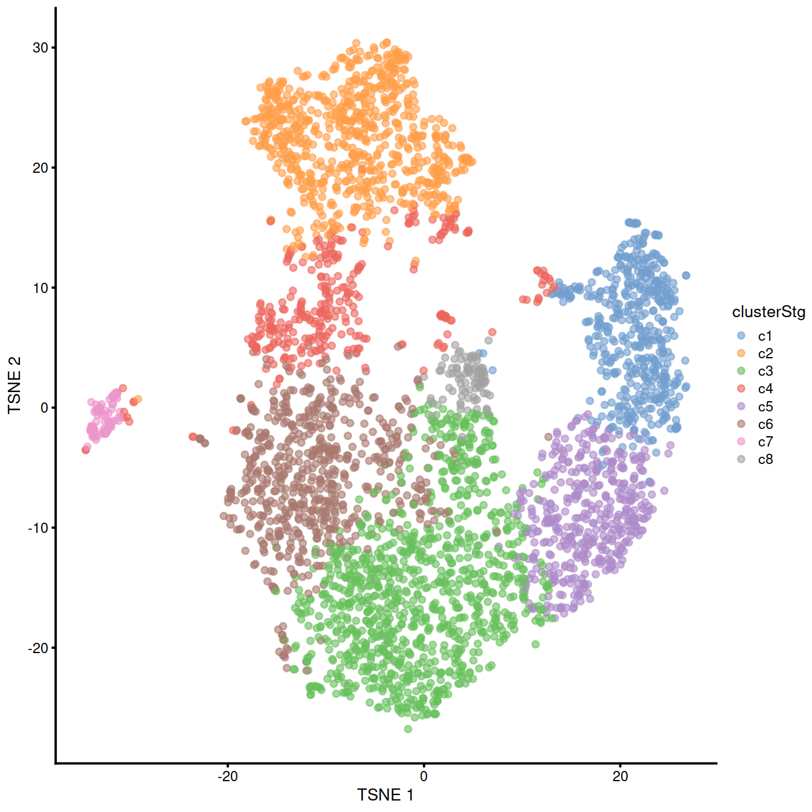
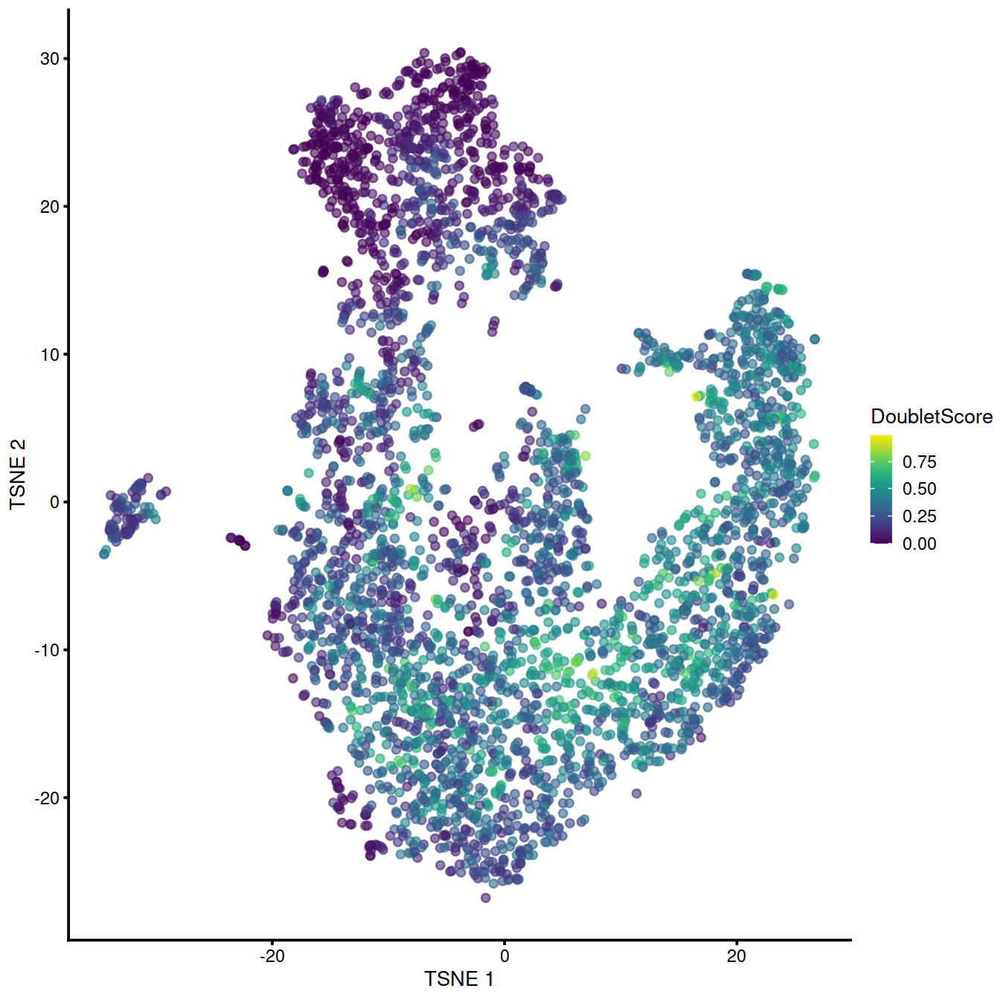
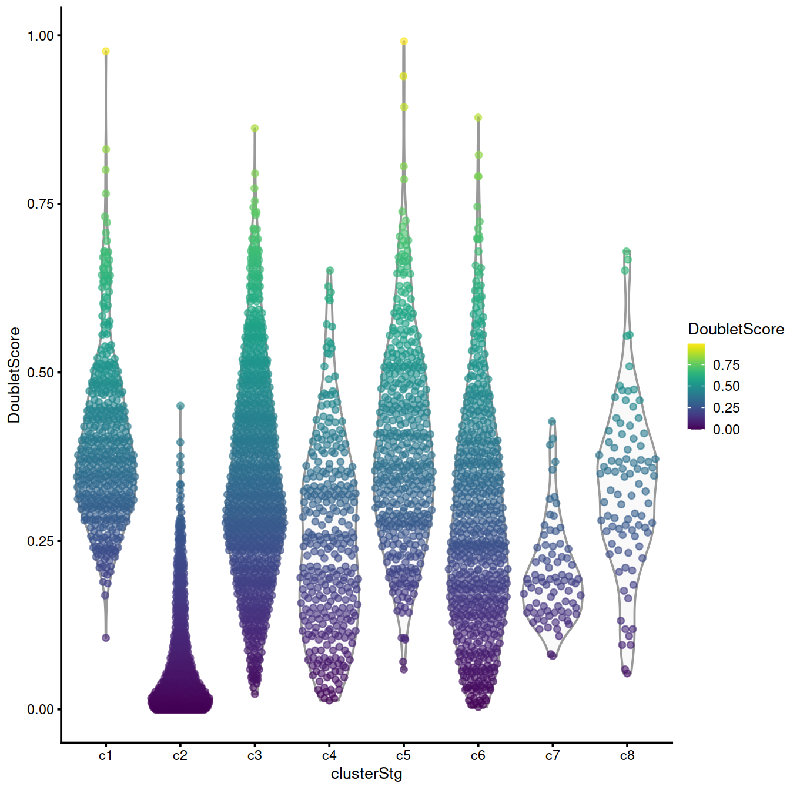

# Doublet detection {#doubletDetectionTop}

Source: [Doublet detection](https://osca.bioconductor.org/doublet-detection.html) chapter of the OSCA book (with only few edits of its text).

## Learning objectives

In this section we will learn how to identify droplets that may include more than one cell, using a method based on simulation of doublets from the single-cell expression profiles.

## Set up analysis

Let's set some variables (eg path to files) and load R packages.


```r
projDir <- params$projDir
dirRel <- params$dirRel
outDirBit <- params$outDirBit
cacheBool <- params$cacheBool
splSetToGet <- params$splSetToGet
setName <- params$setName
setSuf <- params$setSuf
dsiSuf <- params$dsiSuf # 'dsi' for data set integration

if(params$bookType == "mk"){
	setName <- "caron"
	splSetToGet <- "dummy"
	setSuf <- "_allCells"
}

splSetVec <- unlist(strsplit(splSetToGet, ",")) # params may not be read in if knitting book.
splSetToGet2 <- gsub(",", "_", splSetToGet)
nbPcToComp <- 50
figSize <- 7
```


We will load:

* ggplot2, for plots
* dplyr, for data management
* scater, for UMI count normalisation
* scran, here for doublet detection 


```r
library(ggplot2)
library(scater) # for logNormCounts
library(scran)
library(dplyr)
#library(BiocSingular) # for faster PCA
library(scDblFinder) # for doublet detection
library(Cairo)
fontsize <- theme(axis.text=element_text(size=12), axis.title=element_text(size=16))
```

## Load data

We will load the R file keeping the SCE object with the normalised counts (no cell subsampling).


```r
tmpFn <- sprintf("%s/%s/Robjects/%s_sce_nz_postDeconv%s.Rds", # or Qc
                 projDir, outDirBit, setName, setSuf)
```

Input file: /ssd/personal/baller01/20200511_FernandesM_ME_crukBiSs2020/AnaWiSce/AnaCourse1/Robjects/caron_sce_nz_postDeconv_allCells.Rds.


```r
if(!file.exists(tmpFn))
{
	knitr::knit_exit()
}
sce <- readRDS(tmpFn)
```

Number of genes: .

Number of cells: 47830.

## Overview

In single-cell RNA sequencing (scRNA-seq) experiments, doublets are artifactual libraries generated from two cells. They typically arise due to errors in cell sorting or capture, especially in droplet-based protocols (Zheng et al. 2017) involving thousands of cells. Doublets are obviously undesirable when the aim is to characterize populations at the single-cell level. In particular, doublets can be mistaken for intermediate populations or transitory states that do not actually exist. Thus, it is desirable to identify and remove doublet libraries so that they do not compromise interpretation of the results.

Several experimental strategies are available for doublet removal. One approach exploits natural genetic variation when pooling cells from multiple donor individuals (Kang et al. 2018). Doublets can be identified as libraries with allele combinations that do not exist in any single donor. Another approach is to mark a subset of cells (e.g., all cells from one sample) with an antibody conjugated to a different oligonucleotide (Stoeckius, Zheng, et al. 2017). Upon pooling, libraries that are observed to have different oligonucleotides are considered to be doublets and removed. These approaches can be highly effective but rely on experimental information that may not be available.

A more general approach is to infer doublets from the expression profiles alone (Dahlin et al. 2018). The [Doublet detection](https://osca.bioconductor.org/doublet-detection.html) chapter of the OSCA book also describes a second method, which relies on clusters identified, and their quality. 

## Doublet detection by simulation

This strategy involves in silico simulation of doublets from the single-cell expression profiles (Dahlin et al. 2018). This is performed using the `computeDoubletDensity()` function from the `scDblFinder` package. <-- ex doubletCells()  from scran -->, which will:

* Simulate thousands of doublets by adding together two randomly chosen single-cell profiles.
* For each original cell, compute the density of simulated doublets in the surrounding neighborhood.
* For each original cell, compute the density of other observed cells in the neighborhood.
* Return the ratio between the two densities as a “doublet score” for each cell.

This approach assumes that the simulated doublets are good approximations for real doublets. The use of random selection accounts for the relative abundances of different subpopulations, which affect the likelihood of their involvement in doublets; and the calculation of a ratio avoids high scores for non-doublet cells in highly abundant subpopulations.

We see the function in action below. To speed up the density calculations, `computeDoubletDensity()` will perform a PCA on the log-expression matrix, and we perform some (optional) parametrization to ensure that the computed PCs are consistent with that from our previous analysis on this dataset.

We will get data for one sample, e.g. the first PRE-T sample. 


```r
spl.x <- colData(sce) %>%
    data.frame() %>%
    filter(source_name == "PRE-T") %>%
    pull(Sample.Name) %>%
  unique() %>% head(1)
sce <- sce[,sce$Sample.Name == spl.x ]

set.seed(123)
#--- normalization ---#
library(scran)
#set.seed(101000110)
clusters <- quickCluster(sce)
sce <- computeSumFactors(sce, clusters=clusters)
sce <- logNormCounts(sce)
#--- variance-modelling ---#
#set.seed(00010101)
dec.sce <- modelGeneVarByPoisson(sce)
top.sce <- getTopHVGs(dec.sce, prop=0.1)
#--- dimensionality-reduction ---#
#set.seed(101010011)
sce <- denoisePCA(sce, technical=dec.sce, subset.row=top.sce)
sce <- runTSNE(sce, dimred="PCA")
#--- clustering ---#
snn.gr <- buildSNNGraph(sce, use.dimred="PCA", k=25)
sce$cluster <- factor(igraph::cluster_walktrap(snn.gr)$membership)
sce$clusterStg <- factor(paste0("c", sce$cluster),
			 levels = paste0("c", levels( sce$cluster)) )
```

We also plot the t-SNE showing clusters, which are not used for the doublet
detection by simulation used here, but help visualise cells with different
expression profiles.


```r
colLabels(sce) <- sce$clusterStg
plotTSNE(sce, colour_by="clusterStg")
```



Let us run `computeDoubletDensity()` and display moments of the distribution
of the doublet scores returned:


```r
set.seed(100)

# Setting up the parameters for consistency with denoisePCA();
# this can be changed depending on your feature selection scheme.
dbl.dens <- computeDoubletDensity(sce,
			 subset.row = top.sce, 
			 dims = ncol(reducedDim(sce)))
summary(dbl.dens)
```

```
##    Min. 1st Qu.  Median    Mean 3rd Qu.    Max. 
##  0.0000  0.3918  0.8834  1.0596  1.4826  8.8036
```

The t-SNE plot below help identify any cluster with high number of cell
with a high score.


```r
sce$DoubletScore <- log10(dbl.dens+1)
plotTSNE(sce, colour_by="DoubletScore")
```



The violin plot below shows the distribution of score across clusters
identified in the whole data set. Clusters with a large fraction of high-scoring
cells are worth checking. Comparing marker genes for these clusters to other,
'doublet-free' clusters may inform on the type of cells involved.
If the 'source' clusters are not related biologically these high-scoring cells
should be discarded. If on the other hand the 'source' clusters are two well
defined steps along a differentiation path, the high-scoring cells may represent
an intermediary state.


```r
plotColData(sce, y = "DoubletScore", x = "clusterStg", 
   colour_by = "DoubletScore")
```



The advantage of `computeDoubletDensity()` is that it does not depend on clusters, reducing the sensitivity of the results to clustering quality. The downside is that it requires some strong assumptions about how doublets form, such as the combining proportions and the sampling from pure subpopulations. In particular, `computeDoubletDensity()` treats the library size of each cell as an accurate proxy for its total RNA content. If this is not true, the simulation will not combine expression profiles from different cells in the correct proportions. This means that the simulated doublets will be systematically shifted away from the real doublets, resulting in doublet scores that are too low.

Simply removing cells with high doublet scores will not be sufficient to eliminate real doublets from the data set. In some cases, only a subset of the cells in the putative doublet cluster actually have high scores, and removing these would still leave enough cells in that cluster to mislead downstream analyses. In fact, even defining a threshold on the doublet score is difficult as the interpretation of the score is relative. There is no general definition for a fixed threshold above which libraries are to be considered doublets.

We recommend interpreting the `computeDoubletDensity()` scores in the context of cluster annotation. All cells from a cluster with a large average doublet score should be considered suspect, and close neighbors of problematic clusters should also be treated with caution. In contrast, a cluster containing a small proportion of high-scoring cells is probably safe provided that any interesting results are not being driven by those cells (e.g., checking that DE in an interesting gene is not driven solely by cells with high doublet scores). While clustering is still required, this approach is more robust than doubletClusters() to the quality of the clustering as the scores are computed on a per-cell basis.

(As an aside, the issue of unknown combining proportions can be solved completely if spike-in information is available, e.g., in plate-based protocols. This will provide an accurate estimate of the total RNA content of each cell. To this end, spike-in-based size factors from Section 7.4 can be supplied to the `computeDoubletDensity()` function via the size.factors.content= argument. This will use the spike-in size factors to scale the contribution of each cell to a doublet library.)

## Further comments

Doublet detection procedures should only be applied to libraries generated in the same experimental batch. It is obviously impossible for doublets to form between two cells that were captured separately. Thus, some understanding of the experimental design is required prior to the use of the above functions. This avoids unnecessary concerns about the validity of batch-specific clusters that cannot possibly consist of doublets.

It is also difficult to interpret doublet predictions in data containing cellular trajectories. By definition, cells in the middle of a trajectory are always intermediate between other cells and are liable to be incorrectly detected as doublets. Some protection is provided by the non-linear nature of many real trajectories, which reduces the risk of simulated doublets coinciding with real cells in doubletCells(). One can also put more weight on the relative library sizes in doubletCluster() instead of relying solely on N, under the assumption that sudden spikes in RNA content are unlikely in a continuous biological process.

The best solution to the doublet problem is experimental - that is, to avoid generating them in the first place. This should be a consideration when designing scRNA-seq experiments, where the desire to obtain large numbers of cells at minimum cost should be weighed against the general deterioration in data quality and reliability when doublets become more frequent.

<!--
## Ackowledgements

This notebook uses material from [](https:),
[OSCA Book](https://osca.bioconductor.org),
[]()
and [Hemberg Group Course](https://scrnaseq-course.cog.sanger.ac.uk/website/index.html).

See 'Source' above
-->

## Session information


```r
sessionInfo()
```

```
## R version 4.0.3 (2020-10-10)
## Platform: x86_64-pc-linux-gnu (64-bit)
## Running under: CentOS Linux 8
## 
## Matrix products: default
## BLAS:   /opt/R/R-4.0.3/lib64/R/lib/libRblas.so
## LAPACK: /opt/R/R-4.0.3/lib64/R/lib/libRlapack.so
## 
## locale:
##  [1] LC_CTYPE=en_GB.UTF-8       LC_NUMERIC=C              
##  [3] LC_TIME=en_GB.UTF-8        LC_COLLATE=en_GB.UTF-8    
##  [5] LC_MONETARY=en_GB.UTF-8    LC_MESSAGES=en_GB.UTF-8   
##  [7] LC_PAPER=en_GB.UTF-8       LC_NAME=C                 
##  [9] LC_ADDRESS=C               LC_TELEPHONE=C            
## [11] LC_MEASUREMENT=en_GB.UTF-8 LC_IDENTIFICATION=C       
## 
## attached base packages:
## [1] parallel  stats4    stats     graphics  grDevices utils     datasets 
## [8] methods   base     
## 
## other attached packages:
##  [1] Cairo_1.5-12.2              scDblFinder_1.4.0          
##  [3] dplyr_1.0.6                 scran_1.18.7               
##  [5] scater_1.18.6               SingleCellExperiment_1.12.0
##  [7] SummarizedExperiment_1.20.0 Biobase_2.50.0             
##  [9] GenomicRanges_1.42.0        GenomeInfoDb_1.26.7        
## [11] IRanges_2.24.1              S4Vectors_0.28.1           
## [13] BiocGenerics_0.36.1         MatrixGenerics_1.2.1       
## [15] matrixStats_0.58.0          ggplot2_3.3.3              
## [17] knitr_1.33                 
## 
## loaded via a namespace (and not attached):
##  [1] bitops_1.0-7              tools_4.0.3              
##  [3] bslib_0.2.5               utf8_1.2.1               
##  [5] R6_2.5.0                  irlba_2.3.3              
##  [7] vipor_0.4.5               DBI_1.1.1                
##  [9] colorspace_2.0-1          withr_2.4.2              
## [11] tidyselect_1.1.1          gridExtra_2.3            
## [13] compiler_4.0.3            BiocNeighbors_1.8.2      
## [15] DelayedArray_0.16.3       labeling_0.4.2           
## [17] bookdown_0.22             sass_0.4.0               
## [19] scales_1.1.1              stringr_1.4.0            
## [21] digest_0.6.27             rmarkdown_2.8            
## [23] XVector_0.30.0            pkgconfig_2.0.3          
## [25] htmltools_0.5.1.1         sparseMatrixStats_1.2.1  
## [27] highr_0.9                 limma_3.46.0             
## [29] rlang_0.4.11              DelayedMatrixStats_1.12.3
## [31] farver_2.1.0              jquerylib_0.1.4          
## [33] generics_0.1.0            jsonlite_1.7.2           
## [35] BiocParallel_1.24.1       RCurl_1.98-1.3           
## [37] magrittr_2.0.1            BiocSingular_1.6.0       
## [39] GenomeInfoDbData_1.2.4    scuttle_1.0.4            
## [41] Matrix_1.3-3              Rcpp_1.0.6               
## [43] ggbeeswarm_0.6.0          munsell_0.5.0            
## [45] fansi_0.4.2               viridis_0.6.1            
## [47] lifecycle_1.0.0           stringi_1.6.1            
## [49] yaml_2.2.1                edgeR_3.32.1             
## [51] zlibbioc_1.36.0           Rtsne_0.15               
## [53] grid_4.0.3                dqrng_0.3.0              
## [55] crayon_1.4.1              lattice_0.20-44          
## [57] cowplot_1.1.1             beachmat_2.6.4           
## [59] locfit_1.5-9.4            pillar_1.6.1             
## [61] igraph_1.2.6              xgboost_1.4.1.1          
## [63] codetools_0.2-18          glue_1.4.2               
## [65] evaluate_0.14             data.table_1.14.0        
## [67] vctrs_0.3.8               gtable_0.3.0             
## [69] purrr_0.3.4               assertthat_0.2.1         
## [71] xfun_0.23                 rsvd_1.0.5               
## [73] viridisLite_0.4.0         tibble_3.1.2             
## [75] beeswarm_0.3.1            bluster_1.0.0            
## [77] statmod_1.4.36            ellipsis_0.3.2
```

