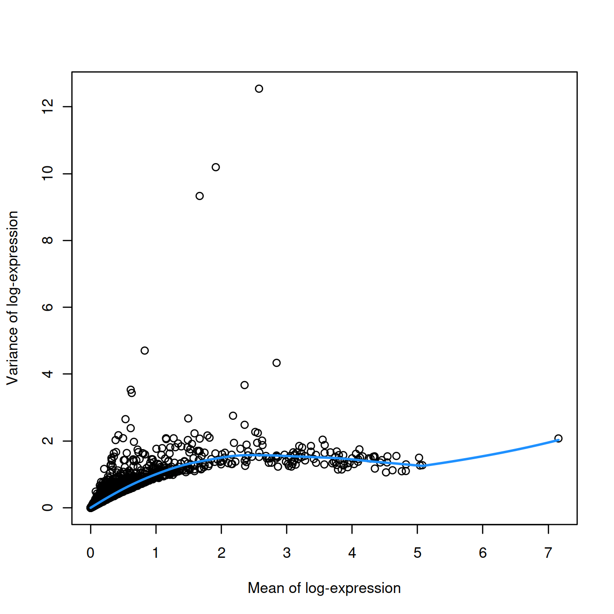
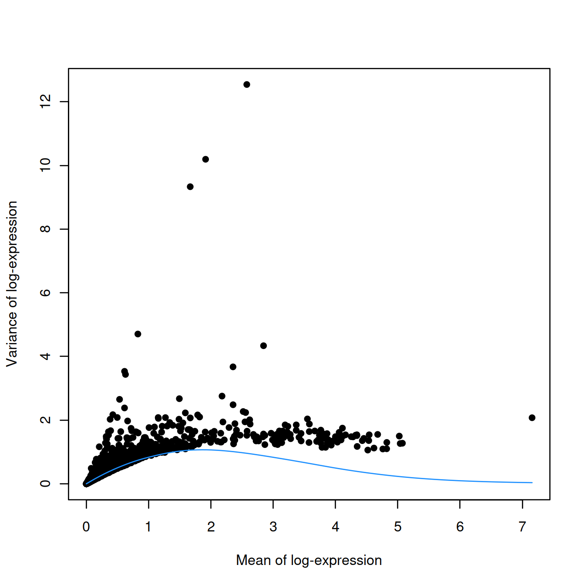
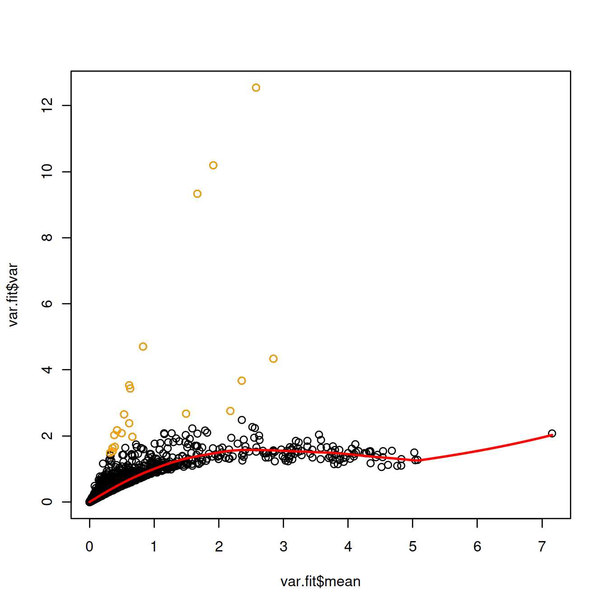
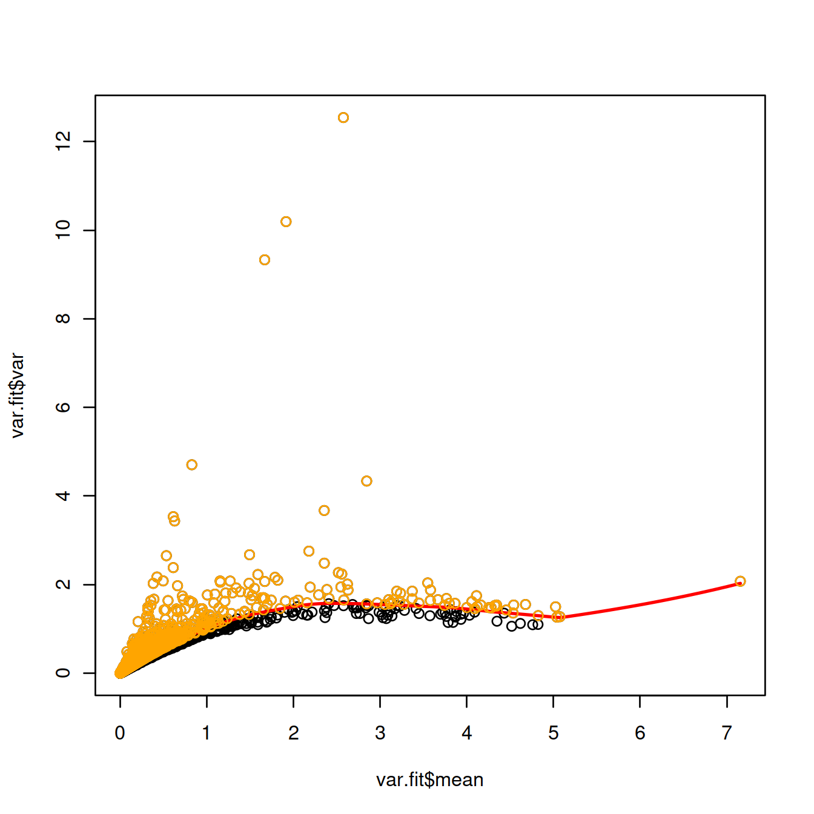
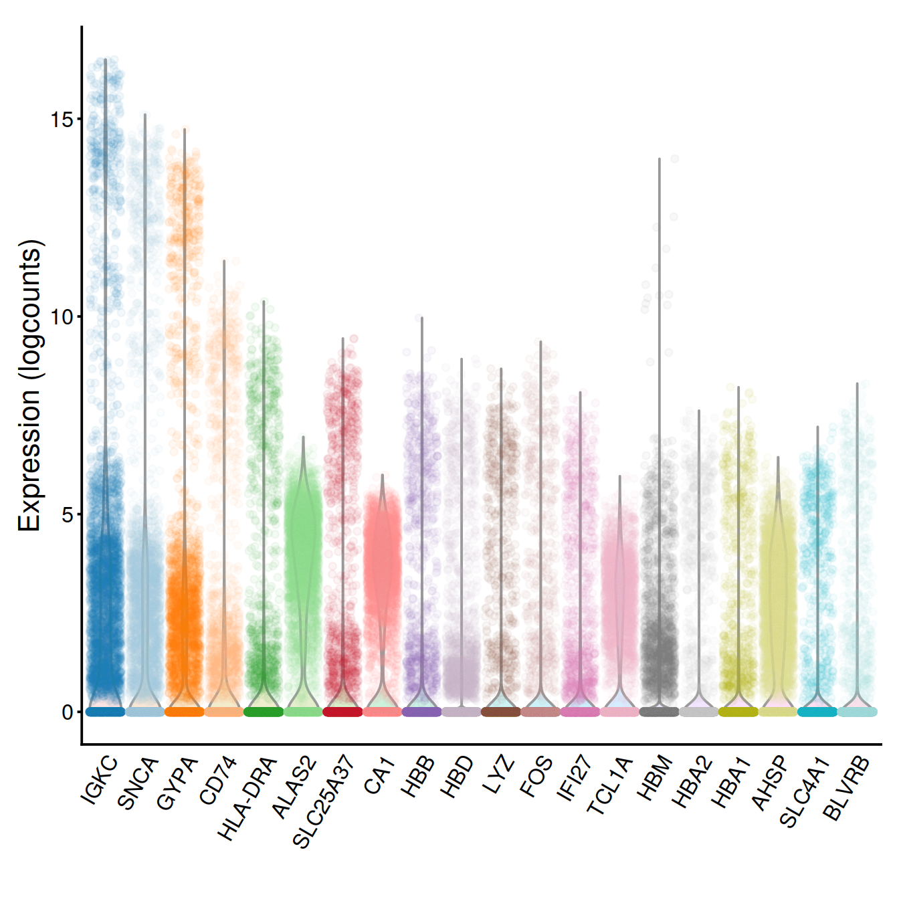
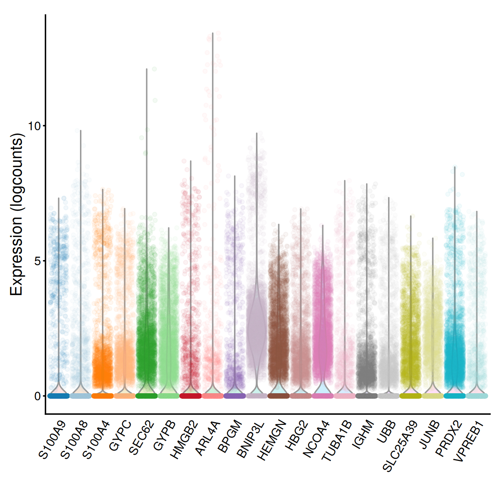
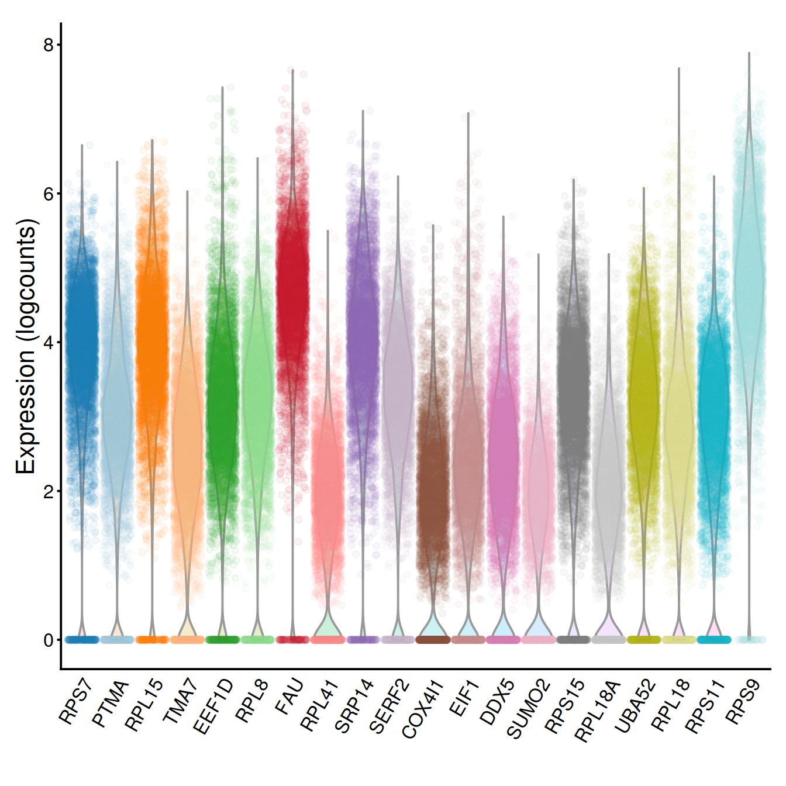

# Feature selection {#featSelecTop}


```r
library(ggplot2)
library(scater)
library(scran)
library(Cairo)
```


```r
projDir <- params$projDir
dirRel <- params$dirRel
outDirBit <- params$outDirBit
cacheBool <- params$cacheBool
setName <- params$setName
setSuf <- params$setSuf
if(params$bookType == "mk"){
	dirRel <- ".."
	setName <- "caron"
	setSuf <- "_5hCellPerSpl"
}

fontsize <- theme(axis.text=element_text(size=12), axis.title=element_text(size=16))
```


## Load data

We will load the R file keeping the SCE object with the normalised counts for 500 cells per sample.


```r
# Read object in:
tmpFn <- sprintf("%s/%s/Robjects/%s_sce_nz_postDeconv%s_dimRed.Rds",
		 projDir, outDirBit, setName, setSuf)
print(tmpFn)
```

```
## [1] "/ssd/personal/baller01/20200511_FernandesM_ME_crukBiSs2020/AnaWiSce/AnaCourse1/Robjects/caron_sce_nz_postDeconv_5hCellPerSpl_dimRed.Rds"
```

```r
if(!file.exists(tmpFn))
{
	knitr::knit_exit()
}
sce <- readRDS(tmpFn)
sce
```

```
## class: SingleCellExperiment 
## dim: 16629 5500 
## metadata(0):
## assays(2): counts logcounts
## rownames(16629): ENSG00000237491 ENSG00000225880 ... ENSG00000275063
##   ENSG00000271254
## rowData names(11): ensembl_gene_id external_gene_name ... detected
##   gene_sparsity
## colnames: NULL
## colData names(16): Barcode Run ... cell_sparsity sizeFactor
## reducedDimNames(3): PCA TSNE UMAP
## altExpNames(0):
```

```r
head(rowData(sce))
```

```
## DataFrame with 6 rows and 11 columns
##                 ensembl_gene_id external_gene_name chromosome_name
##                     <character>        <character>     <character>
## ENSG00000237491 ENSG00000237491          LINC01409               1
## ENSG00000225880 ENSG00000225880          LINC00115               1
## ENSG00000230368 ENSG00000230368             FAM41C               1
## ENSG00000230699 ENSG00000230699                                  1
## ENSG00000188976 ENSG00000188976              NOC2L               1
## ENSG00000187961 ENSG00000187961             KLHL17               1
##                 start_position end_position strandNum      Symbol
##                      <integer>    <integer> <integer> <character>
## ENSG00000237491         778747       810065         1  AL669831.5
## ENSG00000225880         826206       827522        -1   LINC00115
## ENSG00000230368         868071       876903        -1      FAM41C
## ENSG00000230699         911435       914948         1  AL645608.3
## ENSG00000188976         944203       959309        -1       NOC2L
## ENSG00000187961         960584       965719         1      KLHL17
##                            Type       mean  detected gene_sparsity
##                     <character>  <numeric> <numeric>     <numeric>
## ENSG00000237491 Gene Expression 0.02785355  2.706672      0.977951
## ENSG00000225880 Gene Expression 0.01376941  1.340222      0.985699
## ENSG00000230368 Gene Expression 0.02027381  1.946076      0.980821
## ENSG00000230699 Gene Expression 0.00144251  0.144251      0.997704
## ENSG00000188976 Gene Expression 0.17711393 14.511645      0.835565
## ENSG00000187961 Gene Expression 0.00354070  0.348825      0.995935
```

```r
#any(duplicated(rowData(sce)$ensembl_gene_id))
# some function(s) used below complain about 'strand' already being used in row data,
# so rename that column now:
colnames(rowData(sce))[colnames(rowData(sce)) == "strand"] <- "strandNum"
assayNames(sce)
```

```
## [1] "counts"    "logcounts"
```

## Feature selection with scran

scRNASeq measures the expression of thousands of genes in each cell. The biological question asked in a study will most often relate to a fraction of these genes only, linked for example to differences between cell types, drivers of differentiation, or response to perturbation.

Most high-throughput molecular data include variation created by the assay itself, not biology, i.e. technical noise, for example caused by sampling during RNA capture and library preparation. In scRNASeq, this technical noise will result in most genes being detected at different levels. This noise may hinder the detection of the biological signal.

Let's identify Highly Variables Genes (HVGs) with the aim to find those underlying the heterogeneity observed across cells.

### Modelling and removing technical noise

Some assays allow the inclusion of known molecules in a known amount covering a wide range, from low to high abundance: spike-ins. The technical noise is assessed based on the amount of spike-ins used, the corresponding read counts obtained and their variation across cells. The variance in expression can then be decomposed into the biolgical and technical components. 

UMI-based assays do not (yet?) allow spike-ins. But one can still identify HVGs, that is genes with the highest biological component. Assuming that expression does not vary across cells for most genes, the total variance for these genes mainly reflects technical noise. The latter can thus be assessed by fitting a trend to the variance in expression. The fitted value will be the estimate of the technical component.

Let's fit a trend to the variance, using modelGeneVar(). 


```r
dec.sce <- modelGeneVar(sce)
```

Let’s plot variance against mean of expression (log scale) and the mean-dependent trend fitted to the variance: 


```r
# Visualizing the fit:
var.fit <- metadata(dec.sce)
plot(var.fit$mean, var.fit$var, xlab="Mean of log-expression",
    ylab="Variance of log-expression")
curve(var.fit$trend(x), col="dodgerblue", add=TRUE, lwd=2)
```



In the absence of spike-in data, one can attempt to create a trend by making some distributional assumptions about the noise. For example, UMI counts typically exhibit near-Poisson variation if we only consider technical noise from library preparation and sequencing. This can be used to construct a mean-variance trend in the log-counts with the modelGeneVarByPoisson() function. Note the increased residuals of the high-abundance genes, which can be interpreted as the amount of biological variation that was assumed to be “uninteresting” when fitting the gene-based trend above.


```r
set.seed(0010101)
dec.pois.sce <- modelGeneVarByPoisson(sce)
dec.pois.sce <- dec.pois.sce[order(dec.pois.sce$bio, decreasing=TRUE),]
head(dec.pois.sce)
```

```
## DataFrame with 6 rows and 6 columns
##                      mean     total      tech       bio   p.value       FDR
##                 <numeric> <numeric> <numeric> <numeric> <numeric> <numeric>
## ENSG00000244734  2.575807  12.54130  0.957640  11.58366         0         0
## ENSG00000188536  1.914380  10.19250  1.067743   9.12476         0         0
## ENSG00000206172  1.667508   9.33088  1.056235   8.27465         0         0
## ENSG00000223609  0.826927   4.70420  0.739370   3.96483         0         0
## ENSG00000019582  2.844653   4.33650  0.880604   3.45590         0         0
## ENSG00000206177  0.613229   3.53194  0.593093   2.93885         0         0
```

Plot:


```r
plot(dec.pois.sce$mean,
     dec.pois.sce$total,
     pch=16,
     xlab="Mean of log-expression",
     ylab="Variance of log-expression")
curve(metadata(dec.pois.sce)$trend(x), col="dodgerblue", add=TRUE)
```



Interestingly, trends based purely on technical noise tend to yield large biological components for highly-expressed genes. This often includes so-called “house-keeping” genes coding for essential cellular components such as ribosomal proteins, which are considered uninteresting for characterizing cellular heterogeneity. These observations suggest that a more accurate noise model does not necessarily yield a better ranking of HVGs, though one should keep an open mind - house-keeping genes are regularly DE in a variety of conditions (Glare et al. 2002; Nazari, Parham, and Maleki 2015; Guimaraes and Zavolan 2016), and the fact that they have large biological components indicates that there is strong variation across cells that may not be completely irrelevant.

### Choosing some HVGs

Identify the top 20 HVGs by sorting genes in decreasing order of biological component.


```r
# order genes by decreasing order of biological component
o <- order(dec.sce$bio, decreasing=TRUE)
# check top and bottom of sorted table
head(dec.sce[o,])
```

```
## DataFrame with 6 rows and 6 columns
##                      mean     total      tech       bio      p.value
##                 <numeric> <numeric> <numeric> <numeric>    <numeric>
## ENSG00000244734  2.575807  12.54130  1.571475  10.96983  0.00000e+00
## ENSG00000188536  1.914380  10.19250  1.470369   8.72213  0.00000e+00
## ENSG00000206172  1.667508   9.33088  1.383903   7.94698  0.00000e+00
## ENSG00000223609  0.826927   4.70420  0.866452   3.83775 1.01388e-200
## ENSG00000206177  0.613229   3.53194  0.676622   2.85532 2.03444e-182
## ENSG00000019582  2.844653   4.33650  1.562464   2.77404  4.82497e-34
##                          FDR
##                    <numeric>
## ENSG00000244734  0.00000e+00
## ENSG00000188536  0.00000e+00
## ENSG00000206172  0.00000e+00
## ENSG00000223609 4.21472e-197
## ENSG00000206177 6.76573e-179
## ENSG00000019582  1.33716e-31
```

```r
tail(dec.sce[o,])
```

```
## DataFrame with 6 rows and 6 columns
##                      mean     total      tech       bio   p.value       FDR
##                 <numeric> <numeric> <numeric> <numeric> <numeric> <numeric>
## ENSG00000063177   3.03243   1.25207   1.54591 -0.293832  0.902543  0.963192
## ENSG00000173812   3.07081   1.23210   1.54264 -0.310539  0.915089  0.968993
## ENSG00000108654   2.36375   1.25412   1.57345 -0.319334  0.916823  0.970088
## ENSG00000115268   3.84069   1.14533   1.47476 -0.329431  0.936161  0.981326
## ENSG00000149806   2.86602   1.23055   1.56085 -0.330302  0.925504  0.974980
## ENSG00000174748   3.78383   1.14424   1.48200 -0.337760  0.939933  0.983367
```

```r
# choose the top 20 genes with the highest biological component
chosen.genes.index <- o[1:20]
```

Show the top 20 HVGs on the plot displaying the variance against the mean expression: 


```r
plot(var.fit$mean, var.fit$var)
curve(var.fit$trend(x), col="red", lwd=2, add=TRUE)
points(var.fit$mean[chosen.genes.index], var.fit$var[chosen.genes.index], col="orange")
```



Rather than choosing a fixed number of top genes, one may define 'HVGs' as genes with a positive biological component, ie whose variance is higher than the fitted value for the corresponding mean expression.

Select and show these 'HVGs' on the plot displaying the variance against the mean expression: 


```r
hvgBool <- dec.sce$bio > 0
table(hvgBool)
```

```
## hvgBool
## FALSE  TRUE 
##  7333  9296
```

```r
hvg.index <- which(hvgBool)
plot(var.fit$mean, var.fit$var)
curve(var.fit$trend(x), col="red", lwd=2, add=TRUE)
points(var.fit$mean[hvg.index], var.fit$var[hvg.index], col="orange")
```



Save objects to file


```r
tmpFn <- sprintf("%s/%s/Robjects/%s_sce_nz_postDeconv%s_featSel.Rds",
		 projDir, outDirBit, setName, setSuf)
saveRDS(list("dec.sce"=dec.sce,"hvg.index"=hvg.index), tmpFn)
rm(var.fit, hvgBool, hvg.index)
```

HVGs may be driven by outlier cells. So let's plot the distribution of expression values for the genes with the largest biological components.

First, get gene names to replace ensembl IDs on plot. 


```r
# the count matrix rows are named with ensembl gene IDs. Let's label gene with their name instead:
# row indices of genes in rowData(sce)
tmpInd <- which(rowData(sce)$ensembl_gene_id %in% rownames(dec.sce)[chosen.genes.index])
# check:
rowData(sce)[tmpInd,c("ensembl_gene_id","external_gene_name")]
```

```
## DataFrame with 20 rows and 2 columns
##                 ensembl_gene_id external_gene_name
##                     <character>        <character>
## ENSG00000211592 ENSG00000211592               IGKC
## ENSG00000145335 ENSG00000145335               SNCA
## ENSG00000170180 ENSG00000170180               GYPA
## ENSG00000019582 ENSG00000019582               CD74
## ENSG00000204287 ENSG00000204287            HLA-DRA
## ...                         ...                ...
## ENSG00000188536 ENSG00000188536               HBA2
## ENSG00000206172 ENSG00000206172               HBA1
## ENSG00000169877 ENSG00000169877               AHSP
## ENSG00000004939 ENSG00000004939             SLC4A1
## ENSG00000090013 ENSG00000090013              BLVRB
```

```r
# store names:
tmpName <- rowData(sce)[tmpInd,"external_gene_name"]
# the gene name may not be known, so keep the ensembl gene ID in that case:
tmpName[tmpName==""] <- rowData(sce)[tmpInd,"ensembl_gene_id"][tmpName==""]
tmpName[is.na(tmpName)] <- rowData(sce)[tmpInd,"ensembl_gene_id"][is.na(tmpName)]
rm(tmpInd)
```

Now show a violin plot for each gene, using plotExpression() and label genes with their name:


```r
g <- plotExpression(sce, rownames(dec.sce)[chosen.genes.index], 
    point_alpha=0.05, jitter="jitter") + fontsize
g <- g + scale_x_discrete(breaks=rownames(dec.sce)[chosen.genes.index],
        labels=tmpName)
g
```



```r
rm(tmpName)
```

Another few genes:


```r
chosen.genes.index <- o[21:40]

tmpInd <- which(rowData(sce)$ensembl_gene_id %in% rownames(dec.sce)[chosen.genes.index])
# check:
rowData(sce)[tmpInd,c("ensembl_gene_id","external_gene_name")]
```

```
## DataFrame with 20 rows and 2 columns
##                 ensembl_gene_id external_gene_name
##                     <character>        <character>
## ENSG00000163220 ENSG00000163220             S100A9
## ENSG00000143546 ENSG00000143546             S100A8
## ENSG00000196154 ENSG00000196154             S100A4
## ENSG00000136732 ENSG00000136732               GYPC
## ENSG00000008952 ENSG00000008952              SEC62
## ...                         ...                ...
## ENSG00000170315 ENSG00000170315                UBB
## ENSG00000013306 ENSG00000013306           SLC25A39
## ENSG00000171223 ENSG00000171223               JUNB
## ENSG00000167815 ENSG00000167815              PRDX2
## ENSG00000169575 ENSG00000169575             VPREB1
```

```r
# store names:
tmpName <- rowData(sce)[tmpInd,"external_gene_name"]
# the gene name may not be known, so keep the ensembl gene ID in that case:
tmpName[tmpName==""] <- rowData(sce)[tmpInd,"ensembl_gene_id"][tmpName==""]
tmpName[is.na(tmpName)] <- rowData(sce)[tmpInd,"ensembl_gene_id"][is.na(tmpName)]
rm(tmpInd)

g <- plotExpression(sce, rownames(dec.sce)[chosen.genes.index], 
    point_alpha=0.05, jitter="jitter") + fontsize
g <- g + scale_x_discrete(breaks=rownames(dec.sce)[chosen.genes.index],
        labels=tmpName)
g
```



```r
rm(tmpName)
```

__Challenge__: Show violin plots for the 20 genes with the lowest biological component. How do they compare to the those for HVGs chosen above?


```r
chosen.genes.index.tmp <- order(dec.sce$bio, decreasing=FALSE)[1:20]
tmpInd <- (which(rowData(sce)$ensembl_gene_id %in% rownames(dec.sce)[chosen.genes.index.tmp]))
# check:
rowData(sce)[tmpInd,c("ensembl_gene_id","external_gene_name")]
```

```
## DataFrame with 20 rows and 2 columns
##                 ensembl_gene_id external_gene_name
##                     <character>        <character>
## ENSG00000171863 ENSG00000171863               RPS7
## ENSG00000187514 ENSG00000187514               PTMA
## ENSG00000174748 ENSG00000174748              RPL15
## ENSG00000232112 ENSG00000232112               TMA7
## ENSG00000104529 ENSG00000104529              EEF1D
## ...                         ...                ...
## ENSG00000105640 ENSG00000105640             RPL18A
## ENSG00000221983 ENSG00000221983              UBA52
## ENSG00000063177 ENSG00000063177              RPL18
## ENSG00000142534 ENSG00000142534              RPS11
## ENSG00000170889 ENSG00000170889               RPS9
```

```r
# store names:
tmpName <- rowData(sce)[tmpInd,"external_gene_name"]
# the gene name may not be known, so keep the ensembl gene ID in that case:
tmpName[tmpName==""] <- rowData(sce)[tmpInd,"ensembl_gene_id"][tmpName==""]
tmpName[is.na(tmpName)] <- rowData(sce)[tmpInd,"ensembl_gene_id"][is.na(tmpName)]
rm(tmpInd)
g <- plotExpression(sce, rownames(dec.sce)[chosen.genes.index.tmp], 
			point_alpha=0.05, jitter="jitter") + fontsize
g <- g + scale_x_discrete(breaks=rownames(dec.sce)[chosen.genes.index.tmp],
        labels=tmpName)
g
```



```r
rm(chosen.genes.index.tmp, tmpName)
```


```r
rm(dec.sce)
rm(dec.pois.sce)
rm(sce)
```

## Session information

<details>

```r
sessionInfo()
```

```
## R version 4.0.3 (2020-10-10)
## Platform: x86_64-pc-linux-gnu (64-bit)
## Running under: CentOS Linux 8
## 
## Matrix products: default
## BLAS:   /opt/R/R-4.0.3/lib64/R/lib/libRblas.so
## LAPACK: /opt/R/R-4.0.3/lib64/R/lib/libRlapack.so
## 
## locale:
##  [1] LC_CTYPE=en_GB.UTF-8       LC_NUMERIC=C              
##  [3] LC_TIME=en_GB.UTF-8        LC_COLLATE=en_GB.UTF-8    
##  [5] LC_MONETARY=en_GB.UTF-8    LC_MESSAGES=en_GB.UTF-8   
##  [7] LC_PAPER=en_GB.UTF-8       LC_NAME=C                 
##  [9] LC_ADDRESS=C               LC_TELEPHONE=C            
## [11] LC_MEASUREMENT=en_GB.UTF-8 LC_IDENTIFICATION=C       
## 
## attached base packages:
## [1] parallel  stats4    stats     graphics  grDevices utils     datasets 
## [8] methods   base     
## 
## other attached packages:
##  [1] knitr_1.33                  Cairo_1.5-12.2             
##  [3] scran_1.18.7                scater_1.18.6              
##  [5] SingleCellExperiment_1.12.0 SummarizedExperiment_1.20.0
##  [7] Biobase_2.50.0              GenomicRanges_1.42.0       
##  [9] GenomeInfoDb_1.26.7         IRanges_2.24.1             
## [11] S4Vectors_0.28.1            BiocGenerics_0.36.1        
## [13] MatrixGenerics_1.2.1        matrixStats_0.58.0         
## [15] ggplot2_3.3.3              
## 
## loaded via a namespace (and not attached):
##  [1] viridis_0.6.1             sass_0.4.0               
##  [3] edgeR_3.32.1              BiocSingular_1.6.0       
##  [5] jsonlite_1.7.2            viridisLite_0.4.0        
##  [7] DelayedMatrixStats_1.12.3 scuttle_1.0.4            
##  [9] bslib_0.2.5               assertthat_0.2.1         
## [11] statmod_1.4.36            highr_0.9                
## [13] dqrng_0.3.0               GenomeInfoDbData_1.2.4   
## [15] vipor_0.4.5               yaml_2.2.1               
## [17] pillar_1.6.1              lattice_0.20-44          
## [19] limma_3.46.0              glue_1.4.2               
## [21] beachmat_2.6.4            digest_0.6.27            
## [23] XVector_0.30.0            colorspace_2.0-1         
## [25] cowplot_1.1.1             htmltools_0.5.1.1        
## [27] Matrix_1.3-3              pkgconfig_2.0.3          
## [29] bookdown_0.22             zlibbioc_1.36.0          
## [31] purrr_0.3.4               scales_1.1.1             
## [33] BiocParallel_1.24.1       tibble_3.1.2             
## [35] farver_2.1.0              generics_0.1.0           
## [37] ellipsis_0.3.2            withr_2.4.2              
## [39] magrittr_2.0.1            crayon_1.4.1             
## [41] evaluate_0.14             fansi_0.4.2              
## [43] bluster_1.0.0             beeswarm_0.3.1           
## [45] tools_4.0.3               lifecycle_1.0.0          
## [47] stringr_1.4.0             locfit_1.5-9.4           
## [49] munsell_0.5.0             DelayedArray_0.16.3      
## [51] irlba_2.3.3               compiler_4.0.3           
## [53] jquerylib_0.1.4           rsvd_1.0.5               
## [55] rlang_0.4.11              grid_4.0.3               
## [57] RCurl_1.98-1.3            BiocNeighbors_1.8.2      
## [59] igraph_1.2.6              labeling_0.4.2           
## [61] bitops_1.0-7              rmarkdown_2.8            
## [63] codetools_0.2-18          gtable_0.3.0             
## [65] DBI_1.1.1                 R6_2.5.0                 
## [67] gridExtra_2.3             dplyr_1.0.6              
## [69] utf8_1.2.1                stringi_1.6.1            
## [71] ggbeeswarm_0.6.0          Rcpp_1.0.6               
## [73] vctrs_0.3.8               tidyselect_1.1.1         
## [75] xfun_0.23                 sparseMatrixStats_1.2.1
```
</details>
