<!--
  setSuf: "_5hCellPerSpl"
  setSuf: "_5hCps"
  setSuf: "_allCells"
-->
 

```r
params2 <- list(
  "projDir" = "/ssd/personal/baller01/20200511_FernandesM_ME_crukBiSs2020",
  "dirRel" = "..",
  "inpDirBit" = "AnaWiSce/AnaCourse1",
  "outDirBit" = "AnaWiSce/AnaCourse1",
  "bookType" = "km",
  "cacheBool"  = FALSE,  
  "setName" = "caron",
  "splSetToGet" = "PBMMC,ETV6-RUNX1",
  "setSuf" = "_5hCellPerSpl",
  "dsiSuf" = '_dsi')
```


```r
if(interactive()) {
  paramsToUse <- params2
} else {
  paramsToUse <- params
}

projDir <- paramsToUse$projDir
dirRel <- paramsToUse$dirRel
outDirBit <- paramsToUse$outDirBit
cacheBool <- paramsToUse$cacheBool
splSetToGet <- paramsToUse$splSetToGet
setName <- paramsToUse$setName
setSuf <- paramsToUse$setSuf
dsiSuf <- paramsToUse$dsiSuf # 'dsi' for data set integration

if(paramsToUse$bookType == "mk"){
	setName <- "caron"
	splSetToGet <- "PBMMC,ETV6-RUNX1"
	setSuf <- "_5hCps"
}

splSetVec <- unlist(strsplit(splSetToGet, ",")) # params may not be read in if knitting book.
splSetToGet2 <- gsub(",", "_", splSetToGet)
nbPcToComp <- 50
figSize <- 7
```


# Differential expression and abundance between conditions {#multiSplCompTop}

Source: [Multi-sample comparisons](https://osca.bioconductor.org/multi-sample-comparisons.html) of the OSCA book.

## Motivation

A powerful use of scRNA-seq technology lies in the design of replicated multi-condition experiments to detect changes in composition or expression between conditions. For example, a researcher could use this strategy to detect changes in cell type abundance after drug treatment (Richard et al. 2018) or genetic modifications (Scialdone et al. 2016). This provides more biological insight than conventional scRNA-seq experiments involving only one biological condition, especially if we can relate population changes to specific experimental perturbations.

Differential analyses of multi-condition scRNA-seq experiments can be broadly split into two categories - differential expression (DE) and differential abundance (DA) analyses. The former tests for changes in expression between conditions for cells of the same type that are present in both conditions, while the latter tests for changes in the composition of cell types (or states, etc.) between conditions.

## Setting up the data

We will use the data set comprising the 11 samples (500 or 1000 cells per sample) analysed with fastMNN and the nested list of samples.

The differential analyses in this chapter will be predicated on many of the pre-processing steps covered previously. For brevity, we will not explicitly repeat them here, only noting that we have already merged cells from all samples into the same coordinate system and clustered the merged dataset to obtain a common partitioning across all samples.

Load the SCE object:


```r
#setName <- "caron"
# Read object in:
##setSuf <- "_1kCellPerSpl"
##tmpFn <- sprintf("%s/%s/Robjects/%s_sce_nz_postDeconv%s_clustered.Rds", projDir, outDirBit, setName, setSuf)

#setSuf <- "_1kCps"
##tmpFn <- sprintf("%s/%s/Robjects/%s_sce_nz_postDeconv%s_Fmwbl.Rds",
##		 projDir, outDirBit, setName, setSuf)
tmpFn <- sprintf("%s/%s/Robjects/%s_sce_nz_postDeconv%s_dsi_%s_Fmwbl.Rds",
		 projDir, outDirBit, setName, setSuf, splSetToGet2)
print(tmpFn)
```

```
## [1] "/ssd/personal/baller01/20200511_FernandesM_ME_crukBiSs2020/AnaWiSce/AnaCourse1/Robjects/caron_sce_nz_postDeconv_5hCellPerSpl_dsi_PBMMC_ETV6-RUNX1_Fmwbl.Rds"
```

```r
if(!file.exists(tmpFn))
{
	knitr::knit_exit()
}
sce <- readRDS(tmpFn)
sce
```

```
## class: SingleCellExperiment 
## dim: 7930 3500 
## metadata(2): merge.info pca.info
## assays(1): reconstructed
## rownames(7930): ENSG00000000938 ENSG00000001084 ... ENSG00000285476
##   ENSG00000285486
## rowData names(1): rotation
## colnames: NULL
## colData names(21): Barcode Run ... splType clusters.mnn
## reducedDimNames(2): corrected TSNE
## altExpNames(0):
```

A brief inspection of the results shows clusters contain varying contributions from batches:


```r
library(scater)
colLabels(sce) <- sce$clusters.mnn
tab <- table(colLabels(sce), sce$splType)
tab
```

```
##     
##      GSM3872434 GSM3872435 GSM3872436 GSM3872437 GSM3872442 GSM3872443
##   1           2          0          6          6          4         21
##   2          40         38         14         47         63          9
##   3          87          1          3          3         62         16
##   4          31        273        154         82         64         16
##   5           0          1          7         16          1         30
##   6           0          0          0          0         30         17
##   7           1         15        157         21        183        128
##   8           0          0          3         19          0         22
##   9          88         34         22         73         32          2
##   10          2         10         50         12         13         51
##   11          0          0         12         48          0         66
##   12          1          0          5          7          3         35
##   13          0          0         11         30          0         37
##   14        233        112         36        125          6          2
##   15          2          1         13          4         20         23
##   16          0          2          2          2          4          4
##   17         13         13          5          4          5          5
##   18          0          0          0          1         10         16
##     
##      GSM3872444
##   1           6
##   2          36
##   3          18
##   4          88
##   5           6
##   6          23
##   7         131
##   8           5
##   9          20
##   10         54
##   11          3
##   12         59
##   13          3
##   14          6
##   15         30
##   16          3
##   17          0
##   18          9
```


```r
pheatmap::pheatmap(tab,
           border_color      = NA,
           drop_levels       = TRUE,
           cluster_rows      = FALSE,
           cluster_cols      = FALSE
           )
```

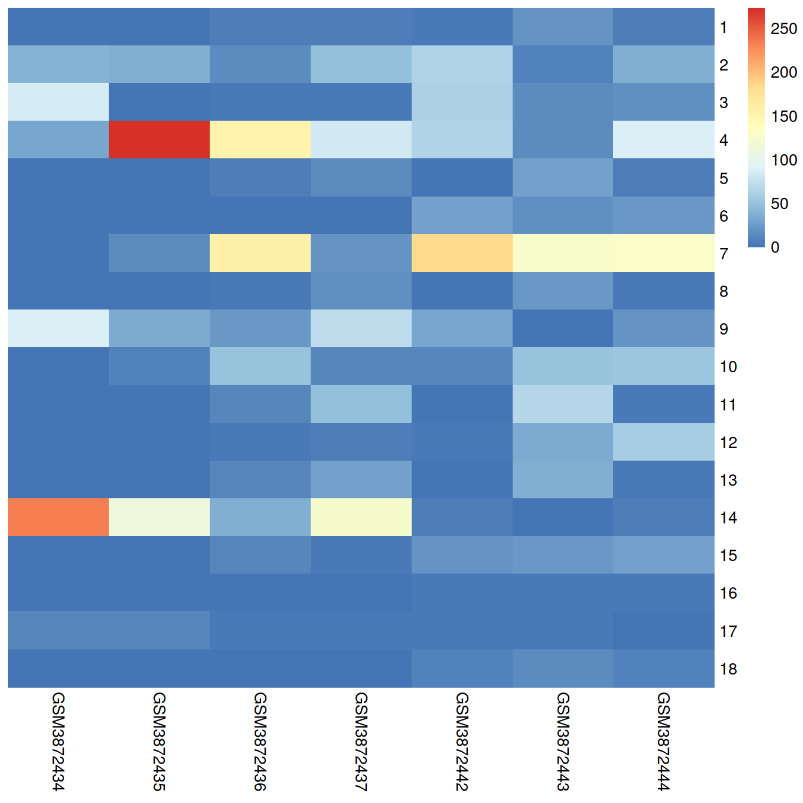


```r
tab <- table(colLabels(sce), sce$Sample.Name2)
pheatmap::pheatmap(tab,
           border_color      = NA,
           drop_levels       = TRUE,
           cluster_rows      = FALSE,
           cluster_cols      = FALSE
           )
```

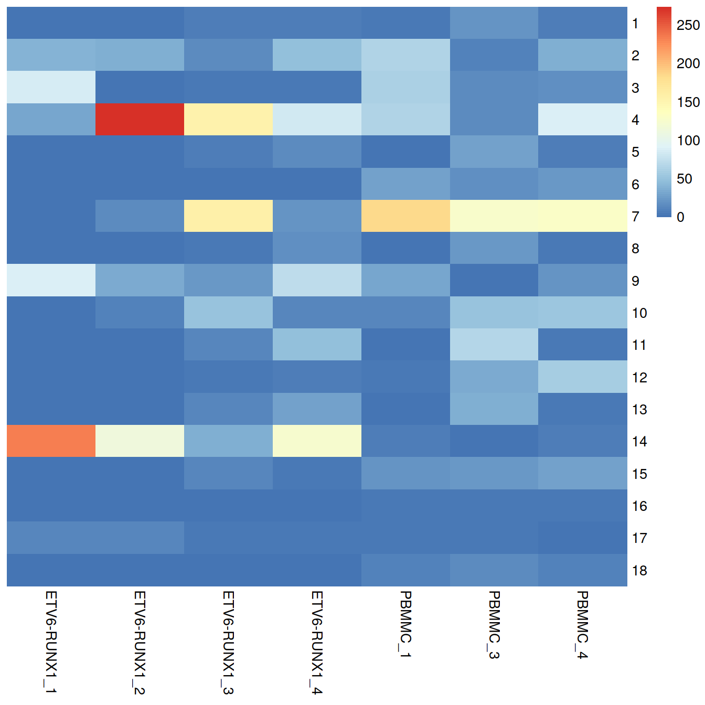

On the t-SNE plots below, cells colored by type or sample ('batch of origin'). Cluster numbers are superimposed based on the median coordinate of cells assigned to that cluster. 


```r
p1 <- plotTSNE(sce, colour_by="source_name", text_by="label", point_size=0.3)
p2 <- plotTSNE(sce, colour_by="Sample.Name2", point_size=0.3)
gridExtra::grid.arrange(p1, p2+facet_wrap(~colData(sce)$Sample.Name2), ncol=2)
```

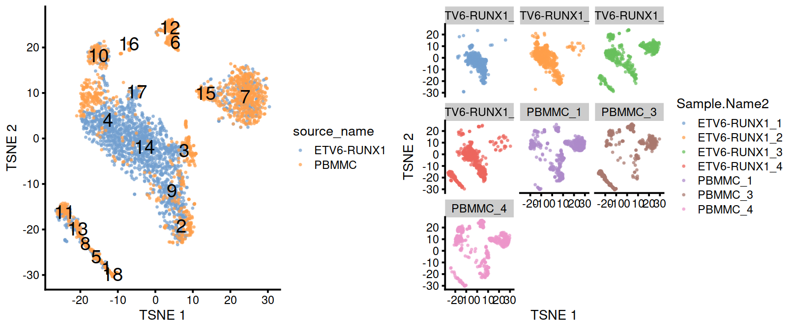


```r
#tmpFn <- sprintf("%s/%s/Robjects/%s_sce_nz_postDeconv%s_Fmwbl2.Rds",
#		 projDir, outDirBit, setName, setSuf)
tmpFn <- sprintf("%s/%s/Robjects/%s_sce_nz_postDeconv%s_dsi_%s_Fmwbl2.Rds",
		 projDir, outDirBit, setName, setSuf, splSetToGet2)
tmpList <- readRDS(tmpFn)

chosen.hvgs <- tmpList$chosen.hvgs
rescaled.mbn <- tmpList$rescaled.mbn
uncorrected <- tmpList$uncorrected
colToKeep <- c("Run", "Sample.Name", "source_name", "block", "setName", "Sample.Name2") 
colData(uncorrected) <- colData(uncorrected)[,colToKeep]
colData(uncorrected)[1:3,]
```

```
## DataFrame with 3 rows and 6 columns
##           Run Sample.Name source_name      block     setName Sample.Name2
##   <character> <character>    <factor>   <factor> <character>  <character>
## 1  SRR9264343  GSM3872434  ETV6-RUNX1 ETV6-RUNX1       Caron ETV6-RUNX1_1
## 2  SRR9264343  GSM3872434  ETV6-RUNX1 ETV6-RUNX1       Caron ETV6-RUNX1_1
## 3  SRR9264343  GSM3872434  ETV6-RUNX1 ETV6-RUNX1       Caron ETV6-RUNX1_1
```

```r
#--- merging ---#
library(batchelor)
set.seed(01001001)
if(splSetToGet == "PBMMC,ETV6-RUNX1") {
  mergeOrderList <- list( list(4,5,6,7), list(1,2,3) )
} else if(splSetToGet == "allSets") {
  mergeOrderList <- list( list(1,2,3,4), list(9,10,11), list(5,6), list(7,8) )
}
merged <- correctExperiments(uncorrected, 
    batch=uncorrected$Sample.Name2, 
    subset.row=chosen.hvgs,
    PARAM=FastMnnParam(
        merge.order=mergeOrderList
    )
)

merged
```

```
## class: SingleCellExperiment 
## dim: 7930 3500 
## metadata(2): merge.info pca.info
## assays(3): reconstructed counts logcounts
## rownames(7930): ENSG00000000938 ENSG00000001084 ... ENSG00000285476
##   ENSG00000285486
## rowData names(12): rotation ensembl_gene_id ... detected gene_sparsity
## colnames: NULL
## colData names(7): batch Run ... setName Sample.Name2
## reducedDimNames(4): corrected PCA TSNE UMAP
## altExpNames(0):
```

```r
#--- clustering ---#
g <- buildSNNGraph(merged, use.dimred="corrected")
clusters <- igraph::cluster_louvain(g)
merged$clusters.mnn <- factor(paste0("c", clusters$membership))
#colLabels(merged) <- merged$clusters.mnn

#--- dimensionality-reduction ---#
merged <- runTSNE(merged, dimred="corrected", external_neighbors=TRUE)
merged <- runUMAP(merged, dimred="corrected", external_neighbors=TRUE)

library(scater)
tab <- table(merged$clusters.mnn, merged$block)
pheatmap::pheatmap(tab,
           border_color      = NA,
           drop_levels       = TRUE,
           cluster_rows      = FALSE,
           cluster_cols      = FALSE
           )
```

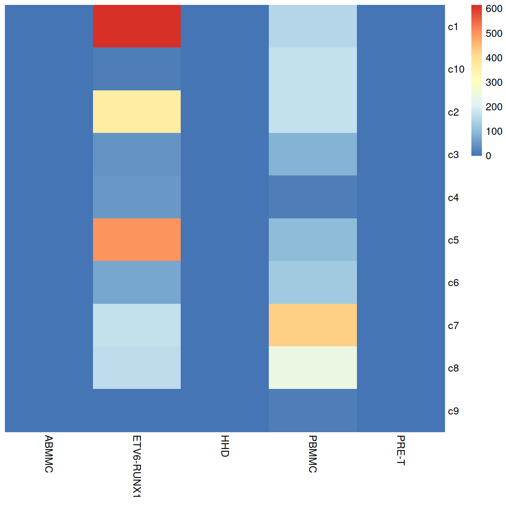

```r
tab <- table(merged$clusters.mnn, merged$Sample.Name2)
pheatmap::pheatmap(tab,
           border_color      = NA,
           drop_levels       = TRUE,
           cluster_rows      = FALSE,
           cluster_cols      = FALSE
           )
```

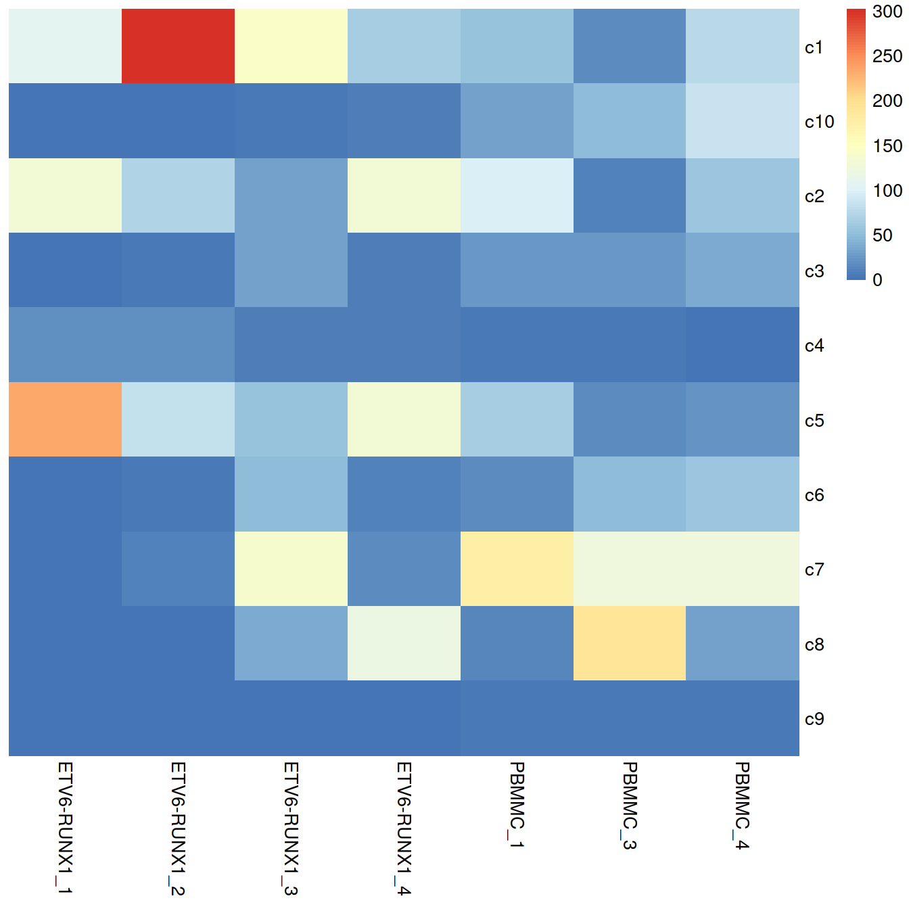

```r
#plotTSNE(merged, colour_by="block", text_by="clusters.mnn")
#plotTSNE(merged, colour_by="Sample.Name2")
```


```r
p1 <- plotTSNE(merged, colour_by="block", text_by="clusters.mnn")
p2 <- plotTSNE(merged, colour_by="Sample.Name2")
gridExtra::grid.arrange(p1, p2+facet_wrap(~colData(sce)$splType), ncol=2)
```

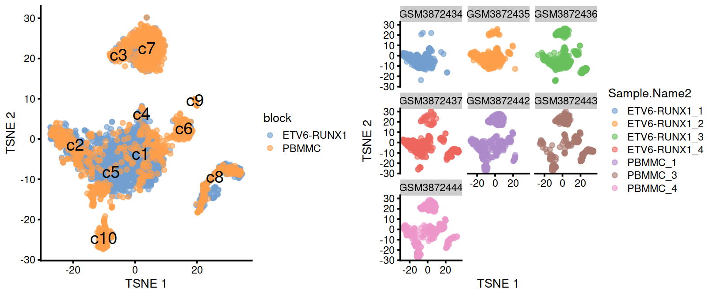

## Differential expression between conditions

### Creating pseudo-bulk samples

The most obvious differential analysis is to look for changes in expression between conditions. We perform the DE analysis separately for each label. The actual DE testing is performed on “pseudo-bulk” expression profiles (Tung et al. 2017), generated by summing counts together for all cells with the same combination of label and sample. This leverages the resolution offered by single-cell technologies to define the labels, and combines it with the statistical rigor of existing methods for DE analyses involving a small number of samples.


```r
# Using 'label' and 'sample' as our two factors; each column of the output
# corresponds to one unique combination of these two factors.
summed <- aggregateAcrossCells(merged, 
    				id = DataFrame(
    					label=merged$clusters.mnn,
    					sample=merged$Sample.Name2
					)
)
summed
```

```
## class: SingleCellExperiment 
## dim: 7930 68 
## metadata(2): merge.info pca.info
## assays(1): counts
## rownames(7930): ENSG00000000938 ENSG00000001084 ... ENSG00000285476
##   ENSG00000285486
## rowData names(12): rotation ensembl_gene_id ... detected gene_sparsity
## colnames: NULL
## colData names(11): batch Run ... sample ncells
## reducedDimNames(4): corrected PCA TSNE UMAP
## altExpNames(0):
```

```r
colData(summed) %>% head(3)
```

```
## DataFrame with 3 rows and 11 columns
##                   batch         Run Sample.Name source_name      block
##             <character> <character> <character>    <factor>   <factor>
## GSM3872434 ETV6-RUNX1_1  SRR9264343  GSM3872434  ETV6-RUNX1 ETV6-RUNX1
## GSM3872435 ETV6-RUNX1_2  SRR9264344  GSM3872435  ETV6-RUNX1 ETV6-RUNX1
## GSM3872436 ETV6-RUNX1_3  SRR9264345  GSM3872436  ETV6-RUNX1 ETV6-RUNX1
##                setName Sample.Name2 clusters.mnn    label       sample
##            <character>  <character>     <factor> <factor>  <character>
## GSM3872434       Caron ETV6-RUNX1_1           c1       c1 ETV6-RUNX1_1
## GSM3872435       Caron ETV6-RUNX1_2           c1       c1 ETV6-RUNX1_2
## GSM3872436       Caron ETV6-RUNX1_3           c1       c1 ETV6-RUNX1_3
##               ncells
##            <integer>
## GSM3872434       106
## GSM3872435       302
## GSM3872436       142
```

At this point, it is worth reflecting on the motivations behind the use of pseudo-bulking:

Larger counts are more amenable to standard DE analysis pipelines designed for bulk RNA-seq data. Normalization is more straightforward and certain statistical approximations are more accurate e.g., the saddlepoint approximation for quasi-likelihood methods or normality for linear models.
Collapsing cells into samples reflects the fact that our biological replication occurs at the sample level (Lun and Marioni 2017). Each sample is represented no more than once for each condition, avoiding problems from unmodelled correlations between samples. Supplying the per-cell counts directly to a DE analysis pipeline would imply that each cell is an independent biological replicate, which is not true from an experimental perspective. (A mixed effects model can handle this variance structure but involves extra statistical and computational complexity for little benefit, see Crowell et al. (2019).)
Variance between cells within each sample is masked, provided it does not affect variance across (replicate) samples. This avoids penalizing DEGs that are not uniformly up- or down-regulated for all cells in all samples of one condition. Masking is generally desirable as DEGs - unlike marker genes - do not need to have low within-sample variance to be interesting, e.g., if the treatment effect is consistent across replicate populations but heterogeneous on a per-cell basis. (Of course, high per-cell variability will still result in weaker DE if it affects the variability across populations, while homogeneous per-cell responses will result in stronger DE due to a larger population-level log-fold change. These effects are also largely desirable.)


### Performing the DE analysis

#### Introduction

The DE analysis will be performed using quasi-likelihood (QL) methods from the edgeR package (Robinson, McCarthy, and Smyth 2010; Chen, Lun, and Smyth 2016). This uses a negative binomial generalized linear model (NB GLM) to handle overdispersed count data in experiments with limited replication. In our case, we have biological variation with three paired replicates per condition, so edgeR (or its contemporaries) is a natural choice for the analysis.

We do not use all labels for GLM fitting as the strong DE between labels makes it difficult to compute a sensible average abundance to model the mean-dispersion trend. Moreover, label-specific batch effects would not be easily handled with a single additive term in the design matrix for the batch. Instead, we arbitrarily pick one of the labels to use for this demonstration.


```r
labelToGet <- "c1"
current <- summed[,summed$label==labelToGet]

# Creating up a DGEList object for use in edgeR:
suppressMessages(library(edgeR))
y <- DGEList(counts(current), samples=colData(current))
y
```

```
## An object of class "DGEList"
## $counts
##                 Sample1 Sample2 Sample3 Sample4 Sample5 Sample6 Sample7
## ENSG00000000938       0       0       1       0       0       0       0
## ENSG00000001084       4       2       2       0       1       1       0
## ENSG00000001461      10       2       2       1       1       0       0
## ENSG00000001561       1       1       1       0       0       0       1
## ENSG00000001617       1       2       2       1       0       0       0
## 7925 more rows ...
## 
## $samples
##         group lib.size norm.factors        batch        Run Sample.Name
## Sample1     1   148211            1 ETV6-RUNX1_1 SRR9264343  GSM3872434
## Sample2     1   268059            1 ETV6-RUNX1_2 SRR9264344  GSM3872435
## Sample3     1   127692            1 ETV6-RUNX1_3 SRR9264345  GSM3872436
## Sample4     1    51047            1 ETV6-RUNX1_4 SRR9264346  GSM3872437
## Sample5     1    14364            1      PBMMC_1 SRR9264352  GSM3872442
## Sample6     1    12965            1      PBMMC_3 SRR9264353  GSM3872443
## Sample7     1    32919            1      PBMMC_4 SRR9264354  GSM3872444
##         source_name      block setName Sample.Name2 clusters.mnn label
## Sample1  ETV6-RUNX1 ETV6-RUNX1   Caron ETV6-RUNX1_1           c1    c1
## Sample2  ETV6-RUNX1 ETV6-RUNX1   Caron ETV6-RUNX1_2           c1    c1
## Sample3  ETV6-RUNX1 ETV6-RUNX1   Caron ETV6-RUNX1_3           c1    c1
## Sample4  ETV6-RUNX1 ETV6-RUNX1   Caron ETV6-RUNX1_4           c1    c1
## Sample5       PBMMC      PBMMC   Caron      PBMMC_1           c1    c1
## Sample6       PBMMC      PBMMC   Caron      PBMMC_3           c1    c1
## Sample7       PBMMC      PBMMC   Caron      PBMMC_4           c1    c1
##               sample ncells
## Sample1 ETV6-RUNX1_1    106
## Sample2 ETV6-RUNX1_2    302
## Sample3 ETV6-RUNX1_3    142
## Sample4 ETV6-RUNX1_4     64
## Sample5      PBMMC_1     57
## Sample6      PBMMC_3     17
## Sample7      PBMMC_4     76
```

#### Pre-processing

A typical step in bulk RNA-seq data analyses is to remove samples with very low library sizes due to failed library preparation or sequencing. The very low counts in these samples can be troublesome in downstream steps such as normalization (Chapter 7) or for some statistical approximations used in the DE analysis. In our situation, this is equivalent to removing label-sample combinations that have very few or lowly-sequenced cells. The exact definition of “very low” will vary, but in this case, we remove combinations containing fewer than 20 cells (Crowell et al. 2019). Alternatively, we could apply the outlier-based strategy described in Chapter 6, but this makes the strong assumption that all label-sample combinations have similar numbers of cells that are sequenced to similar depth.

<!--
with 500 cells per samples, some clusters are discarded, which may not be with more cells
-->


```r
discarded <- current$ncells < 20
y <- y[,!discarded]
summary(discarded)
```

```
##    Mode   FALSE    TRUE 
## logical       6       1
```

Another typical step in bulk RNA-seq analyses is to remove genes that are lowly expressed. This reduces computational work, improves the accuracy of mean-variance trend modelling and decreases the severity of the multiple testing correction. Genes are discarded if they are not expressed above a log-CPM threshold in a minimum number of samples (determined from the size of the smallest treatment group in the experimental design).


```r
keep <- filterByExpr(y, group=current$source_name)
y <- y[keep,]
summary(keep)
```

```
##    Mode   FALSE    TRUE 
## logical    6663    1267
```

Finally, we correct for composition biases by computing normalization factors with the trimmed mean of M-values method (Robinson and Oshlack 2010). We do not need the bespoke single-cell methods described in Chapter 7, as the counts for our pseudo-bulk samples are large enough to apply bulk normalization methods. (Readers should be aware that edgeR normalization factors are closely related but not the same as the size factors described elsewhere in this book.)


```r
y <- calcNormFactors(y)
y$samples
```

```
##         group lib.size norm.factors        batch        Run Sample.Name
## Sample1     1   148211    0.8594544 ETV6-RUNX1_1 SRR9264343  GSM3872434
## Sample2     1   268059    1.0415348 ETV6-RUNX1_2 SRR9264344  GSM3872435
## Sample3     1   127692    1.0953319 ETV6-RUNX1_3 SRR9264345  GSM3872436
## Sample4     1    51047    0.9872575 ETV6-RUNX1_4 SRR9264346  GSM3872437
## Sample5     1    14364    1.0163112      PBMMC_1 SRR9264352  GSM3872442
## Sample7     1    32919    1.0164838      PBMMC_4 SRR9264354  GSM3872444
##         source_name      block setName Sample.Name2 clusters.mnn label
## Sample1  ETV6-RUNX1 ETV6-RUNX1   Caron ETV6-RUNX1_1           c1    c1
## Sample2  ETV6-RUNX1 ETV6-RUNX1   Caron ETV6-RUNX1_2           c1    c1
## Sample3  ETV6-RUNX1 ETV6-RUNX1   Caron ETV6-RUNX1_3           c1    c1
## Sample4  ETV6-RUNX1 ETV6-RUNX1   Caron ETV6-RUNX1_4           c1    c1
## Sample5       PBMMC      PBMMC   Caron      PBMMC_1           c1    c1
## Sample7       PBMMC      PBMMC   Caron      PBMMC_4           c1    c1
##               sample ncells
## Sample1 ETV6-RUNX1_1    106
## Sample2 ETV6-RUNX1_2    302
## Sample3 ETV6-RUNX1_3    142
## Sample4 ETV6-RUNX1_4     64
## Sample5      PBMMC_1     57
## Sample7      PBMMC_4     76
```

#### Statistical modelling

Our aim is to test whether the log-fold change between sample groups is significantly different from zero.


```r
design <- model.matrix(~factor(source_name), y$samples)
design
```

```
##         (Intercept) factor(source_name)PBMMC
## Sample1           1                        0
## Sample2           1                        0
## Sample3           1                        0
## Sample4           1                        0
## Sample5           1                        1
## Sample7           1                        1
## attr(,"assign")
## [1] 0 1
## attr(,"contrasts")
## attr(,"contrasts")$`factor(source_name)`
## [1] "contr.treatment"
```

We estimate the negative binomial (NB) dispersions with estimateDisp(). The role of the NB dispersion is to model the mean-variance trend, which is not easily accommodated by QL dispersions alone due to the quadratic nature of the NB mean-variance trend.


```r
y <- estimateDisp(y, design)
summary(y$trended.dispersion)
```

```
##    Min. 1st Qu.  Median    Mean 3rd Qu.    Max. 
## 0.09437 0.09960 0.14979 0.15123 0.18063 0.26374
```

Biological coefficient of variation (BCV) for each gene as a function of the average abundance. The BCV is computed as the square root of the NB dispersion after empirical Bayes shrinkage towards the trend. Trended and common BCV estimates are shown in blue and red, respectively. 


```r
plotBCV(y)
```

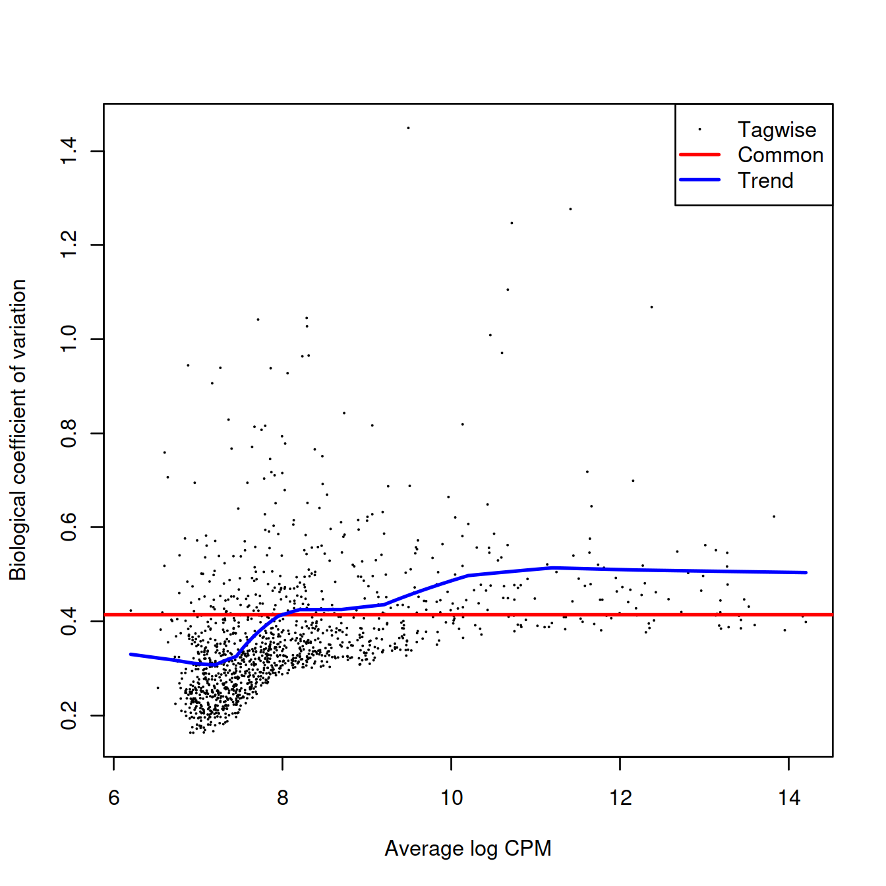

We also estimate the quasi-likelihood dispersions with glmQLFit() (Chen, Lun, and Smyth 2016). This fits a GLM to the counts for each gene and estimates the QL dispersion from the GLM deviance. We set robust=TRUE to avoid distortions from highly variable clusters (Phipson et al. 2016). The QL dispersion models the uncertainty and variability of the per-gene variance - which is not well handled by the NB dispersions, so the two dispersion types complement each other in the final analysis.


```r
fit <- glmQLFit(y, design, robust=TRUE)
summary(fit$var.prior)
```

```
##    Min. 1st Qu.  Median    Mean 3rd Qu.    Max. 
##  0.3968  0.6509  0.7361  0.7516  0.8719  1.7430
```


```r
summary(fit$df.prior)
```

```
##    Min. 1st Qu.  Median    Mean 3rd Qu.    Max. 
##   2.627   6.716   6.716   6.549   6.716   6.716
```

QL dispersion estimates for each gene as a function of abundance. Raw estimates (black) are shrunk towards the trend (blue) to yield squeezed estimates (red).


```r
plotQLDisp(fit)
```

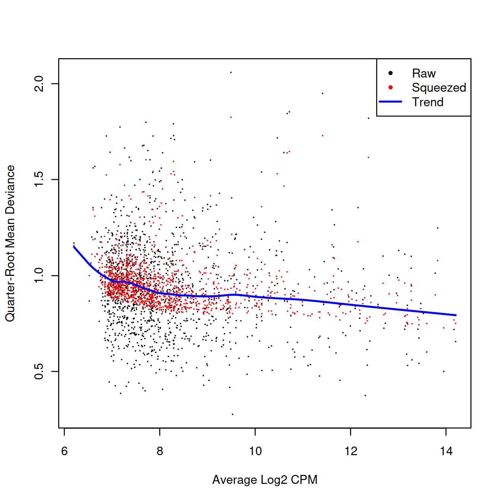

We test for differences in expression due to sample group using glmQLFTest(). DEGs are defined as those with non-zero log-fold changes at a false discovery rate of 5%. If very few genes are significantly DE that sample group has little effect on the transcriptome.


```r
res <- glmQLFTest(fit, coef=ncol(design))
summary(decideTests(res))
```

```
##        factor(source_name)PBMMC
## Down                         34
## NotSig                     1220
## Up                           13
```


```r
topTab <- topTags(res)$table
tmpAnnot <- rowData(current)[,c("ensembl_gene_id","Symbol")] %>% data.frame
topTab %>% tibble::rownames_to_column("ensembl_gene_id") %>%
	left_join(tmpAnnot, by="ensembl_gene_id")
```

```
##    ensembl_gene_id     logFC    logCPM        F       PValue         FDR
## 1  ENSG00000211677  5.101534  9.894626 59.00879 1.119357e-05 0.004797167
## 2  ENSG00000118523 -9.896691  9.659926 64.75468 1.333461e-05 0.004797167
## 3  ENSG00000076043  3.123214  9.112547 54.38761 1.625051e-05 0.004797167
## 4  ENSG00000169189  3.734421  9.281504 53.05725 1.818223e-05 0.004797167
## 5  ENSG00000280969 -5.246446 10.746495 52.58592 1.893120e-05 0.004797167
## 6  ENSG00000015413 -8.928757  8.773493 52.19555 3.312221e-05 0.005582001
## 7  ENSG00000227706 -6.334536 10.268919 45.63411 3.567980e-05 0.005582001
## 8  ENSG00000120833 -3.960692 10.678029 45.03576 3.781923e-05 0.005582001
## 9  ENSG00000175782 -3.931323  9.525119 43.64108 4.342648e-05 0.005582001
## 10 ENSG00000276043 -4.380489  9.935354 43.49777 4.405684e-05 0.005582001
##        Symbol
## 1       IGLC2
## 2        CTGF
## 3       REXO2
## 4      NSMCE1
## 5      RPS4Y2
## 6       DPEP1
## 7  AL713998.1
## 8       SOCS2
## 9     SLC35E3
## 10      UHRF1
```

#### Differential expression for each cluster

The steps illustrated above with cluster c1 are now repeated for each cluster:

* Subset pseudo-bulk counts for that cluster
* Create edgeR object with these pseudo-bulk counts
* Pre-process
    * Remove samples with very small library size
    * Remove genes with low UMI counts
    * Correct for compositional bias
* Perform differential expression analysis  
    * Estimate negative binomial dispersion
    * Estimate quasi-likelihood dispersion
    * Test for differential expression 


```r
de.results <- list()
for (labelToGet in levels(summed$label)) {

	current <- summed[,summed$label==labelToGet]

    y <- DGEList(counts(current), samples=colData(current))

    discarded <- isOutlier(colSums(counts(current)), log=TRUE, type="lower")
    y <- y[,!discarded]
    y <- y[filterByExpr(y, group=current$source_name),]
    y <- calcNormFactors(y)

    design <- try(
        model.matrix(~factor(source_name), y$samples),
        silent=TRUE
    )
    if (is(design, "try-error") || 
        qr(design)$rank==nrow(design) ||
        qr(design)$rank < ncol(design)) 
    {
        # Skipping labels without contrasts or without 
        # enough residual d.f. to estimate the dispersion.
        next
    }

    y <- estimateDisp(y, design)
    fit <- glmQLFit(y, design)
    res <- glmQLFTest(fit, coef=ncol(design))
    de.results[[labelToGet]] <- res
}
```

##### Number of DEGs by cluster and direction

We examine the numbers of DEGs at a FDR of 5% for each label (i.e. cluster). In general, there seems to be very little differential expression between the on and off conditions.


```r
summaries <- lapply(de.results, FUN=function(x) summary(decideTests(x))[,1])
sum.tab <- do.call(rbind, summaries)
#sum.tab
sum.tab[order(rownames(sum.tab)),] %>%
	as.data.frame() %>%
	tibble::rownames_to_column("Cluster") %>%
	datatable(rownames = FALSE, options = list(pageLength = 20, scrollX = TRUE))
```

```{=html}
<div id="htmlwidget-44c1b137a1c4e3a61b10" style="width:100%;height:auto;" class="datatables html-widget"></div>
<script type="application/json" data-for="htmlwidget-44c1b137a1c4e3a61b10">{"x":{"filter":"none","data":[["c1","c10","c2","c3","c4","c5","c6","c7","c8","c9"],[78,3,139,0,0,173,0,2,1,0],[568,202,1272,121,27,839,88,804,737,110],[90,0,82,0,0,139,0,0,0,0]],"container":"<table class=\"display\">\n  <thead>\n    <tr>\n      <th>Cluster<\/th>\n      <th>Down<\/th>\n      <th>NotSig<\/th>\n      <th>Up<\/th>\n    <\/tr>\n  <\/thead>\n<\/table>","options":{"pageLength":20,"scrollX":true,"columnDefs":[{"className":"dt-right","targets":[1,2,3]}],"order":[],"autoWidth":false,"orderClasses":false,"lengthMenu":[10,20,25,50,100]}},"evals":[],"jsHooks":[]}</script>
```

##### List of DEGs

We now list DEGs and the number of clusters they were detected in:


```r
degs <- lapply(de.results, FUN=function(x) rownames(topTags(x, p.value=0.05)))
common.degs <- sort(table(unlist(degs)), decreasing=TRUE)
#head(common.degs, 20)
common.degs %>%
	as.data.frame %>% 
	dplyr::rename(ensembl_gene_id = Var1, NbClu = Freq) %>%
	left_join(
	data.frame(rowData(summed)[,c("ensembl_gene_id", "Symbol")]),
	by="ensembl_gene_id") %>%
	#rename(Gene = ensembl_gene_id) %>%
	relocate(c("Symbol","NbClu","ensembl_gene_id")) %>%
	datatable(rownames = FALSE, options = list(pageLength = 20, scrollX = TRUE))
```

```{=html}
<div id="htmlwidget-d2c8650e6df2e8a4a741" style="width:100%;height:auto;" class="datatables html-widget"></div>
<script type="application/json" data-for="htmlwidget-d2c8650e6df2e8a4a741">{"x":{"filter":"none","data":[["IRF4","BEX3","IGLL5","RPS4Y2","ACSM3","MGST1","LYZ","TCL1A","FCGRT","DNTT","MDK","RNGTT","RGS2","RAB32","SRGN","IGLL1","FCRLA","C7orf50","C16orf74","CCDC191","MS4A7","AZU1","CSF1R","SOCS3","PRSS57","CFAP73","PRTN3","ELANE","CFD","FCGR3A","FAM30A","CD24"],[2,2,2,2,1,1,1,1,1,1,1,1,1,1,1,1,1,1,1,1,1,1,1,1,1,1,1,1,1,1,1,1],["ENSG00000137265","ENSG00000166681","ENSG00000254709","ENSG00000280969","ENSG00000005187","ENSG00000008394","ENSG00000090382","ENSG00000100721","ENSG00000104870","ENSG00000107447","ENSG00000110492","ENSG00000111880","ENSG00000116741","ENSG00000118508","ENSG00000122862","ENSG00000128322","ENSG00000132185","ENSG00000146540","ENSG00000154102","ENSG00000163617","ENSG00000166927","ENSG00000172232","ENSG00000182578","ENSG00000184557","ENSG00000185198","ENSG00000186710","ENSG00000196415","ENSG00000197561","ENSG00000197766","ENSG00000203747","ENSG00000226777","ENSG00000272398"]],"container":"<table class=\"display\">\n  <thead>\n    <tr>\n      <th>Symbol<\/th>\n      <th>NbClu<\/th>\n      <th>ensembl_gene_id<\/th>\n    <\/tr>\n  <\/thead>\n<\/table>","options":{"pageLength":20,"scrollX":true,"columnDefs":[{"className":"dt-right","targets":1}],"order":[],"autoWidth":false,"orderClasses":false,"lengthMenu":[10,20,25,50,100]}},"evals":[],"jsHooks":[]}</script>
```

##### Number of clusters skipped

"We also list the labels that were skipped due to the absence of replicates or contrasts. If it is necessary to extract statistics in the absence of replicates, several strategies can be applied such as reducing the complexity of the model or using a predefined value for the NB dispersion. We refer readers to the edgeR user’s guide for more details."


```r
skippedClusters <- setdiff(unique(summed$label), names(summaries))
```

The number of clusters skipped is 0.


```r
if(length(skippedClusters)>0)
{
  skippedClusters
}
```


```r
grmToShowList <- vector("list", length = nlevels(merged$clusters.mnn))
names(grmToShowList) <- levels(merged$clusters.mnn)
genesToExclude <- c()
nbGeneToShow <- 20

#degs <- lapply(de.results, FUN=function(x) (topTags(x, p.value=0.05)))
degs <- lapply(de.results, FUN=function(x) (as.data.frame(topTags(x, n=nbGeneToShow))))

for( namex in levels(merged$clusters.mnn) )
{
	nbGeneToUse <- min(c(nrow(degs[[namex]]), nbGeneToShow))

	# format

	# format p value:
	tmpCol <- grep("PValue|FDR", colnames(degs[[namex]]), value=TRUE)
	degs[[namex]][,tmpCol] <- apply(degs[[namex]][,tmpCol],
					     2,
					     function(x){format(x, scientific = TRUE, digits = 1)})
	# format logFC:
	tmpCol <- c("logFC", "logCPM", "F")
	degs[[namex]][,tmpCol] <- apply(degs[[namex]][,tmpCol], 2,  function(x){round(x, 2)})
	rm(tmpCol)

	# subset data
	grmToShow <- degs[[namex]] %>%
		as.data.frame() %>%
		tibble::rownames_to_column("gene") %>%	
		arrange(FDR, desc(abs(logFC))) %>%
		filter(! gene %in% genesToExclude) %>%
		group_modify(~ head(.x, nbGeneToUse)) 
	# keep data
	grmToShow$cluster <- namex
	grmToShowList[[namex]] <- grmToShow
	# tidy
	rm(nbGeneToUse)
}
grmToShowDf <- do.call("rbind", grmToShowList)
tmpCol <- c("cluster", "gene")
grmToShowDf %>%
	select(tmpCol, setdiff(colnames(grmToShowDf), tmpCol)) %>%
	filter(gene %in% names(common.degs) & as.numeric(FDR) < 0.05) %>%
	datatable(rownames = FALSE, filter="top", options=list(scrollX = TRUE, pageLength = 15))
```

```{=html}
<div id="htmlwidget-8bed1b16bbcad43b20d9" style="width:100%;height:auto;" class="datatables html-widget"></div>
<script type="application/json" data-for="htmlwidget-8bed1b16bbcad43b20d9">{"x":{"filter":"top","filterHTML":"<tr>\n  <td data-type=\"character\" style=\"vertical-align: top;\">\n    <div class=\"form-group has-feedback\" style=\"margin-bottom: auto;\">\n      <input type=\"search\" placeholder=\"All\" class=\"form-control\" style=\"width: 100%;\"/>\n      <span class=\"glyphicon glyphicon-remove-circle form-control-feedback\"><\/span>\n    <\/div>\n  <\/td>\n  <td data-type=\"character\" style=\"vertical-align: top;\">\n    <div class=\"form-group has-feedback\" style=\"margin-bottom: auto;\">\n      <input type=\"search\" placeholder=\"All\" class=\"form-control\" style=\"width: 100%;\"/>\n      <span class=\"glyphicon glyphicon-remove-circle form-control-feedback\"><\/span>\n    <\/div>\n  <\/td>\n  <td data-type=\"number\" style=\"vertical-align: top;\">\n    <div class=\"form-group has-feedback\" style=\"margin-bottom: auto;\">\n      <input type=\"search\" placeholder=\"All\" class=\"form-control\" style=\"width: 100%;\"/>\n      <span class=\"glyphicon glyphicon-remove-circle form-control-feedback\"><\/span>\n    <\/div>\n    <div style=\"display: none; position: absolute; width: 200px;\">\n      <div data-min=\"-8.23\" data-max=\"11.48\" data-scale=\"2\"><\/div>\n      <span style=\"float: left;\"><\/span>\n      <span style=\"float: right;\"><\/span>\n    <\/div>\n  <\/td>\n  <td data-type=\"number\" style=\"vertical-align: top;\">\n    <div class=\"form-group has-feedback\" style=\"margin-bottom: auto;\">\n      <input type=\"search\" placeholder=\"All\" class=\"form-control\" style=\"width: 100%;\"/>\n      <span class=\"glyphicon glyphicon-remove-circle form-control-feedback\"><\/span>\n    <\/div>\n    <div style=\"display: none; position: absolute; width: 200px;\">\n      <div data-min=\"6.06\" data-max=\"11.45\" data-scale=\"2\"><\/div>\n      <span style=\"float: left;\"><\/span>\n      <span style=\"float: right;\"><\/span>\n    <\/div>\n  <\/td>\n  <td data-type=\"number\" style=\"vertical-align: top;\">\n    <div class=\"form-group has-feedback\" style=\"margin-bottom: auto;\">\n      <input type=\"search\" placeholder=\"All\" class=\"form-control\" style=\"width: 100%;\"/>\n      <span class=\"glyphicon glyphicon-remove-circle form-control-feedback\"><\/span>\n    <\/div>\n    <div style=\"display: none; position: absolute; width: 200px;\">\n      <div data-min=\"26.94\" data-max=\"288.65\" data-scale=\"2\"><\/div>\n      <span style=\"float: left;\"><\/span>\n      <span style=\"float: right;\"><\/span>\n    <\/div>\n  <\/td>\n  <td data-type=\"character\" style=\"vertical-align: top;\">\n    <div class=\"form-group has-feedback\" style=\"margin-bottom: auto;\">\n      <input type=\"search\" placeholder=\"All\" class=\"form-control\" style=\"width: 100%;\"/>\n      <span class=\"glyphicon glyphicon-remove-circle form-control-feedback\"><\/span>\n    <\/div>\n  <\/td>\n  <td data-type=\"character\" style=\"vertical-align: top;\">\n    <div class=\"form-group has-feedback\" style=\"margin-bottom: auto;\">\n      <input type=\"search\" placeholder=\"All\" class=\"form-control\" style=\"width: 100%;\"/>\n      <span class=\"glyphicon glyphicon-remove-circle form-control-feedback\"><\/span>\n    <\/div>\n  <\/td>\n<\/tr>","data":[["c1","c1","c1","c1","c1","c1","c1","c1","c1","c1","c1","c10","c10","c10","c2","c2","c2","c2","c2","c2","c2","c2","c2","c2","c5","c5","c5","c5","c5","c5","c5","c5","c5","c5","c5","c5","c7","c7","c8"],["ENSG00000254709","ENSG00000005187","ENSG00000132185","ENSG00000163617","ENSG00000186710","ENSG00000154102","ENSG00000137265","ENSG00000280969","ENSG00000146540","ENSG00000111880","ENSG00000116741","ENSG00000182578","ENSG00000203747","ENSG00000166927","ENSG00000090382","ENSG00000166681","ENSG00000104870","ENSG00000128322","ENSG00000226777","ENSG00000280969","ENSG00000254709","ENSG00000110492","ENSG00000116741","ENSG00000137265","ENSG00000090382","ENSG00000172232","ENSG00000166681","ENSG00000122862","ENSG00000197561","ENSG00000196415","ENSG00000008394","ENSG00000185198","ENSG00000197766","ENSG00000118508","ENSG00000100721","ENSG00000226777","ENSG00000107447","ENSG00000184557","ENSG00000272398"],[8.66,7.95,7.64,7.56,6.96,6.83,6.74,-5.15,4.77,4.73,6.88,-3.26,-6.2,-3.4,8.07,8.02,-4.89,2.93,8.5,-8.23,7.26,-4.84,5.26,5.11,10.88,9.24,8.19,6.83,11.12,11.48,7.81,6.37,7.88,7.41,-4.68,7.37,-2.52,-2.25,-4.63],[9.58,7.86,8.3,8.29,7.4,7.28,7.78,10.56,7.14,8.51,9.91,8.48,10.27,9.35,6.41,6.37,8.94,11.45,6.84,9.68,6.98,10.22,8.48,6.86,9.21,8.69,7.62,10.38,9.46,9.83,7.96,9.3,7.29,6.75,11.17,8.01,8.78,9.39,6.06],[111.84,107.44,112.14,108.59,88.42,115,104.18,88.09,89.33,99.16,76.82,31.59,52.91,43.73,115.5,112.54,70.52,63.54,188.88,120.15,96.57,99.51,83.7,76.65,128.36,194.43,174.57,181.34,288.65,209.55,110.72,115.21,106.25,103.95,97.46,91.16,26.94,30.81,39.19],["9e-07","1e-06","9e-07","1e-06","3e-06","8e-07","1e-06","3e-06","3e-06","2e-06","5e-06","2e-04","3e-05","7e-05","8e-06","9e-06","6e-06","9e-06","1e-06","4e-07","1e-06","1e-06","3e-06","4e-06","2e-06","2e-08","3e-08","2e-08","9e-08","3e-07","3e-07","3e-07","4e-07","5e-07","6e-07","9e-07","6e-05","3e-05","3e-05"],["2e-04","2e-04","2e-04","2e-04","2e-04","2e-04","2e-04","2e-04","2e-04","2e-04","3e-04","2e-02","6e-03","7e-03","1e-03","1e-03","1e-03","1e-03","5e-04","5e-04","5e-04","5e-04","8e-04","9e-04","1e-04","1e-05","1e-05","1e-05","3e-05","5e-05","5e-05","5e-05","6e-05","6e-05","7e-05","9e-05","2e-02","2e-02","2e-02"]],"container":"<table class=\"display\">\n  <thead>\n    <tr>\n      <th>cluster<\/th>\n      <th>gene<\/th>\n      <th>logFC<\/th>\n      <th>logCPM<\/th>\n      <th>F<\/th>\n      <th>PValue<\/th>\n      <th>FDR<\/th>\n    <\/tr>\n  <\/thead>\n<\/table>","options":{"scrollX":true,"pageLength":15,"columnDefs":[{"className":"dt-right","targets":[2,3,4]}],"order":[],"autoWidth":false,"orderClasses":false,"orderCellsTop":true,"lengthMenu":[10,15,25,50,100]}},"evals":[],"jsHooks":[]}</script>
```

```r
tmpBool <- as.numeric(grmToShowDf$FDR) < 0.05 
markers.to.plot <- unique(grmToShowDf[tmpBool, "gene"])
markers.to.plot <- markers.to.plot[1:5]
```

### Putting it all together

Now that we have laid out the theory underlying the DE analysis, we repeat this process for each of the labels. This is conveniently done using the pseudoBulkDGE() function from scran, which will loop over all labels and apply the exact analysis described above to each label. To prepare for this, we filter out all sample-label combinations with insufficient cells.


```r
summed.filt <- summed[,summed$ncells >= 20]
```

We construct a common design matrix that will be used in the analysis for each label. Recall that this matrix should have one row per unique sample (and named as such), reflecting the fact that we are modelling counts on the sample level instead of the cell level.


```r
# Pulling out a sample-level 'targets' data.frame:
targets <- colData(merged)[!duplicated(merged$Sample.Name2),] %>%
  data.frame() %>%
  select(-clusters.mnn)

# Constructing the design matrix:
design <- model.matrix(~factor(source_name), data=targets)
rownames(design) <- targets$Sample.Name2
```

We then apply the pseudoBulkDGE() function to obtain a list of DE genes for each label. This function puts some additional effort into automatically dealing with labels that are not represented in all sample groups, for which a DE analysis between conditions is meaningless; or are not represented in a sufficient number of replicate samples to enable modelling of biological variability.


```r
library(scran)
de.results <- pseudoBulkDGE(summed.filt, 
    sample=summed.filt$Sample.Name2,
    label=summed.filt$label,
    design=design,
    coef=ncol(design),

    # 'condition' sets the group size for filterByExpr(),
    # to perfectly mimic our previous manual analysis.
    condition=targets$source_name 
)
```

We examine the numbers of DEGs at a FDR of 5% for each label using the decideTestsPerLabel() function. Note that genes listed as NA were either filtered out as low-abundance genes for a given label’s analysis, or the comparison of interest was not possible for a particular label, e.g., due to lack of residual degrees of freedom or an absence of samples from both conditions.


```r
is.de <- decideTestsPerLabel(de.results, threshold=0.05)
summarizeTestsPerLabel(is.de)
```

```
##     -1    0  1   NA
## c1  43 1566 45 6276
## c2  76 1643 50 6161
## c3   0  550  2 7378
## c5 109 1365 97 6359
## c6   2  648  3 7277
## c7   3 1739  7 6181
## c8  18 1365 14 6533
```

For each gene, we compute the percentage of cell types in which that gene is upregulated or downregulated. (Here, we consider a gene to be non-DE if it is not retained after filtering.).

<!-- TODO: add gene names -->


```r
# Upregulated across most cell types.
up.de <- is.de > 0 & !is.na(is.de)
head(sort(rowMeans(up.de), decreasing=TRUE), 10)
```

```
## ENSG00000090382 ENSG00000081237 ENSG00000143546 ENSG00000152520 ENSG00000163220 
##       0.5714286       0.4285714       0.4285714       0.4285714       0.4285714 
## ENSG00000166803 ENSG00000182287 ENSG00000226777 ENSG00000026508 ENSG00000076043 
##       0.4285714       0.4285714       0.4285714       0.2857143       0.2857143
```


```r
# Downregulated across cell types.
down.de <- is.de < 0 & !is.na(is.de)
head(sort(rowMeans(down.de), decreasing=TRUE), 10)
```

```
## ENSG00000110492 ENSG00000120833 ENSG00000132604 ENSG00000227706 ENSG00000280969 
##       0.5714286       0.5714286       0.5714286       0.5714286       0.5714286 
## ENSG00000015413 ENSG00000019582 ENSG00000066923 ENSG00000082074 ENSG00000091972 
##       0.4285714       0.4285714       0.4285714       0.4285714       0.4285714
```

We further identify label-specific DE genes that are significant in our label of interest yet not DE in any other label. As hypothesis tests are not typically geared towards identifying genes that are not DE, we use an ad hoc approach where we consider a gene to be consistent with the null hypothesis for a label if it fails to be detected even at a generous FDR threshold of 50%.


```r
remotely.de <- decideTestsPerLabel(de.results, threshold=0.5)
not.de <- remotely.de==0 | is.na(remotely.de)

# first cluster in is.de
cx <- colnames(is.de)[1]
other.labels <- setdiff(colnames(not.de), cx)
unique.degs <- is.de[,cx]!=0 & rowMeans(not.de[,other.labels])==1
unique.degs <- names(which(unique.degs))
head(unique.degs)
```

```
## [1] "ENSG00000005187" "ENSG00000107902" "ENSG00000111880" "ENSG00000114446"
## [5] "ENSG00000114745" "ENSG00000125869"
```

```r
# 2nd cluster in is.de
cx <- colnames(is.de)[2]
other.labels <- setdiff(colnames(not.de), cx)
unique.degs <- is.de[,cx]!=0 & rowMeans(not.de[,other.labels])==1
unique.degs <- names(which(unique.degs))
```


```r
# Choosing the top-ranked gene for inspection:
de.inspec <- list()
de.inspec[[cx]] <- de.results[[cx]] 
de.inspec[[cx]] <- de.inspec[[cx]][order(de.inspec[[cx]]$PValue),]
de.inspec[[cx]] <- de.inspec[[cx]][rownames(de.inspec[[cx]]) %in% unique.degs,]

sizeFactors(summed.filt) <- NULL
plotExpression(logNormCounts(summed.filt), 
    features=rownames(de.inspec[[cx]])[1],
    x="source_name", colour_by="source_name", 
    other_fields="label") + 
    facet_wrap(~label)
```

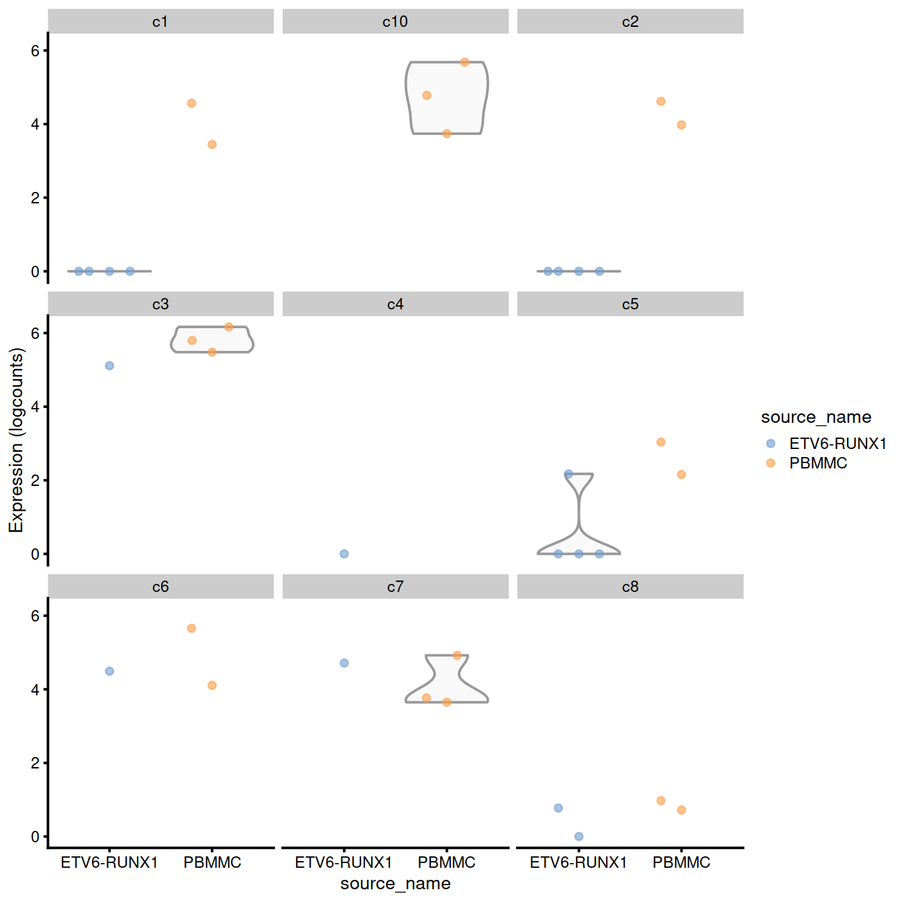

We also list the labels that were skipped due to the absence of replicates or contrasts. If it is necessary to extract statistics in the absence of replicates, several strategies can be applied such as reducing the complexity of the model or using a predefined value for the NB dispersion. We refer readers to the edgeR user’s guide for more details.


```r
print(metadata(de.results)$failed)
```

```
## [1] "c10" "c4"
```

## Differential abundance between conditions

### Overview

n a DA analysis, we test for significant changes in per-label cell abundance across conditions. This will reveal which cell types are depleted or enriched upon treatment, which is arguably just as interesting as changes in expression within each cell type. The DA analysis has a long history in flow cytometry (Finak et al. 2014; Lun, Richard, and Marioni 2017) where it is routinely used to examine the effects of different conditions on the composition of complex cell populations. By performing it here, we effectively treat scRNA-seq as a “super-FACS” technology for defining relevant subpopulations using the entire transcriptome.

We prepare for the DA analysis by quantifying the number of cells assigned to each label (or cluster).


```r
abundances <- table(merged$clusters.mnn, merged$Sample.Name2) 
abundances <- unclass(abundances) 
head(abundances)
```

```
##      
##       ETV6-RUNX1_1 ETV6-RUNX1_2 ETV6-RUNX1_3 ETV6-RUNX1_4 PBMMC_1 PBMMC_3
##   c1           106          302          142           64      57      17
##   c10            1            0            5            7      31      51
##   c2           130           72           31          131      99      11
##   c3             2            6           32            9      26      26
##   c4            21           19            7            7       6       6
##   c5           235           82           55          131      66      16
##      
##       PBMMC_4
##   c1       76
##   c10      85
##   c2       59
##   c3       37
##   c4        1
##   c5       22
```

Performing the DA analysis

Our DA analysis will again be performed with the edgeR package. This allows us to take advantage of the NB GLM methods to model overdispersed count data in the presence of limited replication - except that the counts are not of reads per gene, but of cells per label (Lun, Richard, and Marioni 2017). The aim is to share information across labels to improve our estimates of the biological variability in cell abundance between replicates.


```r
# Attaching some column metadata.
extra.info <- colData(merged)[match(colnames(abundances), merged$Sample.Name2),]
y.ab <- DGEList(abundances, samples=extra.info)
y.ab
```

```
## An object of class "DGEList"
## $counts
##      
##       ETV6-RUNX1_1 ETV6-RUNX1_2 ETV6-RUNX1_3 ETV6-RUNX1_4 PBMMC_1 PBMMC_3
##   c1           106          302          142           64      57      17
##   c10            1            0            5            7      31      51
##   c2           130           72           31          131      99      11
##   c3             2            6           32            9      26      26
##   c4            21           19            7            7       6       6
##   c5           235           82           55          131      66      16
##   c6             2            6           49           12      16      51
##   c7             1           10          138           17     178     125
##   c8             2            1           39          120      15     193
##   c9             0            2            2            2       6       4
##      
##       PBMMC_4
##   c1       76
##   c10      85
##   c2       59
##   c3       37
##   c4        1
##   c5       22
##   c6       58
##   c7      124
##   c8       32
##   c9        6
## 
## $samples
##              group lib.size norm.factors        batch        Run Sample.Name
## ETV6-RUNX1_1     1      500            1 ETV6-RUNX1_1 SRR9264343  GSM3872434
## ETV6-RUNX1_2     1      500            1 ETV6-RUNX1_2 SRR9264344  GSM3872435
## ETV6-RUNX1_3     1      500            1 ETV6-RUNX1_3 SRR9264345  GSM3872436
## ETV6-RUNX1_4     1      500            1 ETV6-RUNX1_4 SRR9264346  GSM3872437
## PBMMC_1          1      500            1      PBMMC_1 SRR9264352  GSM3872442
## PBMMC_3          1      500            1      PBMMC_3 SRR9264353  GSM3872443
## PBMMC_4          1      500            1      PBMMC_4 SRR9264354  GSM3872444
##              source_name      block setName Sample.Name2 clusters.mnn
## ETV6-RUNX1_1  ETV6-RUNX1 ETV6-RUNX1   Caron ETV6-RUNX1_1           c5
## ETV6-RUNX1_2  ETV6-RUNX1 ETV6-RUNX1   Caron ETV6-RUNX1_2           c1
## ETV6-RUNX1_3  ETV6-RUNX1 ETV6-RUNX1   Caron ETV6-RUNX1_3           c1
## ETV6-RUNX1_4  ETV6-RUNX1 ETV6-RUNX1   Caron ETV6-RUNX1_4           c5
## PBMMC_1            PBMMC      PBMMC   Caron      PBMMC_1           c5
## PBMMC_3            PBMMC      PBMMC   Caron      PBMMC_3           c6
## PBMMC_4            PBMMC      PBMMC   Caron      PBMMC_4           c7
```

We filter out low-abundance labels as previously described. This avoids cluttering the result table with very rare subpopulations that contain only a handful of cells. For a DA analysis of cluster abundances, filtering is generally not required as most clusters will not be of low-abundance (otherwise there would not have been enough evidence to define the cluster in the first place).


```r
keep <- filterByExpr(y.ab, group=y.ab$samples$source_name)
y.ab <- y.ab[keep,]
summary(keep)
```

```
##    Mode   FALSE    TRUE 
## logical       2       8
```

Unlike DE analyses, we do not perform an additional normalization step with calcNormFactors(). This means that we are only normalizing based on the “library size”, i.e., the total number of cells in each sample. Any changes we detect between conditions will subsequently represent differences in the proportion of cells in each cluster. The motivation behind this decision is discussed in more detail in Section 14.4.3.

Here, the log-fold change in our model refers to the change in cell abundance between sample groups, rather than the change in gene expression.


```r
design <- model.matrix(~factor(source_name), y.ab$samples)
```

We use the estimateDisp() function to estimate the NB dipersion for each cluster. We turn off the trend as we do not have enough points for its stable estimation.


```r
y.ab <- estimateDisp(y.ab, design, trend="none")
summary(y.ab$common.dispersion)
```

```
##    Min. 1st Qu.  Median    Mean 3rd Qu.    Max. 
##  0.9104  0.9104  0.9104  0.9104  0.9104  0.9104
```


```r
plotBCV(y.ab, cex=1)
```

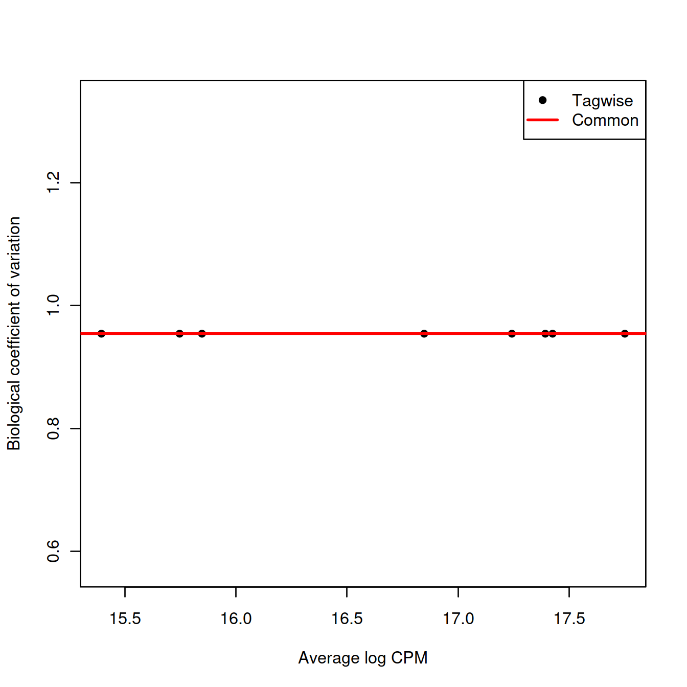

We repeat this process with the QL dispersion, again disabling the trend.


```r
fit.ab <- glmQLFit(y.ab, design, robust=TRUE, abundance.trend=FALSE)
summary(fit.ab$var.prior)
```

```
##    Min. 1st Qu.  Median    Mean 3rd Qu.    Max. 
##   1.194   1.194   1.194   1.194   1.194   1.194
```


```r
summary(fit.ab$df.prior)
```

```
##    Min. 1st Qu.  Median    Mean 3rd Qu.    Max. 
##     Inf     Inf     Inf     Inf     Inf     Inf
```


```r
plotQLDisp(fit.ab, cex=1)
```

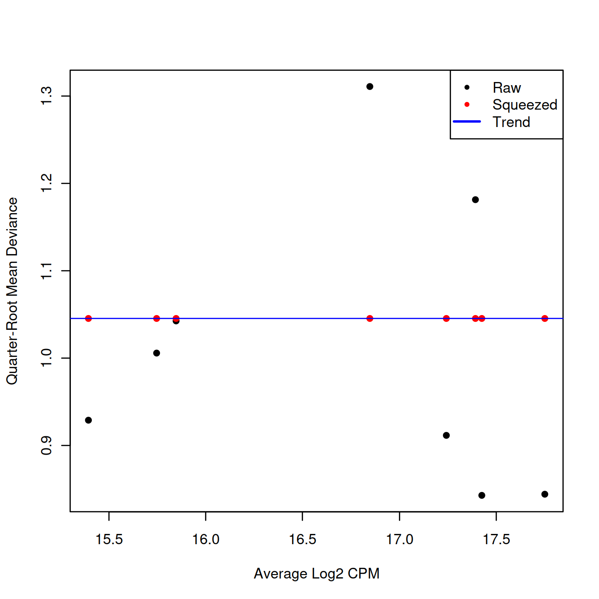

We test for differences in abundance between sample groups using glmQLFTest().


```r
res <- glmQLFTest(fit.ab, coef=ncol(design))
summary(decideTests(res))
```

```
##        factor(source_name)PBMMC
## Down                          0
## NotSig                        7
## Up                            1
```


```r
topTags(res)
```

```
## Coefficient:  factor(source_name)PBMMC 
##          logFC   logCPM          F     PValue        FDR
## c10  4.0470902 15.74685 10.0577058 0.00291083 0.02328664
## c7   1.7750178 17.39249  2.3540215 0.13283278 0.36842919
## c5  -1.8551781 17.42538  2.2889358 0.13816095 0.36842919
## c1  -1.6158108 17.75056  1.7778443 0.18995828 0.37917593
## c6   1.2662023 15.84737  1.1895964 0.28193774 0.37917593
## c3   1.2674803 15.39486  1.1774031 0.28438195 0.37917593
## c8   0.9798846 16.84737  0.7266487 0.39904698 0.45605369
## c2  -0.6906604 17.24233  0.3462865 0.55953120 0.55953120
```

### Handling composition effects

#### Background

As mentioned above, we do not use calcNormFactors() in our default DA analysis. This normalization step assumes that most of the input features are not different between conditions. While this assumption is reasonable for most types of gene expression data, it is generally too strong for cell type abundance - most experiments consist of only a few cell types that may all change in abundance upon perturbation. Thus, our default approach is to only normalize based on the total number of cells in each sample, which means that we are effectively testing for differential proportions between conditions.

Unfortunately, the use of the total number of cells leaves us susceptible to composition effects. For example, a large increase in abundance for one cell subpopulation will introduce decreases in proportion for all other subpopulations - which is technically correct, but may be misleading if one concludes that those other subpopulations are decreasing in abundance of their own volition. If composition biases are proving problematic for interpretation of DA results, we have several avenues for removing them or mitigating their impact by leveraging a priori biological knowledge.
14.4.3.2 Assuming most labels do not change

If it is possible to assume that most labels (i.e., cell types) do not change in abundance, we can use calcNormFactors() to compute normalization factors.


```r
y.ab2 <- calcNormFactors(y.ab)
y.ab2$samples$norm.factors
```

```
## [1] 1.0797797 0.7874609 1.1094467 1.1217977 1.1554603 0.7637496 1.0708011
```

We then proceed with the remainder of the edgeR analysis, shown below in condensed format. A shift of positive log-fold changes towards zero is consistent with the removal of composition biases.


```r
y.ab2 <- estimateDisp(y.ab2, design, trend="none")
fit.ab2 <- glmQLFit(y.ab2, design, robust=TRUE, abundance.trend=FALSE)
res2 <- glmQLFTest(fit.ab2, coef=ncol(design))
topTags(res2, n=10)
```

```
## Coefficient:  factor(source_name)PBMMC 
##          logFC   logCPM          F      PValue        FDR
## c10  4.2118760 15.77770 11.2523591 0.001750167 0.01400134
## c7   1.9097300 17.37701  2.8391796 0.099779044 0.27016312
## c5  -1.8855147 17.37775  2.4683379 0.124038346 0.27016312
## c1  -1.8043383 17.83098  2.2847501 0.138511999 0.27016312
## c6   1.4673226 15.87928  1.6637368 0.204507372 0.27016312
## c8   1.4290539 16.97272  1.6078079 0.212131360 0.27016312
## c3   1.3752491 15.38726  1.4450473 0.236392731 0.27016312
## c2  -0.7803397 17.18549  0.4604114 0.501338793 0.50133879
```

## Session information

<details>

```r
sessionInfo()
```

```
## R version 4.0.3 (2020-10-10)
## Platform: x86_64-pc-linux-gnu (64-bit)
## Running under: CentOS Linux 8
## 
## Matrix products: default
## BLAS:   /opt/R/R-4.0.3/lib64/R/lib/libRblas.so
## LAPACK: /opt/R/R-4.0.3/lib64/R/lib/libRlapack.so
## 
## locale:
##  [1] LC_CTYPE=en_GB.UTF-8       LC_NUMERIC=C              
##  [3] LC_TIME=en_GB.UTF-8        LC_COLLATE=en_GB.UTF-8    
##  [5] LC_MONETARY=en_GB.UTF-8    LC_MESSAGES=en_GB.UTF-8   
##  [7] LC_PAPER=en_GB.UTF-8       LC_NAME=C                 
##  [9] LC_ADDRESS=C               LC_TELEPHONE=C            
## [11] LC_MEASUREMENT=en_GB.UTF-8 LC_IDENTIFICATION=C       
## 
## attached base packages:
## [1] parallel  stats4    stats     graphics  grDevices utils     datasets 
## [8] methods   base     
## 
## other attached packages:
##  [1] edgeR_3.32.1                limma_3.46.0               
##  [3] batchelor_1.6.3             Cairo_1.5-12.2             
##  [5] DT_0.18                     dplyr_1.0.6                
##  [7] scran_1.18.7                scater_1.18.6              
##  [9] SingleCellExperiment_1.12.0 SummarizedExperiment_1.20.0
## [11] Biobase_2.50.0              GenomicRanges_1.42.0       
## [13] GenomeInfoDb_1.26.7         IRanges_2.24.1             
## [15] S4Vectors_0.28.1            BiocGenerics_0.36.1        
## [17] MatrixGenerics_1.2.1        matrixStats_0.58.0         
## [19] ggplot2_3.3.3               knitr_1.33                 
## 
## loaded via a namespace (and not attached):
##  [1] bitops_1.0-7              RColorBrewer_1.1-2       
##  [3] tools_4.0.3               bslib_0.2.5              
##  [5] ResidualMatrix_1.0.0      utf8_1.2.1               
##  [7] R6_2.5.0                  irlba_2.3.3              
##  [9] vipor_0.4.5               uwot_0.1.10              
## [11] DBI_1.1.1                 colorspace_2.0-1         
## [13] withr_2.4.2               tidyselect_1.1.1         
## [15] gridExtra_2.3             compiler_4.0.3           
## [17] cli_2.5.0                 BiocNeighbors_1.8.2      
## [19] DelayedArray_0.16.3       labeling_0.4.2           
## [21] bookdown_0.22             sass_0.4.0               
## [23] scales_1.1.1              stringr_1.4.0            
## [25] digest_0.6.27             rmarkdown_2.8            
## [27] XVector_0.30.0            pkgconfig_2.0.3          
## [29] htmltools_0.5.1.1         sparseMatrixStats_1.2.1  
## [31] highr_0.9                 htmlwidgets_1.5.3        
## [33] rlang_0.4.11              rstudioapi_0.13          
## [35] DelayedMatrixStats_1.12.3 farver_2.1.0             
## [37] jquerylib_0.1.4           generics_0.1.0           
## [39] jsonlite_1.7.2            crosstalk_1.1.1          
## [41] BiocParallel_1.24.1       RCurl_1.98-1.3           
## [43] magrittr_2.0.1            BiocSingular_1.6.0       
## [45] GenomeInfoDbData_1.2.4    scuttle_1.0.4            
## [47] Matrix_1.3-3              Rcpp_1.0.6               
## [49] ggbeeswarm_0.6.0          munsell_0.5.0            
## [51] fansi_0.4.2               viridis_0.6.1            
## [53] lifecycle_1.0.0           stringi_1.6.1            
## [55] yaml_2.2.1                zlibbioc_1.36.0          
## [57] Rtsne_0.15                grid_4.0.3               
## [59] dqrng_0.3.0               crayon_1.4.1             
## [61] lattice_0.20-44           splines_4.0.3            
## [63] cowplot_1.1.1             beachmat_2.6.4           
## [65] locfit_1.5-9.4            pillar_1.6.1             
## [67] igraph_1.2.6              codetools_0.2-18         
## [69] glue_1.4.2                evaluate_0.14            
## [71] vctrs_0.3.8               gtable_0.3.0             
## [73] purrr_0.3.4               assertthat_0.2.1         
## [75] xfun_0.23                 rsvd_1.0.5               
## [77] RSpectra_0.16-0           viridisLite_0.4.0        
## [79] tibble_3.1.2              pheatmap_1.0.12          
## [81] beeswarm_0.3.1            bluster_1.0.0            
## [83] statmod_1.4.36            ellipsis_0.3.2
```
</details>
