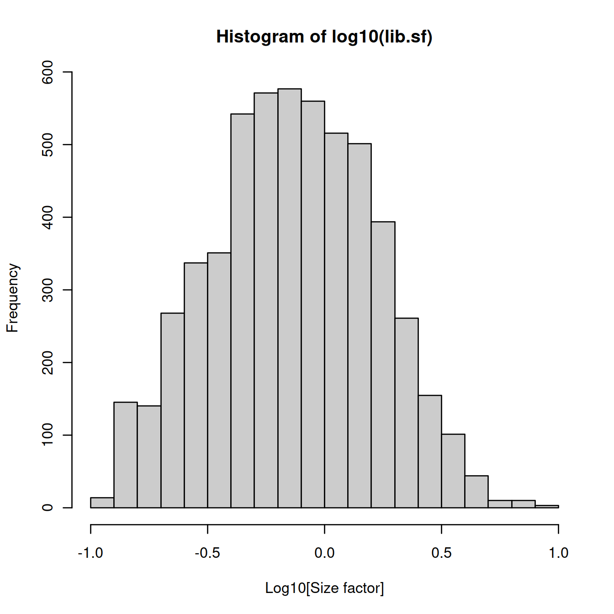
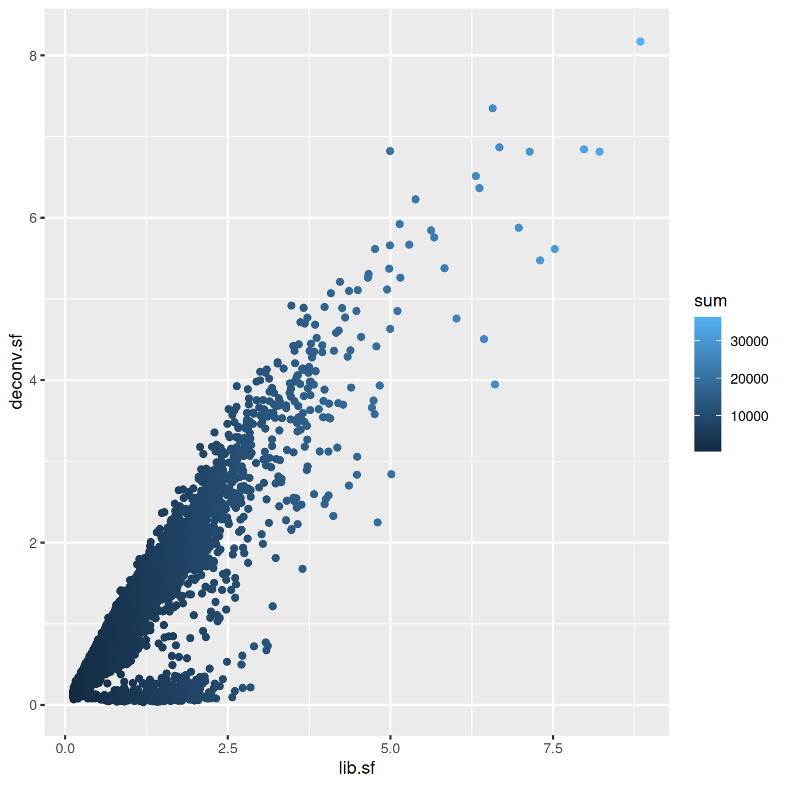
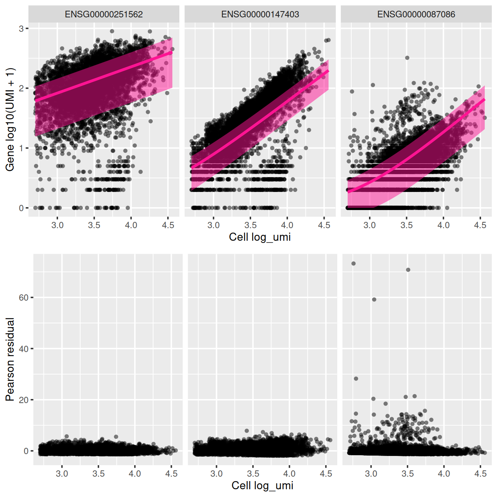
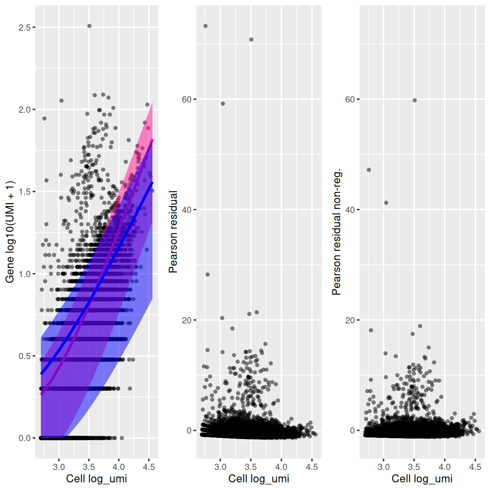
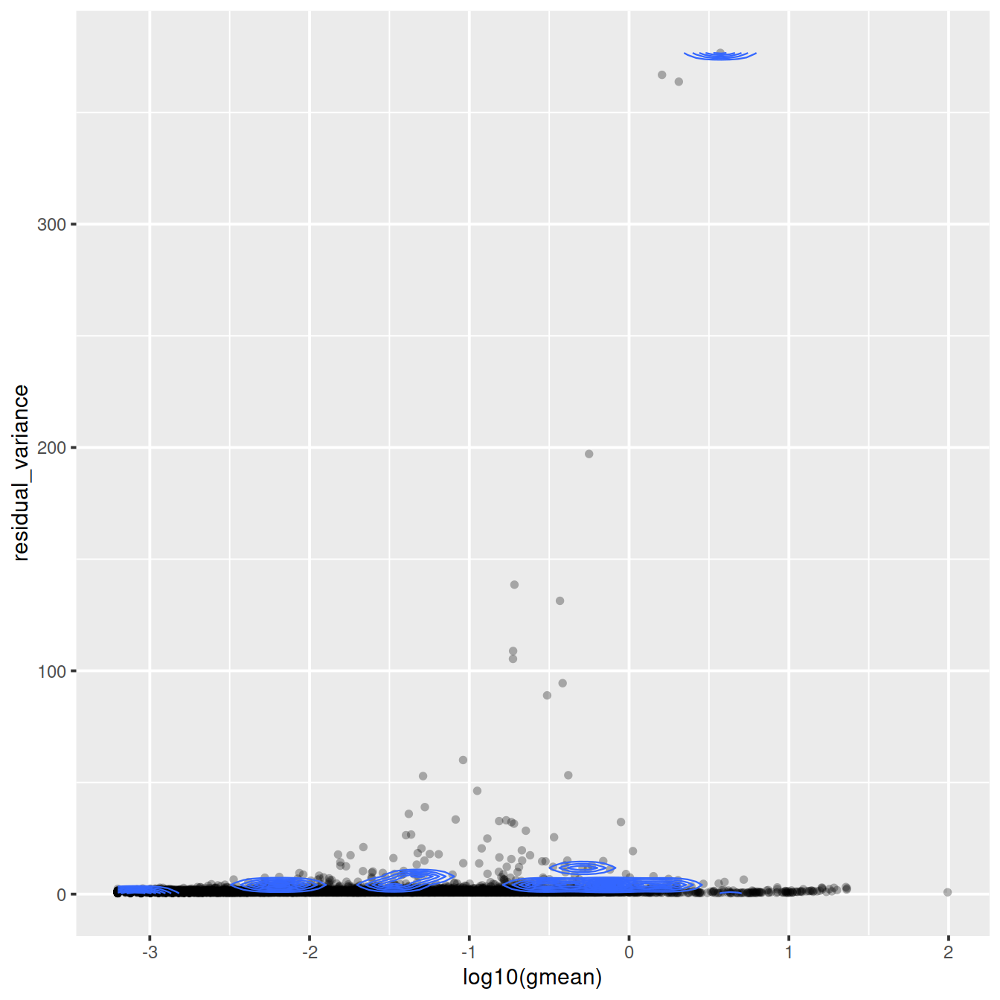
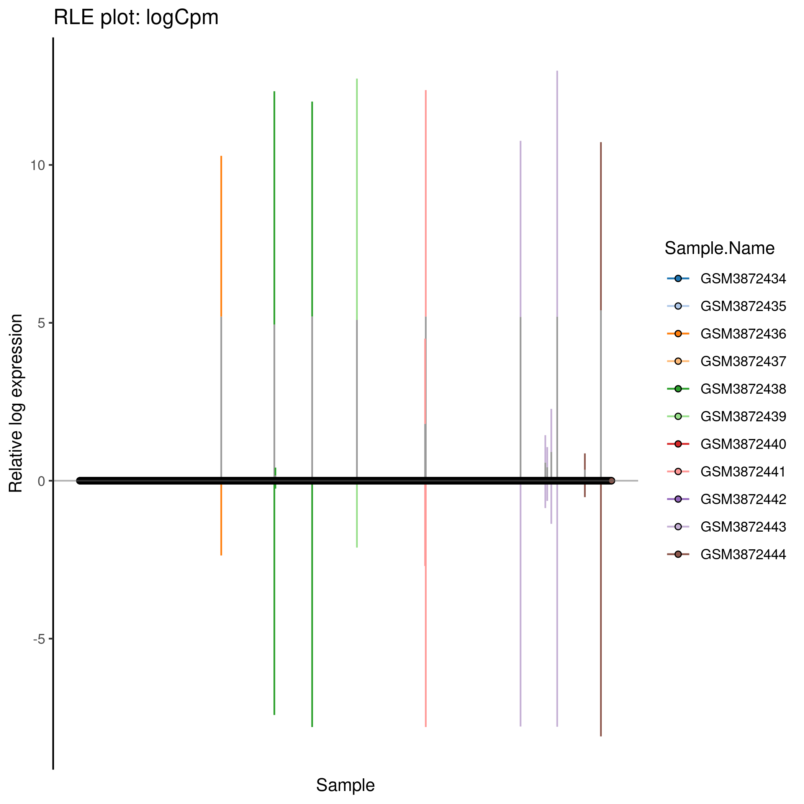
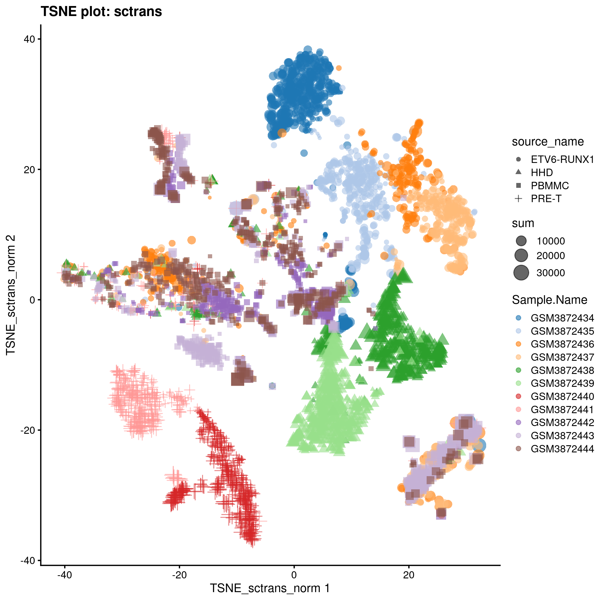
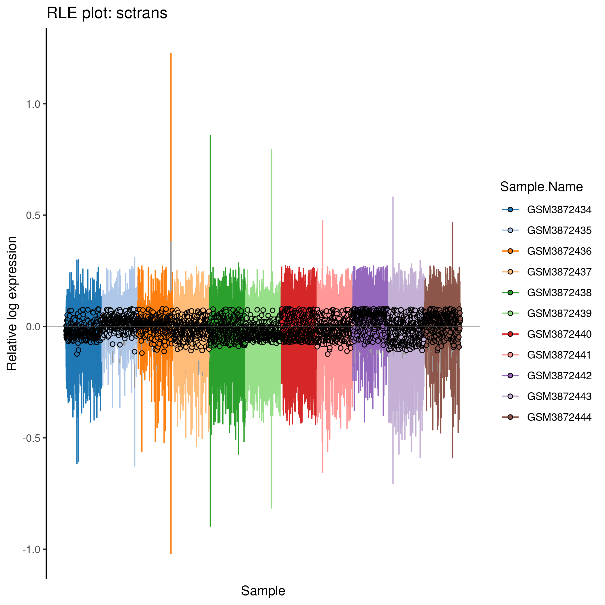

```r
#qcPlotDirBit <- "NormPlots"
#setNameUpp <- "Caron"
projDir <- params$projDir
dirRel <- params$dirRel
outDirBit <- params$outDirBit
cacheBool <- params$cacheBool
```


```r
library(knitr)
```


```r
src <- lapply(c("Caron"), function(setNameUpp) knit_expand(file = "normalisation_5hCellPerSpl.Rmd"))
##src <- lapply(c("Caron"), function(setNameUpp) knit_expand(file = "normalisation_5hCellPerSpl_dev.Rmd"))
```


---
title: "CRUK CI Summer School 2020 - introduction to single-cell RNA-seq analysis"
subtitle: 'Normalisation - 500 cells per sample'

author: "Stephane Ballereau"
output:
  html_notebook:
    code_folding: hide
    toc: yes
    toc_float: yes
    number_sections: true
  html_document:
    df_print: paged
    toc: yes
    number_sections: true
    code_folding: hide
  html_book:
    code_folding: hide
params:
  projDir: "/ssd/personal/baller01/20200511_FernandesM_ME_crukBiSs2020"
  dirRel: ".."
  inpDirBit: "AnaWiSce/Ana1"
  outDirBit: "AnaWiSce/Ana1"
  cacheBool: FALSE
  bookType: "mk"
---


# Normalisation - Caron set {#NormalisationCaron5hcpsTop}

Sources: chapters on Normalisation in the [OSCA book](https://osca.bioconductor.org/normalization.html) and the [Hemberg group materials](https://scrnaseq-course.cog.sanger.ac.uk/website/index.html).

Why normalise?

Systematic differences in sequencing coverage between libraries occur because of low input material, differences in cDNA capture and PCR amplification.
Normalisation removes such differences so that differences between cells are not technical but biological, allowing meaningful comparison of expression profiles between cells. Normalisation and batch correction have different aims. Normalisation addresses technical differences only, while batch correction considers both technical and biological differences.

## Learning objectives

<style>
div.blue {background-color:#e6f0ff; border-radius: 5px; padding: 20px;}
</style>
<div class = "blue">
* bla
* bla
* bla
</div>


```r
qcPlotDirBit <- "Plots/Norm"
setName <- tolower("Caron")
projDir <- params$projDir
dirRel <- params$dirRel
if(params$bookType == "mk"){dirRel <- ".."}
outDirBit <- params$outDirBit
writeRds <- TRUE # FALSE

dir.create(sprintf("%s/%s/%s", projDir, outDirBit, qcPlotDirBit),
           showWarnings = FALSE,
           recursive = TRUE)
```


<!--
# dev
projDir <- "/mnt/scratcha/bioinformatics/baller01/20200511_FernandesM_ME_crukBiSs2020"
outDirBit <- "AnaWiSce/Attempt1"
-->

Load object.


```r
setSuf <- ""
if(setName == "hca") {setSuf <- "_5kCellPerSpl"}

# Read object in:
tmpFn <- sprintf("%s/%s/Robjects/%s_sce_nz_postQc%s.Rds", projDir, outDirBit, setName, setSuf)
print(tmpFn)
```

```
## [1] "/ssd/personal/baller01/20200511_FernandesM_ME_crukBiSs2020/AnaWiSce/AnaCourse1/Robjects/caron_sce_nz_postQc.Rds"
```

```r
if(!file.exists(tmpFn))
{
	knitr::knit_exit()
}
sce <- readRDS(tmpFn)
sce
```

```
## class: SingleCellExperiment 
## dim: 16629 20908 
## metadata(0):
## assays(1): counts
## rownames(16629): ENSG00000237491 ENSG00000225880 ... ENSG00000275063
##   ENSG00000271254
## rowData names(11): ensembl_gene_id external_gene_name ... detected
##   gene_sparsity
## colnames: NULL
## colData names(15): Barcode Run ... outlier cell_sparsity
## reducedDimNames(0):
## altExpNames(0):
```


Subsample cells down to 500 per sample


```r
setSuf <- "_5hCellPerSpl"
nbCells <- 500
#setSuf <- "_1kCellPerSpl"
#nbCells <- 1000
#setSuf <- "_GSM3872434"
##nbCells <- 500
```


```r
# have new list of cell barcodes for each sample
sce.nz.master <- sce
vec.bc <- colData(sce.nz.master) %>%
	data.frame() %>%
	filter(!Run == "SRR9264351") %>%
	group_by(Sample.Name) %>%
	sample_n(nbCells) %>%
	pull(Barcode)

table(colData(sce.nz.master)$Barcode %in% vec.bc)
```

```
## 
## FALSE  TRUE 
## 15408  5500
```

```r
tmpInd <- which(colData(sce.nz.master)$Barcode %in% vec.bc)

sce <- sce.nz.master[,tmpInd]
```


<!--
# mind that genes were filtered using all cells, not just those sampled here.
-->

We write the R object to 'caron_sce_nz_postQc_5hCellPerSpl.Rds'.


```r
# Write object to file
tmpFn <- sprintf("%s/%s/Robjects/%s_sce_nz_postQc%s.Rds",
		 projDir, outDirBit, setName, setSuf)
saveRDS(sce, tmpFn)
```


```r
# Write object to file
tmpFn <- sprintf("%s/%s/Robjects/%s_sce_nz_postQc%s.Rds",
		 projDir, outDirBit, setName, setSuf)
sce <- readRDS(tmpFn)
```

## Scaling normalization

In scaling normalization, the “normalization factor” is an estimate of the library size relative to the other cells. Steps usually include: computation of a cell-specific 'scaling' or 'size' factor that represents the relative bias in that cell and division of all counts for the cell by that factor to remove that bias. Assumption: any cell specific bias will affect genes the same way.

Scaling methods typically generate normalised counts-per-million (CPM) or transcripts-per-million (TPM) values that address the effect of sequencing depth. These values however typically have a variance that increases with their mean (heteroscedasticity) while most statistical methods assume a stable variance, which does not vary with the mean (homoscedasticity). A widely used 'variance stabilising transformation' is the log transformation (often log2). This works fine for highly expressed genes (as in bulk RNA-seq) but less so for sparse scRNA-seq data.

### CPM

Convert raw counts to counts-per-million (CPM) for each cell by dividing counts by the library size then multiplying by 1.000.000. Mind that this does not adress compositional bias caused by highly expressed genes that are also differentially expressed betwenn cells. In `scater` CPMs are computed with the following code:


```r
calc_cpm <- function (expr_mat, spikes = NULL) 
{
    norm_factor <- colSums(expr_mat[-spikes, ])
    return(t(t(expr_mat)/norm_factor)) * 10^6
}
```

We will use `scater`'s calculateCPM()

### DESeq's size factor

For each gene, compute geometric mean across cells. for each cell compute for each gene the ratio of its expression to its geometric mean, and derive the cell's size factor as the median ratio across genes. Not suitable for sparse scRNA-seq data as the geometric is computed on non-zero values only. This method is also known as 'Relative Log Expression' (RLE) in `edgeR` and `scater`. 

Example code:


```r
calc_sf <- function (expr_mat, spikes = NULL) 
{
    geomeans <- exp(rowMeans(log(expr_mat[-spikes, ])))
    SF <- function(cnts) {
        median((cnts/geomeans)[(is.finite(geomeans) &
				geomeans > 0)])
    }
    norm_factor <- apply(expr_mat[-spikes, ], 2, SF)
    return(t(t(expr_mat)/norm_factor))
}
```

### Weighted Trimmed mean of M-values

To compute weighted Trimmed mean of M-values (TMM), a given cell is chosen as a reference to use in computation for other cells. The M-values are gene-wise log2-fold changes between cells. Trimming entails the removal of the top and bottom 30% of values. The size factor is computed as the average for the remaining cells with a weight according to inverse variances. This method assumes that most genes are not differentially expressed, and the 40% lof genes left after trimming may include many zero counts.


```r
sizeFactors(sce) <- edgeR::calcNormFactors(counts(sce), method = "TMM")
```

### Library size normalization

For each cell, the library size factor is proportional to the library size such that the average size factor across cell is one.

Advantage: normalised counts are on the same scale as the initial counts.

Compute size factors:


```r
lib.sf <- librarySizeFactors(sce)
summary(lib.sf)
```

```
##    Min. 1st Qu.  Median    Mean 3rd Qu.    Max. 
##  0.1222  0.4196  0.7350  1.0000  1.3192  8.8420
```

Size factor distribution: wide range, typical of scRNA-seq data.


```r
hist(log10(lib.sf), xlab="Log10[Size factor]", col='grey80')
```



Assumption: absence of compositional bias; differential expression two cells is balanced: upregulation in some genes is accompanied by downregulation of other genes. Not observed.

Inaccurate normalisation due to unaccounted-for composition bias affects the size of the log fold change measured between clusters, but less so the clustering itself. It is thus sufficient to identify clusters and top marker genes.

### Deconvolution

Composition bias occurs when differential expression beteween two samples or here cells is not balanced. For a fixed library size, identical in both cells, upregulation of one gene in the a cell will means fewer UMIs can be assigned to other genes, which would then appear down regulated. Even if library sizes are allowed to differ in size, with that for the cell with upregulation being higher, scaling normalisation will reduce noralised counts. Non-upregulated would therefore also appear downregulated. 

For bulk RNA-seq, composition bias is removed by assuming that most genes are not differentially expressed between samples, so that differences in non-DE genes would amount to the bias, and used to compute size factors.

Given the sparsity of scRNA-seq data, the methods are not appropriate.

The method below increases read counts by pooling cells into groups, computing size factors within each of these groups and scaling them so they are comparable across clusters. This process is repeated many times, changing pools each time to collect several size factors for each cell, frome which is derived a single value for that cell.

<!--
see DESeq2 estimateSizeFactorsFromMatrix
see edgeR calcNormFactors
-->

Cluster cells then normalise.

#### Cluster cells


```r
set.seed(100) # clusters with PCA from irlba with approximation
clust <- quickCluster(sce) # slow with all cells.

# write to file
tmpFn <- sprintf("%s/%s/Robjects/%s_sce_nz_quickClus%s.Rds",
		 projDir, outDirBit, setName, setSuf)
saveRDS(clust, tmpFn)
```


```r
# read from file
tmpFn <- sprintf("%s/%s/Robjects/%s_sce_nz_quickClus%s.Rds",
		 projDir, outDirBit, setName, setSuf)
clust <- readRDS(tmpFn)
table(clust)
```

```
## clust
##   1   2   3   4   5   6   7   8   9  10  11  12  13  14  15  16  17  18  19  20 
## 222 175 141 427 638 521 313 120 226 179 234 369 428 167 187 162 314 104 150 134 
##  21  22 
## 134 155
```

#### Compute size factors


```r
#deconv.sf <- calculateSumFactors(sce, cluster=clust)
sce <- computeSumFactors(sce, cluster=clust, min.mean=0.1)
deconv.sf <- sizeFactors(sce)

# write to file
tmpFn <- sprintf("%s/%s/Robjects/%s_sce_nz_deconvSf%s.Rds", projDir, outDirBit, setName, setSuf)
saveRDS(deconv.sf, tmpFn)
```


```r
# read from file
tmpFn <- sprintf("%s/%s/Robjects/%s_sce_nz_deconvSf%s.Rds", projDir, outDirBit, setName, setSuf)
deconv.sf <- readRDS(tmpFn)

summary(deconv.sf)
```

```
##    Min. 1st Qu.  Median    Mean 3rd Qu.    Max. 
## 0.03427 0.37755 0.72301 1.00000 1.35926 8.16947
```

Plot size factors:


```r
plot(lib.sf, deconv.sf, xlab="Library size factor",
    ylab="Deconvolution size factor", log='xy', pch=16,
    col=as.integer(factor(sce$source_name)))
abline(a=0, b=1, col="red")
```


```r
deconvDf <- data.frame(lib.sf, deconv.sf,
			"source_name" = sce$source_name,
			"sum" = sce$sum,
			"mito_content" = sce$subsets_Mito_percent,
			"cell_sparsity" = sce$cell_sparsity)

# colour by sample type
sp <- ggplot(deconvDf, aes(x=lib.sf, y=deconv.sf, col=source_name)) +
  geom_point()
sp + facet_wrap(~source_name)
```


```r
# colour by library size
sp <- ggplot(deconvDf, aes(x=lib.sf, y=deconv.sf, col=sum)) +
  geom_point()
sp
```



```r
# colour by mito. content
sp <- ggplot(deconvDf, aes(x=lib.sf, y=deconv.sf, col=mito_content)) +
  geom_point()
sp
```


```r
# colour by cell sparsity
sp <- ggplot(deconvDf, aes(x=lib.sf, y=deconv.sf, col=cell_sparsity)) +
  geom_point()
sp
```


#### Apply size factors

For each cell, raw counts for genes are divided by the size factor for that cell and log-transformed so downstream analyses focus on genes with strong relative differences. We use `scater::logNormCounts()`.


```r
sce <- logNormCounts(sce) # adds logcounts
print(assayNames(sce))
```

```
## [1] "counts"    "logcounts"
```

#### Save object


```r
sceDeconv <- sce
```


```r
# write to file
tmpFn <- sprintf("%s/%s/Robjects/%s_sce_nz_postDeconv%s.Rds", projDir, outDirBit, setName, setSuf)
saveRDS(sceDeconv, tmpFn)
```

## SCTransform

<!--
https://rawgit.com/ChristophH/sctransform/master/inst/doc/variance_stabilizing_transformation.html

vars.to.regress = c("S.Score", "G2M.Score")
vars.to.regress = c("percentMito","Sex")
-->

With scaling normalisation a correlation remains between the mean and variation of expression (heteroskedasticity). This affects downstream dimensionality reduction as the few main new dimensions are usually correlated with library size. SCTransform addresses the issue by regressing library size out of raw counts and providing residuals to use as normalized and variance-stabilized expression values in downstream analysis.


```r
counts <- counts(sce)
print(class(counts))
```

```
## [1] "dgCMatrix"
## attr(,"package")
## [1] "Matrix"
```

```r
print(dim(counts))
```

```
## [1] 16629  5500
```

```r
colnames(counts) <- colData(sce)$Barcode
```

### Inspect data

We will now calculate some properties and visually inspect the data. Our main interest is in the general trends not in individual outliers. Neither genes nor cells that stand out are important at this step, but we focus on the global trends.

Derive gene and cell attributes from the UMI matrix.


```r
gene_attr <- data.frame(mean = rowMeans(counts), 
                        detection_rate = rowMeans(counts > 0),
                        var = apply(counts, 1, var))
gene_attr$log_mean <- log10(gene_attr$mean)
gene_attr$log_var <- log10(gene_attr$var)
rownames(gene_attr) <- rownames(counts)
cell_attr <- data.frame(n_umi = colSums(counts),
                        n_gene = colSums(counts > 0))
rownames(cell_attr) <- colnames(counts)
```


```r
dim(gene_attr)
```

```
## [1] 16629     5
```

```r
head(gene_attr)
```

```
##                        mean detection_rate         var   log_mean    log_var
## ENSG00000237491 0.023636364    0.023636364 0.023081883 -1.6264193 -1.6367288
## ENSG00000225880 0.012545455    0.011818182 0.013845129 -1.9015136 -1.8587030
## ENSG00000230368 0.018363636    0.018000000 0.018757096 -1.7360413 -1.7268344
## ENSG00000230699 0.002545455    0.002545455 0.002539437 -2.5942347 -2.5952626
## ENSG00000188976 0.183636364    0.156363636 0.213952950 -0.7360413 -0.6696817
## ENSG00000187961 0.005272727    0.004909091 0.005973284 -2.2779647 -2.2237868
```


```r
dim(cell_attr)
```

```
## [1] 5500    2
```

```r
head(cell_attr)
```

```
##                    n_umi n_gene
## GTGCGGTGTCATTAGC-1  4104   1575
## TGAGCATCATGCTAGT-1  2603   1185
## TGTTCCGTCCGTTGCT-1  5742   1835
## TTTGTCAAGAAACGAG-1  7569   2337
## ACTTGTTTCAGCTTAG-1  4882   1723
## CGTTCTGGTCTAGGTT-1  4909   1874
```

Mean-variance relationship

For the genes, we can see that up to a mean UMI count of ca. 0.1 the variance follows the line through the origin with slop one, i.e. variance and mean are roughly equal as expected under a Poisson model. However, genes with a higher average UMI count show overdispersion compared to Poisson.


```r
ggplot(gene_attr, aes(log_mean, log_var)) + 
  geom_point(alpha=0.3, shape=16) + 
  geom_density_2d(size = 0.3) +
  geom_abline(intercept = 0, slope = 1, color='red')
```


Mean-detection-rate relationship

In line with the previous plot, we see a lower than expected detection rate in the medium expression range. However, for the highly expressed genes, the rate is at or very close to 1.0 suggesting that there is no zero-inflation in the counts for those genes and that zero-inflation is a result of overdispersion, rather than an independent systematic bias.


```r
# add the expected detection rate under Poisson model
x = seq(from = -3, to = 2, length.out = 1000)
poisson_model <- data.frame(log_mean = x, detection_rate = 1 - dpois(0, lambda = 10^x))
ggplot(gene_attr, aes(log_mean, detection_rate)) + 
  geom_point(alpha=0.3, shape=16) + 
  geom_line(data=poisson_model, color='red') +
  theme_gray(base_size = 8)
```


```r
ggplot(cell_attr, aes(n_umi, n_gene)) + 
  geom_point(alpha=0.3, shape=16) + 
  geom_density_2d(size = 0.3)
```


### Transformation

Based on the observations above, which are not unique to this particular data set, we propose to model the expression of each gene as a negative binomial random variable with a mean that depends on other variables. Here the other variables can be used to model the differences in sequencing depth between cells and are used as independent variables in a regression model. In order to avoid overfitting, we will first fit model parameters per gene, and then use the relationship between gene mean and parameter values to fit parameters, thereby combining information across genes. Given the fitted model parameters, we transform each observed UMI count into a Pearson residual which can be interpreted as the number of standard deviations an observed count was away from the expected mean. If the model accurately describes the mean-variance relationship and the dependency of mean and latent factors, then the result should have mean zero and a stable variance across the range of expression.
Estimate model parameters and transform data

The vst function estimates model parameters and performs the variance stabilizing transformation. Here we use the log10 of the total UMI counts of a cell as variable for sequencing depth for each cell. After data transformation we plot the model parameters as a function of gene mean (geometric mean).


```r
print(dim(counts))
```

```
## [1] 16629  5500
```

```r
# We use the Future API for parallel processing; set parameters here
future::plan(strategy = 'multicore', workers = 4)
options(future.globals.maxSize = 10 * 1024 ^ 3)

set.seed(44)
vst_out <- sctransform::vst(counts,
			    latent_var = c('log_umi'),
			    return_gene_attr = TRUE,
			    return_cell_attr = TRUE,
			    show_progress = FALSE)
sctransform::plot_model_pars(vst_out)
```


Inspect model


```r
print(vst_out$model_str)
```

```
## [1] "y ~ log_umi"
```

We will look at several genes in more detail.


```r
rowData(sce) %>%
	as.data.frame %>%
	filter(Symbol %in% c('MALAT1', 'RPL10', 'FTL'))
```

```
##                 ensembl_gene_id external_gene_name chromosome_name
## ENSG00000147403 ENSG00000147403              RPL10               X
## ENSG00000251562 ENSG00000251562             MALAT1              11
## ENSG00000087086 ENSG00000087086                FTL              19
##                 start_position end_position strand Symbol            Type
## ENSG00000147403      154389955    154409168      1  RPL10 Gene Expression
## ENSG00000251562       65497688     65506516      1 MALAT1 Gene Expression
## ENSG00000087086       48965309     48966879      1    FTL Gene Expression
##                      mean detected gene_sparsity
## ENSG00000147403  44.29776 98.41586    0.01085709
## ENSG00000251562 168.70211 98.86173    0.00607423
## ENSG00000087086  11.38505 92.88974    0.09063516
```

```r
sctransform::plot_model(vst_out,
			counts,
			c('ENSG00000251562', 'ENSG00000147403', 'ENSG00000087086'),
			plot_residual = TRUE)
```




```r
sctransform::plot_model(vst_out,
			counts,
			c('ENSG00000087086'),
			plot_residual = TRUE,
			show_nr = TRUE,
			arrange_vertical = FALSE)
```



Distribution of residual mean:


```r
ggplot(vst_out$gene_attr, aes(residual_mean)) +
	geom_histogram(binwidth=0.01)
```


Distribution of residual variance:


```r
ggplot(vst_out$gene_attr, aes(residual_variance)) +
	geom_histogram(binwidth=0.1) +
	geom_vline(xintercept=1, color='red') +
	xlim(0, 10)
```


Variance against mean (residuals):


```r
ggplot(vst_out$gene_attr, aes(x=residual_mean, y=residual_variance)) +
	geom_point(alpha=0.3, shape=16) + 
	xlim(0, 2.5) +
	ylim(0, 10) +
	geom_density_2d()
```


Variance against mean (genes):


```r
ggplot(vst_out$gene_attr,
       aes(log10(gmean), residual_variance)) +
       geom_point(alpha=0.3, shape=16) +
       geom_density_2d(size = 0.3)
```



Variance against mean (residuals):


```r
dd <- vst_out$gene_attr %>%
	arrange(-residual_variance) %>%
	slice_head(n = 22) %>%
	mutate(across(where(is.numeric), round, 2))

dd %>% tibble::rownames_to_column("ensembl_gene_id") %>%
	left_join(as.data.frame(rowData(sce))[,c("ensembl_gene_id", "Symbol")],
		  "ensembl_gene_id") %>%
	DT::datatable(rownames = FALSE)
```

```{=html}
<div id="htmlwidget-2ce557cc59d30cb7332f" style="width:100%;height:auto;" class="datatables html-widget"></div>
<script type="application/json" data-for="htmlwidget-2ce557cc59d30cb7332f">{"x":{"filter":"none","data":[["ENSG00000244734","ENSG00000206172","ENSG00000188536","ENSG00000223609","ENSG00000090382","ENSG00000206177","ENSG00000143546","ENSG00000163220","ENSG00000169877","ENSG00000133742","ENSG00000257764","ENSG00000211592","ENSG00000115523","ENSG00000196565","ENSG00000163221","ENSG00000005381","ENSG00000271503","ENSG00000211679","ENSG00000211677","ENSG00000197061","ENSG00000170180","ENSG00000165949"],[0.64,0.44,0.49,0.23,0.09,0.15,0.11,0.11,0.16,0.15,0.06,0.29,0.03,0.08,0.03,0.03,0.06,0.14,0.14,0.43,0.09,0.09],[3.73,1.61,2.05,0.56,0.19,0.37,0.19,0.19,0.38,0.31,0.09,0.42,0.05,0.11,0.05,0.04,0.08,0.17,0.15,0.89,0.18,0.19],[641179.76,42678.01,81789.21,1231.24,155.47,330.81,216.45,189.52,280.71,365.34,44.02,38606.26,5.33,2092.97,5.97,6.68,2.86,4923.12,12725.53,328.91,29.13,24.33],[5.59,5.19,5.24,3.09,1.84,2.18,1.43,1.39,1.91,1.49,0.77,1.1,0.66,0.52,0.52,0.44,0.62,0.66,0.58,1.02,0.73,0.73],[376.71,366.88,363.81,197.11,138.56,131.34,108.86,105.33,94.46,88.99,60.05,53.24,52.85,46.25,38.96,35.92,33.42,33.05,32.69,32.27,32.24,31.54],["HBB","HBA1","HBA2","HBD","LYZ","HBM","S100A8","S100A9","AHSP","CA1","AC020656.1","IGKC","GNLY","HBG2","S100A12","MPO","CCL5","IGLC3","IGLC2","HIST1H4C","GYPA","IFI27"]],"container":"<table class=\"display\">\n  <thead>\n    <tr>\n      <th>ensembl_gene_id<\/th>\n      <th>detection_rate<\/th>\n      <th>gmean<\/th>\n      <th>variance<\/th>\n      <th>residual_mean<\/th>\n      <th>residual_variance<\/th>\n      <th>Symbol<\/th>\n    <\/tr>\n  <\/thead>\n<\/table>","options":{"columnDefs":[{"className":"dt-right","targets":[1,2,3,4,5]}],"order":[],"autoWidth":false,"orderClasses":false}},"evals":[],"jsHooks":[]}</script>
```

Write outcome to file.


```r
# write to file
tmpFn <- sprintf("%s/%s/Robjects/%s_sce_nz_vst_out%s.Rds",
		 projDir, outDirBit, setName, setSuf)
saveRDS(vst_out, tmpFn)
```

Check transformed values:


```r
print(dim(vst_out$y))
```

```
## [1] 16365  5500
```

```r
vst_out$y[1:10,1:5]
```

```
##                 GTGCGGTGTCATTAGC-1 TGAGCATCATGCTAGT-1 TGTTCCGTCCGTTGCT-1
## ENSG00000237491        -0.15111304        -0.12479475        -0.17353904
## ENSG00000225880        -0.10700472        -0.08947667        -0.12181808
## ENSG00000230368        -0.13153649        -0.10900447        -0.15070410
## ENSG00000230699        -0.04999663        -0.04248972        -0.05629298
## ENSG00000188976         1.74243506        -0.33462980        -0.46403541
## ENSG00000187961        -0.07049556        -0.05993033        -0.07930258
## ENSG00000272512        -0.04626533        -0.03936378        -0.05205822
## ENSG00000188290        -0.36559547        -0.30160916        -0.41896733
## ENSG00000187608        -0.63522969        -0.52989583        -0.71764842
## ENSG00000188157        -0.06849471        -0.05823428        -0.07704895
##                 TTTGTCAAGAAACGAG-1 ACTTGTTTCAGCTTAG-1
## ENSG00000237491         4.46490500        -0.16237299
## ENSG00000225880        -0.13527205        -0.11445399
## ENSG00000230368        -0.16818836        -0.14116301
## ENSG00000230699        -0.06199242        -0.05316684
## ENSG00000188976        -0.51584024        -0.43507321
## ENSG00000187961        -0.08722259        -0.07493685
## ENSG00000272512        -0.05730784        -0.04918135
## ENSG00000188290        -0.46651259        -0.39254587
## ENSG00000187608         0.01929706        -0.67751046
## ENSG00000188157        -0.08474310        -0.07280835
```

```r
sce
```

```
## class: SingleCellExperiment 
## dim: 16629 5500 
## metadata(0):
## assays(2): counts logcounts
## rownames(16629): ENSG00000237491 ENSG00000225880 ... ENSG00000275063
##   ENSG00000271254
## rowData names(11): ensembl_gene_id external_gene_name ... detected
##   gene_sparsity
## colnames: NULL
## colData names(16): Barcode Run ... cell_sparsity sizeFactor
## reducedDimNames(0):
## altExpNames(0):
```

```r
print(assayNames(sce))
```

```
## [1] "counts"    "logcounts"
```

```r
# assay(sce, "sctrans_norm") <- vst_out$y
```

Genes that are expressed in fewer than 5 cells are not used and not returned,
so to add vst_out$y as an assay we need to remove the missing genes.


```r
# genes that are expressed in fewer than 5 cells are not used and not returned
# so to add vst_out$y as an assay we need to ditch the missing genes completely.
# https://github.com/ChristophH/sctransform/issues/27

#rownames(vst_out$y)

sceOrig <- sce
sceOrig
```

```
## class: SingleCellExperiment 
## dim: 16629 5500 
## metadata(0):
## assays(2): counts logcounts
## rownames(16629): ENSG00000237491 ENSG00000225880 ... ENSG00000275063
##   ENSG00000271254
## rowData names(11): ensembl_gene_id external_gene_name ... detected
##   gene_sparsity
## colnames: NULL
## colData names(16): Barcode Run ... cell_sparsity sizeFactor
## reducedDimNames(0):
## altExpNames(0):
```

```r
tmpInd <- which(rownames(sce) %in% rownames(vst_out$y))
cols.meta <- colData(sceOrig)
rows.meta <- rowData(sceOrig)

new.counts <- counts(sceOrig)[tmpInd, ]
sce <- SingleCellExperiment(list(counts=new.counts))

# reset the column data on the new object
colData(sce) <- cols.meta
rowData(sce) <- rows.meta[tmpInd, ]

if(FALSE) # dev
{
# logcounts_raw
assayX <- "logcounts_raw"
tmpAssay <- assay(sceOrig, assayX)
assay(sce, assayX) <- tmpAssay[tmpInd, ]

# logCpm
# logcounts
for (assayX in c("logCpm", "logcounts"))
{
	tmpAssay <- assay(sceOrig, assayX)
	assay(sce, assayX) <- tmpAssay[tmpInd, ]
}
rm(assayX, tmpAssay)
}

assayNames(sce)
```

```
## [1] "counts"
```


```r
sce
```

```
## class: SingleCellExperiment 
## dim: 16365 5500 
## metadata(0):
## assays(1): counts
## rownames(16365): ENSG00000237491 ENSG00000225880 ... ENSG00000275063
##   ENSG00000271254
## rowData names(11): ensembl_gene_id external_gene_name ... detected
##   gene_sparsity
## colnames: NULL
## colData names(16): Barcode Run ... cell_sparsity sizeFactor
## reducedDimNames(0):
## altExpNames(0):
```

```r
vstMat <- as(vst_out$y[rownames(sce),], "dgCMatrix")
all(colnames(vstMat) == sce$Barcode)
```

```
## [1] TRUE
```

```r
colnames(vstMat) <- NULL
assay(sce, "sctrans_norm") <- vstMat # as(vst_out$y[rownames(sce),], "dgCMatrix")
assayNames(sce)
```

```
## [1] "counts"       "sctrans_norm"
```

### Save SCE object


```r
# write to file
tmpFn <- sprintf("%s/%s/Robjects/%s_sce_nz_postSct%s.Rds",
		 projDir, outDirBit, setName, setSuf)
saveRDS(sce, tmpFn)
```

## Visualisation

### log raw counts


```r
typeNorm <- "logRaw"

#setSuf <- "_5kCellPerSpl"
options(BiocSingularParam.default=IrlbaParam())

assay(sce, "logcounts_raw") <- log2(counts(sce) + 1)

tmp <- runPCA(
  sce[,],
  exprs_values = "logcounts_raw"
)
```

PCA plot for the 'logRaw' counts in the caron set.


```r
p <- plotPCA(
    tmp,
    colour_by = "Sample.Name",
    size_by = "sum",
    shape_by = "source_name"
) + ggtitle(sprintf("PCA plot for log raw counts: %s", typeNorm))

# write plot to file:
tmpFn <- sprintf("%s/%s/%s/%s_sce_nz_postQc%s_%sPca.png",
		 projDir, outDirBit, qcPlotDirBit, setName, setSuf, typeNorm)
ggsave(filename=tmpFn, plot=p, type="cairo-png")
```


```r
tmpFn <- sprintf("%s/%s/%s_sce_nz_postQc%s_%sPca.png",
		 dirRel, qcPlotDirBit, setName, setSuf, typeNorm)
knitr::include_graphics(tmpFn, auto_pdf = TRUE)
```


```r
rm(tmpFn)
```

Cell-wise RLE for the 'logRaw' counts in the caron set.
Each cell is represented by a box plot showing the inter-quartile range in grey,
wiskers colour-coded by Sample.Name and the median as a black circle. 


```r
p <- plotRLE(
    #tmp[,1:10],
    tmp,
    exprs_values = "logcounts_raw",
    colour_by = "Sample.Name"
) + ggtitle(sprintf("RLE plot: %s", typeNorm))

# write plot to file:
tmpFn <- sprintf("%s/%s/%s/%s_sce_nz_postQc%s_%sRle.png",
		 projDir, outDirBit, qcPlotDirBit, setName, setSuf, typeNorm)
ggsave(filename=tmpFn, plot=p, type="cairo-png")
```


```r
tmpFn <- sprintf("%s/%s/%s_sce_nz_postQc%s_%sRle.png",
		 dirRel, qcPlotDirBit, setName, setSuf, typeNorm)
knitr::include_graphics(tmpFn, auto_pdf = TRUE)
```


```r
rm(tmpFn)
```

### log CPM


```r
typeNorm <- "logCpm"

assay(sce, "logCpm") <- log2(calculateCPM(sce, size_factors = NULL) + 1)

logCpmPca <- runPCA(
  sce[,],
  exprs_values = "logCpm"
)
```

PCA plot for the 'logCpm' counts in the caron set.


```r
p <- plotPCA(
    logCpmPca,
    colour_by = "Sample.Name",
    size_by = "sum",
    shape_by = "source_name"
) + ggtitle(sprintf("PCA plot: %s", typeNorm))

# write plot to file:
tmpFn <- sprintf("%s/%s/%s/%s_sce_nz_postQc%s_%sPca.png",
		 projDir, outDirBit, qcPlotDirBit, setName, setSuf, typeNorm)
ggsave(filename=tmpFn, plot=p, type="cairo-png")
```


```r
tmpFn <- sprintf("%s/%s/%s_sce_nz_postQc%s_%sPca.png",
		 dirRel, qcPlotDirBit, setName, setSuf, typeNorm)
knitr::include_graphics(tmpFn, auto_pdf = TRUE)
```


```r
rm(tmpFn)
```

Cell-wise RLE for the 'logCpm' counts in the caron set.


```r
p <- plotRLE(
    sce,
    exprs_values = "logCpm",
    colour_by = "Sample.Name"
) + ggtitle(sprintf("RLE plot: %s", typeNorm))

# write plot to file:
tmpFn <- sprintf("%s/%s/%s/%s_sce_nz_postQc%s_%sRle.png",
		 projDir, outDirBit, qcPlotDirBit, setName, setSuf, typeNorm)
ggsave(filename=tmpFn, plot=p, type="cairo-png")
```


```r
tmpFn <- sprintf("%s/%s/%s_sce_nz_postQc%s_%sRle.png",
		 dirRel, qcPlotDirBit, setName, setSuf, typeNorm)
knitr::include_graphics(tmpFn, auto_pdf = TRUE)
```



```r
rm(tmpFn)
```

### scran

Normalised counts are stored in 'logcounts' assay


```r
typeNorm <- "scran"

# assay(sce, "logcounts")

scranPca <- runPCA(
  sceDeconv[,],
  exprs_values = "logcounts"
)
```

PCA plot for the 'scran' counts in the caron set.


```r
p <- plotPCA(
    scranPca,
    colour_by = "Sample.Name",
    size_by = "sum",
    shape_by = "source_name"
) + ggtitle(sprintf("PCA plot: %s", typeNorm))

# write plot to file:
tmpFn <- sprintf("%s/%s/%s/%s_sce_nz_postQc%s_%sPca.png",
		 projDir, outDirBit, qcPlotDirBit, setName, setSuf, typeNorm)
ggsave(filename=tmpFn, plot=p, type="cairo-png")
```


```r
tmpFn <- sprintf("%s/%s/%s_sce_nz_postQc%s_%sPca.png",
		 dirRel, qcPlotDirBit, setName, setSuf, typeNorm)
knitr::include_graphics(tmpFn, auto_pdf = TRUE)
```


```r
rm(tmpFn)
```

TSNE plot for the 'scran' counts in the caron set.


```r
typeNorm <- "scran"

reducedDim(sceDeconv, "TSNE_scran") <- reducedDim(
  runTSNE(sceDeconv, exprs_values = "logcounts"),
  "TSNE"
)
```


```r
p <- plotReducedDim(
  sceDeconv,
  dimred = "TSNE_scran",
  colour_by = "Sample.Name",
  size_by = "sum",
  shape_by = "source_name"
) + ggtitle(sprintf("TSNE plot: %s", typeNorm))

# write plot to file:
tmpFn <- sprintf("%s/%s/%s/%s_sce_nz_postQc%s_%sTsne.png",
		 projDir, outDirBit, qcPlotDirBit, setName, setSuf, typeNorm)
ggsave(filename=tmpFn, plot=p, type="cairo-png")
```


```r
tmpFn <- sprintf("%s/%s/%s_sce_nz_postQc%s_%sTsne.png",
		 dirRel, qcPlotDirBit, setName, setSuf, typeNorm)
knitr::include_graphics(tmpFn, auto_pdf = TRUE)
```


```r
rm(tmpFn)
```

UMAP plot for the 'scran' counts in the caron set.


```r
typeNorm <- "scran"

reducedDim(sceDeconv, "UMAP_scran") <- reducedDim(
  runUMAP(sceDeconv, exprs_values = "logcounts"),
  "UMAP"
)
```


```r
p <- plotReducedDim(
  sceDeconv,
  dimred = "UMAP_scran",
  colour_by = "Sample.Name",
  size_by = "sum",
  shape_by = "source_name"
) + ggtitle(sprintf("UMAP plot: %s", typeNorm))

# write plot to file:
tmpFn <- sprintf("%s/%s/%s/%s_sce_nz_postQc%s_%sUmap.png",
		 projDir, outDirBit, qcPlotDirBit, setName, setSuf, typeNorm)
ggsave(filename=tmpFn, plot=p, type="cairo-png")
```


```r
tmpFn <- sprintf("%s/%s/%s_sce_nz_postQc%s_%sUmap.png",
		 dirRel, qcPlotDirBit, setName, setSuf, typeNorm)
knitr::include_graphics(tmpFn, auto_pdf = TRUE)
```


```r
rm(tmpFn)
```

Cell-wise RLE for the 'scran' counts in the caron set.


```r
p <- plotRLE(
    scranPca,
    exprs_values = "logcounts",
    colour_by = "Sample.Name"
) + ggtitle(sprintf("RLE plot: %s", typeNorm))

# write plot to file:
tmpFn <- sprintf("%s/%s/%s/%s_sce_nz_postQc%s_%sRle.png",
		 projDir, outDirBit, qcPlotDirBit, setName, setSuf, typeNorm)
ggsave(filename=tmpFn, plot=p, type="cairo-png")
```


```r
tmpFn <- sprintf("%s/%s/%s_sce_nz_postQc%s_%sRle.png",
		 dirRel, qcPlotDirBit, setName, setSuf, typeNorm)
knitr::include_graphics(tmpFn, auto_pdf = TRUE)
```


```r
rm(tmpFn)
```

### SCTransform


```r
typeNorm <- "sctrans"

reducedDim(sce, "PCA_sctrans_norm") <- reducedDim(
  runPCA(sce, exprs_values = "sctrans_norm"),
  "PCA"
)
```

PCA plot for the 'sctrans' counts in the caron set.


```r
p <- plotReducedDim(
  sce,
  dimred = "PCA_sctrans_norm",
  colour_by = "Sample.Name",
  size_by = "sum",
  shape_by = "source_name"
) + ggtitle(sprintf("PCA plot: %s", typeNorm))

# write plot to file:
tmpFn <- sprintf("%s/%s/%s/%s_sce_nz_postQc%s_%sPca.png",
		 projDir, outDirBit, qcPlotDirBit, setName, setSuf, typeNorm)
ggsave(filename=tmpFn, plot=p, type="cairo-png")
```


```r
tmpFn <- sprintf("%s/%s/%s_sce_nz_postQc%s_%sPca.png",
		 dirRel, qcPlotDirBit, setName, setSuf, typeNorm)
knitr::include_graphics(tmpFn, auto_pdf = TRUE)
```


```r
rm(tmpFn)
```

TSNE plot for the 'sctrans' counts in the caron set.


```r
typeNorm <- "sctrans"

reducedDim(sce, "TSNE_sctrans_norm") <- reducedDim(
  runTSNE(sce, exprs_values = "sctrans_norm"),
  "TSNE"
)
```


```r
p <- plotReducedDim(
  sce,
  dimred = "TSNE_sctrans_norm",
  colour_by = "Sample.Name",
  size_by = "sum",
  shape_by = "source_name"
) + ggtitle(sprintf("TSNE plot: %s", typeNorm))

# write plot to file:
tmpFn <- sprintf("%s/%s/%s/%s_sce_nz_postQc%s_%sTsne.png",
		 projDir, outDirBit, qcPlotDirBit, setName, setSuf, typeNorm)
ggsave(filename=tmpFn, plot=p, type="cairo-png")
```


```r
tmpFn <- sprintf("%s/%s/%s_sce_nz_postQc%s_%sTsne.png",
		 dirRel, qcPlotDirBit, setName, setSuf, typeNorm)
knitr::include_graphics(tmpFn, auto_pdf = TRUE)
```



```r
rm(tmpFn)
```

UMAP plot for the 'sctrans' counts in the caron set.


```r
typeNorm <- "sctrans"

reducedDim(sce, "UMAP_sctrans_norm") <- reducedDim(
  runUMAP(sce, exprs_values = "sctrans_norm"),
  "UMAP"
)
```


```r
p <- plotReducedDim(
  sce,
  dimred = "UMAP_sctrans_norm",
  colour_by = "Sample.Name",
  size_by = "sum",
  shape_by = "source_name"
) + ggtitle(sprintf("UMAP plot: %s", typeNorm))

# write plot to file:
tmpFn <- sprintf("%s/%s/%s/%s_sce_nz_postQc%s_%sUmap.png",
		 projDir, outDirBit, qcPlotDirBit, setName, setSuf, typeNorm)
ggsave(filename=tmpFn, plot=p, type="cairo-png")
```


```r
tmpFn <- sprintf("%s/%s/%s_sce_nz_postQc%s_%sUmap.png",
		 dirRel, qcPlotDirBit, setName, setSuf, typeNorm)
knitr::include_graphics(tmpFn, auto_pdf = TRUE)
```


```r
rm(tmpFn)
```

Cell-wise RLE for the 'sctrans' counts in the caron set.


```r
p <- plotRLE(
    sce,
    exprs_values = "sctrans_norm",
    colour_by = "Sample.Name"
) + ggtitle(sprintf("RLE plot: %s", typeNorm))

# write plot to file:
tmpFn <- sprintf("%s/%s/%s/%s_sce_nz_postQc%s_%sRle.png",
		 projDir, outDirBit, qcPlotDirBit, setName, setSuf, typeNorm)
ggsave(filename=tmpFn, plot=p, type="cairo-png")
```


```r
tmpFn <- sprintf("%s/%s/%s_sce_nz_postQc%s_%sRle.png",
		 dirRel, qcPlotDirBit, setName, setSuf, typeNorm)
knitr::include_graphics(tmpFn, auto_pdf = TRUE)
```



```r
rm(tmpFn)
```

## Session information


```r
sessionInfo()
```

```
## R version 4.0.3 (2020-10-10)
## Platform: x86_64-pc-linux-gnu (64-bit)
## Running under: CentOS Linux 8
## 
## Matrix products: default
## BLAS:   /opt/R/R-4.0.3/lib64/R/lib/libRblas.so
## LAPACK: /opt/R/R-4.0.3/lib64/R/lib/libRlapack.so
## 
## locale:
##  [1] LC_CTYPE=en_GB.UTF-8       LC_NUMERIC=C              
##  [3] LC_TIME=en_GB.UTF-8        LC_COLLATE=en_GB.UTF-8    
##  [5] LC_MONETARY=en_GB.UTF-8    LC_MESSAGES=en_GB.UTF-8   
##  [7] LC_PAPER=en_GB.UTF-8       LC_NAME=C                 
##  [9] LC_ADDRESS=C               LC_TELEPHONE=C            
## [11] LC_MEASUREMENT=en_GB.UTF-8 LC_IDENTIFICATION=C       
## 
## attached base packages:
## [1] parallel  stats4    stats     graphics  grDevices utils     datasets 
## [8] methods   base     
## 
## other attached packages:
##  [1] Cairo_1.5-12.2              BiocSingular_1.6.0         
##  [3] dplyr_1.0.6                 scran_1.18.7               
##  [5] scater_1.18.6               ggplot2_3.3.3              
##  [7] SingleCellExperiment_1.12.0 SummarizedExperiment_1.20.0
##  [9] Biobase_2.50.0              GenomicRanges_1.42.0       
## [11] GenomeInfoDb_1.26.7         IRanges_2.24.1             
## [13] S4Vectors_0.28.1            BiocGenerics_0.36.1        
## [15] MatrixGenerics_1.2.1        matrixStats_0.58.0         
## [17] knitr_1.33                 
## 
## loaded via a namespace (and not attached):
##  [1] bitops_1.0-7              RcppAnnoy_0.0.18         
##  [3] sctransform_0.3.2.9005    tools_4.0.3              
##  [5] bslib_0.2.5               DT_0.18                  
##  [7] utf8_1.2.1                R6_2.5.0                 
##  [9] irlba_2.3.3               vipor_0.4.5              
## [11] uwot_0.1.10               DBI_1.1.1                
## [13] colorspace_2.0-1          withr_2.4.2              
## [15] tidyselect_1.1.1          gridExtra_2.3            
## [17] compiler_4.0.3            BiocNeighbors_1.8.2      
## [19] isoband_0.2.4             DelayedArray_0.16.3      
## [21] labeling_0.4.2            bookdown_0.22            
## [23] sass_0.4.0                scales_1.1.1             
## [25] stringr_1.4.0             digest_0.6.27            
## [27] rmarkdown_2.8             XVector_0.30.0           
## [29] pkgconfig_2.0.3           htmltools_0.5.1.1        
## [31] parallelly_1.25.0         sparseMatrixStats_1.2.1  
## [33] limma_3.46.0              highr_0.9                
## [35] htmlwidgets_1.5.3         rlang_0.4.11             
## [37] DelayedMatrixStats_1.12.3 jquerylib_0.1.4          
## [39] generics_0.1.0            farver_2.1.0             
## [41] jsonlite_1.7.2            crosstalk_1.1.1          
## [43] BiocParallel_1.24.1       RCurl_1.98-1.3           
## [45] magrittr_2.0.1            GenomeInfoDbData_1.2.4   
## [47] scuttle_1.0.4             Matrix_1.3-3             
## [49] Rcpp_1.0.6                ggbeeswarm_0.6.0         
## [51] munsell_0.5.0             fansi_0.4.2              
## [53] viridis_0.6.1             lifecycle_1.0.0          
## [55] stringi_1.6.1             yaml_2.2.1               
## [57] edgeR_3.32.1              MASS_7.3-54              
## [59] zlibbioc_1.36.0           Rtsne_0.15               
## [61] plyr_1.8.6                grid_4.0.3               
## [63] listenv_0.8.0             dqrng_0.3.0              
## [65] crayon_1.4.1              lattice_0.20-44          
## [67] cowplot_1.1.1             beachmat_2.6.4           
## [69] locfit_1.5-9.4            pillar_1.6.1             
## [71] igraph_1.2.6              future.apply_1.7.0       
## [73] reshape2_1.4.4            codetools_0.2-18         
## [75] glue_1.4.2                evaluate_0.14            
## [77] png_0.1-7                 vctrs_0.3.8              
## [79] gtable_0.3.0              purrr_0.3.4              
## [81] future_1.21.0             assertthat_0.2.1         
## [83] xfun_0.23                 rsvd_1.0.5               
## [85] RSpectra_0.16-0           viridisLite_0.4.0        
## [87] tibble_3.1.2              beeswarm_0.3.1           
## [89] globals_0.14.0            bluster_1.0.0            
## [91] statmod_1.4.36            ellipsis_0.3.2
```

