# batch correction - GSM3872442 set

<style>
div.blue {background-color:#e6f0ff; border-radius: 5px; padding: 20px;}
</style>
<div class = "blue">
**Learning objectives:**

**TODO:** remove libSize+batch section and keep batch regress only.
</div>

GSM3872442 is a single PBMMC sample sequenced as a pool of two libraries:
SRR9264351 and SRR9264352.

We will use this sample to illustrate batch correction.


```r
qcPlotDirBit <- "Plots/Norm" # not used TODO
projDir <- params$projDir
dirRel <- params$dirRel
outDirBit <- params$outDirBit
cacheBool <- params$cacheBool
setName <- params$setName
setSuf <- params$setSuf

if(params$bookType == "mk") {
	setName <- "GSM3872442"
	setSuf <- "_allCells"
	dirRel <- ".."
}
```


## Prepare data

Load object 


```r
setSuf <- ""

# Read object in:
tmpFn <- sprintf("%s/%s/Robjects/%s_sce_nz_postQc%s.Rds",
		 projDir, outDirBit, "caron", setSuf)
sce <- readRDS(tmpFn)
```

Select the GSM3872442 cells:


```r
sample1.nz.sce <- SingleCellExperiment(list(counts=counts(sce[, sce$Run %in% c("SRR9264351")])),
                                       colData=colData(sce[, sce$Run %in% c("SRR9264351")]))

sample2.nz.sce <- SingleCellExperiment(list(counts=counts(sce[, sce$Run %in% c("SRR9264352")])),
                                       colData=colData(sce[, sce$Run %in% c("SRR9264352")]))
```

## Normalise each separately and re-pool


```r
sample1.clusters <- quickCluster(sample1.nz.sce, method="igraph")
sample1.nz.sce <- computeSumFactors(sample1.nz.sce, min.mean=0.1, cluster=sample1.clusters)
sample1.nz.sce <- logNormCounts(sample1.nz.sce)

sample2.clusters <- quickCluster(sample2.nz.sce, method="igraph")
sample2.nz.sce <- computeSumFactors(sample2.nz.sce, min.mean=0.1, cluster=sample2.clusters)
sample2.nz.sce <- logNormCounts(sample2.nz.sce)

rm(sample1.clusters, sample2.clusters)
```

Re-pool:


```r
# recombine the normalized samples together
all.samp.exprs <- do.call(cbind,
                          list("SRR9264351"=exprs(sample1.nz.sce),
                               "SRR9264352"=exprs(sample2.nz.sce)))
colnames(all.samp.exprs) <- c(as.character(colData(sample1.nz.sce)$Barcode),
                              as.character(colData(sample2.nz.sce)$Barcode))
```

For the PCA we want to quickly select the genes that are most informative. We will use the top 2000 genes with the highest variance.


```r
gene.variances <- apply(all.samp.exprs, 1, var)
names(gene.variances) <- rownames(all.samp.exprs)
highly.variable.genes <- names(gene.variances[order(gene.variances, decreasing=TRUE)])[1:2000]
rm(gene.variances)
```

Perform PCA:


```r
# we need to use a fast approximate algorithm for PCA on large data sets
# this algorithm has a stochastic component,
# so we need to fix the seed number to get the same result each time
set.seed(42)
separate.hvg.pca <- irlba::prcomp_irlba(t(all.samp.exprs[highly.variable.genes, ]), n=5) # we only need a few components
separate.hvg.pcs <- as.data.frame(separate.hvg.pca$x) # extract the principal components
separate.hvg.pcs$Cell <- colnames(all.samp.exprs) # set the sample column as the cell IDs

# combine the PCs with the sample information into a single data frame for plotting
samples.info <- data.frame("Cell"=colnames(all.samp.exprs),
                           "Run"=c(rep("SRR9264351", ncol(sample1.nz.sce)), 
                                   rep("SRR9264352", ncol(sample2.nz.sce))))

# merge the two data frames together
separate.pca.merge <- merge(separate.hvg.pcs, samples.info, by='Cell')

# tidy
rm(all.samp.exprs, separate.hvg.pca, separate.hvg.pcs, samples.info)
```


Plot PC1-PC2 plane, with cells colored by 'Run' (and sized according to library size):


```r
sce.sep <- cbind(sample1.nz.sce, sample2.nz.sce)
rm(sample1.nz.sce, sample2.nz.sce)
sce.sep <- runPCA(sce.sep)
plotPCA(sce.sep, colour_by="Run", size_by = "sum")
```

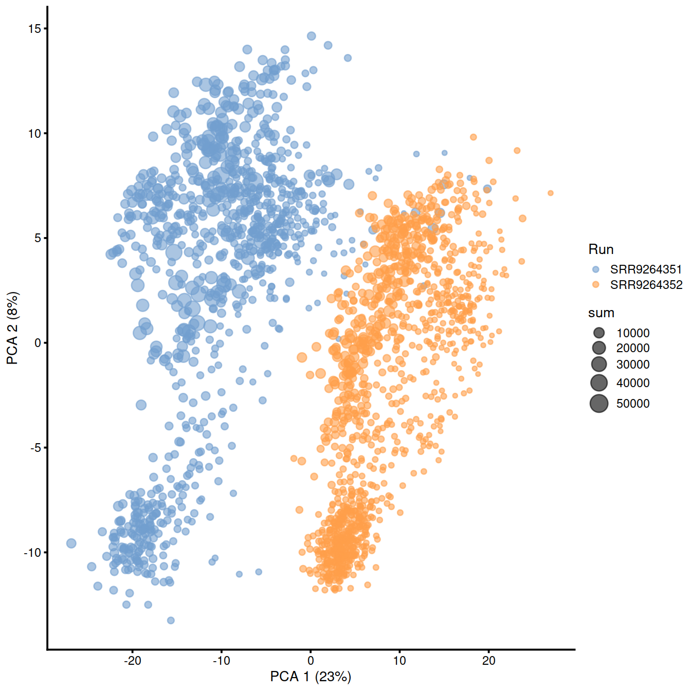


```r
sce.sep <- runTSNE(sce.sep, dimred="PCA")
plotTSNE(sce.sep, colour_by="Run", size_by = "sum")
```

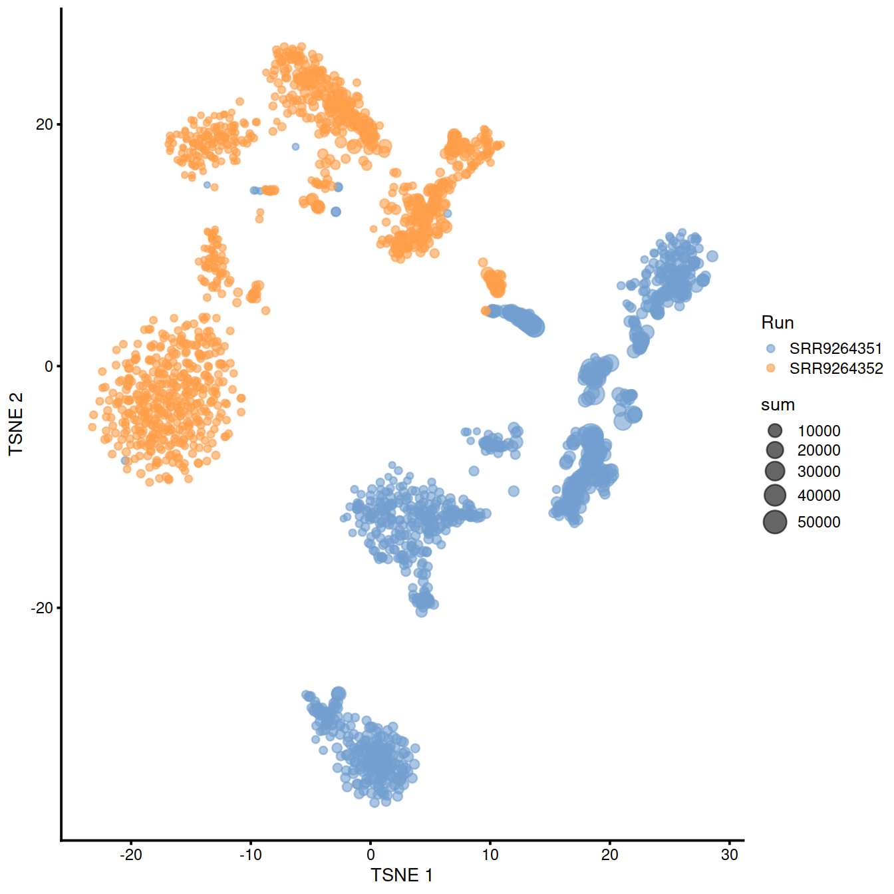


```r
sce.sep <- runUMAP(sce.sep, dimred="PCA")
plotUMAP(sce.sep, colour_by="Run", size_by = "sum")
```


```r
rm(sce.sep)
```

## Normalise batches together


```r
sample3.nz.sce <- SingleCellExperiment(list(counts=counts(sce[, sce$Run %in% c("SRR9264351", "SRR9264352")])),
                                       colData=colData(sce[, sce$Run %in% c("SRR9264351", "SRR9264352")]))

sample3.clusters <- quickCluster(sample3.nz.sce, method="igraph")
sample3.nz.sce <- computeSumFactors(sample3.nz.sce, min.mean=0.1, cluster=sample3.clusters)
sample3.nz.sce <- logNormCounts(sample3.nz.sce)

pool.exprs <- exprs(sample3.nz.sce)
colnames(pool.exprs) <- gsub(colData(sample3.nz.sce)$Barcode, pattern="-", replacement=".")

rm(sample3.clusters, sce)
```

Find the 2000 genes with the highest variance:


```r
gene.variances <- apply(pool.exprs, 1, var)
names(gene.variances) <- rownames(pool.exprs)
highly.variable.genes <- names(gene.variances[order(gene.variances, decreasing=TRUE)])[1:2000]
rm(gene.variances)
```

Perform PCA:


```r
# we need to use a fast approximate algorithm for PCA on large data sets
# this algorithm has a stochastic component, so we need to fix the seed number to get the same result each time
set.seed(42)
combined.hvg.pca <- irlba::prcomp_irlba(t(pool.exprs[highly.variable.genes, ]), n=5) # we only need a few components
combined.hvg.pcs <- as.data.frame(combined.hvg.pca$x) # extract the principal components
combined.hvg.pcs$Cell <- colnames(pool.exprs) # set the sample column as the cell IDs

# combine the PCs with the sample information into a single data frame for plotting
samples.info <- data.frame("Cell"=colnames(pool.exprs),
                           "Run"=colData(sample3.nz.sce)$Run)

# merge the two data frames together
combined.pca.merge <- merge(combined.hvg.pcs, samples.info, by='Cell')

rm(all.samp.exprs, combined.hvg.pca, combined.hvg.pcs, samples.info)
```


Plot PC1-PC2 plane, with cells colored by 'Run' (and sized according to library size):


```r
sample3.nz.sce <- runPCA(sample3.nz.sce)
plotPCA(sample3.nz.sce, colour_by="Run", size_by = "sum")
```

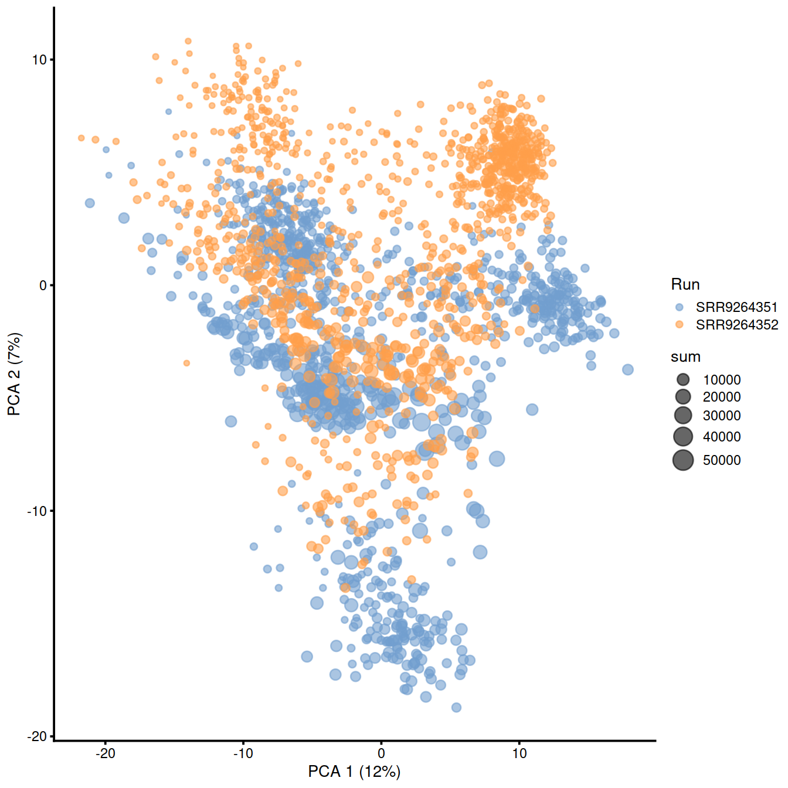


```r
sample3.nz.sce <- runTSNE(sample3.nz.sce, dimred="PCA")
plotTSNE(sample3.nz.sce, colour_by="Run", size_by = "sum")
```

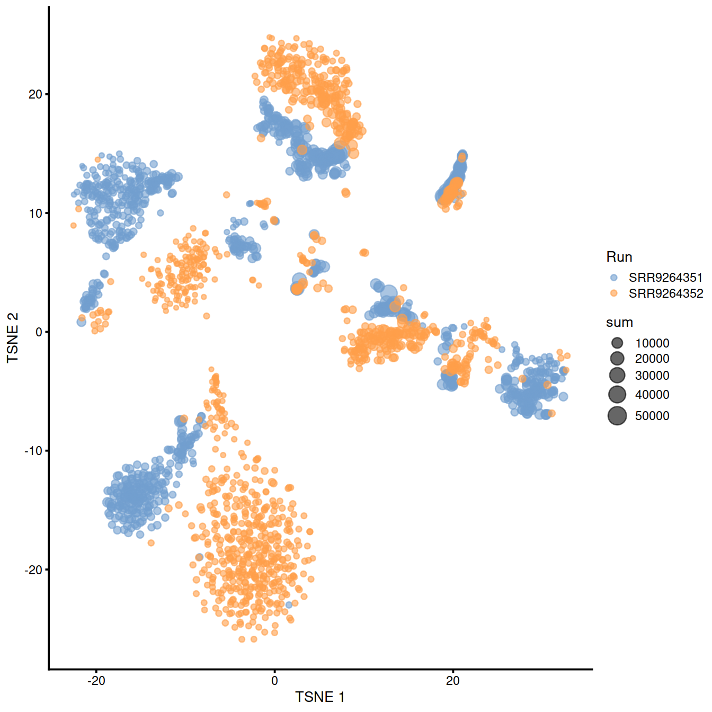


```r
sample3.nz.sce <- runUMAP(sample3.nz.sce, dimred="PCA")
plotUMAP(sample3.nz.sce, colour_by="Run", size_by = "sum")
```


## Batch correction


```r
sample3.nz.sce$Run <- factor(sample3.nz.sce$Run)
sample3.nz.sce$batch <- sample3.nz.sce$Run
sce <- sample3.nz.sce
```

###  Gaussian (normal) linear models

<!-- 7.6.2.1 Gaussian (normal) linear models -->

Limma


```r
suppressMessages(require(limma))
lm_design_batch <- model.matrix(~0 + batch, data = colData(sce))
fit_lm_batch <- lmFit(logcounts(sce), lm_design_batch)
resids_lm_batch <- residuals(fit_lm_batch, logcounts(sce))
assay(sce, "lm_batch") <- resids_lm_batch

reducedDim(sce, "PCA_lm_batch") <- reducedDim(
  runPCA(sce, exprs_values = "lm_batch"), "PCA")

plotReducedDim(sce, dimred = "PCA_lm_batch",
        colour_by = "batch", 
        size_by = "sum",
        shape_by = "Sample.Name"
        ) +
  ggtitle("LM - regress out batch")
```


```r
#scePreSct <- sce # not used TODO delete
```

## SCTransform

### Batch only

First make a copy of the SCE object (we will need one later).


```r
# have log lib size
sce$log10sum <- log10(sce$sum)
# keep copy of SCE to draw from after SCTransform,
# which discard some genes TODO check-again/mention slow 'return all' option
sceOrig <- sce
```


```r
counts <- counts(sce)
class(counts)
```

```
## [1] "dgCMatrix"
## attr(,"package")
## [1] "Matrix"
```

```r
# inspect data
gene_attr <- data.frame(mean = rowMeans(counts),
                        detection_rate = rowMeans(counts > 0),
                        var = apply(counts, 1, var))
gene_attr$log_mean <- log10(gene_attr$mean)
gene_attr$log_var <- log10(gene_attr$var)
rownames(gene_attr) <- rownames(counts)
cell_attr <- data.frame(n_umi = colSums(counts),
                        n_gene = colSums(counts > 0))
rownames(cell_attr) <- colnames(counts)

# plot
ggplot(gene_attr, aes(log_mean, log_var)) +
  geom_point(alpha = 0.3, shape = 16) +
  geom_density_2d(size = 0.3) +
  geom_abline(intercept = 0, slope = 1, color = "red")
```


Mean-variance relationship


```r
# Mean-variance relationship
# add the expected detection rate under Poisson model
x = seq(from = -3, to = 2, length.out = 1000)
poisson_model <- data.frame(log_mean = x, detection_rate = 1 - dpois(0, lambda = 10^x))
ggplot(gene_attr, aes(log_mean, detection_rate)) + geom_point(alpha = 0.3, shape = 16) + 
    geom_line(data = poisson_model, color = "red") + theme_gray(base_size = 8)
```

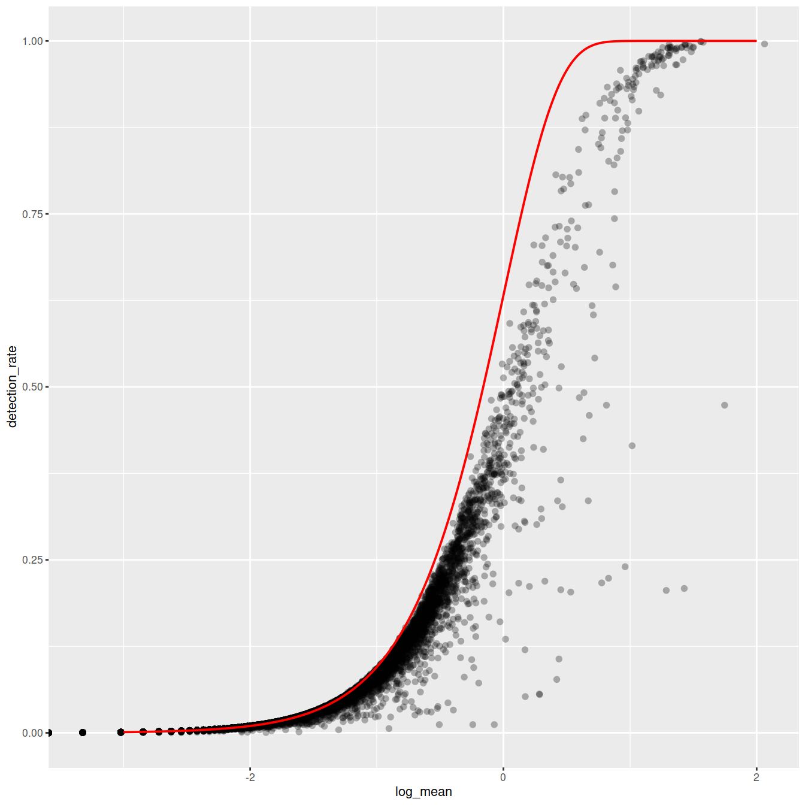

```r
rm(gene_attr)
```

Mean-detection-rate relationship 


```r
# Mean-detection-rate relationship 
ggplot(cell_attr, aes(n_umi, n_gene)) +
  geom_point(alpha = 0.3, shape = 16) +
  geom_density_2d(size = 0.3)
```

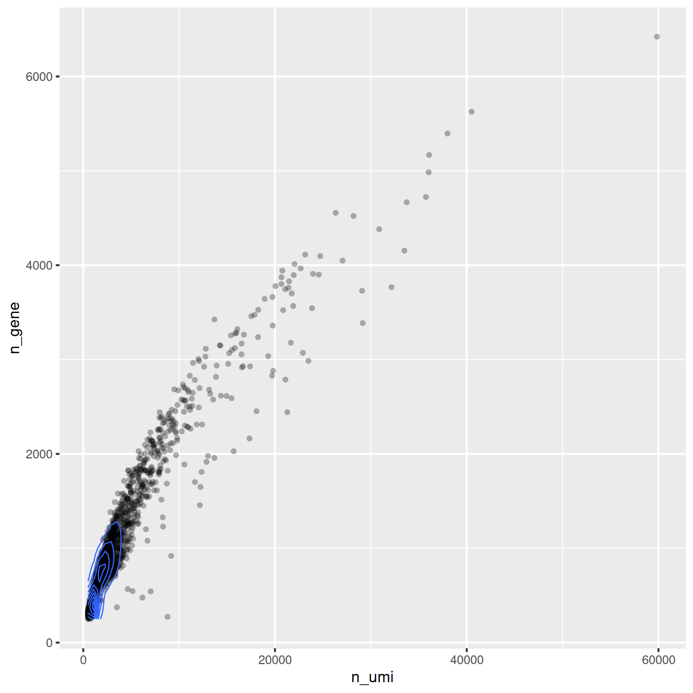

```r
rm(cell_attr)
```


```r
counts <- counts(sce)
colnames(counts) <- colData(sce)$Barcode

cellAttr <- as.data.frame(colData(sce))[,c("log10sum", "batch")]
rownames(cellAttr) <- colData(sce)$Barcode

#https://github.com/satijalab/seurat/issues/3925
# remotes::install_github("ChristophH/sctransform@develop")

### Genes expressed in at least 5 cells will be kept
sctnorm_data <- sctransform::vst(umi = counts,
                                 min_cells = 5,
                                 #min_cells = 10,
                                 #method = "nb_fast",
                                 #n_genes = 3000,
                                 #bw_adjust = 2, # 3
                                 cell_attr = cellAttr,
                                 latent_var = c("batch"),
                                 #latent_var = c("log10sum", "batch"),
                                 return_gene_attr = TRUE,
                                 return_cell_attr = TRUE,
                                 verbosity = 0)
```

Check model used:


```r
# model:
print(sctnorm_data$model_str)
```

```
## [1] "y ~ batch"
```

Check new values (here 3 rows and 3 columns only):


```r
sctnorm_data$y[1:3,1:3]
```

```
##                 AAACCTGCACTTCGAA-9 AAACCTGCAGACGCAA-9 AAACCTGTCATCACCC-9
## ENSG00000237491         -0.1805847         -0.1805847         -0.1805847
## ENSG00000225880         -0.1052960         -0.1052960         -0.1052960
## ENSG00000230368         -0.1977572         -0.1977572         -0.1977572
```

Check object:


```r
sce
```

```
## class: SingleCellExperiment 
## dim: 16629 2099 
## metadata(0):
## assays(3): counts logcounts lm_batch
## rownames(16629): ENSG00000237491 ENSG00000225880 ... ENSG00000275063
##   ENSG00000271254
## rowData names(0):
## colnames: NULL
## colData names(18): Barcode Run ... batch log10sum
## reducedDimNames(4): PCA TSNE UMAP PCA_lm_batch
## altExpNames(0):
```

Some genes were not included in the transformation and excluded from the output, so we will remove them from the SCE object too.


```r
# exclude genes that were not used in the transformation: 
tmpInd <- which(rownames(sce) %in% rownames(sctnorm_data$y))
cols.meta <- colData(sceOrig)
rows.meta <- rowData(sceOrig)

new.counts <- counts(sceOrig)[tmpInd, ]
sce <- SingleCellExperiment(list(counts=new.counts))

# reset the column data on the new object
colData(sce) <- cols.meta
rowData(sce) <- rows.meta[tmpInd, ]
```

We now copy the transformation output to the SCE object:


```r
vstMat <- as(sctnorm_data$y[rownames(sce),], "dgCMatrix")
all(colnames(vstMat) == sce$Barcode)
```

```
## [1] TRUE
```

```r
dim(vstMat)
```

```
## [1] 13784  2099
```

```r
colnames(vstMat) <- NULL
assay(sce, "sctrans_norm_batchOnly") <- vstMat # as(vst_out$y[rownames(sce),], "dgCMatrix")
```

Also copy 'logcounts':


```r
assayX <- "logcounts"
tmpAssay <- assay(sceOrig, assayX)
assay(sce, assayX) <- tmpAssay[tmpInd, ]
```

Diagnostic plots are shown below:


```r
sctransform::plot_model_pars(sctnorm_data)
```

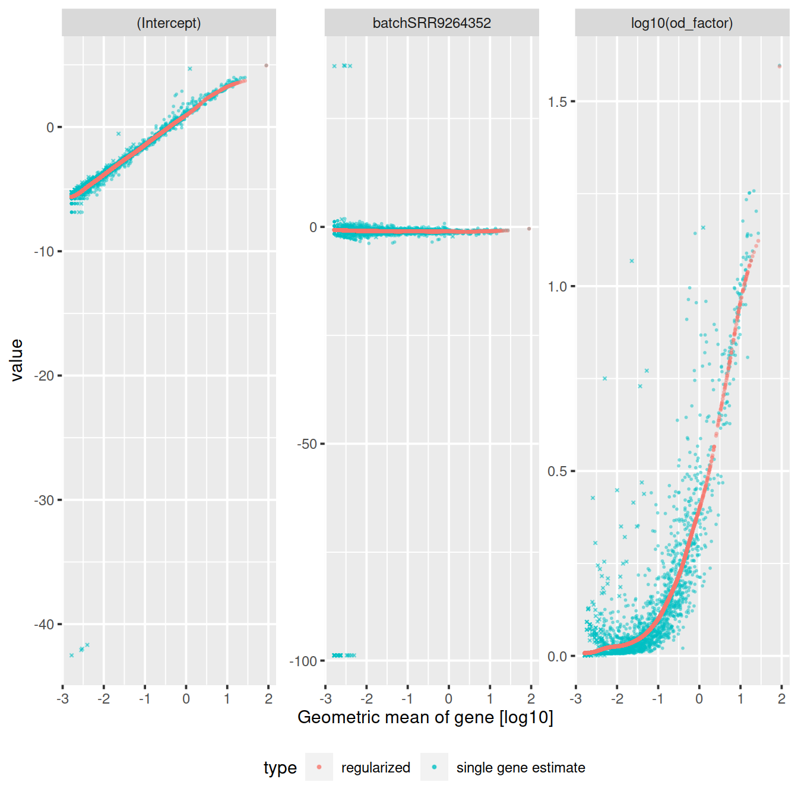

The reduced dimension plots below show improved mixing of cells from the two sets:


```r
reducedDim(sce, "PCA_sctrans_norm_batchOnly") <- reducedDim(
  runPCA(sce, exprs_values = "sctrans_norm_batchOnly"), "PCA"
)
plotReducedDim(
  sce,
  dimred = "PCA_sctrans_norm_batchOnly",
  colour_by = "batch",
  size_by = "sum",
  shape_by = "Sample.Name"
) + ggtitle("PCA plot: sctransform normalization - batch only") 
```


```r
sce <- runTSNE(sce, dimred="PCA_sctrans_norm_batchOnly", name="TSNE_sctrans_norm_batchOnly")
plotReducedDim(
  sce,
  dimred = "TSNE_sctrans_norm_batchOnly",
  colour_by = "batch",
  size_by = "sum",
  shape_by = "Sample.Name"
) + ggtitle("TSNE plot: sctransform normalization - batch only") 
```

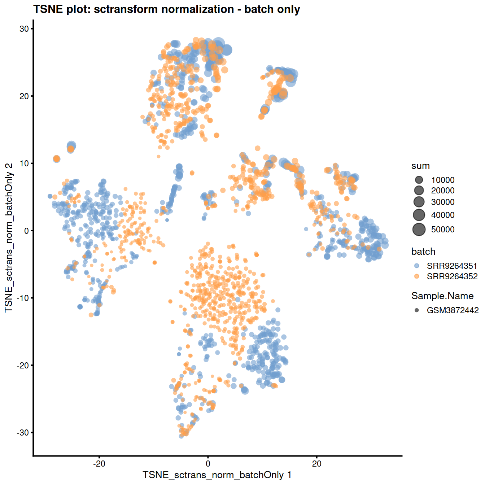


```r
sce <- runUMAP(sce, dimred="PCA_sctrans_norm_batchOnly", name="UMAP_sctrans_norm_batchOnly")
plotReducedDim(
  sce,
  dimred = "UMAP_sctrans_norm_batchOnly",
  colour_by = "batch",
  size_by = "sum",
  shape_by = "Sample.Name"
) + ggtitle("UMAP plot: sctransform normalization - batch only") 
```

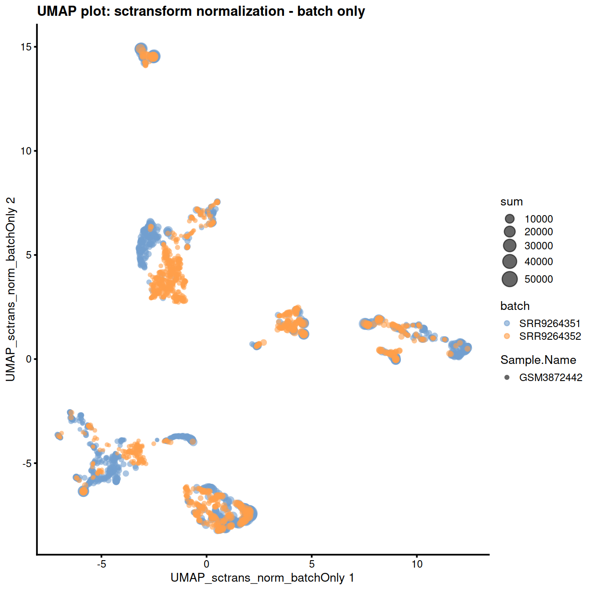

Keep copy of SCE object for later:


```r
sce_batchOnly <- sce
```

## mnnCorrect

<!-- #https://bioconductor.org/packages/release/bioc/vignettes/batchelor/inst/doc/correction.html -->

### Check presence of batch effect

Same as above but with batchelor commands to make the two batches and identify highly variable genes for faster dimensionality reduction.


```r
sce <- sample3.nz.sce
rm(sample3.nz.sce)

library(batchelor)
# Mind assayNames()
sce1 <- sce[, sce$Run == "SRR9264351"]
sce2 <- sce[, sce$Run == "SRR9264352"]
```


```r
library(scran)
dec1 <- modelGeneVar(sce1)
dec2 <- modelGeneVar(sce2)
combined.dec <- combineVar(dec1, dec2)
chosen.hvgs <- combined.dec$bio > 0
summary(chosen.hvgs)
```

```
##    Mode   FALSE    TRUE 
## logical    7655    8974
```

```r
rm(dec1, dec2)
```

As a diagnostic, we check that there actually is a batch effect across these datasets by checking that they cluster separately. Here, we combine the two SingleCellExperiment objects without any correction using the NoCorrectParam() flag, and we informally verify that cells from different batches are separated using a t-SNE plot.

There is a moderate batch effect.


```r
library(scater)
combined <- correctExperiments(A=sce1, B=sce2, PARAM=NoCorrectParam())
combined <- runPCA(combined, subset_row=chosen.hvgs)
combined <- runTSNE(combined, dimred="PCA")
combined <- runUMAP(combined, dimred="PCA")
plotPCA(combined, colour_by="batch")
```

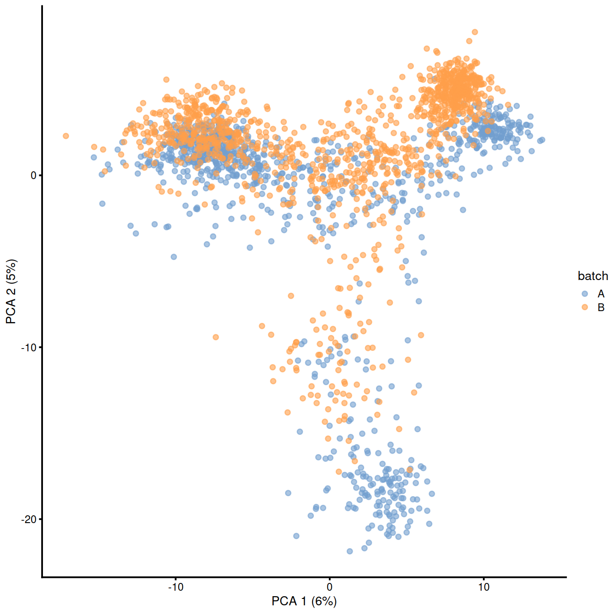

```r
plotTSNE(combined, colour_by="batch")
```

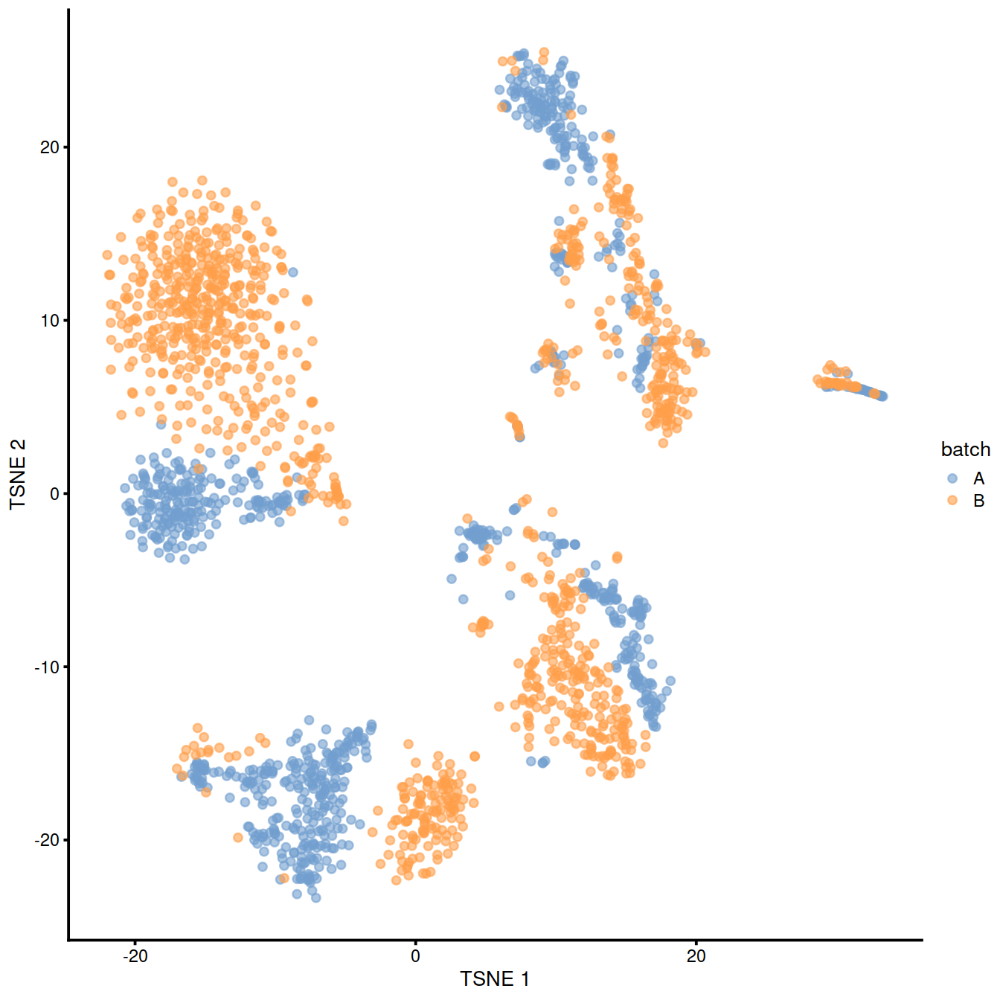

```r
plotUMAP(combined, colour_by="batch")
```

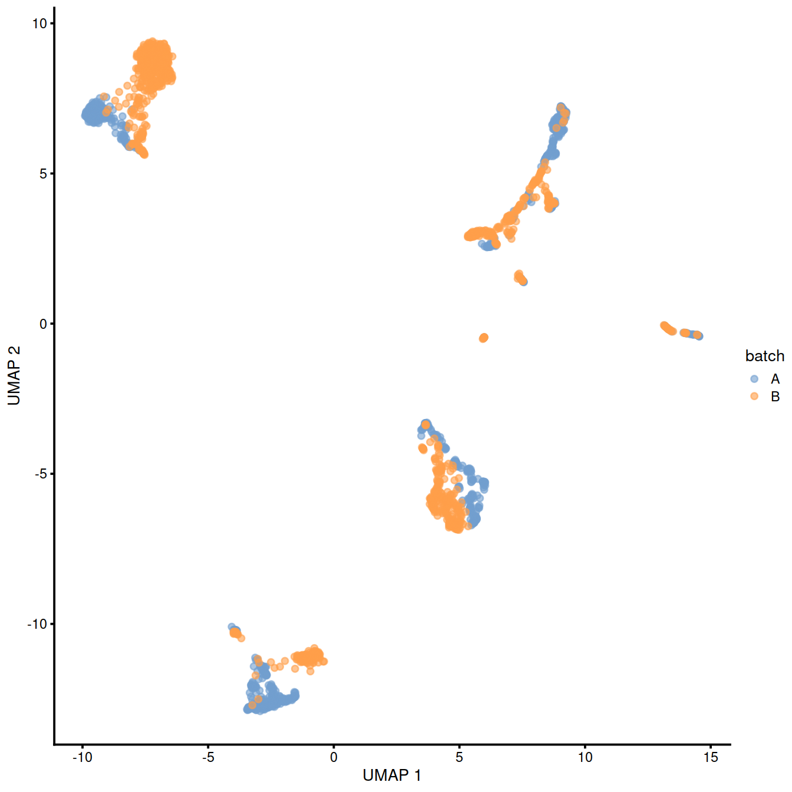


```r
reducedDim(sce, "PCA_noCor") <- reducedDim(combined, "PCA")
reducedDim(sce, "TSNE_noCor") <- reducedDim(combined, "TSNE")
reducedDim(sce, "UMAP_noCor") <- reducedDim(combined, "UMAP")
rm(combined)
```

### Correct batch effect with mnnCorrect

This is the initial method. It uses gene expression values to identify cells with similar expression patterns in both batches.

Let us get the normalised counts:


```r
batch1 <- logcounts(sce1)
batch2 <- logcounts(sce2)
rm(sce1, sce2)
```


```r
y <- batchelor::mnnCorrect(
          batch1, batch2,  
	  #subset.row = fewer.hvgs,
	  correct.all = TRUE,
          k = 20,
          sigma = 0.1,
          cos.norm.in = TRUE,
          svd.dim = 2
        )
```

Copy the corrected values to the SCE object:


```r
assay(sce, "mnn") <- assay(y, "corrected")
```

Show reduced dimension plots and check for improved mixing of cells from the two sets:


```r
sce <- runPCA(sce, exprs_values = "mnn")
plotPCA(sce, colour_by="batch")
```

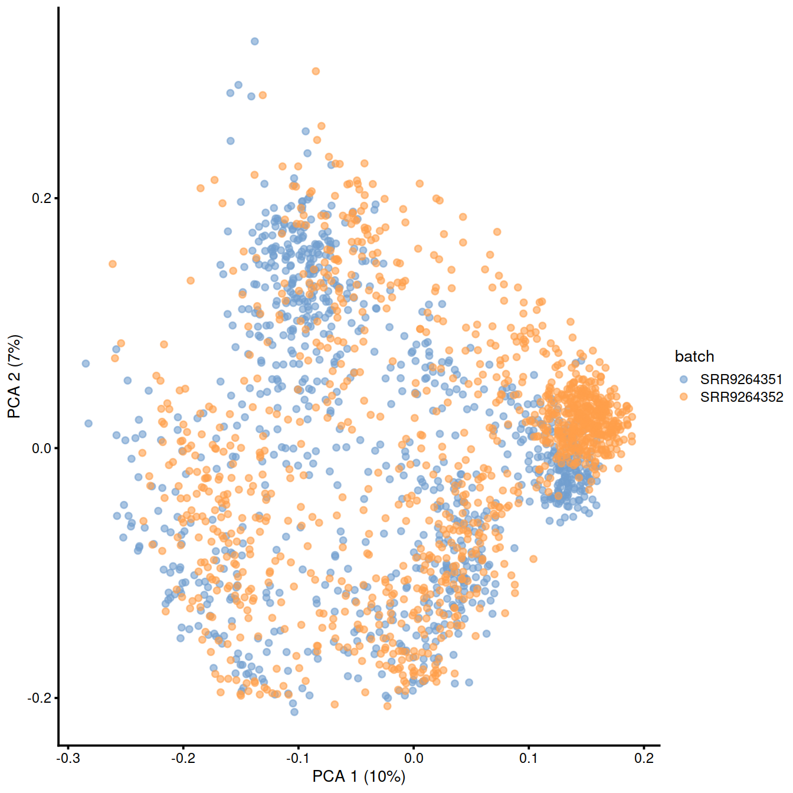

```r
reducedDim(sce, "PCA_mnn") <- reducedDim(sce, "PCA")
```


```r
sce <- runTSNE(sce, dimred="PCA_mnn")
plotTSNE(sce, colour_by="batch")
```

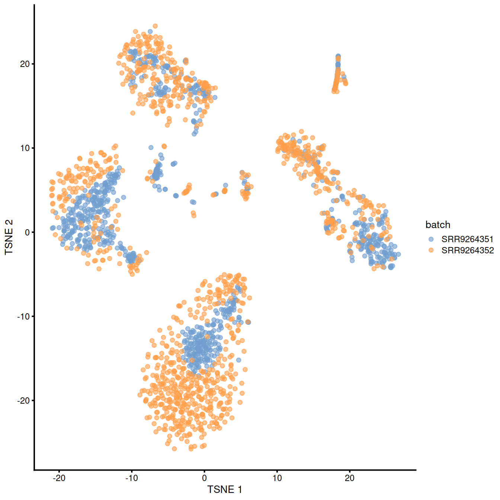

```r
reducedDim(sce, "TSNE_mnn") <- reducedDim(sce, "TSNE")
```


```r
sce <- runUMAP(sce, dimred="PCA_mnn")
plotUMAP(sce, colour_by="batch")
```

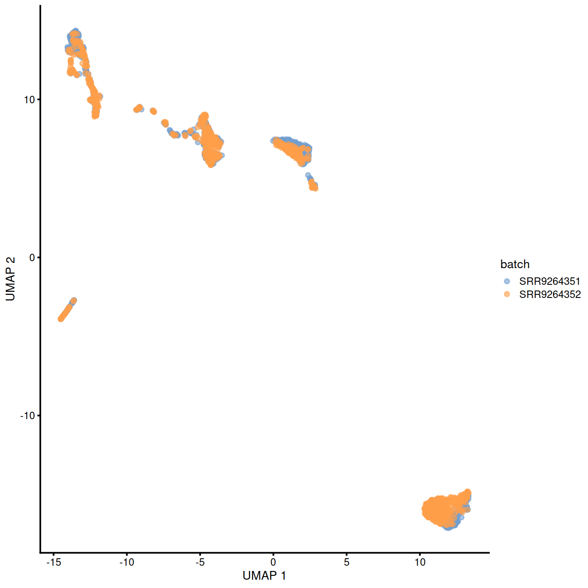

```r
reducedDim(sce, "UMAP_mnn") <- reducedDim(sce, "UMAP")
```


```r
rm(combined.dec, chosen.hvgs)
```

## fastMNN

This method is faster than mnnCorrect as it identifies nearest neighbours after dimensionality reduction. 


```r
fx <- batchelor::fastMNN(
                      sce,
		      #correct.all = TRUE,
                      batch = sce$Run
			)
class(fx)
```

```
## [1] "SingleCellExperiment"
## attr(,"package")
## [1] "SingleCellExperiment"
```

Copy the corrected values to the SCE object:


```r
# fastMNN may drop some genes
# so we may not be able to keep the outcome in 'assay'
assay(sce, "fastmnn") <- assay(fx, "reconstructed")
```

Show reduced dimension plots and check for improved mixing of cells from the two sets:


```r
fastmnn_pca <- runPCA(assay(sce, "fastmnn"), rank=2) # slow
reducedDim(sce, "PCA_fastmnn") <- fastmnn_pca$rotation
rm(fastmnn_pca)

plotReducedDim(
  sce,
  dimred = "PCA_fastmnn",
  colour_by = "batch",
  size_by = "sum",
  shape_by = "Sample.Name"
) + ggtitle("PCA plot: fastMNN") 
```

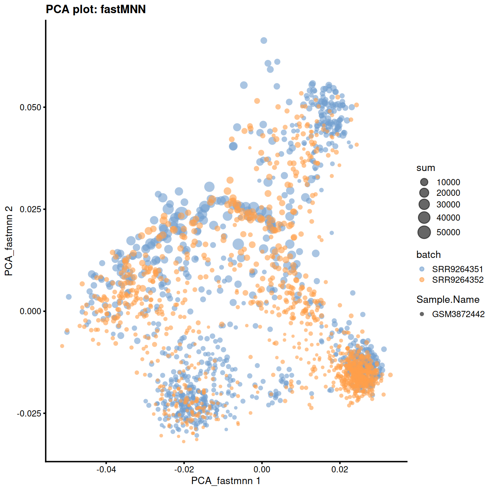


```r
sce <- runTSNE(sce, dimred="PCA_fastmnn")
plotTSNE(sce, colour_by="batch")
```

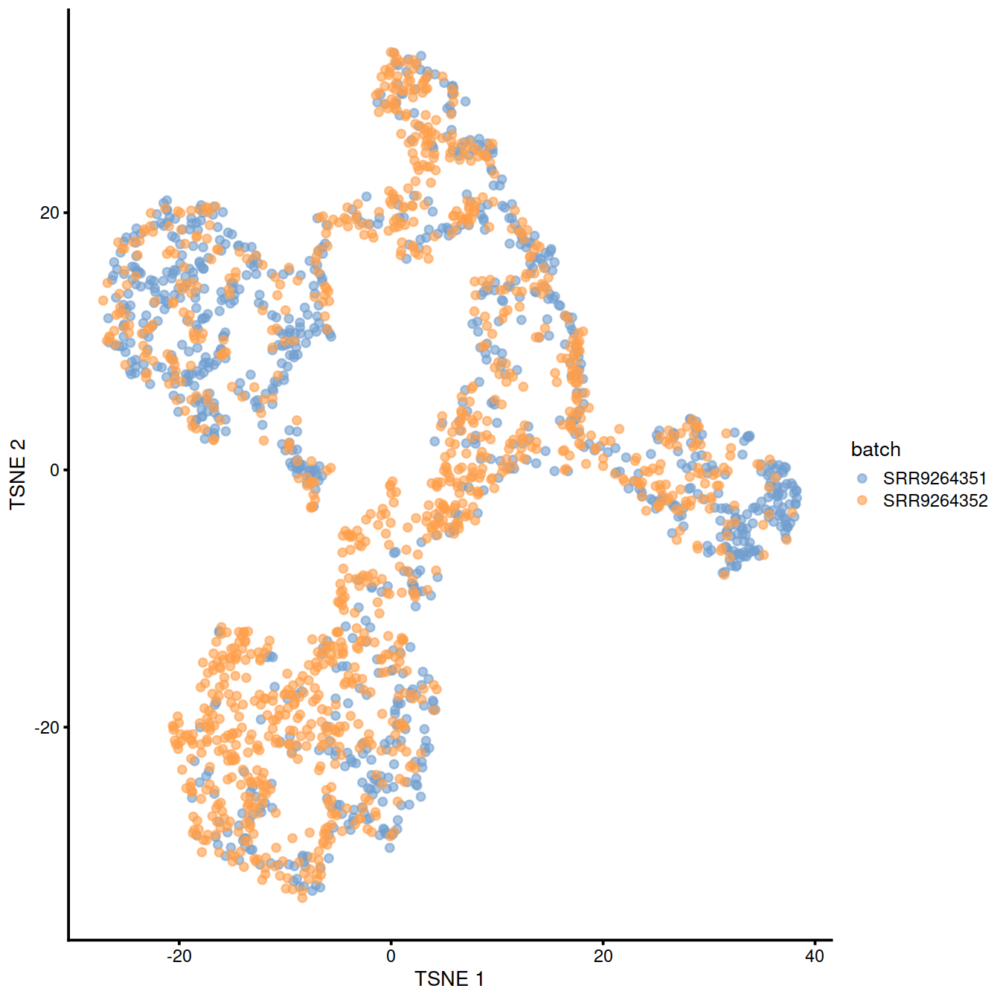

```r
reducedDim(sce, "TSNE_fastmnn") <- reducedDim(sce, "TSNE")
```


```r
sce <- runUMAP(sce, dimred="PCA_fastmnn")
plotUMAP(sce, colour_by="batch")
```

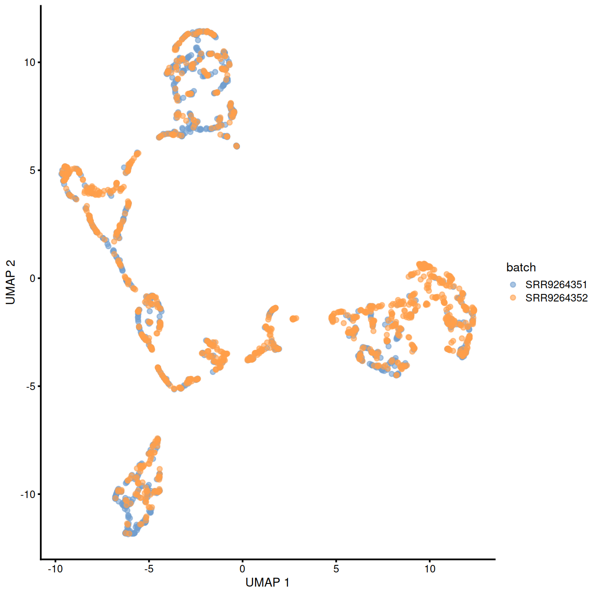

```r
reducedDim(sce, "UMAP_fastmnn") <- reducedDim(sce, "UMAP")
```

## Harmony

Harmony [Korsunsky2018fast] is a newer batch correction method, which is designed to operate on PC space. The algorithm proceeds to iteratively cluster the cells, with the objective function formulated to promote cells from multiple datasets within each cluster. Once a clustering is obtained, the positions of the centroids of each dataset are obtained on a per-cluster basis and the coordinates are corrected. This procedure is iterated until convergence. Harmony comes with a theta parameter that controls the degree of batch correction (higher values lead to more dataset integration), and can account for multiple experimental and biological factors on input (see [variant of the 'Hemberg course'](https://biocellgen-public.svi.edu.au/mig_2019_scrnaseq-workshop/public/normalization-confounders-and-batch-correction.html#harmony)).


```r
library(harmony)

reducedDim(sce, "PCA_logcounts") <- reducedDim(
  runPCA(sce, exprs_values = "logcounts")
)

#Seeing how the end result of Harmony is an altered dimensional reduction space created on the basis of PCA, we plot the obtained manifold here and exclude it from the rest of the follow-ups in the section.

pca <- as.matrix(reducedDim(sce, "PCA_logcounts"))
harmony_emb <- HarmonyMatrix(pca,
			     sce$batch,
			     theta=2,
			     do_pca=FALSE)
reducedDim(sce, "harmony") <- harmony_emb

plotReducedDim(
    sce,
    dimred = 'harmony',
    colour_by = "batch",
    size_by = "sum",
    shape_by = "Sample.Name"
)
```

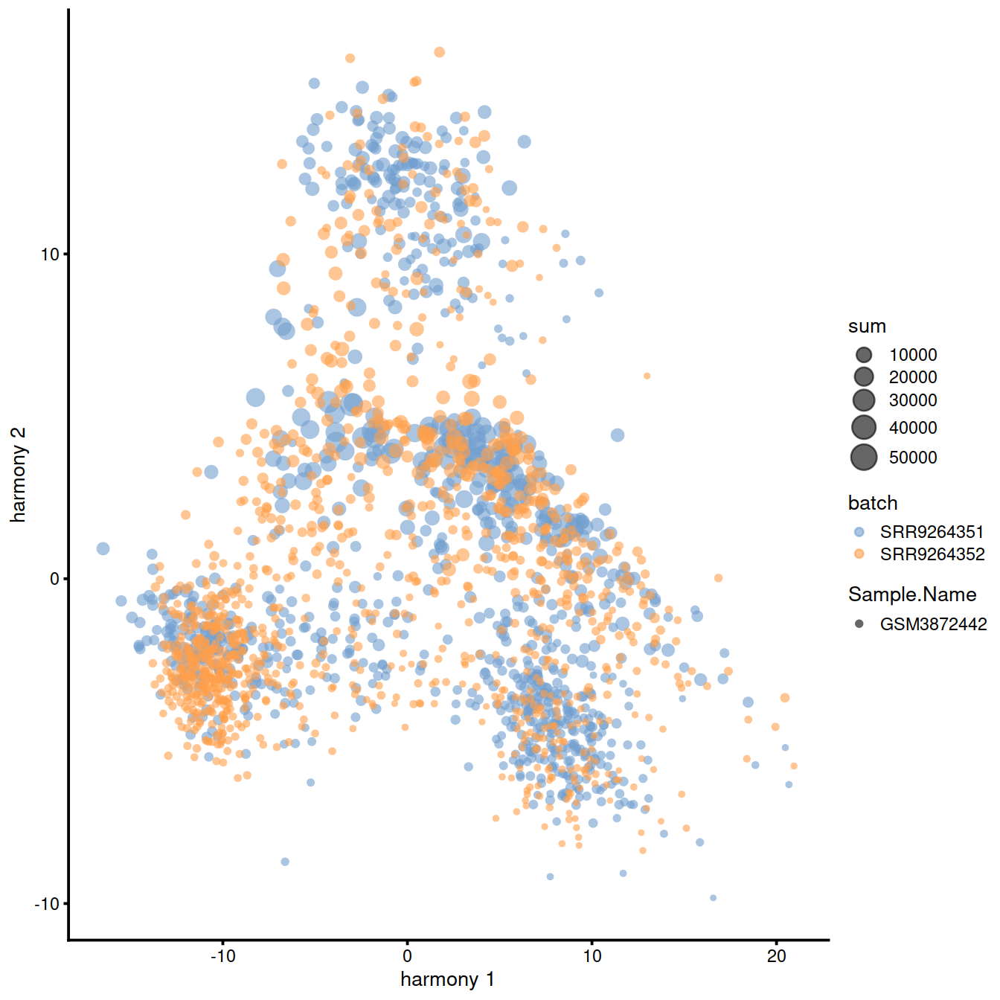

## Session information

<details>

```r
sessionInfo()
```

```
## R version 4.0.3 (2020-10-10)
## Platform: x86_64-pc-linux-gnu (64-bit)
## Running under: CentOS Linux 8
## 
## Matrix products: default
## BLAS:   /opt/R/R-4.0.3/lib64/R/lib/libRblas.so
## LAPACK: /opt/R/R-4.0.3/lib64/R/lib/libRlapack.so
## 
## locale:
##  [1] LC_CTYPE=en_GB.UTF-8       LC_NUMERIC=C              
##  [3] LC_TIME=en_GB.UTF-8        LC_COLLATE=en_GB.UTF-8    
##  [5] LC_MONETARY=en_GB.UTF-8    LC_MESSAGES=en_GB.UTF-8   
##  [7] LC_PAPER=en_GB.UTF-8       LC_NAME=C                 
##  [9] LC_ADDRESS=C               LC_TELEPHONE=C            
## [11] LC_MEASUREMENT=en_GB.UTF-8 LC_IDENTIFICATION=C       
## 
## attached base packages:
## [1] stats4    parallel  stats     graphics  grDevices utils     datasets 
## [8] methods   base     
## 
## other attached packages:
##  [1] harmony_1.0                 Rcpp_1.0.6                 
##  [3] batchelor_1.6.3             SeuratObject_4.0.1         
##  [5] Seurat_4.0.1                limma_3.46.0               
##  [7] Cairo_1.5-12.2              BiocSingular_1.6.0         
##  [9] dplyr_1.0.6                 scran_1.18.7               
## [11] scater_1.18.6               ggplot2_3.3.3              
## [13] SingleCellExperiment_1.12.0 SummarizedExperiment_1.20.0
## [15] Biobase_2.50.0              GenomicRanges_1.42.0       
## [17] GenomeInfoDb_1.26.7         IRanges_2.24.1             
## [19] S4Vectors_0.28.1            BiocGenerics_0.36.1        
## [21] MatrixGenerics_1.2.1        matrixStats_0.58.0         
## [23] knitr_1.33                 
## 
## loaded via a namespace (and not attached):
##   [1] plyr_1.8.6                igraph_1.2.6             
##   [3] lazyeval_0.2.2            splines_4.0.3            
##   [5] BiocParallel_1.24.1       listenv_0.8.0            
##   [7] scattermore_0.7           digest_0.6.27            
##   [9] htmltools_0.5.1.1         viridis_0.6.1            
##  [11] fansi_0.4.2               magrittr_2.0.1           
##  [13] tensor_1.5                cluster_2.1.2            
##  [15] ROCR_1.0-11               globals_0.14.0           
##  [17] spatstat.sparse_2.0-0     colorspace_2.0-1         
##  [19] ggrepel_0.9.1             xfun_0.23                
##  [21] crayon_1.4.1              RCurl_1.98-1.3           
##  [23] jsonlite_1.7.2            spatstat.data_2.1-0      
##  [25] survival_3.2-11           zoo_1.8-9                
##  [27] glue_1.4.2                polyclip_1.10-0          
##  [29] gtable_0.3.0              zlibbioc_1.36.0          
##  [31] XVector_0.30.0            leiden_0.3.7             
##  [33] DelayedArray_0.16.3       future.apply_1.7.0       
##  [35] abind_1.4-5               scales_1.1.1             
##  [37] DBI_1.1.1                 edgeR_3.32.1             
##  [39] miniUI_0.1.1.1            isoband_0.2.4            
##  [41] viridisLite_0.4.0         xtable_1.8-4             
##  [43] reticulate_1.20           spatstat.core_2.1-2      
##  [45] dqrng_0.3.0               rsvd_1.0.5               
##  [47] ResidualMatrix_1.0.0      htmlwidgets_1.5.3        
##  [49] httr_1.4.2                RColorBrewer_1.1-2       
##  [51] ellipsis_0.3.2            ica_1.0-2                
##  [53] farver_2.1.0              pkgconfig_2.0.3          
##  [55] scuttle_1.0.4             uwot_0.1.10              
##  [57] deldir_0.2-10             sass_0.4.0               
##  [59] locfit_1.5-9.4            utf8_1.2.1               
##  [61] labeling_0.4.2            tidyselect_1.1.1         
##  [63] rlang_0.4.11              reshape2_1.4.4           
##  [65] later_1.2.0               munsell_0.5.0            
##  [67] tools_4.0.3               generics_0.1.0           
##  [69] ggridges_0.5.3            evaluate_0.14            
##  [71] stringr_1.4.0             fastmap_1.1.0            
##  [73] goftest_1.2-2             yaml_2.2.1               
##  [75] fitdistrplus_1.1-3        purrr_0.3.4              
##  [77] RANN_2.6.1                nlme_3.1-152             
##  [79] pbapply_1.4-3             future_1.21.0            
##  [81] sparseMatrixStats_1.2.1   mime_0.10                
##  [83] compiler_4.0.3            beeswarm_0.3.1           
##  [85] plotly_4.9.3              png_0.1-7                
##  [87] spatstat.utils_2.1-0      tibble_3.1.2             
##  [89] statmod_1.4.36            bslib_0.2.5              
##  [91] stringi_1.6.1             highr_0.9                
##  [93] lattice_0.20-44           bluster_1.0.0            
##  [95] Matrix_1.3-3              vctrs_0.3.8              
##  [97] pillar_1.6.1              lifecycle_1.0.0          
##  [99] spatstat.geom_2.1-0       lmtest_0.9-38            
## [101] jquerylib_0.1.4           RcppAnnoy_0.0.18         
## [103] BiocNeighbors_1.8.2       data.table_1.14.0        
## [105] cowplot_1.1.1             bitops_1.0-7             
## [107] irlba_2.3.3               httpuv_1.6.1             
## [109] patchwork_1.1.1           R6_2.5.0                 
## [111] bookdown_0.22             promises_1.2.0.1         
## [113] KernSmooth_2.23-20        gridExtra_2.3            
## [115] vipor_0.4.5               parallelly_1.25.0        
## [117] codetools_0.2-18          MASS_7.3-54              
## [119] assertthat_0.2.1          withr_2.4.2              
## [121] sctransform_0.3.2.9005    GenomeInfoDbData_1.2.4   
## [123] mgcv_1.8-35               rpart_4.1-15             
## [125] grid_4.0.3                beachmat_2.6.4           
## [127] tidyr_1.1.3               rmarkdown_2.8            
## [129] DelayedMatrixStats_1.12.3 Rtsne_0.15               
## [131] shiny_1.6.0               ggbeeswarm_0.6.0
```
</details>
