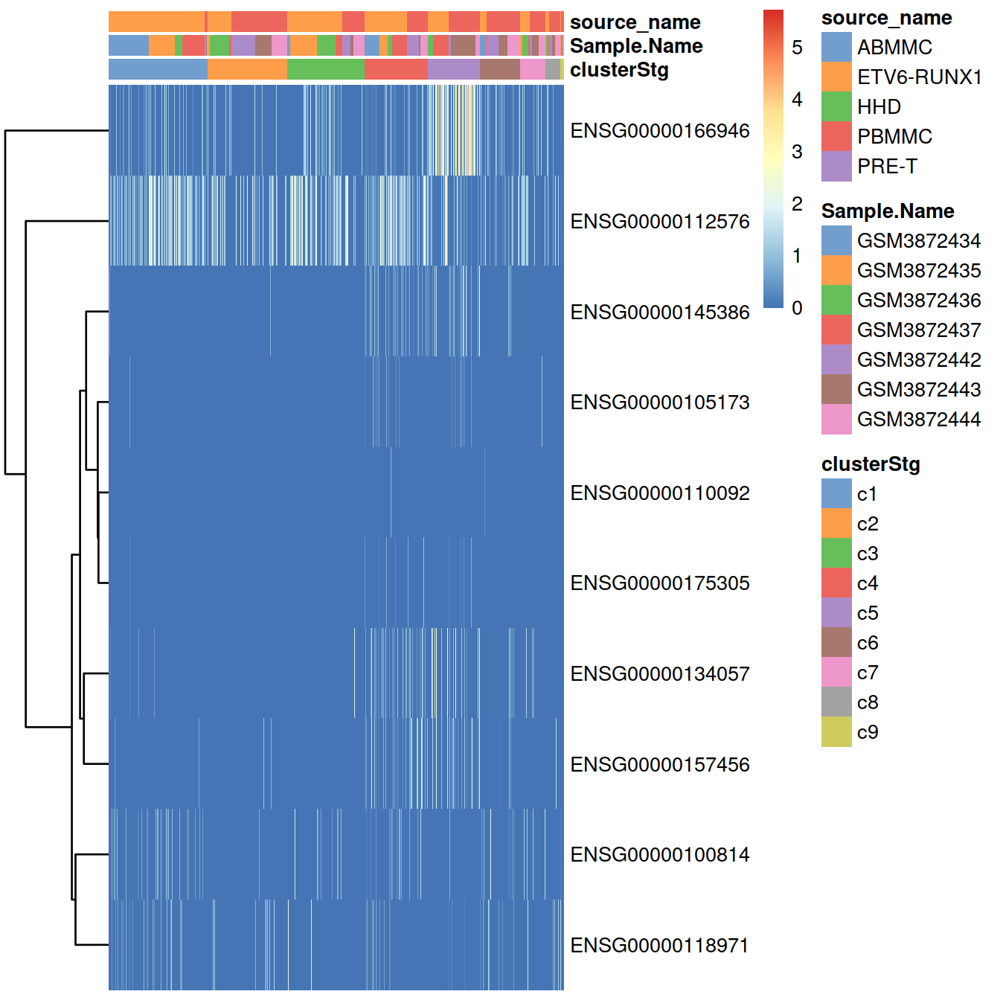
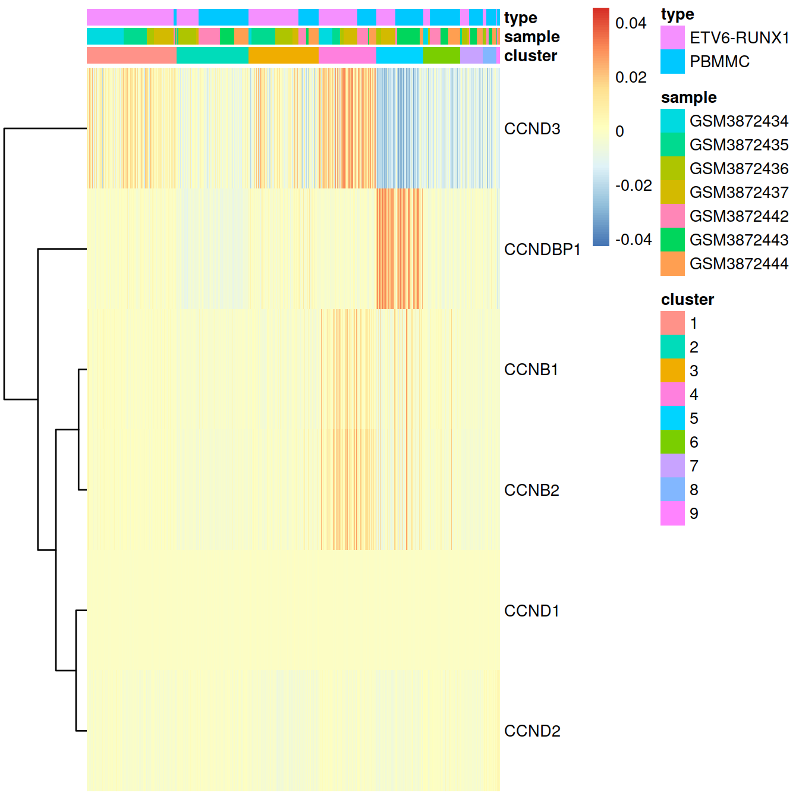
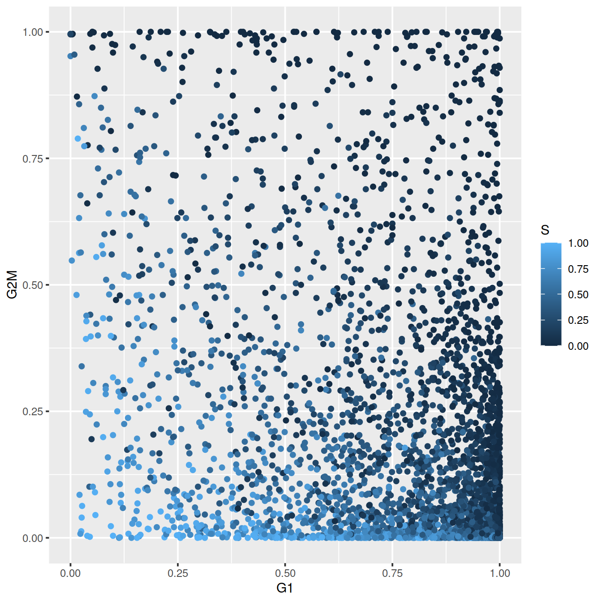
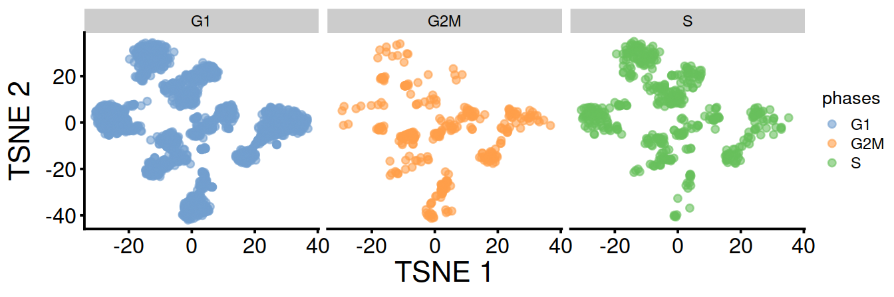
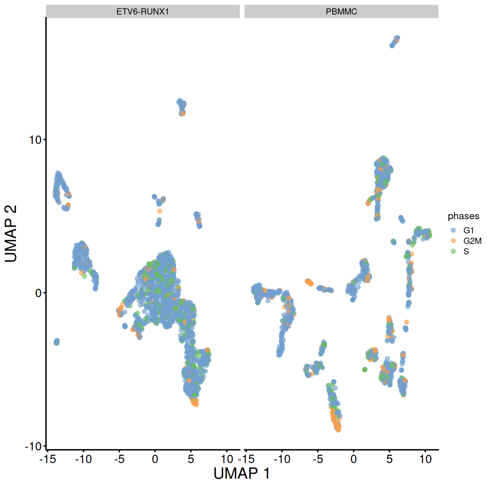
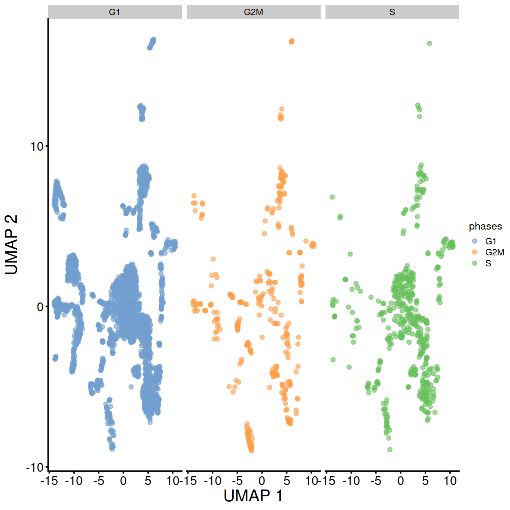
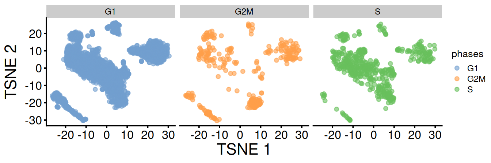
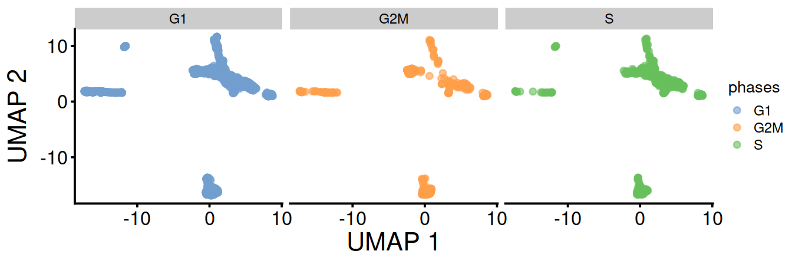
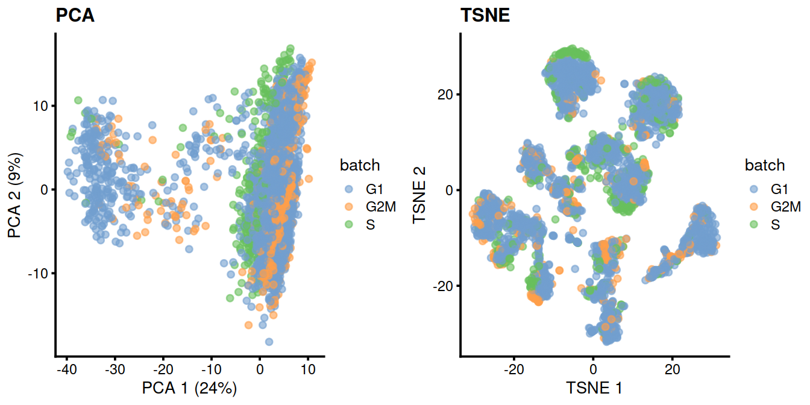

```r
projDir <- params$projDir
dirRel <- params$dirRel
outDirBit <- params$outDirBit
cacheBool <- params$cacheBool
splSetToGet <- params$splSetToGet
setName <- params$setName
setSuf <- params$setSuf
dsiSuf <- params$dsiSuf # 'dsi' for data set integration
if(params$bookType == "mk"){
	setName <- "caron"
 	splSetToGet <- "PBMMC,ETV6-RUNX1"
 	setSuf <- "_5hCellPerSpl"
 	dsiSuf <- '_dsi'
}

splSetVec <- unlist(strsplit(splSetToGet, ",")) # params may not be read in if knitting book.
splSetToGet2 <- gsub(",", "_", splSetToGet)
nbPcToComp <- 50
figSize <- 7
```


```r
library(ggplot2)
library(scater)
library(scran)
library(dplyr)
library(Cairo)
fontsize <- theme(axis.text=element_text(size=12), axis.title=element_text(size=16))
```

# Cell cycle assignment {#cellCyclePhasesTop}

Source: [Cell cycle assignment](https://osca.bioconductor.org/cell-cycle-assignment.html) of the OSCA book.

## Load data

We will load the R file keeping the SCE object with the normalised counts for 500 cells per sample.


```r
# read uncorrected counts
fn <- sprintf("%s/%s/Robjects/%s_sce_nz_postDeconv%s%s_%s_uncorr.Rds",
              projDir,
              outDirBit,
              setName,
              setSuf,
              dsiSuf, # 'dsi' for data set integration
              splSetToGet2) 
uncorrected <- readRDS(file=fn)

# Read object in:
tmpFn <- sprintf("%s/%s/Robjects/%s_sce_nz_postDeconv%s%s_%s_clust.Rds",
                 projDir, outDirBit, setName, setSuf, dsiSuf, splSetToGet2)

print(tmpFn)
```

```
## [1] "/ssd/personal/baller01/20200511_FernandesM_ME_crukBiSs2020/AnaWiSce/AnaKmWiC/Robjects/caron_sce_nz_postDeconv_5hCellPerSpl_dsi_PBMMC_ETV6-RUNX1_clust.Rds"
```

```r
if(!file.exists(tmpFn))
{
	knitr::knit_exit()
}
mnn.out <- readRDS(tmpFn)
mnn.out <- runUMAP(mnn.out, dimred="corrected")
mnn.out
```

```
## class: SingleCellExperiment 
## dim: 7930 3500 
## metadata(2): merge.info pca.info
## assays(1): reconstructed
## rownames(7930): FGR GCLC ... AC139491.7 AC003043.2
## rowData names(12): rotation ensembl_gene_id ... detected gene_sparsity
## colnames: NULL
## colData names(25): Barcode Run ... cluster.out.10 cluster.out.10.col
## reducedDimNames(3): corrected TSNE UMAP
## altExpNames(0):
```

```r
# copy clustering output to uncorrected SCE
sce <- uncorrected
x <- colData(mnn.out)[,c("Barcode","leiden")] %>% data.frame()
colData(sce) <- colData(uncorrected) %>%
  data.frame() %>%
  dplyr::left_join(x, by="Barcode") %>%
  DataFrame
colData(sce)$cluster <- colData(sce)$leiden
sce$clusterStg <- factor(paste0("c", sce$cluster),
			 levels = paste0("c", levels(sce$cluster)))
rm(uncorrected)
```

## Motivation

On occasion, it can be desirable to determine cell cycle activity from scRNA-seq data. In and of itself, the distribution of cells across phases of the cell cycle is not usually informative, but we can use this to determine if there are differences in proliferation between subpopulations or across treatment conditions. Many of the key events in the cell cycle (e.g., passage through checkpoints) are post-translational and thus not directly visible in transcriptomic data; nonetheless, there are enough changes in expression that can be exploited to determine cell cycle phase.


## Using the cyclins

The cyclins control progression through the cell cycle and have well-characterized patterns of expression across cell cycle phases. Cyclin D is expressed throughout but peaks at G1; cyclin E is expressed highest in the G1/S transition; cyclin A is expressed across S and G2; and cyclin B is expressed highest in late G2 and mitosis. Inspection of the relative expression of cyclins across the population can often be sufficient to determine the relative cell cycle activity in each cluster.

We the table below lists the 10 most variables cyclin genes.


```r
cyclin.genes <- grep("^CCN[ABDE]+", rowData(sce)$Symbol)
cyclin.genes <- rownames(sce)[cyclin.genes]
#rowData(sce)[cyclin.genes,]

# only use the 10 most variable cyclins:
require(DelayedArray)
tmpVar <- DelayedMatrixStats::rowVars( DelayedArray(assay(sce[cyclin.genes,], "logcounts")))
names(tmpVar) <- cyclin.genes
cyclin.genes.sub <- names(tmpVar[order(tmpVar, decreasing=T)])[1:10]
rowData(sce)[cyclin.genes.sub,c("ensembl_gene_id", "Symbol")]
```

```
## DataFrame with 10 rows and 2 columns
##                 ensembl_gene_id      Symbol
##                     <character> <character>
## ENSG00000166946 ENSG00000166946     CCNDBP1
## ENSG00000112576 ENSG00000112576       CCND3
## ENSG00000134057 ENSG00000134057       CCNB1
## ENSG00000157456 ENSG00000157456       CCNB2
## ENSG00000118971 ENSG00000118971       CCND2
## ENSG00000100814 ENSG00000100814    CCNB1IP1
## ENSG00000145386 ENSG00000145386       CCNA2
## ENSG00000105173 ENSG00000105173       CCNE1
## ENSG00000175305 ENSG00000175305       CCNE2
## ENSG00000110092 ENSG00000110092       CCND1
```

Heatmap showing expression levels measured as normalised counts:


```r
plotHeatmap(sce,
            order_columns_by="clusterStg",
	    colour_columns_by=c("clusterStg", "Sample.Name", "source_name"),
            cluster_rows=TRUE,
            features=sort(cyclin.genes.sub))
```



With the gene expression levels reconstructed after batch correction with fastMNN:


```r
top.markers <- rowData(sce) %>%
  data.frame() %>%
  filter(ensembl_gene_id %in% cyclin.genes.sub) %>%
  pull(Symbol)

# have matrix to annotate sample with cluster and sample:
#tmpData <- logcounts(sce)[top.markers,]
tmpData3 <- assay(mnn.out) %>%
  as.matrix() %>%
  data.frame() %>%
  tibble::rownames_to_column("Symbol") %>%
  filter(Symbol %in% top.markers) %>%
  tibble::column_to_rownames("Symbol")
colnames(tmpData3) <- colData(mnn.out)$Barcode
colnames(tmpData3) <- gsub("\\.", "-", colnames(mnn.out))

# concat sample and barcode names to make unique name across the whole data set
tmpCellNames <- paste(colData(mnn.out)$Sample.Name,
                      colData(mnn.out)$Barcode, sep="_")
# use these to name columns of matrix the show as heatmap:
colnames(tmpData3) <- tmpCellNames # colData(sce)$Barcode                    

# columns annotation with cell name:
mat_col <- data.frame(cluster = sce$cluster,
		      sample = sce$Sample.Name,
		      type = sce$source_name
		)
rownames(mat_col) <- colnames(tmpData3)
rownames(mat_col) <- tmpCellNames # colData(sce)$Barcode

# Prepare colours for clusters:
colourCount = length(unique(sce$cluster))
getPalette = colorRampPalette(RColorBrewer::brewer.pal(9, "Set1"))

mat_colors <- list(group = getPalette(colourCount))
names(mat_colors$group) <- unique(sce$cluster)

# plot heatmap:
#pheatmap(tmpData3,
pheatmap::pheatmap(tmpData3[,order(colData(sce)$clusterStg)],
           border_color      = NA,
           show_colnames     = FALSE,
           #show_rownames     = FALSE,
           show_rownames     = TRUE,
           drop_levels       = TRUE,
           annotation_col    = mat_col,
           annotation_colors = mat_colors,
           cluster_cols      = FALSE
           )
```



For example, we can use standard DE methods to look for upregulation of each cyclin, which would imply that a subpopulation contains more cells in the corresponding cell cycle phase. The same logic applies to comparisons between treatment conditions.


```r
library(scran)
markers <- findMarkers(sce,
                       groups=sce$clusterStg,
                       subset.row=cyclin.genes,
                       test.type="wilcox",
                       block=sce$block,
                       direction="up")

# We can infer that cluster 4 or 6 has more cells in G2/M than the other clusters,
# based on higher expression of the cyclin B's.
markers[[4]] %>% data.frame() %>%
#markers[[6]] %>% data.frame() %>%
	tibble::rownames_to_column("ensembl_gene_id") %>%
	left_join(data.frame(rowData(sce))[, c("ensembl_gene_id", "Symbol")], by="ensembl_gene_id") %>%
	select(Symbol, Top, p.value, FDR, summary.AUC)
```

```
##      Symbol Top      p.value          FDR summary.AUC
## 1     CCND3   1 1.869544e-30 5.141247e-30   0.7190648
## 2     CCNA2   1 8.079867e-57 4.443927e-56   0.6600351
## 3     CCNB2   1 4.798720e-59 5.278592e-58   0.6947310
## 4  CCNB1IP1   2 6.860581e-12 1.078091e-11   0.5667133
## 5     CCNB1   3 2.047976e-40 7.509247e-40   0.6410588
## 6     CCNE1   4 4.627794e-13 8.484289e-13   0.5498505
## 7     CCND2   4 1.015642e-05 1.241340e-05   0.5467980
## 8     CCNE2   4 2.553081e-14 5.616779e-14   0.5498098
## 9   CCNDBP1   7 2.785746e-08 3.830400e-08   0.5701041
## 10    CCND1   9 1.000000e+00 1.000000e+00   0.4980599
## 11    CCNA1  11 1.000000e+00 1.000000e+00   0.5015083
```

Direct examination of cyclin expression is easily to understand, interpret and experimentally validate. However, it is best suited for statements about relative cell cycle activity; for example, we would find it difficult to assign cell cycle phase without the presence of clusters spanning all phases to provide benchmarks for “high” and “low” expression of each cyclin. We also assume that cyclin expression is not affected by biological processes other than the cell cycle, which may be a strong assumption in some cases, e.g., malignant cells. This strategy is strongly dependent on having good sequencing coverage of the cyclins, which is less of an issue for the whole-of-transcriptome methods described below that use information from more genes.

## Using the cyclone() classifier

The prediction method described by Scialdone et al. (2015) is another approach for classifying cells into cell cycle phases. Using a reference dataset, we first compute the sign of the difference in expression between each pair of genes. Pairs with changes in the sign across cell cycle phases are chosen as markers. Cells in a test dataset can then be classified into the appropriate phase, based on whether the observed sign for each marker pair is consistent with one phase or another. This approach is implemented in the cyclone() function from the scran package, which also contains pre-trained set of marker pairs for mouse and human data.


```r
set.seed(100)
library(scran)
hs.pairs <- readRDS(system.file("exdata", "human_cycle_markers.rds", 
    package="scran"))

# Using Ensembl IDs to match up with the annotation in 'mm.pairs'.
assignments <- cyclone(sce,
                       hs.pairs,
                       gene.names=rowData(sce)$ensembl_gene_id) # SLOW, even with 3500 cells only
```

Write assignments to file.


```r
tmpFn <- sprintf("%s/%s/Robjects/%s_sce_nz_postDeconv%s%s_%s_cyclone.Rds",
                 projDir, outDirBit, setName, setSuf, dsiSuf, splSetToGet2)
print(tmpFn)
```

```
## [1] "/ssd/personal/baller01/20200511_FernandesM_ME_crukBiSs2020/AnaWiSce/AnaKmWiC/Robjects/caron_sce_nz_postDeconv_5hCellPerSpl_dsi_PBMMC_ETV6-RUNX1_cyclone.Rds"
```

```r
saveRDS(assignments, file=tmpFn)
```


```r
tmpFn <- sprintf("%s/%s/Robjects/%s_sce_nz_postDeconv%s%s_%s_cyclone.Rds",
                 projDir, outDirBit, setName, setSuf, dsiSuf, splSetToGet2)
print(tmpFn)
```

```
## [1] "/ssd/personal/baller01/20200511_FernandesM_ME_crukBiSs2020/AnaWiSce/AnaKmWiC/Robjects/caron_sce_nz_postDeconv_5hCellPerSpl_dsi_PBMMC_ETV6-RUNX1_cyclone.Rds"
```

```r
assignments <- readRDS(file=tmpFn)
```

Copy cell cycle assignments to SCE object:


```r
colData(sce)$phases <- assignments$phases
```

For each cell, a higher score for a phase corresponds to a higher probability that the cell is in that phase. We focus on the G1 and G2/M scores as these are the most informative for classification.

The plot below show the cell cycle phase scores obtained by applying the pair-based classifier on the dataset. Each point represents a cell, plotted according to its scores for G1 and G2/M phases. 


```r
#plot(assignments$score$G1, assignments$score$G2M,
#    xlab="G1 score", ylab="G2/M score", pch=16)

ggplot(assignments$score, aes(x=G1, y=G2M, col=S)) +
  geom_point()
```



Cells are classified as being in G1 phase if the G1 score is above 0.5 and greater than the G2/M score; in G2/M phase if the G2/M score is above 0.5 and greater than the G1 score; and in S phase if neither score is above 0.5. 

Contingency table (cell number):


```r
colLabels(sce) <- colData(sce)$source_name
table(assignments$phases, colLabels(sce))
```

```
##      
##       ABMMC ETV6-RUNX1  HHD PBMMC PRE-T
##   G1      0       1585    0  1075     0
##   G2M     0        114    0   239     0
##   S       0        301    0   186     0
```

Contingency table (proportions by cell cycle phase):


```r
# prop per phase
round(proportions(table(assignments$phases, colLabels(sce)),1),2)
```

```
##      
##       ABMMC ETV6-RUNX1  HHD PBMMC PRE-T
##   G1   0.00       0.60 0.00  0.40  0.00
##   G2M  0.00       0.32 0.00  0.68  0.00
##   S    0.00       0.62 0.00  0.38  0.00
```

Contingency table (proportions by sample type):


```r
# prop per type
round(proportions(table(assignments$phases, colLabels(sce)),2),2)
```

```
##      
##       ABMMC ETV6-RUNX1 HHD PBMMC PRE-T
##   G1              0.79      0.72      
##   G2M             0.06      0.16      
##   S               0.15      0.12
```

TSNE and UMAP plots obtained without data set integration.

TSNE split by sample type:


```r
tsne1 <- plotTSNE(sce, colour_by="phases") + fontsize
tsne1 + facet_wrap(. ~ sce$source_name)
```


TSNE split by cell cycle phase:


```r
tsne1 + facet_wrap(. ~ sce$phases)
```



UMAP split by sample type:


```r
umap1 <- plotUMAP(sce, colour_by="phases") + fontsize
umap1 + facet_wrap(. ~ sce$source_name)
```



UMAP split by cell cycle phase:


```r
umap1 + facet_wrap(. ~ sce$phases)
```



TSNE and UMAP plots obtained with data set integration.


```r
tmpPhases <- colData(sce)$phases
names(tmpPhases) <- colData(sce)$Barcode
colData(mnn.out)$phases <- tmpPhases[colData(mnn.out)$Barcode]
tsne1b <- plotTSNE(mnn.out,
		   colour_by="phases",
		   by_exprs_values = "reconstructed") +
fontsize
umap1b <- plotUMAP(mnn.out,
		   colour_by="phases",
		   by_exprs_values = "reconstructed") +
fontsize
```

TSNE split by cell cycle phase:


```r
tsne1b + facet_wrap(. ~ mnn.out$phases)
```



UMAP split by cell cycle phase:


```r
umap1b + facet_wrap(. ~ mnn.out$phases)
```




```r
rm(tsne1, tsne1b, umap1, umap1b, mnn.out)
```

Cell cycle phase may also by assigned for each sample separately. The table below compares assigned made above with pooled samples and those obtained for each sample separately: 


```r
# CaronBourque2020
#cb_sampleSheetFn <- file.path(projDir, "Data/CaronBourque2020/SraRunTable.txt")
#cb_sampleSheet <- read.table(cb_sampleSheetFn, header=T, sep=",")
#splVec <- cb_sampleSheet %>% filter(source_name == splSetToGet) %>%
#        pull(Sample.Name) %>% unique

splVec <- unique(colData(sce)$Sample.Name)

all.sce <- list()
for(spx in splVec)
{
        vec.bc <- colData(sce) %>%
                data.frame() %>%
                filter(Sample.Name == spx) %>%
                pull(Barcode)
        tmpInd <- which(colData(sce)$Barcode %in% vec.bc)

        all.sce[[spx]] <- sce[,tmpInd]
}
#--- normalization ---#
# use logNormCounts()
all.sce <- lapply(all.sce, logNormCounts)

#--- variance-modelling ---#
# model varaince with modelGeneVar()
# find highly variable genes (HVGs) with getTopHVGs()
all.dec <- lapply(all.sce, modelGeneVar)
all.hvgs <- lapply(all.dec, getTopHVGs, prop=0.1)

#--- dimensionality-reduction ---#
# use runPCA()
# then compute embeddings with runTSNE() and runUMAP()
library(BiocSingular)
set.seed(10000)
all.sce <- mapply(FUN=runPCA, x=all.sce, subset_row=all.hvgs,
    MoreArgs=list(ncomponents=25, BSPARAM=RandomParam()),
    SIMPLIFY=FALSE)

set.seed(100000)
all.sce <- lapply(all.sce, runTSNE, dimred="PCA")

set.seed(1000000)
all.sce <- lapply(all.sce, runUMAP, dimred="PCA")

#--- clustering ---#
# cluster each sample separately
for (n in names(all.sce)) {
    g <- buildSNNGraph(all.sce[[n]], k=10, use.dimred='PCA')
    clust <- igraph::cluster_walktrap(g)$membership
    #colLabels(all.sce[[n]])  <- factor(clust)
    all.sce[[n]]$label  <- factor(clust)
}

#--- cyclone ---#
hs.pairs <- readRDS(system.file("exdata", "human_cycle_markers.rds", 
    package="scran"))
for (n in names(all.sce)) {
    assignments <- cyclone(all.sce[[n]],
                       hs.pairs,
                       gene.names=rowData(all.sce[[n]])$ensembl_gene_id)
    all.sce[[n]]$phases  <- assignments$phases
}
#lapply(all.sce, function(x){table(colData(x)$phases)})
tmpList <- lapply(all.sce,
       function(x){
         #colData(x)[,c("Barcode", "phases")]
         data.frame(
           "Barcode" = colData(x)$Barcode,
           "phasesBySpl" = colData(x)$phases
         )
         }
       )
phaseBySpl <- do.call(rbind, tmpList)
colData(sce) <- colData(sce) %>%
  data.frame() %>%
  left_join(phaseBySpl, by="Barcode") %>%
  DataFrame
table(colData(sce)$phases,
      colData(sce)$phasesBySpl)
```

```
##      
##         G1  G2M    S
##   G1  2647    5    8
##   G2M    9  341    3
##   S     15    7  465
```

## Regressing out cell cycle phase

For some time, it was popular to regress out the cell cycle phase prior to downstream analyses. The aim was to remove uninteresting variation due to cell cycle, thus improving resolution of other biological processes of interest. We could implement this by performing cell cycle phase assignment as described above, treating each phase as a separate batch and applying any of the batch correction strategies. The most common approach is to use a linear model to simply regress out the phase effect, e.g., via regressBatches().


```r
library(batchelor)
sce.nocycle <- regressBatches(sce, batch=sce$phases)

# PCA
#plotPCA(sce, colour_by = "Sample.Name")
sce.nocycle <- runPCA(
  sce.nocycle,
  exprs_values = "corrected"
)
p1 <- plotPCA(
    sce.nocycle,
    colour_by = "batch"
) + ggtitle("PCA")

# TSNE
sce.nocycle <- runTSNE(
  sce.nocycle,
  exprs_values = "corrected")
p2 <- plotTSNE(
    sce.nocycle,
    colour_by = "batch"
) + ggtitle("TSNE")

gridExtra::grid.arrange(p1, p2, ncol=2)
```



That said, we do not consider adjusting for cell cycle to be a necessary step in routine scRNA-seq analyses. In most applications, the cell cycle is a minor factor of variation, secondary to differences between cell types. Any attempt at removal would also need to assume that the cell cycle effect is orthogonal to other biological processes. For example, regression would potentially remove interesting signal if cell cycle activity varied across clusters or conditions, with a prime example being the increased proliferation of activated T cells (Richard et al. 2018). We suggest only performing cell cycle adjustment on an as-needed basis in populations with clear cell cycle effects.

__Exercise__ Remove the cell cycle genes listed in the 'cell cycle' GO term, perform PCA and plot t-SNE.


```r
# 2021-04-14: issue with org.Hs.eg.db, see https://support.bioconductor.org/p/9136239/
library(org.Hs.eg.db)
cc.genes <- select(org.Hs.eg.db, keys="GO:0007049", keytype="GOALL", column="ENSEMBL")
length(cc.genes)
sce.uncycle <- sce[!rowData(sce)$ensembl_gene_id %in% cc.genes$ENSEMBL,]

# PCA
sce.uncycle <- runPCA(
  sce.uncycle,
  exprs_values = "logcounts"
)
p <- plotPCA(
    sce.uncycle,
    colour_by = "phases",
    size_by = "sum",
    shape_by = "source_name"
) 
p

# TSNE
sce.uncycle <- runTSNE(sce.uncycle, exprs_values = "logcounts")
p <- plotTSNE(
    sce.uncycle,
    colour_by = "phases",
    size_by = "sum",
    shape_by = "source_name"
)
p

# UMAP
sce.uncycle <- runUMAP(sce.uncycle, exprs_values = "logcounts")
p <- plotUMAP(
    sce.uncycle,
    colour_by = "phases",
    size_by = "sum",
    shape_by = "source_name"
)
p
```

Write SCE object to file.


```r
tmpFn <- sprintf("%s/%s/Robjects/%s_sce_nz_postDeconv%s%s_%s_cellCycle.Rds",
                 projDir, outDirBit, setName, setSuf, dsiSuf, splSetToGet2)
print(tmpFn)
```

```
## [1] "/ssd/personal/baller01/20200511_FernandesM_ME_crukBiSs2020/AnaWiSce/AnaKmWiC/Robjects/caron_sce_nz_postDeconv_5hCellPerSpl_dsi_PBMMC_ETV6-RUNX1_cellCycle.Rds"
```

```r
saveRDS(sce, file=tmpFn)
```

## Session information


```r
sessionInfo()
```

```
## R version 4.0.3 (2020-10-10)
## Platform: x86_64-pc-linux-gnu (64-bit)
## Running under: CentOS Linux 8
## 
## Matrix products: default
## BLAS:   /opt/R/R-4.0.3/lib64/R/lib/libRblas.so
## LAPACK: /opt/R/R-4.0.3/lib64/R/lib/libRlapack.so
## 
## locale:
##  [1] LC_CTYPE=en_GB.UTF-8       LC_NUMERIC=C              
##  [3] LC_TIME=en_GB.UTF-8        LC_COLLATE=en_GB.UTF-8    
##  [5] LC_MONETARY=en_GB.UTF-8    LC_MESSAGES=en_GB.UTF-8   
##  [7] LC_PAPER=en_GB.UTF-8       LC_NAME=C                 
##  [9] LC_ADDRESS=C               LC_TELEPHONE=C            
## [11] LC_MEASUREMENT=en_GB.UTF-8 LC_IDENTIFICATION=C       
## 
## attached base packages:
## [1] stats4    parallel  stats     graphics  grDevices utils     datasets 
## [8] methods   base     
## 
## other attached packages:
##  [1] batchelor_1.6.3             BiocSingular_1.6.0         
##  [3] DelayedArray_0.16.3         Matrix_1.3-2               
##  [5] Cairo_1.5-12.2              dplyr_1.0.5                
##  [7] scran_1.18.7                scater_1.18.6              
##  [9] SingleCellExperiment_1.12.0 SummarizedExperiment_1.20.0
## [11] Biobase_2.50.0              GenomicRanges_1.42.0       
## [13] GenomeInfoDb_1.26.7         IRanges_2.24.1             
## [15] S4Vectors_0.28.1            BiocGenerics_0.36.1        
## [17] MatrixGenerics_1.2.1        matrixStats_0.58.0         
## [19] ggplot2_3.3.3               knitr_1.32                 
## 
## loaded via a namespace (and not attached):
##  [1] bitops_1.0-7              RColorBrewer_1.1-2       
##  [3] tools_4.0.3               bslib_0.2.4              
##  [5] utf8_1.2.1                R6_2.5.0                 
##  [7] irlba_2.3.3               ResidualMatrix_1.0.0     
##  [9] vipor_0.4.5               DBI_1.1.1                
## [11] colorspace_2.0-0          withr_2.4.2              
## [13] tidyselect_1.1.1          gridExtra_2.3            
## [15] compiler_4.0.3            BiocNeighbors_1.8.2      
## [17] labeling_0.4.2            bookdown_0.22            
## [19] sass_0.3.1                scales_1.1.1             
## [21] stringr_1.4.0             digest_0.6.27            
## [23] rmarkdown_2.7             XVector_0.30.0           
## [25] pkgconfig_2.0.3           htmltools_0.5.1.1        
## [27] sparseMatrixStats_1.2.1   limma_3.46.0             
## [29] highr_0.9                 rlang_0.4.10             
## [31] DelayedMatrixStats_1.12.3 jquerylib_0.1.3          
## [33] generics_0.1.0            farver_2.1.0             
## [35] jsonlite_1.7.2            BiocParallel_1.24.1      
## [37] RCurl_1.98-1.3            magrittr_2.0.1           
## [39] GenomeInfoDbData_1.2.4    scuttle_1.0.4            
## [41] Rcpp_1.0.6                ggbeeswarm_0.6.0         
## [43] munsell_0.5.0             fansi_0.4.2              
## [45] viridis_0.6.0             lifecycle_1.0.0          
## [47] stringi_1.5.3             yaml_2.2.1               
## [49] edgeR_3.32.1              zlibbioc_1.36.0          
## [51] Rtsne_0.15                grid_4.0.3               
## [53] dqrng_0.3.0               crayon_1.4.1             
## [55] lattice_0.20-44           cowplot_1.1.1            
## [57] beachmat_2.6.4            locfit_1.5-9.4           
## [59] pillar_1.6.0              igraph_1.2.6             
## [61] codetools_0.2-18          glue_1.4.2               
## [63] evaluate_0.14             vctrs_0.3.7              
## [65] gtable_0.3.0              purrr_0.3.4              
## [67] assertthat_0.2.1          xfun_0.22                
## [69] rsvd_1.0.5                viridisLite_0.4.0        
## [71] tibble_3.1.1              pheatmap_1.0.12          
## [73] beeswarm_0.3.1            bluster_1.0.0            
## [75] statmod_1.4.35            ellipsis_0.3.2
```
