<!--
  setSuf: '_allCells'
source /home/baller01/.local/share/r-miniconda/bin/activate r-reticulate
source /home/baller01/.local/share/r-miniconda/bin/deactivate r-reticulate
-->


```r
# OLD
#projDir <- "/mnt/scratcha/bioinformatics/baller01/20200511_FernandesM_ME_crukBiSs2020"
projDir <- "/data/personal/baller01/20200511_FernandesM_ME_crukBiSs2020"

outDirBit <- "AnaWiSce/Attempt3"
nbPcToComp <- 50
splSetToGet <- "PBMMC,ETV6-RUNX1" # params may not be read in if knitting book.
splSetVec <- unlist(strsplit(splSetToGet, ",")) # params may not be read in if knitting
```


```r
if(interactive()) {
  paramsToUse <- params2
} else {
  paramsToUse <- params
}

projDir <- paramsToUse$projDir
dirRel <- paramsToUse$dirRel
outDirBit <- paramsToUse$outDirBit
cacheBool <- paramsToUse$cacheBool
setName <- paramsToUse$setName
splSetToGet <- paramsToUse$splSetToGet
setSuf <- paramsToUse$setSuf
dsiSuf <- paramsToUse$dsiSuf # 'dsi' for data set integration
if(paramsToUse$bookType == "mk"){
	setName <- "caron"
	splSetToGet <- "PBMMC,ETV6-RUNX1"
	setSuf <- "_5hCellPerSpl"
	dsiSuf <- '_dsi'
}

splSetVec <- unlist(strsplit(splSetToGet, ",")) # params may not be read in if knitting book.
splSetToGet2 <- gsub(",", "_", splSetToGet)
nbPcToComp <- 50
figSize <- 7

anaStg <- sprintf("%s%s", splSetToGet2, setSuf)
anaStg <- gsub("_", "-", anaStg)

#displayToUse <- Sys.getenv("DISPLAY")
#Cairo::CairoX11(display=displayToUse);
```


```r
#```{r setup, include=FALSE, echo=FALSE}
	# removing chunk name for now because would need to make it dynamic, eg {{anaStg}} and expand
	# TODO do that later

# First, set some variables:
require(knitr)
```

```
## Loading required package: knitr
```

```r
opts_chunk$set(error=FALSE, message=FALSE, warning=FALSE, cache=cacheBool)
opts_chunk$set(echo = TRUE)
opts_chunk$set(eval = TRUE) 
opts_chunk$set(dev="CairoPNG")
opts_chunk$set(fig.width=7, fig.height=7)
#opts_chunk$set(dev = c("png"))
options(bitmapType='cairo')
options(stringsAsFactors = FALSE)
set.seed(123) # for reproducibility
```


```r
capabilities("cairo")
```

```
## cairo 
##  TRUE
```

```r
getOption('bitmapType')
```

```
## [1] "cairo"
```

```r
options(bitmapType='cairo')
getOption('bitmapType')
```

```
## [1] "cairo"
```


```r
library(ggplot2)
library(scater)
library(scran)
library(dplyr)
library(dynamicTreeCut)
library(cluster) # for silhouette
library(igraph) # for graph-based clustering and plotting networks 
library(leiden) # for community detection
library(pheatmap)
library(Cairo)

fontsize <- theme(axis.text=element_text(size=12), axis.title=element_text(size=16))
```

# Clustering with 'PBMMC,ETV6-RUNX1' and '_5hCellPerSpl' {#clusteringPBMMC-ETV6-RUNX1-5hCellPerSplTop}

<!-- TODO: get image file
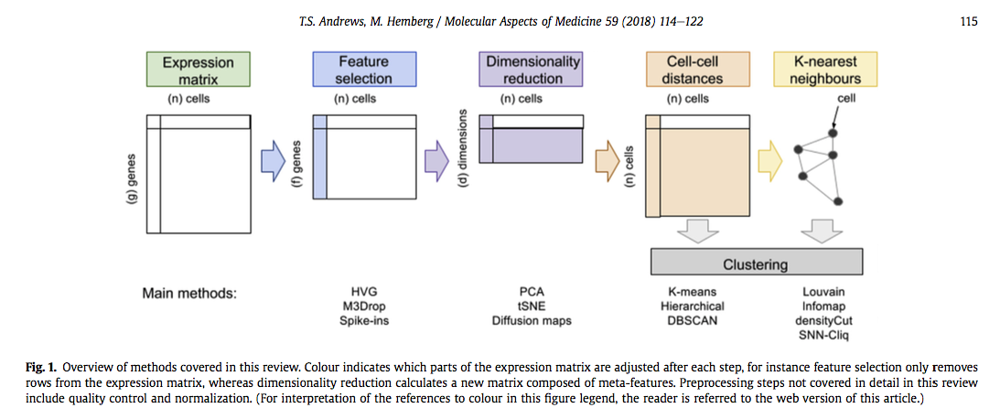
-->

Source: [clustering methods](https://hemberg-lab.github.io/scRNA.seq.course/biological-analysis.html##clustering-methods) in the Hemberg group material and [its 'biocellgen variant'](https://biocellgen-public.svi.edu.au/mig_2019_scrnaseq-workshop/public/clustering-and-cell-annotation.html#clustering-methods.), with some of its text copied with few edits only. Also see the [OSCA chapter on clustering](https://osca.bioconductor.org/clustering.html) and a [benchmark study](https://f1000research.com/articles/7-1297#ref-2).

Once we have normalized the data and removed confounders we can carry out analyses that are relevant to the biological questions at hand. The exact nature of the analysis depends on the dataset. One of the most promising applications of scRNA-seq is *de novo* discovery and annotation of cell-types based on transcription profiles. This requires the identification of groups of cells based on the similarities of the transcriptomes without any prior knowledge of the labels, or unsupervised clustering. To avoid the challenges caused by the noise and high dimensionality of the scRNA-seq data, clustering is performed after feature selection and dimensionality reduction, usually on the PCA output.

We will introduce three widely used clustering methods: 1) hierarchical, 2) k-means and 3) graph-based clustering. In short, the first two were developed first and are faster for small data sets, while the third is more recent and better suited for scRNA-seq, especially large data sets. All three identify non-overlapping clusters.

We will apply them to the denoised log-expression values on the data set studied and measure clustering quality.

## Load data

<!--
We will load the R file keeping the SCE (SingleCellExperiment) object with the normalised counts for 500 cells per sample and the outcome of feature selection followed by dimensionality reduction.
-->


```r
#setName <- "caron"
#setSuf <- "_5hCellPerSpl"
#setSuf <- "" # dev with 1k/spl, should be _1kCellPerSpl
#setSuf <- "_allCells" # dev with 1k/spl, should be _1kCellPerSpl

# need library size
# all sample types
tmpFn <- sprintf("%s/%s/Robjects/%s_sce_nz_postDeconv%s.Rds", projDir, outDirBit, setName, setSuf)
if(!file.exists(tmpFn))
{
	knitr::knit_exit()
}
sce0 <- readRDS(tmpFn)

# Read mnn.out object in:
# only sample types in splSetToGet2
splSetToGet2 <- gsub(",", "_", splSetToGet)
tmpFn <- sprintf("%s/%s/Robjects/%s_sce_nz_postDeconv%s_dsi_%s.Rds",
		projDir, outDirBit, setName, setSuf, splSetToGet2)
print(tmpFn)
```

```
## [1] "/ssd/personal/baller01/20200511_FernandesM_ME_crukBiSs2020/AnaWiSce/AnaKmWiC/Robjects/caron_sce_nz_postDeconv_5hCellPerSpl_dsi_PBMMC_ETV6-RUNX1.Rds"
```

```r
if(!file.exists(tmpFn))
{
	knitr::knit_exit()
}
sce <- readRDS(tmpFn) # ex mnn.out
#sce2 <- readRDS(tmpFn) # ex mnn.out
#rownames(sce) <- rownames(sce2)
rowData(sce) <- cbind(rowData(sce), rowData(sce0)[rownames(sce),]) %>% DataFrame
```

Number of cells: .

Number of genes: 7930.

## Clustering cells into putative subpopulations

<!--
See https://hemberg-lab.github.io/scRNA.seq.course/index.html for three types of clustering.
See https://www.ncbi.nlm.nih.gov/pubmed/27303057 for review
-->

<!-- Defining cell clusters from expression data -->

### Hierarchical clustering

Hierarchical clustering builds a hierarchy of clusters yielding a dendrogram that groups together cells with similar expression patterns across the chosen genes.

There are two types of strategies:

* Agglomerative (bottom-up): each observation starts in its own cluster, and pairs of clusters are merged as one moves up the hierarchy.
* Divisive (top-down): all observations start in one cluster, and splits are performed recursively as one moves down the hierarchy.

<!--


-->

The raw data:


```r
knitr::include_graphics("../Images/bioCellGenHierar1.png")
```


The hierarchical clustering dendrogram:


```r
knitr::include_graphics("../Images/bioCellGenHierar2.png")
```


* Pros:
    + deterministic method
    + returns partitions at all levels along the dendrogram
* Cons:
    + computationally expensive in time and memory that increase proportionally to the square of the number of data points


#### Clustering

Here we will apply hierarchical clustering on the Euclidean distances between cells, using the Ward D2 criterion to minimize the total variance within each cluster.


```r
# get PCs
#pcs <- reducedDim(sce, "PCA")
pcs <- reducedDim(sce, "corrected")
# compute distance
pc.dist <- dist(pcs)
# derive tree
hc.tree <- hclust(pc.dist, method="ward.D2")
hcd <- as.dendrogram(hc.tree)
```

The dendrogram below shows each cell as a leaf.


```r
#plot(hc.tree, labels = FALSE, xlab = NULL, sub = NULL)
plot(hcd, type = "rectangle", ylab = "Height", leaflab = "none")
```

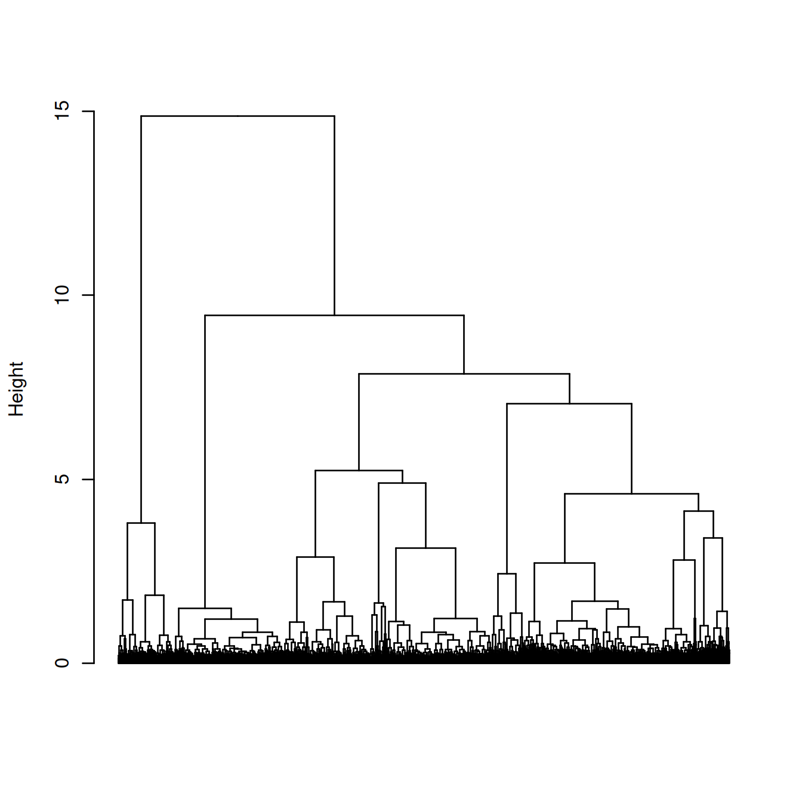

Clusters are identified in the dendrogram using the shape of branches as well as their height ('dynamic tree cut' [@doi:10.1093/bioinformatics/btm563]). <!-- https://academic.oup.com/bioinformatics/article/24/5/719/200751 -->


```r
# identify clusters by cutting branches, requesting a minimum cluster size of 20 cells.
hc.clusters <- unname(cutreeDynamic(hc.tree,
				    distM = as.matrix(pc.dist),
				    minClusterSize = 20,
				    verbose = 0))
```

Cell counts for each cluster (rows) and each sample group (columns):


```r
# per sample group
table(hc.clusters, sce$source_name)
```

```
##            
## hc.clusters ABMMC ETV6-RUNX1 HHD PBMMC PRE-T
##          1      0        609   0   183     0
##          2      0        189   0   441     0
##          3      0        512   0    94     0
##          4      0        340   0   151     0
##          5      0         99   0   107     0
##          6      0         76   0   126     0
##          7      0         13   0   167     0
##          8      0         45   0    70     0
##          9      0         73   0    25     0
##          10     0         24   0    68     0
##          11     0         20   0    68     0
```

Cell counts for each cluster (rows) and each sample (columns):


```r
# per sample
table(hc.clusters, sce$Sample.Name)
```

```
##            
## hc.clusters GSM3872434 GSM3872435 GSM3872436 GSM3872437 GSM3872442 GSM3872443
##          1          50        301        159         99         73         18
##          2           1         15        154         19        185        125
##          3         299         83         28        102         57         15
##          4         121         61         38        120         90         11
##          5           0          0         21         78          0        101
##          6           2          9         51         14         17         54
##          7           1          0          5          7         38         50
##          8           0          1         11         33          1         57
##          9          20         28         11         14          6         10
##          10          4          1          8         11         14         36
##          11          2          1         14          3         19         23
##            
## hc.clusters GSM3872444
##          1          92
##          2         131
##          3          22
##          4          50
##          5           6
##          6          55
##          7          79
##          8          12
##          9           9
##          10         18
##          11         26
```

This data (cell number) may also be shown as heatmap.


```r
tmpTab <- table(hc.clusters, sce$Sample.Name)
rownames(tmpTab) = paste("hc", rownames(tmpTab), sep = "_")

# columns annotation with cell name:
mat_col <- colData(sce) %>% data.frame() %>% select(Sample.Name, source_name) %>% unique
rownames(mat_col) <- mat_col$Sample.Name
mat_col$Sample.Name <- NULL

# Prepare colours for clusters:
colourCount = length(unique(mat_col$source_name))
getPalette = grDevices::colorRampPalette(RColorBrewer::brewer.pal(9, "Set1"))

mat_colors <- list(source_name = getPalette(colourCount))
names(mat_colors$source_name) <- unique(mat_col$source_name)
```

Heatmap, with samples ordered as in sample sheet:


```r
# without column clustering
pheatmap(tmpTab,
           cluster_cols = FALSE,
           annotation_col    = mat_col,
           annotation_colors = mat_colors)
```

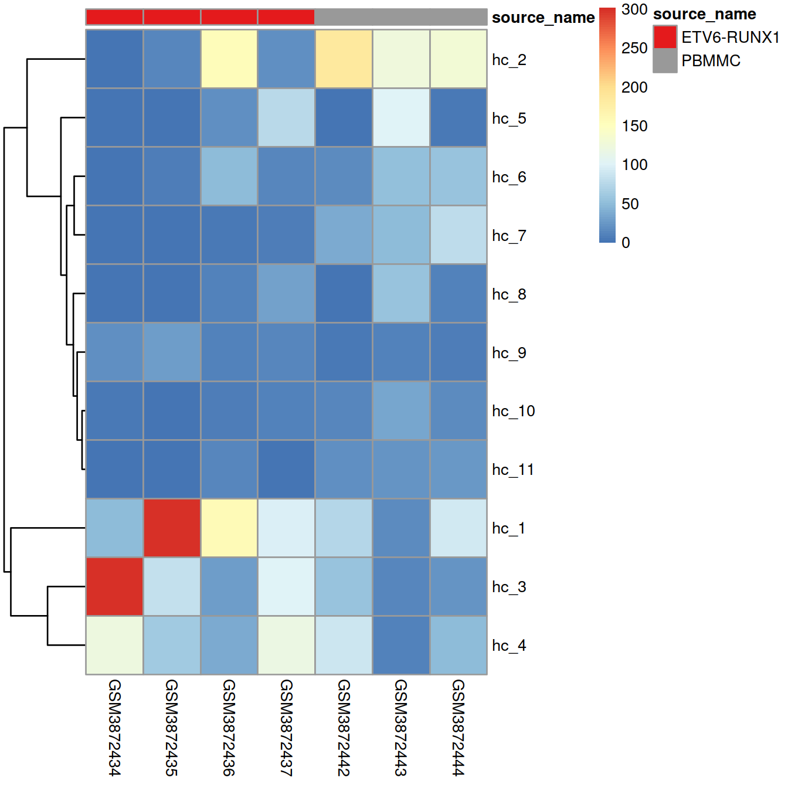

Heatmap, with samples ordered by similarity of cell distribution across clusters:


```r
# with column clustering
pheatmap(tmpTab,
           annotation_col    = mat_col,
           annotation_colors = mat_colors)
```

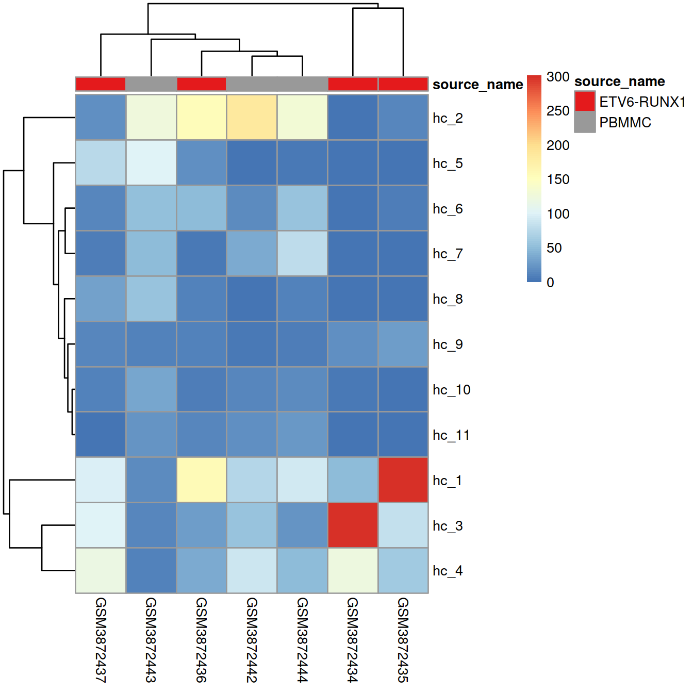

If clusters mostly include cells from one sample or the other, it suggests that the samples differ, and/or the presence of batch effect.

Let us show cluster assignments on the t-SNE, with cells shaped by cell type,
colored by cluster and sized total UMI counts ('sum').


```r
# store cluster assignment in SCE object:
sce$cluster <- factor(hc.clusters)
# make, store and show TSNE plot:
#g <- plotTSNE(sce, colour_by = "cluster", size_by = "sum", shape_by="source_name")
g <- plotTSNE(sce, colour_by = "cluster", shape_by="source_name")
g
```

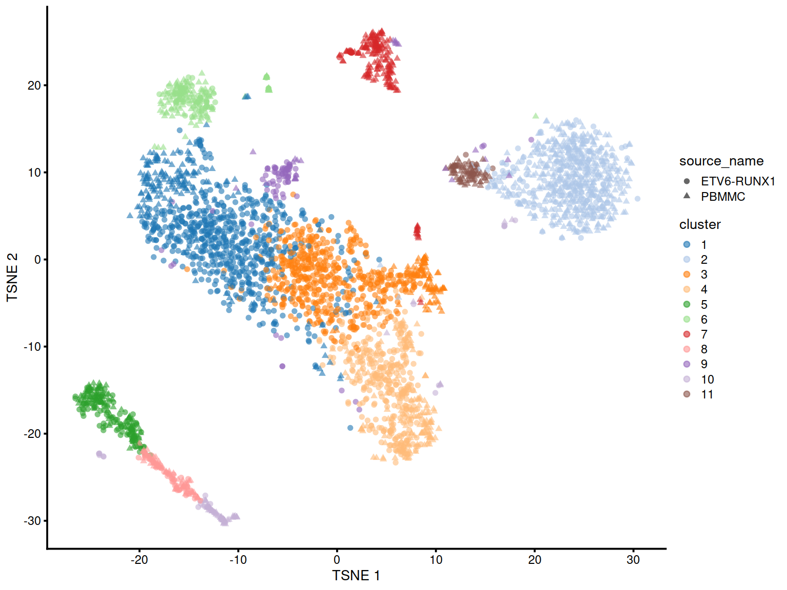

Split by sample group:


```r
# split by sample and show:
g <- g + facet_wrap(. ~ sce$source_name)
g
```

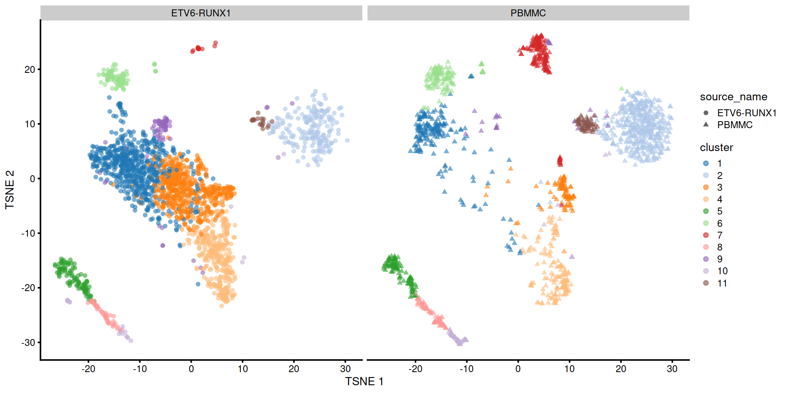

In some areas cells are not all assigned to the same cluster.

#### Separatedness

The congruence of clusters may be assessed by computing the sillhouette for each cell.
The larger the value the closer the cell to cells in its cluster than to cells in other clusters.
Cells closer to cells in other clusters have a negative value.
Good cluster separation is indicated by clusters whose cells have large silhouette values.

We first compute silhouette values. 


```r
sil <- silhouette(hc.clusters, dist = pc.dist)
```

We then plot silhouettes with one color per cluster and cells with a negative silhouette with the color of their closest cluster.
We also add the average silhouette for each cluster and all cells. 


```r
# prepare colours:
clust.col <- scater:::.get_palette("tableau10medium") # hidden scater colours
sil.cols <- clust.col[ifelse(sil[,3] > 0, sil[,1], sil[,2])]
sil.cols <- sil.cols[order(-sil[,1], sil[,3])]
# plot:
plot(sil,
     main = paste(length(unique(hc.clusters)), "clusters"),
     border = sil.cols,
     col = sil.cols,
     do.col.sort = FALSE) 
```

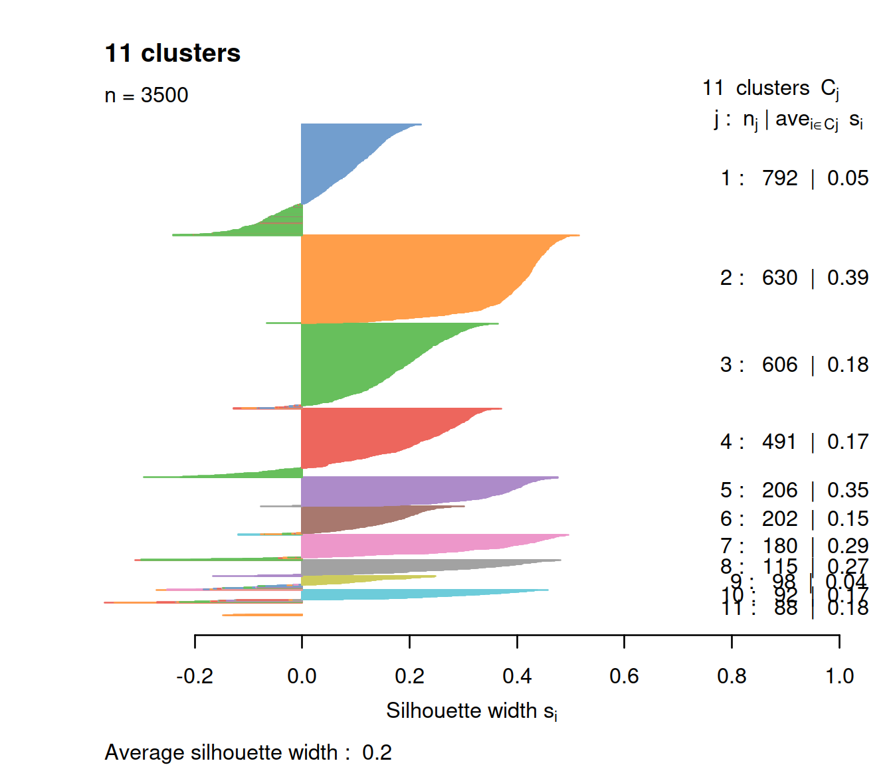

The plot shows cells with negative silhouette indicating that too many clusters may have been defined.
The method and parameters used defined clusters with properties that may not fit the data set, eg clusters with the same diameter.

### k-means

#### Description

In k-means clustering, the goal is to partition N cells into k different clusters. In an iterative manner, cluster centers are defined and each cell is assigned to its nearest cluster.

The aim is to minimise within-cluster variation and maximise between-cluster variation, using the following steps:

* randomly select k data points to serve as initial cluster centers,
* for each point, compute the distance between that point and each of the centroids and assign the point to the cluster with the closest centroid,
* calculate the mean of each cluster (the 'mean' in 'k-mean') to define its centroid, and for each point compute the distance to these means to choose the closest, repeat until the distance between centroids and data points is minimal (ie clusters do not change) or the maximum number of iterations is reached,
* compute the total variation within clusters,
* assign new centroids and repeat steps above

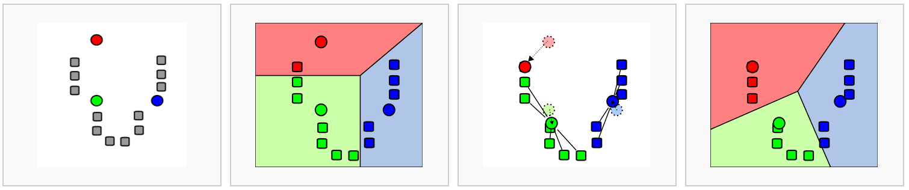

* Pros:
    + fast
* Cons:
    + assumes a pre-determined number of clusters
    + sensitive to outliers
    + tends to define equally-sized clusters

#### Example

The dendogram built above suggests there may be six large cell populations.

Let us define six clusters.


```r
# define clusters with kmeans()
# because results depend on the initial cluster centers,
# it is usually best to try several times,
# by setting 'nstart' to say 20,
# kmeans() will then retain the run with the lowest within cluster variation.
kclust <- kmeans(pcs, centers=6, nstart = 20) 

# compute silhouette
sil <- silhouette(kclust$cluster, dist(pcs))

# plot silhouette
clust.col <- scater:::.get_palette("tableau10medium") # hidden scater colours
sil.cols <- clust.col[ifelse(sil[,3] > 0, sil[,1], sil[,2])]
sil.cols <- sil.cols[order(-sil[,1], sil[,3])]
plot(sil, main = paste(length(unique(kclust$cluster)), "clusters"), 
    border=sil.cols, col=sil.cols, do.col.sort=FALSE) 
```

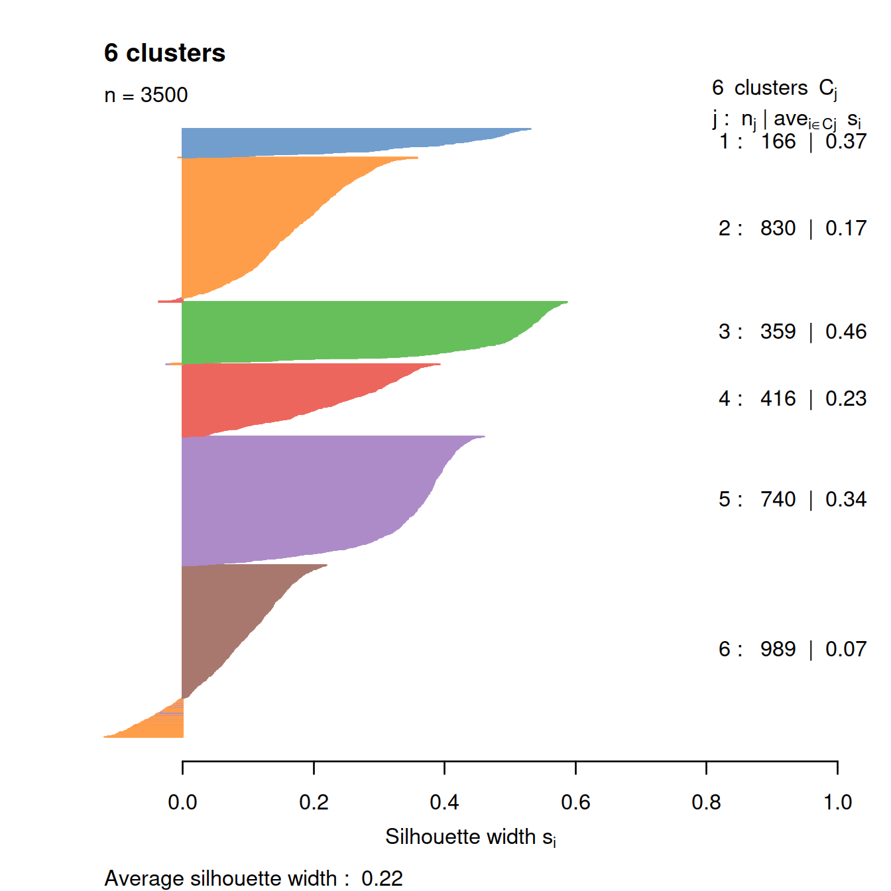

The t-SNE plot below shows cells color-coded by cluster membership:


```r
# get cell coordinates from "TSNE" slot:
tSneCoord <- as.data.frame(reducedDim(sce, "TSNE"))
colnames(tSneCoord) <- c("TSNE1", "TSNE2")
# add sample type:
tSneCoord$source_name <- sce$source_name
# add cluster info:
tSneCoord$cluster <- as.factor(kclust$cluster)
# draw plot
p2 <- ggplot(tSneCoord, aes(x=TSNE1, y=TSNE2,
			    colour=cluster,
			    shape=source_name)) +
	geom_point()
p2
```

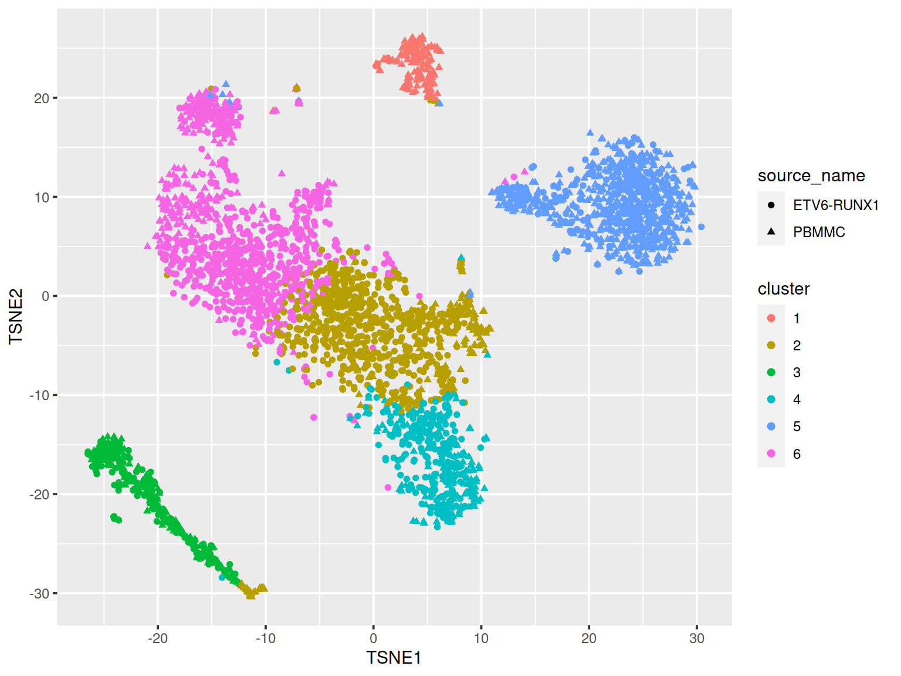

Split by sample type:


```r
p2 + facet_wrap(~ sce$source_name)
```

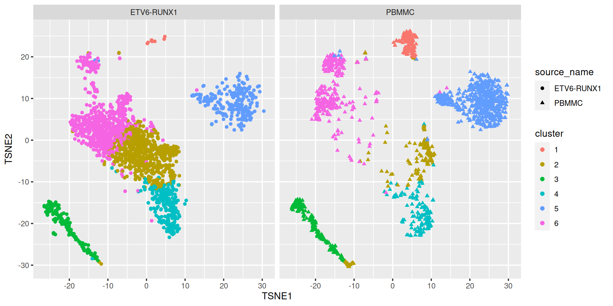

To find the most appropriate number of clusters, one performs the analysis for a series of values for k and for each k value computes a 'measure of fit' of the clusters defined. Several metrics exist. We will look at:
* within-cluster sum-of-squares
* silhouette
* gap statistic

#### Within-cluster sum-of-squares

The within-cluster sum-of-squares is the sum of the squared deviations from each observation and the cluster centroid. This metric measures the variability of observations within a cluster.  It decreases as k increases, by an amount that decreases with k. Indeed, for low k values increasing k usually improves clustering, as shown by a sharp drop in the within-cluster sum-of-squares. For higher k values, increasing k does not reduce the within-cluster sum-of-squares much: dividing clusters further only slightly reduces variablility inside clusters. On a plot of the within-cluster sum-of-squares against k, the curve shows two parts: the first with a steep negative slope and the second with a small slope. The 'elbow' of the curve indicates the most appropriate number of clusters.


```r
library(broom)
library(tibble)
library(tidyr)
library(purrr)

# get PCA matrix (i.e. rotated values)
points <- as_tibble(pcs)

# define clusters for different number of clusters
# from 1 to 20:
kclusts <- tibble(k = 1:20) %>%
  mutate(
    kclust = map(k, ~kmeans(points, .x)), # define clusters
    tidied = map(kclust, tidy), # 'flatten' kmeans() output into tibble
    glanced = map(kclust, glance), # convert model or other R object to convert to single-row data frame
    augmented = map(kclust, augment, points) # extract per-observation information
  )

# get cluster assignments
# unnest a list column with unnest(),
# i.e. make each element of the list its own row.
clusters <- kclusts %>%
  unnest(tidied)

# get assignments
assignments <- kclusts %>% 
  unnest(augmented)

# get clustering outcome
clusterings <- kclusts %>%
  unnest(glanced)
```

We now plot the total within-cluster sum-of-squares and decide on k.


```r
ggplot(clusterings, aes(k, tot.withinss)) +
  geom_point() +
  geom_line()
```


```r
clusterings %>% 
  mutate(tot.withinss.diff = tot.withinss - lag(tot.withinss)) %>%
  arrange(desc(tot.withinss.diff))
```

```
## # A tibble: 20 x 9
##        k kclust  tidied       totss tot.withinss betweenss  iter augmented      
##    <int> <list>  <list>       <dbl>        <dbl>     <dbl> <int> <list>         
##  1    17 <kmean… <tibble[,53…  418.         126.  2.92e+ 2     5 <tibble[,51] […
##  2    20 <kmean… <tibble[,53…  418.         120.  2.98e+ 2     6 <tibble[,51] […
##  3     8 <kmean… <tibble[,53…  418.         170.  2.48e+ 2     4 <tibble[,51] […
##  4    19 <kmean… <tibble[,53…  418.         120.  2.98e+ 2     6 <tibble[,51] […
##  5    14 <kmean… <tibble[,53…  418.         133.  2.85e+ 2     4 <tibble[,51] […
##  6    16 <kmean… <tibble[,53…  418.         124.  2.94e+ 2     5 <tibble[,51] […
##  7    12 <kmean… <tibble[,53…  418.         138.  2.80e+ 2     4 <tibble[,51] […
##  8    13 <kmean… <tibble[,53…  418.         135.  2.84e+ 2     4 <tibble[,51] […
##  9    11 <kmean… <tibble[,53…  418.         142.  2.76e+ 2     4 <tibble[,51] […
## 10    15 <kmean… <tibble[,53…  418.         127.  2.91e+ 2     4 <tibble[,51] […
## 11    18 <kmean… <tibble[,53…  418.         120.  2.98e+ 2     4 <tibble[,51] […
## 12    10 <kmean… <tibble[,53…  418.         146.  2.72e+ 2     5 <tibble[,51] […
## 13     7 <kmean… <tibble[,53…  418.         170.  2.49e+ 2     4 <tibble[,51] […
## 14     6 <kmean… <tibble[,53…  418.         182.  2.37e+ 2     5 <tibble[,51] […
## 15     9 <kmean… <tibble[,53…  418.         156.  2.62e+ 2     5 <tibble[,51] […
## 16     5 <kmean… <tibble[,53…  418.         195.  2.23e+ 2     4 <tibble[,51] […
## 17     4 <kmean… <tibble[,53…  418.         219.  1.99e+ 2     3 <tibble[,51] […
## 18     3 <kmean… <tibble[,53…  418.         249.  1.69e+ 2     3 <tibble[,51] […
## 19     2 <kmean… <tibble[,53…  418.         305.  1.13e+ 2     1 <tibble[,51] […
## 20     1 <kmean… <tibble[,53…  418.         418. -2.27e-13     1 <tibble[,51] […
## # … with 1 more variable: tot.withinss.diff <dbl>
```

```r
# get the smallest negative drop
k_neg <- clusterings %>% 
  mutate(tot.withinss.diff = tot.withinss - lag(tot.withinss)) %>%
  filter(tot.withinss.diff < 0) %>%
  #arrange(desc(tot.withinss.diff)) %>%
  slice_max(tot.withinss.diff, n = 1) %>%
  pull(k)
k_neg <- k_neg -1
# get the first positive diff
k_pos <- clusterings %>% 
  mutate(tot.withinss.diff = tot.withinss - lag(tot.withinss)) %>%
  filter(tot.withinss.diff >= 0) %>%
  #arrange(desc(tot.withinss.diff)) %>%
  slice_min(k, n = 1) %>%
  pull(k)
k_pos <- k_pos -1
```

The plot above suggests reasonable values for k may be:

* 13 (where the drop in total within-cluster sum-of-squares is the smallest)
* 7 (lowest cluster number where the difference in consecutive total within-cluster sum-of-squares is positive)

#### Silhouette

We now compute the Silhouette values for each set of clusters defined above for the series of values of k.


```r
# compute pairwise distance between cells in the PC space,
# as it is needed to compute silhouette:
pcDist <- dist(pcs)
# compute silhouette for each set of clusters defined above for a series of values of k:
Ks=sapply(2:20,
		function(i) {
			tmpClu <- as.numeric(kclusts$augmented[[i]]$.cluster)
			#table(tmpClu)
			sil <- silhouette(tmpClu, pcDist)
			summary(sil)$avg.width
		}
)
# plot average width against k:
plot(2:20, Ks,
     xlab="k",
     ylab="av. silhouette",
     type="b",
     pch=19)
```

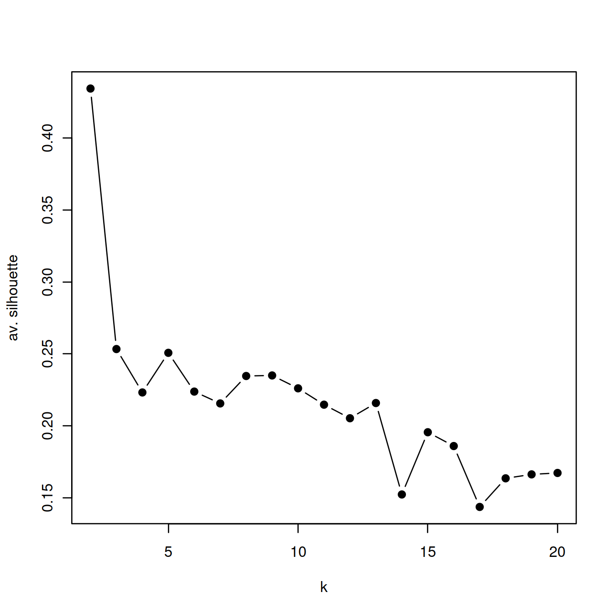

<!--
The plot above shows that silhouette values vary little for k between 4 and 11, though higher values are observed for k at 5, 8, 9 and 10.
-->

#### Gap statistic

Because the variation quantity decreases as the number of clusters increases,
a more reliable approach is to compare the observed variation to that expected from a null distribution.
With the gap statistic, the expected variation is computed:

* by generating several reference data sets using the uniform distribution (no cluster),
* for each such set and the series of k values, by clustering and computing the within-cluster variation.

The gap statistic measures for a given k the difference between the expected and observed variation.
The most appropriate number of clusters is that with the higest gap value.

We will use `cluster::clusGap()` to compute the gap statistic for k between 1 and 20.


```r
set.seed(123)
gaps <- cluster::clusGap(
  x = pcs,
  FUNcluster = kmeans,
  K.max = 20,
  nstart = 5, # low for expediency here but should use higher
  B = 10 # low for expediency here but should use higher
)

## find the "best" k
best.k <- cluster::maxSE(gaps$Tab[, "gap"], gaps$Tab[, "SE.sim"])
# in case the the best k was '1',
# skip first row of output table:
gapsTab <- gaps$Tab[2:nrow(gaps$Tab),]
best.k <- cluster::maxSE(gapsTab[, "gap"], gapsTab[, "SE.sim"])
#best.k
```

The "optimal" k value is 19.


```r
# try other method to choose best k:
##best.k <- cluster::maxSE(gapsTab[, "gap"], gapsTab[, "SE.sim"], method="Tibs2001SEmax")
##best.k <- cluster::maxSE(gapsTab[, "gap"], gapsTab[, "SE.sim"], method="firstmax")
##best.k
```

We next copy the cluster assignment to the SCE object.


```r
df <- as.data.frame(assignments)
# here only copy outcome for k == 10
sce$kmeans10 <- as.numeric(df[df$k == 10, ".cluster"])
```

We now check silhouette values for a k of 10:


```r
library(cluster)
clust.col <- scater:::.get_palette("tableau10medium") # hidden scater colours
sil <- silhouette(sce$kmeans10, dist = pc.dist)
sil.cols <- clust.col[ifelse(sil[,3] > 0, sil[,1], sil[,2])]
sil.cols <- sil.cols[order(-sil[,1], sil[,3])]
plot(sil, main = paste(length(unique(sce$kmeans10)), "clusters"), 
    border=sil.cols, col=sil.cols, do.col.sort=FALSE) 
```

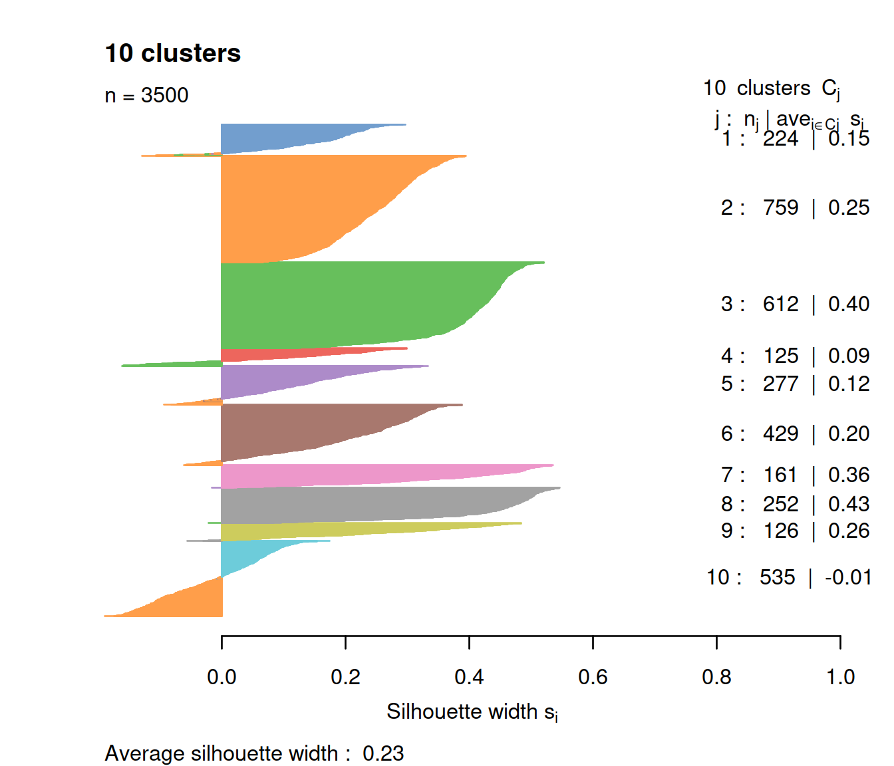


```r
df <- as.data.frame(assignments)
sce$kmeans.best <- as.numeric(df[df$k == best.k, ".cluster"])
```

We now check silhouette values for a k of 19:


```r
library(cluster)
clust.col <- colorRampPalette(RColorBrewer::brewer.pal(9,"RdBu"))(best.k)
sil <- silhouette(sce$kmeans.best, dist = pc.dist)
sil.cols <- clust.col[ifelse(sil[,3] > 0, sil[,1], sil[,2])]
sil.cols <- sil.cols[order(-sil[,1], sil[,3])]
plot(sil, main = paste(length(unique(sce$kmeans.best)), "clusters"), 
    border=sil.cols, col=sil.cols, do.col.sort=FALSE) 
```


For the same number of clusters (10), fewer cells have negative values with k-means than with hierarchical clustering. The average silhouette is similar though, and all clusters show a wide range.

#### Multi-metric

<!-- TODO Keep? Implies proper choice of metrics ... -->

One may also use multiple metrics rather than only one and check how they concord, using `NbClust::NbClust()` (see manual for a description of metrics computed):


```r
# run only once and save outcome to file to load later.

tmpFn <- sprintf("%s/%s/Robjects/%s_sce_nz_postDeconv%s_500CellK2to20NbClust.Rds", projDir, outDirBit, setName, setSuf)
if(file.exists(tmpFn))
{
	nb <- readRDS(file=tmpFn)
} else {
	library(NbClust)
	# tried with k from 2 to 20 but that takes too long with all cells.
	# subsample 500 cells
	tmpInd <- sample(nrow(pcs), 500)
		nb = NbClust(data=pcs[tmpInd,], 
	             distance = "euclidean",
	             min.nc = 2,
		      max.nc = 20,
	             #min.nc = 8,
	             #max.nc = 16,
	             method = "kmeans",
	             index=c("kl","ch","cindex","db","silhouette",
	                "duda","pseudot2","beale","ratkowsky",
	                "gap","gamma","mcclain","gplus",
	                "tau","sdindex","sdbw"))
	saveRDS(nb, file=tmpFn)
	rm(tmpInd)
}
rm(tmpFn)
```

Table showing the number of methods selecting values of k as the best choice:


```r
table(nb$Best.nc[1,]) # consensus seems to be 3 clusters
```

```
## 
##  2  3  7 11 14 20 
##  7  4  1  1  1  2
```

```r
rm(nb)
```

No strong support for a single sensible value of k is observed.

### Graph-based clustering

Graph-based clustering entails building a nearest-neighbour (NN) graph using cells as nodes and their similarity as edges, then identifying 'communities' of cells within the network (more details [there](https://biocellgen-public.svi.edu.au/mig_2019_scrnaseq-workshop/public/clustering-and-cell-annotation.html#unsupervised-clustering-methods)). In this k-NN graph two nodes (cells), say A and B, are connected by an edge if the distance between them is amongst the k smallest distances from A to other cells ('KNN'), and from B to other cells (shared-NN, 'SNN'). An edge may be weighted based on the number or closeness of shared nearest neighbours. Clusters are identified using metrics related to the number of neighbours ('connections') to find groups of highly interconnected cells. "The value of ‘k’ can be roughly interpreted as the anticipated size of the smallest subpopulation" (see `scran`'s `buildSNNGraph()` manual).

* Pros:
    + fast and memory efficient (avoids the need to construct a distance matrix for all pairs of cells)
    + no assumptions on the shape of the clusters or the distribution of cells within each cluster
    + no need to specify a number of clusters to identify (but the size of the neigbourhood used affects the size of clusters)
* Cons:
    + loss of information beyond neighboring cells, which can affect community detection in regions with many cells.

The plot below shows the same data set as a network built using three different numbers of neighbours: 5, 15 and 25 (from [here](https://biocellgen-public.svi.edu.au/mig_2019_scrnaseq-workshop/public/clustering-and-cell-annotation.html#clustering-methods.)).


We will:

* build the graph,
* define clusters,
* check membership across samples,
* show membership on a t-SNE plot,
* assess clustering quality.

We now build the shared nearest neighbour (SNN) graph, using `scran`'s `buildSNNGraph()` with: 

* the reduced and denoised data set (PCs)
* the default number of neighbours (k=10)
* the default type of edge weight (type="rank")


```r
# compute graph using buildSNNGraph
# check manual with: ?buildSNNGraph
#snn.gr <- buildSNNGraph(sce, use.dimred="PCA")
snn.gr <- buildSNNGraph(sce, use.dimred="corrected")
```

The number of cells in the data set is large so we randomly choose 1000 nodes (cells) in the network before plotting the resulting smaller network. Cells are color-coded by sample type:


```r
# subset graph down to 1000 cells
# https://igraph.org/r/doc/subgraph.html

# Add vertices (nodes. ie cells) annotation
V(snn.gr)$Sample.Name <- colData(sce)$Sample.Name
V(snn.gr)$source_name <- as.character(colData(sce)$source_name)

# pick 1000 nodes randomly
edgesToGet <- sample(nrow(snn.gr[]), 1000)

# subset graph for these 1000 ramdomly chosen nodes
snn.gr.subset <- subgraph(snn.gr, edgesToGet)
g <- snn.gr.subset

# set colors for clusters
if(length(unique(V(g)$source_name)) <= 2)
{
  cols <- colorspace::rainbow_hcl(length(unique(V(g)$source_name)))
} else {
  cols <- RColorBrewer::brewer.pal(n = length(unique(V(g)$source_name)), name = "RdYlBu")
}
names(cols) <- unique(V(g)$source_name)

# plot graph
plot.igraph(
  g, layout = layout_with_fr(g),
  vertex.size = 3, vertex.label = NA,
  vertex.color = cols[V(g)$source_name],
  frame.color = cols[V(g)$source_name],
  main = "default parameters"
)

# add legend
legend('bottomright',
       legend=names(cols),
       pch=21,
       col=cols, # "#777777",
       pt.bg=cols,
       pt.cex=1, cex=.6, bty="n", ncol=1)
```

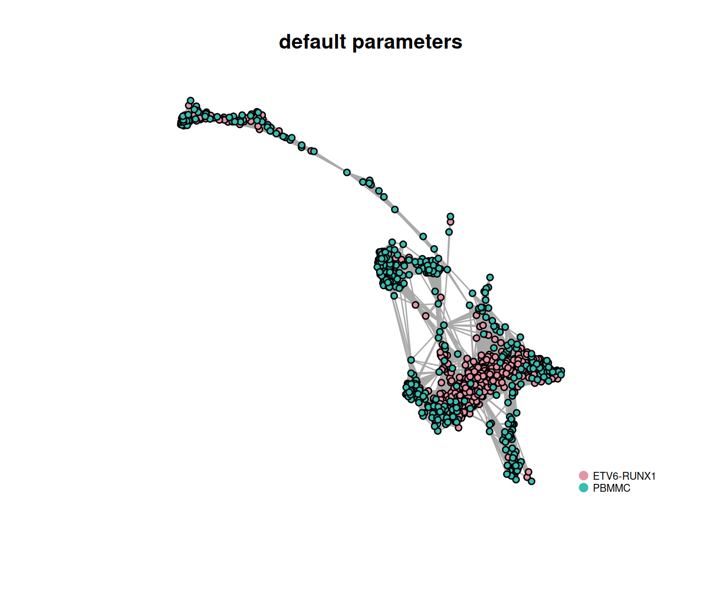

#### Modularity

Several methods to detect clusters ('communities') in networks rely on the 'modulatrity' metric. For a given partition of cells into clusters, modularity measures how separated clusters are from each other, based on the difference between the observed and expected weight of edges between nodes. For the whole graph, the closer to 1 the better.

#### Walktrap method

<!-- #### Community detection via short random walks: 'walktrap' -->


The walktrap method relies on short random walks (a few steps) through the network. These walks tend to be 'trapped' in highly-connected regions of the network. Node similarity is measured based on these walks. Nodes are first each assigned their own community. Pairwise distances are computed and the two closest communities are grouped. These steps are repeated a given number of times to produce a dendrogram. Hierarchical clustering is then applied to the distance matrix. The best partition is that with the highest modularity. <!-- https://link.springer.com/article/10.1007/s11227-019-03018-x -->

<!--
BIB Pons and Latapy [18] Pons P, Latapy M (2006) Computing communities in large networks using random walks. J Graph Algorithms Appl 10(2):191–218
reliable (https://www.ncbi.nlm.nih.gov/pmc/articles/PMC5102890/)
-->

<!--
see pipeComp on performance of walktrap
https://www.ncbi.nlm.nih.gov/pmc/articles/PMC5102890/
-->


```r
# identify clusters with walktrap
# default number of steps: 4
cluster.out <- cluster_walktrap(snn.gr)
```

We will now count cells in each cluster for each sample type and each sample.

We first retrieve membership.


```r
# cluster assignments are stored in the membership slot
wt.clusters <- cluster.out$membership
```

Cluster number and sizes (number of cells):


```r
table(wt.clusters)
```

```
## wt.clusters
##   1   2   3   4   5   6   7   8   9  10  11  12  13  14  15  16  17  18  19 
## 709 193 341  63 137  33  66  23 629  56  35  98 127 536 100 191  86  59  18
```

The table below shows the cluster distribution across sample types. Many clusters are observed in only one sample type.


```r
table(wt.clusters, sce$source_name)
```

```
##            
## wt.clusters ABMMC ETV6-RUNX1 HHD PBMMC PRE-T
##          1      0        543   0   166     0
##          2      0        100   0    93     0
##          3      0        250   0    91     0
##          4      0         27   0    36     0
##          5      0         68   0    69     0
##          6      0          6   0    27     0
##          7      0          0   0    66     0
##          8      0          6   0    17     0
##          9      0        191   0   438     0
##          10     0         26   0    30     0
##          11     0          1   0    34     0
##          12     0          3   0    95     0
##          13     0         58   0    69     0
##          14     0        521   0    15     0
##          15     0         23   0    77     0
##          16     0         75   0   116     0
##          17     0         44   0    42     0
##          18     0         48   0    11     0
##          19     0         10   0     8     0
```

The table below shows the cluster distribution across samples. Most clusters comprise cells from several replicates of a same sample type, while few are observed in only one sample.


```r
tmpTab <- table(wt.clusters, sce$Sample.Name)
rownames(tmpTab) = paste("4-step", rownames(tmpTab), sep = "_")

# columns annotation with cell name:
mat_col <- colData(sce) %>% data.frame() %>% select(Sample.Name, source_name) %>% unique
rownames(mat_col) <- mat_col$Sample.Name
mat_col$Sample.Name <- NULL

# Prepare colours for clusters:
colourCount = length(unique(mat_col$source_name))
getPalette = grDevices::colorRampPalette(RColorBrewer::brewer.pal(9, "Set1"))

mat_colors <- list(source_name = getPalette(colourCount))
names(mat_colors$source_name) <- unique(mat_col$source_name)

pheatmap(tmpTab,
           annotation_col    = mat_col,
           annotation_colors = mat_colors)
```

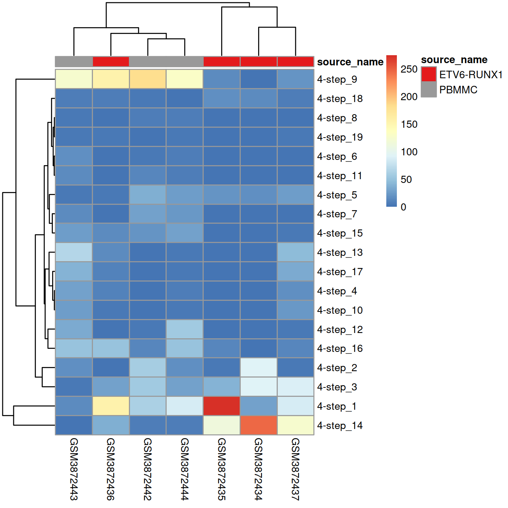

We next check the effect of the number of steps on the clusters detected by
increasing it (default number of steps: 4).

*With 5-step walks:*

Cluster sizes:


```r
cluster.out.s5 <- cluster_walktrap(snn.gr, steps = 5)
wt.clusters.s5 <- cluster.out.s5$membership
table(wt.clusters.s5)
```

```
## wt.clusters.s5
##   1   2   3   4   5   6   7   8   9  10  11  12  13  14  15  16  17  18  19 
## 338 525  63  80 131 779  23 629  38 140 128  84 194  39  47 100  85  59  18
```

Comparison with 4-step clusters:


```r
tmpTab <- table(wt.clusters, wt.clusters.s5)
rownames(tmpTab) = paste("4-step", rownames(tmpTab), sep = "_")
colnames(tmpTab) = paste("5-step", colnames(tmpTab) , sep = "_")
pheatmap(tmpTab)
```

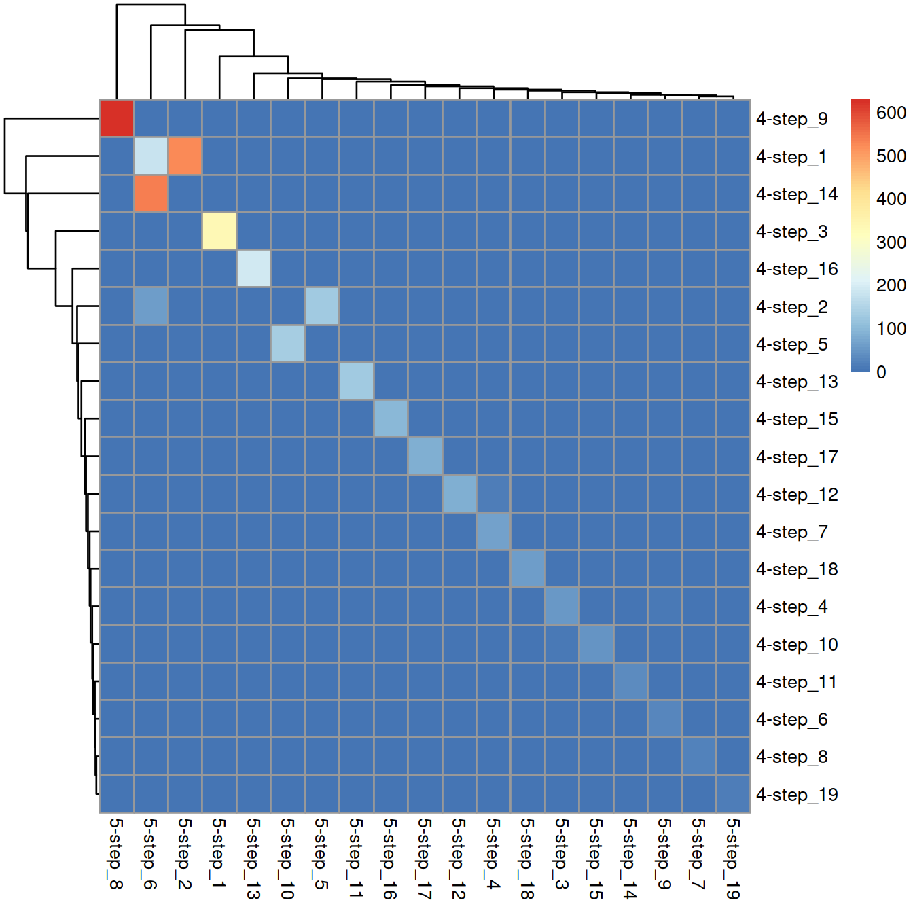

*With 15-step walks:*

Cluster sizes:


```r
cluster.out.s15 <- cluster_walktrap(snn.gr, steps = 15)
wt.clusters.s15 <- cluster.out.s15$membership
table(wt.clusters.s15)
```

```
## wt.clusters.s15
##   1   2   3   4   5   6   7   8   9  10  11  12  13  14  15  16  17  18 
##  65  23 126  62 664 249 181  37 131 250 187  91 562  39 122  49 603  59
```

Comparison with 4-step clusters:


```r
tmpTab <- table(wt.clusters, wt.clusters.s15)
rownames(tmpTab) = paste("4-step", rownames(tmpTab), sep = "_")
colnames(tmpTab) = paste("15-step", colnames(tmpTab) , sep = "_")
pheatmap(tmpTab)
```

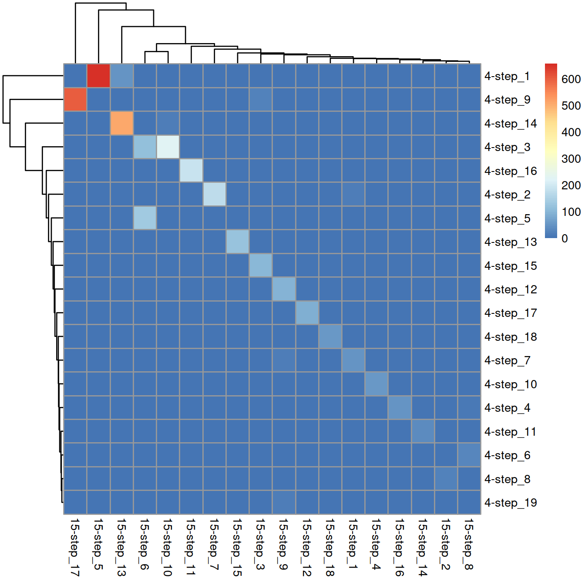

The network may also be built and clusters identified at once with `scran::clusterSNNGraph()` that also allows for large data sets to first cluster cells with k-means into a large number of clusters and then perform graph-based clustering on cluster centroids.


```r
# set use.kmeans to TRUE to 'create centroids that are then subjected to graph-based clustering' (see manual)
# with kmeans.centers default (square root of the number of cells)
# or set kmeans.centers to another value, eg 30
clustersOnce <- clusterSNNGraph(sce,
			     #use.dimred="PCA",
			     use.dimred="corrected",
			     use.kmeans=TRUE,
			     kmeans.centers = 200,
			     full.stats=TRUE)
```

Distribution of the size of the 200 k-means clusters:


```r
# 'kmeans': assignment of each cell to a k-means cluster
##table(clustersOnce$kmeans) # no good with many clusters
summary(data.frame(table(clustersOnce$kmeans))$Freq)
```

```
##    Min. 1st Qu.  Median    Mean 3rd Qu.    Max. 
##     1.0     9.0    15.0    17.5    24.0    52.0
```

Graph-based cluster sizes in cell number:


```r
# 'igraph': assignment of each cell to a graph-based cluster operating on the k-means clusters
table(clustersOnce$igraph)
```

```
## 
##   1   2   3   4   5   6   7 
## 734 555 509 840 365 355 142
```

The heatmap below displays the contingency table for the graph-based clusters (rows) and the k-means clusters (columns) used to build the network (color-code by size, i.e. number of cells).


```r
#table(clustersOnce$igraph,
#	clustersOnce$kmeans)
tmpTab <- table(clustersOnce$igraph,
		clustersOnce$kmeans)
rownames(tmpTab) = paste("igraph", rownames(tmpTab), sep = "_")
colnames(tmpTab) = paste("kmeans", colnames(tmpTab) , sep = "_")
pheatmap(tmpTab, show_colnames = FALSE)
```

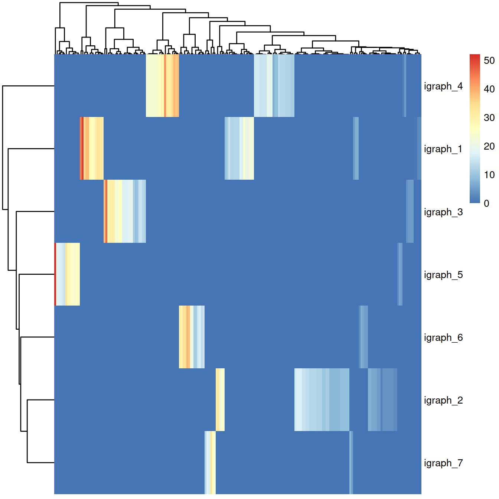

Graph-based cluster sizes in k-mean cluster number:


```r
# ‘membership’, the graph-based cluster to which each node is assigned
table(metadata(clustersOnce)$membership)
```

```
## 
##  1  2  3  4  5  6  7 
## 36 51 27 42 17 19  8
```

The plot below show the network build with the 200 k-means clusters used the
identify the graph-based clusters.


```r
g <- metadata(clustersOnce)$graph
V(g)$membership <- metadata(clustersOnce)$membership

# set colors for clusters
rgb.palette <- colorRampPalette(c("purple","yellow"), space="rgb") # Seurat-like
cols <- rgb.palette(length(unique(V(g)$membership)))
names(cols) <- as.character(1:length(unique(V(g)$membership)))

# plot graph
plot.igraph(
  g, layout = layout_with_fr(g),
  vertex.size = 3, vertex.label = NA,
  vertex.color = cols[V(g)$membership],
  frame.color = cols[V(g)$membership],
  main = "with 200 k-means clusters"
)

# add legend
legend('bottomright',
       legend=names(cols),
       pch=21,
       col=cols, # "#777777",
       pt.bg=cols,
       pt.cex=1, cex=.6, bty="n", ncol=2)
```

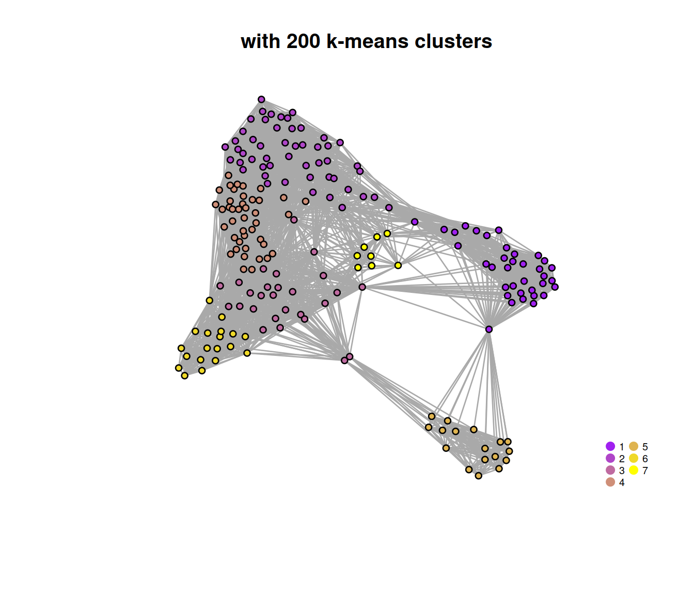

#### Louvain method

<!-- #### Community detection with the 'Louvain' method -->

With the Louvain method, nodes are also first assigned their own community. This hierarchical agglomerative method then progresses in two-step iterations: 1) nodes are re-assigned one at a time to the community for which they increase modularity the most, if any, 2) a new, 'aggregate' network is built where nodes are the communities formed in the previous step. This is repeated until modularity stops increasing. The diagram below is copied from [this article](https://www.nature.com/articles/s41598-019-41695-z#Fig1).

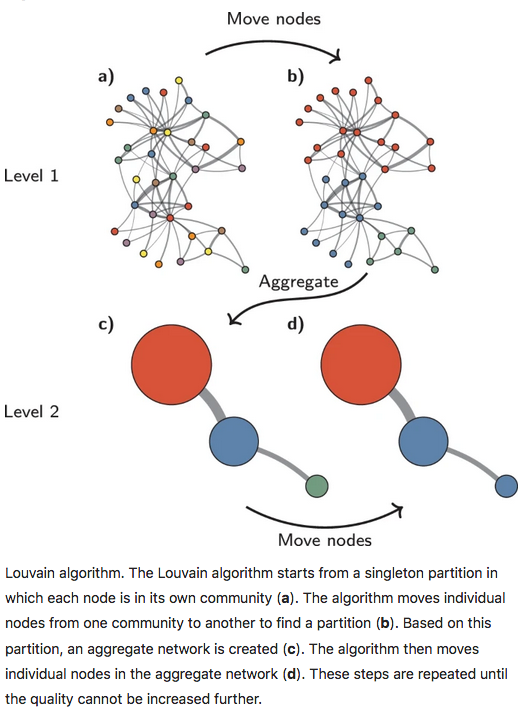

<!-- BIBREF https://www.nature.com/articles/s41598-019-41695-z#Fig1 -->

<!--
multilevel community method
BIBREF https://arxiv.org/abs/1810.08473
-->

We now apply the Louvain approach, store its outcome in the SCE object and show cluster sizes.


```r
ig.louvain <- igraph::cluster_louvain(snn.gr)
cl <- ig.louvain$membership
cl <- factor(cl)
# store membership
sce$louvain <- cl
# show cluster sizes:
table(sce$louvain)
```

```
## 
##   1   2   3   4   5   6   7   8   9  10 
## 653 194  60 605 272 552 519 152 124 369
```

The plot below displays the network with nodes (the 1000 randomly chosen cells) color-coded by cluster membership:


```r
## Define a set of colors to use (must be at least as many as the number of
## communities)
##cols <- RColorBrewer::brewer.pal(n = nlevels(sce$cluster), name = "RdYlBu")
##cols <- grDevices:::colorRampPalette(RColorBrewer::brewer.pal(nlevels(sce$cluster), "RdYlBu"))

V(snn.gr)$Sample.Name <- colData(sce)$Sample.Name
V(snn.gr)$source_name <- as.character(colData(sce)$source_name)
V(snn.gr)$louvain <- as.character(colData(sce)$louvain)

# once only # edgesToGet <- sample(nrow(snn.gr[]), 1000)

snn.gr.subset <- subgraph(snn.gr, edgesToGet)
g <- snn.gr.subset

tmpLayout <- layout_with_fr(g)

rgb.palette <- colorRampPalette(c("purple","yellow"), space="rgb") # Seurat-like
#rgb.palette <- colorRampPalette(c("yellow2","goldenrod","darkred"), space="rgb")
##rgb.palette <- colorRampPalette(c("red","orange","blue"), space="rgb")
cols <- rgb.palette(length(unique(V(g)$louvain)))
names(cols) <- as.character(1:length(unique(V(g)$louvain)))

# Plot the graph, color by cluster assignment
igraph::plot.igraph(
  g, layout = tmpLayout,
  vertex.color = cols[V(g)$louvain],
  frame.color = cols[V(g)$louvain],
  vertex.size = 3, vertex.label = NA, main = "Louvain"
)

# add legend
legend('bottomright',
       legend=names(cols),
       pch=21,
       col=cols, # "#777777",
       pt.bg=cols,
       pt.cex=1, cex=.6, bty="n", ncol=2)
```

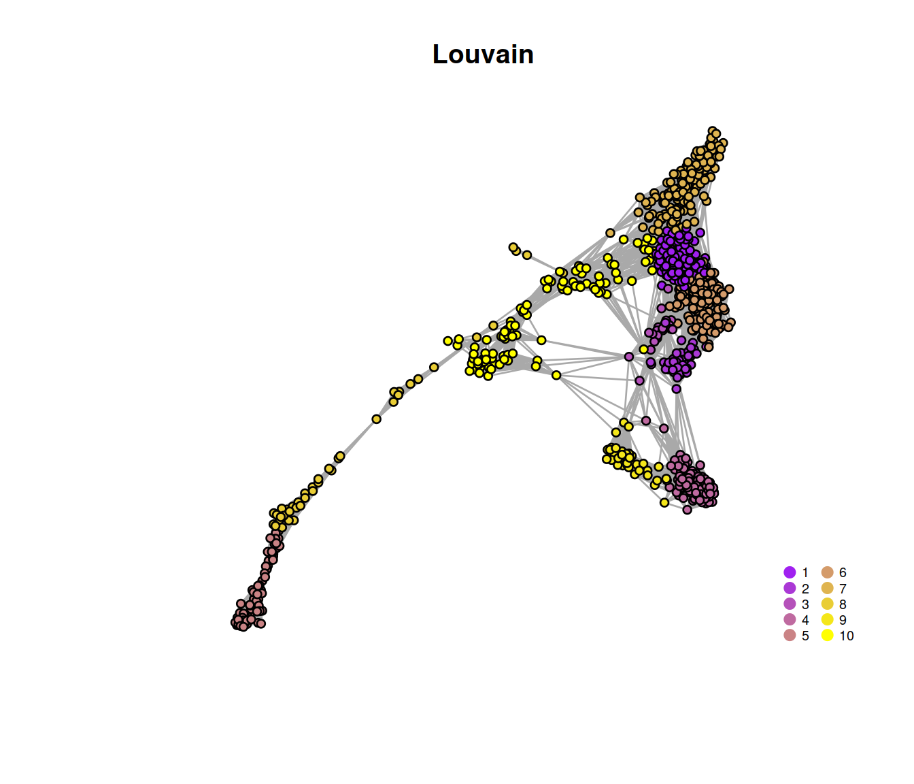

The t-SNE plot shows cells color-coded by cluster membership:


```r
# show clusters on TSNE
p <- plotTSNE(sce, colour_by="louvain") + fontsize
p
```

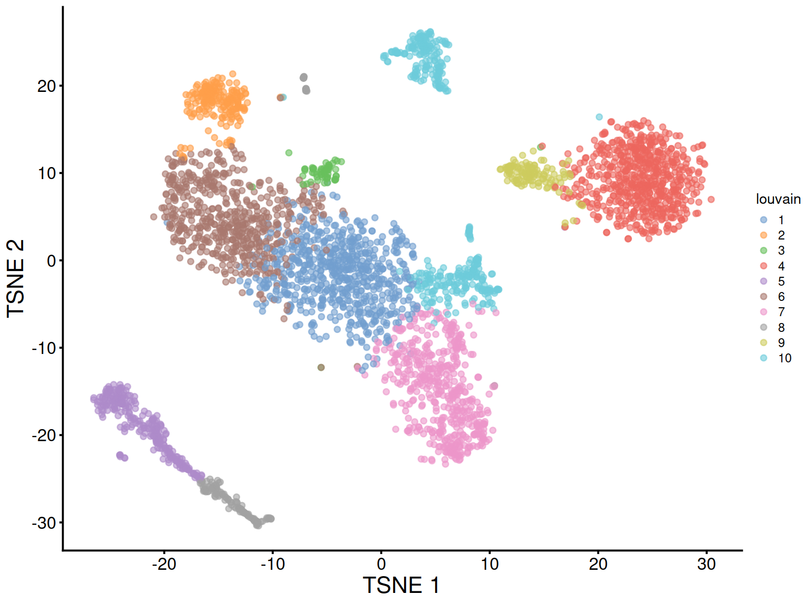

Split by sample type:


```r
# facet by sample group:
p + facet_wrap(~ sce$source_name)
```

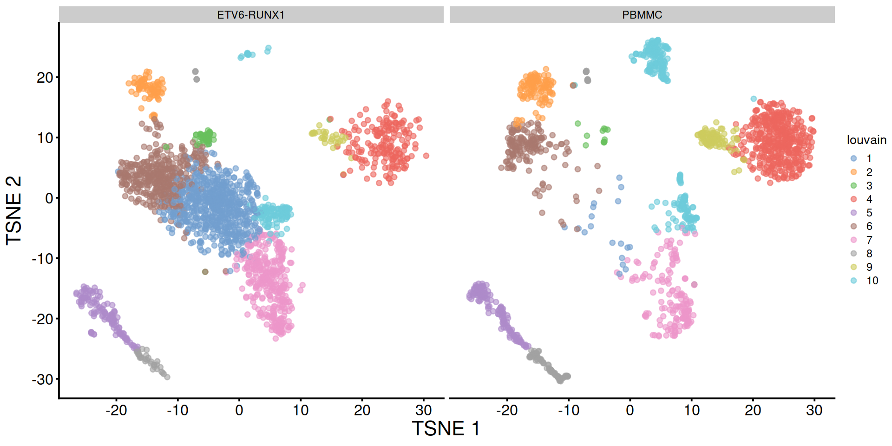

#### Leiden method

<!-- #### Community detection with the 'Leiden' method -->


<!-- (igraph_community_leiden is only for the C lib, not the R package) -->

The Leiden method improves on the Louvain method by garanteeing that at each iteration clusters are connected and well-separated. The method includes an extra step in the iterations: after nodes are moved (step 1), the resulting partition is refined (step2) and only then the new aggregate network made, and refined (step 3). The diagram below is copied from [this article](https://www.nature.com/articles/s41598-019-41695-z#Fig3).

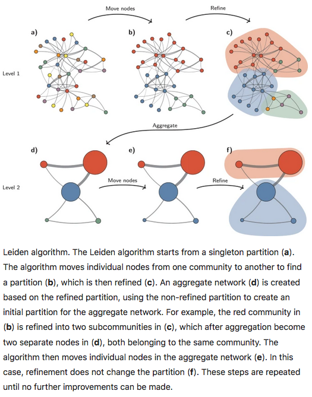

<!-- BIBREF https://www.nature.com/articles/s41598-019-41695-z#Fig3 -->


```r
# have logical to check we can use the required python modules:
leidenOk <- FALSE
# use the reticulate R package to use python modules
library(reticulate)
# set path to python
use_python("/home/baller01/.local/share/r-miniconda/envs/r-reticulate/bin/python")
# check availability of python modules and set logical accordingly
if(reticulate::py_module_available("igraph")
& reticulate::py_module_available("leidenalg"))
{
	leidenOk <- TRUE
}
```

We now apply the Leiden approach, store its outcome in the SCE object and show cluster sizes.


```r
# mind eval above is set to the logical set above
# so that chunk will only run if python modules were found.
library("leiden")
adjacency_matrix <- igraph::as_adjacency_matrix(snn.gr)
partition <- leiden(adjacency_matrix)
# store membership
sce$leiden <- factor(partition)
# show cluster sizes:
table(sce$leiden)
```

```
## 
##   1   2   3   4   5   6   7   8   9 
## 762 611 595 488 401 310 194 117  22
```

The plot below displays the network with nodes (the 1000 randomly chosen cells) color-coded by cluster membership:


```r
## Define a set of colors to use (must be at least as many as the number of
## communities)
##cols <- RColorBrewer::brewer.pal(n = nlevels(sce$cluster), name = "RdYlBu")
##cols <- grDevices:::colorRampPalette(RColorBrewer::brewer.pal(nlevels(sce$cluster), "RdYlBu"))

##V(snn.gr)$Sample.Name <- colData(sce)$Sample.Name
##V(snn.gr)$source_name <- as.character(colData(sce)$source_name)
V(snn.gr)$leiden <- as.character(colData(sce)$leiden)

# once only # edgesToGet <- sample(nrow(snn.gr[]), 1000)

snn.gr.subset <- subgraph(snn.gr, edgesToGet)
g <- snn.gr.subset

#cols <- RColorBrewer::brewer.pal(n = length(unique(V(g)$leiden)), name = "RdYlBu") # 11 max
#cols <- RColorBrewer::brewer.pal(n = length(unique(V(g)$leiden)), name = "Spectral") # 11 max
#names(cols) <- unique(V(g)$leiden)

rgb.palette <- colorRampPalette(c("purple","yellow"), space="rgb") # Seurat-like
#rgb.palette <- colorRampPalette(c("yellow2","goldenrod","darkred"), space="rgb")
##rgb.palette <- colorRampPalette(c("red","orange","blue"), space="rgb")
cols <- rgb.palette(length(unique(V(g)$leiden)))
names(cols) <- as.character(1:length(unique(V(g)$leiden)))

## Plot the graph, color by cluster assignment
igraph::plot.igraph(
  g, layout = tmpLayout,
  vertex.color = cols[V(g)$leiden],
  frame.color = cols[V(g)$leiden],
  vertex.size = 3, vertex.label = NA, main = "Leiden"
)
legend('bottomright',
       legend=names(cols),
       pch=21,
       col=cols, # "#777777",
       pt.bg=cols,
       pt.cex=1, cex=.6, bty="n", ncol=2)
```


The t-SNE plot below shows cells color-coded by cluster membership:


```r
# show clusters on TSNE
p <- plotTSNE(sce, colour_by="leiden") + fontsize
p
```


Split by sample type:


```r
# facet by sample group:
p + facet_wrap(~ sce$source_name)
```

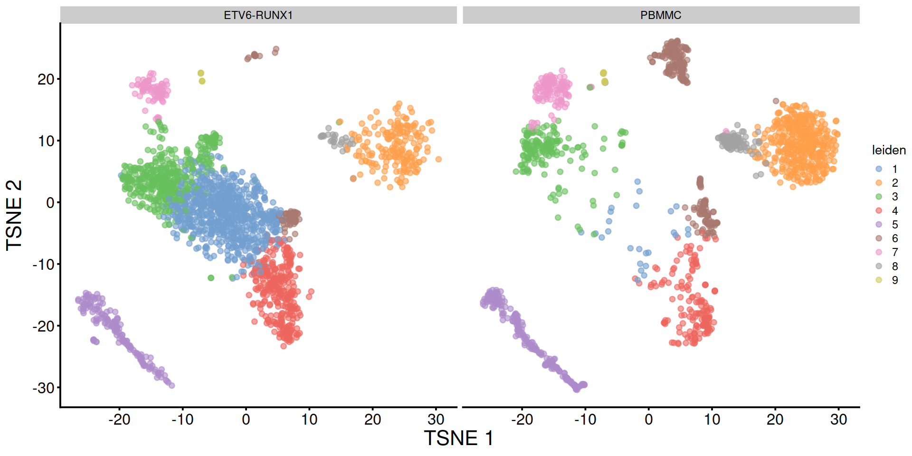

####  Modularity to assess clusters quality

We now compute modularity to assess clusters quality (the division of cells into several groups, 'clusters', is compared to that in an equivalent random network with no structure).

The overall modularity obtained with the Louvain method is 0.72.

Modularity can also be computed for each cluster, with `scran`'s `clusterModularity()` (now in the [bluster package](http://bioconductor.org/packages/devel/bioc/html/bluster.html)). This function returns an upper diagonal matrix with values for each pair of clusters.


```r
# compute cluster-wise modularities,
# with clusterModularity(),
# which returns a matrix keeping values for each pair of clusters
##mod.out <- clusterModularity(snn.gr, wt.clusters, get.weights=TRUE)
mod.out <- bluster::pairwiseModularity(snn.gr,
                                       #wt.clusters,
                                       sce$louvain,
                                       get.weights=TRUE)
# Modularity is proportional to the cluster size,
# so we compute the ratio of the observed to expected weights
# for each cluster pair
ratio <- mod.out$observed/mod.out$expected
lratio <- log10(ratio + 1) # on log scale to improve colour range
```

We display below the cluster-wise modularity on a heatmap. Clusters that are well separated mostly comprise intra-cluster edges and harbour a high modularity score on the diagonal and low scores off that diagonal. Two poorly separated clusters will share edges and the pair will have a high score.  


```r
pheatmap(lratio, cluster_rows=FALSE, cluster_cols=FALSE, 
    color=colorRampPalette(c("white", "blue"))(100))
```

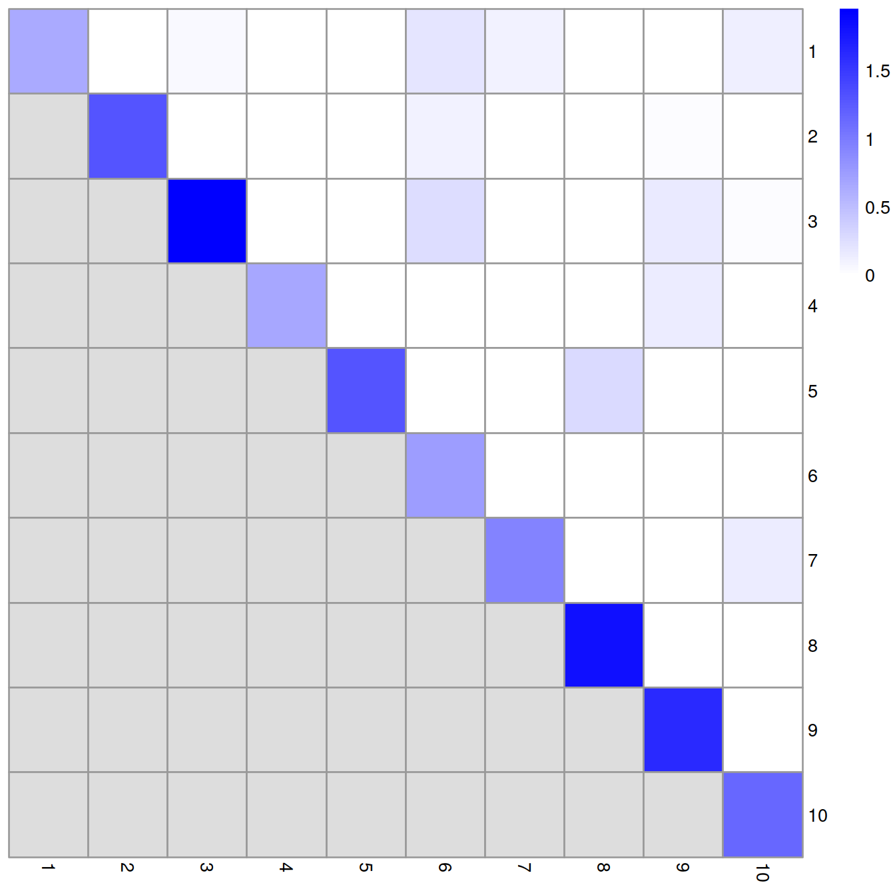

The cluster-wise modularity matrix may also be shown as a network, with clusters as nodes and edges weighted by modularity:


```r
cluster.gr <- igraph::graph_from_adjacency_matrix(
    ratio, 
    mode="undirected",
    weighted=TRUE,
    diag=FALSE)
plot(cluster.gr,
     label.cex = 0.2,
     edge.width = igraph::E(cluster.gr)$weight)
```

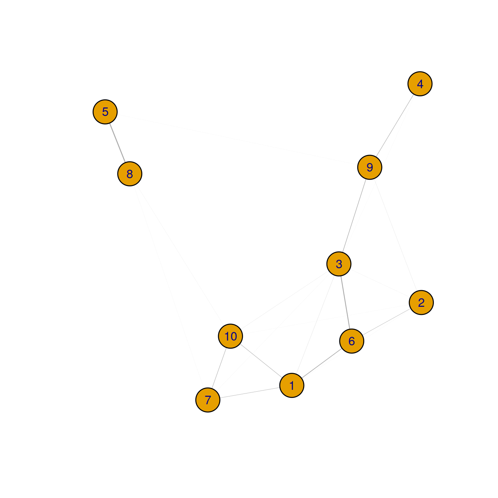

#### Choose the number of clusters

Some community detection methods are hierarchical, e.g. walktrap. With these methods, one can choose the number of clusters.


We can now retrieve a given number of clusters, e.g. 10 here to match the k-means clusters defined above:


```r
# remember cluster.out keeps the walktrap outcome
cluster.out.10 <- igraph::cut_at(cluster.out, no = 10)
cluster.out.10 <- factor(cluster.out.10)
table(cluster.out.10)
```

```
## cluster.out.10
##    1    2    3    4    5    6    7    8    9   10 
##  269  182   96 1497  478   23  629   35  100  191
```

The plot below displays the network with nodes (the 1000 randomly chosen cells) color-coded by cluster membership, split by sample type:


```r
# annotate nodes
V(snn.gr)$walkCutAt10 <- as.character(cluster.out.10)

# subset graph
snn.gr.subset <- subgraph(snn.gr, edgesToGet)
g <- snn.gr.subset

# make colors:
cols <- rgb.palette(length(unique(V(g)$walkCutAt10)))
names(cols) <- as.character(1:length(unique(V(g)$walkCutAt10)))

# Plot the graph, color by cluster assignment
igraph::plot.igraph(
  g, layout = tmpLayout,
  vertex.color = cols[V(g)$walkCutAt10],
  vertex.size = 3, vertex.label = NA, main = "walkCutAt10"
)
legend('bottomright',
      legend=names(cols),
       pch=21,
       col="#777777",
       pt.bg=cols,
       pt.cex=2, cex=.8, bty="n", ncol=2)
```

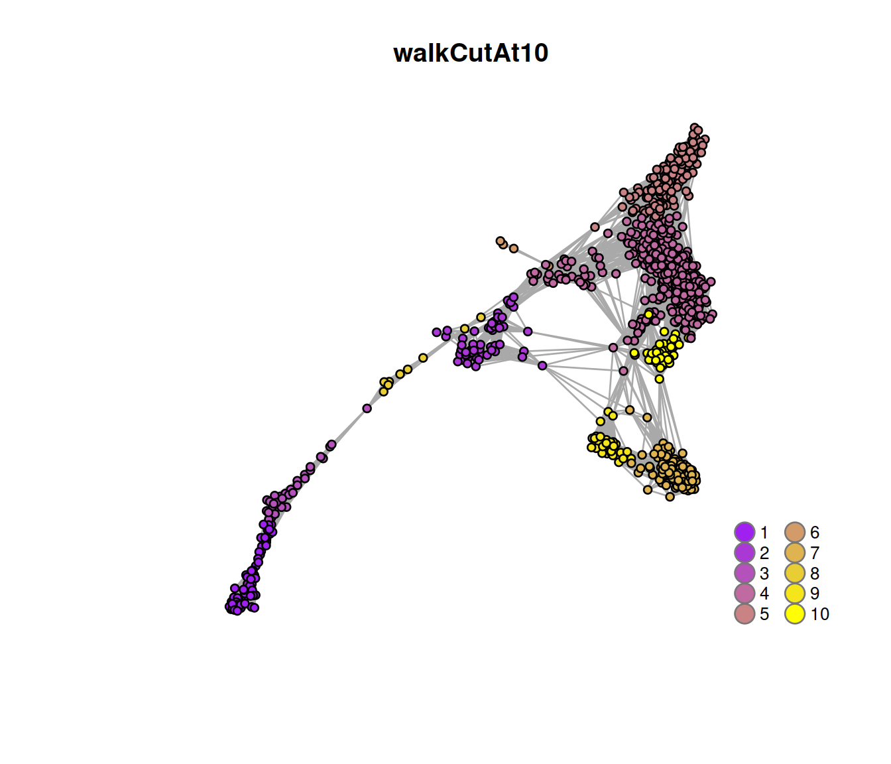

The t-SNE plot below shows cells color-coded by cluster membership split by
sample type:


```r
 # ```{r, out.width = '100%'}
sce$cluster.out.10 <- cluster.out.10
sce$cluster.out.10.col <- cols[cluster.out.10]

# show clusters on TSNE
#p <- plotTSNE(sce, colour_by="cluster.out.10") + fontsize
tSneCoord <- as.data.frame(reducedDim(sce, "TSNE"))
colnames(tSneCoord) <- c("TSNE1", "TSNE2")
# add sample type:
tSneCoord$source_name <- sce$source_name
# add cluster info:
tSneCoord$cluster.out.10.col <- sce$cluster.out.10.col
# draw plot
p2 <- ggplot(tSneCoord, aes(x=TSNE1, y=TSNE2,
			    color=cluster.out.10,
			    shape=source_name)) +
	geom_point()
p2 <- p2 + scale_color_manual(values = cols)
# facet by sample group:
p2 + facet_wrap(~ sce$source_name) +
	  theme(legend.text=element_text(size=rel(0.7)))
```

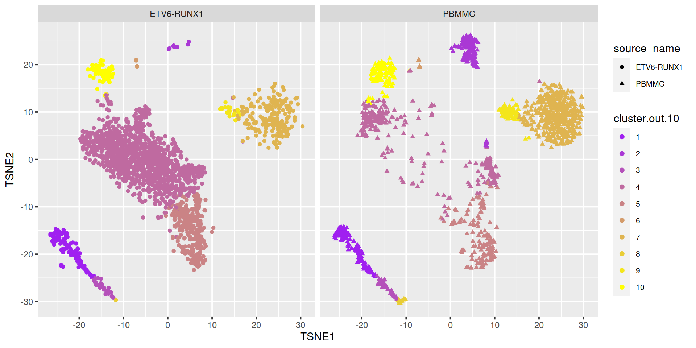

## Comparing two sets of clusters

The contingency table below shows the concordance between the walk-trap (rows) and k-means (columns) clustering methods:


```r
# rows: walktrap
# columns: kmeans
##tmpTab <- table(cluster.out$membership, sce$kmeans10)
tmpTab <- table(sce$cluster.out.10, sce$kmeans10)
tmpTab
```

```
##     
##        1   2   3   4   5   6   7   8   9  10
##   1    0   0   0   0   0   0   0 252  17   0
##   2    0   0   0   1  19   1 161   0   0   0
##   3    0   0   0   0   0   0   0   0  96   0
##   4   14 748   2   5 184  10   0   0   0 534
##   5    0  11   0   0  49 418   0   0   0   0
##   6   19   0   0   0   2   0   0   0   1   1
##   7    0   0 610  19   0   0   0   0   0   0
##   8    0   0   0   0  23   0   0   0  12   0
##   9    0   0   0 100   0   0   0   0   0   0
##   10 191   0   0   0   0   0   0   0   0   0
```

Concordance is moderate, with some clusters defined with one method comprising cells assigned to several clusters defined with the other method.

Concordance can also be displayed on a heatmap:


```r
rownames(tmpTab) = paste("walk", rownames(tmpTab), sep = "_")
colnames(tmpTab) = paste("kmeans10", colnames(tmpTab) , sep = "_")
pheatmap(tmpTab)
```

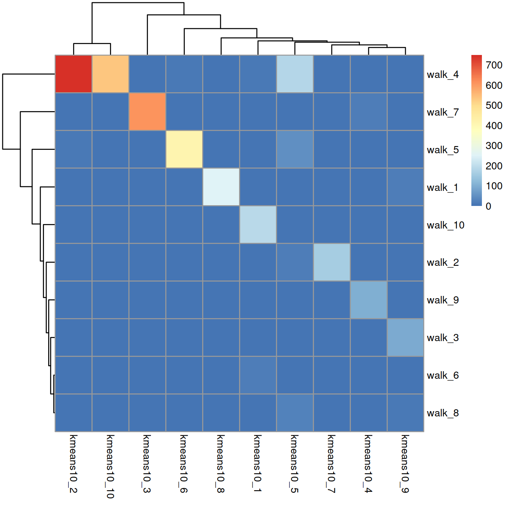

Concordance can also be measured with the adjusted Rand index that ranges between 0 and 1 from random partitions to perfect agreement. Here, the adjusted Rand index is 0.600216.

## Expression of known marker genes

We first show clusters on a t-SNE plot:


```r
cluToUse <- "cluster.out.10"
plotTSNE(sce, colour_by = cluToUse) + ggtitle("walktrap, 10 clusters")
```

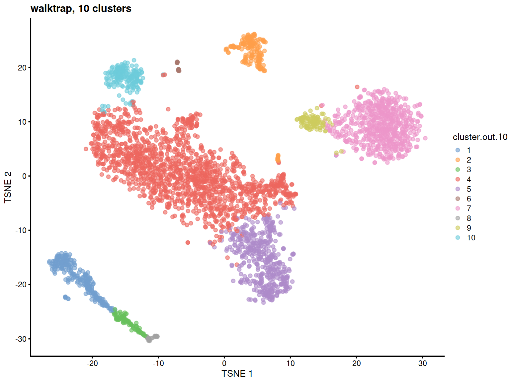

Having identified clusters, we now display the level of expression of cell type marker genes to quickly match clusters with cell types (e.g. MS4A1 for B cell marker gene). For each marker we will plot its expression on a t-SNE, and show distribution across each cluster on a violin plot.

Example with B cell marker genes MS4A1 and CD79A:


```r
rownames(sce) <- scater::uniquifyFeatureNames(
  rowData(sce)$ensembl_gene_id,
  rowData(sce)$Symbol)
p1 <- plotTSNE(sce, by_exprs_values = "reconstructed", colour_by = "MS4A1") +
  ggtitle("B cells: MS4A1")
p2 <- plotTSNE(sce, by_exprs_values = "reconstructed", colour_by = "CD79A") +
  ggtitle("B cells: CD79A")
gridExtra::grid.arrange(p1, p2, ncol=2)
```

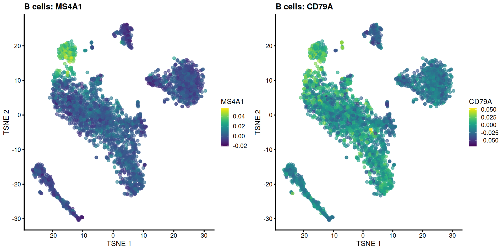

```r
rm(p1, p2)
```


```r
p1 <- plotExpression(sce,
               exprs_values = "reconstructed",
               x=cluToUse,
               colour_by=cluToUse,
               features= "MS4A1") +
  ggtitle("B cells")
p2 <- plotExpression(sce,
               exprs_values = "reconstructed",
               x=cluToUse,
               colour_by=cluToUse,
               features= "CD79A") +
  ggtitle("B cells")
gridExtra::grid.arrange(p1, p2, ncol=2)
```

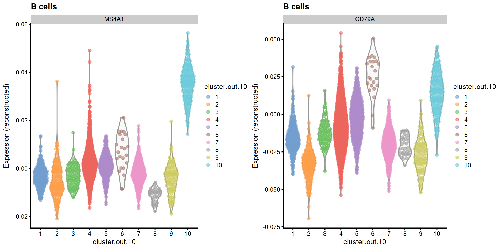

```r
rm(p1, p2)
```

We now show the distribution of expression levels for marker genes of other PBMC types.


```r
#markGenes <- c("IL7R", "CCR7", "S100A4", "CD14", "LYZ", "MS4A1", "CD8A", "FCGR3A", "MS4A7", "GNLY", "NKG7", "FCER1A", "CST3", "PPBP")
markGenesFull <- list(
  "Naive CD4+ T cells"=c("IL7R", "CCR7"),
  "Memory CD4+ T cells"=c("IL7R", "S100A4"),
  "B cells"=c("MS4A1"),
  "CD8+ T cells"=c("CD8A"),
  "NK cells"=c("GNLY", "NKG7"),
  "CD14+ Monocytes"=c("CD14", "LYZ"),
  "FCGR3A+ Monocytes"=c("FCGR3A", "MS4A7"),
  "Dendritic Cells"=c("FCER1A", "CST3"),
  "Platelets"=c("PPBP")
)
markGenesAvail <- lapply(markGenesFull,
                         function(x){
                           x[x %in% rownames(sce)]
                         })
```


```r
plotExpression2 <- function(sce, ctx, markGenesAvail) {
  if(length(markGenesAvail[[ctx]])>0) {
    plotExpression(sce, exprs_values = "reconstructed",
                   x=cluToUse, colour_by=cluToUse,
                   features=markGenesAvail[[ctx]]) + ggtitle(ctx)
  }
}

# Naive CD4+ T
ctx <- "Naive CD4+ T cells"
plotExpression2(sce, ctx, markGenesAvail)
```

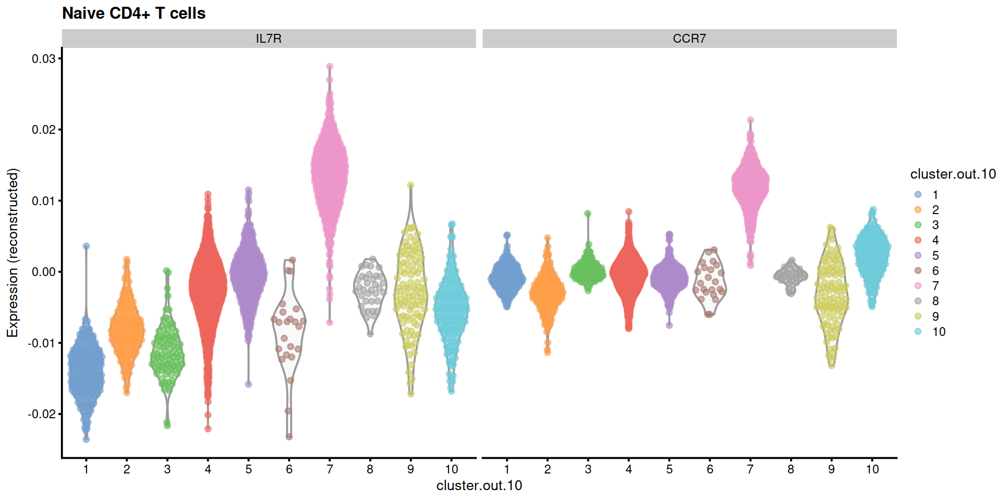

```r
# Memory CD4+
ctx <- "Memory CD4+ T cells"
plotExpression2(sce, ctx, markGenesAvail)
```

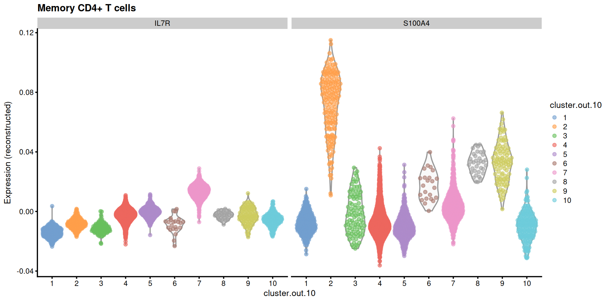

```r
# B cells
##plotExpression(sce, exprs_values = "reconstructed", x=cluToUse, colour_by=cluToUse, features=markGenes[6]) + ggtitle("B cells")
ctx <- "B cells"
plotExpression2(sce, ctx, markGenesAvail)
```

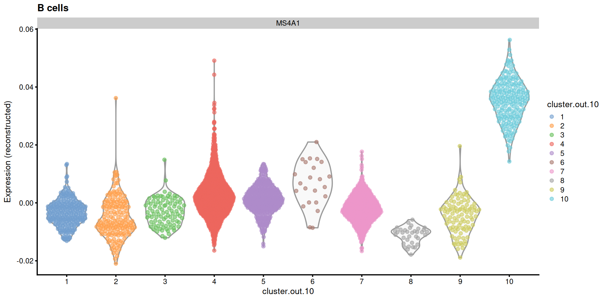

```r
# CD8+ T
ctx <- "CD8+ T cells"
plotExpression2(sce, ctx, markGenesAvail)
```

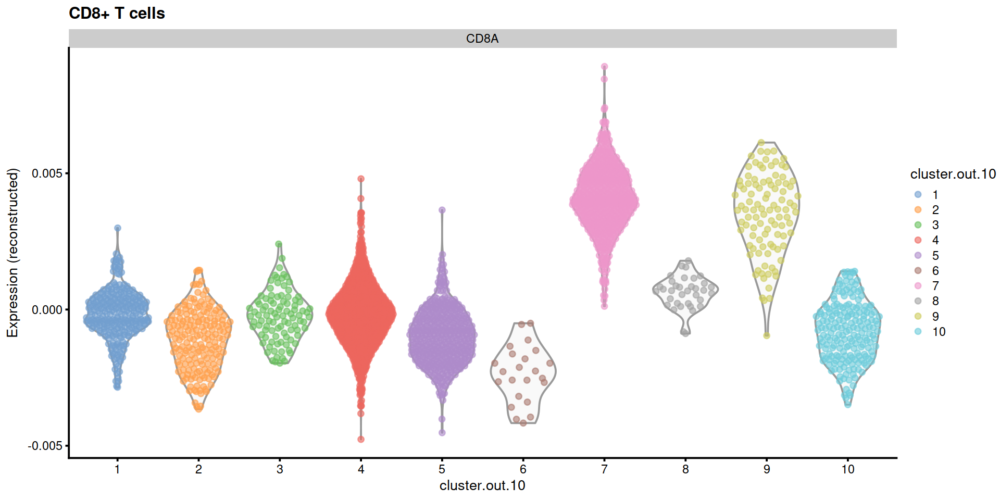

```r
# NK
ctx <- "NK cells"
plotExpression2(sce, ctx, markGenesAvail)
```

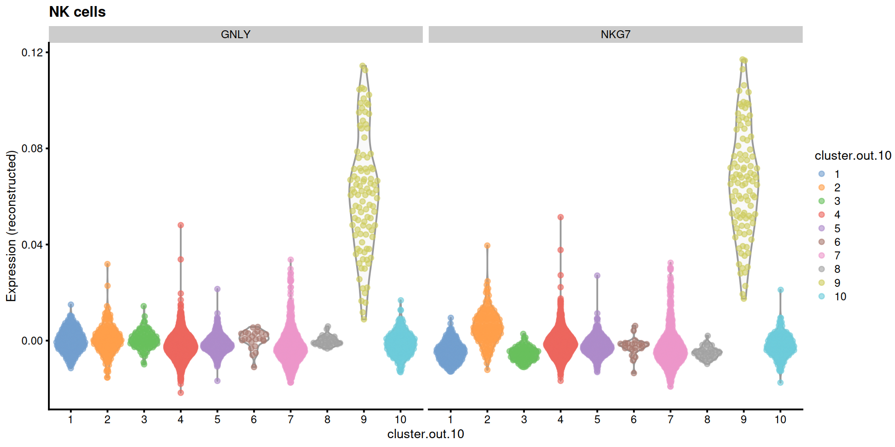

```r
# CD14+ Mono
ctx <- "CD14+ Monocytes"
plotExpression2(sce, ctx, markGenesAvail)
```

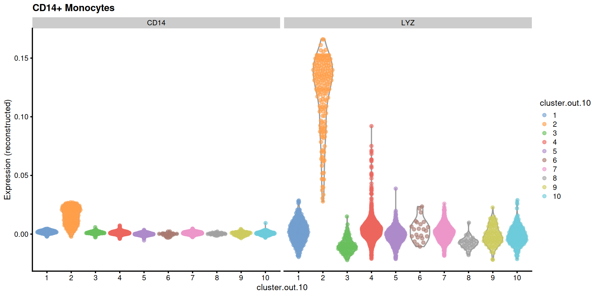

```r
# FCGR3A+ Mono
ctx <- "FCGR3A+ Monocytes"
plotExpression2(sce, ctx, markGenesAvail)
```

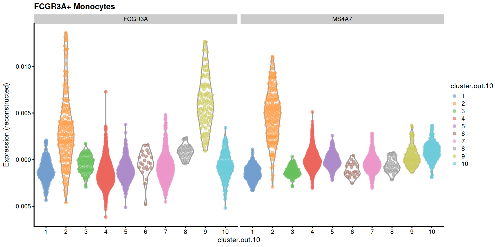

```r
# DC
ctx <- "Dendritic Cells"
plotExpression2(sce, ctx, markGenesAvail)
```

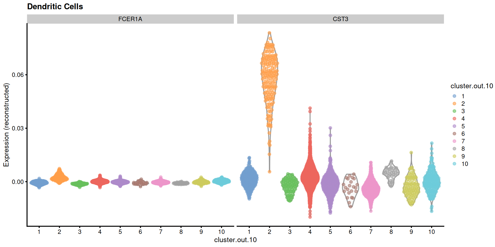

```r
# Platelet
ctx <- "Platelets"
plotExpression2(sce, ctx, markGenesAvail)
```

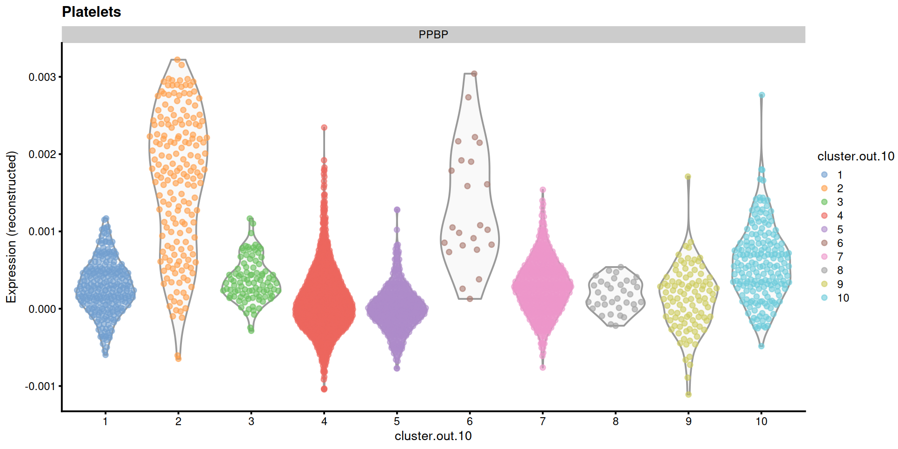

<!-- Add clusters to initial sce (not the output fastMNN) ?TODO? --> 

## Save data

Write SCE object to file.


```r
#tmpFn <- sprintf("%s/%s/Robjects/%s_sce_nz_postDeconv%s%s_%s_clustered.Rds",
tmpFn <- sprintf("%s/%s/Robjects/%s_sce_nz_postDeconv%s%s_%s_clust.Rds",
                 projDir, outDirBit, setName, setSuf, dsiSuf, splSetToGet2)
print(tmpFn)
```

```
## [1] "/ssd/personal/baller01/20200511_FernandesM_ME_crukBiSs2020/AnaWiSce/AnaKmWiC/Robjects/caron_sce_nz_postDeconv_5hCellPerSpl_dsi_PBMMC_ETV6-RUNX1_clust.Rds"
```

```r
saveRDS(sce, file=tmpFn)
```

## Session information


```r
sessionInfo()
```

```
## R version 4.0.3 (2020-10-10)
## Platform: x86_64-pc-linux-gnu (64-bit)
## Running under: CentOS Linux 8
## 
## Matrix products: default
## BLAS:   /opt/R/R-4.0.3/lib64/R/lib/libRblas.so
## LAPACK: /opt/R/R-4.0.3/lib64/R/lib/libRlapack.so
## 
## locale:
##  [1] LC_CTYPE=en_GB.UTF-8       LC_NUMERIC=C              
##  [3] LC_TIME=en_GB.UTF-8        LC_COLLATE=en_GB.UTF-8    
##  [5] LC_MONETARY=en_GB.UTF-8    LC_MESSAGES=en_GB.UTF-8   
##  [7] LC_PAPER=en_GB.UTF-8       LC_NAME=C                 
##  [9] LC_ADDRESS=C               LC_TELEPHONE=C            
## [11] LC_MEASUREMENT=en_GB.UTF-8 LC_IDENTIFICATION=C       
## 
## attached base packages:
## [1] stats4    parallel  stats     graphics  grDevices utils     datasets 
## [8] methods   base     
## 
## other attached packages:
##  [1] pheatmap_1.0.12             reticulate_1.18            
##  [3] NbClust_3.0                 purrr_0.3.4                
##  [5] tidyr_1.1.3                 tibble_3.1.1               
##  [7] broom_0.7.6                 Cairo_1.5-12.2             
##  [9] leiden_0.3.7                igraph_1.2.6               
## [11] cluster_2.1.2               dynamicTreeCut_1.63-1      
## [13] dplyr_1.0.5                 scran_1.18.7               
## [15] scater_1.18.6               SingleCellExperiment_1.12.0
## [17] SummarizedExperiment_1.20.0 Biobase_2.50.0             
## [19] GenomicRanges_1.42.0        GenomeInfoDb_1.26.7        
## [21] IRanges_2.24.1              S4Vectors_0.28.1           
## [23] BiocGenerics_0.36.1         MatrixGenerics_1.2.1       
## [25] matrixStats_0.58.0          ggplot2_3.3.3              
## [27] knitr_1.32                 
## 
## loaded via a namespace (and not attached):
##  [1] bitops_1.0-7              RColorBrewer_1.1-2       
##  [3] backports_1.2.1           tools_4.0.3              
##  [5] bslib_0.2.4               utf8_1.2.1               
##  [7] R6_2.5.0                  irlba_2.3.3              
##  [9] vipor_0.4.5               DBI_1.1.1                
## [11] colorspace_2.0-0          withr_2.4.2              
## [13] tidyselect_1.1.1          gridExtra_2.3            
## [15] compiler_4.0.3            cli_2.4.0                
## [17] BiocNeighbors_1.8.2       DelayedArray_0.16.3      
## [19] labeling_0.4.2            bookdown_0.22            
## [21] sass_0.3.1                scales_1.1.1             
## [23] rappdirs_0.3.3            stringr_1.4.0            
## [25] digest_0.6.27             rmarkdown_2.7            
## [27] XVector_0.30.0            pkgconfig_2.0.3          
## [29] htmltools_0.5.1.1         sparseMatrixStats_1.2.1  
## [31] highr_0.9                 limma_3.46.0             
## [33] rlang_0.4.10              rstudioapi_0.13          
## [35] DelayedMatrixStats_1.12.3 farver_2.1.0             
## [37] jquerylib_0.1.3           generics_0.1.0           
## [39] jsonlite_1.7.2            mclust_5.4.7             
## [41] BiocParallel_1.24.1       RCurl_1.98-1.3           
## [43] magrittr_2.0.1            BiocSingular_1.6.0       
## [45] GenomeInfoDbData_1.2.4    scuttle_1.0.4            
## [47] Matrix_1.3-2              Rcpp_1.0.6               
## [49] ggbeeswarm_0.6.0          munsell_0.5.0            
## [51] fansi_0.4.2               viridis_0.6.0            
## [53] lifecycle_1.0.0           stringi_1.5.3            
## [55] yaml_2.2.1                edgeR_3.32.1             
## [57] zlibbioc_1.36.0           grid_4.0.3               
## [59] dqrng_0.3.0               crayon_1.4.1             
## [61] lattice_0.20-44           cowplot_1.1.1            
## [63] beachmat_2.6.4            locfit_1.5-9.4           
## [65] ps_1.6.0                  pillar_1.6.0             
## [67] codetools_0.2-18          glue_1.4.2               
## [69] evaluate_0.14             vctrs_0.3.7              
## [71] gtable_0.3.0              assertthat_0.2.1         
## [73] xfun_0.22                 rsvd_1.0.5               
## [75] viridisLite_0.4.0         beeswarm_0.3.1           
## [77] bluster_1.0.0             statmod_1.4.35           
## [79] ellipsis_0.3.2
```
