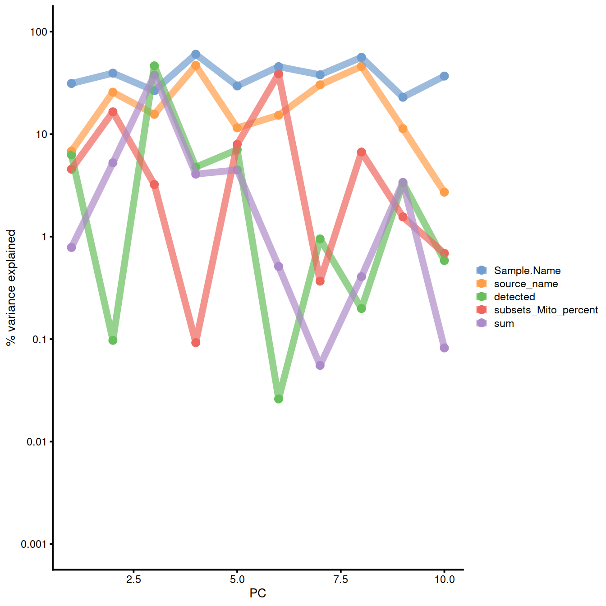
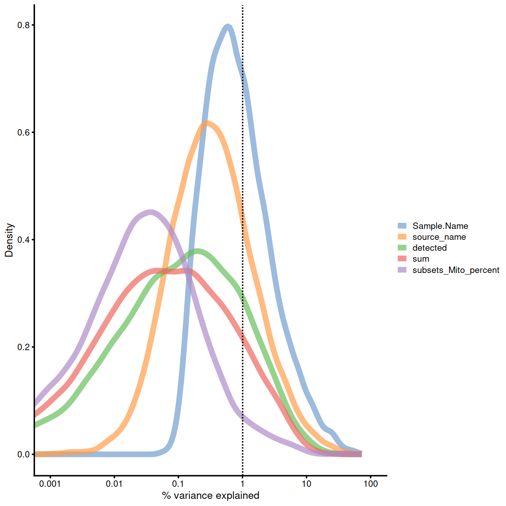

```r
projDir <- params$projDir
dirRel <- params$dirRel
outDirBit <- params$outDirBit
cacheBool <- params$cacheBool
```


```r
library(knitr)
```


---
title: "CRUK CI Summer School 2020 - introduction to single-cell RNA-seq analysis"
subtitle: 'Detection of confounding factors'

author: "Stephane Ballereau, Zeynep Kalender Atak, Katarzyna Kania"
output:
  html_notebook:
    code_folding: hide
    toc: yes
    toc_float: yes
    number_sections: true
  html_document:
    df_print: paged
    toc: yes
    number_sections: true
    code_folding: hide
  html_book:
    code_folding: hide
params:
  projDir: "/ssd/personal/baller01/20200511_FernandesM_ME_crukBiSs2020"
  dirRel: ".."
  inpDirBit: "AnaWiSce/Ana1"
  outDirBit: "AnaWiSce/Ana1"
  bookType: "mk"
  cacheBool: FALSE
---

# Identifying confounding factors - Caron set


```r
knitr::opts_chunk$set(dev="CairoPNG")
```


```r
normPlotDirBit <- "Plots/Norm" # "ConfoundPlots"
#setNameUpp <- "Caron"
#setNameLow <- "caron"
setName <- tolower("Caron")
setSuf <- "_5hCellPerSpl"
typeNorm <- "scran"

projDir <- params$projDir
dirRel <- params$dirRel
outDirBit <- params$outDirBit
```

caron


<!--
Should have Caron and HCA separately
-->

## Load object 


```r
# Read object in:
tmpFn <- sprintf("%s/%s/Robjects/%s_sce_nz_postDeconv%s.Rds",
		 projDir, outDirBit, setName, setSuf)
tmpFn
```

```
## [1] "/ssd/personal/baller01/20200511_FernandesM_ME_crukBiSs2020/AnaWiSce/AnaKmWiC/Robjects/caron_sce_nz_postDeconv_5hCellPerSpl.Rds"
```

```r
#getwd()
#file.exists(tmpFn)
sce <- readRDS(tmpFn)
sce
```

```
## class: SingleCellExperiment 
## dim: 16629 5500 
## metadata(0):
## assays(2): counts logcounts
## rownames(16629): ENSG00000237491 ENSG00000225880 ... ENSG00000275063
##   ENSG00000271254
## rowData names(11): ensembl_gene_id external_gene_name ... detected
##   gene_sparsity
## colnames: NULL
## colData names(16): Barcode Run ... cell_sparsity sizeFactor
## reducedDimNames(0):
## altExpNames(0):
```

## PCA

Remember scran PCA:

Normalised counts are stored in 'logcounts' assay


```r
# 
scranPca <- runPCA(
  sce,
  exprs_values = "logcounts"
)
```

PCA plot for the 'scran' counts in the caron set.


```r
tmpFn <- sprintf("%s/%s/%s/%s_sce_nz_postQc%s_%sPca.png",
		 #projDir, outDirBit, normPlotDirBit, setName, setSuf, typeNorm)
		 dirRel, normPlotDirBit, setName, setSuf, typeNorm)
tmpFn
knitr::include_graphics(tmpFn, auto_pdf = TRUE)
```


```r
#options(BiocSingularParam.default=IrlbaParam())
options(BiocSingularParam.default=ExactParam())

qclust <- quickCluster(sce, min.size = 30, use.ranks = FALSE)
sce <- computeSumFactors(sce, sizes = 15, clusters = qclust)
sce <- logNormCounts(sce)
```

Perform PCA:


```r
reducedDim(sce, "PCA") <- reducedDim(
  runPCA(sce, exprs_values = "logcounts", ncomponents = 10), "PCA")

plotPCA(
    sce,
    colour_by = "Sample.Name",
    size_by = "sum",
    shape_by = "source_name"
)
```


<!--
## Raw counts
-->

<!--
Correlation with PCs: logcounts_raw:
-->


```r
assay(sce, "logcounts_raw") <- log2(counts(sce)+1)
```


```r
# on norm count https://biocellgen-public.svi.edu.au/mig_2019_scrnaseq-workshop/public/normalization-confounders-and-batch-correction.html#identifying-confounding-factors
# on logcounts_raw https://scrnaseq-course.cog.sanger.ac.uk/website/cleaning-the-expression-matrix.html#correlations-with-pcs
# a bit long

# issue with scale, trying with explanPc/100
# see next chunk too

explanPc <- getExplanatoryPCs(
    sce,
    exprs_values = "logcounts_raw",
    variables = c(
        "sum",
	"detected",
        "source_name",
        "Sample.Name",
	"subsets_Mito_percent"
    )
)
plotExplanatoryPCs(explanPc/100) 
```

<!--
Explanatory variables: logcounts_raw:
-->


```r
# on logcounts_raw
# https://biocellgen-public.svi.edu.au/mig_2019_scrnaseq-workshop/public/normalization-confounders-and-batch-correction.html#identifying-confounding-factors

plotExplanatoryVariables(
    sce,
    exprs_values = "logcounts_raw",
    #exprs_values = "counts",
    #exprs_values = "logcounts",
    variables = c(
        "sum",
	"detected",
        "source_name",
        "Sample.Name",
	"subsets_Mito_percent"
    )
)
```

## Normalised counts

Correlation with PCs: logcounts (normalised):


```r
# on norm count https://biocellgen-public.svi.edu.au/mig_2019_scrnaseq-workshop/public/normalization-confounders-and-batch-correction.html#identifying-confounding-factors
# on logcounts_raw https://scrnaseq-course.cog.sanger.ac.uk/website/cleaning-the-expression-matrix.html#correlations-with-pcs
# a bit long
colData(sce)$source_name <- factor(colData(sce)$source_name)
explanPc <- getExplanatoryPCs(sce,
    #exprs_values = "logcounts", # default
    variables = c(
        "sum",
        "detected",
        "source_name",
        "Sample.Name",
        "subsets_Mito_percent"
    )
)
plotExplanatoryPCs(explanPc/100) 
```



Explanatory variables: logcounts (normalised):


```r
# on logcounts_raw
# https://biocellgen-public.svi.edu.au/mig_2019_scrnaseq-workshop/public/normalization-confounders-and-batch-correction.html#identifying-confounding-factors

plotExplanatoryVariables(
    sce,
    # exprs_values = "logcounts", # default
    variables = c(
        "sum",
        "detected",
        "source_name",
        "Sample.Name",
        "subsets_Mito_percent"
    )
)
```




```r
rm(sce)
```

## Session information


```r
sessionInfo()
```

```
## R version 4.0.3 (2020-10-10)
## Platform: x86_64-pc-linux-gnu (64-bit)
## Running under: CentOS Linux 8
## 
## Matrix products: default
## BLAS:   /opt/R/R-4.0.3/lib64/R/lib/libRblas.so
## LAPACK: /opt/R/R-4.0.3/lib64/R/lib/libRlapack.so
## 
## locale:
##  [1] LC_CTYPE=en_GB.UTF-8       LC_NUMERIC=C              
##  [3] LC_TIME=en_GB.UTF-8        LC_COLLATE=en_GB.UTF-8    
##  [5] LC_MONETARY=en_GB.UTF-8    LC_MESSAGES=en_GB.UTF-8   
##  [7] LC_PAPER=en_GB.UTF-8       LC_NAME=C                 
##  [9] LC_ADDRESS=C               LC_TELEPHONE=C            
## [11] LC_MEASUREMENT=en_GB.UTF-8 LC_IDENTIFICATION=C       
## 
## attached base packages:
## [1] parallel  stats4    stats     graphics  grDevices utils     datasets 
## [8] methods   base     
## 
## other attached packages:
##  [1] Cairo_1.5-12.2              BiocSingular_1.6.0         
##  [3] dplyr_1.0.5                 scran_1.18.7               
##  [5] scater_1.18.6               ggplot2_3.3.3              
##  [7] SingleCellExperiment_1.12.0 SummarizedExperiment_1.20.0
##  [9] Biobase_2.50.0              GenomicRanges_1.42.0       
## [11] GenomeInfoDb_1.26.7         IRanges_2.24.1             
## [13] S4Vectors_0.28.1            BiocGenerics_0.36.1        
## [15] MatrixGenerics_1.2.1        matrixStats_0.58.0         
## [17] knitr_1.32                 
## 
## loaded via a namespace (and not attached):
##  [1] viridis_0.6.0             edgeR_3.32.1             
##  [3] sass_0.3.1                jsonlite_1.7.2           
##  [5] viridisLite_0.4.0         DelayedMatrixStats_1.12.3
##  [7] scuttle_1.0.4             bslib_0.2.4              
##  [9] assertthat_0.2.1          statmod_1.4.35           
## [11] highr_0.9                 dqrng_0.3.0              
## [13] GenomeInfoDbData_1.2.4    vipor_0.4.5              
## [15] yaml_2.2.1                pillar_1.6.0             
## [17] lattice_0.20-44           limma_3.46.0             
## [19] glue_1.4.2                beachmat_2.6.4           
## [21] digest_0.6.27             XVector_0.30.0           
## [23] colorspace_2.0-0          cowplot_1.1.1            
## [25] htmltools_0.5.1.1         Matrix_1.3-2             
## [27] pkgconfig_2.0.3           bookdown_0.22            
## [29] zlibbioc_1.36.0           purrr_0.3.4              
## [31] scales_1.1.1              BiocParallel_1.24.1      
## [33] tibble_3.1.1              farver_2.1.0             
## [35] generics_0.1.0            ellipsis_0.3.2           
## [37] withr_2.4.2               magrittr_2.0.1           
## [39] crayon_1.4.1              evaluate_0.14            
## [41] fansi_0.4.2               bluster_1.0.0            
## [43] beeswarm_0.3.1            tools_4.0.3              
## [45] lifecycle_1.0.0           stringr_1.4.0            
## [47] locfit_1.5-9.4            munsell_0.5.0            
## [49] DelayedArray_0.16.3       irlba_2.3.3              
## [51] compiler_4.0.3            jquerylib_0.1.3          
## [53] rsvd_1.0.5                rlang_0.4.10             
## [55] grid_4.0.3                RCurl_1.98-1.3           
## [57] BiocNeighbors_1.8.2       igraph_1.2.6             
## [59] labeling_0.4.2            bitops_1.0-7             
## [61] rmarkdown_2.7             codetools_0.2-18         
## [63] gtable_0.3.0              DBI_1.1.1                
## [65] R6_2.5.0                  gridExtra_2.3            
## [67] utf8_1.2.1                stringi_1.5.3            
## [69] ggbeeswarm_0.6.0          Rcpp_1.0.6               
## [71] vctrs_0.3.7               tidyselect_1.1.1         
## [73] xfun_0.22                 sparseMatrixStats_1.2.1
```

