```r
#qcPlotDirBit <- "NormPlots"
#setNameUpp <- "Caron"
projDir <- params$projDir
dirRel <- params$dirRel
outDirBit <- params$outDirBit
cacheBool <- params$cacheBool
```


```r
library(knitr)
```


```r
isChild <- "yes" # TRUE
src <- lapply(c("_5hCellPerSpl"),
	      function(setSuf, isChild) {
		      knit_expand(file = "dataSetIntegration_PBMMC_ETV6-RUNX1.Rmd")
	      })
```


---
title: "CRUK CI Summer School 2020 - introduction to single-cell RNA-seq analysis"
subtitle: 'Data integration'
author: "Stephane Ballereau"
output:
  html_notebook:
    code_folding: hide
    toc: yes
    toc_float: yes
    number_sections: true
  html_document:
    df_print: paged
    toc: yes
    number_sections: true
    code_folding: hide
  html_book:
    code_folding: hide
params:
  projDir: "/ssd/personal/baller01/20200511_FernandesM_ME_crukBiSs2020"
  dirRel: ".."
  inpDirBit: "AnaWiSce/Ana1"
  outDirBit: "AnaWiSce/Ana1"
  bookType: "mk"
  cacheBool: FALSE  
  setName: "caron"
  setSuf: "_5hCellPerSpl"
  splSetToGet: "PBMMC,ETV6-RUNX1"
---

<!--
  setSuf: "_allCells"
-->


```r
# need string for analysis name to use in header identifier
setSuf <- params$setSuf
if(params$bookType == "mk") {setSuf <- "_5hCellPerSpl"}
if(exists("isChild")) { setSuf <- "_5hCellPerSpl" }
anaStg <- gsub("_", "-", setSuf)
```

# Data integration - PBMMC and ETV6-RUNX {#dsi-5hCellPerSpl-PBMMC-ETV6-RUNX1Top}


```r
projDir <- params$projDir
dirRel <- params$dirRel
outDirBit <- params$outDirBit
cacheBool <- params$cacheBool
splSetToGet <- params$splSetToGet
setName <- params$setName
setSuf <- params$setSuf
if(exists("isChild")) { setSuf <- "_5hCellPerSpl" }
if(params$bookType == "mk"){
	splSetToGet <- "PBMMC,ETV6-RUNX1"
	setName <- "caron"
	setSuf <- "_5hCellPerSpl"
}
splSetVec <- unlist(strsplit(splSetToGet, ",")) # params may not be read in if knitting book.
splSetToGet2 <- gsub(",", "_", splSetToGet)
nbPcToComp <- 50
figSize <- 7
```


Source: ['Integrating Datasets'](https://osca.bioconductor.org/integrating-datasets.html) chapter in the OSCA book. Its text is reproduced below with few modifications to adapt it to the data set under scrutiny here.

## Abbreviations
 
* HVG: highly variable genes
* MNN: mutual nearest neighbors
* PBMMC: peripheral blood mononuclear cell
* SCE: SingleCellExperiment

## Motivation

Large single-cell RNA sequencing (scRNA-seq) projects usually need to generate data across multiple batches due to logistical constraints. However, the processing of different batches is often subject to uncontrollable differences, e.g., changes in operator, differences in reagent quality. This results in systematic differences in the observed expression in cells from different batches, which we refer to as “batch effects”. Batch effects are problematic as they can be major drivers of heterogeneity in the data, masking the relevant biological differences and complicating interpretation of the results.

Computational correction of these effects is critical for eliminating batch-to-batch variation, allowing data across multiple batches to be combined for common downstream analysis. However, existing methods based on linear models (Ritchie et al. 2015; Leek et al. 2012) assume that the composition of cell populations are either known or the same across batches. To overcome these limitations, bespoke methods have been developed for batch correction of single-cell data (Haghverdi et al. 2018; Butler et al. 2018; Lin et al. 2019) that do not require a priori knowledge about the composition of the population. This allows them to be used in workflows for exploratory analyses of scRNA-seq data where such knowledge is usually unavailable.

## Load the data

We will load the R file keeping the SCE object with the normalised counts.

<!-- and subset 1000 cells per sample. -->


```r
##setName <- "caron"
#setSuf <- ""
##setSuf <- "_allCells"
tmpFn <- sprintf("%s/%s/Robjects/%s_sce_nz_postDeconv%s.Rds",
                 projDir, outDirBit, setName, setSuf)
print(tmpFn)
```

```
## [1] "/ssd/personal/baller01/20200511_FernandesM_ME_crukBiSs2020/AnaWiSce/AnaKmWiC/Robjects/caron_sce_nz_postDeconv_5hCellPerSpl.Rds"
```

```r
if(!file.exists(tmpFn))
{
	knitr::knit_exit()
}
sce <- readRDS(tmpFn)
sce
```

```
## class: SingleCellExperiment 
## dim: 16629 5500 
## metadata(0):
## assays(2): counts logcounts
## rownames(16629): ENSG00000237491 ENSG00000225880 ... ENSG00000275063
##   ENSG00000271254
## rowData names(11): ensembl_gene_id external_gene_name ... detected
##   gene_sparsity
## colnames: NULL
## colData names(16): Barcode Run ... cell_sparsity sizeFactor
## reducedDimNames(0):
## altExpNames(0):
```

```r
colnames(rowData(sce))[colnames(rowData(sce)) == "strand"] <- "strandNum"
```

<!-- TODO see renameSamples_dsi -->

We next subset the data for the PBMMC,ETV6-RUNX1 sample group:


```r
# CaronBourque2020
cb_sampleSheetFn <- file.path(projDir, "Data/CaronBourque2020/SraRunTable.txt")
cb_sampleSheet <- read.table(cb_sampleSheetFn, header=T, sep=",")
#splVec <- cb_sampleSheet %>% filter(source_name == splSetToGet) %>%
splVec <- cb_sampleSheet %>% filter(source_name %in% splSetVec) %>%
	pull(Sample.Name) %>% unique

sourceNames <- unique(colData(sce)$source_name)
sceOrig <- sce
sce <- sceOrig[,sce$source_name %in% splSetVec ]
nbCells <- 1000
#nbCells <- 3000
all.sce <- list()

# if '_allCells', then downsample for faster run
# else (ie _5hCellPerSpl so far), do not downsample.
if(setSuf == "_allCells")
{
  for(spx in splVec)
  {
    #nbCellsToGet <- min(ncol(sce), nbCells) # DEV only, faster with fewer cells.
  	vec.bc <- colData(sce) %>%
  		data.frame() %>%
  		filter(Sample.Name == spx) %>%
  		###slice_sample(n=nbCellsToGet) %>%
  		pull(Barcode)
  	tmpInd <- which(colData(sce)$Barcode %in% vec.bc)
	
  	all.sce[[spx]] <- sce[,tmpInd]
  }
} else {
  for(spx in splVec)
  {
  	vec.bc <- colData(sce) %>%
  		data.frame() %>%
  		filter(Sample.Name == spx) %>%
  		pull(Barcode)
  	tmpInd <- which(colData(sce)$Barcode %in% vec.bc)
	
  	all.sce[[spx]] <- sce[,tmpInd]
  }
}  
nbSpl <- length(all.sce)
```

We then apply the standard workflow to each sample separately:

* normalisation,
* variance modelling
* dimensionality reduction
* clustering


```r
#--- normalization ---#
# use logNormCounts()
all.sce <- lapply(all.sce, logNormCounts)

#--- variance-modelling ---#
# model varaince with modelGeneVar()
# find highly variable genes (HVGs) with getTopHVGs()
all.dec <- lapply(all.sce, modelGeneVar)
all.hvgs <- lapply(all.dec, getTopHVGs, prop=0.1)

#--- dimensionality-reduction ---#
# use runPCA()
# then compute embeddings with runTSNE() and runUMAP()
library(BiocSingular)
set.seed(10000)
all.sce <- mapply(FUN=runPCA, x=all.sce, subset_row=all.hvgs,
    MoreArgs=list(ncomponents=25, BSPARAM=RandomParam()),
    SIMPLIFY=FALSE)

set.seed(100000)
all.sce <- lapply(all.sce, runTSNE, dimred="PCA")

set.seed(1000000)
all.sce <- lapply(all.sce, runUMAP, dimred="PCA")

#--- clustering ---#
# cluster each sample separately
for (n in names(all.sce)) {
    g <- buildSNNGraph(all.sce[[n]], k=10, use.dimred='PCA')
    clust <- igraph::cluster_walktrap(g)$membership
    #colLabels(all.sce[[n]])  <- factor(clust)
    all.sce[[n]]$label  <- factor(clust)
}
```

To prepare for the batch correction:

* We subset all batches to the common “universe” of features. In this case, it is straightforward as both batches use Ensembl gene annotation.


```r
allNames <- unlist(lapply(all.sce, function(x){rownames(x)}))
allNamesNb <- table(allNames)
universe <- names(allNamesNb)[allNamesNb==nbSpl]
#length(universe)
```

* The size of this common “universe” of features here is the number of features shared by all 7 samples is: 16629.


```r
# Subsetting the SingleCellExperiment object.
uni.sce <- lapply(all.sce, function(x){x[universe,]})
# Also subsetting the variance modelling results, for convenience.
uni.dec <- lapply(all.dec, function(x){x[universe,]})
```

* We rescale each batch to adjust for differences in sequencing depth between batches. The multiBatchNorm() function recomputes log-normalized expression values after adjusting the size factors for systematic differences in coverage between SingleCellExperiment (SCE) objects. (Size factors only remove biases between cells within a single batch.) This improves the quality of the correction by removing one aspect of the technical differences between batches.


```r
# rescale each batch to adjust for differences in sequencing depth between batches
rescaled <- multiBatchNorm(uni.sce, batch = "Sample.Name")
```

* We perform feature selection by averaging the variance components across all batches with the combineVar() function. We compute the average as it is responsive to batch-specific HVGs while still preserving the within-batch ranking of genes.


```r
# compute average variance components across samples
#combined.dec <- combineVar(uni.dec[[1]], uni.dec[[2]], uni.dec[[3]], uni.dec[[4]])
combined.dec <- combineVar(uni.dec)
# identify highly variables genes
# here as those with a positive biological component
chosen.hvgs <- combined.dec$bio > 0
#sum(chosen.hvgs)
```

Number of HVGs: 7930.

When integrating datasets of variable composition, it is generally safer to err on the side of including more genes than are used in a single dataset analysis, to ensure that markers are retained for any dataset-specific subpopulations that might be present. For a top X selection, this means using a larger X (say, ~5000), or in this case, we simply take all genes above the trend.

Alternatively, a more forceful approach to feature selection can be used based on marker genes from within-batch comparisons.

## Diagnosing batch effects

Before we actually perform any correction, it is worth examining whether there is any batch effect in this dataset. We combine the SCE objects and perform a PCA on the log-expression values for all genes with positive (average) biological components.


```r
# Synchronizing the metadata for cbind()ing.
for (i in 2:nbSpl)
{
  identical(rowData(rescaled[[1]]), rowData(rescaled[[i]]))
}

rescaled[[1]]$batch <- rescaled[[1]]$Sample.Name
rescaled2 <- lapply(rescaled, function(x){x$batch <- x$Sample.Name; x})
rescaled <- rescaled2

# concat matrices:
uncorrected <- do.call(cbind, rescaled)

# Perform PCA
# Using RandomParam() as it is more efficient for file-backed matrices.
set.seed(0010101010)
uncorrected <- runPCA(uncorrected,
                      subset_row=chosen.hvgs,
                      BSPARAM=BiocSingular::RandomParam())
```

We use graph-based clustering on the components to obtain a summary of the population structure.

As the samples should be replicates, each cluster should ideally consist of cells from each batch. However, we instead see clusters that are comprised of cells from a single batch. This indicates that cells of the same type are artificially separated due to technical differences between batches.


```r
# build shared nearest-neighbour graph
snn.gr <- buildSNNGraph(uncorrected, use.dimred="PCA")
# identify cluster with the walk trap method
clusters <- igraph::cluster_walktrap(snn.gr)$membership
# get number of cells for each {cluster, batch} pair
#tab <- table(Cluster=clusters, Batch=uncorrected$batch)
#tab
tmpMat <- data.frame("clusters"=clusters, "batch"=uncorrected$batch)
```

Cluster size and cell contribution by sample:


```r
tmpMatTab <- table(tmpMat)
sortVecNames <- tmpMatTab %>% rowSums %>% sort(decreasing=TRUE) %>% names
tmpMat$clusters <- factor(tmpMat$clusters, levels=sortVecNames)
tmpMatDf <- tmpMatTab[sortVecNames,] %>% data.frame()
p1 <- ggplot(data=tmpMatDf, aes(x=clusters,y=Freq, fill=batch)) +
	geom_col() +
	theme(axis.text.x=element_text(angle = 90, hjust = 0)) +
  ggtitle("uncorrected, cell numbers") +
  theme(legend.text = element_text(size = 7))
p2 <- ggplot(data=tmpMat, aes(x=clusters, fill=batch)) +
  geom_bar(position = "fill") +
  scale_y_continuous(labels = scales::percent) +
	theme(axis.text.x=element_text(angle = 90, hjust = 0)) +
  ggtitle("uncorrected, proportions") +
  theme(legend.text = element_text(size = 7))
gridExtra::grid.arrange(p1, p2)
```

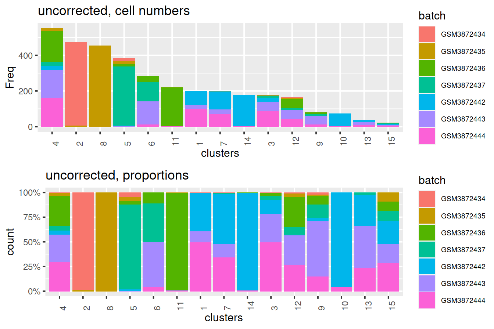

We can also visualize the uncorrected coordinates using a t-SNE plot. The strong separation between cells from different batches is consistent with the clustering results.


```r
set.seed(1111001)
uncorrected <- runTSNE(uncorrected, dimred="PCA")
# draw:
p <- plotTSNE(uncorrected,
	      colour_by="batch",
	      shape_by="source_name") +
theme(legend.text = element_text(size = 7))
```


```r
p
```

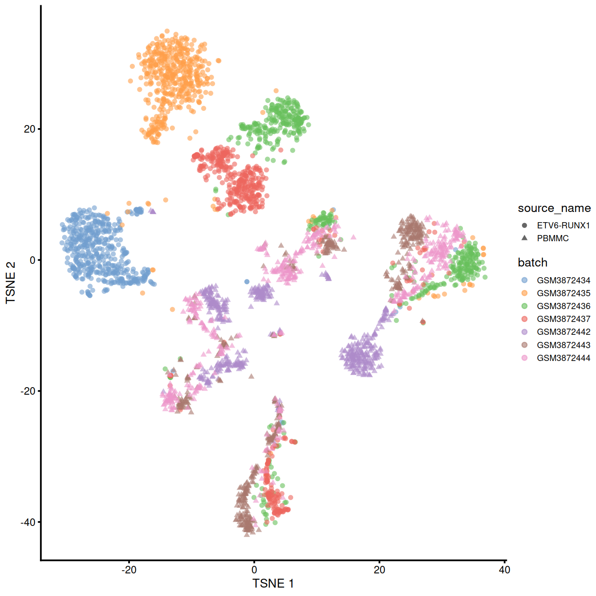


```r
p + facet_wrap(~uncorrected$source_name)
```

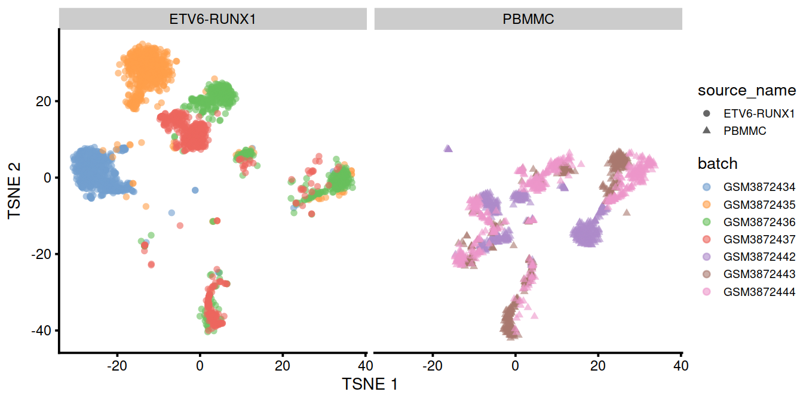

Of course, the other explanation for batch-specific clusters is that there are cell types that are unique to each batch. The degree of intermingling of cells from different batches is not an effective diagnostic when the batches involved might actually contain unique cell subpopulations. If a cluster only contains cells from a single batch, one can always debate whether that is caused by a failure of the correction method or if there is truly a batch-specific subpopulation. For example, do batch-specific metabolic or differentiation states represent distinct subpopulations? Or should they be merged together? We will not attempt to answer this here, only noting that each batch correction algorithm will make different (and possibly inappropriate) decisions on what constitutes “shared” and “unique” populations.

Let us write the corresponding SCE object.


```r
splSetToGet2 <- gsub(",", "_", splSetToGet)
# save object?
fn <- sprintf("%s/%s/Robjects/%s_sce_nz_postDeconv%s_dsi_%s_uncorr.Rds",
              projDir,
              outDirBit,
              setName,
              setSuf,
              splSetToGet2) # 'dsi' for data set integration
saveRDS(uncorrected, file=fn)
```

## Linear regression

Batch effects in bulk RNA sequencing studies are commonly removed with linear regression. This involves fitting a linear model to each gene’s expression profile, setting the undesirable batch term to zero and recomputing the observations sans the batch effect, yielding a set of corrected expression values for downstream analyses. Linear modelling is the basis of the `removeBatchEffect()` function from the limma package (Ritchie et al. 2015) as well the `comBat()` function from the sva package (Leek et al. 2012).

To use this approach in a scRNA-seq context, we assume that the composition of cell subpopulations is the same across batches. We also assume that the batch effect is additive, i.e., any batch-induced fold-change in expression is the same across different cell subpopulations for any given gene. These are strong assumptions as batches derived from different individuals will naturally exhibit variation in cell type abundances and expression. Nonetheless, they may be acceptable when dealing with batches that are technical replicates generated from the same population of cells. (In fact, when its assumptions hold, linear regression is the most statistically efficient as it uses information from all cells to compute the common batch vector.) Linear modelling can also accommodate situations where the composition is known a priori by including the cell type as a factor in the linear model, but this situation is even less common.

We use the `rescaleBatches()` function from the `batchelor` package to remove the batch effect. This is roughly equivalent to applying a linear regression to the log-expression values per gene, with some adjustments to improve performance and efficiency. For each gene, the mean expression in each batch is scaled down until it is equal to the lowest mean across all batches. We deliberately choose to scale all expression values down as this mitigates differences in variance when batches lie at different positions on the mean-variance trend. (Specifically, the shrinkage effect of the pseudo-count is greater for smaller counts, suppressing any differences in variance across batches.) An additional feature of `rescaleBatches()` is that it will preserve sparsity in the input matrix for greater efficiency, whereas other methods like `removeBatchEffect()` will always return a dense matrix.


```r
rescaled2 <- rescaleBatches(rescaled)
rescaled2
```

```
## class: SingleCellExperiment 
## dim: 16629 3500 
## metadata(0):
## assays(1): corrected
## rownames(16629): ENSG00000000003 ENSG00000000419 ... ENSG00000285486
##   ENSG00000285492
## rowData names(0):
## colnames: NULL
## colData names(1): batch
## reducedDimNames(0):
## altExpNames(0):
```

After clustering, we observe that most clusters consist of mixtures of cells from the two replicate batches, consistent with the removal of the batch effect. This conclusion is supported by the apparent mixing of cells from different batches in Figure 13.2. However, at least one batch-specific cluster is still present, indicating that the correction is not entirely complete. This is attributable to violation of one of the aforementioned assumptions, even in this simple case involving replicated batches.


```r
set.seed(1010101010) # To ensure reproducibility of IRLBA.
rescaled2 <- runPCA(rescaled2, subset_row=chosen.hvgs, exprs_values="corrected")

snn.gr <- buildSNNGraph(rescaled2, use.dimred="PCA")
clusters.resc <- igraph::cluster_walktrap(snn.gr)$membership
##tab.resc <- table(Cluster=clusters.resc, Batch=rescaled2$batch)
##tab.resc
tmpMat <- data.frame("clusters"=clusters.resc, "batch"=rescaled2$batch)
```

Cluster size and cell contribution by sample, with clusters sorted by size:


```r
tmpMatTab <- table(tmpMat)
sortVecNames <- tmpMatTab %>% rowSums %>% sort(decreasing=TRUE) %>% names
tmpMat$clusters <- factor(tmpMat$clusters, levels=sortVecNames)
tmpMatDf <- tmpMatTab[sortVecNames,] %>% data.frame()
p1 <- ggplot(data=tmpMatDf, aes(x=clusters,y=Freq, fill=batch)) +
	theme(axis.text.x=element_text(angle = 90, hjust = 0)) +
	geom_col() +
	theme(legend.text = element_text(size = 7))
p2 <- ggplot(data=tmpMat, aes(x=clusters, fill=batch)) +
  geom_bar(position = "fill") +
	theme(axis.text.x=element_text(angle = 90, hjust = 0)) +
  scale_y_continuous(labels = scales::percent) +
  theme(legend.text = element_text(size = 7))
gridExtra::grid.arrange(p1, p2)
```

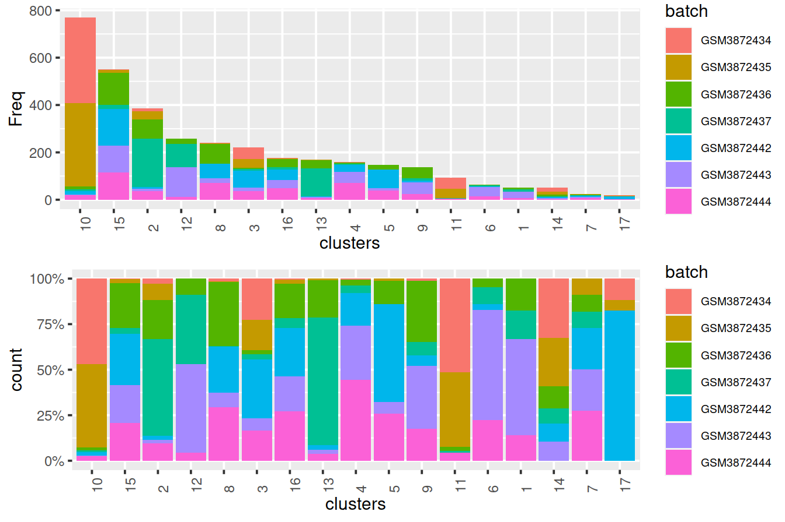

Compute and plot t-SNE:


```r
rescaled2 <- runTSNE(rescaled2, dimred="PCA")
rescaled2$batch <- factor(rescaled2$batch)
p <- plotTSNE(rescaled2, colour_by="batch")
```


```r
p
```

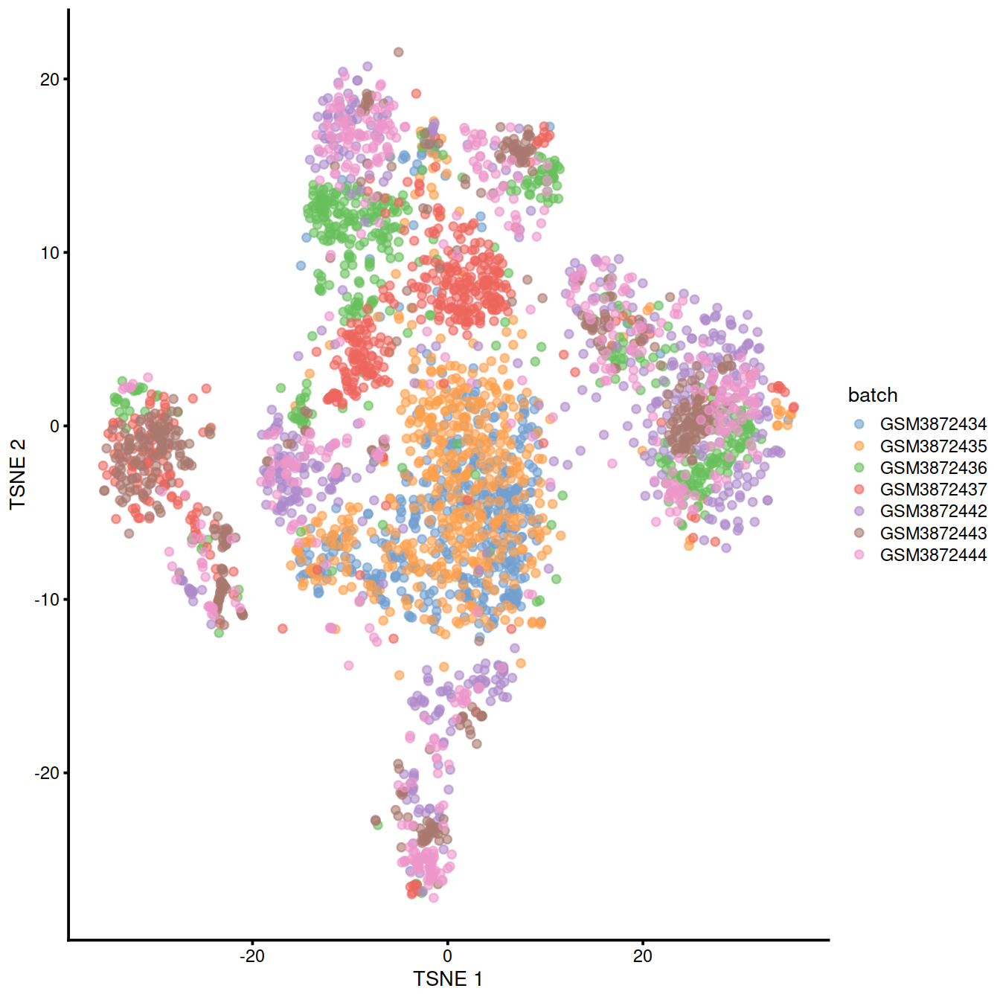


```r
p + facet_wrap(~uncorrected$source_name)
```

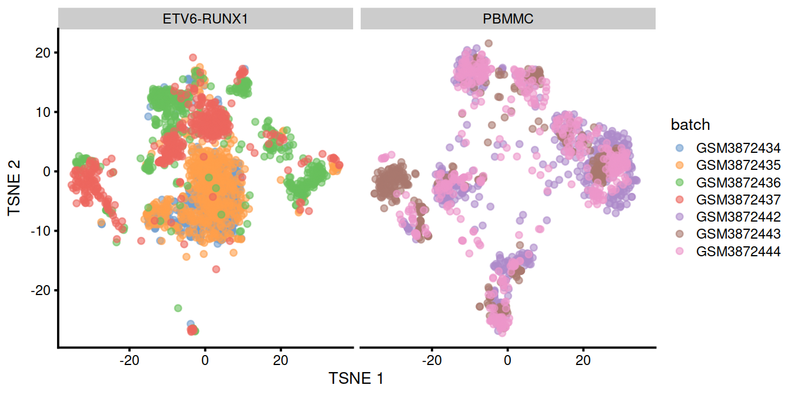

## Mutual Nearest Neighbour correction

### Algorithm overview

Consider a cell a in batch A, and identify the cells in batch B that are nearest neighbors to a in the expression space defined by the selected features. Repeat this for a cell b in batch B, identifying its nearest neighbors in A. Mutual nearest neighbors are pairs of cells from different batches that belong in each other’s set of nearest neighbors. The reasoning is that MNN pairs represent cells from the same biological state prior to the application of a batch effect - see Haghverdi et al. (2018) for full theoretical details. Thus, the difference between cells in MNN pairs can be used as an estimate of the batch effect, the subtraction of which yields batch-corrected values.

Compared to linear regression, MNN correction does not assume that the population composition is the same or known beforehand. This is because it learns the shared population structure via identification of MNN pairs and uses this information to obtain an appropriate estimate of the batch effect. Instead, the key assumption of MNN-based approaches is that the batch effect is orthogonal to the biology in high-dimensional expression space. Violations reduce the effectiveness and accuracy of the correction, with the most common case arising from variations in the direction of the batch effect between clusters. Nonetheless, the assumption is usually reasonable as a random vector is very likely to be orthogonal in high-dimensional space.


### Application to the data

The `batchelor` package provides an implementation of the MNN approach via the `fastMNN()` function. (Unlike the MNN method originally described by Haghverdi et al. (2018), the `fastMNN()` function performs PCA to reduce the dimensions beforehand and speed up the downstream neighbor detection steps.) We apply it to our two PBMC batches to remove the batch effect across the highly variable genes in `chosen.hvgs`. To reduce computational work and technical noise, all cells in all batches are projected into the low-dimensional space defined by the top d principal components. Identification of MNNs and calculation of correction vectors are then performed in this low-dimensional space.


```r
# Using randomized SVD here, as this is faster than 
# irlba for file-backed matrices.
set.seed(1000101001)
mnn.out <- fastMNN(rescaled,
                   auto.merge=TRUE,
                   d=50,
                   k=20,
                   subset.row=chosen.hvgs,
                   BSPARAM=BiocSingular::RandomParam(deferred=TRUE))
mnn.out
```

```
## class: SingleCellExperiment 
## dim: 7930 3500 
## metadata(2): merge.info pca.info
## assays(1): reconstructed
## rownames(7930): ENSG00000000938 ENSG00000001084 ... ENSG00000285476
##   ENSG00000285486
## rowData names(1): rotation
## colnames: NULL
## colData names(1): batch
## reducedDimNames(1): corrected
## altExpNames(0):
```

```r
mnn.out.corre.dim <- dim(reducedDim(mnn.out, "corrected"))
mnn.out.corre.dim
```

```
## [1] 3500   50
```

```r
mnn.out.recon.dim <- dim(assay(mnn.out, "reconstructed"))
mnn.out.recon.dim
```

```
## [1] 7930 3500
```

The function returns a SCE object containing corrected values for downstream analyses like clustering or visualization. Each column of `mnn.out` corresponds to a cell in one of the batches, while each row corresponds to an input gene in `chosen.hvgs`. The batch field in the column metadata contains a vector specifying the batch of origin of each cell.

The `corrected` matrix in the `reducedDims()` contains the low-dimensional corrected coordinates for all cells, which we will use in place of the PCs in our downstream analyses (3500 cells and 50 PCs).

A `reconstructed` matrix in the `assays()` contains the corrected expression values for each gene in each cell, obtained by projecting the low-dimensional coordinates in corrected back into gene expression space (7930 genes and 3500 cells). We do not recommend using this for anything other than visualization.


```r
print(assay(mnn.out, "reconstructed")[1:5,1:3])
```

```
## <5 x 3> matrix of class LowRankMatrix and type "double":
##                          [,1]          [,2]          [,3]
## ENSG00000000938 -1.778764e-03 -9.573360e-04 -1.024012e-04
## ENSG00000001084 -5.499423e-04 -1.165937e-03 -8.177201e-04
## ENSG00000001461 -4.356311e-04 -4.438449e-04 -4.345478e-04
## ENSG00000001561 -1.754212e-04  7.425442e-06  4.786712e-05
## ENSG00000001617 -3.443706e-04 -2.886196e-04 -2.352076e-04
```

The most relevant parameter for tuning `fastMNN()` is `k`, which specifies the number of nearest neighbors to consider when defining MNN pairs. This can be interpreted as the minimum anticipated frequency of any shared cell type or state in each batch. Increasing `k` will generally result in more aggressive merging as the algorithm is more generous in matching subpopulations across batches. It can occasionally be desirable to increase `k` if one clearly sees that the same cell types are not being adequately merged across batches.

<!--
See Chapter 32 for an example of a more complex fastMNN() merge involving several human pancreas datasets generated by different authors on different patients with different technologies.
-->


```r
colDataList <- lapply(rescaled, function(x){colData(x)})
colDataDf <- do.call(rbind, colDataList)
#colData(mnn.out) <- cbind(colDataDf, colData(mnn.out)$cluster)
colData(mnn.out) <- DataFrame(colDataDf) # no rearrainging of columns by mnncorrect
```

## Correction diagnostics

### Mixing between batches

We cluster on the low-dimensional corrected coordinates to obtain a partitioning of the cells that serves as a proxy for the population structure. If the batch effect is successfully corrected, clusters corresponding to shared cell types or states should contain cells from multiple batches. We see that all clusters contain contributions from each batch after correction, consistent with our expectation that the batches are replicates of each other.


```r
snn.gr <- buildSNNGraph(mnn.out, use.dimred="corrected", k=20)
clusters.mnn <- igraph::cluster_walktrap(snn.gr)$membership
tab.mnn <- table(Cluster=clusters.mnn, Batch=mnn.out$batch)
tab.mnn
```

```
##        Batch
## Cluster GSM3872434 GSM3872435 GSM3872436 GSM3872437 GSM3872442 GSM3872443
##      1           2          0          6          6          4         21
##      2          40         38         14         47         63          9
##      3          87          1          3          3         62         16
##      4          31        273        154         82         64         16
##      5           0          1          7         16          1         30
##      6           0          0          0          0         30         17
##      7           1         15        157         21        183        128
##      8           0          0          3         19          0         22
##      9          88         34         22         73         32          2
##      10          2         10         50         12         13         51
##      11          0          0         12         48          0         66
##      12          1          0          5          7          3         35
##      13          0          0         11         30          0         37
##      14        233        112         36        125          6          2
##      15          2          1         13          4         20         23
##      16          0          2          2          2          4          4
##      17         13         13          5          4          5          5
##      18          0          0          0          1         10         16
##        Batch
## Cluster GSM3872444
##      1           6
##      2          36
##      3          18
##      4          88
##      5           6
##      6          23
##      7         131
##      8           5
##      9          20
##      10         54
##      11          3
##      12         59
##      13          3
##      14          6
##      15         30
##      16          3
##      17          0
##      18          9
```

Cluster size and cell contribution by sample, with clusters sorted by size:


```r
#mnn.out$source_name <- uncorrected$source_name # cell order is maintained by scran functions
mnn.out$Sample.Name <- uncorrected$Sample.Name # cell order is maintained by scran functions

tmpMat <- data.frame("clusters"=clusters.mnn, "batch"=mnn.out$Sample.Name)
tmpMatTab <- table(tmpMat)
sortVecNames <- tmpMatTab %>% rowSums %>% sort(decreasing=TRUE) %>% names
tmpMat$clusters <- factor(tmpMat$clusters, levels=sortVecNames)
tmpMatTab <- table(tmpMat)
tmpMatDf <- tmpMatTab[sortVecNames,] %>% data.frame()
p1 <- ggplot(data=tmpMatDf, aes(x=clusters,y=Freq, fill=batch)) +
	theme(axis.text.x=element_text(angle = 90, hjust = 0)) +
	geom_col() +
	theme(legend.text = element_text(size = 7))
p2 <- ggplot(data=tmpMat, aes(x=clusters, fill=batch)) +
  geom_bar(position = "fill") +
	theme(axis.text.x=element_text(angle = 90, hjust = 0)) +
  scale_y_continuous(labels = scales::percent) +
  theme(legend.text = element_text(size = 7))

gridExtra::grid.arrange(p1, p2)
```

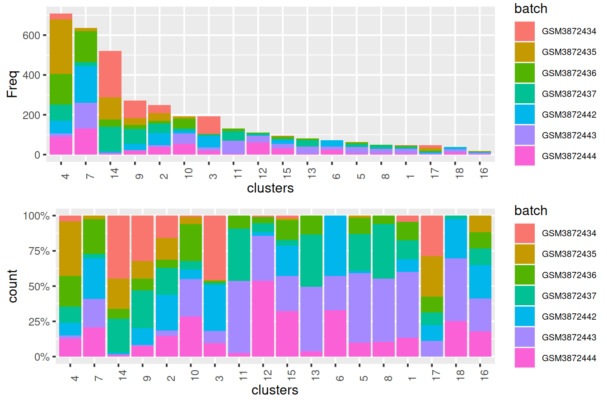

Cluster size and cell contribution by sample type, with clusters sorted by size:


```r
mnn.out$source_name <- uncorrected$source_name # cell order is maintained by scran functions
tmpMat <- data.frame("clusters"=clusters.mnn, "batch"=mnn.out$source_name)
tmpMatTab <- table(tmpMat)
sortVecNames <- tmpMatTab %>% rowSums %>% sort(decreasing=TRUE) %>% names
tmpMat$clusters <- factor(tmpMat$clusters, levels=sortVecNames)
tmpMatTab <- table(tmpMat)
tmpMatDf <- tmpMatTab[sortVecNames,] %>% data.frame()
p1 <- ggplot(data=tmpMatDf, aes(x=clusters,y=Freq, fill=batch)) +
	theme(axis.text.x=element_text(angle = 90, hjust = 0)) +
	geom_col()
p2 <- ggplot(data=tmpMat, aes(x=clusters, fill=batch)) +
  geom_bar(position = "fill") +
	theme(axis.text.x=element_text(angle = 90, hjust = 0)) +
  scale_y_continuous(labels = scales::percent)

gridExtra::grid.arrange(p1, p2)
```

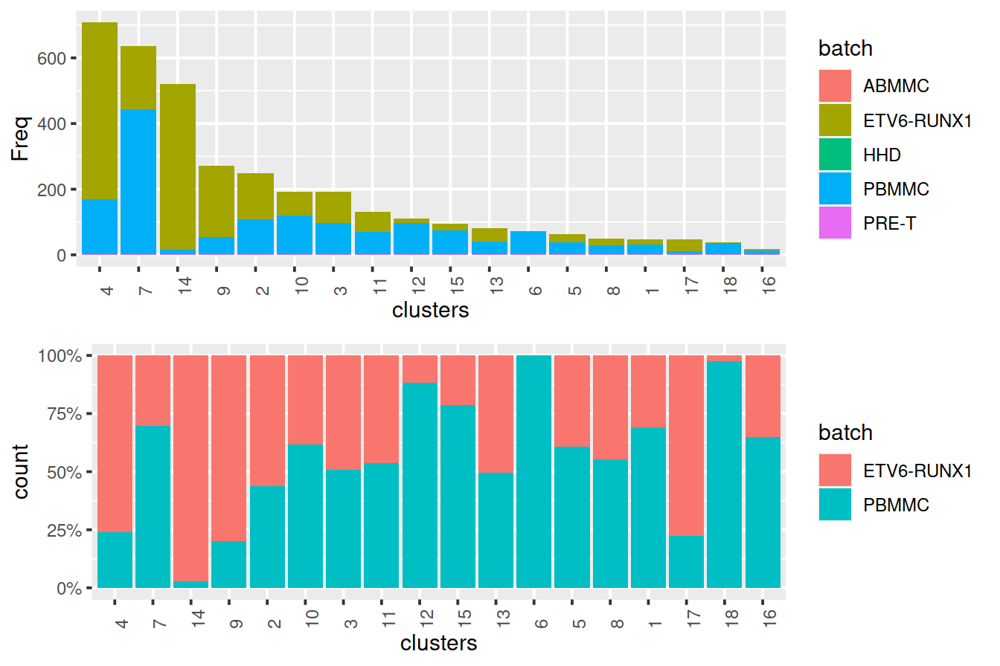

We can also compute the variation in the log-abundances to rank the clusters with the greatest variability in their proportional abundances across batches. We can then focus on batch-specific clusters that may be indicative of incomplete batch correction. Obviously, though, this diagnostic is subject to interpretation as the same outcome can be caused by batch-specific populations; some prior knowledge about the biological context is necessary to distinguish between these two possibilities. The table below shows the number of cells for each cluster (row) and sample (column) together with the variance in cell number across these samples ('var' column). 


```r
# Avoid minor difficulties with the 'table' class.
tab.mnn <- unclass(tab.mnn)

# Using a large pseudo.count to avoid unnecessarily
# large variances when the counts are low.
norm <- normalizeCounts(tab.mnn, pseudo_count=10)

# Ranking clusters by the largest variances.
rv <- rowVars(norm) %>% round(2)

# show
#DataFrame(Batch=tab.mnn, var=rv)[order(rv, decreasing=TRUE),]
DataFrame(tab.mnn, var=rv)[order(rv, decreasing=TRUE),]
```

```
## DataFrame with 18 rows and 8 columns
##     GSM3872434 GSM3872435 GSM3872436 GSM3872437 GSM3872442 GSM3872443
##      <integer>  <integer>  <integer>  <integer>  <integer>  <integer>
## 14         233        112         36        125          6          2
## 7            1         15        157         21        183        128
## 11           0          0         12         48          0         66
## 3           87          1          3          3         62         16
## 4           31        273        154         82         64         16
## ...        ...        ...        ...        ...        ...        ...
## 2           40         38         14         47         63          9
## 18           0          0          0          1         10         16
## 1            2          0          6          6          4         21
## 17          13         13          5          4          5          5
## 16           0          2          2          2          4          4
##     GSM3872444       var
##      <integer> <numeric>
## 14           6      3.09
## 7          131      2.73
## 11           3      1.58
## 3           18      1.55
## 4           88      1.34
## ...        ...       ...
## 2           36      0.48
## 18           9      0.35
## 1            6      0.26
## 17           0      0.18
## 16           3      0.03
```

We can also visualize the corrected coordinates using a t-SNE plot. The presence of visual clusters containing cells from both batches provides a comforting illusion that the correction was successful.


```r
set.seed(0010101010)
mnn.out <- runTSNE(mnn.out, dimred="corrected")

mnn.out$batch <- factor(mnn.out$batch)
p <- plotTSNE(mnn.out, colour_by="batch")
p
```

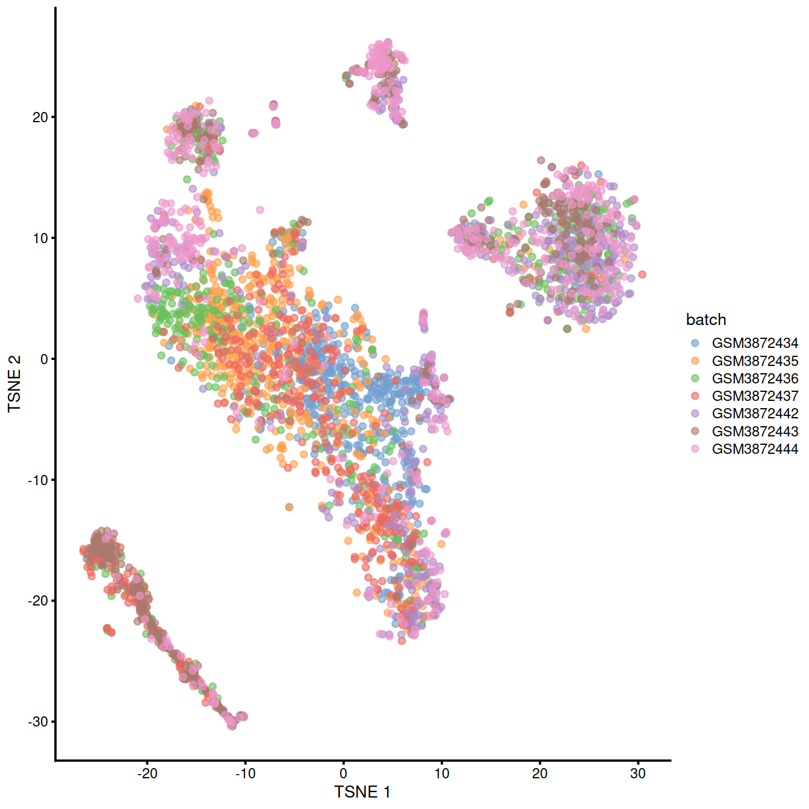

```r
#mnn.out$type <- gsub("_[1-4]","",mnn.out$batch)
#p <- plotTSNE(mnn.out, colour_by="batch", shape_by="type")
#p + facet_wrap(. ~ mnn.out$type)
```


```r
p + facet_wrap(. ~ mnn.out$source_name)
```

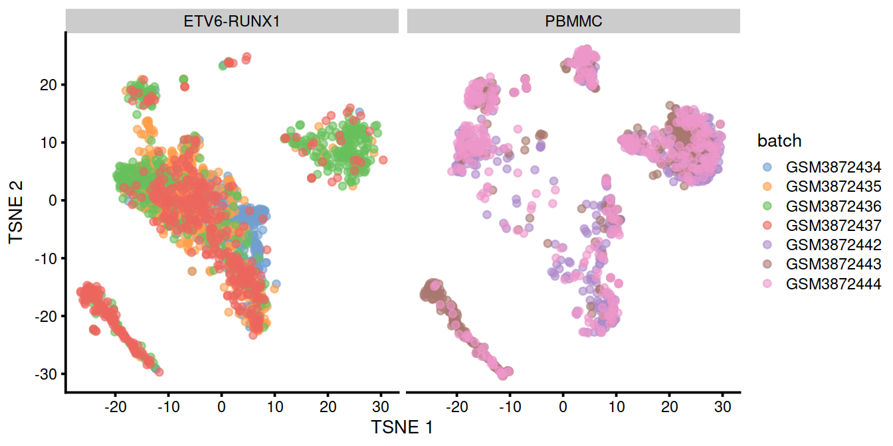

For `fastMNN()`, one useful diagnostic is the proportion of variance within each batch that is lost during MNN correction. Specifically, this refers to the within-batch variance that is removed during orthogonalization with respect to the average correction vector at each merge step. This is returned via the `lost.var` field in the metadata of `mnn.out`, which contains a matrix of the variance lost in each batch (column) at each merge step (row).


```r
round(metadata(mnn.out)$merge.info$lost.var,2)
```

```
##      GSM3872434 GSM3872435 GSM3872436 GSM3872437 GSM3872442 GSM3872443
## [1,]       0.00       0.00       0.00       0.00       0.03       0.00
## [2,]       0.00       0.00       0.00       0.00       0.02       0.08
## [3,]       0.00       0.00       0.10       0.00       0.01       0.01
## [4,]       0.00       0.00       0.01       0.09       0.01       0.00
## [5,]       0.00       0.08       0.00       0.00       0.01       0.00
## [6,]       0.08       0.01       0.01       0.01       0.01       0.01
##      GSM3872444
## [1,]       0.03
## [2,]       0.03
## [3,]       0.01
## [4,]       0.00
## [5,]       0.01
## [6,]       0.00
```

Large proportions of lost variance (>10%) suggest that correction is removing genuine biological heterogeneity. This would occur due to violations of the assumption of orthogonality between the batch effect and the biological subspace (Haghverdi et al. 2018). In this case, the proportion of lost variance is small, indicating that non-orthogonality is not a major concern.

The following t-SNE shows the clusters identified:


```r
mnn.out$cluster <- paste0("c", clusters.mnn)
p <- plotTSNE(mnn.out, colour_by="cluster", shape_by="source_name")
p
```

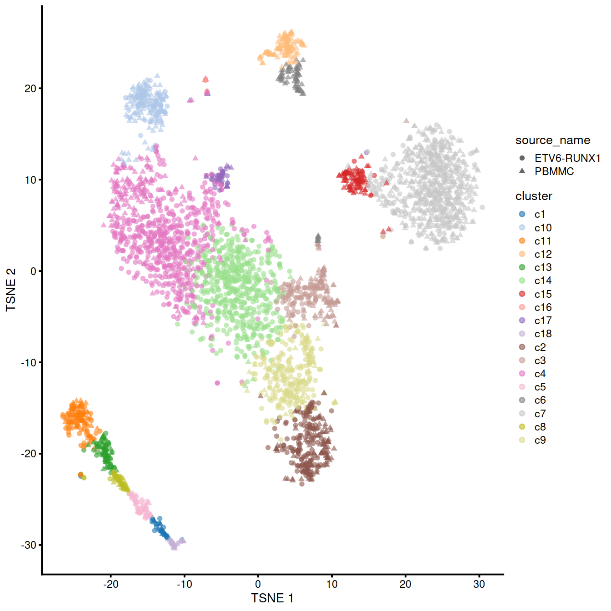


```r
p + facet_wrap(~colData(mnn.out)$batch)
```

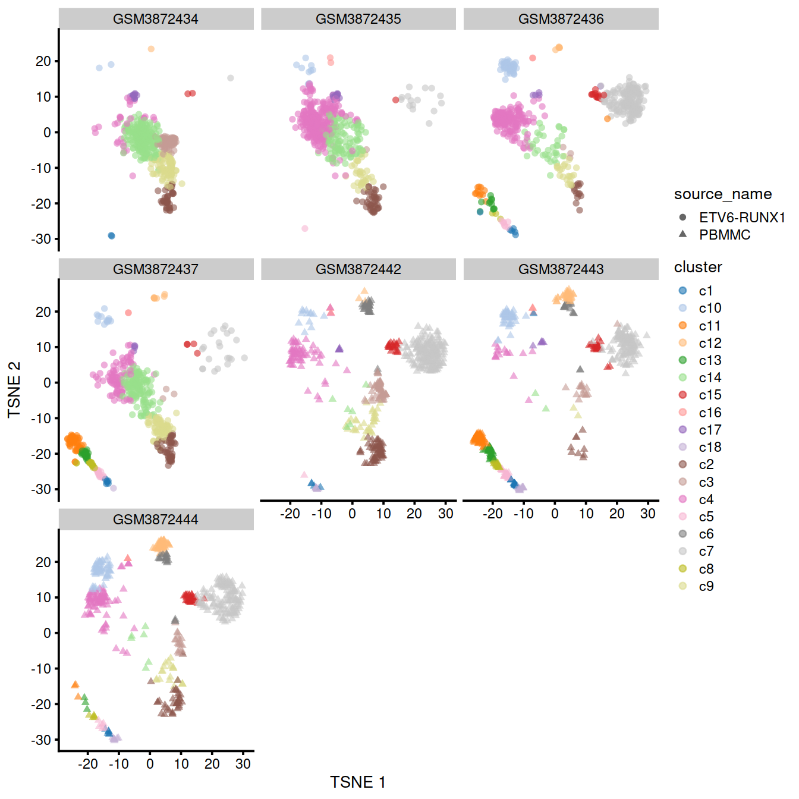

The following t-SNE plots show expression levels of known cell type marker genes.


```r
genesToShow <- c(
		 "CD79A", # CD79A 	B ***
		 "CST3", # CST3 	monocytes ***
		 "CD3D", # CD3D 	 T cells ***
		 "HBA1" # HBA1 	 erythrocytes ***
	 	)

tmpInd <- which(rowData(uncorrected)$Symbol %in% genesToShow)
ensToShow <- rowData(uncorrected)$ensembl_gene_id[tmpInd]
#```

#B cells:

#```{r fastmnn_diagTsneB_dsi_5hCellPerSpl_PBMMC_ETV6-RUNX1}
genex <- ensToShow[1]
p <- plotTSNE(mnn.out, colour_by = genex, by_exprs_values="reconstructed")
p <- p + ggtitle(
		paste("B cells", genex,
		rowData(uncorrected)[genex,"Symbol"])
	)
#print(p)
pB <- p
#```

#T cells:

#```{r fastmnn_diagTsneT_dsi_5hCellPerSpl_PBMMC_ETV6-RUNX1}
genex <- ensToShow[3]
p <- plotTSNE(mnn.out, colour_by = genex, by_exprs_values="reconstructed")
p <- p + ggtitle(
		paste("T cells", genex,
		rowData(uncorrected)[genex,"Symbol"])
	)
#print(p)
pT <- p
#```

#monocytes:

#```{r fastmnn_diagTsneM_dsi_5hCellPerSpl_PBMMC_ETV6-RUNX1}
genex <- ensToShow[2]
p <- plotTSNE(mnn.out, colour_by = genex, by_exprs_values="reconstructed")
p <- p + ggtitle(
		paste("monocytes", genex,
		rowData(uncorrected)[genex,"Symbol"])
	)
#print(p)
pM <- p
#```

#erythrocytes:

#```{r fastmnn_diagTsneE_dsi_5hCellPerSpl_PBMMC_ETV6-RUNX1}
genex <- ensToShow[4]
p <- plotTSNE(mnn.out, colour_by = genex, by_exprs_values="reconstructed")
p <- p + ggtitle(
		paste("erythrocytes", genex,
		rowData(uncorrected)[genex,"Symbol"])
	)
#print(p)
pE <- p
```


```r
gridExtra::grid.arrange(pB + theme(legend.position="bottom"),
                        pT + theme(legend.position="bottom"),
                        pM + theme(legend.position="bottom"),
                        pE + theme(legend.position="bottom"),
                        ncol=2)
```

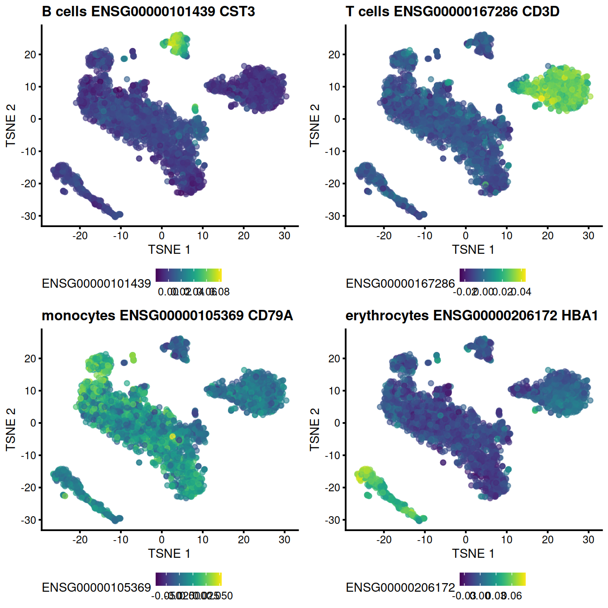

Compare to the uncorrected values:


```r
# B cells
genex <- ensToShow[1]
p <- plotTSNE(uncorrected, colour_by = genex)
p <- p + ggtitle(
		paste("B cells", genex,
		rowData(uncorrected)[genex,"Symbol"])
	)
#print(p)
pBu <- p
#```

#Compare to the uncorrected values, T cells:

#```{r uncorr_diagTsneT_dsi_5hCellPerSpl_PBMMC_ETV6-RUNX1}
genex <- ensToShow[3]
p <- plotTSNE(uncorrected, colour_by = genex)
p <- p + ggtitle(
		paste("T cells", genex,
		rowData(uncorrected)[genex,"Symbol"])
	)
#print(p)
pTu <- p
#```

#Compare to the uncorrected values, monocytes:

#```{r uncorr_diagTsneM_dsi_5hCellPerSpl_PBMMC_ETV6-RUNX1}
genex <- ensToShow[2]
p <- plotTSNE(uncorrected, colour_by = genex)
p <- p + ggtitle(
		paste("monocytes", genex,
		rowData(uncorrected)[genex,"Symbol"])
	)
#print(p)
pMu <- p
#```

#Compare to the uncorrected values, erythrocytes:

#```{r uncorr_diagTsneE_dsi_5hCellPerSpl_PBMMC_ETV6-RUNX1}
genex <- ensToShow[4]
p <- plotTSNE(uncorrected, colour_by = genex)
p <- p + ggtitle(
		paste("erythrocytes", genex,
		rowData(uncorrected)[genex,"Symbol"])
	)
#print(p)
pEu <- p
```


```r
gridExtra::grid.arrange(pBu + theme(legend.position="bottom"),
                        pTu + theme(legend.position="bottom"),
                        pMu + theme(legend.position="bottom"),
                        pEu + theme(legend.position="bottom"),
                        ncol=2)
```

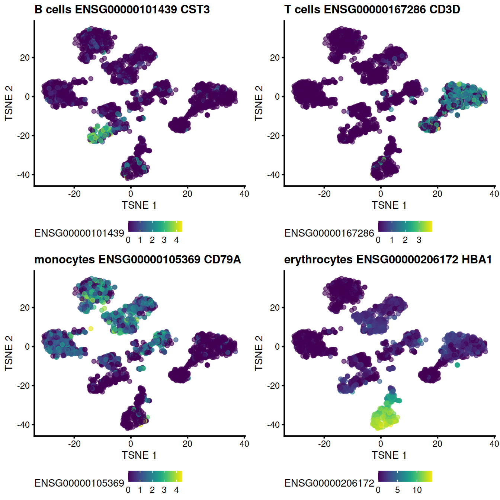

Other genes (exercise)


```r
genesToShow2 <- c(
		 "IL7R", # IL7R, CCR7 	Naive CD4+ T
		 "CCR7", # IL7R, CCR7 	Naive CD4+ T
		 "S100A4", # IL7R, S100A4 	Memory CD4+
		 "CD14", # CD14, LYZ 	CD14+ Mono
		 "LYZ", # CD14, LYZ 	CD14+ Mono
		 "MS4A1", # MS4A1 	B
		 "CD8A", # CD8A 	CD8+ T
		 "FCGR3A", # FCGR3A, MS4A7 	FCGR3A+ Mono
		 "MS4A7", # FCGR3A, MS4A7 	FCGR3A+ Mono
		 "GNLY", # GNLY, NKG7 	NK
		 "NKG7", # GNLY, NKG7 	NK
		 "FCER1A", # DC
		 "CST3", # DC
		 "PPBP" # Platelet
		)
```


```r
tmpInd <- which(rowData(uncorrected)$Symbol %in% genesToShow2)
ensToShow <- rowData(uncorrected)$ensembl_gene_id[tmpInd]
table(ensToShow %in% rownames(rowData(mnn.out)))
ensToShow <- ensToShow[ensToShow %in% rownames(rowData(mnn.out))]
```


```r
for (genex in ensToShow)
{
	p <- plotTSNE(mnn.out, colour_by = genex, by_exprs_values="reconstructed")
	p <- p + ggtitle(paste(genex, rowData(uncorrected)[genex,"Symbol"]))
	print(p)
}
```

### Preserving biological heterogeneity

#### Comparison between within-batch clusters and across-batch clusters obtained after MNN correction

Another useful diagnostic check is to compare the clustering within each batch to the clustering of the merged data. Accurate data integration should preserve variance within each batch as there should be nothing to remove between cells in the same batch. This check complements the previously mentioned diagnostics that only focus on the removal of differences between batches. Specifically, it protects us against cases where the correction method simply aggregates all cells together, which would achieve perfect mixing but also discard the biological heterogeneity of interest.

Ideally, we should see a many-to-1 mapping where the across-batch clustering is nested inside the within-batch clusterings. This indicates that any within-batch structure was preserved after correction while acknowledging that greater resolution is possible with more cells. In practice, more discrepancies can be expected even when the correction is perfect, due to the existence of closely related clusters that were arbitrarily separated in the within-batch clustering. As a general rule, we can be satisfied with the correction if the vast majority of entries are zero, though this may depend on whether specific clusters of interest are gained or lost.

One heatmap is generated for each dataset, where each entry is colored according to the number of cells with each pair of labels (before and after correction), on the log10 scale with pseudocounts (+10) for a smoother color transition (so a minimum value of log10(0+10) == 1). 


```r
plotList <- vector(mode = "list", length = length(splVec))
treeList <- vector(mode = "list", length = length(splVec))
for (splIdx in 1:length(splVec)) {
  # heatmap
  tab <- table(
    paste("before", colLabels(rescaled[[splIdx]]), sep="_"),
    paste("after", clusters.mnn[rescaled2$batch==splVec[splIdx]], sep="_")
    )
  plotList[[splIdx]] <- pheatmap(log10(tab+10),
                                 cluster_row=FALSE,
                                 cluster_col=FALSE,
                                 col=rev(viridis::magma(100)),
                                 main=sprintf("%s",
                                              splVec[splIdx]),
                                 silent=TRUE,
                                 fontsize=7)
  # cluster tree:
  combined <- cbind(
    cl.1=colLabels(rescaled[[splIdx]]),
    cl.2=clusters.mnn[rescaled2$batch==splVec[splIdx]])
  treeList[[splIdx]]  <- clustree(combined, prefix="cl.", edge_arrow=FALSE) +
    ggtitle(splVec[splIdx]) +
    #theme(legend.background = element_rect(color = "yellow")) +
    #theme(legend.position='bottom') +
    #theme(legend.box="vertical") +
    #theme(legend.box="horizontal") +
    theme(legend.margin=margin()) #+
    #guides(fill=guide_legend(nrow=2, byrow=FALSE))
    #theme(legend.position = "none")
}
```


```r
g_legend<-function(a.gplot){
   tmp <- ggplot_gtable(ggplot_build(a.gplot))
   leg <- which(sapply(tmp$grobs, function(x) x$name) == "guide-box")
   legend <- tmp$grobs[[leg]]
   return(legend)
}

redrawClutree <- function(p){
#p <- treeList[[1]] + theme(legend.position='bottom')
#p <- p + theme(legend.background = element_rect(color = "yellow"))
p <- p + theme(legend.justification = "left")
#p <- p + theme(legend.justification = c(0,1))
#lemon::gtable_show_names(p)
pNoLeg <- p + theme(legend.position = "none")
# edge colour:
pEdgeCol <- p +
  #guides(edge_colour = FALSE) +
  guides(edge_alpha = FALSE) +
  guides(size = FALSE) +
  guides(colour = FALSE) 
pEdgeCol.leg <- g_legend(pEdgeCol)
# edge alpha:
pEdgeAlpha <- p +
  guides(edge_colour = FALSE) +
  #guides(edge_alpha = FALSE) +
  guides(size = FALSE) +
  guides(colour = FALSE) 
pEdgeAlpha.leg <- g_legend(pEdgeAlpha)
# size
pSize <- p +
  guides(edge_colour = FALSE) +
  guides(edge_alpha = FALSE) +
  #guides(size = FALSE) +
  guides(colour = FALSE) 
pSize.leg <- g_legend(pSize)
# colour
pColour <- p +
  guides(edge_colour = FALSE) +
  guides(edge_alpha = FALSE) +
  guides(size = FALSE) #+
  #guides(colour = FALSE) 
pColour.leg <- g_legend(pColour)

#gridExtra::grid.arrange(pNoLeg, pEdgeCol.leg, nrow=2, ncol=1, heights=c(unit(.8, "npc"), unit(.2, "npc")))
if(FALSE)
{
grobx <- gridExtra::grid.arrange(pNoLeg,
                        pEdgeCol.leg,
                        pEdgeAlpha.leg,
                        pColour.leg,
                        pSize.leg,
                        nrow=3, ncol=2,
                        heights=c(unit(.8, "npc"),
                                  unit(.1, "npc"),
                                  unit(.1, "npc")),
                        widths=c(unit(.3, "npc"), unit(.7, "npc")),
                        layout_matrix=matrix(c(1,1,2,5,4,3), ncol=2, byrow=TRUE)
                        )
}
if(FALSE)
{
grobx <- gridExtra::arrangeGrob(pNoLeg,
                        pEdgeCol.leg,
                        pEdgeAlpha.leg,
                        pColour.leg,
                        pSize.leg,
                        #nrow=3, ncol=2,
                        #layout_matrix=matrix(c(1,1,2,5,4,3), ncol=2, byrow=TRUE),
                        nrow=2, ncol=3,
                        layout_matrix=matrix(c(1,1,2,5,4,3), ncol=3, byrow=FALSE),
                        widths=c(unit(.70, "npc"),
                                  unit(.15, "npc"),
                                  unit(.15, "npc")),
                        heights=c(unit(.7, "npc"),
                                 unit(.3, "npc"))
                        )
}

grobx <- gridExtra::arrangeGrob(pNoLeg,
                        pEdgeCol.leg,
                        pEdgeAlpha.leg,
                        #pColour.leg,
                        pSize.leg,
                        nrow=1, ncol=4,
                        layout_matrix=matrix(c(1,2,3,4), ncol=4, byrow=TRUE),
                        widths=c(unit(.64, "npc"),
                                  unit(.12, "npc"),
                                  unit(.12, "npc"),
                                  unit(.12, "npc"))
                        )
}
##gx <- redrawClutree(treeList[[1]] + theme(legend.position='bottom'))
##grid::grid.draw(gx)
## fine # gxList <- lapply(treeList, function(x){redrawClutree(x+theme(legend.position='bottom'))})
gxList <- lapply(treeList, function(x){redrawClutree(x)})
##gridExtra::marrangeGrob(gxList, nrow=2, ncol=2)
```


```r
grobList <- lapply(plotList, function(x){x[[4]]})
gridExtra::grid.arrange(grobs = grobList,
      ncol=2,
      top = grid::textGrob("clusterings concordance (number of cells, log10 scale)",
                     gp=grid::gpar(fontsize=12,font=3))
)
```

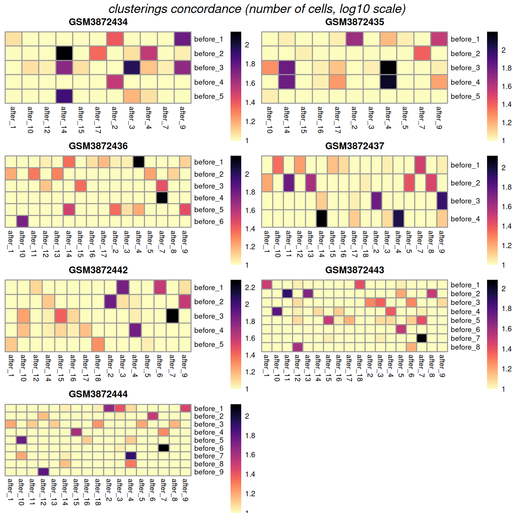

The redistribution of cells from one set of clusters to another, here 'within-batch before' and 'across-batch after' correction, may also be visualized with a clustering tree [clustree](https://cran.r-project.org/package=clustree). Clusters are represented as filled circles colored by cluster set ('before' in pink, 'after' in blue) and sized by cell number. A pair of clusters from two sets are linked according to the number of cells they share with a link that informs on the number of cells shared (color) and the 'incoming node' proportion for the node it points to (transparency). Although these plots convey more information than heatmaps below, they may not be as easy to read.


```r
#```{r, fig.height=figSize*length(treeList)/2, fig.width=figSize}
#gridExtra::grid.arrange(grobs = treeList,
gridExtra::grid.arrange(grobs = gxList,
      ncol=1
)
```

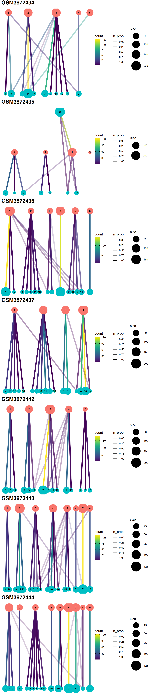

The same plots in more compact form with no legend:

<!-- remove legend and have plots in two columns -->


```r
treeList <- lapply(treeList, function(p){
  p +
    guides(edge_colour = FALSE) +
    guides(edge_alpha = FALSE) +
    guides(size = FALSE) +
    guides(colour = FALSE) 
})
```


```r
gridExtra::grid.arrange(grobs = treeList,
      ncol=2
)
```

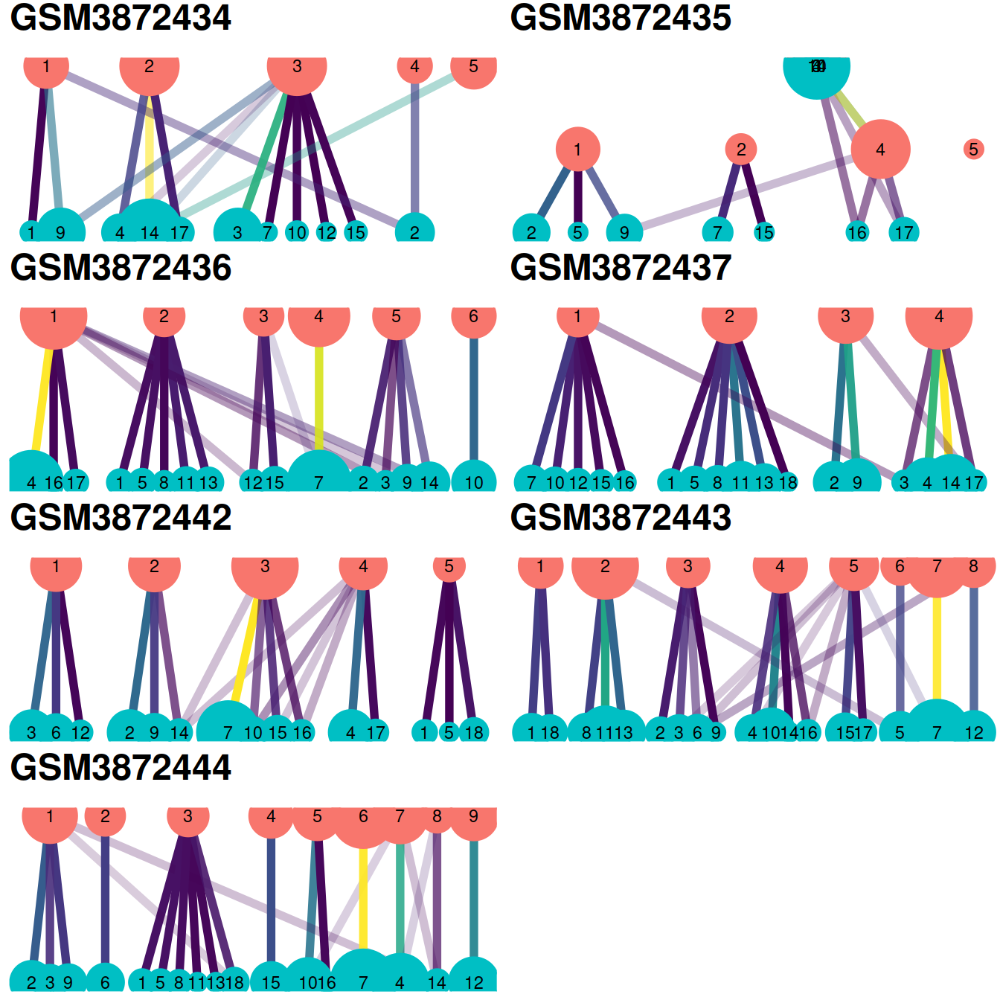

#### Coassignment probabilities

Another evaluation approach is to compute the **coassignment probabilities**, i.e. the probability that cells from two within-batch clusters are clustered together in the across-batch clustering. High probabilities off the diagonal indicate that within-batch clusters are merged in the across-batch analysis. We would generally expect low off-diagonal probabilities for most pairs of clusters, though this may not be reasonably possible if the within-batch clusters were poorly separated in the first place.

The plots below display the coassignment probabilities for the within-batch clusters, based on coassignment of cells in the across-batch clusters obtained after MNN correction. One heatmap is generated for each sample, where each entry is colored according to the coassignment probability between each pair of within-batch clusters:


```r
# coassignProb manual: now deprecated for pairwiseRand. 
# Note that the coassignment probability is closely related to the Rand index-based ratios broken down by cluster pair in pairwiseRand with mode="ratio" and adjusted=FALSE. The off-diagonal coassignment probabilities are simply 1 minus the off-diagonal ratio, while the on-diagonal values differ only by the lack of consideration of pairs of the same cell in pairwiseRand. 

plotList <- vector(mode = "list", length = length(splVec))
for (splIdx in 1:length(splVec)) {
  tab <- coassignProb(colLabels(rescaled[[splIdx]]),
                      clusters.mnn[rescaled2$batch==splVec[splIdx]])
  plotList[[splIdx]] <- pheatmap(tab,
                                 cluster_row=FALSE,
                                 cluster_col=FALSE,
                                 col=rev(viridis::magma(100)),
                                 main=sprintf("%s probabilities", splVec[splIdx]),
                                 silent=TRUE)
}
grobList <- lapply(plotList, function(x){x[[4]]})
gridExtra::grid.arrange(grobs = grobList,
      ncol=2
)
```

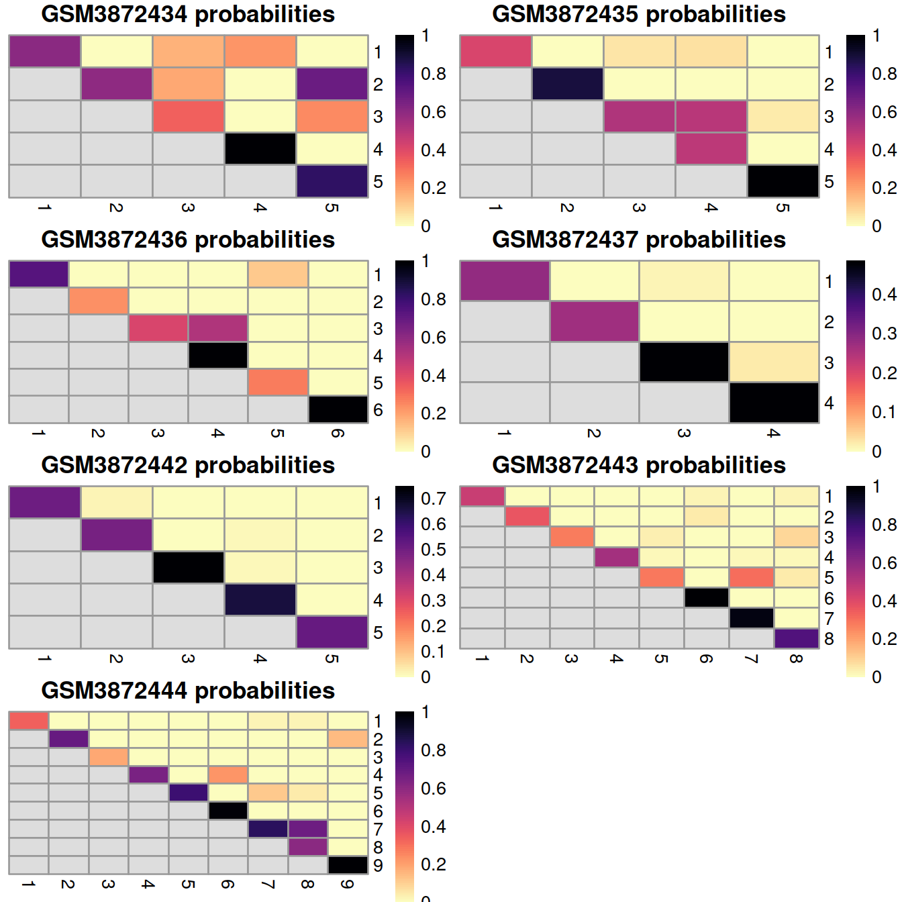

Note that the coassignment probability is closely related to the Rand index-based ratios broken down by cluster pair (in `pairwiseRand()` with mode="ratio" and adjusted=FALSE). The Rand index is introduced below.
 
#### Rand index

Finally, we can summarize the agreement between clusterings by computing the **Rand index**. This provides a simple metric that we can use to assess the preservation of variation by different correction methods. Larger rand indices (i.e., closer to 1) are more desirable, though this must be balanced against the ability of each method to actually remove the batch effect.


```r
# pairwiseRand(), index, adjusted
ariVec <- vector(mode = "numeric", length = length(splVec))
names(ariVec) <- splVec
for (splIdx in 1:length(splVec)) {
  ariVec[splIdx] <- pairwiseRand(
    ref=as.integer(colLabels(rescaled[[splIdx]])),
    alt=as.integer(clusters.mnn[rescaled2$batch==splVec[splIdx]]),
    mode="index")
}
ariVec <- round(ariVec,2)
ariVec
```

```
## GSM3872434 GSM3872435 GSM3872436 GSM3872437 GSM3872442 GSM3872443 GSM3872444 
##       0.29       0.21       0.76       0.50       0.74       0.63       0.78
```

A sample may show a low Rand index value if cells grouped together in a small cluster before correction are split into distinct clusters after correction because the latter comprise cell populations not observed in that sample but present in other samples.

This would be the case of GSM3872434 with far fewer erythrocytes (grouped in a single cluster) than GSM3872443, in which subtypes can be distinguished.
<!--
-->

We can also break down the **adjusted Rand index (ARI)** into per-cluster ratios for more detailed diagnostics. For example, we could see low ratios off the diagonal if distinct clusters in the within-batch clustering were incorrectly aggregated in the merged clustering. Conversely, we might see low ratios on the diagonal if the correction inflated or introduced spurious heterogeneity inside a within-batch cluster.


```r
# pairwiseRand(), ratio, adjusted
# square numeric matrix is returned with number of rows equal to the number of unique levels in ref.

tabList <- vector(mode = "list", length = length(splVec))
for (splIdx in 1:length(splVec)) {
  tabList[[splIdx]] <- pairwiseRand(
    ref=as.integer(colLabels(rescaled[[splIdx]])),
    alt=as.integer(clusters.mnn[rescaled2$batch==splVec[splIdx]])
	)
}
randVal <- unlist(tabList) 

## make breaks from combined range
limits <- c(
  min(randVal, na.rm = TRUE),
  max(randVal, na.rm = TRUE))
limits <- quantile(randVal, probs=c(0.05, 0.95), na.rm = TRUE)

Breaks <- seq(limits[1], limits[2],
              length = 100)

plotList <- vector(mode = "list", length = length(splVec))
for (splIdx in 1:length(splVec)) {
  plotList[[splIdx]] <- pheatmap(tabList[[splIdx]],
                                 cluster_row=FALSE,
                                 cluster_col=FALSE,
                                 col=rev(viridis::magma(100)),
                                 breaks=Breaks,
                                 main=sprintf("%s ratio", splVec[splIdx]),
                                 silent=TRUE)
}
grobList <- lapply(plotList, function(x){x[[4]]})
gridExtra::grid.arrange(grobs = grobList,
      ncol=2
)
```

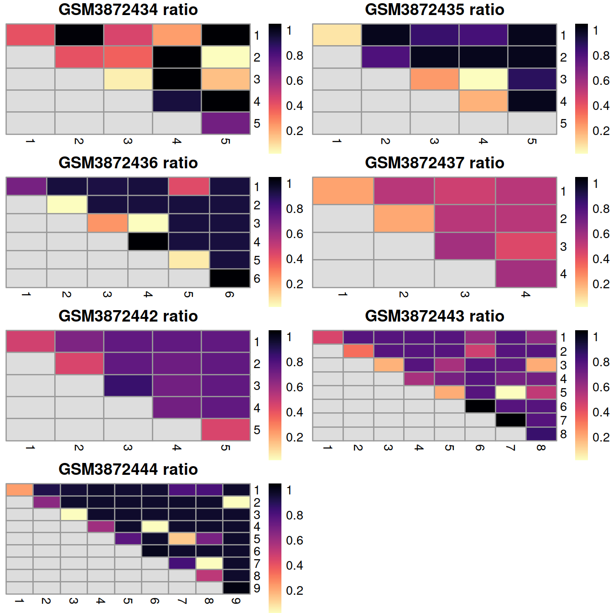

## Encouraging consistency with marker genes

In some situations, we will already have performed within-batch analyses to characterize salient aspects of population heterogeneity. This is not uncommon when merging datasets from different sources where each dataset has already been analyzed, annotated and interpreted separately. It is subsequently desirable for the integration procedure to retain these “known interesting” aspects of each dataset in the merged dataset. We can encourage this outcome by using the marker genes within each dataset as our selected feature set for `fastMNN()` and related methods. This focuses on the relevant heterogeneity and represents a semi-supervised approach that is a natural extension of the strategy described in the feature selection section.

We identify the top marker genes from pairwise Wilcoxon ranked sum tests between every pair of clusters within each batch, analogous to the method used by [SingleR](https://www.bioconductor.org/packages/release/bioc/html/SingleR.html). In this case, we use the top 10 marker genes but any value can be used depending on the acceptable trade-off between signal and noise (and speed). We then take the union across all comparisons in all batches and use that in place of our HVG set in `fastMNN()`.


```r
# Recall that groups for marker detection
# are automatically defined from 'colLabels()'. 
markerList <- lapply(rescaled, function(x){
  y <- pairwiseWilcox(x, direction="up")
  getTopMarkers(y[[1]], y[[2]], n=10) %>% unlist %>% unlist
  })
marker.set <- unique(unlist(markerList))
#length(marker.set) # getting the total number of genes selected in this manner.
```

The total number of genes selected in this manner is: 430.


```r
set.seed(1000110)
mnn.out2 <- fastMNN(rescaled,
                    subset.row=marker.set,
                    BSPARAM=BiocSingular::RandomParam(deferred=TRUE))
mnn.out2$source_name <- uncorrected$source_name # cell order is maintained by scran functions

# compute t-SNE:
mnn.out2 <- runTSNE(mnn.out2, dimred="corrected")
```

We can also visualize the corrected coordinates using a t-SNE plot:


```r
plotTSNE(mnn.out2, colour_by="batch", shape_by="source_name")
```

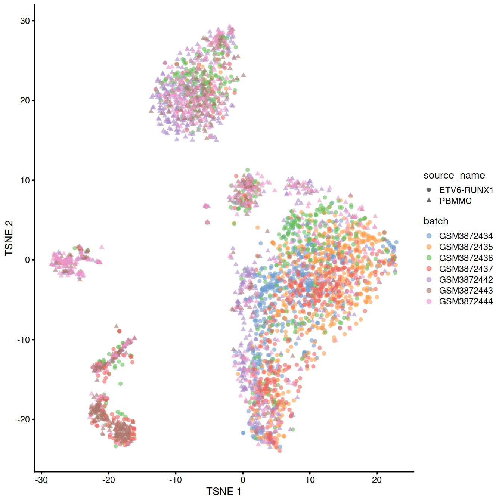


```r
plotTSNE(mnn.out2, colour_by="source_name") +
	facet_wrap(~colData(mnn.out2)$source_name, ncol=2)
```

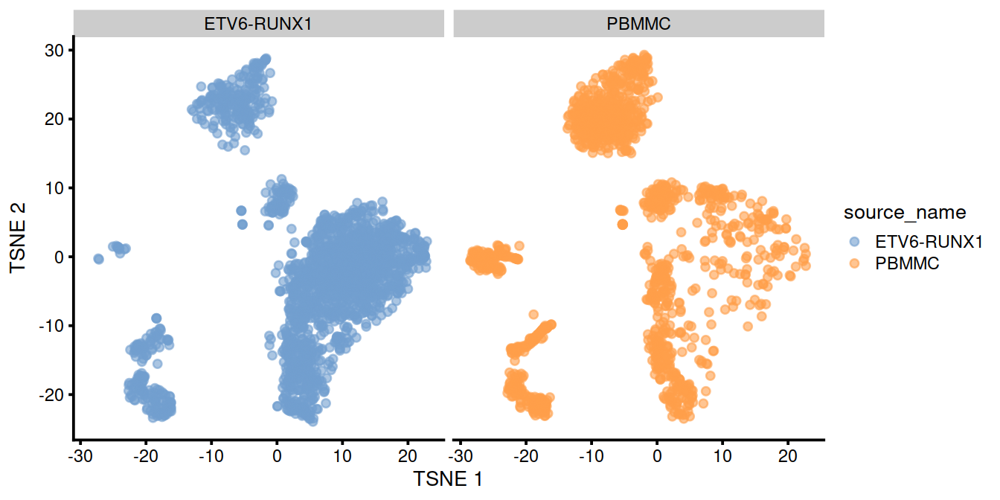


```r
plotTSNE(mnn.out2, colour_by="batch", shape_by="source_name") +
	facet_wrap(~colData(mnn.out2)$batch, ncol=3)
```

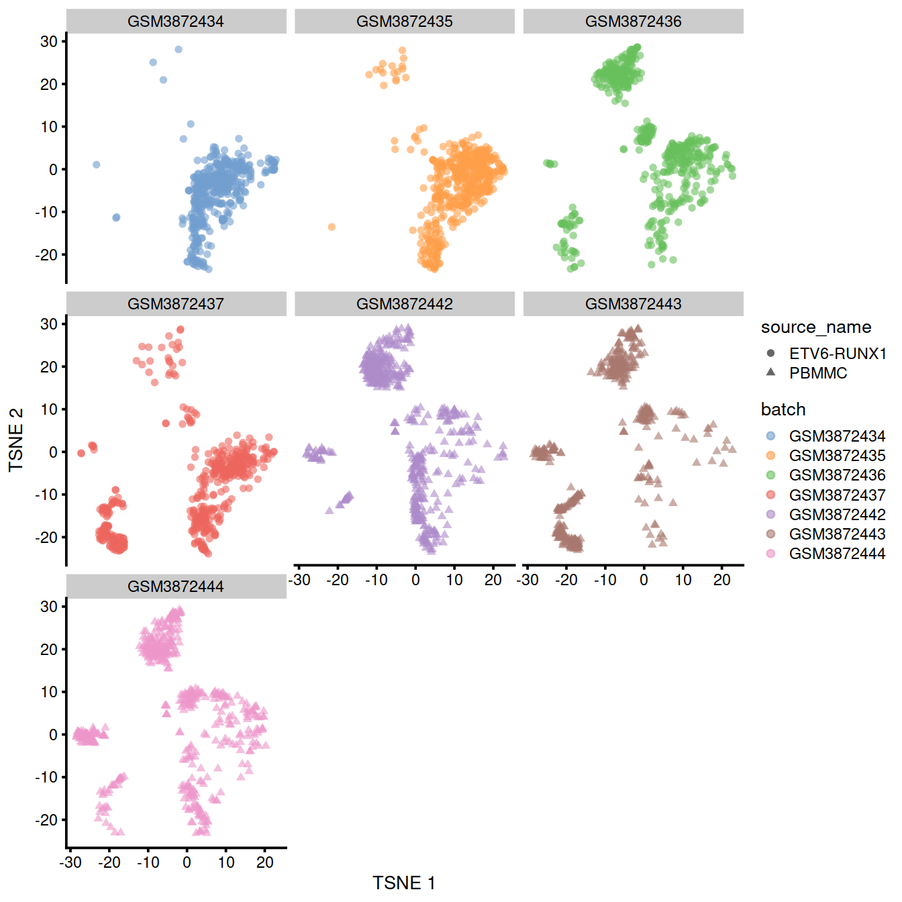

A quick inspection indicates that the original within-batch structure is indeed preserved in the corrected data. This highlights the utility of a marker-based feature set for integrating datasets that have already been characterized separately in a manner that preserves existing interpretations of each dataset. We note that some within-batch clusters have merged, most likely due to the lack of robust separation in the first place, though this may also be treated as a diagnostic on the appropriateness of the integration depending on the context.


```r
plotList <- vector(mode = "list", length = length(splVec))
for (x in 1:length(splVec)) {
  plotList[[x]] <- plotTSNE(mnn.out2[,mnn.out2$batch==splVec[x]],
                              colour_by=I(colLabels(rescaled[[x]]))) +
                  ggtitle(splVec[x])
}
gridExtra::grid.arrange(grobs = plotList,
      ncol=3
)
```

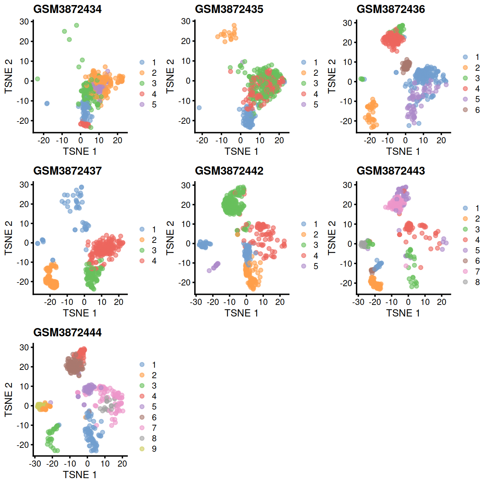


```r
m.out <- findMarkers(uncorrected,
                     clusters.mnn,
                     block=uncorrected$batch,
                     direction="up",
                     lfc=1,
                     row.data=rowData(uncorrected)[,c("ensembl_gene_id","Symbol"),drop=FALSE])

#lapply(m.out, function(x){head(x[,2:6])})

tl1 <- lapply(m.out, function(x){x[x$Symbol=="CD3D" & x$Top <= 50 & x$FDR < 0.10,2:6]}) # T-cell
tl2 <- lapply(m.out, function(x){x[x$Symbol=="CD69" & x$Top <= 50 & x$FDR < 0.20,2:6]}) # activation

tb1 <- unlist(lapply(tl1, nrow)) > 0
tb2 <- unlist(lapply(tl2, nrow)) > 0

cluToGet <- unique(c(which(tb1), which(tb2)))[1] # 3 # 19 # 4
demo <- m.out[[cluToGet]]
#as.data.frame(demo[1:20,c("Symbol", "Top", "p.value", "FDR", "summary.logFC")]) 
```

Expression level for the top gene,  on violin plots:


```r
geneEnsId <- rownames(demo)[1]
plotExpression(uncorrected,
               x=I(factor(clusters.mnn)),
               features=geneEnsId, colour_by="batch") +
  facet_wrap(~colour_by) +
	theme(axis.text.x=element_text(angle = 90, hjust = 0)) +
  ggtitle(sprintf("%s %s",
          geneEnsId,
          rowData(uncorrected)[geneEnsId,"Symbol"])
          )
```

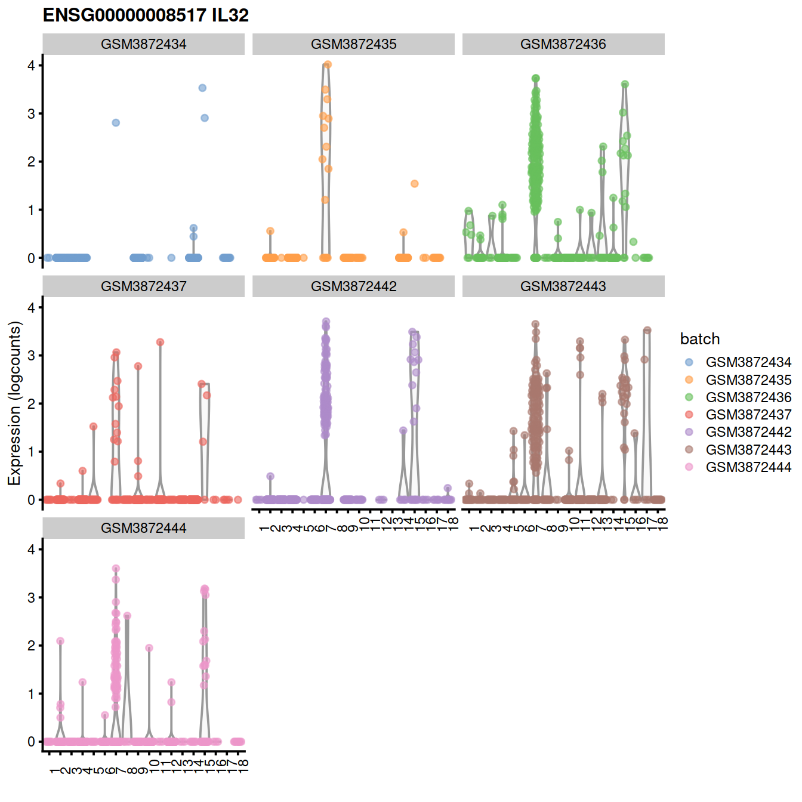

Expression level for the top gene, ENSG00000008517 on t-SNE plot:

**Not Encouraging consistency** with marker genes


```r
genex <- rownames(demo)[1]
genex <- demo %>% data.frame %>%
  filter(!str_detect(Symbol, "^RP")) %>%
  pull(ensembl_gene_id) %>% head(1)
p <- plotTSNE(mnn.out, colour_by = genex, by_exprs_values="reconstructed")
p <- p + ggtitle(
			paste("cluster", cluToGet, genex,
			rowData(uncorrected)[genex,"Symbol"])
		)
#print(p)
p1 <- p
p2 <- p + facet_wrap(~colData(mnn.out)$batch)
gridExtra::grid.arrange(p1 + theme(legend.position="bottom"),
                        p2 + theme(legend.position="bottom"),
                        ncol=2)
```

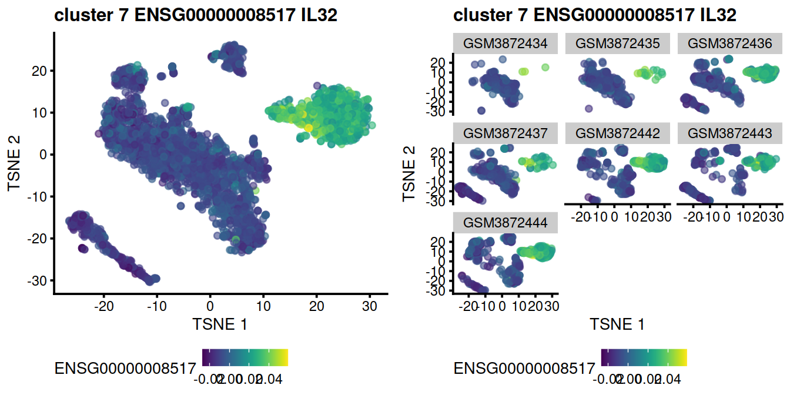

**Encouraging consistency** with marker genes


```r
#genex <- rownames(demo)[1]
p <- plotTSNE(mnn.out2, colour_by = genex, by_exprs_values="reconstructed")
p <- p + ggtitle(
			paste("cluster", cluToGet, genex,
			rowData(uncorrected)[genex,"Symbol"])
		)
#print(p)
p1 <- p
p2 <- p + facet_wrap(~colData(mnn.out2)$batch)
gridExtra::grid.arrange(p1 + theme(legend.position="bottom"),
                        p2 + theme(legend.position="bottom"),
                        ncol=2)
```

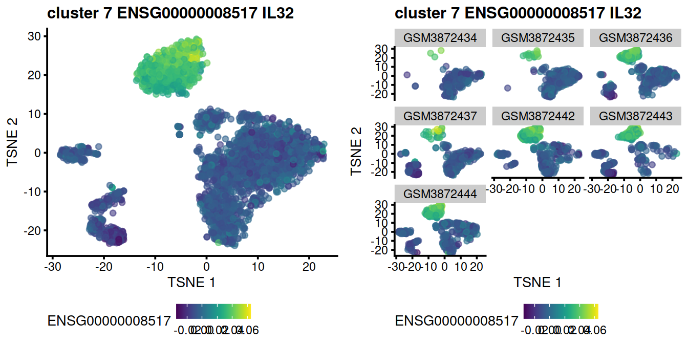

We suggest limiting the use of per-gene corrected values to visualization, e.g., when coloring points on a t-SNE plot by per-cell expression. This can be more aesthetically pleasing than uncorrected expression values that may contain large shifts on the colour scale between cells in different batches. Use of the corrected values in any quantitative procedure should be treated with caution, and should be backed up by similar results from an analysis on the uncorrected values.


```r
# before we save the mnn.out object in a file,
# we should copy some of the cell meta data over,
# eg Barcode and lib size.

# Mind sets may have been downsampled, eg with nbCells set to 1000.
# But that is not in the file name (yet?)

# save object?
fn <- sprintf("%s/%s/Robjects/%s_sce_nz_postDeconv%s_dsi_%s.Rds",
#fn <- sprintf("%s/%s/Robjects/%s_sce_nz_postDeconv%s_dsi2_%s.Rds",
              projDir,
              outDirBit,
              setName,
              setSuf,
              splSetToGet2) # 'dsi' for data set integration
saveRDS(mnn.out, file=fn)
#saveRDS(mnn.out2, file=fn)
```

## Identify clusters with PBMMC cells

<!-- Mind clustering now comes after data set integration
so maybe have the session in a separate file
or point to the clustering chapter -->

Cluster size and cell contribution by sample type, with clusters sorted by size:


```r
mnn.out$source_name <- uncorrected$source_name # cell order is maintained by scran functions
tmpMat <- data.frame("clusters"=clusters.mnn, "batch"=mnn.out$source_name)
tmpMatTab <- table(tmpMat)
sortVecNames <- tmpMatTab %>% rowSums %>% sort(decreasing=TRUE) %>% names
tmpMat$clusters <- factor(tmpMat$clusters, levels=sortVecNames)
tmpMatTab <- table(tmpMat)
tmpMatDf <- tmpMatTab[sortVecNames,] %>% data.frame()
p1 <- ggplot(data=tmpMatDf, aes(x=clusters,y=Freq, fill=batch)) +
	theme(axis.text.x=element_text(angle = 90, hjust = 0)) +
	geom_col()
p2 <- ggplot(data=tmpMat, aes(x=clusters, fill=batch)) +
  geom_bar(position = "fill") +
	theme(axis.text.x=element_text(angle = 90, hjust = 0)) +
  scale_y_continuous(labels = scales::percent)

gridExtra::grid.arrange(p1, p2)
```

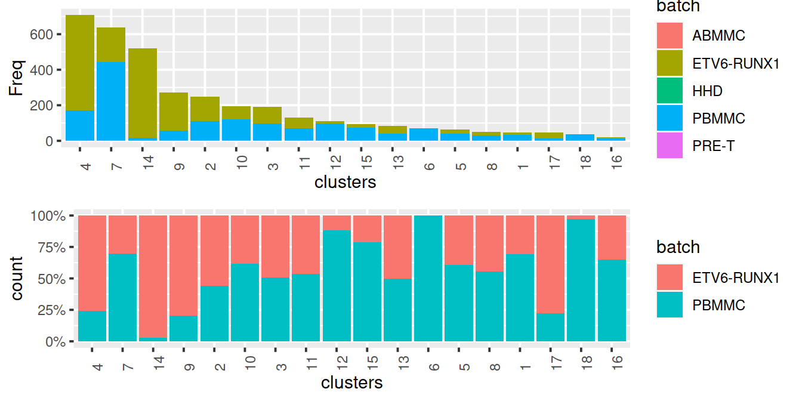

Cluster size and cell contribution by sample type, with clusters sorted by
decreasing proportion of PBMMC:


```r
tmpMat <- data.frame("clusters"=clusters.mnn,
                     "batch"=mnn.out$source_name,
                     "Sample.Name"=mnn.out$batch
                     )
sortVecNames <- round(tmpMatTab/rowSums(tmpMatTab),2) %>%
  as.data.frame() %>%
  filter(batch=="PBMMC") %>%
  arrange(desc(Freq)) %>%
  pull(clusters)
tmpMat$clusters <- factor(tmpMat$clusters, levels=sortVecNames)
tmpMatTab <- table("clusters"=tmpMat$clusters, "batch"=tmpMat$batch)
#tmpMatDf <- tmpMatTab[sortVecNames,] %>% data.frame()
tmpMatDf <- tmpMatTab[,] %>% data.frame()
p1 <- ggplot(data=tmpMatDf, aes(x=clusters,y=Freq, fill=batch)) +
	theme(axis.text.x=element_text(angle = 90, hjust = 0)) +
	geom_col()

p2 <- ggplot(data=tmpMat, aes(x=clusters, fill=batch)) +
  geom_bar(position = "fill") +
	theme(axis.text.x=element_text(angle = 90, hjust = 0)) +
  scale_y_continuous(labels = scales::percent)
#gridExtra::grid.arrange(p1, p2)

p3 <- ggplot(data=tmpMat, aes(x=clusters, fill=Sample.Name)) +
  geom_bar(position = "fill") +
	theme(axis.text.x=element_text(angle = 90, hjust = 0)) 

p4 <- p3 + scale_y_continuous(labels = scales::percent)

p1 <- p1 + theme(legend.text = element_text(size = 5))
p2 <- p2 + theme(legend.text = element_text(size = 5))
p3 <- p3 + theme(legend.text = element_text(size = 5)) + facet_wrap(~tmpMat$batch)
p4 <- p4 + theme(legend.text = element_text(size = 5))
#gridExtra::grid.arrange(p1, p2, p3)
gridExtra::grid.arrange(p1, p2, p4, p3, ncol=1)
```

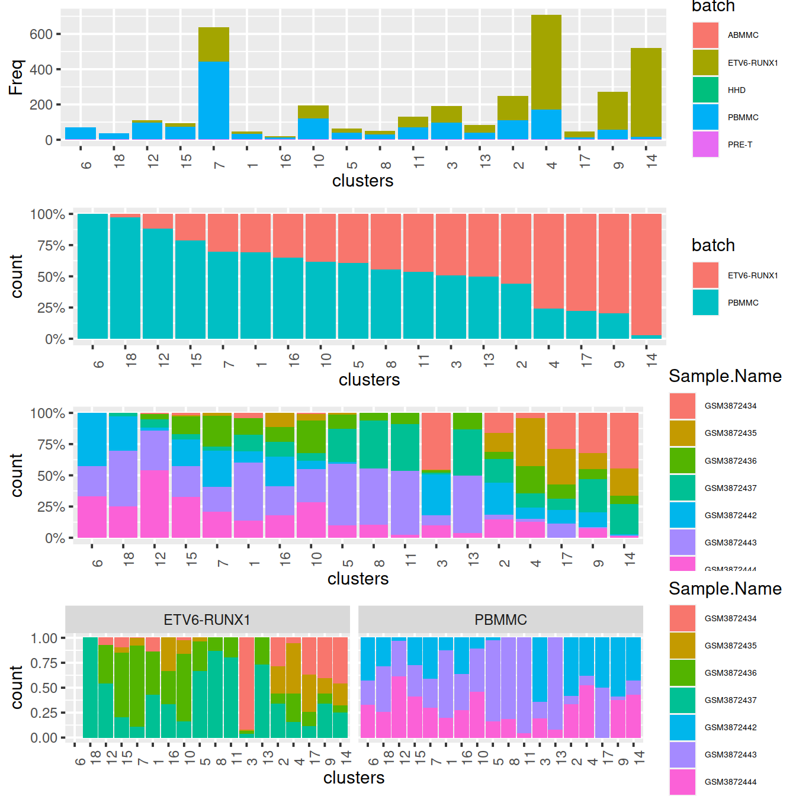

```r
rm(p1, p2, p3, p4)
```

<!-- Split by sample type: -->


```r
tab.mnn <- table(Cluster=clusters.mnn,
                 Batch=as.character(mnn.out$batch))
                 #Batch=as.character(mnn.out$source_name))
#tab.mnn <- as.data.frame(tab.mnn, stringsAsFactors=FALSE)
##tab.mnn

# Using a large pseudo.count to avoid unnecessarily
# large variances when the counts are low.
norm <- normalizeCounts(tab.mnn, pseudo_count=10)

normNoLog <- normalizeCounts(tab.mnn, pseudo_count=10, log=FALSE)

sortVecNames <- rowSums(normNoLog) %>% round(2) %>%
  sort(decreasing=TRUE) %>%
  names
```


```r
#norm2 <- normNoLog %>% data.frame() %>%
  #tibble::rownames_to_column("clusters") %>%
  #tidyr::pivot_longer(!clusters, names_to="Sample.Name", values_to="Freq")
  
norm2 <- normNoLog %>% data.frame() %>%
  rename(clusters = Cluster) %>%
  rename(Sample.Name = Batch) 
  
norm2 <- norm2 %>%
  left_join(unique(cb_sampleSheet[,c("Sample.Name", "source_name")]),
            by="Sample.Name")

norm2$clusters <- factor(norm2$clusters, levels=sortVecNames)
#norm2 <- norm2 %>% as.data.frame()

# fill by sample type
p1 <- ggplot(data=norm2, aes(x=clusters,y=Freq, fill=source_name)) +
	theme(axis.text.x=element_text(angle = 90, hjust = 0)) +
	geom_col()

# fill by sample name
p2 <- ggplot(data=norm2, aes(x=clusters,y=Freq, fill=Sample.Name)) +
	theme(axis.text.x=element_text(angle = 90, hjust = 0)) +
	geom_col()

# split by sample type
p3 <- p2 + facet_wrap(~source_name)

# show
gridExtra::grid.arrange(p1, p2, p3)
rm(p1, p2, p3)
```

<!-- Summarise by sample type: -->


```r
tab.mnn <- table(Cluster=clusters.mnn,
		 Batch=as.character(mnn.out$source_name))
##tab.mnn

# Using a large pseudo.count to avoid unnecessarily
# large variances when the counts are low.
#norm <- normalizeCounts(tab.mnn, pseudo_count=10)

normNoLog <- normalizeCounts(tab.mnn, pseudo_count=10, log=FALSE)
normNoLog <- normNoLog %>% as.data.frame.matrix()

# sort by PBMMC proportion:
normNoLog <- normNoLog %>% mutate(sum=rowSums(.))
normNoLog <- normNoLog %>% mutate(prop=PBMMC/sum)

sortVecNames <- normNoLog %>%
  tibble::rownames_to_column("clusters") %>% 
  arrange(desc(prop)) %>%
  pull(clusters)
```


```r
norm2 <- normNoLog %>%
  data.frame() %>%
  select(-sum, -prop) %>%
  tibble::rownames_to_column("clusters") %>% 
  tidyr::pivot_longer(!clusters, names_to="source_name", values_to="Freq")

norm2$clusters <- factor(norm2$clusters, levels=sortVecNames)

p1 <- ggplot(data=norm2, aes(x=clusters,y=Freq, fill=source_name)) +
	theme(axis.text.x=element_text(angle = 90, hjust = 0)) +
	geom_col()
p2 <- p1 + facet_wrap(~source_name)

# show
gridExtra::grid.arrange(p1, p2)
rm(p1, p2)
```

Have threshold for proportion of PBMMC cells, say 50%, and keep clusters with PBMMC proportion below that threshold.


```r
normNoLog$propLt090 <- normNoLog$prop < 0.9
normNoLog$propLt080 <- normNoLog$prop < 0.8
normNoLog$propLt050 <- normNoLog$prop < 0.5

norm2 <- normNoLog %>%
  data.frame() %>%
  select(-sum, -prop) %>%
  tibble::rownames_to_column("clusters") %>% 
  #tidyr::pivot_longer(!c(clusters,propLt090), names_to="source_name", values_to="Freq")
  #tidyr::pivot_longer(!c(clusters,propLt090,propLt080), names_to="source_name", values_to="Freq")
  #tidyr::pivot_longer(!c(clusters,propLt090,propLt080,propLt050), names_to="source_name", values_to="Freq")
  tidyr::pivot_longer(!c(clusters,
                         grep("propLt", colnames(normNoLog), value=TRUE)
                         ),
                      names_to="source_name",
                      values_to="Freq")

norm2$clusters <- factor(norm2$clusters, levels=sortVecNames)

p1 <- ggplot(data=norm2, aes(x=clusters,y=Freq, fill=source_name)) +
	theme(axis.text.x=element_text(angle = 90, hjust = 0)) +
	geom_col()
#p + facet_wrap(~propLt090)
#p + facet_wrap(~propLt080)
p2 <- p1 + facet_wrap(~propLt050)

# show
gridExtra::grid.arrange(p1, p2)
```

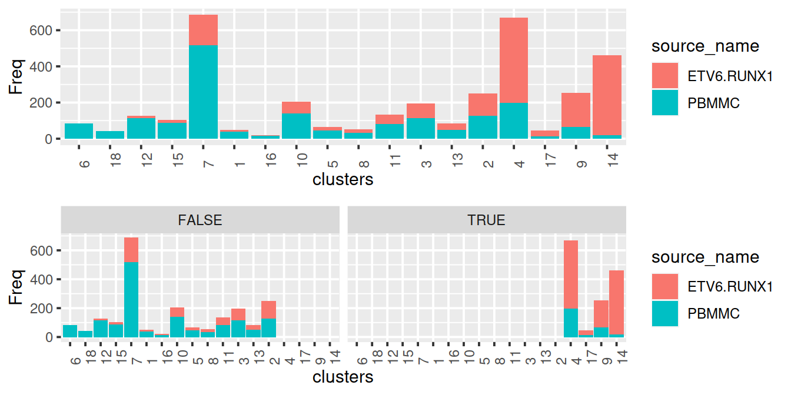

```r
rm(p1, p2)
```

Corresponding TSNE, with cluster and expression level of top gene:


```r
propLtDf <- norm2 %>% select(clusters,propLt050) %>% unique()
propLtDf$cluster <- paste0("c", propLtDf$clusters)
  
colData(mnn.out) <- colData(mnn.out) %>%
  data.frame() %>%
  left_join(propLtDf[,c("cluster","propLt050")], by="cluster") %>%
  DataFrame()
  
# cluster:
p <- plotTSNE(mnn.out, colour_by = "cluster", by_exprs_values="reconstructed")
p <- p + ggtitle("clusters")
p1 <- p + facet_wrap(~mnn.out$propLt050) +
  theme(legend.position='bottom')

# top gene for some cluster:
#genex <- rownames(demo)[1]
p <- plotTSNE(mnn.out, colour_by = genex, by_exprs_values="reconstructed")
p <- p + ggtitle(
			paste("cluster", cluToGet, genex,
			rowData(uncorrected)[genex,"Symbol"])
		)
#print(p)
p2 <- p + facet_wrap(~mnn.out$propLt050) +
  theme(legend.position='bottom')

# show
gridExtra::grid.arrange(p1, p2)
```

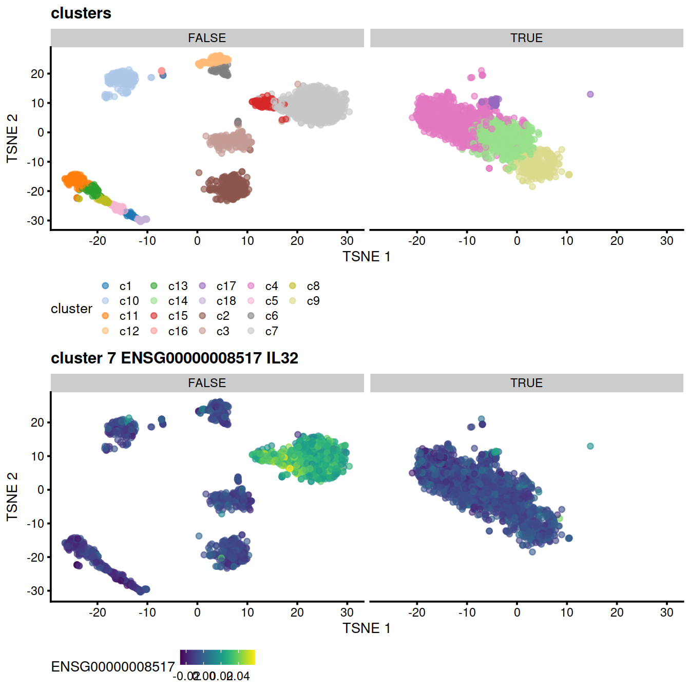

```r
rm(p, p1, p2)
```

<!-- (OK, but clusters with large number of cells of the non-PBMMC type are also excluded.) -->

Same as above but with propLt080: keep clusters with PBMMC proportion lower than 80%:


```r
propLtDf <- norm2 %>% select(clusters,propLt080) %>% unique()
propLtDf$cluster <- paste0("c", propLtDf$clusters)
propLtDf$clusters <- NULL

colData(mnn.out) <- colData(mnn.out) %>%
  data.frame() %>%
  left_join(propLtDf, by="cluster") %>%
  DataFrame()

p1 <- ggplot(data=norm2, aes(x=clusters,y=Freq, fill=source_name)) +
	theme(axis.text.x=element_text(angle = 90, hjust = 0)) +
	geom_col()
#p + facet_wrap(~propLt090)
#p + facet_wrap(~propLt080)
p2 <- p1 + facet_wrap(~propLt080)

# show
gridExtra::grid.arrange(p1, p2)
```

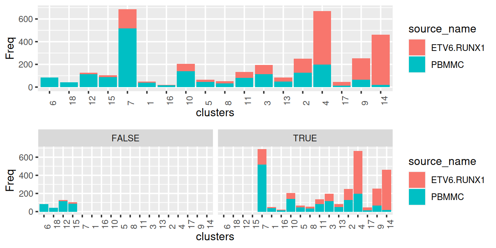

```r
rm(p1, p2)
```


```r
# cluster:
p <- plotTSNE(mnn.out, colour_by = "cluster", by_exprs_values="reconstructed")
p <- p + ggtitle("clusters")
p1 <- p + facet_wrap(~mnn.out$propLt080) +
  theme(legend.position='bottom')

# top gene for some cluster:
genex <- rownames(demo)[1]
p <- plotTSNE(mnn.out, colour_by = genex, by_exprs_values="reconstructed")
p <- p + ggtitle(
			paste("cluster", cluToGet, genex,
			rowData(uncorrected)[genex,"Symbol"])
		)
#print(p)
p2 <- p + facet_wrap(~mnn.out$propLt080) +
  theme(legend.position='bottom')

# show
gridExtra::grid.arrange(p1, p2)
```

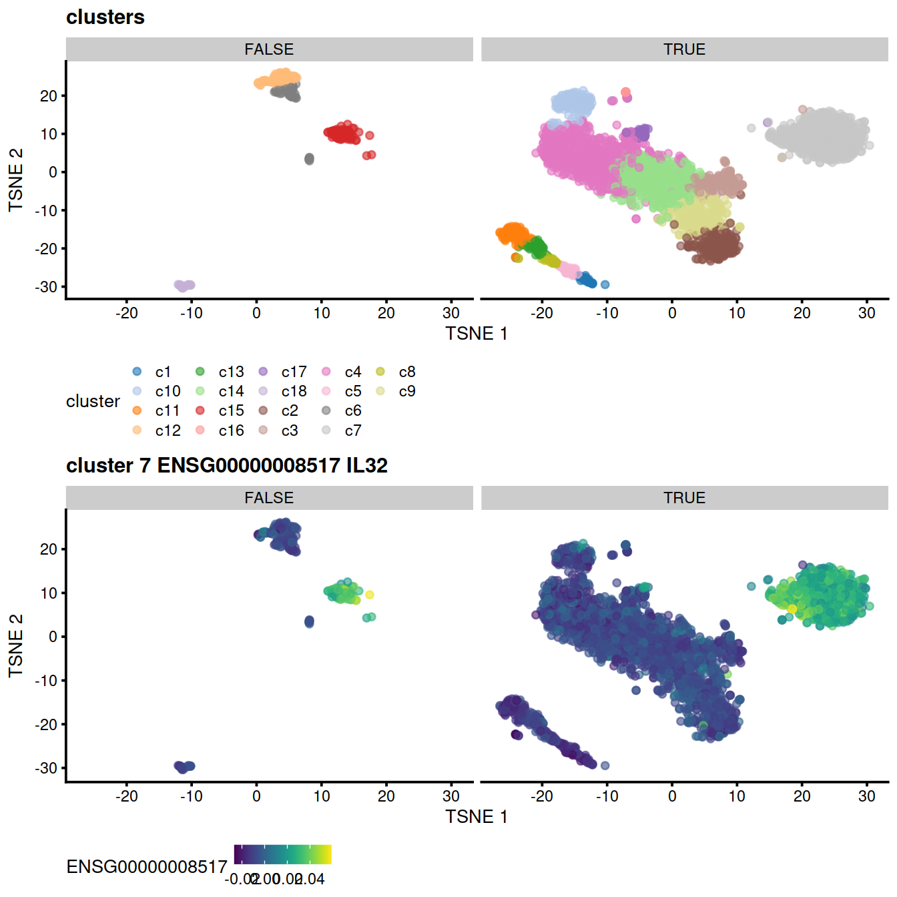

```r
rm(p, p1, p2)
```

Check expression of cell type marker genes, for PBMMC proportion threshold of 50%:


```r
for (genex in ensToShow)
{
	p <- plotTSNE(mnn.out, colour_by = genex, by_exprs_values="reconstructed") +
		ggtitle(paste(rowData(uncorrected)[genex,"Symbol"], " aka", genex)) +
		facet_wrap(~mnn.out$propLt050)
	print(p)
}
```

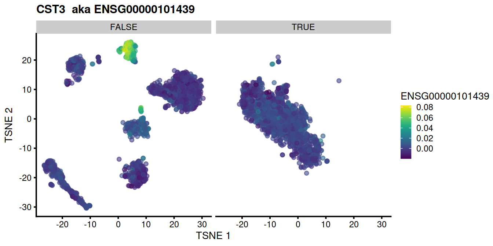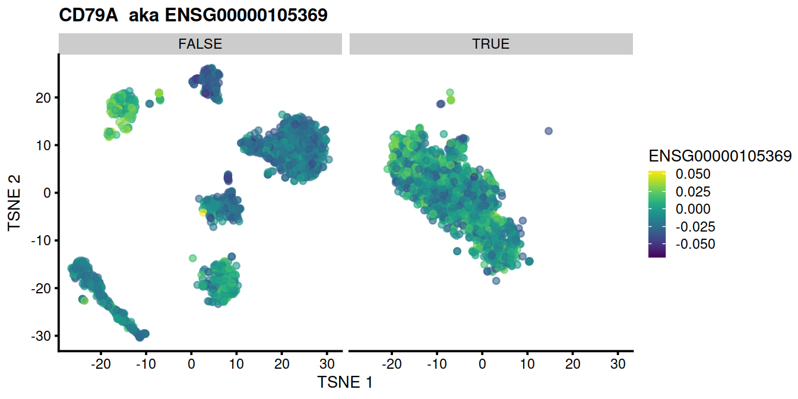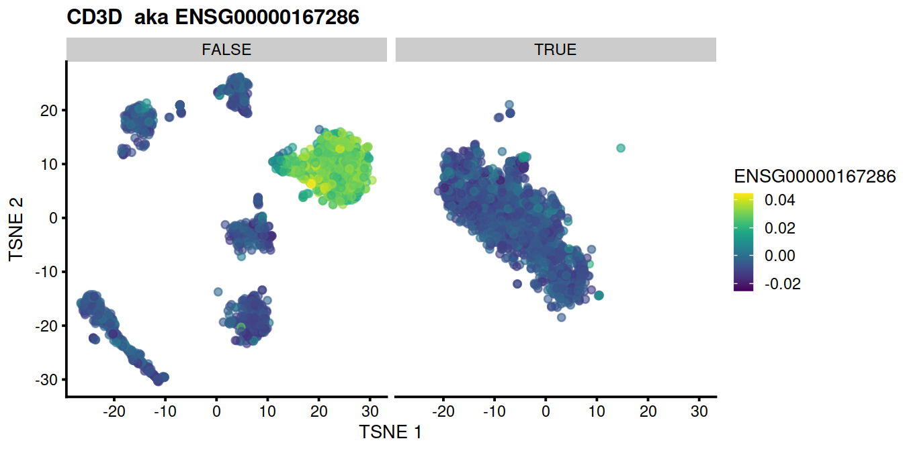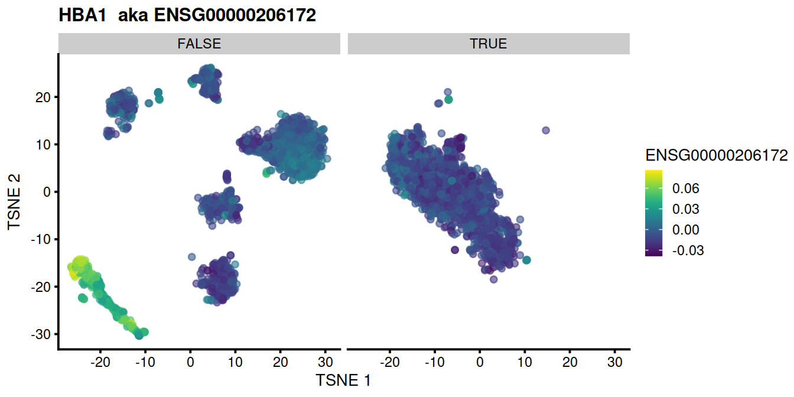

<!-- large cluster with moderate PBMMC proportion -->

Some clusters with a high proportion of PBMMC cells also comprise a large number
of cancer cells. To select clusters to keep, we could use the following inclusion
criteria:

* proportion of PBMMC cells in cluster is lower than the threshold for the
  proportion of PBMMC cells in a cluster, eg 50%
* proportion of cancer cells in cluster higher than 5% of cells of that sample
  type

The bar plots below show the clusters ordered by decreasing proportion of PBMMC
and also split by selection outcome (where 'TRUE' means inclusion).


```r
normNoLog <- normNoLog %>% tibble::rownames_to_column("cluster")
normNoLog$cluster <- paste0("c", normNoLog$cluster)

otherSplType <- setdiff(splSetVec, "PBMMC") # ok for pairs of sample types
#thdSize <- sum(normNoLog[,otherSplType])*0.02
thdSize <- sum(normNoLog[,otherSplType])*0.05
thdPropPbmmc <- 0.5

#propLtDf <- norm2 %>% select(clusters,propLt050) %>% unique()
#propLtDf$cluster <- paste0("c", propLtDf$clusters)

propLtDf <- normNoLog %>%
  filter(prop < thdPropPbmmc | !!sym(otherSplType) > thdSize) # ok for pairs of sample types

normNoLog <- normNoLog %>%
  mutate(tmpCluBool= ifelse((prop < thdPropPbmmc | !!sym(otherSplType) > thdSize), TRUE, FALSE))

colData(mnn.out) <- colData(mnn.out) %>%
  data.frame() %>%
  #select(-tmpCluBool) %>%
  left_join(normNoLog[,c("cluster", "tmpCluBool")], by="cluster") %>%
  DataFrame()

norm2 <- normNoLog %>%
  data.frame() %>%
  select(-sum, -prop) %>%
  select(-c(grep("propOut", colnames(normNoLog), value=TRUE))) %>%
  select(-c(grep("propLt", colnames(normNoLog), value=TRUE))) %>%
  #tibble::rownames_to_column("clusters") %>% 
  tidyr::pivot_longer(!c(cluster,
                         grep("tmpCluBool", colnames(normNoLog), value=TRUE)
                         ),
                      names_to="source_name",
                      values_to="Freq")

norm2$cluster <- factor(norm2$cluster,
                        levels=paste0("c", sortVecNames))

p <- ggplot(data=norm2, aes(x=cluster,y=Freq, fill=source_name)) +
	theme(axis.text.x=element_text(angle = 90, hjust = 0)) +
	geom_col()
gridExtra::grid.arrange(p, p + facet_wrap(norm2$tmpCluBool))
```

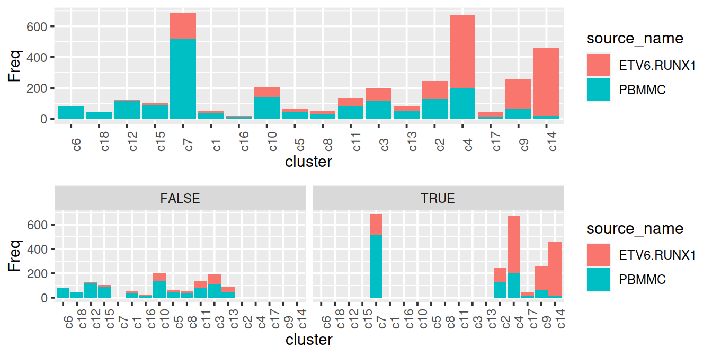

```r
rm(p)
```


```r
# cluster:
p <- plotTSNE(mnn.out, colour_by = "cluster", by_exprs_values="reconstructed")
p <- p + ggtitle("clusters")
p1 <- p + facet_wrap(~mnn.out$tmpCluBool) +
  theme(legend.position='bottom')

# show
p1
```

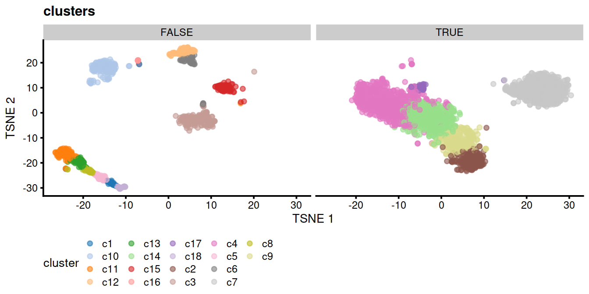

```r
rm(p, p1)
#mnn.out$tmpCluBool <- NULL
```


```r
splSetToGet2 <- gsub(",", "_", splSetToGet)
# save object?
fn <- sprintf("%s/%s/Robjects/%s_sce_nz_postDeconv%s_dsi_%s_normNoLog.Rds",
              projDir,
              outDirBit,
              setName,
              setSuf,
              splSetToGet2) # 'dsi' for data set integration
saveRDS(normNoLog, file=fn)
```

## Session information


```r
sessionInfo()
```

```
## R version 4.0.3 (2020-10-10)
## Platform: x86_64-pc-linux-gnu (64-bit)
## Running under: CentOS Linux 8
## 
## Matrix products: default
## BLAS:   /opt/R/R-4.0.3/lib64/R/lib/libRblas.so
## LAPACK: /opt/R/R-4.0.3/lib64/R/lib/libRlapack.so
## 
## locale:
##  [1] LC_CTYPE=en_GB.UTF-8       LC_NUMERIC=C              
##  [3] LC_TIME=en_GB.UTF-8        LC_COLLATE=en_GB.UTF-8    
##  [5] LC_MONETARY=en_GB.UTF-8    LC_MESSAGES=en_GB.UTF-8   
##  [7] LC_PAPER=en_GB.UTF-8       LC_NAME=C                 
##  [9] LC_ADDRESS=C               LC_TELEPHONE=C            
## [11] LC_MEASUREMENT=en_GB.UTF-8 LC_IDENTIFICATION=C       
## 
## attached base packages:
## [1] parallel  stats4    stats     graphics  grDevices utils     datasets 
## [8] methods   base     
## 
## other attached packages:
##  [1] BiocSingular_1.6.0          Cairo_1.5-12.2             
##  [3] clustree_0.4.3              ggraph_2.0.5               
##  [5] pheatmap_1.0.12             forcats_0.5.1              
##  [7] stringr_1.4.0               dplyr_1.0.6                
##  [9] purrr_0.3.4                 readr_1.4.0                
## [11] tidyr_1.1.3                 tibble_3.1.2               
## [13] tidyverse_1.3.1             bluster_1.0.0              
## [15] batchelor_1.6.3             scran_1.18.7               
## [17] scater_1.18.6               SingleCellExperiment_1.12.0
## [19] SummarizedExperiment_1.20.0 Biobase_2.50.0             
## [21] GenomicRanges_1.42.0        GenomeInfoDb_1.26.7        
## [23] IRanges_2.24.1              S4Vectors_0.28.1           
## [25] BiocGenerics_0.36.1         MatrixGenerics_1.2.1       
## [27] matrixStats_0.58.0          ggplot2_3.3.3              
## [29] knitr_1.33                 
## 
## loaded via a namespace (and not attached):
##   [1] Rtsne_0.15                ggbeeswarm_0.6.0         
##   [3] colorspace_2.0-1          ellipsis_0.3.2           
##   [5] scuttle_1.0.4             XVector_0.30.0           
##   [7] BiocNeighbors_1.8.2       fs_1.5.0                 
##   [9] rstudioapi_0.13           farver_2.1.0             
##  [11] graphlayouts_0.7.1        ggrepel_0.9.1            
##  [13] RSpectra_0.16-0           fansi_0.4.2              
##  [15] lubridate_1.7.10          xml2_1.3.2               
##  [17] codetools_0.2-18          sparseMatrixStats_1.2.1  
##  [19] polyclip_1.10-0           jsonlite_1.7.2           
##  [21] ResidualMatrix_1.0.0      broom_0.7.6              
##  [23] dbplyr_2.1.1              uwot_0.1.10              
##  [25] ggforce_0.3.3             compiler_4.0.3           
##  [27] httr_1.4.2                dqrng_0.3.0              
##  [29] backports_1.2.1           assertthat_0.2.1         
##  [31] Matrix_1.3-3              limma_3.46.0             
##  [33] cli_2.5.0                 tweenr_1.0.2             
##  [35] htmltools_0.5.1.1         tools_4.0.3              
##  [37] rsvd_1.0.5                igraph_1.2.6             
##  [39] gtable_0.3.0              glue_1.4.2               
##  [41] GenomeInfoDbData_1.2.4    Rcpp_1.0.6               
##  [43] cellranger_1.1.0          jquerylib_0.1.4          
##  [45] vctrs_0.3.8               DelayedMatrixStats_1.12.3
##  [47] xfun_0.23                 ps_1.6.0                 
##  [49] beachmat_2.6.4            rvest_1.0.0              
##  [51] lifecycle_1.0.0           irlba_2.3.3              
##  [53] statmod_1.4.36            edgeR_3.32.1             
##  [55] zlibbioc_1.36.0           MASS_7.3-54              
##  [57] scales_1.1.1              tidygraph_1.2.0          
##  [59] hms_1.0.0                 RColorBrewer_1.1-2       
##  [61] yaml_2.2.1                gridExtra_2.3            
##  [63] sass_0.4.0                stringi_1.6.1            
##  [65] highr_0.9                 checkmate_2.0.0          
##  [67] BiocParallel_1.24.1       rlang_0.4.11             
##  [69] pkgconfig_2.0.3           bitops_1.0-7             
##  [71] evaluate_0.14             lattice_0.20-44          
##  [73] labeling_0.4.2            cowplot_1.1.1            
##  [75] tidyselect_1.1.1          magrittr_2.0.1           
##  [77] bookdown_0.22             R6_2.5.0                 
##  [79] generics_0.1.0            DelayedArray_0.16.3      
##  [81] DBI_1.1.1                 pillar_1.6.1             
##  [83] haven_2.4.1               withr_2.4.2              
##  [85] RCurl_1.98-1.3            modelr_0.1.8             
##  [87] crayon_1.4.1              utf8_1.2.1               
##  [89] rmarkdown_2.8             viridis_0.6.1            
##  [91] locfit_1.5-9.4            grid_4.0.3               
##  [93] readxl_1.3.1              FNN_1.1.3                
##  [95] reprex_2.0.0              digest_0.6.27            
##  [97] munsell_0.5.0             beeswarm_0.3.1           
##  [99] viridisLite_0.4.0         vipor_0.4.5              
## [101] bslib_0.2.5
```


