# Dimensionality reduction for analysis {#dimRedForAnaTop}

<style>
div.blue {background-color:#e6f0ff; border-radius: 5px; padding: 20px;}
</style>
<div class = "blue">
**TODO** add text and fix fig size.
</div>


```r
projDir <- params$projDir
dirRel <- params$dirRel
outDirBit <- params$outDirBit
cacheBool <- params$cacheBool
cacheBool <- params$cacheBool
setName <- params$setName
setSuf <- params$setSuf

if(params$bookType == "mk") {
	setName <- "caron"
	setSuf <- "_5hCellPerSpl"
	dirRel <- ".."
}

nbPcToComp <- 50
```


```r
library(ggplot2)
library(scater)
library(scran)
library(dplyr)
library(Cairo)
fontsize <- theme(axis.text=element_text(size=12),
		  axis.title=element_text(size=16))
```

## Load data

We will load the R file keeping the SCE object with the normalised counts for 500 cells per sample.


```r
# Read object in:
tmpFn <- sprintf("%s/%s/Robjects/%s_sce_nz_postDeconv%s_dimRed.Rds",
		 projDir, outDirBit, setName, setSuf)
print(tmpFn)
```

```
## [1] "/ssd/personal/baller01/20200511_FernandesM_ME_crukBiSs2020/AnaWiSce/AnaKmWiC/Robjects/caron_sce_nz_postDeconv_5hCellPerSpl_dimRed.Rds"
```

```r
if(!file.exists(tmpFn))
{
	knitr::knit_exit()
}
sce <- readRDS(tmpFn)
sce
```

```
## class: SingleCellExperiment 
## dim: 16629 5500 
## metadata(0):
## assays(2): counts logcounts
## rownames(16629): ENSG00000237491 ENSG00000225880 ... ENSG00000275063
##   ENSG00000271254
## rowData names(11): ensembl_gene_id external_gene_name ... detected
##   gene_sparsity
## colnames: NULL
## colData names(16): Barcode Run ... cell_sparsity sizeFactor
## reducedDimNames(3): PCA TSNE UMAP
## altExpNames(0):
```

```r
#any(duplicated(rowData(sce)$ensembl_gene_id))
# some function(s) used below complain about 'strand' already being used in row data,
# so rename that column now:
colnames(rowData(sce))[colnames(rowData(sce)) == "strand"] <- "strandNum"

# also get feature selection outcome
tmpFn <- sprintf("%s/%s/Robjects/%s_sce_nz_postDeconv%s_featSel.Rds",
		 projDir, outDirBit, setName, setSuf)
tmpList <- readRDS(tmpFn)
dec.sce <- tmpList$dec.sce
hvg.index <- tmpList$hvg.index
rm(tmpList)
```

## Denoising expression values using PCA

Aim: use the trend fitted above to identify PCs linked to biology.

Assumption: biology drives most of the variance hence should be captured by the first PCs, while technical noise affects each gene independently, hence is captured by later PCs.

Logic: Compute the sum of the technical component across genes used in the PCA, use it as the amount of variance not related to biology and that we should therefore remove. Later PCs are excluded until the amount of variance they account for matches that corresponding to the technical component. 


```r
var.fit <- metadata(dec.sce)

# remove uninteresting PCs:
#options(BiocSingularParam.default=IrlbaParam())
sce <- denoisePCA(sce, technical=var.fit$trend, assay.type="logcounts")
rm(var.fit)

# check assay names, should see 'PCA':
##assayNames(sce)
# check dimension of the PC table:
##dim(reducedDim(sce, "PCA")) 

sce.pca <- reducedDim(sce, "PCA") # get copy of PCA matrix
tmpCol <- rep("grey", nbPcToComp) # set colours to show selected PCs in green
tmpCol[1:dim(sce.pca)[2]] <- "green"
barplot(attributes(sce.pca)$percentVar[1:nbPcToComp],
        main=sprintf("Scree plot for the %s first PCs", nbPcToComp),
        names.arg=1:nbPcToComp,
        col=tmpCol,
        cex.names = 0.8)
```

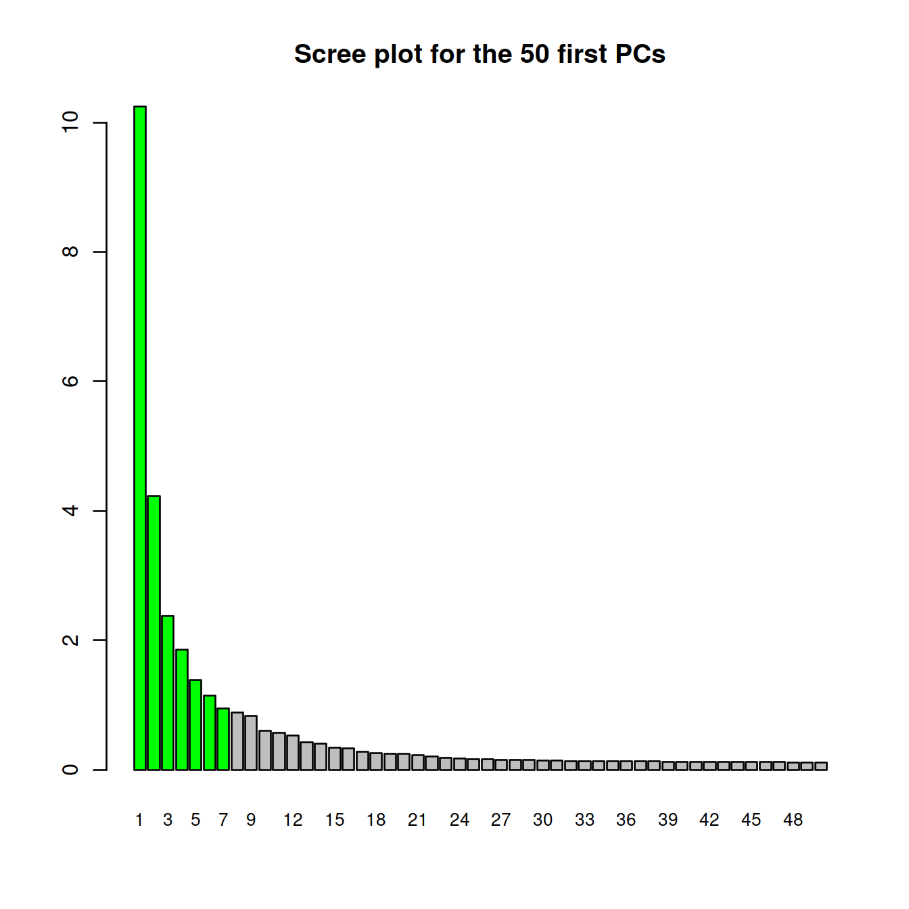

```r
# cumulative proportion of variance explained by selected PCs
round(cumsum(attributes(sce.pca)$percentVar)[1:dim(sce.pca)[2]])
```

```
## [1] 10 14 17 19 20 21 22
```

```r
# plot on PC1 and PC2 plane:
plotPCA(sce, colour_by = "Sample.Name")
```

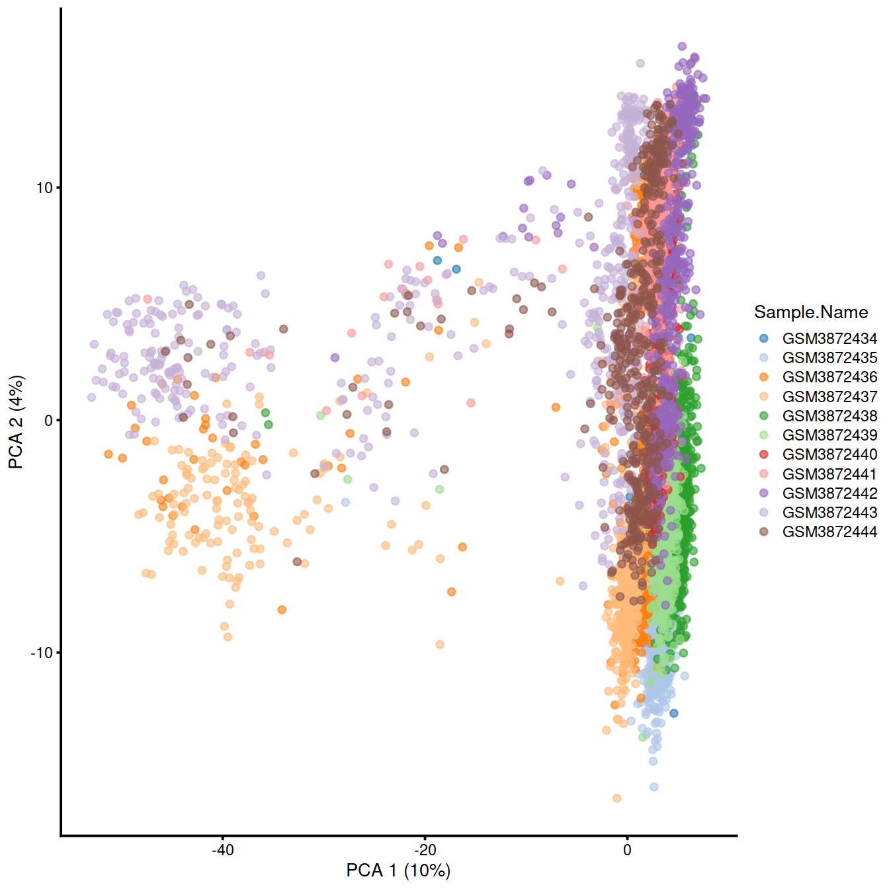

```r
#require(knitr); knit_exit()
rm(sce.pca, tmpCol)
```

Show cells on plane for PC1 and PC2:


```r
plotReducedDim(sce,
	       dimred = "PCA",
	       ncomponents = 3,
	       colour_by = "Sample.Name") +
fontsize
```

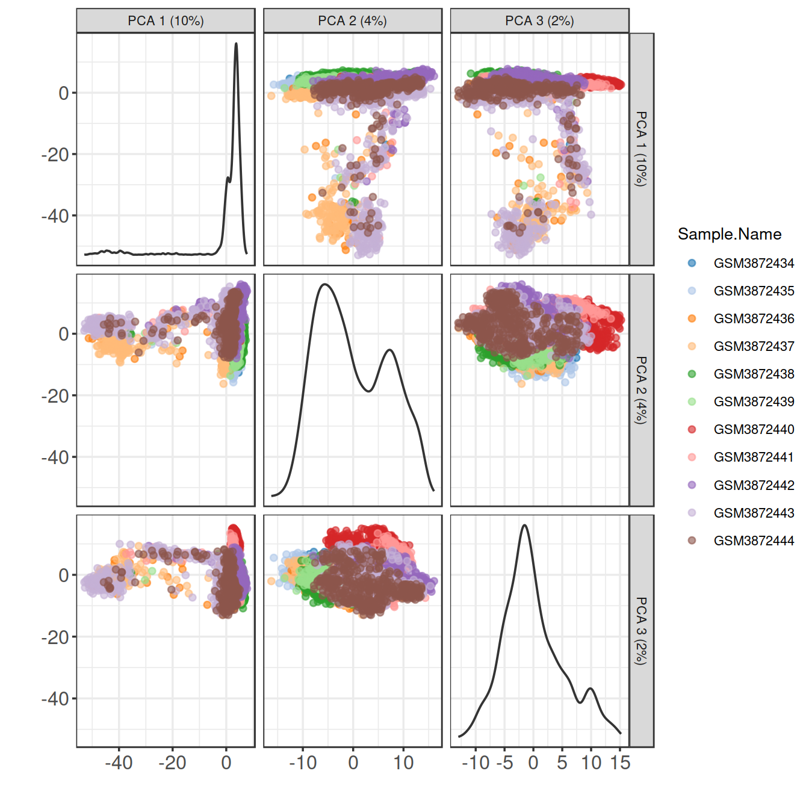

## Visualise expression patterns of some HVGs


```r
o <- order(dec.sce$bio, decreasing=TRUE)
chosen.genes.index <- o[1:20]
dec.sce %>%
	data.frame() %>%
	tibble::rownames_to_column("ensembl_gene_id") %>%
	right_join(data.frame(rowData(sce)[chosen.genes.index,]), by="ensembl_gene_id") %>%
	dplyr::select(ensembl_gene_id, Symbol, bio, FDR) %>%
	arrange(-bio)
```

```
##    ensembl_gene_id   Symbol       bio           FDR
## 1  ENSG00000244734      HBB 10.969829  0.000000e+00
## 2  ENSG00000188536     HBA2  8.722135  0.000000e+00
## 3  ENSG00000206172     HBA1  7.946979  0.000000e+00
## 4  ENSG00000223609      HBD  3.837750 4.214717e-197
## 5  ENSG00000206177      HBM  2.855318 6.765734e-179
## 6  ENSG00000019582     CD74  2.774036  1.337160e-31
## 7  ENSG00000169877     AHSP  2.744183 1.728602e-158
## 8  ENSG00000204287  HLA-DRA  2.099098  5.828412e-18
## 9  ENSG00000133742      CA1  2.053374 3.228594e-118
## 10 ENSG00000147454 SLC25A37  1.706164  7.448037e-64
## 11 ENSG00000158578    ALAS2  1.683638 5.951544e-120
## 12 ENSG00000165949    IFI27  1.584846 9.437875e-130
## 13 ENSG00000090013    BLVRB  1.520814  1.198306e-73
## 14 ENSG00000100721    TCL1A  1.360332  5.085333e-11
## 15 ENSG00000211592     IGKC  1.250479  4.764279e-30
## 16 ENSG00000170180     GYPA  1.221654  1.852283e-88
## 17 ENSG00000145335     SNCA  1.218528  1.198306e-73
## 18 ENSG00000170345      FOS  1.203750  2.080415e-06
## 19 ENSG00000004939   SLC4A1  1.118489  1.112527e-73
## 20 ENSG00000090382      LYZ  1.114020  4.912100e-90
```

```r
rm(dec.sce)
```

On PCA plot:


```r
# make and store PCA plot for top HVG 1:
pca1 <- plotReducedDim(sce,
		       dimred="PCA",
		       colour_by=rowData(sce)[chosen.genes.index[1],"ensembl_gene_id"]) +
fontsize  # + coord_fixed()
# make and store PCA plot for top HVG 2:
pca2 <- plotReducedDim(sce,
		       dimred="PCA",
		       colour_by=rowData(sce)[chosen.genes.index[2],"ensembl_gene_id"]) +
fontsize # + coord_fixed()

pca1
```

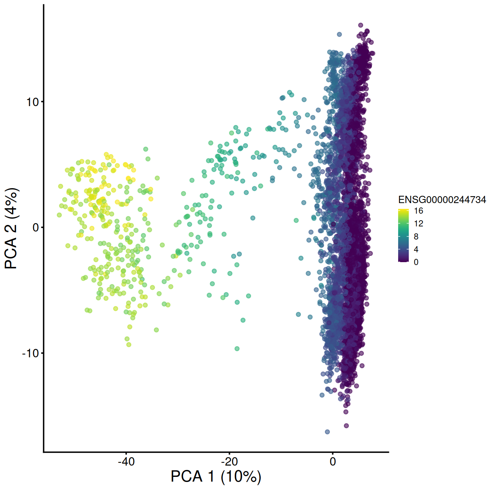

```r
pca2
```

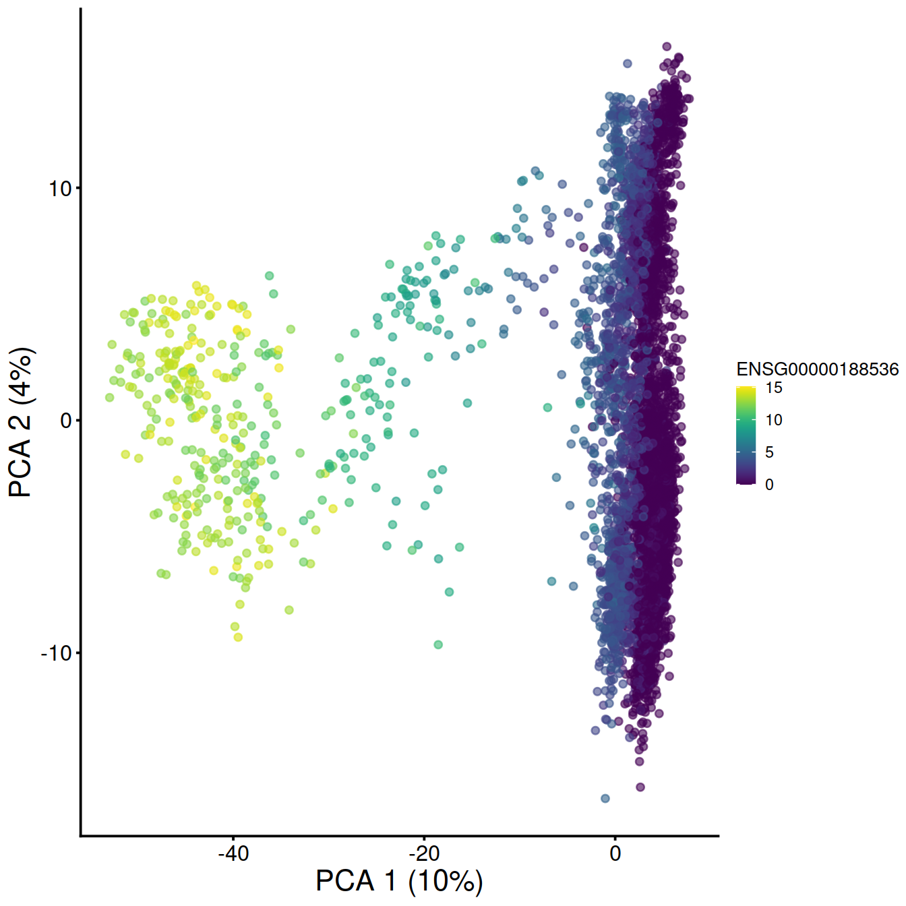


```r
# display plots next to each other:
# multiplot(pca1, pca2, cols=2)

pca1 + facet_wrap(. ~ sce$source_name) + coord_fixed()
```

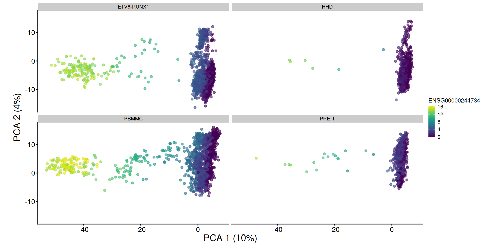

```r
pca2 + facet_wrap(. ~ sce$source_name) + coord_fixed()
```

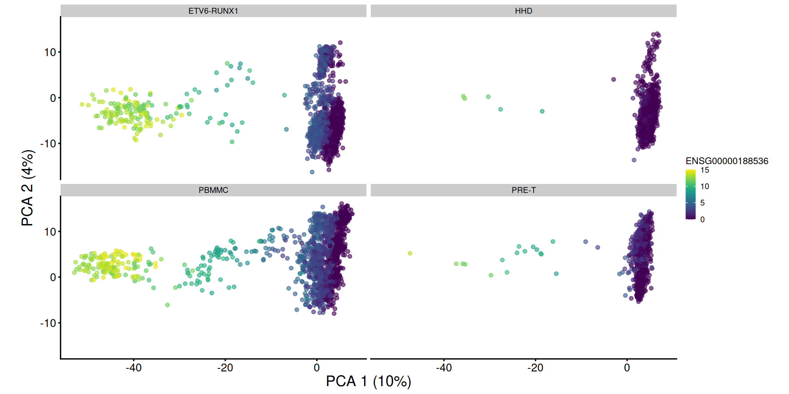

```r
rm(pca1, pca2)
```

On t-SNE plot:


```r
# plot TSNE, accessing counts for the gene of interest with the ID used to name rows in the count matrix:
# make and store TSNE plot for top HVG 1:
tsne1 <- plotTSNE(sce, colour_by=rowData(sce)[chosen.genes.index[1],"ensembl_gene_id"]) + fontsize
# make and store TSNE plot for top HVG 2:
tsne2 <- plotTSNE(sce, colour_by=rowData(sce)[chosen.genes.index[2],"ensembl_gene_id"]) + fontsize

tsne1
```

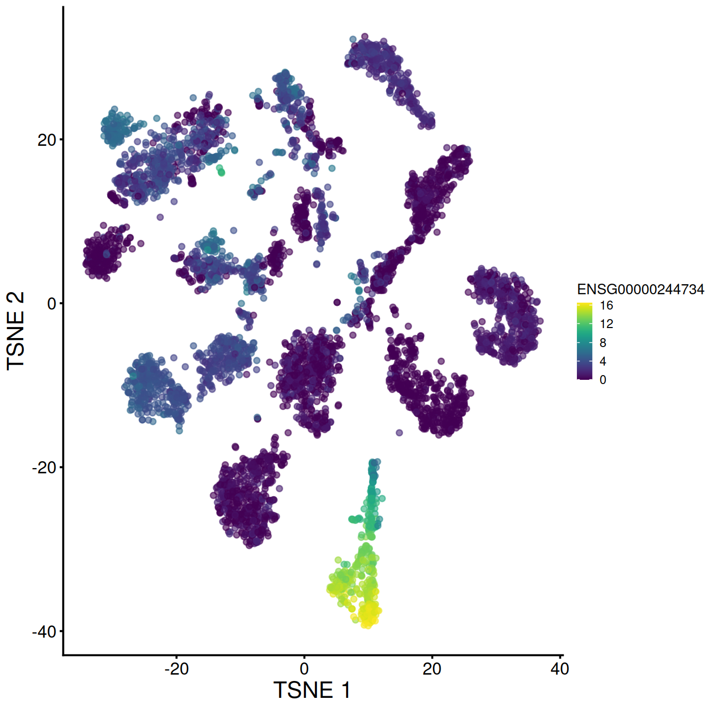

```r
tsne2
```

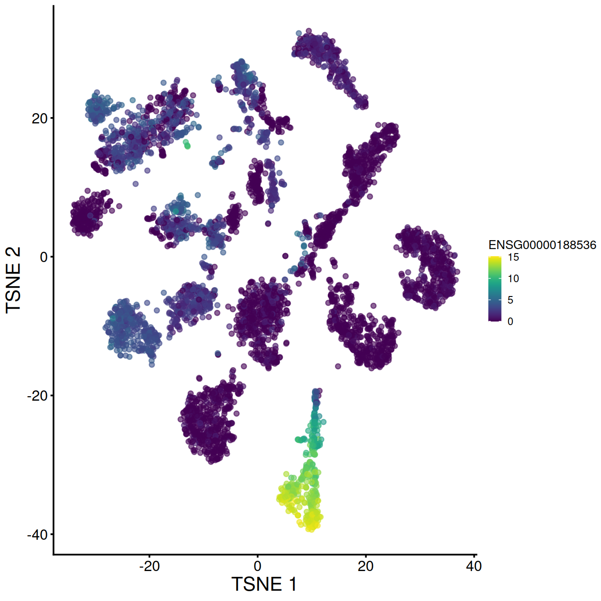


```r
# display plots next to each other:
#multiplot(tsne1, tsne2, cols=2)

tsne1 + facet_wrap(. ~ sce$source_name)
```

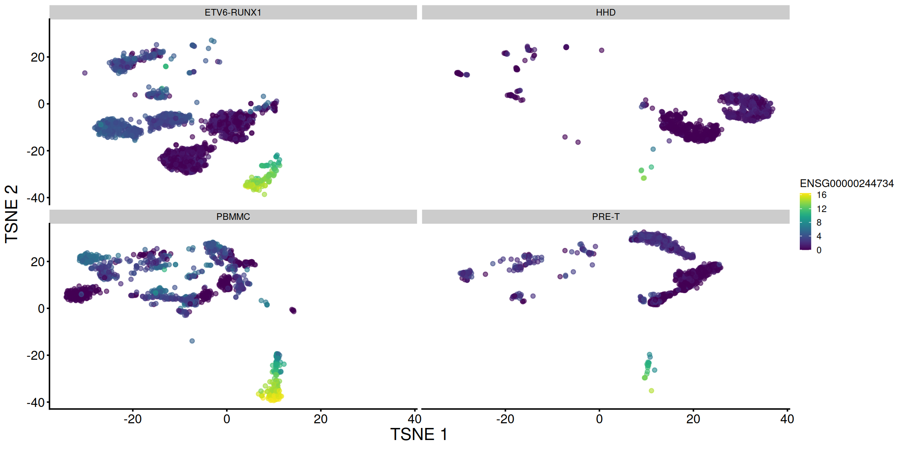

```r
tsne2 + facet_wrap(. ~ sce$source_name)
```

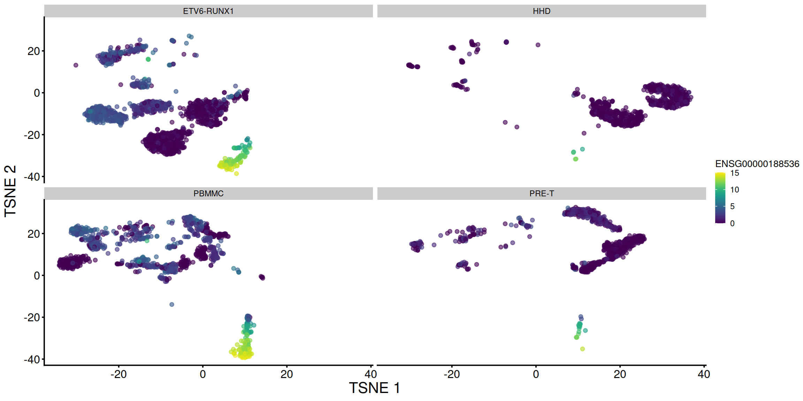

```r
# display plots next to each other, splitting each by sample:
#multiplot(tsne1 + facet_grid(. ~ sce$Sample2), tsne2 + facet_grid(. ~ sce$Sample2), cols=2)

rm(tsne1, tsne2)
```

Write R object to file


```r
tmpFn <- sprintf("%s/%s/Robjects/%s_sce_nz_postDeconv%s_denoised.Rds", projDir, outDirBit, setName, setSuf)
print(tmpFn)
```

```
## [1] "/ssd/personal/baller01/20200511_FernandesM_ME_crukBiSs2020/AnaWiSce/AnaKmWiC/Robjects/caron_sce_nz_postDeconv_5hCellPerSpl_denoised.Rds"
```

```r
saveRDS(sce, file=tmpFn)
```

Genes correlated with PC1:

<!-- http://bioinformatics.age.mpg.de/presentations-tutorials/presentations/modules/single-cell//bioconductor_tutorial.html -->


```r
sce <- readRDS(tmpFn)
rownames(sce) <- uniquifyFeatureNames(rowData(sce)$ensembl_gene_id,
				      rowData(sce)$Symbol)
pc1 <- reducedDim(sce, "PCA")[,1]
design <- model.matrix(~pc1)
library(limma)
fit <- lmFit(logcounts(sce), design)
fit <- eBayes(fit, trend=TRUE, robust=TRUE)
topTab <- topTable(fit)
head(topTab)
```

```
##            logFC   AveExpr         t P.Value adj.P.Val        B
## ALAS2 -0.1305501 0.4248282 -253.8128       0         0 6988.979
## HBD   -0.1918066 0.8269274 -247.7593       0         0 6866.706
## AHSP  -0.1626882 0.6283138 -227.8409       0         0 6446.080
## HBM   -0.1642649 0.6132294 -218.3411       0         0 6234.849
## HBA1  -0.2662693 1.6675081 -212.9019       0         0 6110.599
## HBA2  -0.2748459 1.9143801 -191.7632       0         0 5603.082
```

```r
rm(topTab)
```


```r
library(pheatmap)
de.genes <- rownames(topTable(fit, coef=2, n=50))
heat.vals <- logcounts(sce)[de.genes,]
heat.vals <- heat.vals - rowMeans(heat.vals)
heat.vals[heat.vals > 2] <- 2
heat.vals[heat.vals < -2] <- -2
p <- pheatmap(heat.vals[,order(pc1)], cluster_cols=FALSE)
```

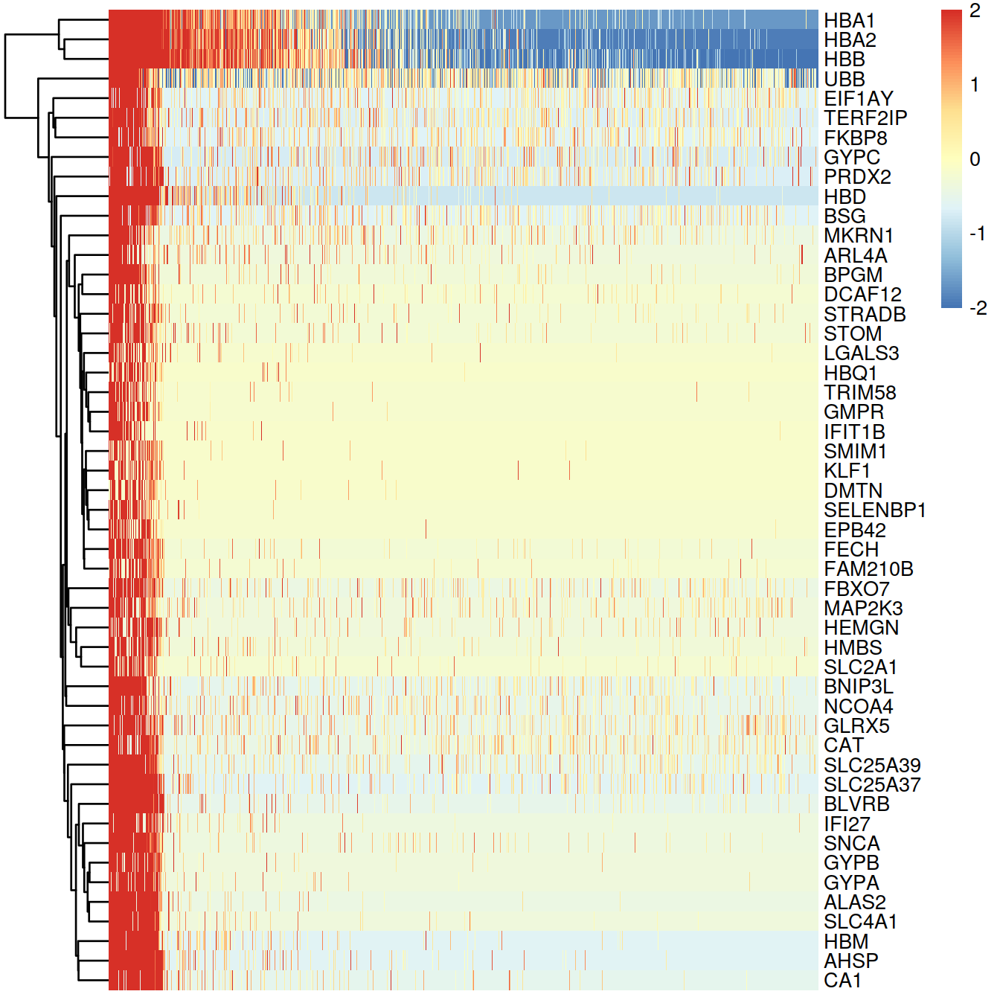

```r
#plot(p$gtable)
rm(pc1, design, fit, de.genes, heat.vals)
rm(sce)
```

## Session information

<details>

```r
sessionInfo()
```

```
## R version 4.0.3 (2020-10-10)
## Platform: x86_64-pc-linux-gnu (64-bit)
## Running under: CentOS Linux 8
## 
## Matrix products: default
## BLAS:   /opt/R/R-4.0.3/lib64/R/lib/libRblas.so
## LAPACK: /opt/R/R-4.0.3/lib64/R/lib/libRlapack.so
## 
## locale:
##  [1] LC_CTYPE=en_GB.UTF-8       LC_NUMERIC=C              
##  [3] LC_TIME=en_GB.UTF-8        LC_COLLATE=en_GB.UTF-8    
##  [5] LC_MONETARY=en_GB.UTF-8    LC_MESSAGES=en_GB.UTF-8   
##  [7] LC_PAPER=en_GB.UTF-8       LC_NAME=C                 
##  [9] LC_ADDRESS=C               LC_TELEPHONE=C            
## [11] LC_MEASUREMENT=en_GB.UTF-8 LC_IDENTIFICATION=C       
## 
## attached base packages:
## [1] parallel  stats4    stats     graphics  grDevices utils     datasets 
## [8] methods   base     
## 
## other attached packages:
##  [1] pheatmap_1.0.12             limma_3.46.0               
##  [3] Cairo_1.5-12.2              dplyr_1.0.5                
##  [5] scran_1.18.7                scater_1.18.6              
##  [7] SingleCellExperiment_1.12.0 SummarizedExperiment_1.20.0
##  [9] Biobase_2.50.0              GenomicRanges_1.42.0       
## [11] GenomeInfoDb_1.26.7         IRanges_2.24.1             
## [13] S4Vectors_0.28.1            BiocGenerics_0.36.1        
## [15] MatrixGenerics_1.2.1        matrixStats_0.58.0         
## [17] ggplot2_3.3.3               knitr_1.32                 
## 
## loaded via a namespace (and not attached):
##  [1] bitops_1.0-7              RColorBrewer_1.1-2       
##  [3] tools_4.0.3               bslib_0.2.4              
##  [5] utf8_1.2.1                R6_2.5.0                 
##  [7] irlba_2.3.3               vipor_0.4.5              
##  [9] DBI_1.1.1                 colorspace_2.0-0         
## [11] withr_2.4.2               tidyselect_1.1.1         
## [13] gridExtra_2.3             compiler_4.0.3           
## [15] BiocNeighbors_1.8.2       DelayedArray_0.16.3      
## [17] labeling_0.4.2            bookdown_0.22            
## [19] sass_0.3.1                scales_1.1.1             
## [21] stringr_1.4.0             digest_0.6.27            
## [23] rmarkdown_2.7             XVector_0.30.0           
## [25] pkgconfig_2.0.3           htmltools_0.5.1.1        
## [27] sparseMatrixStats_1.2.1   highr_0.9                
## [29] rlang_0.4.10              DelayedMatrixStats_1.12.3
## [31] jquerylib_0.1.3           generics_0.1.0           
## [33] farver_2.1.0              jsonlite_1.7.2           
## [35] BiocParallel_1.24.1       RCurl_1.98-1.3           
## [37] magrittr_2.0.1            BiocSingular_1.6.0       
## [39] GenomeInfoDbData_1.2.4    scuttle_1.0.4            
## [41] Matrix_1.3-2              Rcpp_1.0.6               
## [43] ggbeeswarm_0.6.0          munsell_0.5.0            
## [45] fansi_0.4.2               viridis_0.6.0            
## [47] lifecycle_1.0.0           stringi_1.5.3            
## [49] yaml_2.2.1                edgeR_3.32.1             
## [51] zlibbioc_1.36.0           grid_4.0.3               
## [53] dqrng_0.3.0               crayon_1.4.1             
## [55] lattice_0.20-44           cowplot_1.1.1            
## [57] beachmat_2.6.4            splines_4.0.3            
## [59] locfit_1.5-9.4            pillar_1.6.0             
## [61] igraph_1.2.6              codetools_0.2-18         
## [63] glue_1.4.2                evaluate_0.14            
## [65] vctrs_0.3.7               gtable_0.3.0             
## [67] purrr_0.3.4               assertthat_0.2.1         
## [69] xfun_0.22                 rsvd_1.0.5               
## [71] viridisLite_0.4.0         tibble_3.1.1             
## [73] beeswarm_0.3.1            bluster_1.0.0            
## [75] statmod_1.4.35            ellipsis_0.3.2
```
</details>
