# Dimensionality reduction for visualisation {#dimRedForVizTop}

<!--
Should have Caron and HCA separately
-->


```r
projDir <- params$projDir
dirRel <- params$dirRel
outDirBit <- params$outDirBit
```


```r
library(Cairo)
```

In part 1 we gathered the data, aligned reads, checked quality, and normalised read counts. We will now identify genes to focus on, use visualisation to explore the data, collapse the data set, cluster cells by their expression profile and identify genes that best characterise these cell populations. These main steps are shown below [@ANDREWS2018114]. 


<!--knitr::include_graphics(tmpFn, auto_pdf = TRUE)-->

We'll first explain dimensionality reduction for visualisation, using Principal Component Analysis, t-SNE and UMAP.


## Principal Component Analysis

In a single cell RNA-seq (scRNASeq) data set, each cell is described by the expression level of thoushands of genes.

The total number of genes measured is referred to as dimensionality. Each gene measured is one dimension in the space characterising the data set. Many genes will little vary across cells and thus be uninformative when comparing cells. Also, because some genes will have correlated expression patterns, some information is redundant. Moreover, we can represent data in three dimensions, not more. So reducing the number of useful dimensions is necessary.

### Description

The data set: a matrix with one row per sample and one variable per column. Here samples are cells and each variable is the normalised read count for a given gene.

The space: each cell is associated to a point in a multi-dimensional space where each gene is a dimension.

The aim: to find a new set of variables defining a space with fewer dimensions while losing as little information as possible.

Out of a set of variables (read counts), PCA defines new variables called Principal Components (PCs) that best capture the variability observed amongst samples (cells), see [@field2012discovering] for example.

The number of variables does not change. Only the fraction of variance captured by each variable differs.
The first PC explains the highest proportion of variance possible (bound by prperties of PCA).
The second PC explains the highest proportion of variance not explained by the first PC.
PCs each explain a decreasing amount of variance not explained by the previous ones.
Each PC is a dimension in the new space.

The total amount of variance explained by the first few PCs is usually such that excluding remaining PCs, ie dimensions, loses little information. The stronger the correlation between the initial variables, the stronger the reduction in dimensionality. PCs to keep can be chosen as those capturing at least as much as the average variance per initial variable or using a scree plot, see below.

PCs are linear combinations of the initial variables. PCs represent the same amount of information as the initial set and enable its restoration. The data is not altered. We only look at it in a different way.

About the mapping function from the old to the new space:

- it is linear
- it is inverse, to restore the original space
- it relies on orthogonal PCs so that the total variance remains the same.

Two transformations of the data are necessary:

- center the data so that the sample mean for each column is 0 so the covariance matrix of the intial matrix takes a simple form
- scale variance to 1, ie standardize, to avoid PCA loading on variables with large variance.

### Example

Here we will make a simple data set of 100 samples and 2 variables, perform PCA and visualise on the initial plane the data set and PCs [@pca_blog_Patcher2014].


```r
library(ggplot2)
fontsize <- theme(axis.text=element_text(size=12),
                  axis.title=element_text(size=16))
```

Let's make and plot a data set.


```r
set.seed(123)            #sets the seed for random number generation.
 x <- 1:100              #creates a vector x with numbers from 1 to 100
 ex <- rnorm(100, 0, 30) #100 normally distributed rand. nos. w/ mean=0, s.d.=30
 ey <- rnorm(100, 0, 30) # " " 
 y <- 30 + 2 * x         #sets y to be a vector that is a linear function of x
 x_obs <- x + ex         #adds "noise" to x
 y_obs <- y + ey         #adds "noise" to y
 P <- cbind(x_obs,y_obs) #places points in matrix
 plot(P,asp=1,col=1) #plot points
 points(mean(x_obs),mean(y_obs),col=3, pch=19) #show center
```


Center the data and compute covariance matrix.


```r
M <- cbind(x_obs - mean(x_obs), y_obs - mean(y_obs)) #centered matrix
MCov <- cov(M)          #creates covariance matrix
```

Compute the principal axes, ie eigenvectors and corresponding eigenvalues.

An eigenvector is a direction and an eigenvalue is a number measuring the spread of the data in that direction. The eigenvector with the highest eigenvalue is the first principal component.

The eigenvectors of the covariance matrix provide the principal axes, and the eigenvalues quantify the fraction of variance explained in each component.


```r
eigenValues <- eigen(MCov)$values       #compute eigenvalues
eigenVectors <- eigen(MCov)$vectors     #compute eigenvectors

# or use 'singular value decomposition' of the matrix
d <- svd(M)$d          #the singular values
v <- svd(M)$v          #the right singular vectors
```

Let's plot the principal axes.

First PC:


```r
# PC 1:
 plot(P,asp=1,col=1) #plot points
 points(mean(x_obs),mean(y_obs),col=3, pch=19) #show center
lines(x_obs,eigenVectors[2,1]/eigenVectors[1,1]*M[x]+mean(y_obs),col=8)
```

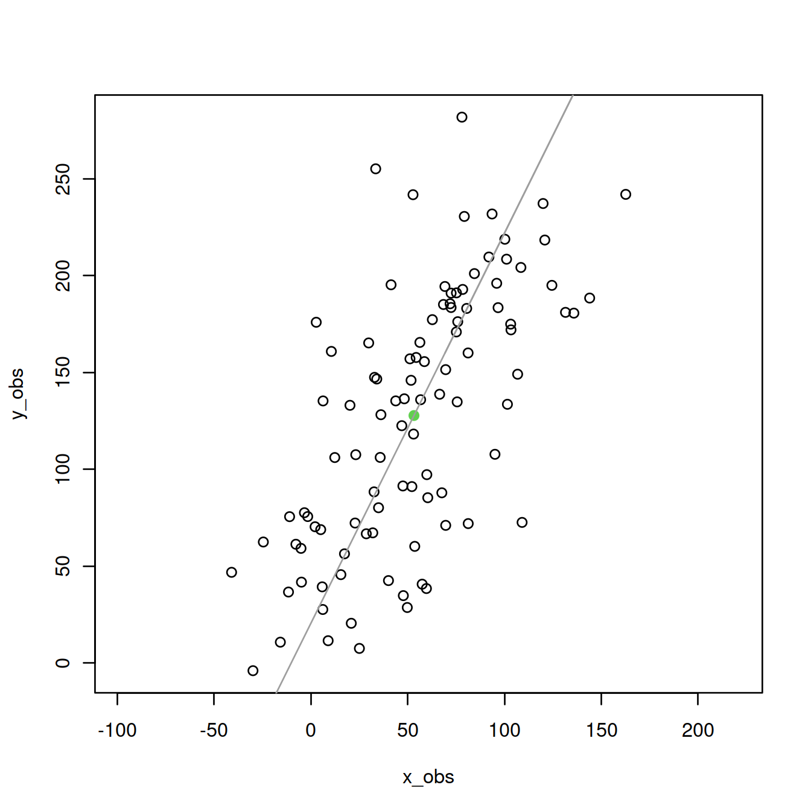

Second PC:


```r
 plot(P,asp=1,col=1) #plot points
 points(mean(x_obs),mean(y_obs),col=3, pch=19) #show center
# PC 1:
lines(x_obs,eigenVectors[2,1]/eigenVectors[1,1]*M[x]+mean(y_obs),col=8)
# PC 2:
lines(x_obs,eigenVectors[2,2]/eigenVectors[1,2]*M[x]+mean(y_obs),col=8)
```

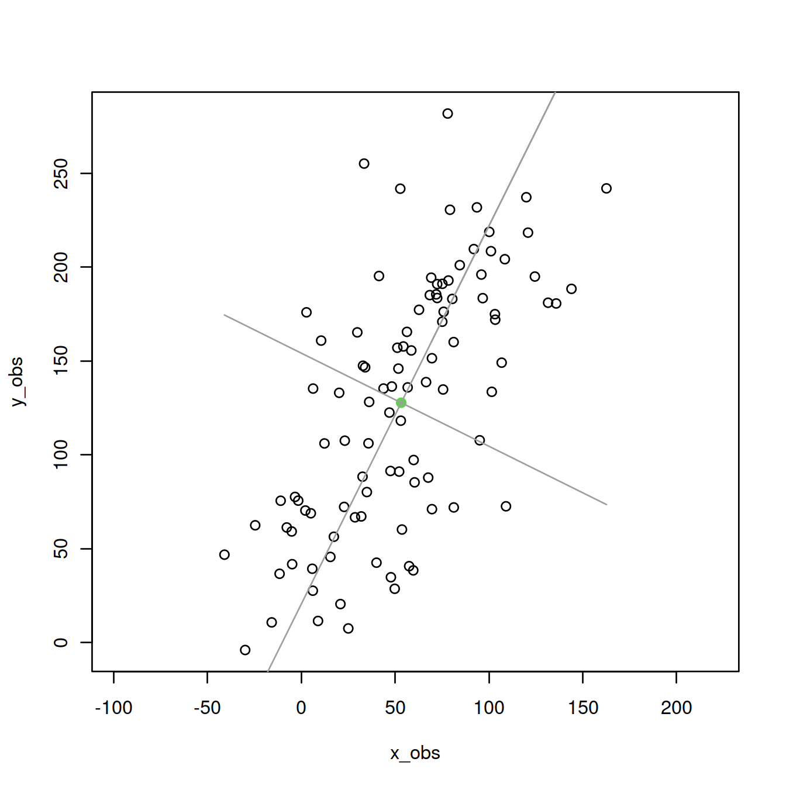

Add the projections of the points onto the first PC:


```r
plot(P,asp=1,col=1) #plot points
points(mean(x_obs),mean(y_obs),col=3, pch=19) #show center
# PC 1:
lines(x_obs,eigenVectors[2,1]/eigenVectors[1,1]*M[x]+mean(y_obs),col=8)
# PC 2:
lines(x_obs,eigenVectors[2,2]/eigenVectors[1,2]*M[x]+mean(y_obs),col=8)
# add projecions:
trans <- (M%*%v[,1])%*%v[,1] #compute projections of points
P_proj <- scale(trans, center=-cbind(mean(x_obs),mean(y_obs)), scale=FALSE) 
points(P_proj, col=4,pch=19,cex=0.5) #plot projections
segments(x_obs,y_obs,P_proj[,1],P_proj[,2],col=4,lty=2) #connect to points
```

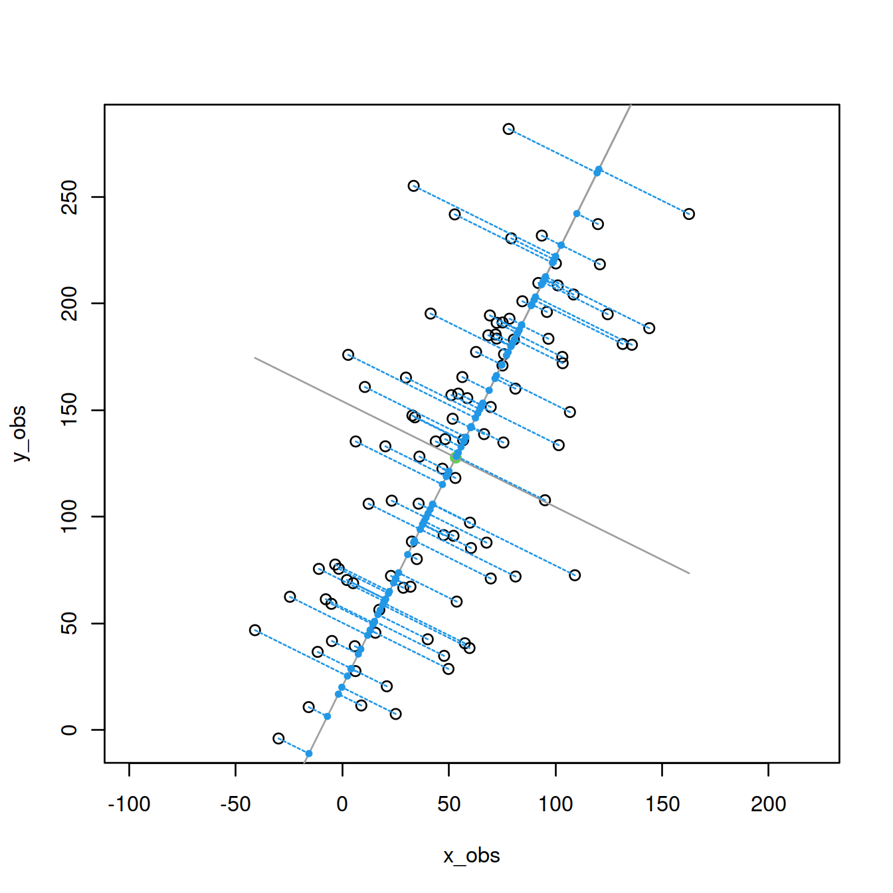

Compute PCs with prcomp().


```r
pca_res <- prcomp(M)
```


```r
summary(pca_res)
```

```
## Importance of components:
##                           PC1    PC2
## Standard deviation     73.827 28.279
## Proportion of Variance  0.872  0.128
## Cumulative Proportion   0.872  1.000
```


```r
var_explained <- pca_res$sdev^2/sum(pca_res$sdev^2)
var_explained
```

```
## [1] 0.8720537 0.1279463
```

Check amount of variance captured by PCs on a scree plot.


```r
# Show scree plot:
plot(pca_res)
```

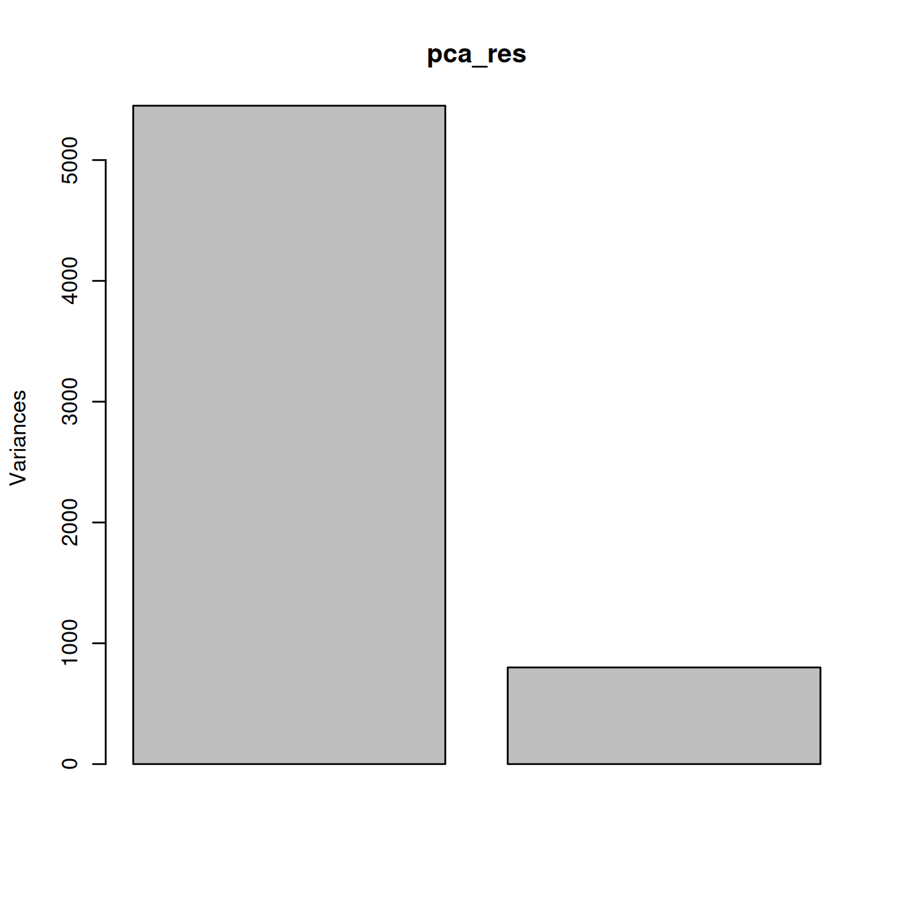

Plot with ggplot.


```r
df_pc <- data.frame(pca_res$x)
g <- ggplot(df_pc, aes(PC1, PC2)) + 
  geom_point(size=2) +   # draw points
  labs(title="PCA", 
       subtitle="With principal components PC1 and PC2 as X and Y axis") + 
  coord_cartesian(xlim = 1.2 * c(min(df_pc$PC1), max(df_pc$PC1)), 
                  ylim = 1.2 * c(min(df_pc$PC2), max(df_pc$PC2)))
g <- g + geom_hline(yintercept=0)
g <- g + geom_vline(xintercept=0)
g
```

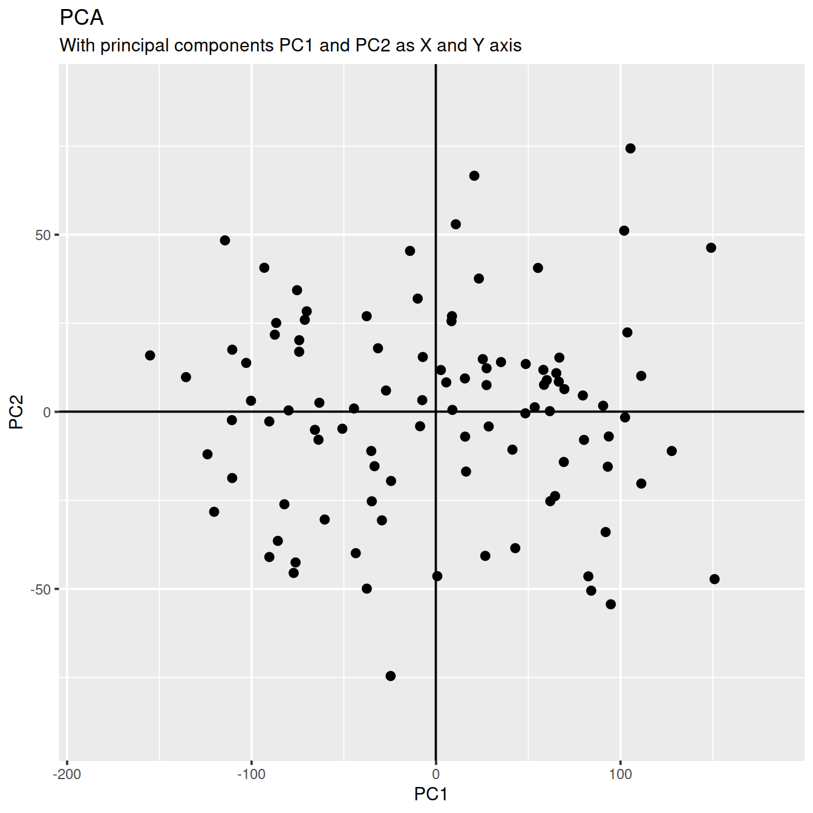

Or use ggfortify autoplot().


```r
# ggfortify
library(ggfortify)
g <- autoplot(pca_res)
g <- g + geom_hline(yintercept=0)
g <- g + geom_vline(xintercept=0)
g
```

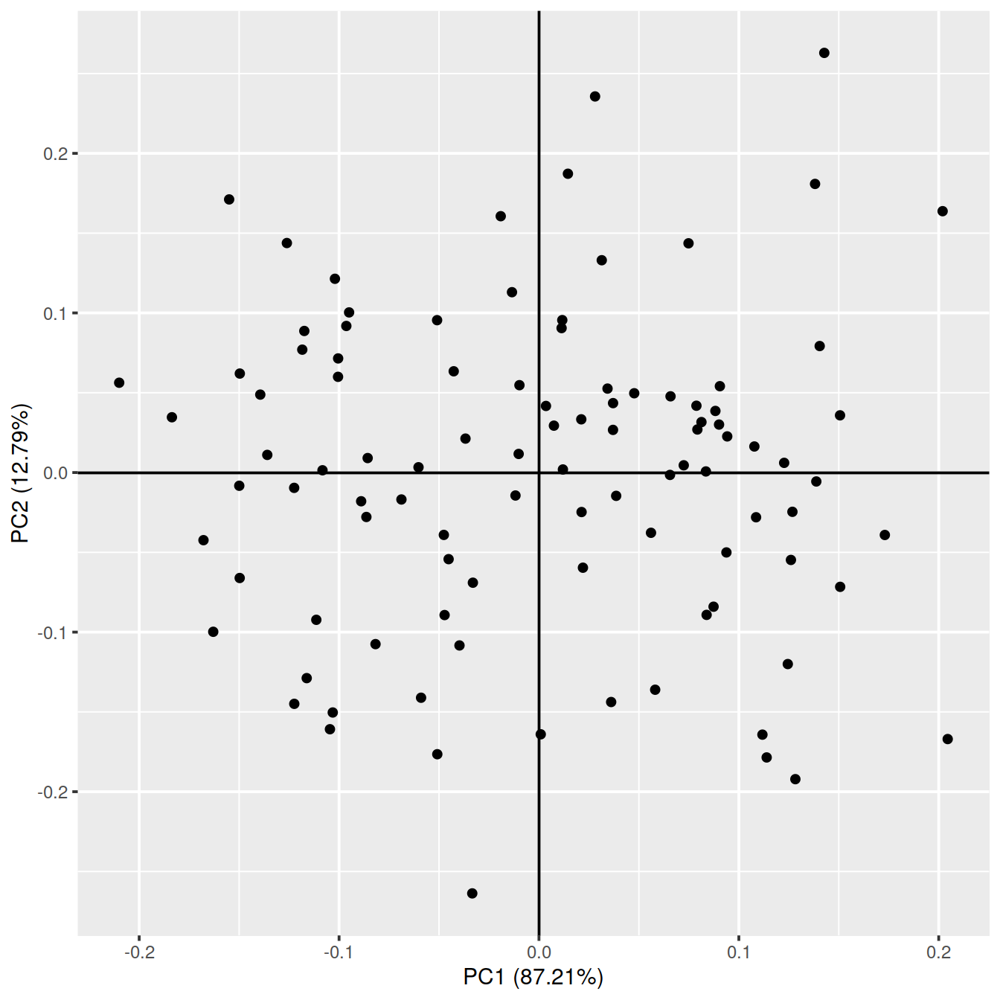

Going from 2D to 3D (figure from [@nlpcaPlot]):


## Load packages


```r
library(scater) # for QC and plots
```

## Load data

We will load the R file keeping the SCE object with the normalised counts for 500 cells per sample.


```r
setName <- "caron"
setSuf <- "_5hCellPerSpl"

# Read object in:
tmpFn <- sprintf("%s/%s/Robjects/%s_sce_nz_postDeconv%s.Rds", projDir, outDirBit, setName, setSuf)
print(tmpFn)
```

```
## [1] "/ssd/personal/baller01/20200511_FernandesM_ME_crukBiSs2020/AnaWiSce/AnaKmWiC/Robjects/caron_sce_nz_postDeconv_5hCellPerSpl.Rds"
```

```r
if(!file.exists(tmpFn))
{
	knitr::knit_exit()
}
sce <- readRDS(tmpFn)
sce
```

```
## class: SingleCellExperiment 
## dim: 16629 5500 
## metadata(0):
## assays(2): counts logcounts
## rownames(16629): ENSG00000237491 ENSG00000225880 ... ENSG00000275063
##   ENSG00000271254
## rowData names(11): ensembl_gene_id external_gene_name ... detected
##   gene_sparsity
## colnames: NULL
## colData names(16): Barcode Run ... cell_sparsity sizeFactor
## reducedDimNames(0):
## altExpNames(0):
```

```r
head(rowData(sce))
```

```
## DataFrame with 6 rows and 11 columns
##                 ensembl_gene_id external_gene_name chromosome_name
##                     <character>        <character>     <character>
## ENSG00000237491 ENSG00000237491          LINC01409               1
## ENSG00000225880 ENSG00000225880          LINC00115               1
## ENSG00000230368 ENSG00000230368             FAM41C               1
## ENSG00000230699 ENSG00000230699                                  1
## ENSG00000188976 ENSG00000188976              NOC2L               1
## ENSG00000187961 ENSG00000187961             KLHL17               1
##                 start_position end_position    strand      Symbol
##                      <integer>    <integer> <integer> <character>
## ENSG00000237491         778747       810065         1  AL669831.5
## ENSG00000225880         826206       827522        -1   LINC00115
## ENSG00000230368         868071       876903        -1      FAM41C
## ENSG00000230699         911435       914948         1  AL645608.3
## ENSG00000188976         944203       959309        -1       NOC2L
## ENSG00000187961         960584       965719         1      KLHL17
##                            Type       mean  detected gene_sparsity
##                     <character>  <numeric> <numeric>     <numeric>
## ENSG00000237491 Gene Expression 0.02785355  2.706672      0.977951
## ENSG00000225880 Gene Expression 0.01376941  1.340222      0.985699
## ENSG00000230368 Gene Expression 0.02027381  1.946076      0.980821
## ENSG00000230699 Gene Expression 0.00144251  0.144251      0.997704
## ENSG00000188976 Gene Expression 0.17711393 14.511645      0.835565
## ENSG00000187961 Gene Expression 0.00354070  0.348825      0.995935
```

```r
#any(duplicated(rowData(nz.sce)$ensembl_gene_id))
# some function(s) used below complain about 'strand' already being used in row data,
# so rename that column now:
colnames(rowData(sce))[colnames(rowData(sce)) == "strand"] <- "strandNum"
```

## PCA

Perform PCA, keep outcome in same object.


```r
nbPcToComp <- 50
# compute PCA:
#sce <- runPCA(sce, ncomponents = nbPcToComp, method = "irlba")
sce <- runPCA(sce, ncomponents = nbPcToComp)
```

Display scree plot.


```r
# with reducedDim
sce.pca <- reducedDim(sce, "PCA")
attributes(sce.pca)$percentVar
```

```
##  [1] 16.5531107 10.0199888  4.3629600  3.7422222  1.9514046  1.7700235
##  [7]  1.6280021  1.2600210  1.1413238  0.8701746  0.7881998  0.6933591
## [13]  0.6465512  0.5898302  0.5307767  0.4365192  0.3893798  0.3791947
## [19]  0.3639489  0.3434668  0.3324412  0.2924477  0.2857375  0.2708208
## [25]  0.2674348  0.2620022  0.2529266  0.2422967  0.2388725  0.2374630
## [31]  0.2339333  0.2312881  0.2296763  0.2261449  0.2229721  0.2218208
## [37]  0.2215260  0.2195930  0.2168220  0.2151280  0.2129703  0.2114219
## [43]  0.2099425  0.2091484  0.2073056  0.2054996  0.2046071  0.2042045
## [49]  0.2038521  0.2028053
```

```r
barplot(attributes(sce.pca)$percentVar,
        main=sprintf("Scree plot for the %s first PCs", nbPcToComp),
        names.arg=1:nbPcToComp,
        cex.names = 0.8)
```

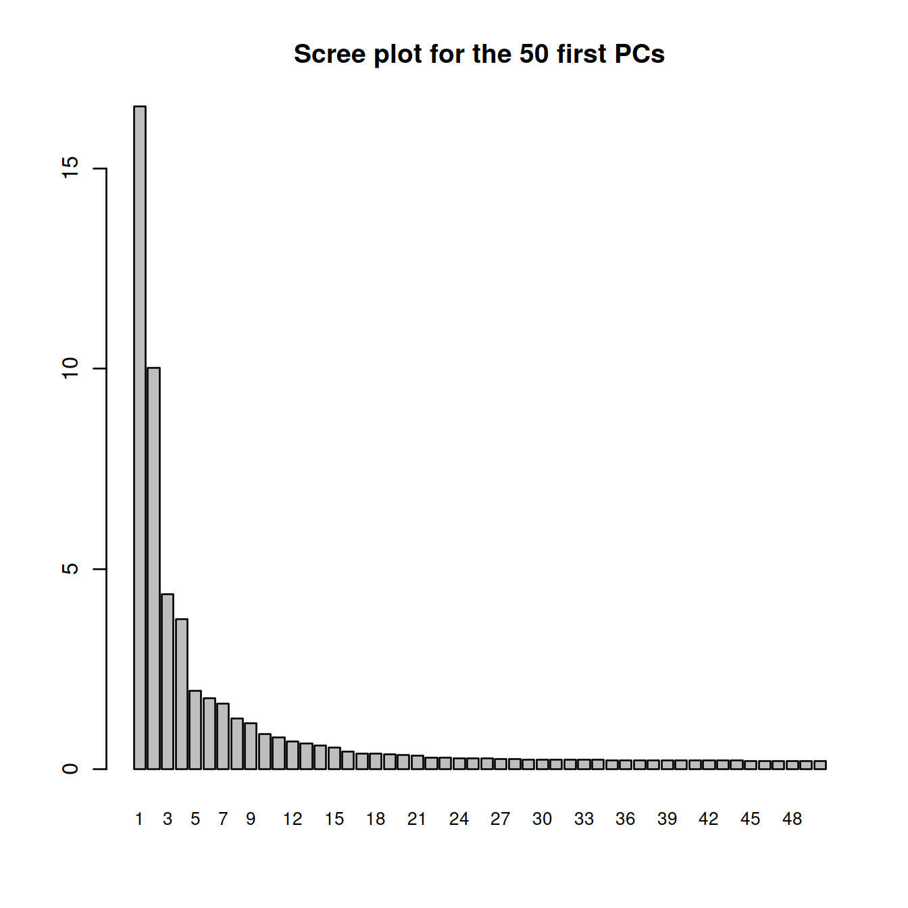

Display cells on a plot for the first 2 PCs, colouring by 'Sample' and setting size to match 'total_features'.

The proximity of cells reflects the similarity of their expression profiles.


```r
g <- plotPCA(sce,
		colour_by = "Sample.Name",
		size_by = "sum"
)         
g
```

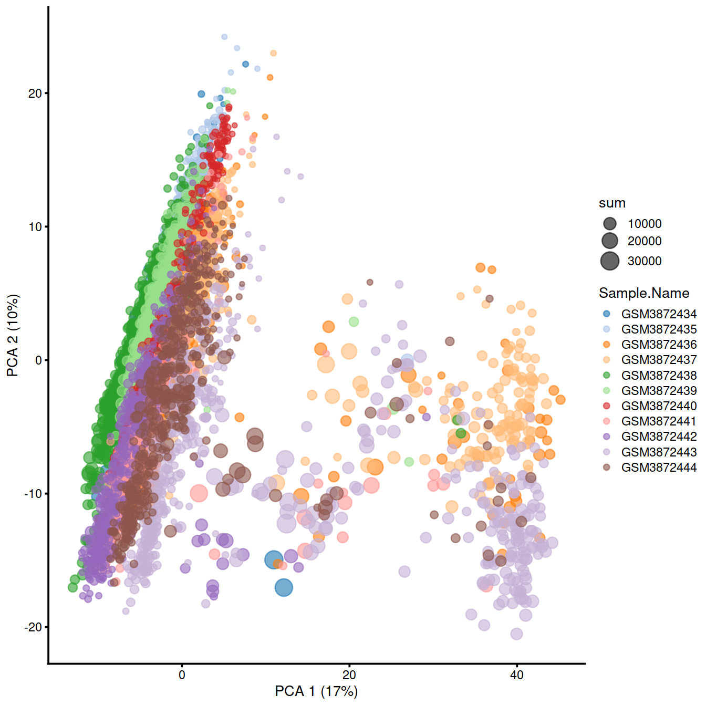

One can also split the plot by sample.


```r
g <- g +  facet_wrap(sce$source_name ~ .)
g
```

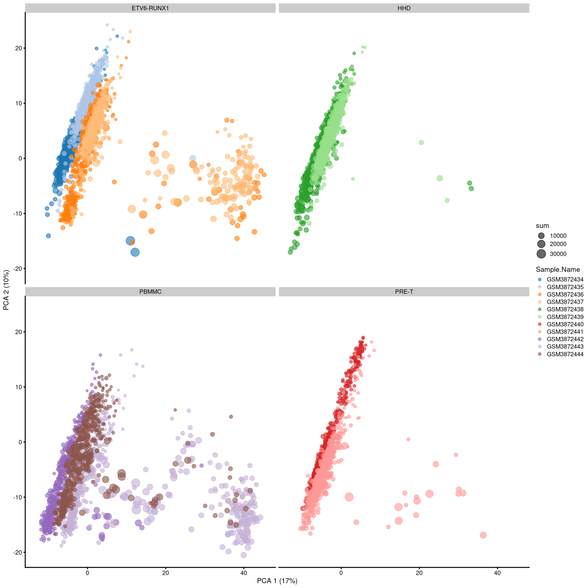

Or plot several PCs at once, using plotReducedDim():


```r
plotReducedDim(sce, dimred="PCA", ncomponents=3, 
		colour_by = "Sample.Name") + fontsize
```

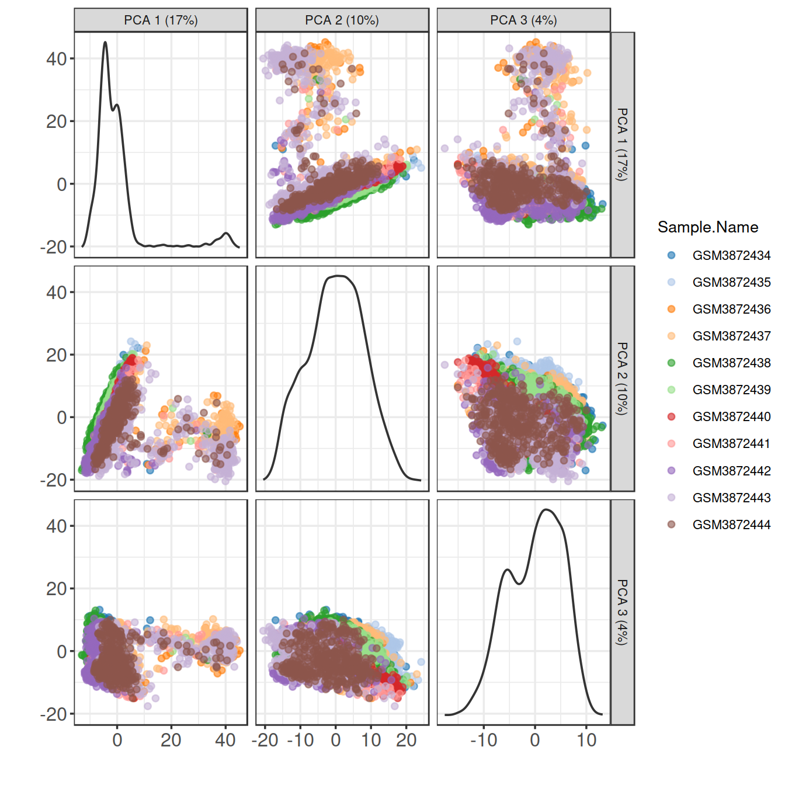

### Correlation between PCs and the total number of features detected

The PCA plot above shows cells as symbols whose size depends on the total number of features or library size. It suggests there may be a correlation between PCs and these variables. Let's check:


```r
colData(sce)$source_name <- factor(colData(sce)$source_name)
colData(sce)$block <- factor(colData(sce)$block)
r2mat <- getExplanatoryPCs(sce)
#r2mat <- getExplanatoryPCs(sce,
#                           variables = c("Run", "source_name"))
#                           #variables = c("Run", "Sample.Name"))
#                           #variables = c("Run", "Sample.Name", "source_name"))

r2mat
```

```
##      Barcode      Run Sample.Name source_name         sum    detected
## PC1      NaN 31.19206    31.19206    6.832312  0.78375254  6.27337092
## PC2      NaN 39.34643    39.34643   25.662855  5.25084021  0.09729984
## PC3      NaN 26.52168    26.52168   15.602707 37.70434045 46.35383380
## PC4      NaN 60.16877    60.16877   46.786763  4.07129265  4.76770624
## PC5      NaN 29.51006    29.51006   11.510990  4.47573115  7.04988227
## PC6      NaN 45.52405    45.52405   15.277803  0.51188492  0.02608563
## PC7      NaN 37.88650    37.88650   30.240815  0.05544668  0.94875299
## PC8      NaN 56.10658    56.10658   45.833901  0.40672700  0.19891021
## PC9      NaN 22.89370    22.89370   11.311513  3.38048004  3.34248462
## PC10     NaN 36.83412    36.83412    2.715106  0.08205300  0.58453373
##      subsets_Mito_sum subsets_Mito_detected subsets_Mito_percent       total
## PC1       5.997587644            18.4166606           4.54957617  0.78375254
## PC2       0.004462683             1.5357613          16.48789805  5.25084021
## PC3      24.652807031             9.3220632           3.22468580 37.70434045
## PC4       0.580352132             0.7908534           0.09236766  4.07129265
## PC5       9.434101761            17.9512413           7.94959368  4.47573115
## PC6      11.954946849            14.0284466          38.80948618  0.51188492
## PC7       0.082920314             1.7025755           0.36780972  0.05544668
## PC8       0.480586751             3.5317294           6.68352338  0.40672700
## PC9       4.050632836             4.7046742           1.55733687  3.38048004
## PC10      0.025858060             0.1133214           0.68597039  0.08205300
##          block setName     discard    outlier cell_sparsity   sizeFactor
## PC1   6.832312      NA  0.04444383  0.2296869    6.27289382 5.197542e+00
## PC2  25.662855      NA  8.43564022  9.2039749    0.09799246 1.941465e-02
## PC3  15.602707      NA  5.93493152  9.1094043   46.37551341 3.707371e+01
## PC4  46.786763      NA  2.77398719  4.3293501    4.75796689 5.966918e+00
## PC5  11.510990      NA  0.85156882  0.3470523    7.04816034 4.575358e+00
## PC6  15.277803      NA 19.45181700 16.1908399    0.02593408 5.747692e-06
## PC7  30.240815      NA  0.76305157  1.3702499    0.94864939 1.979993e-01
## PC8  45.833901      NA  0.99037548  1.0249066    0.19815769 2.156675e-01
## PC9  11.311513      NA  0.28760449  0.1623147    3.34504092 3.569516e+00
## PC10  2.715106      NA  0.24819364  0.0366594    0.58349267 3.839716e-01
```

```r
dat <- cbind(colData(sce)[,c("Sample.Name",
			     "source_name",
			     "sum",
			     "detected",
			     #"percent_top_200",
			     "subsets_Mito_percent")],
			     reducedDim(sce,"PCA"))
dat <- data.frame(dat)
dat$sum <- log2(dat$sum)
ggplot(dat, aes(x=sum, y=PC1, shape=source_name, col=Sample.Name)) +
    geom_point() +
    geom_smooth(method=lm, inherit.aes = FALSE, aes(x=sum, y=PC1)) 
```

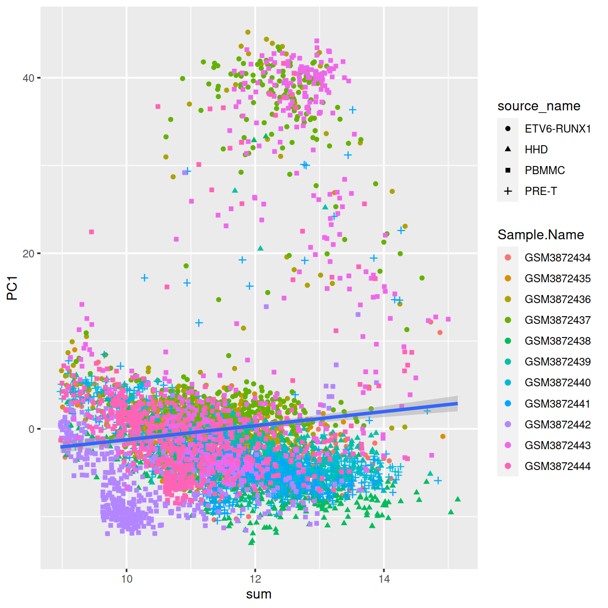

```r
#ggplot(dat, aes(x=percent_top_200, y=PC2, shape=source_name, col=Sample.Name)) +
#    geom_point() +
#    geom_smooth(method=lm, inherit.aes = FALSE, aes(x=percent_top_200, y=PC2)) 
ggplot(dat, aes(x=detected, y=PC3, shape=source_name, col=Sample.Name)) +
    geom_point() +
    geom_smooth(method=lm, inherit.aes = FALSE, aes(x=detected, y=PC3)) 
```

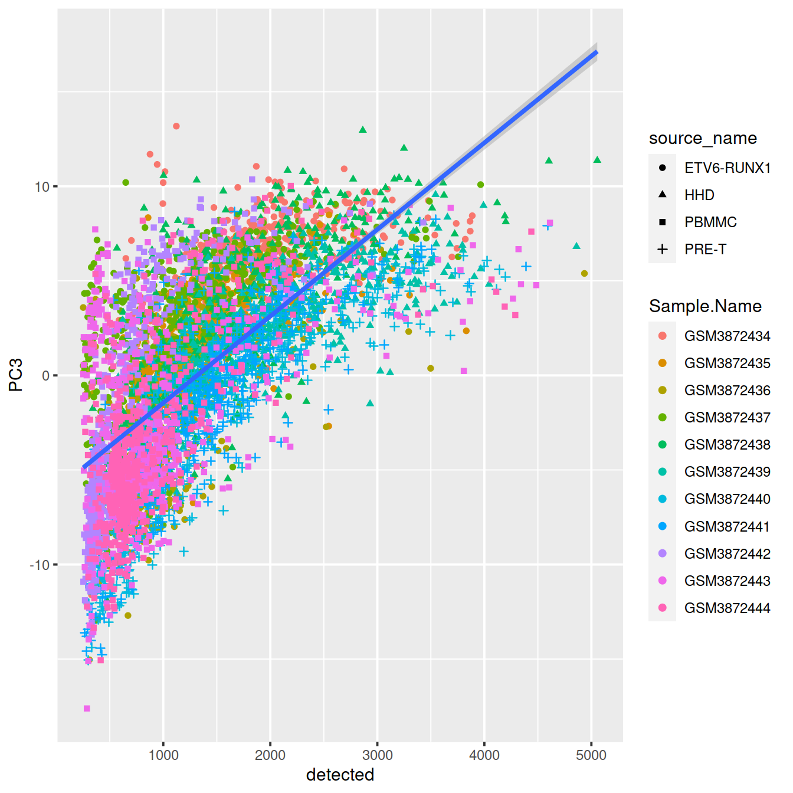

```r
ggplot(dat, aes(x=subsets_Mito_percent, y=PC2, shape=source_name, col=Sample.Name)) +
    geom_point() +
    geom_smooth(method=lm, inherit.aes = FALSE, aes(x=subsets_Mito_percent, y=PC2)) 
```

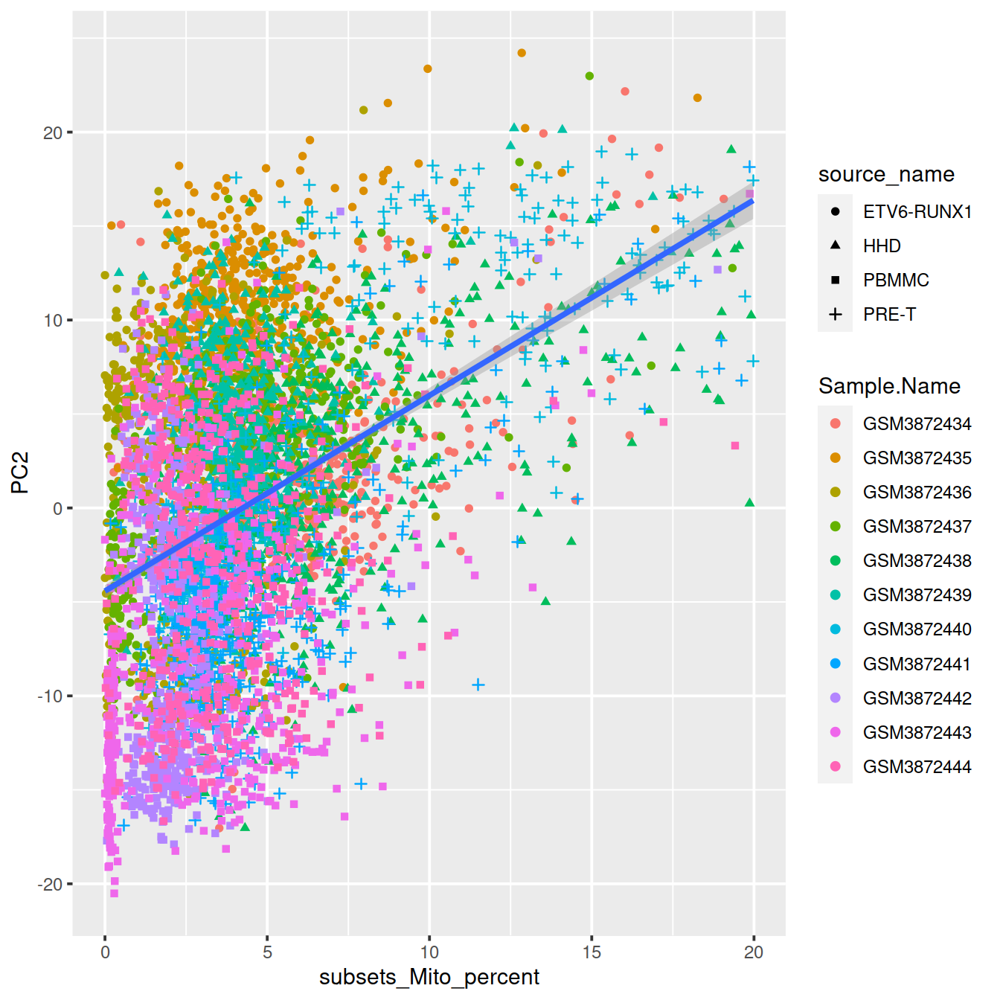

```r
ggplot(dat, aes(x=source_name, y=PC7, shape=source_name, col=Sample.Name)) +
    geom_boxplot()
```

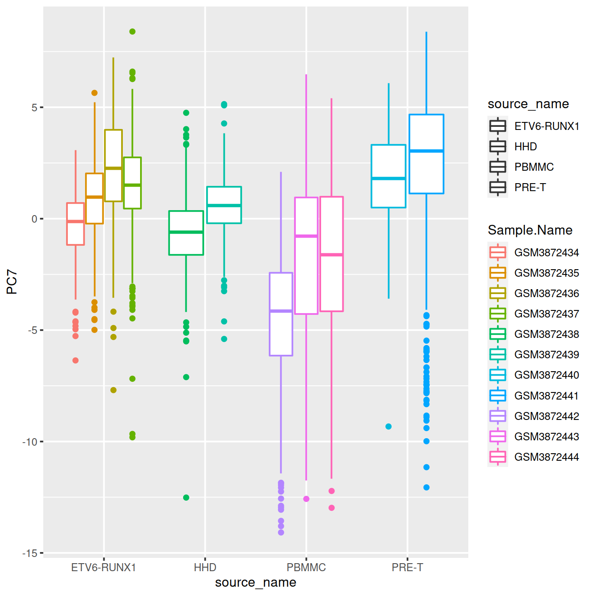

## t-SNE: t-Distributed Stochastic Neighbor Embedding

<!-- https://biocellgen-public.svi.edu.au/mig_2019_scrnaseq-workshop/public/latent-spaces.html -->

The Stochastic Neighbor Embedding (SNE) approach address two shortcomings of PCA that captures the global covariance structure with a linear combination of initial variables: by preserving the local structure allowing for non-linear projections. It uses two distributions of the pairwise similarities between data points: in the input data set and in the low-dimensional space.

SNE aims at preserving neighbourhoods. For each points, it computes probabilities of chosing each other point as its neighbour based on a Normal distribution depending on 1) the distance matrix and 2) the size of the neighbourhood (perplexity). SNE aims at finding a low-dimension space (eg 2D-plane) such that the similarity matrix deriving from it is as similar as possible as that from the high-dimension space. To address the fact that in low dimension, points are brought together, the similarity matrix in the low-dimension is allowed to follow a t-distribution.

Two characteristics matter:

- perplexity, to indicate the relative importance of the local and global patterns in structure of the data set, usually use a value of 50,
- stochasticity; running the analysis will produce a different map every time, unless the seed is set.

See [misread-tsne](https://distill.pub/2016/misread-tsne/).

### Perplexity

Compute t-SNE with default perplexity, ie 50.


```r
# runTSNE default perpexity if min(50, floor(ncol(object)/5))
sce <- runTSNE(sce, dimred="PCA", perplexity=50, rand_seed=123)
```

Plot t-SNE:


```r
tsne50 <- plotTSNE(sce,
		   colour_by="Sample.Name",
		   size_by="sum") + 
		   fontsize + 
		   ggtitle("Perplexity = 50")
tsne50
```

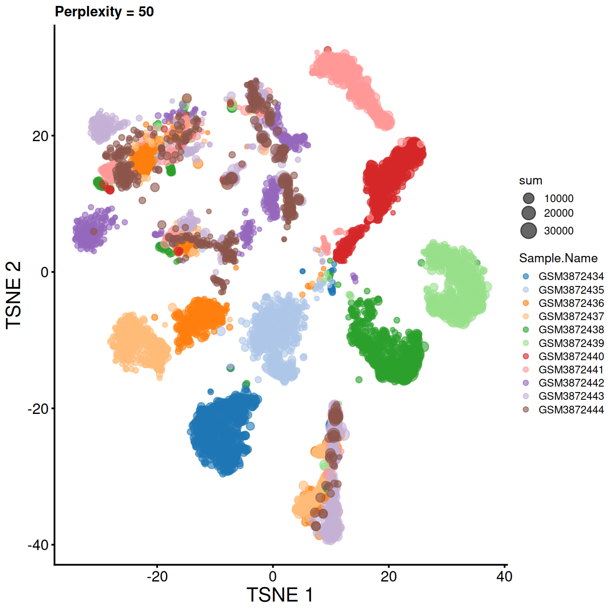

<!-- Split by sample type: -->


Compute t-SNE for several perplexity values: 


```r
tsne5.run <- runTSNE(sce, use_dimred="PCA", perplexity=5, rand_seed=123)
tsne5 <- plotTSNE(tsne5.run, colour_by="Sample.Name") + fontsize + ggtitle("Perplexity = 5")

#tsne200.run <- runTSNE(sce, use_dimred="PCA", perplexity=200, rand_seed=123)
#tsne200 <- plotTSNE(tsne200.run, colour_by="Sample.Name") + fontsize + ggtitle("Perplexity = 200")

tsne500.run <- runTSNE(sce, use_dimred="PCA", perplexity=500, rand_seed=123)
tsne500 <- plotTSNE(tsne500.run, colour_by="Sample.Name") + fontsize + ggtitle("Perplexity = 500")

#tsne1000.run <- runTSNE(sce, use_dimred="PCA", perplexity=1000, rand_seed=123)
#tsne1000 <- plotTSNE(tsne1000.run, colour_by="Sample.Name") + fontsize + ggtitle("Perplexity = 1000")
```


```r
tsne5
```

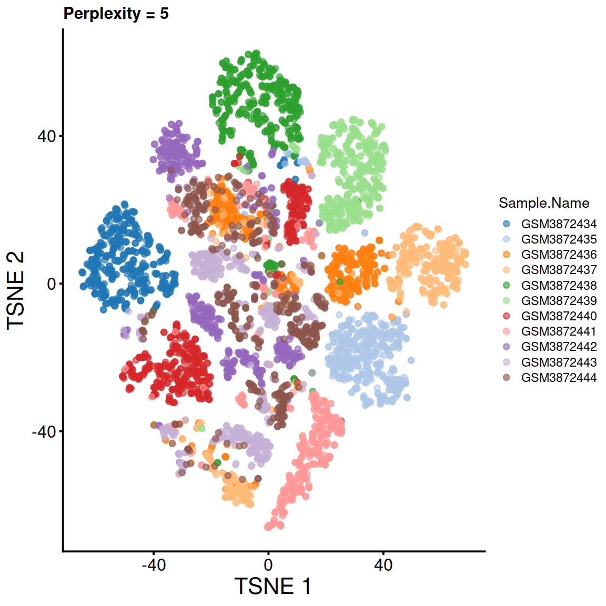

```r
#tsne50
#tsne200
tsne500
```

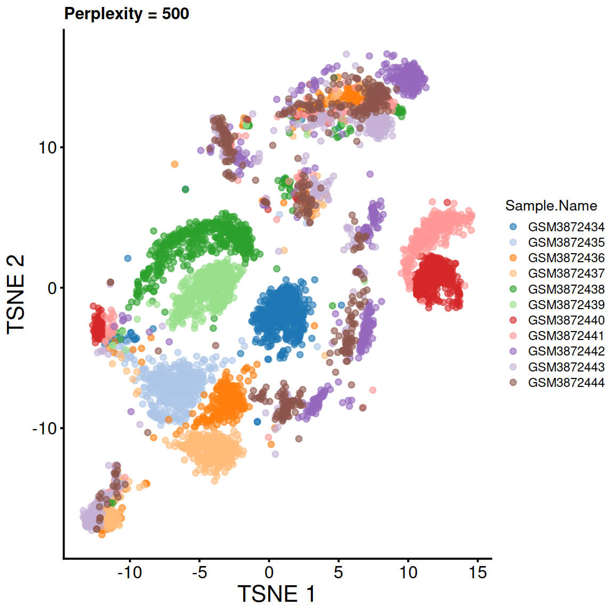

### Stochasticity

Use a different seed with the same perplexity 50.


```r
tsne50.b <- runTSNE(sce, use_dimred="PCA", perplexity=50, rand_seed=456)

tsne50.b <- plotTSNE(tsne50.b,
		   colour_by="Sample.Name",
		   size_by="sum") + 
	     fontsize + 
	     ggtitle("Perplexity = 50, seed 456")
tsne50.b
```

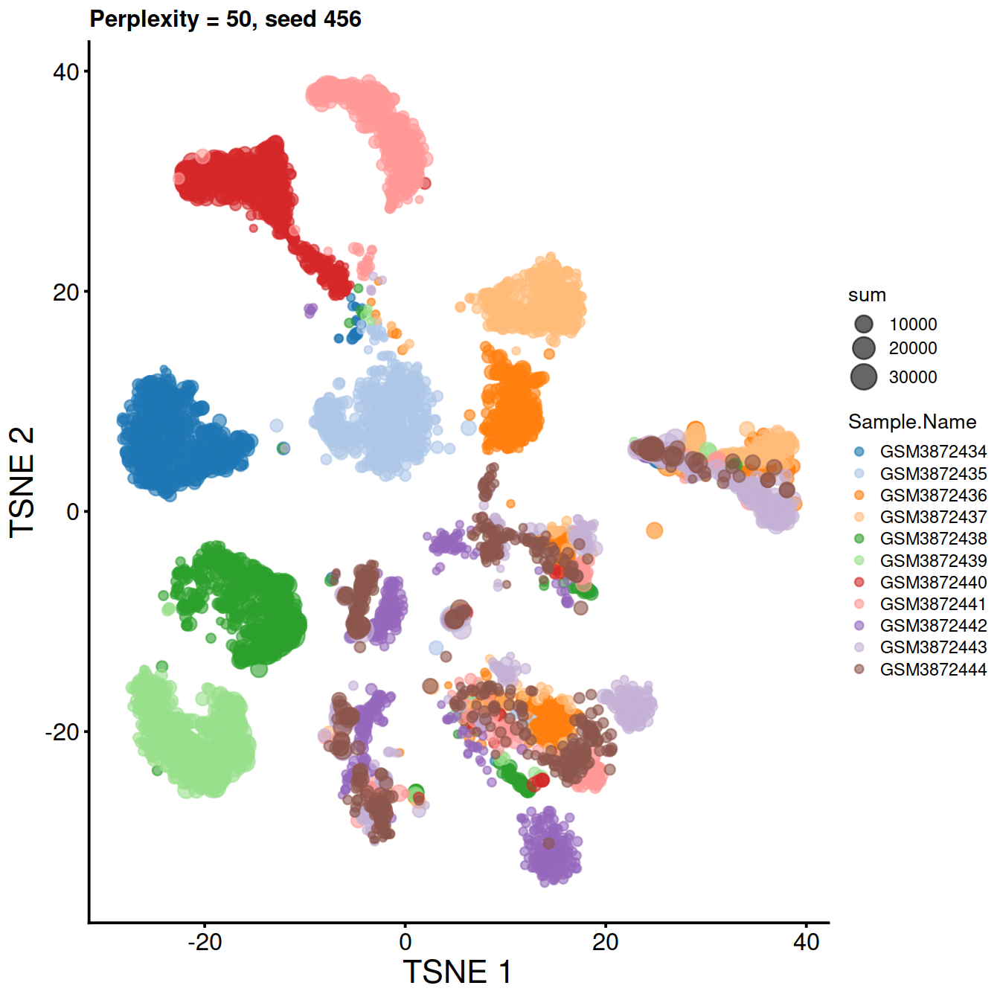

## UMAP

Another neighbour graph method. Similar to t-SNE, but that is determistic, faster and claims to preserve both local and global structures.

Compute UMAP.


```r
set.seed(123)
sce <- runUMAP(sce, dimred="PCA")
```

Plot UMAP:


```r
sce.umap <- plotUMAP(sce,
		   colour_by="Sample.Name",
		   size_by="sum") + 
		   fontsize + 
		   ggtitle("UMAP")
sce.umap
```

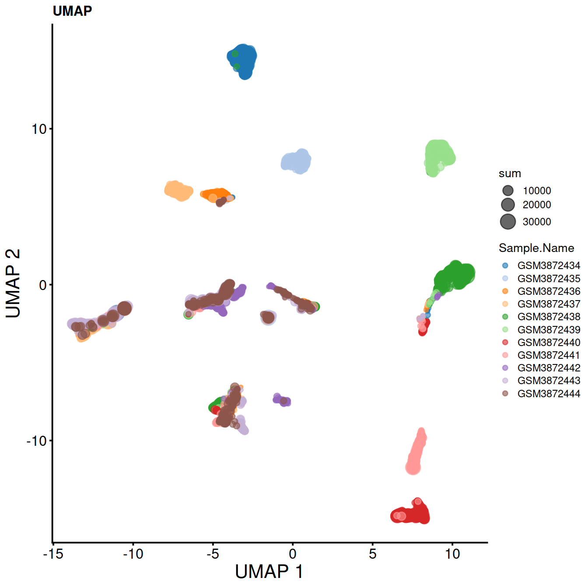

<!-- Split by sample: -->


Save SCE object: 


```r
tmpFn <- sprintf("%s/%s/Robjects/%s_sce_nz_postDeconv%s_dimRed.Rds", projDir, outDirBit, setName, setSuf)
saveRDS(sce, tmpFn)
```

## Session information


```r
sessionInfo()
```

```
## R version 4.0.3 (2020-10-10)
## Platform: x86_64-pc-linux-gnu (64-bit)
## Running under: CentOS Linux 8
## 
## Matrix products: default
## BLAS:   /opt/R/R-4.0.3/lib64/R/lib/libRblas.so
## LAPACK: /opt/R/R-4.0.3/lib64/R/lib/libRlapack.so
## 
## locale:
##  [1] LC_CTYPE=en_GB.UTF-8       LC_NUMERIC=C              
##  [3] LC_TIME=en_GB.UTF-8        LC_COLLATE=en_GB.UTF-8    
##  [5] LC_MONETARY=en_GB.UTF-8    LC_MESSAGES=en_GB.UTF-8   
##  [7] LC_PAPER=en_GB.UTF-8       LC_NAME=C                 
##  [9] LC_ADDRESS=C               LC_TELEPHONE=C            
## [11] LC_MEASUREMENT=en_GB.UTF-8 LC_IDENTIFICATION=C       
## 
## attached base packages:
## [1] parallel  stats4    stats     graphics  grDevices utils     datasets 
## [8] methods   base     
## 
## other attached packages:
##  [1] scater_1.18.6               SingleCellExperiment_1.12.0
##  [3] SummarizedExperiment_1.20.0 Biobase_2.50.0             
##  [5] GenomicRanges_1.42.0        GenomeInfoDb_1.26.7        
##  [7] IRanges_2.24.1              S4Vectors_0.28.1           
##  [9] BiocGenerics_0.36.1         MatrixGenerics_1.2.1       
## [11] matrixStats_0.58.0          ggfortify_0.4.11           
## [13] ggplot2_3.3.3               Cairo_1.5-12.2             
## [15] knitr_1.32                 
## 
## loaded via a namespace (and not attached):
##  [1] nlme_3.1-152              bitops_1.0-7             
##  [3] RcppAnnoy_0.0.18          tools_4.0.3              
##  [5] bslib_0.2.4               utf8_1.2.1               
##  [7] R6_2.5.0                  irlba_2.3.3              
##  [9] vipor_0.4.5               uwot_0.1.10              
## [11] DBI_1.1.1                 mgcv_1.8-35              
## [13] colorspace_2.0-0          withr_2.4.2              
## [15] tidyselect_1.1.1          gridExtra_2.3            
## [17] compiler_4.0.3            BiocNeighbors_1.8.2      
## [19] DelayedArray_0.16.3       labeling_0.4.2           
## [21] bookdown_0.22             sass_0.3.1               
## [23] scales_1.1.1              stringr_1.4.0            
## [25] digest_0.6.27             rmarkdown_2.7            
## [27] XVector_0.30.0            pkgconfig_2.0.3          
## [29] htmltools_0.5.1.1         sparseMatrixStats_1.2.1  
## [31] highr_0.9                 rlang_0.4.10             
## [33] DelayedMatrixStats_1.12.3 jquerylib_0.1.3          
## [35] farver_2.1.0              generics_0.1.0           
## [37] jsonlite_1.7.2            BiocParallel_1.24.1      
## [39] dplyr_1.0.5               RCurl_1.98-1.3           
## [41] magrittr_2.0.1            BiocSingular_1.6.0       
## [43] GenomeInfoDbData_1.2.4    scuttle_1.0.4            
## [45] Matrix_1.3-2              Rcpp_1.0.6               
## [47] ggbeeswarm_0.6.0          munsell_0.5.0            
## [49] fansi_0.4.2               viridis_0.6.0            
## [51] lifecycle_1.0.0           stringi_1.5.3            
## [53] yaml_2.2.1                zlibbioc_1.36.0          
## [55] Rtsne_0.15                grid_4.0.3               
## [57] crayon_1.4.1              lattice_0.20-44          
## [59] cowplot_1.1.1             beachmat_2.6.4           
## [61] splines_4.0.3             pillar_1.6.0             
## [63] codetools_0.2-18          glue_1.4.2               
## [65] evaluate_0.14             vctrs_0.3.7              
## [67] gtable_0.3.0              purrr_0.3.4              
## [69] tidyr_1.1.3               assertthat_0.2.1         
## [71] xfun_0.22                 rsvd_1.0.5               
## [73] RSpectra_0.16-0           viridisLite_0.4.0        
## [75] tibble_3.1.1              beeswarm_0.3.1           
## [77] ellipsis_0.3.2
```

