# Normalisation - with 2-5k cells per sample {#NormalisationAllCellsTop}


Why normalise?

Systematic differences in sequencing coverage between libraries
caused by low input material, differences in cDNA capture and PCR amplification.
Normalisation removes such differences so that differences between cells are not technical but biological, allowing meaningful comparison of expression profiles between cells.

**TODO** difference between normalisation and batch correction. norm: technical differences only. batch correction: technical and biological. different assumptions and methods.

In scaling normalization, the “normalization factor” is an estimate of the library size relative to the other cells. 
steps: compute a cell-specific 'scaling' or 'size' factor that represents the relative bias in that cell and divide all counts for the cell by that factor to remove that bias. Assumption: any cell specific bias will affect genes the same way.

Scaling methods typically generate normalised counts-per-million (CPM) or transcripts-per-million (TPM) values.


```r
projDir <- params$projDir
dirRel <- params$dirRel
outDirBit <- params$outDirBit
compuBool <- TRUE # whether to run computation again (dev)
#qcPlotDirBit <- "Plots/Norm"
```


```r
library(scuttle)
library(scran)
library(ggplot2)
library(dplyr)
library(Cairo)
```

## Caron

<!--
Should have Caron and HCA separately
projDir <- "/mnt/scratchb/bioinformatics/baller01/20200511_FernandesM_ME_crukBiSs2020"
outDirBit <- "AnaWiSce/Attempt1"
-->

Load object.


```r
setName <- "caron"
setSuf = "_allCells" # suffix to add to file name to say all cells are used, with no downsampling
# Read object in:
tmpFn <- sprintf("%s/%s/Robjects/%s_sce_nz_postQc%s.Rds",
                 projDir, outDirBit, setName, setSuf)
sce <- readRDS(tmpFn)
```

### Library size normalization

For each cell, the library size factor is proportional to the library size such that the average size factor across cell is one.

Advantage: normalised counts are on the same scale as the initial counts.

Compute size factors:


```r
lib.sf <- librarySizeFactors(sce)
summary(lib.sf)
```

```
##    Min. 1st Qu.  Median    Mean 3rd Qu.    Max. 
##  0.1205  0.4432  0.7308  1.0000  1.2859 14.4562
```

Size factor distribution: wide range, typical of scRNA-seq data.


```r
hist(log10(lib.sf), xlab="Log10[Size factor]", col='grey80')
```

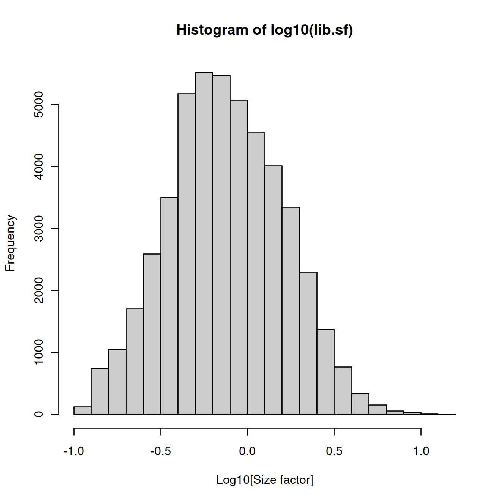

Assumption: absence of compositional bias; differential expression two cells is balanced: upregulation in some genes is accompanied by downregulation of other genes. Not observed.

Inaccurate normalisation due to unaccounted-for composition bias affects the size of the log fold change measured between clusters, but less so the clustering itself. It is thus sufficient to identify clusters and top marker genes.

### Deconvolution

Composition bias occurs when differential expression beteween two samples or here cells is not balanced. For a fixed library size, identical in both cells, upregulation of one gene in the a cell will means fewer UMIs can be assigned to other genes, which would then appear down regulated. Even if library sizes are allowed to differ in size, with that for the cell with upregulation being higher, scaling normalisation will reduce noralised counts. Non-upregulated would therefore also appear downregulated. 

For bulk RNA-seq, composition bias is removed by assuming that most genes are not differentially expressed between samples, so that differences in non-DE genes would amount to the bias, and used to compute size factors.

Given the sparsity of scRNA-seq data, the methods are not appropriate.

The method below increases read counts by pooling cells into groups, computing size factors within each of these groups and scaling them so they are comparable across clusters. This process is repeated many times, changing pools each time to collect several size factors for each cell, frome which is derived a single value for that cell.

<!--
see DESeq2 estimateSizeFactorsFromMatrix
see edgeR calcNormFactors
-->

Cluster cells, normalise :


```r
set.seed(100) # clusters with PCA from irlba with approximation
clust <- quickCluster(sce) # slow with all cells.

# write to file
tmpFn <- sprintf("%s/%s/Robjects/%s_sce_nz_quickClus%s.Rds",
		 projDir, outDirBit, setName, setSuf)
saveRDS(clust, tmpFn)
```


```r
# read from file
tmpFn <- sprintf("%s/%s/Robjects/%s_sce_nz_quickClus%s.Rds",
		 projDir, outDirBit, setName, setSuf)
clust <- readRDS(tmpFn)
table(clust)
```

```
## clust
##    1    2    3    4    5    6    7    8    9   10   11   12   13   14   15   16 
## 1557 5519 3149  602 2106  374 2389 1788 1378 4815  923 1846 5575 1989  108 1657 
##   17   18   19   20   21   22   23   24   25 
##  701 1882 5053 1420  278  714  802 1049  156
```

### Compute size factors


```r
deconv.sf <- calculateSumFactors(sce, cluster=clust)

# write to file
tmpFn <- sprintf("%s/%s/Robjects/%s_sce_nz_deconvSf%s.Rds",
		 projDir, outDirBit, setName, setSuf)
saveRDS(deconv.sf, tmpFn)
```


```r
# read from file
tmpFn <- sprintf("%s/%s/Robjects/%s_sce_nz_deconvSf%s.Rds",
		 projDir, outDirBit, setName, setSuf)
deconv.sf <- readRDS(tmpFn)

summary(deconv.sf)
```

```
##     Min.  1st Qu.   Median     Mean  3rd Qu.     Max. 
##  0.03169  0.41551  0.73178  1.00000  1.30221 15.27223
```

Plot size factors:


```r
plot(lib.sf,
     deconv.sf,
     xlab="Library size factor",
     ylab="Deconvolution size factor",
     log='xy',
     pch=16,
     col=as.integer(factor(sce$source_name)))
abline(a=0, b=1, col="red")
```

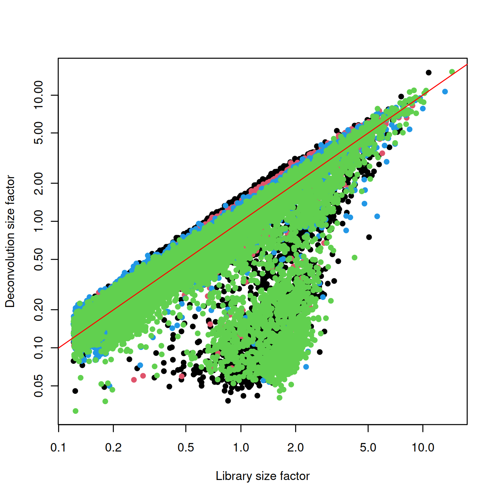


```r
deconvDf <- data.frame(lib.sf,
		       deconv.sf,
		       "source_name" = sce$source_name,
		       "sum" = sce$sum,
		       "mito_content" = sce$subsets_Mito_percent,
		       "cell_sparsity" = sce$cell_sparsity)

# colour by sample type
sp <- ggplot(deconvDf, aes(x=lib.sf, y=deconv.sf, col=source_name)) +
  geom_point()
sp + facet_wrap(~source_name)
```

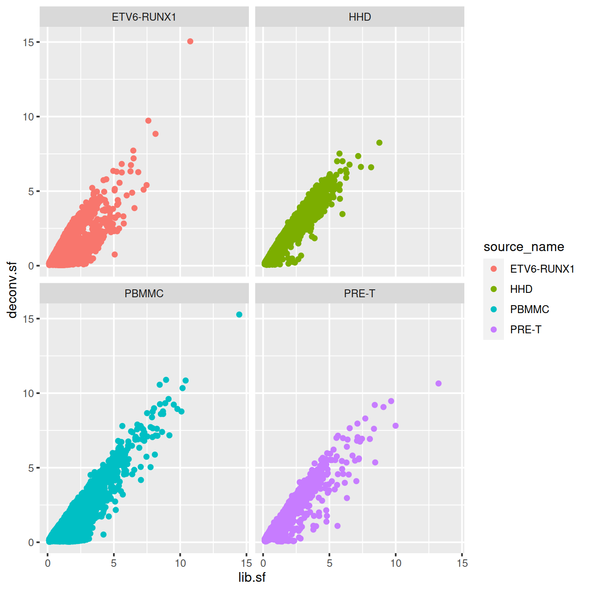

```r
# colour by library size
sp <- ggplot(deconvDf, aes(x=lib.sf, y=deconv.sf, col=sum)) +
  geom_point()
sp
```

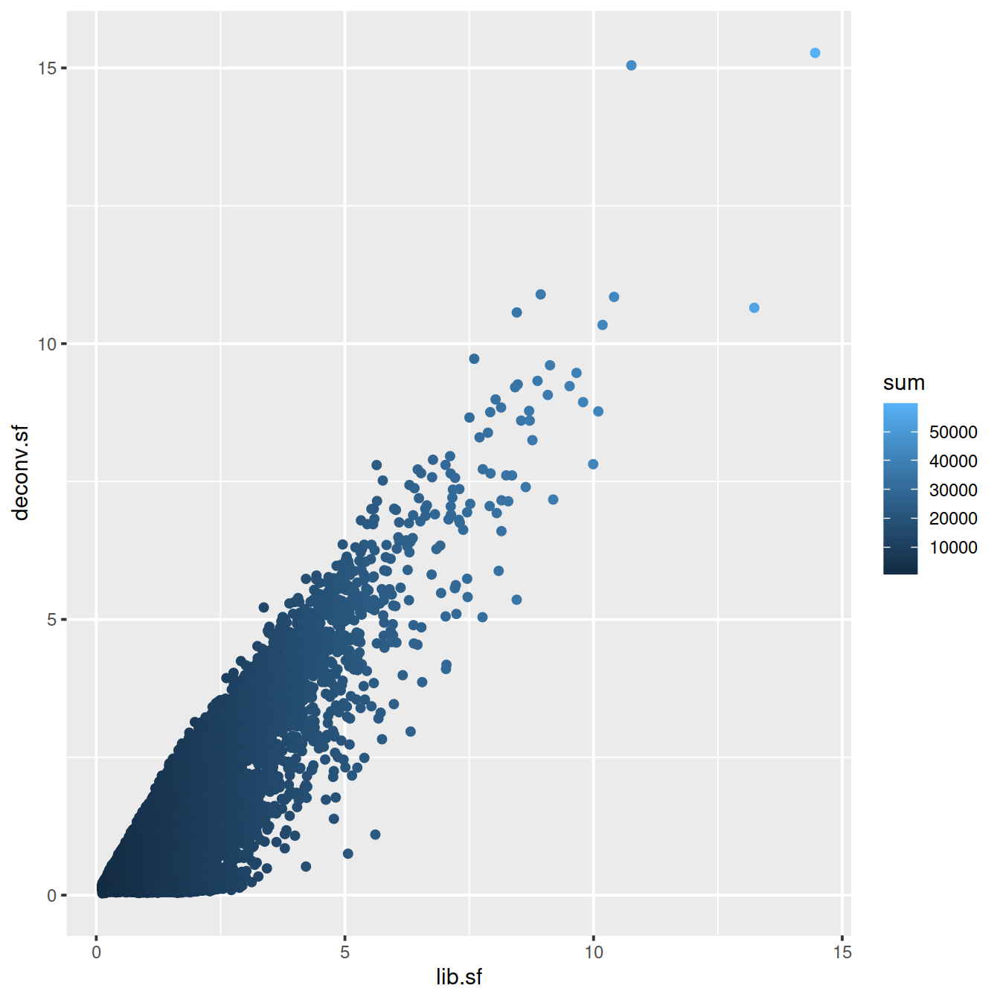

```r
# colour by mito. content
sp <- ggplot(deconvDf, aes(x=lib.sf, y=deconv.sf, col=mito_content)) +
  geom_point()
sp
```


```r
# colour by cell sparsity
sp <- ggplot(deconvDf, aes(x=lib.sf, y=deconv.sf, col=cell_sparsity)) +
  geom_point()
sp
```

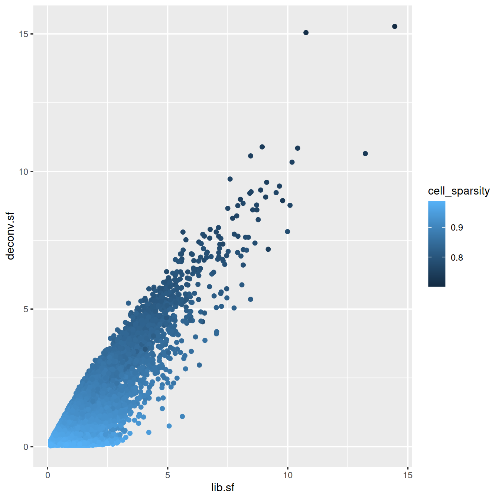

```r
#ggMarginal(sp)
```

#### Apply size factors

For each cell, raw counts for genes are divided by the size factor for that cell and log-transformed so downstream analyses focus on genes with strong relative differences. We use `scater::logNormCounts()`.


```r
sce <- logNormCounts(sce)
assayNames(sce)
```

```
## [1] "counts"    "logcounts"
```

#### Save object


```r
sce_caron <- sce
```


```r
# write to file
tmpFn <- sprintf("%s/%s/Robjects/%s_sce_nz_postDeconv%s.Rds",
		 projDir, outDirBit, setName, setSuf)
saveRDS(sce_caron, tmpFn)
```

## Hca

Load object. 


```r
# the 5kCellPerSpl subset
setName <- "hca"
setSuf <- "_5kCellPerSpl"
# Read object in:
tmpFn <- sprintf("%s/%s/Robjects/%s_sce_nz_postQc%s.Rds",
		 projDir, outDirBit, setName, setSuf)
sce <- readRDS(tmpFn)
```

### Library size normalization

For each cell, the library size factor is proportioanl to the library size such that the average size factor across cell is one.

Advantage: normalised counts are on the same scale as the initial counts.

Compute size factors:


```r
lib.sf <- librarySizeFactors(sce)
summary(lib.sf)
```

```
##    Min. 1st Qu.  Median    Mean 3rd Qu.    Max. 
##  0.3252  0.4931  0.6028  1.0000  0.8227 17.8270
```

Size factor distribution: wide range, typical of scRNA-seq data.


```r
hist(log10(lib.sf), xlab="Log10[Size factor]", col='grey80')
```

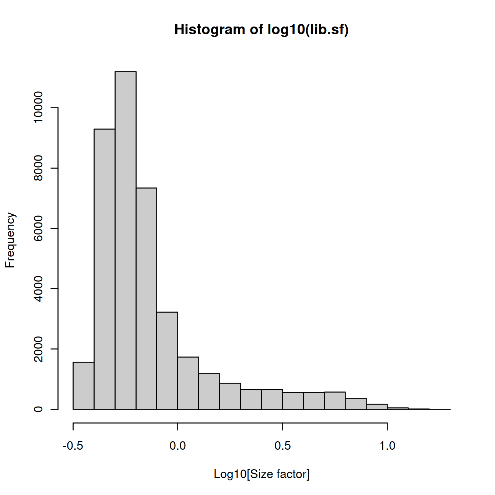

Assumption: absence of compositional bias; differential expression two cells is balanced: upregulation in some genes is accompanied by downregulation of other genes. Not observed.

Inaccurate normalisation due to unaccounted-for composition bias affects the size of the log fold change measured between clusters, but less so the clusterisation itself. It is thus sufficient to identify clustrs and top arker genes.

### Deconvolution

Composition bias occurs when differential expression beteween two samples or here cells is not balanced. For a fixed library size, identical in both cells, upregulation of one gene in the a cell will means fewer UMIs can be assigned to other genes, which would then appear down regulated. Even if library sizes are allowed to differ in size, with that for the cell with upregulation being higher, scaling normalisation will reduce noralised counts. Non-upregulated would therefore also appear downregulated. 

For bulk RNA-seq, composition bias is removed by assuming that most genes are not differentially expressed between samples, so that differences in non-DE genes would amount to the bias, and used to compute size factors.

Given the sparsity of scRNA-seq data, the methods are not appropriate.

The method below increases read counts by pooling cells into groups, computing size factors within each of these groups and scaling them so they are comparable across clusters. This process is repeated many times, changing pools each time to collect several size factors for each cell, frome which is derived a single value for that cell.

<!--
see DESeq2 estimateSizeFactorsFromMatrix
see edgeR calcNormFactors
-->

Cluster cells then normalise :


```r
#library(scran)
set.seed(100) # clusters with PCA from irlba with approximation
clust <- quickCluster(sce) # slow with all cells.

# write to file
tmpFn <- sprintf("%s/%s/Robjects/%s_sce_nz_quickClus%s.Rds",
		 projDir, outDirBit, setName, setSuf)
saveRDS(clust, tmpFn)
```


```r
# read from file
tmpFn <- sprintf("%s/%s/Robjects/%s_sce_nz_quickClus%s.Rds",
		 projDir, outDirBit, setName, setSuf)
clust <- readRDS(tmpFn)
table(clust)
```

```
## clust
##    1    2    3    4    5    6    7    8    9   10   11   12   13   14   15   16 
## 1130 1072  346 2163 4848 7186  690  637  497  565 3975  826 3567 6756  918  157 
##   17   18   19   20   21   22   23 
##  535 2030  793  509  241  311  248
```

### Compute size factors


```r
deconv.sf <- calculateSumFactors(sce, cluster=clust)

# write to file
tmpFn <- sprintf("%s/%s/Robjects/%s_sce_nz_deconvSf%s.Rds",
		 projDir, outDirBit, setName, setSuf)
saveRDS(deconv.sf, tmpFn)
```


```r
# read from file
tmpFn <- sprintf("%s/%s/Robjects/%s_sce_nz_deconvSf%s.Rds",
		 projDir, outDirBit, setName, setSuf)
deconv.sf <- readRDS(tmpFn)

summary(deconv.sf)
```

```
##     Min.  1st Qu.   Median     Mean  3rd Qu.     Max. 
##  0.07409  0.40967  0.50765  1.00000  0.75926 25.05274
```

Plot size factors:


```r
plot(lib.sf,
     deconv.sf,
     xlab="Library size factor",
     ylab="Deconvolution size factor",
     log='xy',
     pch=16,
     col=as.integer(factor(sce$source_name)))
abline(a=0, b=1, col="red")
```

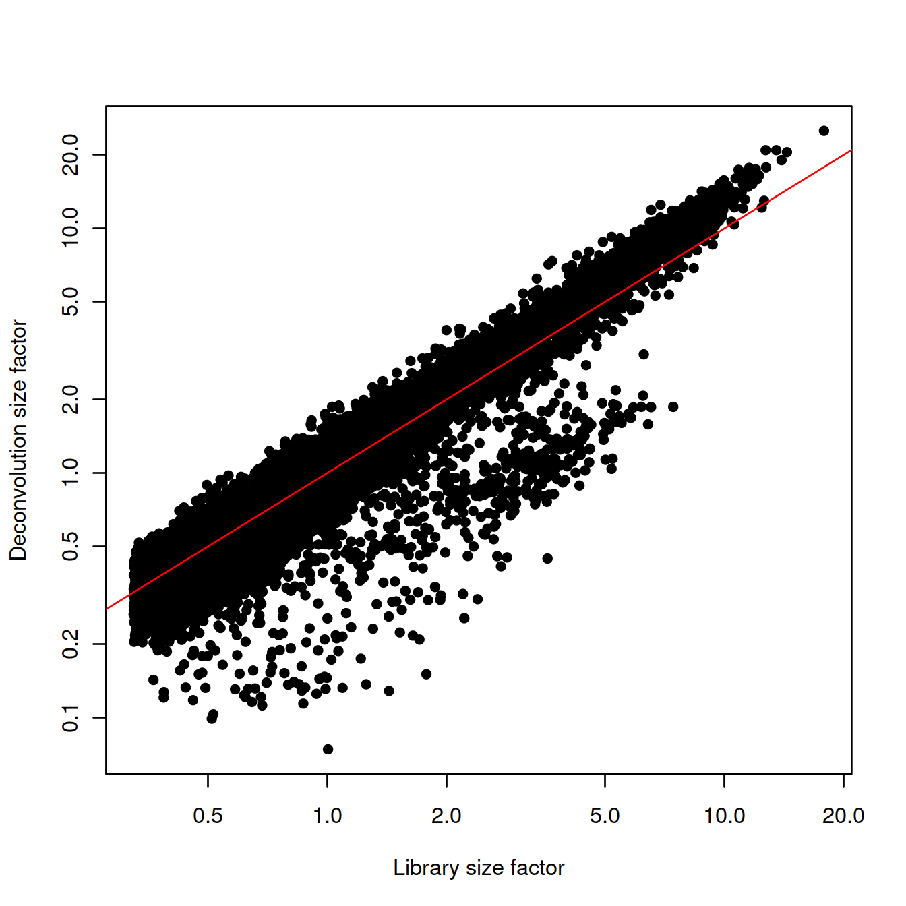


```r
deconvDf <- data.frame(lib.sf, deconv.sf,
			"source_name" = sce$source_name,
			"sum" = sce$sum,
			"mito_content" = sce$subsets_Mito_percent,
			"cell_sparsity" = sce$cell_sparsity)

# colour by sample type
sp <- ggplot(deconvDf, aes(x=lib.sf, y=deconv.sf, col=source_name)) +
  geom_point()
sp + facet_wrap(~source_name)
```

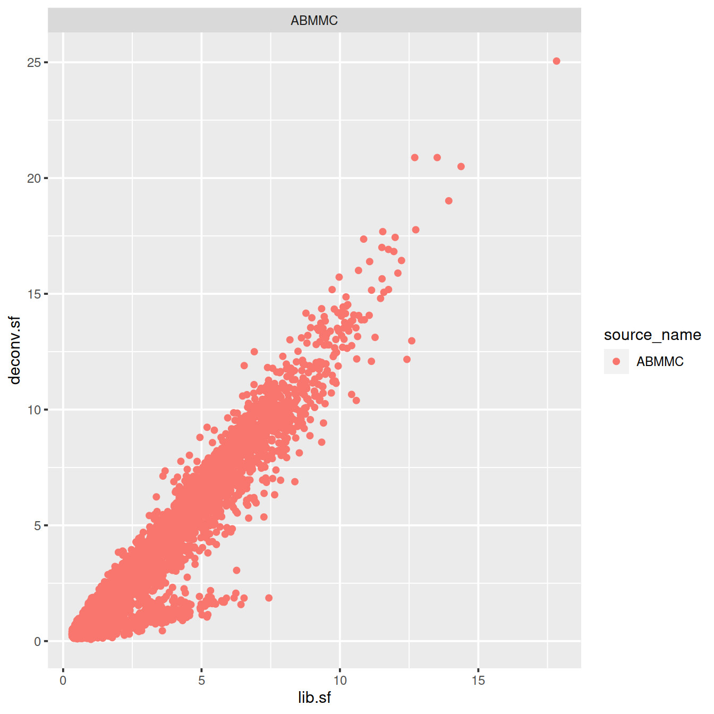

```r
# colour by library size
sp <- ggplot(deconvDf, aes(x=lib.sf, y=deconv.sf, col=sum)) +
  geom_point()
sp
```


```r
# colour by mito. content
sp <- ggplot(deconvDf, aes(x=lib.sf, y=deconv.sf, col=mito_content)) +
  geom_point()
sp
```

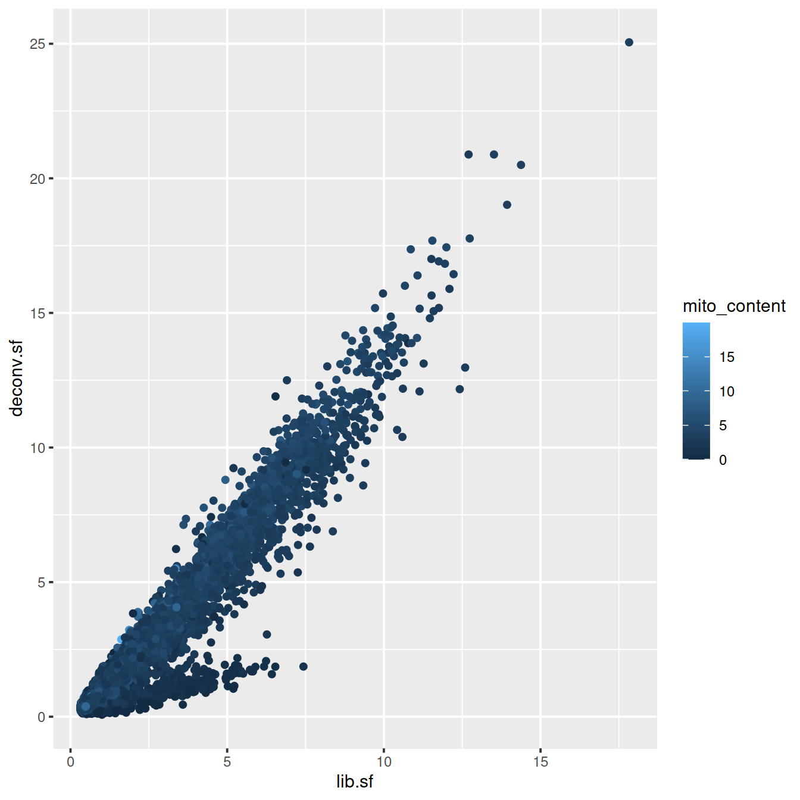

```r
# colour by cell sparsity
sp <- ggplot(deconvDf, aes(x=lib.sf, y=deconv.sf, col=cell_sparsity)) +
  geom_point()
sp
```

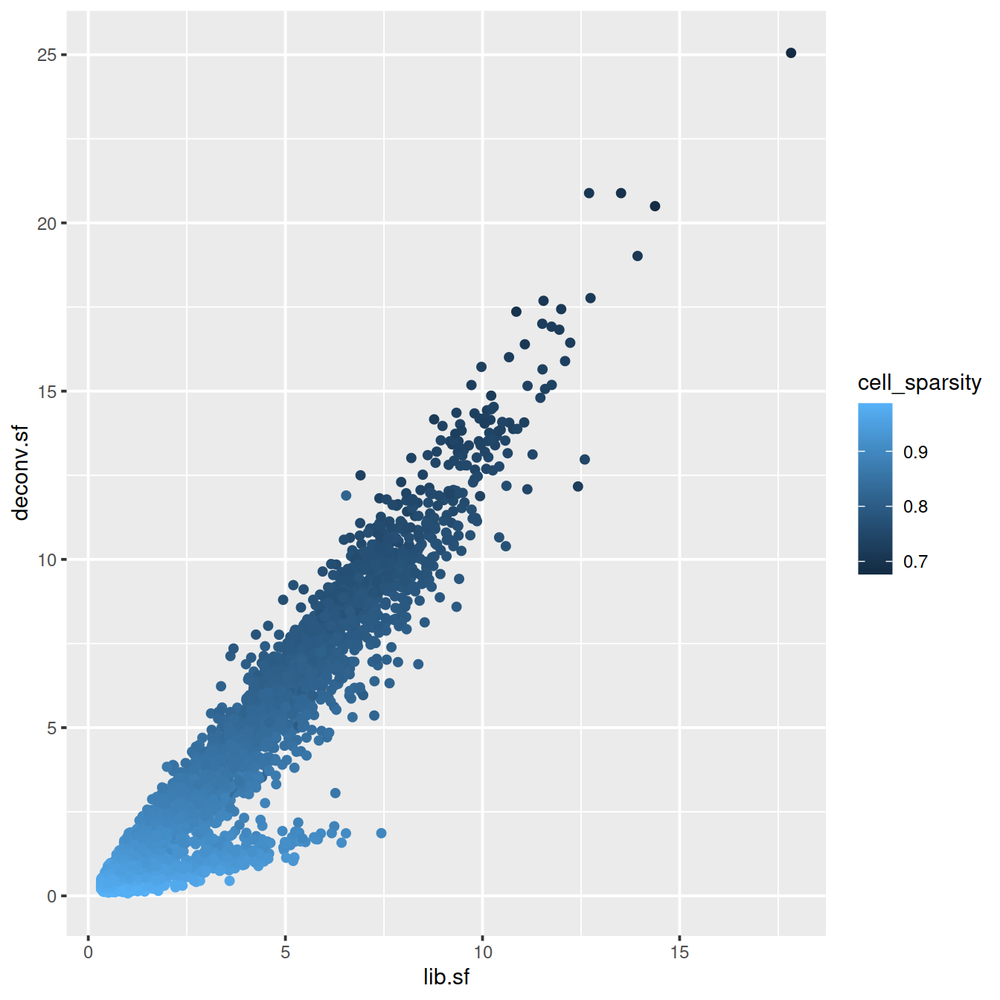

```r
#ggMarginal(sp)
```

#### Apply size factors

For each cell, raw counts for genes are divided by the size factor for that cell and log-transformed so downstream analyses focus on genes with strong relative differences. We use `scater::logNormCounts()`.


```r
sce <- logNormCounts(sce)
assayNames(sce)
```

```
## [1] "counts"    "logcounts"
```

#### Save object


```r
sce_hca <- sce
```


```r
# write to file
tmpFn <- sprintf("%s/%s/Robjects/%s_sce_nz_postDeconv%s.Rds",
		 projDir, outDirBit, setName, setSuf)
saveRDS(sce_hca, tmpFn)
```

## SCTransform

<!--
https://rawgit.com/ChristophH/sctransform/master/inst/doc/variance_stabilizing_transformation.html
-->

With scaling normalisation a correlation remains between the mean and variation of expression (heteroskedasticity). This affects downstream dimensionality reduction as the few main new dimensions are usually correlated with library size. SCTransform addresses the issue by regressing library size out of raw counts and providing residuals to use as normalized and variance-stabilized expression values in downstream analysis.

### Caron


```r
setName <- "caron"
setSuf = "_allCells" # suffix to add to file name to say which cells are used, eg downsampling

sce <- sce_caron

counts <- counts(sce)
class(counts)
```

```
## [1] "dgCMatrix"
## attr(,"package")
## [1] "Matrix"
```

```r
colnames(counts) <- colData(sce)$Barcode
```

Inspect data

We will now calculate some properties and visually inspect the data. Our main interest is in the general trends not in individual outliers. Neither genes nor cells that stand out are important at this step, but we focus on the global trends.

Derive gene and cell attributes from the UMI matrix.


```r
gene_attr <- data.frame(mean = rowMeans(counts), 
                        detection_rate = rowMeans(counts > 0),
                        var = apply(counts, 1, var))
gene_attr$log_mean <- log10(gene_attr$mean)
gene_attr$log_var <- log10(gene_attr$var)
rownames(gene_attr) <- rownames(counts)
cell_attr <- data.frame(n_umi = colSums(counts),
                        n_gene = colSums(counts > 0))
rownames(cell_attr) <- colnames(counts)
```


```r
ggplot(gene_attr, aes(log_mean, log_var)) + 
  geom_point(alpha=0.3, shape=16) + 
  geom_density_2d(size = 0.3) +
  geom_abline(intercept = 0, slope = 1, color='red')
```


Mean-variance relationship

For the genes, we can see that up to a mean UMI count of ca. 0.1 the variance follows the line through the origin with slop one, i.e. variance and mean are roughly equal as expected under a Poisson model. However, genes with a higher average UMI count show overdispersion compared to Poisson.


```r
# add the expected detection rate under Poisson model
x = seq(from = -3, to = 2, length.out = 1000)
poisson_model <- data.frame(log_mean = x,
			    detection_rate = 1 - dpois(0, lambda = 10^x))
ggplot(gene_attr, aes(log_mean, detection_rate)) + 
  geom_point(alpha=0.3, shape=16) + 
  geom_line(data=poisson_model, color='red') +
  theme_gray(base_size = 8)
```

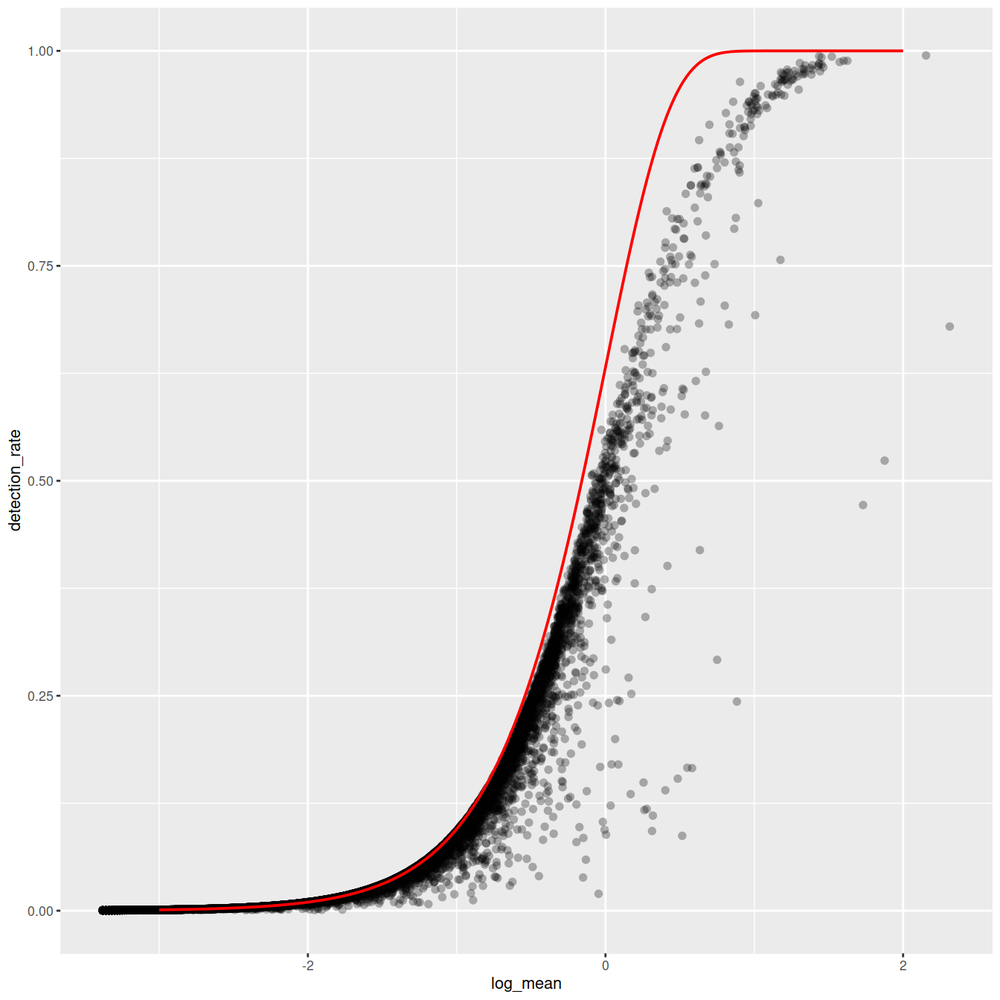

Mean-detection-rate relationship

In line with the previous plot, we see a lower than expected detection rate in the medium expression range. However, for the highly expressed genes, the rate is at or very close to 1.0 suggesting that there is no zero-inflation in the counts for those genes and that zero-inflation is a result of overdispersion, rather than an independent systematic bias.


```r
ggplot(cell_attr, aes(n_umi, n_gene)) + 
  geom_point(alpha=0.3, shape=16) + 
  geom_density_2d(size = 0.3)
```

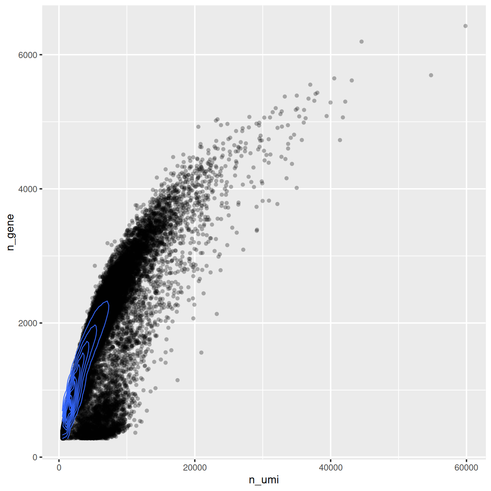

General idea of transformation

Based on the observations above, which are not unique to this particular data set, we propose to model the expression of each gene as a negative binomial random variable with a mean that depends on other variables. Here the other variables can be used to model the differences in sequencing depth between cells and are used as independent variables in a regression model. In order to avoid overfitting, we will first fit model parameters per gene, and then use the relationship between gene mean and parameter values to fit parameters, thereby combining information across genes. Given the fitted model parameters, we transform each observed UMI count into a Pearson residual which can be interpreted as the number of standard deviations an observed count was away from the expected mean. If the model accurately describes the mean-variance relationship and the dependency of mean and latent factors, then the result should have mean zero and a stable variance across the range of expression.
Estimate model parameters and transform data

The vst function estimates model parameters and performs the variance stabilizing transformation. Here we use the log10 of the total UMI counts of a cell as variable for sequencing depth for each cell. After data transformation we plot the model parameters as a function of gene mean (geometric mean).


```r
# We use the Future API for parallel processing; set parameters here
future::plan(strategy = 'multicore', workers = 4)
options(future.globals.maxSize = 10 * 1024 ^ 3)

set.seed(44)
vst_out <- sctransform::vst(counts,
			    latent_var = c('log_umi'),
			    return_gene_attr = TRUE,
			    return_cell_attr = TRUE,
			    show_progress = FALSE)
sctransform::plot_model_pars(vst_out)
```

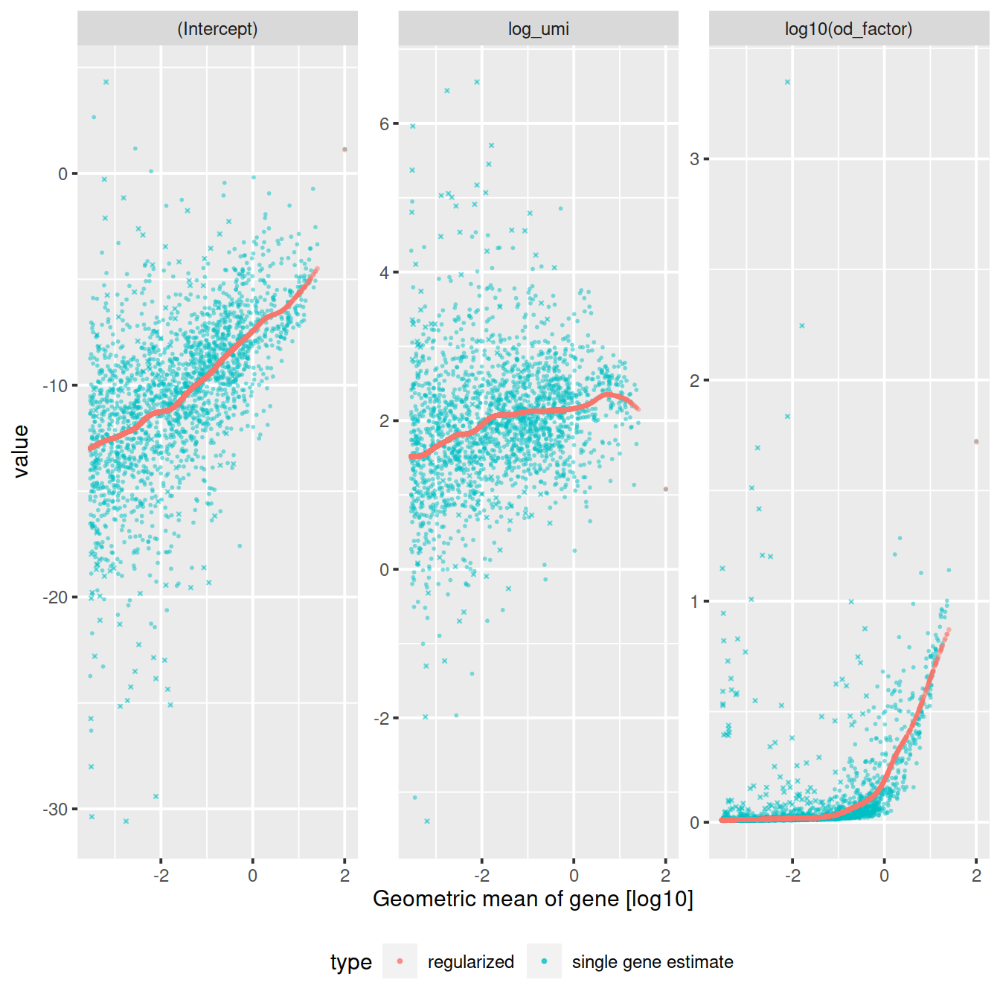

Inspect model

We will look at several genes in more detail.


```r
rowData(sce) %>%
	as.data.frame %>%
	filter(Symbol %in% c('MALAT1', 'RPL10', 'FTL'))
```

```
##                 ensembl_gene_id external_gene_name chromosome_name
## ENSG00000147403 ENSG00000147403              RPL10               X
## ENSG00000251562 ENSG00000251562             MALAT1              11
## ENSG00000087086 ENSG00000087086                FTL              19
##                 start_position end_position strand Symbol            Type
## ENSG00000147403      154389955    154409168      1  RPL10 Gene Expression
## ENSG00000251562       65497688     65506516      1 MALAT1 Gene Expression
## ENSG00000087086       48965309     48966879      1    FTL Gene Expression
##                      mean detected gene_sparsity
## ENSG00000147403  48.85548 99.28030   0.011540874
## ENSG00000251562 193.05529 99.09786   0.005352289
## ENSG00000087086  15.48621 96.42481   0.085532093
```

```r
sctransform::plot_model(vst_out,
			counts,
			c('ENSG00000251562', 'ENSG00000147403', 'ENSG00000087086'),
			plot_residual = TRUE)
```

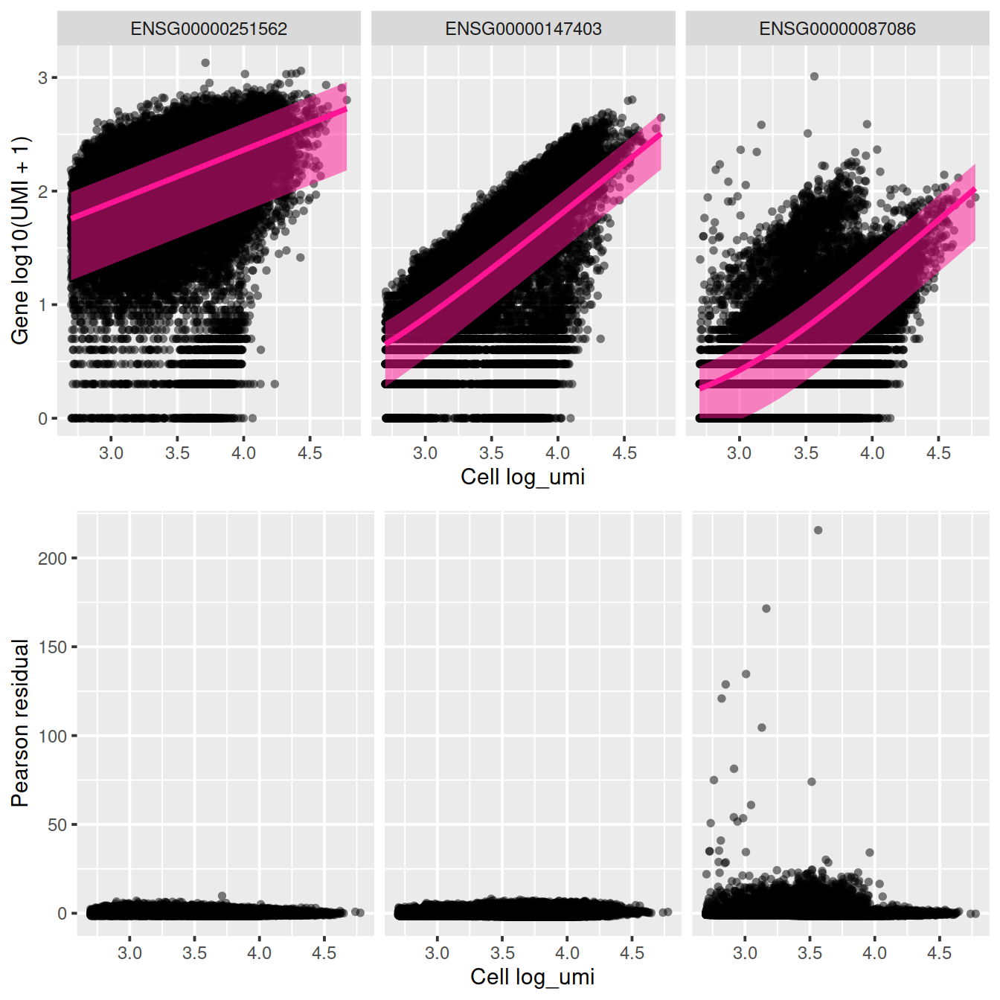


```r
sctransform::plot_model(vst_out,
			counts,
			c('ENSG00000087086'),
			plot_residual = TRUE,
			show_nr = TRUE,
			arrange_vertical = FALSE)
```

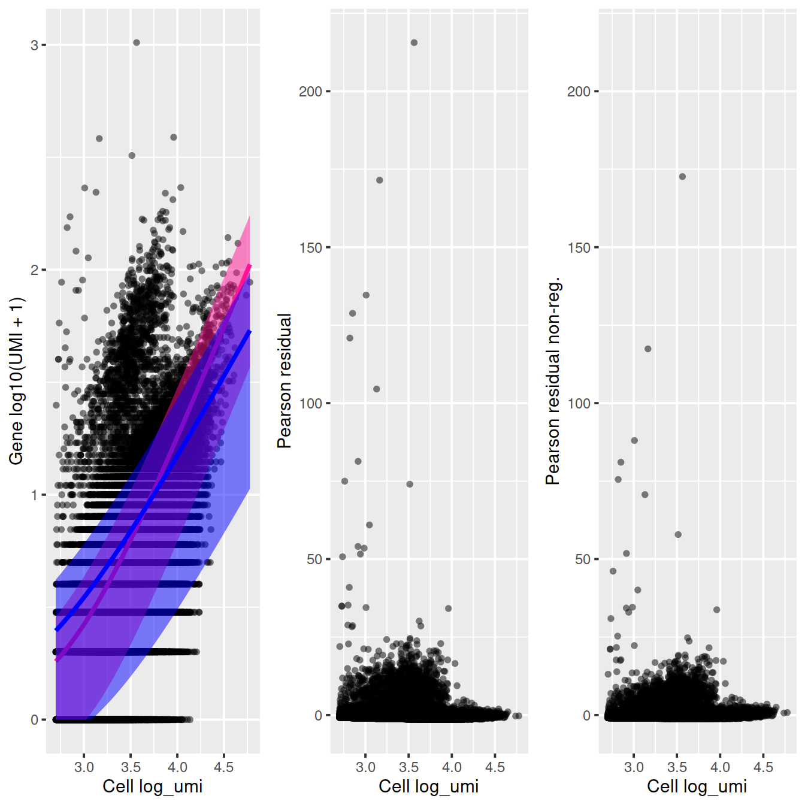


```r
# Error in seq_len(n) : argument must be coercible to non-negative integer
rowData(sce) %>% as.data.frame %>% filter(Symbol %in% c('GNLY', 'S100A9'))
#sctransform::plot_model(vst_out, counts, c('ENSG00000115523', 'ENSG00000163220'), plot_residual = TRUE, show_nr = TRUE)
sctransform::plot_model(vst_out, counts, c('ENSG00000115523'), plot_residual = TRUE, show_nr = TRUE)
# ok # sctransform::plot_model(vst_out, counts, c('ENSG00000087086'), plot_residual = TRUE, show_nr = TRUE)
```


```r
ggplot(vst_out$gene_attr, aes(residual_mean)) + geom_histogram(binwidth=0.01)
```

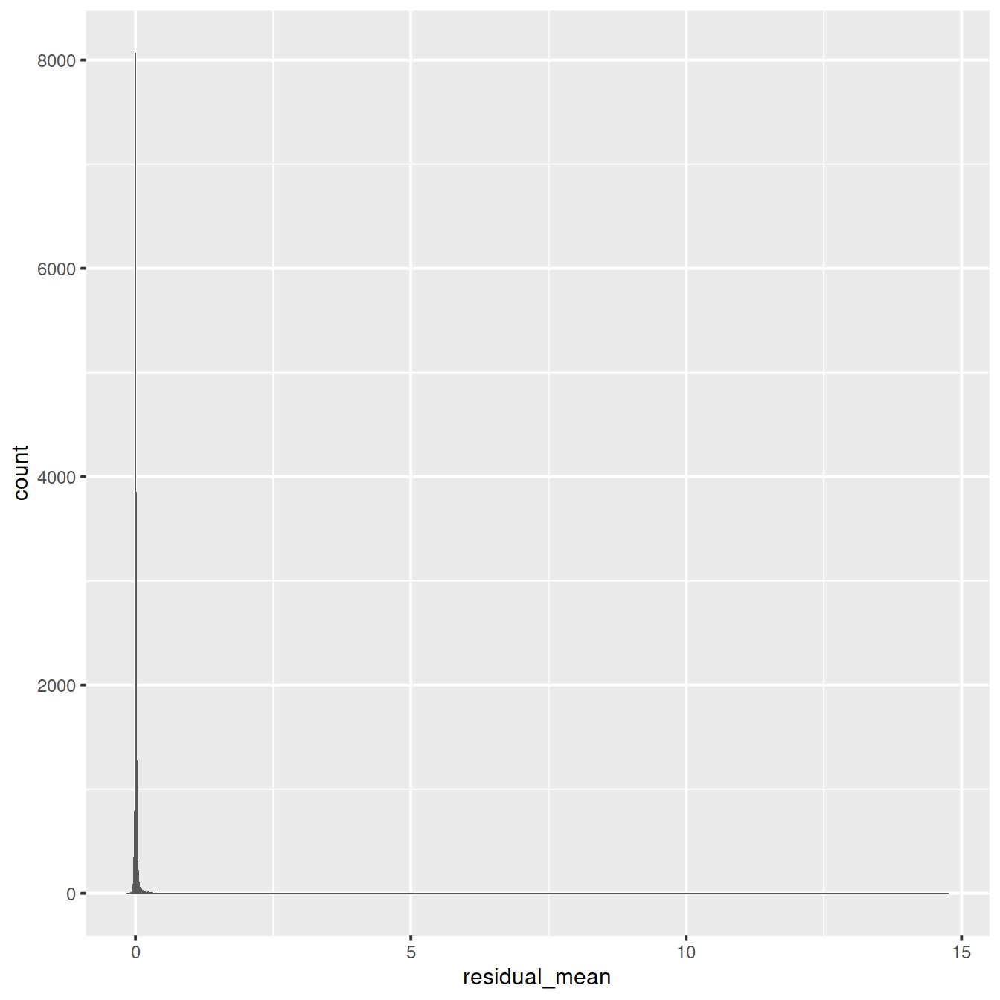

```r
ggplot(vst_out$gene_attr, aes(residual_variance)) + geom_histogram(binwidth=0.1) +
	geom_vline(xintercept=1, color='red') + xlim(0, 10)
```

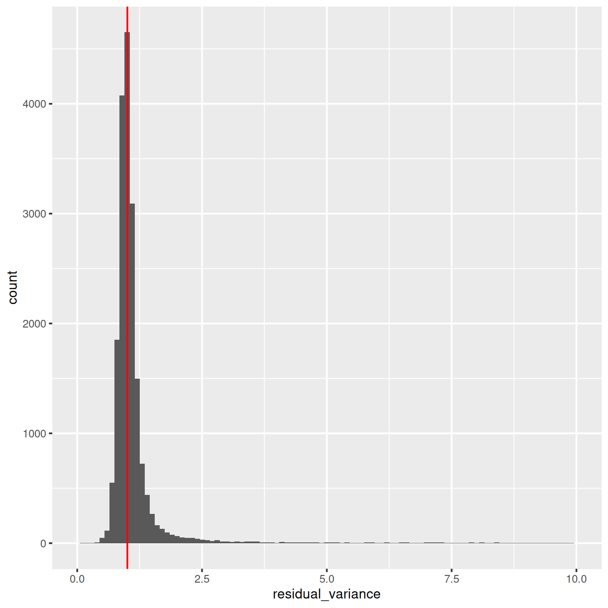

```r
ggplot(vst_out$gene_attr, aes(x=residual_mean, y=residual_variance)) +
	geom_point(alpha=0.3, shape=16) + 
	xlim(0, 2.5) +
	ylim(0, 10) +
	geom_density_2d()
```

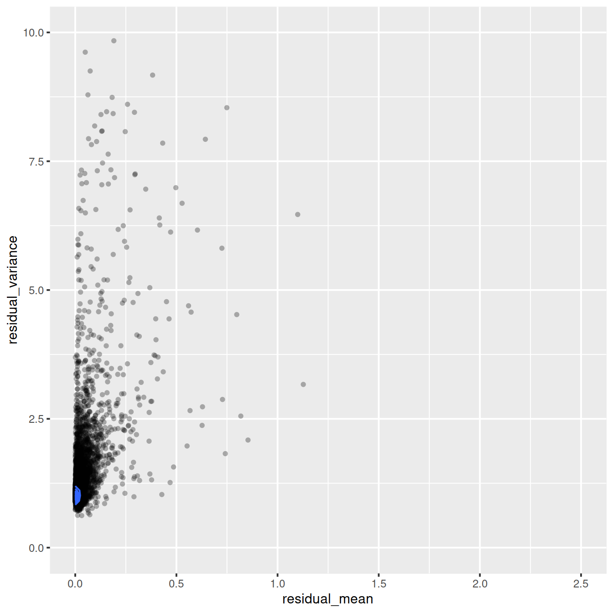


```r
ggplot(vst_out$gene_attr,
       aes(log10(gmean), residual_variance)) +
       geom_point(alpha=0.3, shape=16) +
       geom_density_2d(size = 0.3)
```

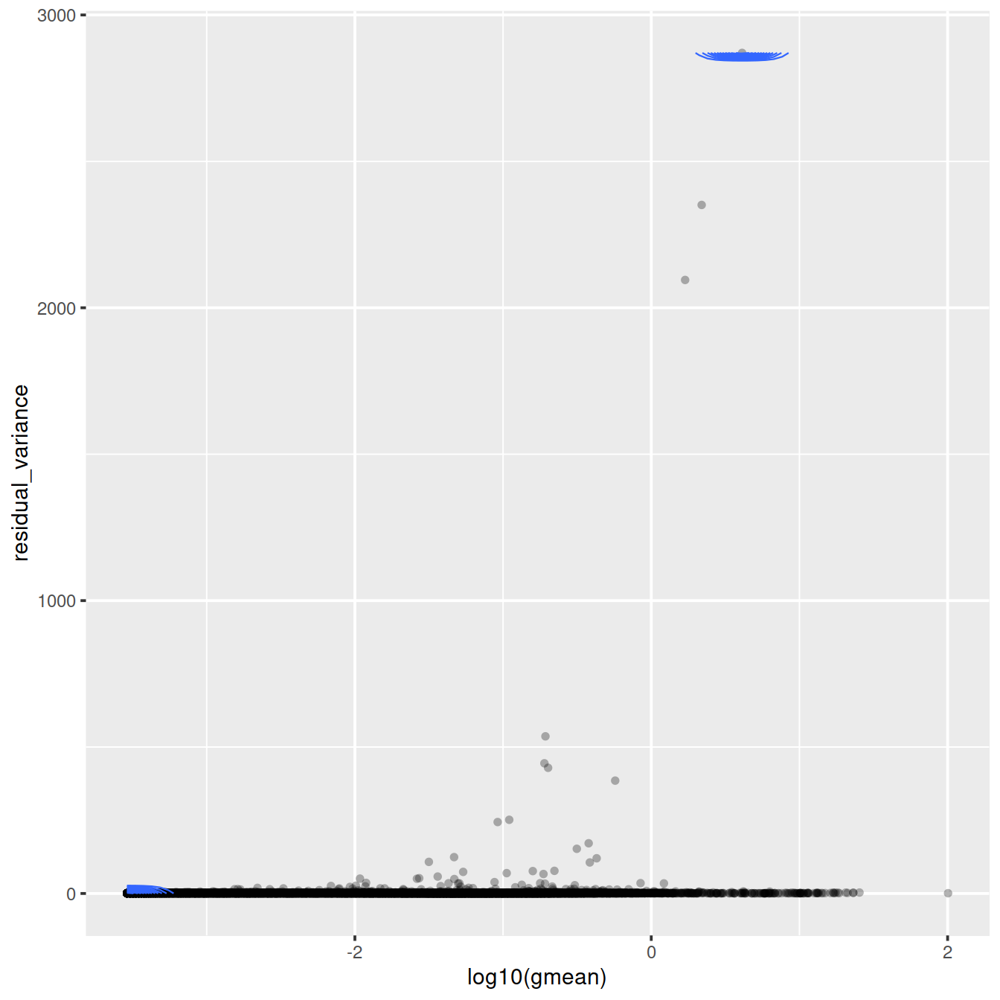


```r
dd <- vst_out$gene_attr %>%
	arrange(-residual_variance) %>%
	slice_head(n = 22) %>%
	mutate(across(where(is.numeric), round, 2))
dd %>% tibble::rownames_to_column("ensembl_gene_id") %>%
	left_join(as.data.frame(rowData(sce))[,c("ensembl_gene_id", "Symbol")],
		  by = "ensembl_gene_id") %>%
	DT::datatable(rownames = FALSE)
```

```{=html}
<div id="htmlwidget-2ce557cc59d30cb7332f" style="width:100%;height:auto;" class="datatables html-widget"></div>
<script type="application/json" data-for="htmlwidget-2ce557cc59d30cb7332f">{"x":{"filter":"none","data":[["ENSG00000244734","ENSG00000188536","ENSG00000206172","ENSG00000143546","ENSG00000090382","ENSG00000163220","ENSG00000223609","ENSG00000196565","ENSG00000257764","ENSG00000206177","ENSG00000133742","ENSG00000115523","ENSG00000211592","ENSG00000213934","ENSG00000169877","ENSG00000132465","ENSG00000211677","ENSG00000163221","ENSG00000211895","ENSG00000211679","ENSG00000211896","ENSG00000005381"],[0.68,0.52,0.47,0.11,0.09,0.12,0.24,0.09,0.06,0.17,0.15,0.03,0.29,0.02,0.17,0.17,0.14,0.03,0.12,0.15,0.04,0.02],[4.1,2.19,1.69,0.19,0.19,0.2,0.57,0.11,0.09,0.38,0.31,0.05,0.43,0.03,0.39,0.22,0.16,0.05,0.11,0.19,0.04,0.03],[649629.63,85659.15,44114.2,249.14,212.73,203.9,1329.34,3174.14,59.35,364.29,412.45,5.59,19480.27,485.05,297.02,297.11,8450.79,5.8,3391.59,5093.45,1076.76,3.76],[14.75,12.77,11.9,3.1,3.06,2.71,3.95,1.17,1.44,2.35,1.79,0.88,1.3,0.49,1.94,0.68,0.77,0.66,0.36,0.82,0.25,0.38],[2870.41,2351.19,2095.02,536.54,444.5,429.12,385.33,251.55,243.89,171.4,152.56,124.08,120.13,107.86,105.89,77.24,76.38,73.68,69.44,66.42,57.73,52.1],["HBB","HBA2","HBA1","S100A8","LYZ","S100A9","HBD","HBG2","AC020656.1","HBM","CA1","GNLY","IGKC","HBG1","AHSP","JCHAIN","IGLC2","S100A12","IGHA1","IGLC3","IGHG1","MPO"]],"container":"<table class=\"display\">\n  <thead>\n    <tr>\n      <th>ensembl_gene_id<\/th>\n      <th>detection_rate<\/th>\n      <th>gmean<\/th>\n      <th>variance<\/th>\n      <th>residual_mean<\/th>\n      <th>residual_variance<\/th>\n      <th>Symbol<\/th>\n    <\/tr>\n  <\/thead>\n<\/table>","options":{"columnDefs":[{"className":"dt-right","targets":[1,2,3,4,5]}],"order":[],"autoWidth":false,"orderClasses":false}},"evals":[],"jsHooks":[]}</script>
```


```r
# write to file
tmpFn <- sprintf("%s/%s/Robjects/%s_sce_nz_vst_out%s.Rds",
		 projDir, outDirBit, setName, setSuf)
saveRDS(vst_out, tmpFn)
```

### Hca

Load object.


```r
setName <- "hca"
setSuf <- "_5kCellPerSpl"
tmpFn <- sprintf("%s/%s/Robjects/%s_sce_nz_postDeconv%s.Rds",
		 projDir, outDirBit, setName, setSuf)
sce_hca <- readRDS(tmpFn)
sce <- sce_hca
counts <- counts(sce)
class(counts)
```

```
## [1] "dgCMatrix"
## attr(,"package")
## [1] "Matrix"
```

```r
colnames(counts) <- colData(sce)$Barcode
```

Inspect data


```r
gene_attr <- data.frame(mean = rowMeans(counts), 
                        detection_rate = rowMeans(counts > 0),
                        var = apply(counts, 1, var))
gene_attr$log_mean <- log10(gene_attr$mean)
gene_attr$log_var <- log10(gene_attr$var)
rownames(gene_attr) <- rownames(counts)
cell_attr <- data.frame(n_umi = colSums(counts),
                        n_gene = colSums(counts > 0))
rownames(cell_attr) <- colnames(counts)
```

Mean-variance relationship


```r
# add the expected detection rate under Poisson model
x = seq(from = -3, to = 2, length.out = 1000)
poisson_model <- data.frame(log_mean = x,
			    detection_rate = 1 - dpois(0, lambda = 10^x))
ggplot(gene_attr, aes(log_mean, detection_rate)) + 
  geom_point(alpha=0.3, shape=16) + 
  geom_line(data=poisson_model, color='red') +
  theme_gray(base_size = 8)
```

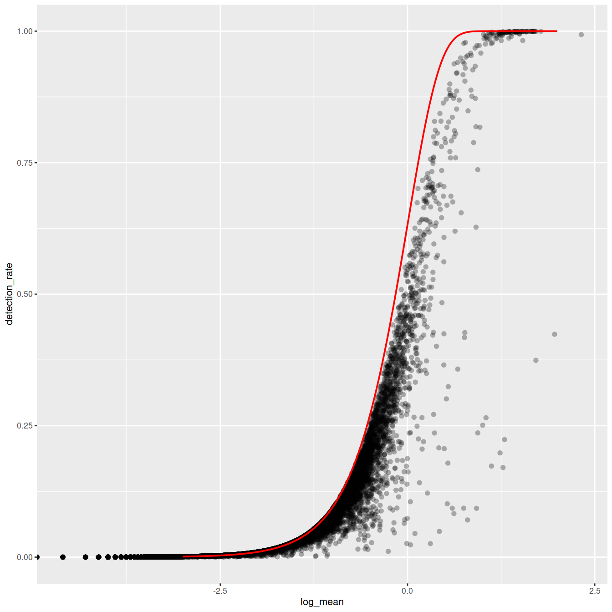

Mean-detection-rate relationship


```r
ggplot(cell_attr, aes(n_umi, n_gene)) + 
  geom_point(alpha=0.3, shape=16) + 
  geom_density_2d(size = 0.3)
```

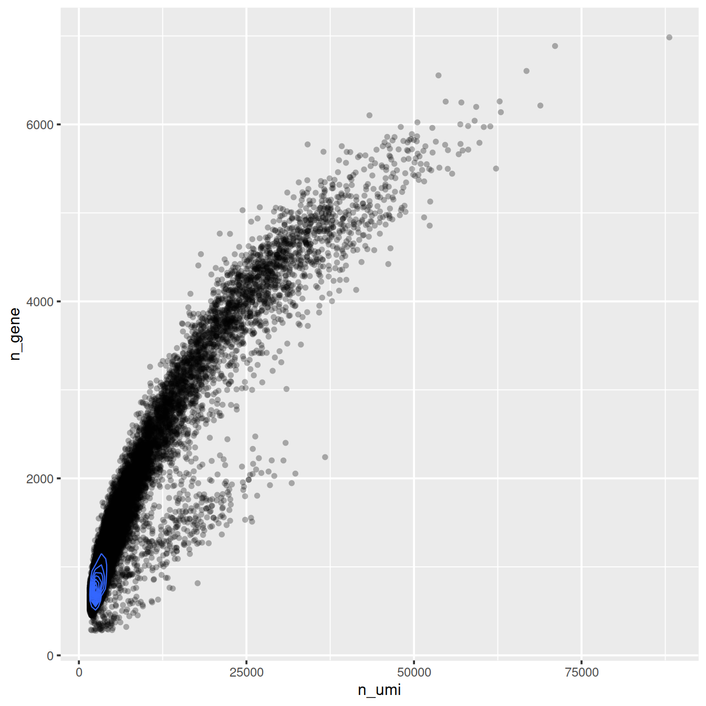


```r
# We use the Future API for parallel processing; set parameters here
future::plan(strategy = 'multicore', workers = 4)
options(future.globals.maxSize = 10 * 1024 ^ 3)

set.seed(44)
vst_out <- sctransform::vst(counts,
			    latent_var = c('log_umi'),
			    return_gene_attr = TRUE,
			    return_cell_attr = TRUE,
			    show_progress = FALSE)
sctransform::plot_model_pars(vst_out)
```

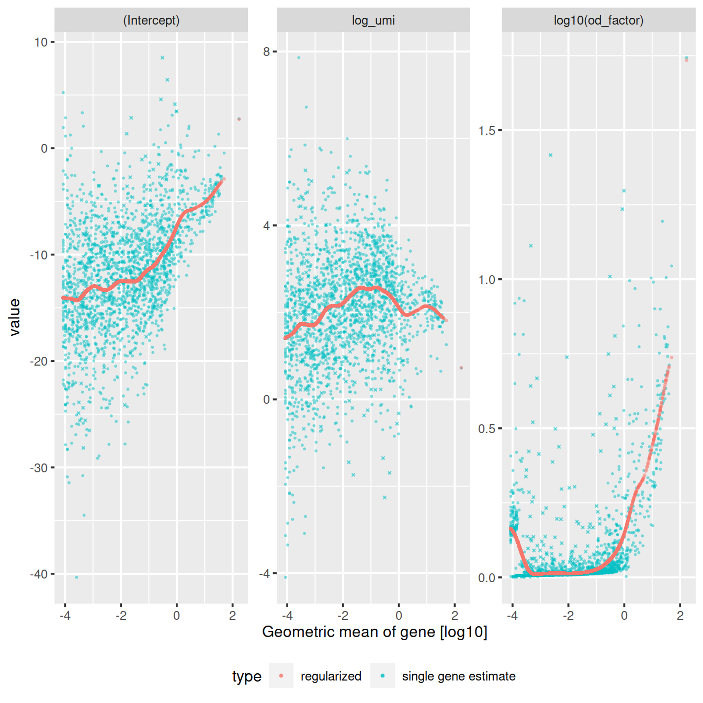

Inspect model

We will look at several genes in more detail.


```r
rowData(sce) %>%
	as.data.frame %>%
	filter(Symbol %in% c('MALAT1', 'RPL10', 'FTL'))
```

```
##                 ensembl_gene_id external_gene_name chromosome_name
## ENSG00000147403 ENSG00000147403              RPL10               X
## ENSG00000251562 ENSG00000251562             MALAT1              11
## ENSG00000087086 ENSG00000087086                FTL              19
##                 start_position end_position strand Symbol            Type
## ENSG00000147403      154389955    154409168      1  RPL10 Gene Expression
## ENSG00000251562       65497688     65506516      1 MALAT1 Gene Expression
## ENSG00000087086       48965309     48966879      1    FTL Gene Expression
##                      mean detected gene_sparsity
## ENSG00000147403  48.85548 99.28030  0.0007912115
## ENSG00000251562 193.05529 99.09786  0.0063449073
## ENSG00000087086  15.48621 96.42481  0.0170262621
```

```r
sctransform::plot_model(vst_out,
			counts,
			c('ENSG00000251562', 'ENSG00000147403', 'ENSG00000087086'),
			plot_residual = TRUE)
```

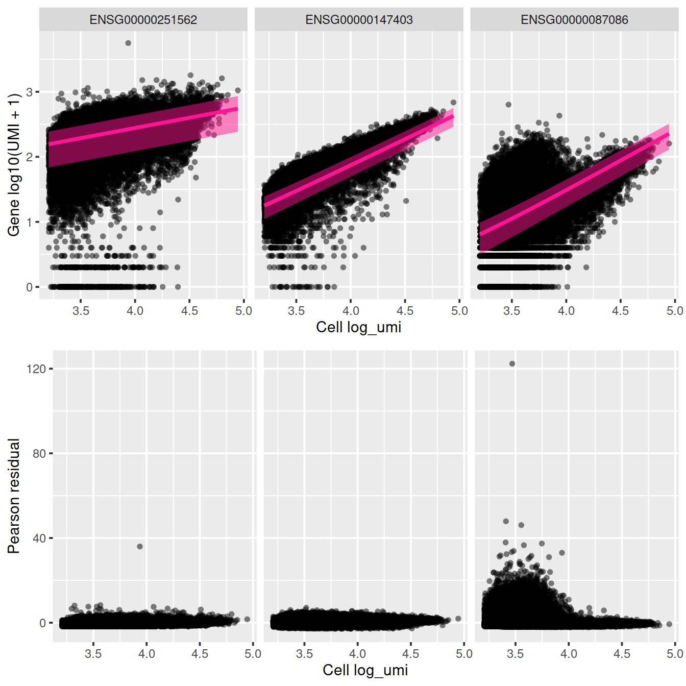


```r
sctransform::plot_model(vst_out,
			counts,
			c('ENSG00000087086'),
			plot_residual = TRUE,
			show_nr = TRUE,
			arrange_vertical = FALSE)
```

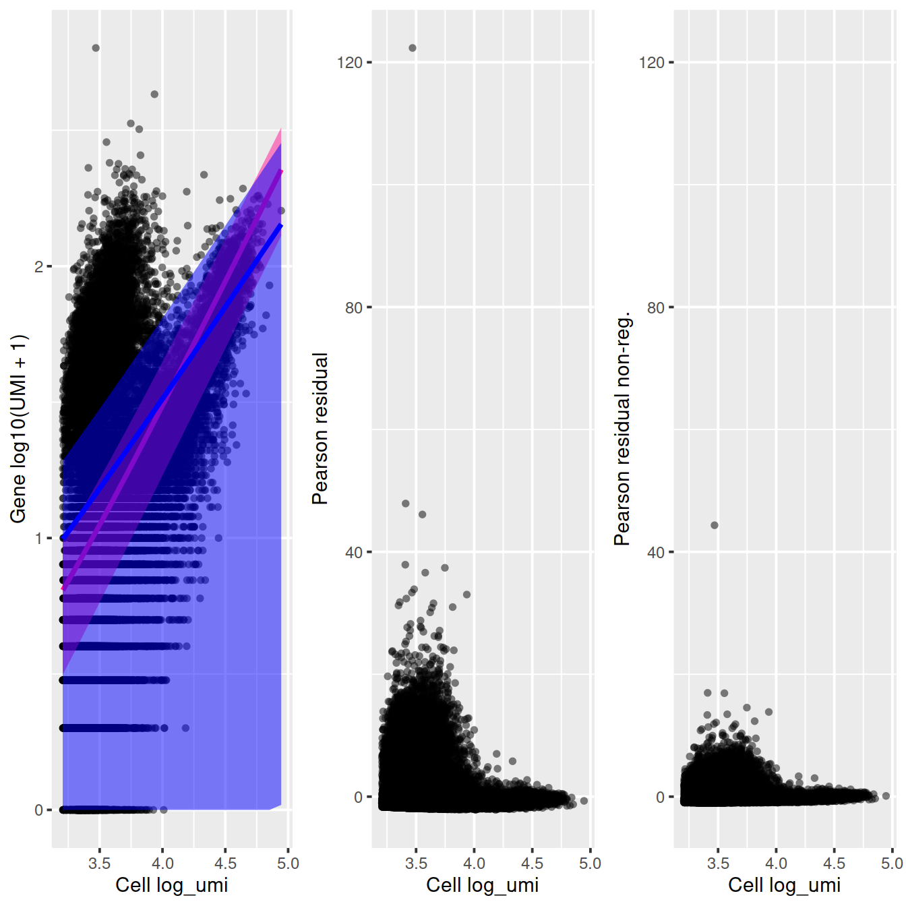


```r
ggplot(vst_out$gene_attr, aes(residual_mean)) + geom_histogram(binwidth=0.01)
```

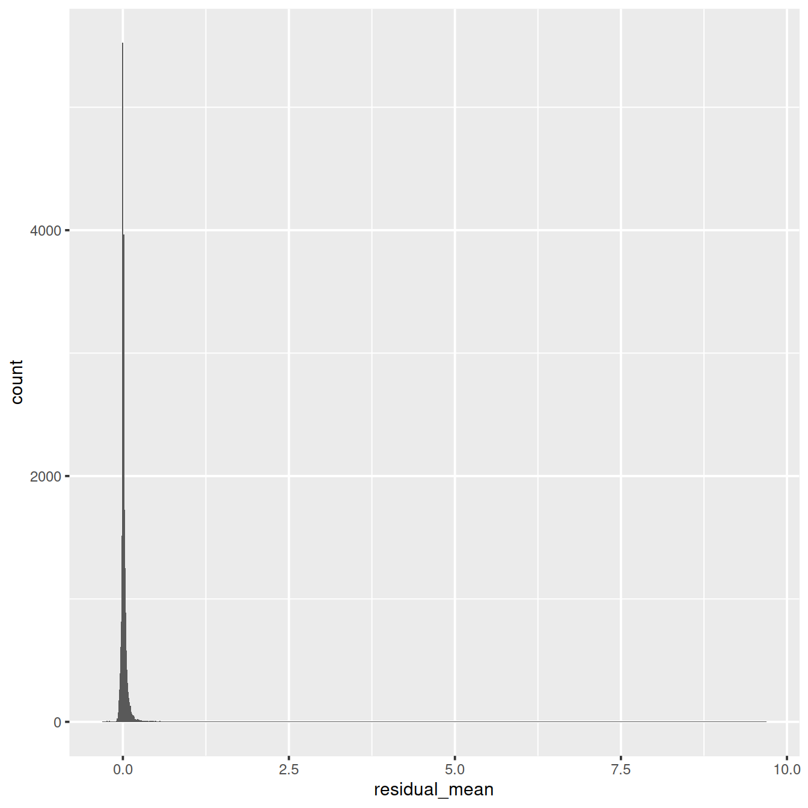

```r
ggplot(vst_out$gene_attr, aes(residual_variance)) + geom_histogram(binwidth=0.1) +
	geom_vline(xintercept=1, color='red') + xlim(0, 10)
```

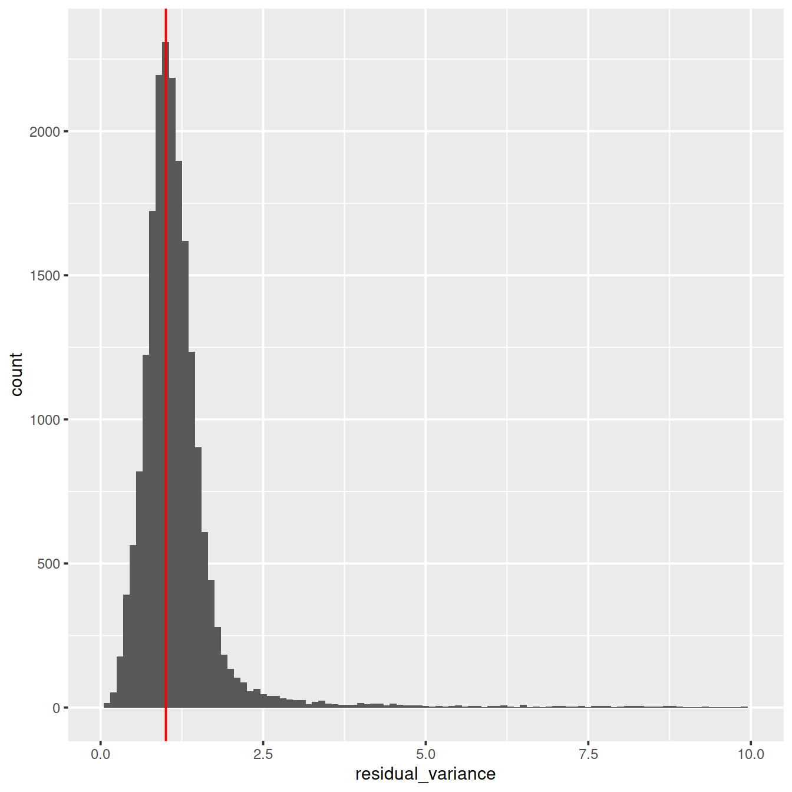

```r
ggplot(vst_out$gene_attr, aes(x=residual_mean, y=residual_variance)) +
	geom_point(alpha=0.3, shape=16) + 
	xlim(0, 2.5) +
	ylim(0, 10) +
	geom_density_2d()
```

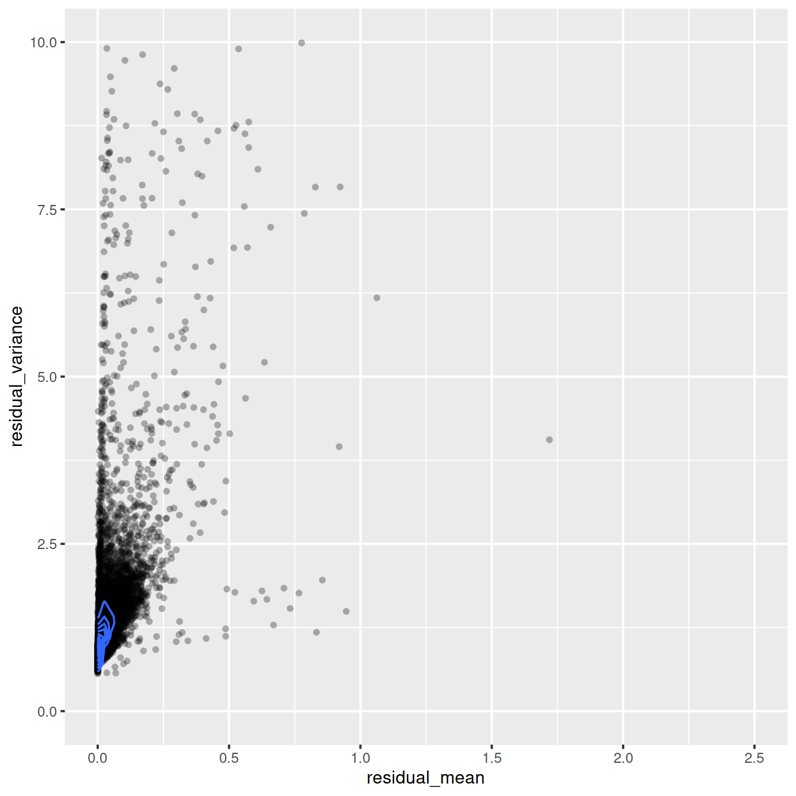


```r
ggplot(vst_out$gene_attr, aes(log10(gmean), residual_variance)) +
	geom_point(alpha=0.3, shape=16) +
	geom_density_2d(size = 0.3)
```

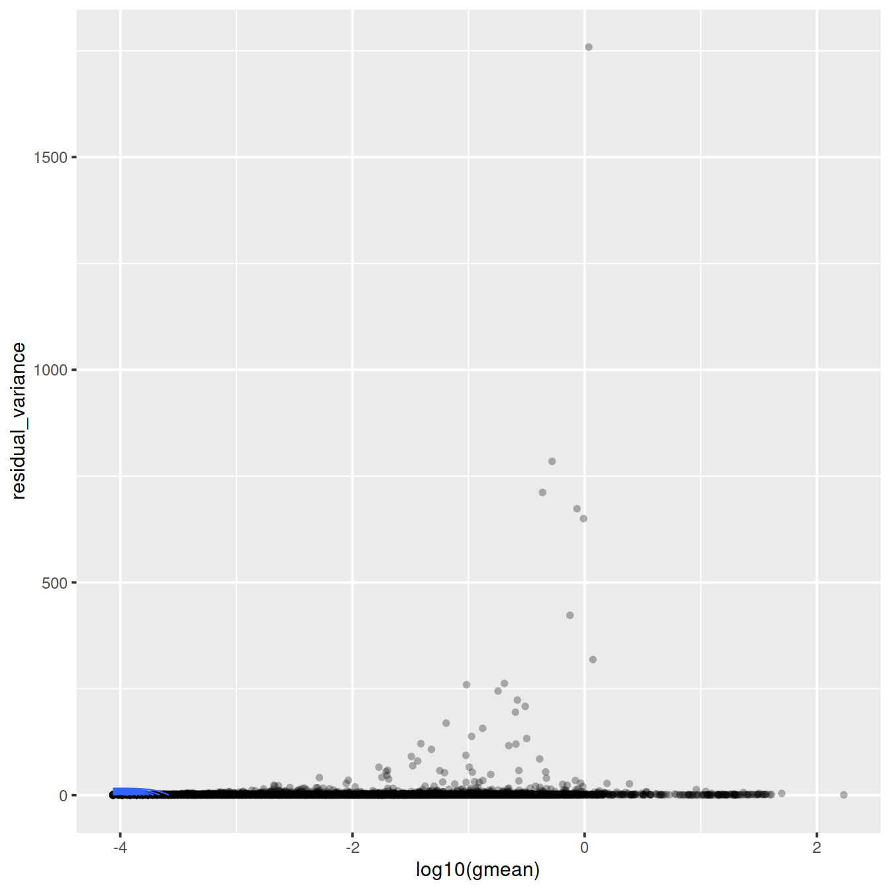


```r
#dd <- head(round(vst_out$gene_attr[order(-vst_out$gene_attr$residual_variance), ], 2), 22)
dd <- vst_out$gene_attr %>%
	arrange(-residual_variance) %>%
	slice_head(n = 22) %>%
	mutate(across(where(is.numeric), round, 2))
dd %>% tibble::rownames_to_column("ensembl_gene_id") %>%
	left_join(as.data.frame(rowData(sce))[,c("ensembl_gene_id", "Symbol")],
		  "ensembl_gene_id") %>%
	DT::datatable(rownames = FALSE)
```

```{=html}
<div id="htmlwidget-71edff69a27fd2f470ba" style="width:100%;height:auto;" class="datatables html-widget"></div>
<script type="application/json" data-for="htmlwidget-71edff69a27fd2f470ba">{"x":{"filter":"none","data":[["ENSG00000244734","ENSG00000206172","ENSG00000188536","ENSG00000143546","ENSG00000163220","ENSG00000211592","ENSG00000090382","ENSG00000211895","ENSG00000211896","ENSG00000132465","ENSG00000211677","ENSG00000115523","ENSG00000223609","ENSG00000211897","ENSG00000211679","ENSG00000206177","ENSG00000169877","ENSG00000196415","ENSG00000133742","ENSG00000257764","ENSG00000197561","ENSG00000005381"],[0.42,0.22,0.2,0.24,0.25,0.37,0.26,0.17,0.07,0.1,0.17,0.12,0.09,0.05,0.09,0.04,0.09,0.02,0.08,0.11,0.03,0.05],[1.08,0.52,0.43,0.86,0.98,0.75,1.18,0.2,0.1,0.18,0.26,0.31,0.25,0.06,0.13,0.11,0.32,0.04,0.26,0.22,0.05,0.09],[240501.79,15003.22,15085.72,842.15,973.78,398258.99,982.57,40195.28,11629.36,2254.22,141577.13,55.79,842.09,3990.34,49589.65,137.76,805.14,15.16,693.38,29.92,22.9,28.25],[9.68,5.03,4.32,7.07,7.41,3.27,6.07,1.35,1.23,1.66,1.77,2.97,1.65,0.83,1.17,1.03,2.01,0.78,1.54,1.68,0.75,1.07],[1758.6,784.58,711.64,673.37,650.06,422.71,318.73,262.54,259.66,244.92,223.55,208.75,194.96,169.3,157.04,138.09,133.14,120.96,120.02,116.39,107.62,93.5],["HBB","HBA1","HBA2","S100A8","S100A9","IGKC","LYZ","IGHA1","IGHG1","JCHAIN","IGLC2","GNLY","HBD","IGHG3","IGLC3","HBM","AHSP","PRTN3","CA1","AC020656.1","ELANE","MPO"]],"container":"<table class=\"display\">\n  <thead>\n    <tr>\n      <th>ensembl_gene_id<\/th>\n      <th>detection_rate<\/th>\n      <th>gmean<\/th>\n      <th>variance<\/th>\n      <th>residual_mean<\/th>\n      <th>residual_variance<\/th>\n      <th>Symbol<\/th>\n    <\/tr>\n  <\/thead>\n<\/table>","options":{"columnDefs":[{"className":"dt-right","targets":[1,2,3,4,5]}],"order":[],"autoWidth":false,"orderClasses":false}},"evals":[],"jsHooks":[]}</script>
```


```r
# write to file
tmpFn <- sprintf("%s/%s/Robjects/%s_sce_nz_vst_out%s.Rds",
		 projDir, outDirBit, setName, setSuf)
saveRDS(vst_out, tmpFn)
```

## Session information


```r
sessionInfo()
```

```
## R version 4.0.3 (2020-10-10)
## Platform: x86_64-pc-linux-gnu (64-bit)
## Running under: CentOS Linux 8
## 
## Matrix products: default
## BLAS:   /opt/R/R-4.0.3/lib64/R/lib/libRblas.so
## LAPACK: /opt/R/R-4.0.3/lib64/R/lib/libRlapack.so
## 
## locale:
##  [1] LC_CTYPE=en_GB.UTF-8       LC_NUMERIC=C              
##  [3] LC_TIME=en_GB.UTF-8        LC_COLLATE=en_GB.UTF-8    
##  [5] LC_MONETARY=en_GB.UTF-8    LC_MESSAGES=en_GB.UTF-8   
##  [7] LC_PAPER=en_GB.UTF-8       LC_NAME=C                 
##  [9] LC_ADDRESS=C               LC_TELEPHONE=C            
## [11] LC_MEASUREMENT=en_GB.UTF-8 LC_IDENTIFICATION=C       
## 
## attached base packages:
## [1] parallel  stats4    stats     graphics  grDevices utils     datasets 
## [8] methods   base     
## 
## other attached packages:
##  [1] Cairo_1.5-12.2              dplyr_1.0.5                
##  [3] ggplot2_3.3.3               scran_1.18.7               
##  [5] scuttle_1.0.4               SingleCellExperiment_1.12.0
##  [7] SummarizedExperiment_1.20.0 Biobase_2.50.0             
##  [9] GenomicRanges_1.42.0        GenomeInfoDb_1.26.7        
## [11] IRanges_2.24.1              S4Vectors_0.28.1           
## [13] BiocGenerics_0.36.1         MatrixGenerics_1.2.1       
## [15] matrixStats_0.58.0          knitr_1.32                 
## 
## loaded via a namespace (and not attached):
##  [1] bitops_1.0-7              sctransform_0.3.2.9005   
##  [3] tools_4.0.3               bslib_0.2.4              
##  [5] DT_0.18                   utf8_1.2.1               
##  [7] R6_2.5.0                  irlba_2.3.3              
##  [9] DBI_1.1.1                 colorspace_2.0-0         
## [11] withr_2.4.2               gridExtra_2.3            
## [13] tidyselect_1.1.1          compiler_4.0.3           
## [15] BiocNeighbors_1.8.2       isoband_0.2.4            
## [17] DelayedArray_0.16.3       labeling_0.4.2           
## [19] bookdown_0.22             sass_0.3.1               
## [21] scales_1.1.1              stringr_1.4.0            
## [23] digest_0.6.27             rmarkdown_2.7            
## [25] XVector_0.30.0            pkgconfig_2.0.3          
## [27] htmltools_0.5.1.1         parallelly_1.24.0        
## [29] sparseMatrixStats_1.2.1   fastmap_1.1.0            
## [31] limma_3.46.0              highr_0.9                
## [33] htmlwidgets_1.5.3         rlang_0.4.10             
## [35] shiny_1.6.0               DelayedMatrixStats_1.12.3
## [37] jquerylib_0.1.3           generics_0.1.0           
## [39] farver_2.1.0              jsonlite_1.7.2           
## [41] crosstalk_1.1.1           BiocParallel_1.24.1      
## [43] RCurl_1.98-1.3            magrittr_2.0.1           
## [45] BiocSingular_1.6.0        GenomeInfoDbData_1.2.4   
## [47] Matrix_1.3-2              Rcpp_1.0.6               
## [49] munsell_0.5.0             fansi_0.4.2              
## [51] lifecycle_1.0.0           stringi_1.5.3            
## [53] yaml_2.2.1                edgeR_3.32.1             
## [55] MASS_7.3-54               zlibbioc_1.36.0          
## [57] plyr_1.8.6                grid_4.0.3               
## [59] promises_1.2.0.1          listenv_0.8.0            
## [61] dqrng_0.3.0               crayon_1.4.1             
## [63] lattice_0.20-44           beachmat_2.6.4           
## [65] locfit_1.5-9.4            pillar_1.6.0             
## [67] igraph_1.2.6              future.apply_1.7.0       
## [69] reshape2_1.4.4            codetools_0.2-18         
## [71] glue_1.4.2                evaluate_0.14            
## [73] httpuv_1.5.5              vctrs_0.3.7              
## [75] gtable_0.3.0              purrr_0.3.4              
## [77] future_1.21.0             assertthat_0.2.1         
## [79] xfun_0.22                 mime_0.10                
## [81] rsvd_1.0.5                xtable_1.8-4             
## [83] later_1.2.0               tibble_3.1.1             
## [85] bluster_1.0.0             globals_0.14.0           
## [87] statmod_1.4.35            ellipsis_0.3.2
```
