# Quality Control - with 2-5k cells per sample {#PreProcAllCellsTop}


## Introduction

<!--
OSCA chapter 6 Quality Control
-->

We will use two sets of Bone Marrow Mononuclear Cells (BMMC):

* 'CaronBourque2020': pediatric samples
* 'Hca': HCA Census of Immune Cells for adult BMMCs

Fastq files were retrieved from publicly available archive (SRA and HCA). 

Sequencing quality was assessed and visualised using fastQC and MultiQC.

Reads were aligned against GRCh38 and features counted using cellranger (v3.1.0).

We will now check the quality of the data further:

* mapping quality and amplification rate
* cell counts
* distribution of keys quality metrics

We will then:

* filter genes with very low expression
* identify low-quality cells
* filter and/or mark low quality cells

<!-- TODO:
- add references and/or links
- add code used to fetch the data or point to script or have chapter for retrieval+QC and for cellranger
-->


<!--
for HCA ABMMC: see HCAData and OSCA chapter 'HCA human bone marrow (10X Genomics)',
drawing on OSCA chapter 'Dealing with big data'
https://bioconductor.org/books/release/OSCA/hca-human-bone-marrow-10x-genomics.html
-->

## Load packages

* SingleCellExperiment - to store the data
* Matrix - to deal with sparse and/or large matrices
* DropletUtils - utilities for the analysis of droplet-based, inc. cell counting
* scater - QC
* scran - normalisation
* igraph - graphs <!-- for clusterisation, to check --> 
* biomaRt - for gene annotation
* ggplot2 - for plotting
* irlba - for faster PCA


```r
#projDir <- "/home/ubuntu/Course_Materials/scRNAseq"
projDir <- params$projDir
dirRel <- params$dirRel
outDirBit <- params$outDirBit
setSuf <- params$setSuf

# with merge-knit
# params are read once only.
# but we need to change one param value: dirRel
# 3 solutions:
# - unlock bindings to edit the global value
# - copy params to edit and use the local copy
# - simply set dirRel, based on type of merging if need be.

# unlock binding
# (but should remember to set back to init value if need be)
#bindingIsLocked("params", env = .GlobalEnv)
#unlockBinding("params", env = .GlobalEnv)
#params$stuff <- 'toto'

# OR:

# global_params <- params; # if merge-knit
# have local copy of params to edit and use here
#local_params <- params; # if merge-knit
#local_params$stuff <- 'toto'

# OR:

# if merge-knit, edit params.
if(params$bookType == "mk"){
	setName <- "caron"
	setSuf <- "_allCells"
	dirRel <- ".."
	cacheLazyBool <- FALSE
}

# other variables:
wrkDir <- sprintf("%s/CaronBourque2020/grch38300", projDir) 
qcPlotDirBit <- "Plots/Qc"
poolBool <- TRUE # FALSE # whether to read each sample in and pool them and write object to file, or just load that file.
biomartBool <- TRUE # FALSE # biomaRt sometimes fails, do it once, write to file and use that copy.
addQcBool <- TRUE # FALSE
runAll <- TRUE

dir.create(sprintf("%s/%s/%s", projDir, outDirBit, qcPlotDirBit),
           showWarnings = FALSE,
           recursive = TRUE)
dir.create(sprintf("%s/%s/Robjects", projDir, outDirBit),
	   showWarnings = FALSE)
```


## Sample sheet

We will load both the Caron and Hca data sets.


```r
# CaronBourque2020
cb_sampleSheetFn <- file.path(projDir, "Data/CaronBourque2020/SraRunTable.txt")
# Human Cell Atlas
hca_sampleSheetFn <- file.path(projDir, "Data/Hca/accList_Hca.txt")

# read sample sheet in:
splShtColToKeep <- c("Run", "Sample.Name", "source_name")

cb_sampleSheet <- read.table(cb_sampleSheetFn, header=T, sep=",")
hca_sampleSheet <- read.table(hca_sampleSheetFn, header=F, sep=",")
colnames(hca_sampleSheet) <- "Sample.Name"
hca_sampleSheet$Run <- hca_sampleSheet$Sample.Name
hca_sampleSheet$source_name <- "ABMMC" # adult BMMC

sampleSheet <- rbind(cb_sampleSheet[,splShtColToKeep], hca_sampleSheet[,splShtColToKeep])

sampleSheet %>%
	as.data.frame() %>%
	datatable(rownames = TRUE)
```

```{=html}
<div id="htmlwidget-d8a8bc6f26130c77f824" style="width:100%;height:auto;" class="datatables html-widget"></div>
<script type="application/json" data-for="htmlwidget-d8a8bc6f26130c77f824">{"x":{"filter":"none","data":[["1","2","3","4","5","6","7","8","9","10","11","12","13","14","15","16","17","18","19","20"],["SRR9264343","SRR9264344","SRR9264345","SRR9264346","SRR9264347","SRR9264348","SRR9264349","SRR9264350","SRR9264351","SRR9264352","SRR9264353","SRR9264354","MantonBM1","MantonBM2","MantonBM3","MantonBM4","MantonBM5","MantonBM6","MantonBM7","MantonBM8"],["GSM3872434","GSM3872435","GSM3872436","GSM3872437","GSM3872438","GSM3872439","GSM3872440","GSM3872441","GSM3872442","GSM3872442","GSM3872443","GSM3872444","MantonBM1","MantonBM2","MantonBM3","MantonBM4","MantonBM5","MantonBM6","MantonBM7","MantonBM8"],["ETV6-RUNX1","ETV6-RUNX1","ETV6-RUNX1","ETV6-RUNX1","HHD","HHD","PRE-T","PRE-T","PBMMC","PBMMC","PBMMC","PBMMC","ABMMC","ABMMC","ABMMC","ABMMC","ABMMC","ABMMC","ABMMC","ABMMC"]],"container":"<table class=\"display\">\n  <thead>\n    <tr>\n      <th> <\/th>\n      <th>Run<\/th>\n      <th>Sample.Name<\/th>\n      <th>source_name<\/th>\n    <\/tr>\n  <\/thead>\n<\/table>","options":{"order":[],"autoWidth":false,"orderClasses":false,"columnDefs":[{"orderable":false,"targets":0}]}},"evals":[],"jsHooks":[]}</script>
```

## Data representation

We will use a [SingleCellExperiment](https://bioconductor.org/packages/SingleCellExperiment/) object that is described [here](https://www.nature.com/articles/s41592-019-0654-x) and stores various data types:

* the count matrix
* feature (gene) annotation
* droplet annotation
* outcome of downstream analysis such as dimensionality reduction


```r
tmpFn <- sprintf("%s/Images/tenxLibStructureV3.png", "..")
knitr::include_graphics(tmpFn, auto_pdf = TRUE)
```

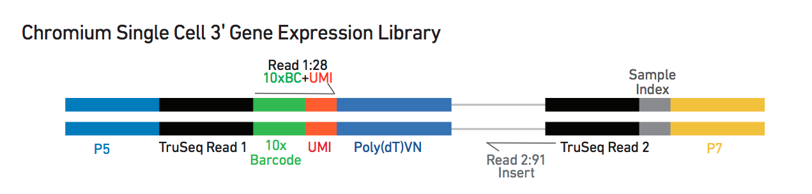

## Example

We will load the data for the first sample in the sample sheet: SRR9264343.


```r
i <- 1
sample.path <- sprintf("%s/%s/%s/outs/raw_feature_bc_matrix/",
		      wrkDir,
		      sampleSheet[i,"Run"],
		      sampleSheet[i,"Run"])
sce.raw <- read10xCounts(sample.path, col.names=TRUE)
sce.raw
```

```
## class: SingleCellExperiment 
## dim: 33538 737280 
## metadata(1): Samples
## assays(1): counts
## rownames(33538): ENSG00000243485 ENSG00000237613 ... ENSG00000277475
##   ENSG00000268674
## rowData names(3): ID Symbol Type
## colnames(737280): AAACCTGAGAAACCAT-1 AAACCTGAGAAACCGC-1 ...
##   TTTGTCATCTTTAGTC-1 TTTGTCATCTTTCCTC-1
## colData names(2): Sample Barcode
## reducedDimNames(0):
## altExpNames(0):
```

We can access these different types of data with various functions.

Number of genes and droplets in the count matrix:


```r
dim(counts(sce.raw))
```

```
## [1]  33538 737280
```

Features, with rowData():


```r
head(rowData(sce.raw))
```

```
## DataFrame with 6 rows and 3 columns
##                              ID      Symbol            Type
##                     <character> <character>     <character>
## ENSG00000243485 ENSG00000243485 MIR1302-2HG Gene Expression
## ENSG00000237613 ENSG00000237613     FAM138A Gene Expression
## ENSG00000186092 ENSG00000186092       OR4F5 Gene Expression
## ENSG00000238009 ENSG00000238009  AL627309.1 Gene Expression
## ENSG00000239945 ENSG00000239945  AL627309.3 Gene Expression
## ENSG00000239906 ENSG00000239906  AL627309.2 Gene Expression
```

Samples, with colData():


```r
head(colData(sce.raw))
```

```
## DataFrame with 6 rows and 2 columns
##                                    Sample            Barcode
##                               <character>        <character>
## AAACCTGAGAAACCAT-1 /ssd/personal/baller.. AAACCTGAGAAACCAT-1
## AAACCTGAGAAACCGC-1 /ssd/personal/baller.. AAACCTGAGAAACCGC-1
## AAACCTGAGAAACCTA-1 /ssd/personal/baller.. AAACCTGAGAAACCTA-1
## AAACCTGAGAAACGAG-1 /ssd/personal/baller.. AAACCTGAGAAACGAG-1
## AAACCTGAGAAACGCC-1 /ssd/personal/baller.. AAACCTGAGAAACGCC-1
## AAACCTGAGAAAGTGG-1 /ssd/personal/baller.. AAACCTGAGAAAGTGG-1
```

Single-cell RNA-seq data compared to bulk RNA-seq is sparse, especially with droplet-based methods such as 10X, mostly because:

* a given cell does not express each gene
* the library preparation does not capture all transcript the cell does express
* the sequencing depth per cell is far lower

Counts, with counts(). Given the large number of droplets in a sample, count matrices can be large. They are however very sparse and can be stored in a 'sparse matrix' that only stores non-zero values, for example a 'dgCMatrix' object ('DelayedArray' class).


```r
counts(sce.raw) <- as(counts(sce.raw), "dgCMatrix")
#class(counts(sce.raw))
counts(sce.raw)[1:10, 1:10]
```

```
## 10 x 10 sparse Matrix of class "dgCMatrix"
##                                    
## ENSG00000243485 . . . . . . . . . .
## ENSG00000237613 . . . . . . . . . .
## ENSG00000186092 . . . . . . . . . .
## ENSG00000238009 . . . . . . . . . .
## ENSG00000239945 . . . . . . . . . .
## ENSG00000239906 . . . . . . . . . .
## ENSG00000241599 . . . . . . . . . .
## ENSG00000236601 . . . . . . . . . .
## ENSG00000284733 . . . . . . . . . .
## ENSG00000235146 . . . . . . . . . .
```

## Mapping QC

### Gene body coverage

The plot below show the average coverage (y-axis) along the body of genes (x-axis).

<!-- In /ssd/personal/baller01/20200511_FernandesM_ME_crukBiSs2020/AnaWiSce/AnaKmWiC/ScriptsKmWiC: -->


```r
tmpFn <- sprintf("%s/Images/1_AAACCTGAGACTTTCG-1.rseqcGeneBodyCovCheck.txt.geneBodyCoverage.curves.png", "..")
knitr::include_graphics(tmpFn, auto_pdf = TRUE)
```

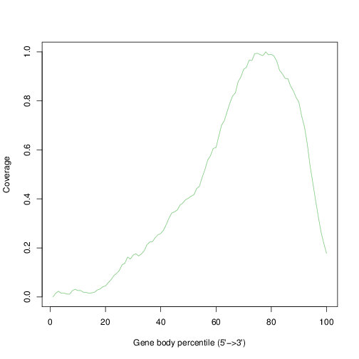

### Amplification rate

We will use the information stored in the 'molecule info' file to count the number of UMI and reads for each gene in each cell.


```r
##mol.info.file <- sprintf("%s/%s/%s/outs/molecule_info.h5", wrkDir, sampleSheet[i,"Run"], sampleSheet[i,"Run"])
##mol.info <- read10xMolInfo(mol.info.file)
# or mol.info object if issue with H5Fopen
mol.info.file <- sprintf("%s/%s/%s/outs/molecule_info_h5.Rds", wrkDir, sampleSheet[i,"Run"], sampleSheet[i,"Run"])
mol.info <- readRDS(mol.info.file)
```


```r
# slow

# 'data' slot:
mol.info$data
```

```
## DataFrame with 18544666 rows and 5 columns
##                      cell       umi gem_group      gene     reads
##               <character> <integer> <integer> <integer> <integer>
## 1        AAACCTGAGAAACCTA    467082         1      3287         1
## 2        AAACCTGAGAAACCTA    205888         1      3446         1
## 3        AAACCTGAGAAACCTA    866252         1      3896         3
## 4        AAACCTGAGAAACCTA    796027         1      3969         1
## 5        AAACCTGAGAAACCTA    542561         1      5008         1
## ...                   ...       ...       ...       ...       ...
## 18544662 TTTGTCATCTTTAGTC    927060         1     23634         1
## 18544663 TTTGTCATCTTTAGTC    975865         1     27143         1
## 18544664 TTTGTCATCTTTAGTC    364964         1     27467         4
## 18544665 TTTGTCATCTTTAGTC    152570         1     30125         7
## 18544666 TTTGTCATCTTTAGTC    383230         1     30283         5
```

```r
# 'genes' slot
head(mol.info$genes)
```

```
## [1] "ENSG00000243485" "ENSG00000237613" "ENSG00000186092" "ENSG00000238009"
## [5] "ENSG00000239945" "ENSG00000239906"
```

```r
# for each cell and gene, count UMIs
# slow, but needs running, at least once
# so write it to file to load later if need be.
tmpFn <- sprintf("%s/%s/Robjects/sce_preProc_ampDf1.Rds", projDir, outDirBit)
if(!file.exists(tmpFn))
{
  ampDf <- mol.info$data %>%
    data.frame() %>%
    mutate(umi = as.character(umi)) %>%
    group_by(cell, gene) %>%
    summarise(nUmis = n(),
	      totReads=sum(reads)) %>%
		data.frame()

	# Write object to file
	saveRDS(ampDf, tmpFn)
} else {
	ampDf <- readRDS(tmpFn)
}
rm(tmpFn)

# distribution of totReads
summary(ampDf$totReads)
```

```
##     Min.  1st Qu.   Median     Mean  3rd Qu.     Max. 
##     1.00     2.00     6.00    15.23    12.00 79275.00
```

```r
# distribution of nUmis
summary(ampDf$nUmis)
```

```
##     Min.  1st Qu.   Median     Mean  3rd Qu.     Max. 
##    1.000    1.000    1.000    2.377    1.000 7137.000
```


```r
# too slow
sp <- ggplot(ampDf, aes(x=nUmis, y=totReads)) +
  geom_point() +
  scale_x_continuous(trans='log2') +
  scale_y_continuous(trans='log2')
sp
#ggMarginal(sp)
```


```r
sp2 <- ggplot(ampDf, aes(x=nUmis, y=totReads)) +
  geom_bin2d(bins = 50) +
  scale_fill_continuous(type = "viridis") +
  scale_x_continuous(trans='log10') +
  scale_y_continuous(trans='log10') +
  ggtitle("totReads vs nUmis") +
  theme_bw()

sp2
```

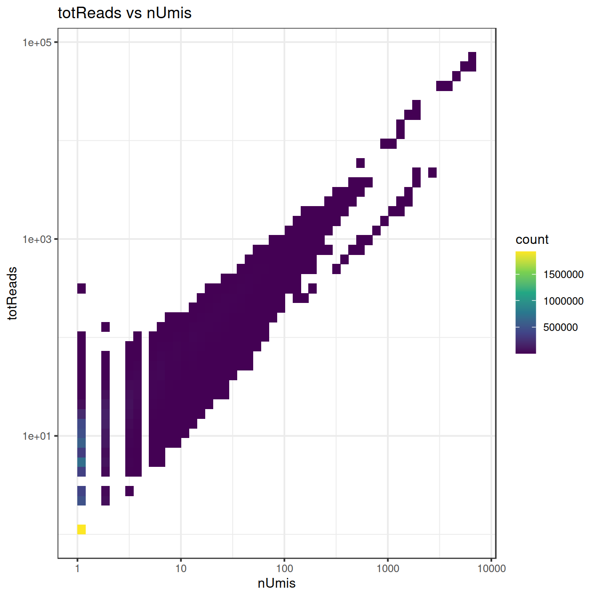

```r
gc(verbose=FALSE)
```

```
##            used  (Mb) gc trigger   (Mb)  max used   (Mb)
## Ncells  7789319 416.0   37880625 2023.1  54939086 2934.1
## Vcells 89103218 679.9  257295792 1963.1 257295792 1963.1
```

## Cell calling for droplet data

For a given sample, amongst the tens of thousands of droplets used in the assay, some will contain a cell while many others will not. The presence of RNA in a droplet will show with non-zero UMI count. This is however not sufficient to infer that the droplet does contain a cell. Indeed, after sample preparation, some cell debris including RNA will still float in the mix. This ambient RNA is unwillignly captured during library preparation and sequenced.

Cellranger generates a count matrix that includes all droplets analysed in the assay. We will now load this 'raw matrix' for one sample and draw the distribution of UMI counts.

Distribution of UMI counts:


```r
libSizeDf <- mol.info$data %>%
  data.frame() %>%
  mutate(umi = as.character(umi)) %>%
  group_by(cell) %>%
  summarise(nUmis = n(), totReads=sum(reads)) %>%
  data.frame()
rm(mol.info)
gc()
```

```
##            used  (Mb) gc trigger   (Mb)  max used   (Mb)
## Ncells  7741618 413.5   30304500 1618.5  54939086 2934.1
## Vcells 33701469 257.2  205836634 1570.5 257295792 1963.1
```


```r
ggplot(libSizeDf, aes(x=log10(nUmis))) + geom_histogram(bins = 50)
```

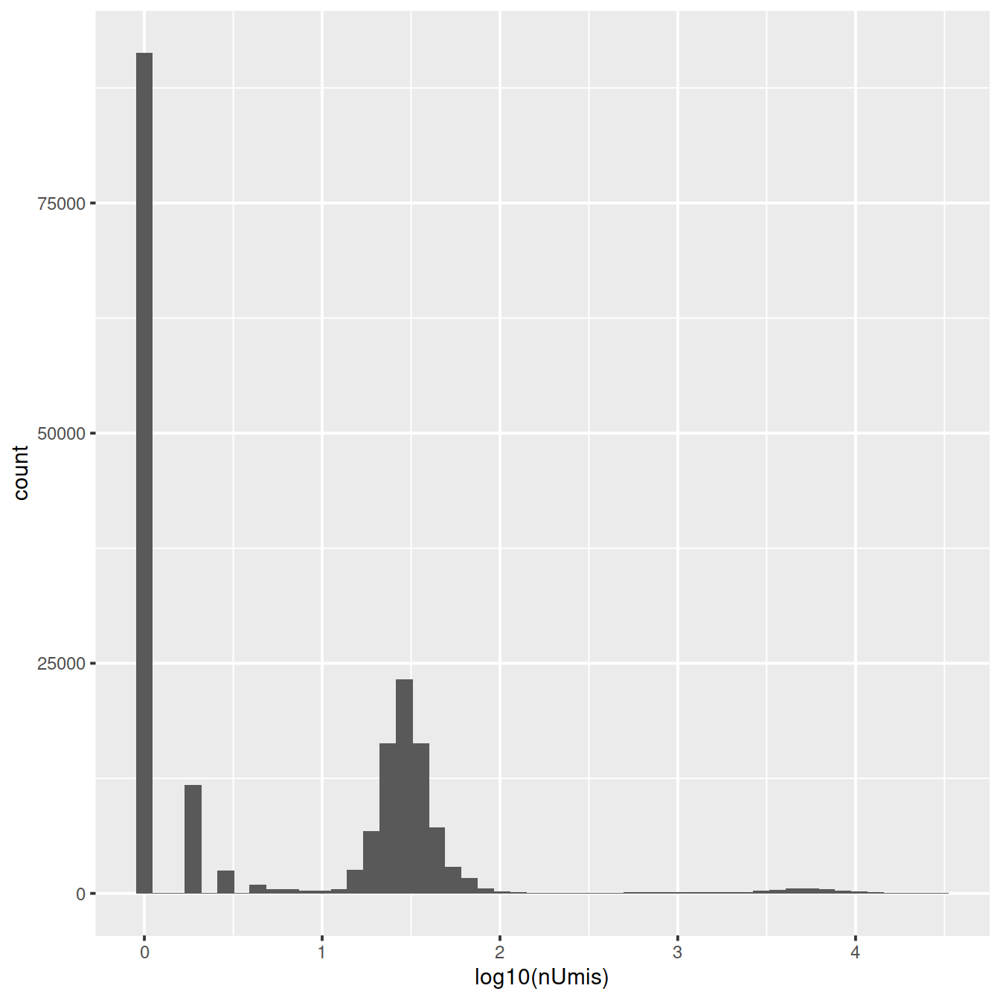

Library size varies widely, both amongst empty droplets and droplets carrying cells, mostly due to:

* variation in droplet size,
* amplification efficiency,
* sequencing

Most cell counting methods try to identify the library size that best distinguishes empty from cell-carrying droplets.

### Mixture model

This method by default fits a mixture of two normal distributions to the logged library sizes:

* one with a small mean for empty droplets
* the other with a higher mean for cell-carrying droplets


```r
set.seed(100)
# get package
library("mixtools")
# have library sizes on a log10 scale
log10_lib_size <- log10(libSizeDf$nUmis)
# fit mixture
mix <- normalmixEM(log10_lib_size,
		   mu=c(log10(10), log10(100), log10(10000)),
                   maxrestarts=50, epsilon = 1e-03)
```

```
## One of the variances is going to zero;  trying new starting values.
## One of the variances is going to zero;  trying new starting values.
## One of the variances is going to zero;  trying new starting values.
## One of the variances is going to zero;  trying new starting values.
## One of the variances is going to zero;  trying new starting values.
## One of the variances is going to zero;  trying new starting values.
## One of the variances is going to zero;  trying new starting values.
## One of the variances is going to zero;  trying new starting values.
## One of the variances is going to zero;  trying new starting values.
## One of the variances is going to zero;  trying new starting values.
## One of the variances is going to zero;  trying new starting values.
## One of the variances is going to zero;  trying new starting values.
## One of the variances is going to zero;  trying new starting values.
## One of the variances is going to zero;  trying new starting values.
## One of the variances is going to zero;  trying new starting values.
## One of the variances is going to zero;  trying new starting values.
## One of the variances is going to zero;  trying new starting values.
## One of the variances is going to zero;  trying new starting values.
## One of the variances is going to zero;  trying new starting values.
## One of the variances is going to zero;  trying new starting values.
## One of the variances is going to zero;  trying new starting values.
## number of iterations= 64
```

```r
# plot
p1 <- dnorm(log10_lib_size, mean=mix$mu[1], sd=mix$sigma[1])
p2 <- dnorm(log10_lib_size, mean=mix$mu[2], sd=mix$sigma[2])
p3 <- dnorm(log10_lib_size, mean=mix$mu[3], sd=mix$sigma[3])
pList <- list(p1, p2, p3)

if (mix$mu[1] < mix$mu[2]) {
    split <- min(log10_lib_size[p1 < p2])
} else {
    split <- min(log10_lib_size[p2 < p1])
}

# find densities with the higest means:
i1 <- which(order(mix$mu)==2)
i2 <- which(order(mix$mu)==3)

# find intersection:
dd0 <- data.frame(log10_lib_size=log10_lib_size,
                 #p1, p2, p3) 
                 pA=pList[[i1]],
                 pB=pList[[i2]]) 

split <- dd0 %>%
    filter(pA < pB & mix$mu[i1] < log10_lib_size) %>%
    arrange(log10_lib_size) %>%
    head(n=1) %>%
    pull(log10_lib_size)
# show split on plot:
plot(mix, which=2, xlab2="log10(mol per cell)")
# get density for each distribution:
#log10_lib_size <- log10(libSizeDf$nUmis)
abline(v=split, lwd=2)
```


```r
dd <- data.frame(log10_lib_size=log10_lib_size,
                 p1, p2, p3) %>%
  arrange(log10_lib_size) %>%
  tidyr::pivot_longer(!log10_lib_size, names_to = "curve", values_to = "density")
head(dd)
ggplot(dd, aes(x=log10_lib_size, y=density, col=curve)) +
         geom_line()
```

### Barcode rank plot

The barcode rank plot shows the library sizes against their rank in decreasing order,
for the first 10000 droplets only.


```r
barcode_rank <- rank(-libSizeDf$nUmis)
plot(barcode_rank, libSizeDf$nUmis, xlim=c(1,10000), ylab="library size")
```

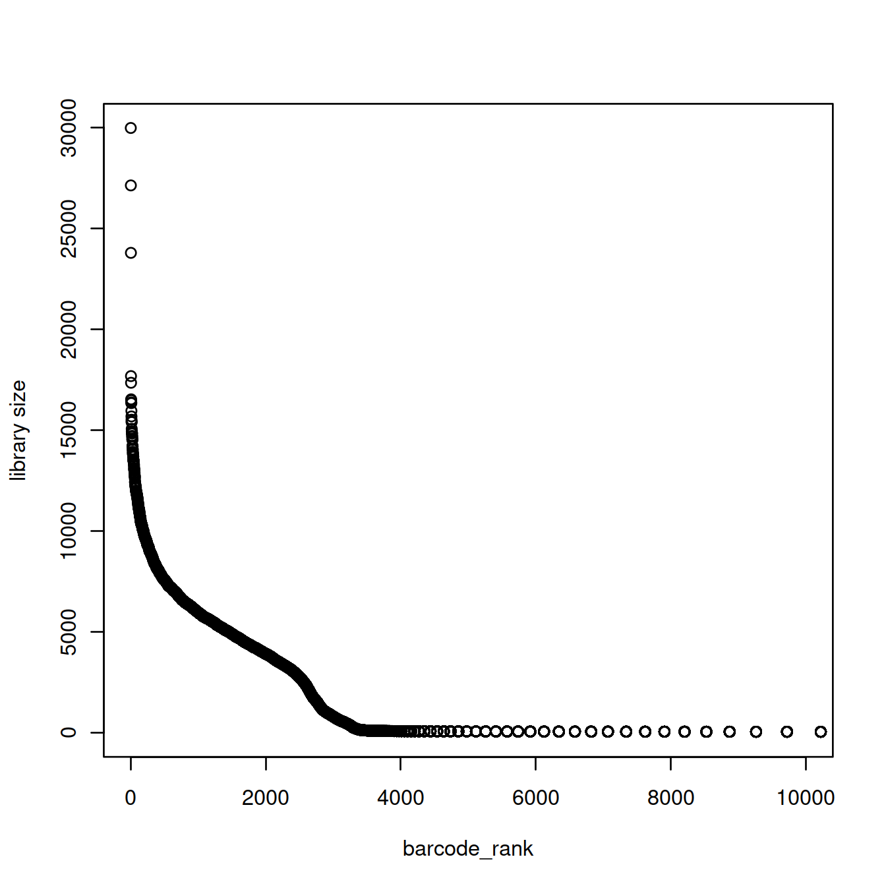

Given the exponential shape of the curve above, library sizes can be shown on the log10 scale:


```r
plot(barcode_rank, log10_lib_size, xlim=c(1,10000))
```


The plot above shows that the majority of droplets have fewer than 100 UMIs, e.g. droplets with rank greater than 4000. We will redraw the plot to focus on droplets with lower ranks, by using the log10 scale for the x-axis.


```r
plot(log10(barcode_rank), log10_lib_size, xlim=log10(c(1,10000)))
```


The point on the curve where it drops sharply may be used as the split point. Before that point library sizes are high, because droplets carry a cell. After that point, library sizes are far smaller because droplets do not carry a cell, only ambient RNA (... or do they?).

Here, we could 'visually' approximate the number of cells to 2500. There are however more robust and convenient methods.

### Inflection point

We could also compute the inflection point of the curve.


```r
o <- order(barcode_rank)
log10_lib_size <- log10_lib_size[o]
barcode_rank <- barcode_rank[o]

rawdiff <- diff(log10_lib_size)/diff(barcode_rank)
inflection <- which(rawdiff == min(rawdiff[100:length(rawdiff)], na.rm=TRUE))

plot(x=log10(barcode_rank),
     y=log10_lib_size,
     xlim=log10(c(1,10000)))
abline(v=log10(inflection), col="red", lwd=2)
```

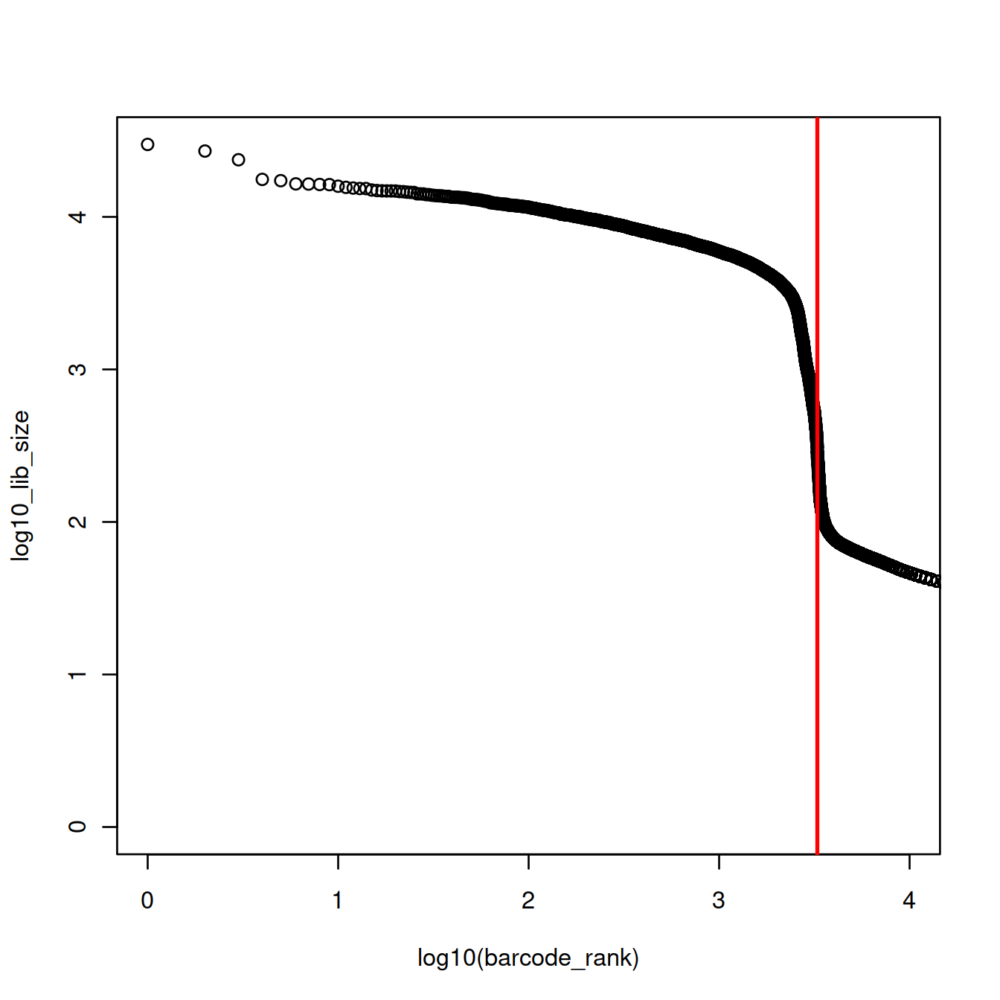

The inflection is at 3279 UMIs (3.5157414 on the log10 scale).
2306 droplets have at least these many UMIs and would thus contain one cell (or more).

### Cellranger v1 and v2

Given an expected number of cells, cellranger used to assume a ~10-fold range of library sizes for real cells and estimate this range (cellranger (v1 and v2). The threshold was defined as the 99th quantile of the library size, divided by 10. 


```r
# approximate number of cells expected:
n_cells <- 2500
# CellRanger
totals <- sort(libSizeDf$nUmis, decreasing = TRUE)
# 99th percentile of top n_cells divided by 10
thresh = totals[round(0.01*n_cells)]/10
plot(x=log10(seq(1,10000)),
     y=log10(totals)[1:10000]
     )
abline(h=log10(thresh), col="red", lwd=2)
```

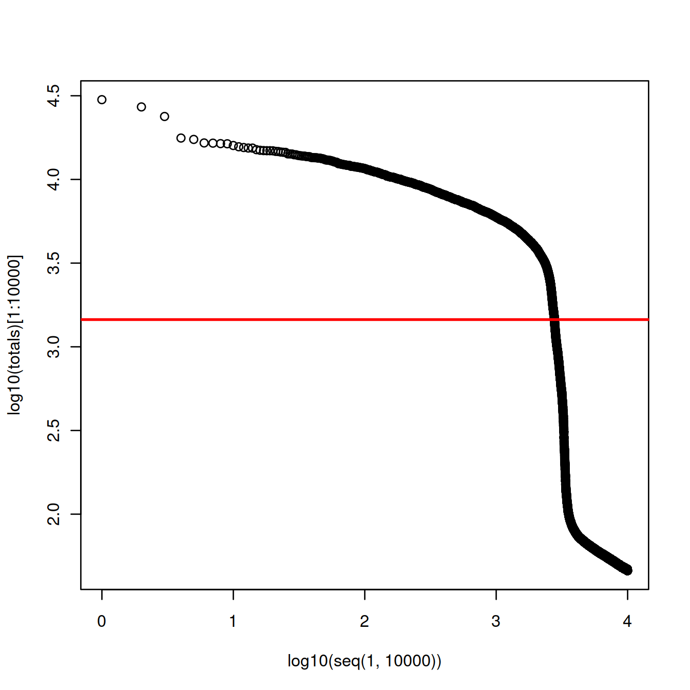

The threshold is at 1452 UMIs and 2773 cells are detected.

### DropletUtils and EmptyDrops

The `DropletUtils` package offers utilities to analyse droplet-based data, including cell counting using the library size as seen above. These simple approaches may exclude droplets with small or quiet cells with low RNA content. The `emptyDrops` method calls cells by first computing the expression profile for droplets with RNA content so low they almost certainly do not contain any cell: the 'background' or 'ambient' profile. The method then tests each non-background droplet for significant difference in expression profile.

Let's first check the knee and inflection methods.


```r
br.out <- barcodeRanks(counts(sce.raw))
plot(br.out$rank, br.out$total, log="xy", xlab="Rank", ylab="Total UMI count")
o <- order(br.out$rank)
lines(br.out$rank[o], br.out$fitted[o], col="red")

abline(h=metadata(br.out)$knee, col="dodgerblue", lty=2)
abline(h=metadata(br.out)$inflection, col="forestgreen", lty=2)
legend("bottomleft", lty=2, col=c("dodgerblue", "forestgreen"), 
    legend=c("knee", "inflection"))
```

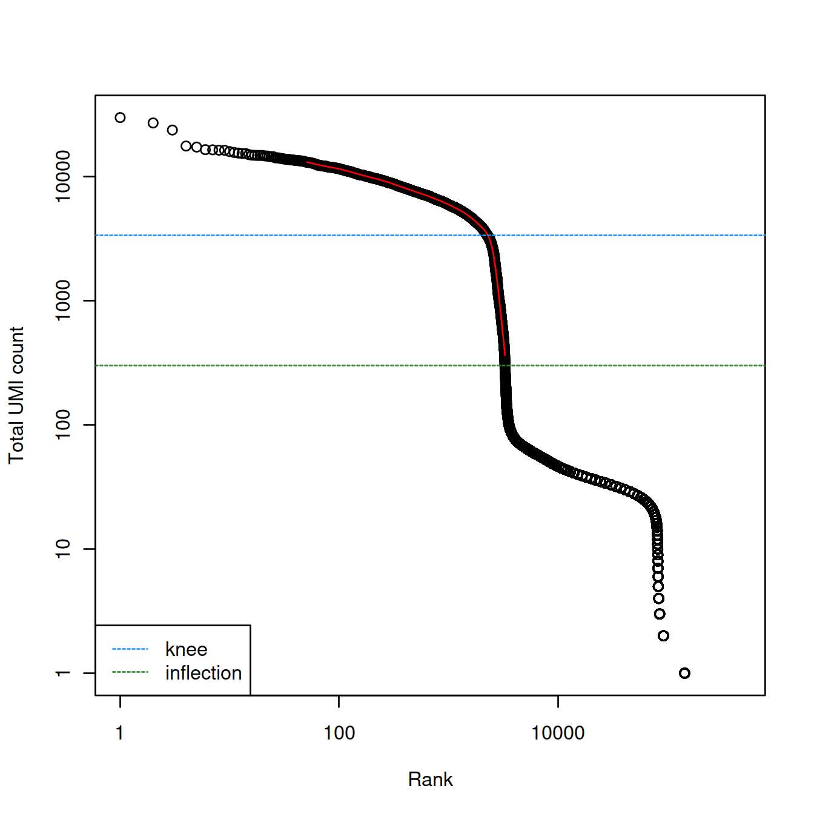

Testing for empty droplets.

We will call cells with a false discovery rate (FDR) of 0.1% so that at most 1 in 1000 droplets called may be empty.


```r
# a bit slow
# significance is computed by simulation so we set a seed for reproducibility
set.seed(100)
# run analysis:
e.out <- emptyDrops(counts(sce.raw))
e.out
```

```
## DataFrame with 737280 rows and 5 columns
##                        Total   LogProb    PValue   Limited       FDR
##                    <integer> <numeric> <numeric> <logical> <numeric>
## AAACCTGAGAAACCAT-1         0        NA        NA        NA        NA
## AAACCTGAGAAACCGC-1         0        NA        NA        NA        NA
## AAACCTGAGAAACCTA-1        31        NA        NA        NA        NA
## AAACCTGAGAAACGAG-1         0        NA        NA        NA        NA
## AAACCTGAGAAACGCC-1         0        NA        NA        NA        NA
## ...                      ...       ...       ...       ...       ...
## TTTGTCATCTTTACAC-1         0        NA        NA        NA        NA
## TTTGTCATCTTTACGT-1         1        NA        NA        NA        NA
## TTTGTCATCTTTAGGG-1         0        NA        NA        NA        NA
## TTTGTCATCTTTAGTC-1        26        NA        NA        NA        NA
## TTTGTCATCTTTCCTC-1         0        NA        NA        NA        NA
```

NAs are assigned to droplets used to compute the ambient profile.

Get numbers of droplets in each class defined by FDR and the cut-off used:


```r
summary(e.out$FDR <= 0.001)
```

```
##    Mode   FALSE    TRUE    NA's 
## logical     487    3075  733718
```

The test significance is computed by permutation. For each droplet tested, the number of permutations may limit the value of the p-value. This information is available in the 'Limited' column. If 'Limited' is 'TRUE' for any non-significant droplet, the number of permutations was too low, should be increased and the analysis re-run.


```r
comment="emptyDrops() uses Monte Carlo simulations to compute p-values for the multinomial sampling transcripts from the ambient pool. The number of Monte Carlo iterations determines the lower bound for the p-values (Phipson and Smyth 2010). The Limited field in the output indicates whether or not the computed p-value for a particular barcode is bounded by the number of iterations. If any non-significant barcodes are TRUE for Limited, we may need to increase the number of iterations. A larger number of iterations will result in a lower p-value for these barcodes, which may allow them to be detected after correcting for multiple testing."

table(Sig=e.out$FDR <= 0.001, Limited=e.out$Limited)
```

```
##        Limited
## Sig     FALSE TRUE
##   FALSE   487    0
##   TRUE     76 2999
```

Let's check that the background comprises only empty droplets. If the droplets used to define the background profile are indeed empty, testing them should result in a flat distribution of p-values. Let's test the 'ambient' droplets and draw the p-value distribution.


```r
commment="As mentioned above, emptyDrops() assumes that barcodes with low total UMI counts are empty droplets. Thus, the null hypothesis should be true for all of these barcodes. We can check whether the hypothesis testing procedure holds its size by examining the distribution of p-values for low-total barcodes with test.ambient=TRUE. Ideally, the distribution should be close to uniform (Figure 6.6). Large peaks near zero indicate that barcodes with total counts below lower are not all ambient in origin. This can be resolved by decreasing lower further to ensure that barcodes corresponding to droplets with very small cells are not used to estimate the ambient profile."

set.seed(100)
limit <- 100   
all.out <- emptyDrops(counts(sce.raw), lower=limit, test.ambient=TRUE)
hist(all.out$PValue[all.out$Total <= limit & all.out$Total > 0],
    xlab="P-value", main="", col="grey80") 
```

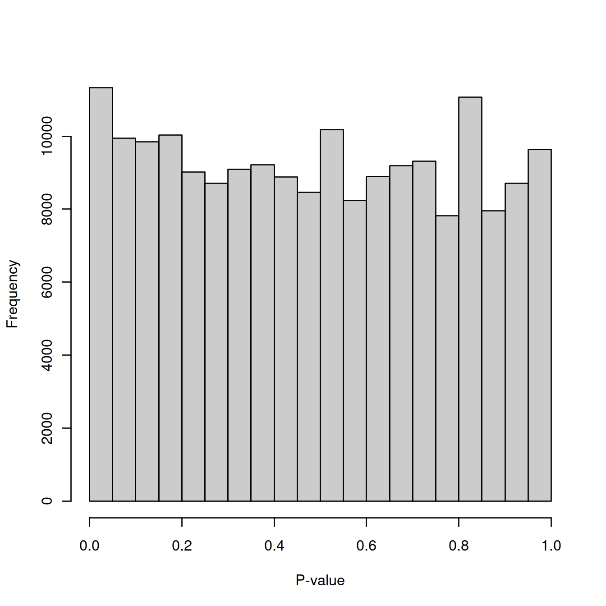

The distribution of p-values looks uniform with no large peak for small values: no cell in these droplets.

To evaluate the outcome of the analysis, we will plot the strength of the evidence against library size.


```r
is.cell <- e.out$FDR <= 0.001
```

Number of cells detected: 3075.

The plot plot shows the strength of the evidence against the library size.
Each point is a droplet coloured:

* in black if without cell,
* in red if with a cell (or more)
* in green if with a cell (or more) as defined with `emptyDrops` but not the inflection method.


```r
# colour:
cellColour <- ifelse(is.cell, "red", "black") # rep("black", nrow((e.out)))
# boolean for presence of cells as defined by the inflection method
tmpBoolInflex <- e.out$Total > metadata(br.out)$inflection
# boolean for presence of cells as defined by the emptyDrops method
tmpBoolSmall <- e.out$FDR <= 0.001
tmpBoolRecov <- !tmpBoolInflex & tmpBoolSmall
cellColour[tmpBoolRecov] <- "green" # 'recovered' cells

# plot strength of significance vs library size
plot(log10(e.out$Total),
     -e.out$LogProb,
     col=cellColour,
     xlim=c(2,max(log10(e.out$Total))),
     xlab="Total UMI count",
     ylab="-Log Probability")

# add point to show 'recovered' cell on top
points(log10(e.out$Total)[tmpBoolRecov],
       -e.out$LogProb[tmpBoolRecov],
       pch=16,
       col="green")
```


Let's filter out empty droplets.


```r
comment="Once we are satisfied with the performance of emptyDrops(), we subset our SingleCellExperiment object to retain only the detected cells. Discerning readers will notice the use of which(), which conveniently removes the NAs prior to the subsetting."

sce.ed <- sce.raw[,which(e.out$FDR <= 0.001)] # ed for empty droplet
rm(sce.raw);
gc();
```

```
##            used  (Mb) gc trigger   (Mb)  max used   (Mb)
## Ncells  8907934 475.8   24243600 1294.8  54939086 2934.1
## Vcells 59096638 450.9  164689296 1256.5 257295792 1963.1
```

And check the new SCE object:


```r
sce.ed
```

```
## class: SingleCellExperiment 
## dim: 33538 3075 
## metadata(1): Samples
## assays(1): counts
## rownames(33538): ENSG00000243485 ENSG00000237613 ... ENSG00000277475
##   ENSG00000268674
## rowData names(3): ID Symbol Type
## colnames(3075): AAACCTGAGACTTTCG-1 AAACCTGGTCTTCAAG-1 ...
##   TTTGTCACAGGCTCAC-1 TTTGTCAGTTCGGCAC-1
## colData names(2): Sample Barcode
## reducedDimNames(0):
## altExpNames(0):
```

```r
rm(sce.ed)
```

Cell calling in cellranger v3 uses a method similar to emptyDrops() and a 'filtered matrix' is generated that only keeps droplets deemed to contain a cell. We will load these filtered matrices now.


```r
text="emptyDrops() already removes cells with very low library sizes or (by association) low numbers of expressed genes. Thus, further filtering on these metrics is not strictly necessary. It may still be desirable to filter on both of these metrics to remove non-empty droplets containing cell fragments or stripped nuclei that were not caught by the mitochondrial filter. However, this should be weighed against the risk of losing genuine cell types as discussed in Section 6.3.2.2."
```

## Load filtered matrices

Each sample was analysed with cellranger separately. We load filtered matrices one sample at a time, showing for each the name and number of features and cells.


```r
# a bit slow
# load data:
sce.list <- vector("list", length = nrow(sampleSheet))

for (i in 1:nrow(sampleSheet))
{
	print(sprintf("'Run' %s, 'Sample.Name' %s", sampleSheet[i,"Run"], sampleSheet[i,"Sample.Name"]))
	sample.path <- sprintf("%s/%s/%s/outs/filtered_feature_bc_matrix/",
	                       sprintf("%s/%s/grch38300",
	                               projDir,
	                               ifelse(sampleSheet[i,"source_name"] == "ABMMC",
	                                      "Hca",
	                                      "CaronBourque2020")),
	                       sampleSheet[i,"Run"],
	                       sampleSheet[i,"Run"])
	sce.list[[i]] <- read10xCounts(sample.path)
	print(dim(sce.list[[i]]))
}
```

```
## [1] "'Run' SRR9264343, 'Sample.Name' GSM3872434"
## [1] 33538  3088
## [1] "'Run' SRR9264344, 'Sample.Name' GSM3872435"
## [1] 33538  6678
## [1] "'Run' SRR9264345, 'Sample.Name' GSM3872436"
## [1] 33538  5054
## [1] "'Run' SRR9264346, 'Sample.Name' GSM3872437"
## [1] 33538  6096
## [1] "'Run' SRR9264347, 'Sample.Name' GSM3872438"
## [1] 33538  5442
## [1] "'Run' SRR9264348, 'Sample.Name' GSM3872439"
## [1] 33538  5502
## [1] "'Run' SRR9264349, 'Sample.Name' GSM3872440"
## [1] 33538  4126
## [1] "'Run' SRR9264350, 'Sample.Name' GSM3872441"
## [1] 33538  3741
## [1] "'Run' SRR9264351, 'Sample.Name' GSM3872442"
## [1] 33538   978
## [1] "'Run' SRR9264352, 'Sample.Name' GSM3872442"
## [1] 33538  1150
## [1] "'Run' SRR9264353, 'Sample.Name' GSM3872443"
## [1] 33538  4964
## [1] "'Run' SRR9264354, 'Sample.Name' GSM3872444"
## [1] 33538  4255
## [1] "'Run' MantonBM1, 'Sample.Name' MantonBM1"
## [1] 33538 23283
## [1] "'Run' MantonBM2, 'Sample.Name' MantonBM2"
## [1] 33538 25055
## [1] "'Run' MantonBM3, 'Sample.Name' MantonBM3"
## [1] 33538 24548
## [1] "'Run' MantonBM4, 'Sample.Name' MantonBM4"
## [1] 33538 26478
## [1] "'Run' MantonBM5, 'Sample.Name' MantonBM5"
## [1] 33538 26383
## [1] "'Run' MantonBM6, 'Sample.Name' MantonBM6"
## [1] 33538 22801
## [1] "'Run' MantonBM7, 'Sample.Name' MantonBM7"
## [1] 33538 24372
## [1] "'Run' MantonBM8, 'Sample.Name' MantonBM8"
## [1] 33538 24860
```

Let's combine all 20 samples into a single object.

We first check the feature lists are identical.


```r
# check row names are the same
# compare to that for the first sample

rowNames1 <- rownames(sce.list[[1]])
for (i in 2:nrow(sampleSheet))
{
	print(identical(rowNames1, rownames(sce.list[[i]])))
}
```

```
## [1] TRUE
## [1] TRUE
## [1] TRUE
## [1] TRUE
## [1] TRUE
## [1] TRUE
## [1] TRUE
## [1] TRUE
## [1] TRUE
## [1] TRUE
## [1] TRUE
## [1] TRUE
## [1] TRUE
## [1] TRUE
## [1] TRUE
## [1] TRUE
## [1] TRUE
## [1] TRUE
## [1] TRUE
```

A cell barcode comprises the actual sequence and a 'group ID', e.g. AAACCTGAGAAACCAT-1. The latter helps distinguish cells that share the same sequence but come from different samples. As each sample was analysed separately, the group ID is set to 1 in all data sets. To pool these data sets we first need to change group IDs so cell barcodes are unique across all samples. We will use the position of the sample in the sample sheet.


```r
sce <- sce.list[[1]]
colData(sce)$Barcode <- gsub("([0-9])$", 1, colData(sce)$Barcode)
print(head(colData(sce)$Barcode))
```

```
## [1] "AAACCTGAGACTTTCG-1" "AAACCTGGTCTTCAAG-1" "AAACCTGGTGCAACTT-1"
## [4] "AAACCTGGTGTTGAGG-1" "AAACCTGTCCCAAGTA-1" "AAACCTGTCGAATGCT-1"
```

```r
print(tail(colData(sce)$Barcode))
```

```
## [1] "TTTGGTTTCCGAAGAG-1" "TTTGGTTTCTTTAGGG-1" "TTTGTCAAGAAACGAG-1"
## [4] "TTTGTCAAGGACGAAA-1" "TTTGTCACAGGCTCAC-1" "TTTGTCAGTTCGGCAC-1"
```

```r
for (i in 2:nrow(sampleSheet))
{
	sce.tmp <- sce.list[[i]]
	colData(sce.tmp)$Barcode <- gsub("([0-9])$", i, colData(sce.tmp)$Barcode)
	sce <- cbind(sce, sce.tmp)
	#print(head(colData(sce)$Barcode))
	print(tail(colData(sce)$Barcode, 2))
}
```

```
## [1] "TTTGTCATCTTAACCT-2" "TTTGTCATCTTCTGGC-2"
## [1] "TTTGTCATCCGCGGTA-3" "TTTGTCATCCGGGTGT-3"
## [1] "TTTGTCATCACTCTTA-4" "TTTGTCATCTATCCCG-4"
## [1] "TTTGTCAGTTCCCTTG-5" "TTTGTCATCGACGGAA-5"
## [1] "TTTGTCATCCTTTCGG-6" "TTTGTCATCTATGTGG-6"
## [1] "TTTGTCAGTCATTAGC-7" "TTTGTCAGTTGTGGCC-7"
## [1] "TTTGTCATCTACCAGA-8" "TTTGTCATCTGCAGTA-8"
## [1] "TTTGGTTGTGCATCTA-9" "TTTGTCACAGCTCGAC-9"
## [1] "TTTGTCAGTAAATGTG-10" "TTTGTCAGTACAAGTA-10"
## [1] "TTTGTCATCACCCTCA-11" "TTTGTCATCTTCATGT-11"
## [1] "TTTGTCATCAGTTGAC-12" "TTTGTCATCTCGTTTA-12"
## [1] "TTTGTCATCTTTACAC-13" "TTTGTCATCTTTCCTC-13"
## [1] "TTTGTCATCGACGGAA-14" "TTTGTCATCGCCTGAG-14"
## [1] "TTTGTCATCTTGTACT-15" "TTTGTCATCTTTAGGG-15"
## [1] "TTTGTCATCGGATGGA-16" "TTTGTCATCGTGGACC-16"
## [1] "TTTGTCATCTGCGGCA-17" "TTTGTCATCTGCGTAA-17"
## [1] "TTTGTCATCTAACTGG-18" "TTTGTCATCTGCGGCA-18"
## [1] "TTTGTCATCTGGGCCA-19" "TTTGTCATCTTGTATC-19"
## [1] "TTTGTCATCTTGAGAC-20" "TTTGTCATCTTGTATC-20"
```

```r
rm(sce.list)
```

We now add the sample sheet information to the object metadata.


```r
colDataOrig <- colData(sce)

# split path:
tmpList <- strsplit(colDataOrig$Sample, split="/")
# get Run ID, to use to match sample in the meta data and sample sheet objects:
tmpVec <- unlist(lapply(tmpList, function(x){x[9]}))
colData(sce)$Run <- tmpVec
# merge:
colData(sce) <- colData(sce) %>%
	data.frame %>%
	left_join(sampleSheet[,splShtColToKeep], "Run") %>%
	relocate() %>%
	DataFrame
```

Let's save the object for future reference.


```r
# Write object to file
tmpFn <- sprintf("%s/%s/Robjects/sce_postPool%s.Rds",
		 projDir, outDirBit, setSuf)
saveRDS(sce, tmpFn)
```


```r
# Read object in:
tmpFn <- sprintf("%s/%s/Robjects/sce_postPool%s.Rds",
		 projDir, outDirBit, setSuf)
sce <- readRDS(tmpFn)
```

## Properties of scRNA-seq data


```r
# a bit slow

# TODO first remove emtpy droplets the mol.info data
mol.info$data
head(mol.info$genes)

dd <- mol.info$data %>% data.frame()
dd$umi <- as.character(dd$umi)

tmpFn <- sprintf("%s/%s/Robjects/sce_preProc_ampDf2.Rds", projDir, outDirBit)
if(FALSE) # slow
{
	ampDf <- dd %>%
		filter(paste(cell,gem_group, sep="-") %in% sce$Barcode) %>%
		group_by(cell, gene) %>%
		summarise(nUmis = n(), totReads=sum(reads)) %>%
		data.frame()
	# Write object to file
	saveRDS(ampDf, tmpFn)
} else {
	ampDf <- readRDS(tmpFn)
}
rm(tmpFn)

#summary(ampDf$nUmis)
#summary(ampDf$totReads)

hist(log2(ampDf$nUmis), n=100)
hist(log2(ampDf$totReads), n=100)
```


```r
sp2 <- ggplot(ampDf, aes(x=nUmis, y=totReads)) +
  geom_bin2d(bins = 50) +
  scale_fill_continuous(type = "viridis") +
  scale_x_continuous(trans='log2') +
  scale_y_continuous(trans='log2') +
  theme_bw()

sp2

#rm(mol.info)
rm(ampDf)
gc()
```

The number and identity of genes detected in a cell vary across cells: the total number of genes detected across all cells is far larger than the number of genes per cell. 

Total number of genes detected across cells:


```r
# for each gene, compute total number of UMIs across all cells,
# then counts genes with at least one UMI:
countsRowSums <- rowSums(counts(sce))
sum(countsRowSums > 0)
```

```
## [1] 27795
```

Summary of the distribution of the number of genes detected per cell:


```r
# for each cell count number of genes with at least 1 UMI
# then compute distribution moments:
summary(colSums(counts(sce) > 0))
```

```
##    Min. 1st Qu.  Median    Mean 3rd Qu.    Max. 
##      26     724     873    1173    1262    8077
```

Now let's plot for each gene, the total number of UMIs and the proportion of cells that express it.
Lowly expressed genes tend to be detected in a large proportion of cells.
The higher the overall expression the lower the proportion of cells.


```r
# very slow; many points
# skip in DEV, TODO: write plot to file and embed that.
# x-axis: total number of UMIs for the gene across all cells
# y-axis: fraction of cells expressing the gene
tmpFn <- sprintf("%s/%s/%s/corelLibSizePropCellExpress%s.png",
		 projDir, outDirBit, qcPlotDirBit, setSuf)
CairoPNG(tmpFn)
plot(
     # x-axis: nb UMI per gene across all cells
     countsRowSums,
     # y-axis: proportion of cells that do express the cell
     rowMeans(counts(sce) > 0),
     log = "x",
     xlab="total number of UMIs",
     ylab="proportion of cells expressing the gene"
)
dev.off()
```


```r
dd <- data.frame("countsRowSums" = countsRowSums,
                 "propCellsExpr" = rowMeans(counts(sce) > 0))
head(dd)
```

```
##                 countsRowSums propCellsExpr
## ENSG00000243485             3  1.205526e-05
## ENSG00000237613             0  0.000000e+00
## ENSG00000186092             0  0.000000e+00
## ENSG00000238009           203  8.157393e-04
## ENSG00000239945             5  2.009210e-05
## ENSG00000239906             0  0.000000e+00
```

```r
sp <- ggplot(dd, aes(x=countsRowSums, y=propCellsExpr)) +
  geom_point(alpha=0.3) +
  scale_x_continuous(trans='log10') +
  geom_density_2d() +
  xlab("total number of UMIs") +
  ylab("proportion of cells expressing the gene")
sp
ggExtra::ggMarginal(sp)
```

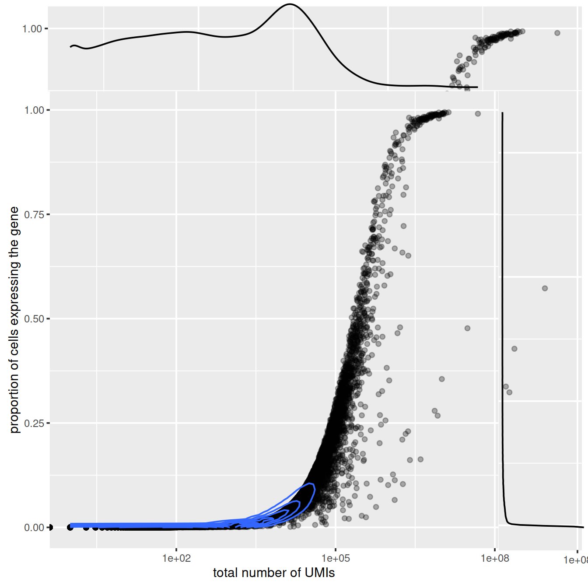

```r
tmpFn <- sprintf("%s/%s/%s/corelLibSizePropCellExpress%s_2.png",
		 projDir, outDirBit, qcPlotDirBit, setSuf)
tmpFn
```

```
## [1] "/ssd/personal/baller01/20200511_FernandesM_ME_crukBiSs2020/AnaWiSce/AnaKmWiC/Plots/Qc/corelLibSizePropCellExpress_allCells_2.png"
```

```r
ggsave(ggExtra::ggMarginal(sp), file=tmpFn, type="cairo-png")
rm(tmpFn)
```


```r
getwd()
tmpFn <- sprintf("%s/%s/corelLibSizePropCellExpress%s_2.png",
                 dirRel, qcPlotDirBit, setSuf)
knitr::include_graphics(tmpFn, auto_pdf = TRUE)
rm(tmpFn)
```

<!-- 1000 cells only to speed plotting -->


Count genes that are not 'expressed' (detected):


```r
not.expressed <- rowSums(counts(sce)) == 0
table(not.expressed)
```

```
## not.expressed
## FALSE  TRUE 
## 27795  5743
```

Plot the percentage of counts per gene and show genes with the highest UMI counts:


```r
#Compute the relative expression of each gene per cell
# a bit slow
rel_expression <- t( t(counts(sce)) / Matrix::colSums(counts(sce))) * 100
rownames(rel_expression) <- rowData(sce)$Symbol
most_expressed <- sort(Matrix::rowSums( rel_expression ),T)[20:1] / ncol(sce)

boxplot( as.matrix(t(rel_expression[names(most_expressed),])),
	cex=.1,
	las=1,
	xlab="% total count per cell",
	col=scales::hue_pal()(20)[20:1],
	horizontal=TRUE)
```

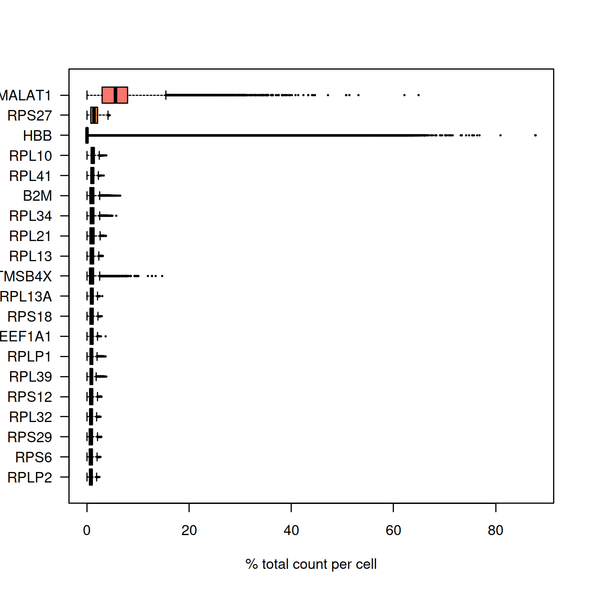

Mind that we have combined two data sets here. It may be interesting to count non-expressed genes in each set separately.

## Quality control

<!-- https://osca.bioconductor.org/quality-control.html -->

Cell calling performed above does not inform on the quality of the library in each of the droplets kept. Poor-quality cells, or rather droplets, may be caused by cell damage during dissociation or failed library preparation. They usually have low UMI counts, few genes detected and/or high mitochondrial content. The presence may affect normalisation, assessment of cell population heterogeneity, clustering and trajectory:

* Normalisation: Contaminating genes, 'the ambient RNA', are detected at low levels in all libraires. In low quality libraries with low RNA content, scaling will increase counts for these genes more than for better-quality cells, resulting in their apparent upregulation in these cells and increased variance overall.
* Cell population heterogeneity: variance estimation and dimensionality reduction with PCA where the first principal component will be correlated with library size, rather than biology.
* Clustering and trajectory: higher mitochondrial and/or nuclear RNA content may cause low-quality cells to cluster separately or form states or trajectories between distinct cell types.

We will now exclude lowly expressed features and identify low-quality cells using the following metrics mostly:

* library size, i.e. the total number of UMIs per cell
* number of features detected per cell
* mitochondrial content, i.e. the proportion of UMIs that map to mitochondrial genes, with higher values consistent with leakage from the cytoplasm of RNA, but not mitochodria

We will first annotate genes, to know which lie in the mitochondrial genome, then use [scater](https://bioconductor.org/packages/3.11/bioc/html/scater.html)'s `addPerCellQC()` to compute various metrics.

Annotate genes with biomaRt.


```r
tmpFn <- sprintf("%s/%s/Robjects/sce_postBiomart%s.Rds",
		 projDir, outDirBit, setSuf)
biomartBool <- ifelse(file.exists(tmpFn), FALSE, TRUE)
```


```r
# retrieve the feature information
gene.info <- rowData(sce)

# setup the biomaRt connection to Ensembl using the correct species genome (hsapiens_gene_ensembl)
#ensembl <- useEnsembl(biomart='ensembl',
#                      dataset='hsapiens_gene_ensembl',
#                      #mirror = "www")
#                      #mirror = "useast")
#                      mirror = "uswest")
#                      #mirror = "asia")

ensembl = useMart(biomart="ENSEMBL_MART_ENSEMBL",
                  dataset="hsapiens_gene_ensembl", 
                  host="uswest.ensembl.org",
                  ensemblRedirect = FALSE)


# retrieve the attributes of interest from biomaRt using the Ensembl gene ID as the key
# beware that this will only retrieve information for matching IDs
gene_symbol <- getBM(attributes=c('ensembl_gene_id',
                                  'external_gene_name',
                                  'chromosome_name',
                                  'start_position',
                                  'end_position',
                                  'strand'),
                     filters='ensembl_gene_id',
		     mart=ensembl,
                     values=gene.info[, 1])

# create a new data frame of the feature information
gene.merge <- merge(gene_symbol, gene.info, by.x=c('ensembl_gene_id'), by.y=c('ID'), all.y=TRUE)
rownames(gene.merge) <- gene.merge$ensembl_gene_id

# set the order for the same as the original gene information
gene.merge <- gene.merge[gene.info[, 1], ]

# reset the rowdata on the SCE object to contain all of this information
rowData(sce) <- gene.merge
```


```r
# slow
# Write object to file
##tmpFn <- sprintf("%s/%s/Robjects/sce_postBiomart%s.Rds",
##		 projDir, outDirBit, setSuf)
saveRDS(sce, tmpFn)
```


```r
# Read object in:
##tmpFn <- sprintf("%s/%s/Robjects/sce_postBiomart%s.Rds",
##		 projDir, outDirBit, setSuf)
sce <- readRDS(tmpFn)
```


```r
table(rowData(sce)$chromosome_name)
```

```
## 
##          1         10         11         12         13         14         15 
##       3126       1220       1910       1748        661       1380       1121 
##         16         17         18         19          2         20         21 
##       1515       1880        654       1989       2261        888        499 
##         22          3          4          5          6          7          8 
##        831       1704       1344       1646       1616       1526       1302 
##          9 GL000009.2 GL000194.1 GL000195.1 GL000205.2 GL000213.1 GL000218.1 
##       1210          1          2          2          1          1          1 
## GL000219.1 KI270711.1 KI270713.1 KI270721.1 KI270726.1 KI270727.1 KI270728.1 
##          1          1          2          1          2          4          6 
## KI270731.1 KI270734.1         MT          X          Y 
##          1          3         13       1064         97
```

```r
is.mito <- which(rowData(sce)$chromosome_name=="MT")
```

Calculate and store QC metrics for genes with addPerFeatureQC() and for cells with addPerCellQC().


```r
# long
# for genes
sce <- addPerFeatureQC(sce)
head(rowData(sce)) %>%
	as.data.frame() %>%
	datatable(rownames = FALSE) # ENS ID
```

```{=html}
<div id="htmlwidget-7ae711cbcc82055ffd29" style="width:100%;height:auto;" class="datatables html-widget"></div>
<script type="application/json" data-for="htmlwidget-7ae711cbcc82055ffd29">{"x":{"filter":"none","data":[["ENSG00000243485","ENSG00000237613","ENSG00000186092","ENSG00000238009","ENSG00000239945","ENSG00000239906"],["MIR1302-2HG","FAM138A","OR4F5","","",""],["1","1","1","1","1","1"],[29554,34554,65419,89295,89551,139790],[31109,36081,71585,133723,91105,140339],[1,-1,1,-1,-1,-1],["MIR1302-2HG","FAM138A","OR4F5","AL627309.1","AL627309.3","AL627309.2"],["Gene Expression","Gene Expression","Gene Expression","Gene Expression","Gene Expression","Gene Expression"],[1.20552613178812e-05,0,0,0.000815739349176626,2.00921021964686e-05,0],[0.00120552613178812,0,0,0.0815739349176626,0.00200921021964686,0]],"container":"<table class=\"display\">\n  <thead>\n    <tr>\n      <th>ensembl_gene_id<\/th>\n      <th>external_gene_name<\/th>\n      <th>chromosome_name<\/th>\n      <th>start_position<\/th>\n      <th>end_position<\/th>\n      <th>strand<\/th>\n      <th>Symbol<\/th>\n      <th>Type<\/th>\n      <th>mean<\/th>\n      <th>detected<\/th>\n    <\/tr>\n  <\/thead>\n<\/table>","options":{"columnDefs":[{"className":"dt-right","targets":[3,4,5,8,9]}],"order":[],"autoWidth":false,"orderClasses":false}},"evals":[],"jsHooks":[]}</script>
```

Three columns of interest for cells:

* 'sum': total UMI count
* 'detected': number of features (genes) detected
* 'subsets_Mito_percent': percentage of reads mapped to mitochondrial transcripts


```r
# for cells
sce <- addPerCellQC(sce, subsets=list(Mito=is.mito))
head(colData(sce)) %>%
	as.data.frame() %>%
	datatable(rownames = FALSE)
```

```{=html}
<div id="htmlwidget-940087b122289b670549" style="width:100%;height:auto;" class="datatables html-widget"></div>
<script type="application/json" data-for="htmlwidget-940087b122289b670549">{"x":{"filter":"none","data":[["/ssd/personal/baller01/20200511_FernandesM_ME_crukBiSs2020/CaronBourque2020/grch38300/SRR9264343/SRR9264343/outs/filtered_feature_bc_matrix/","/ssd/personal/baller01/20200511_FernandesM_ME_crukBiSs2020/CaronBourque2020/grch38300/SRR9264343/SRR9264343/outs/filtered_feature_bc_matrix/","/ssd/personal/baller01/20200511_FernandesM_ME_crukBiSs2020/CaronBourque2020/grch38300/SRR9264343/SRR9264343/outs/filtered_feature_bc_matrix/","/ssd/personal/baller01/20200511_FernandesM_ME_crukBiSs2020/CaronBourque2020/grch38300/SRR9264343/SRR9264343/outs/filtered_feature_bc_matrix/","/ssd/personal/baller01/20200511_FernandesM_ME_crukBiSs2020/CaronBourque2020/grch38300/SRR9264343/SRR9264343/outs/filtered_feature_bc_matrix/","/ssd/personal/baller01/20200511_FernandesM_ME_crukBiSs2020/CaronBourque2020/grch38300/SRR9264343/SRR9264343/outs/filtered_feature_bc_matrix/"],["AAACCTGAGACTTTCG-1","AAACCTGGTCTTCAAG-1","AAACCTGGTGCAACTT-1","AAACCTGGTGTTGAGG-1","AAACCTGTCCCAAGTA-1","AAACCTGTCGAATGCT-1"],["SRR9264343","SRR9264343","SRR9264343","SRR9264343","SRR9264343","SRR9264343"],["GSM3872434","GSM3872434","GSM3872434","GSM3872434","GSM3872434","GSM3872434"],["ETV6-RUNX1","ETV6-RUNX1","ETV6-RUNX1","ETV6-RUNX1","ETV6-RUNX1","ETV6-RUNX1"],[6462,11706,831,7981,8354,1373],[1996,3079,353,2511,2307,701],[290,567,426,423,519,91],[12,12,11,12,13,11],[4.48777468276076,4.8436699128652,51.2635379061372,5.30008770830723,6.21259276993057,6.62782228696285],[6462,11706,831,7981,8354,1373]],"container":"<table class=\"display\">\n  <thead>\n    <tr>\n      <th>Sample<\/th>\n      <th>Barcode<\/th>\n      <th>Run<\/th>\n      <th>Sample.Name<\/th>\n      <th>source_name<\/th>\n      <th>sum<\/th>\n      <th>detected<\/th>\n      <th>subsets_Mito_sum<\/th>\n      <th>subsets_Mito_detected<\/th>\n      <th>subsets_Mito_percent<\/th>\n      <th>total<\/th>\n    <\/tr>\n  <\/thead>\n<\/table>","options":{"columnDefs":[{"className":"dt-right","targets":[5,6,7,8,9,10]}],"order":[],"autoWidth":false,"orderClasses":false}},"evals":[],"jsHooks":[]}</script>
```


```r
# Write object to file
tmpFn <- sprintf("%s/%s/Robjects/sce_postAddQc%s.Rds",
		 projDir, outDirBit, setSuf)
saveRDS(sce, tmpFn)
```


```r
# Read object in:
tmpFn <- sprintf("%s/%s/Robjects/sce_postAddQc%s.Rds",
		 projDir, outDirBit, setSuf)
sce <- readRDS(tmpFn)
```

### QC metric distribution

Overall:


```r
par(mfrow=c(1, 2))
hist(log10(sce$sum), breaks=20, col="grey80", xlab="Log-total UMI count", main="")
hist(sce$subsets_Mito_percent, breaks=20, col="grey80", xlab="Proportion of reads in mitochondrial genes", main="")
abline(v=20, lty=2, col='purple')
```

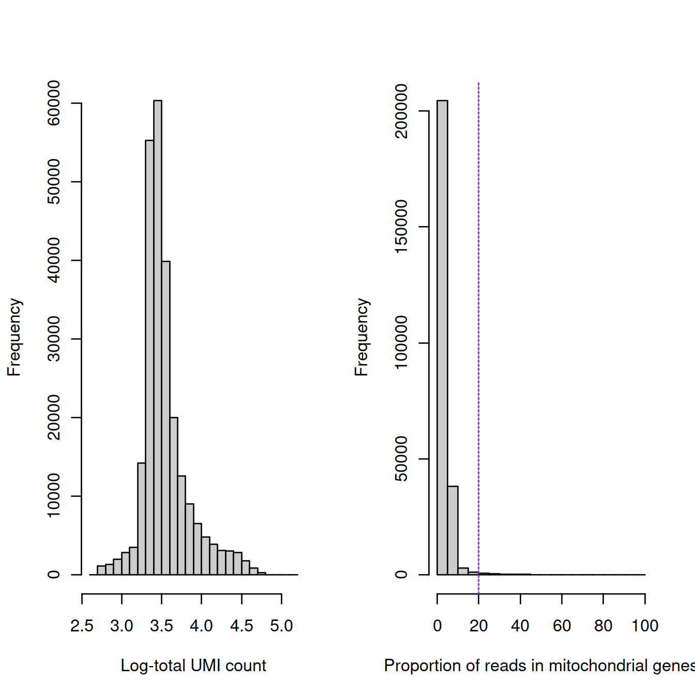

Per sample group:


```r
sce$source_name <- factor(sce$source_name)
sce$block <- sce$source_name
sce$setName <- ifelse(grepl("ABMMC", sce$source_name), "Hca", "Caron")
```


```r
# ok, but little gain in splitting by Caron and Hca,
# better set levels to have PBMMC last and use ggplot with colours.
tmpFn <- sprintf("%s/%s/%s/qc_metricDistrib_plotColData2%s.png",
		projDir, outDirBit, qcPlotDirBit, setSuf)
CairoPNG(tmpFn)
# violin plots
gridExtra::grid.arrange(
    plotColData(sce, x="block", y="sum",
        other_fields="setName") + #facet_wrap(~setName) + 
        scale_y_log10() + ggtitle("Total count"),
    plotColData(sce, x="block", y="detected", 
        other_fields="setName") + #facet_wrap(~setName) + 
        scale_y_log10() + ggtitle("Detected features"),
    plotColData(sce, x="block", y="subsets_Mito_percent", 
        other_fields="setName") + # facet_wrap(~setName) +
        ggtitle("Mito percent"),
    ncol=1
)
```

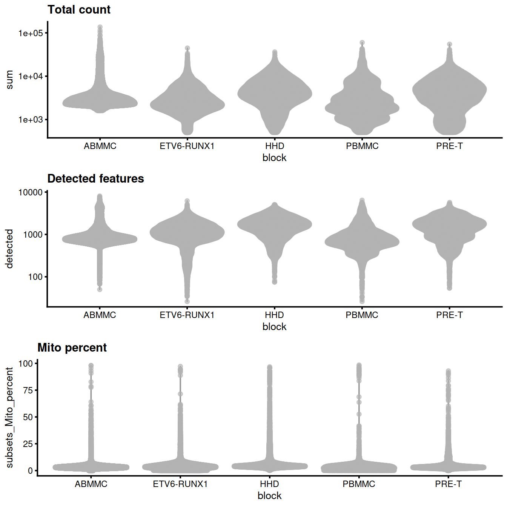

```r
dev.off()
```

```
## pdf 
##   2
```


```r
# eval=FALSE: see chunks below for each of the metrics separately
tmpFn <- sprintf("%s/%s/%s/qc_metricDistrib_plotColData2%s.png",
		 projDir, outDirBit, qcPlotDirBit, setSuf)
knitr::include_graphics(tmpFn, auto_pdf = TRUE)
rm(tmpFn)
```

Library size ('Total count'):


```r
    plotColData(sce, x="block", y="sum",
        other_fields="setName") + #facet_wrap(~setName) + 
        scale_y_log10() + ggtitle("Total count")
```

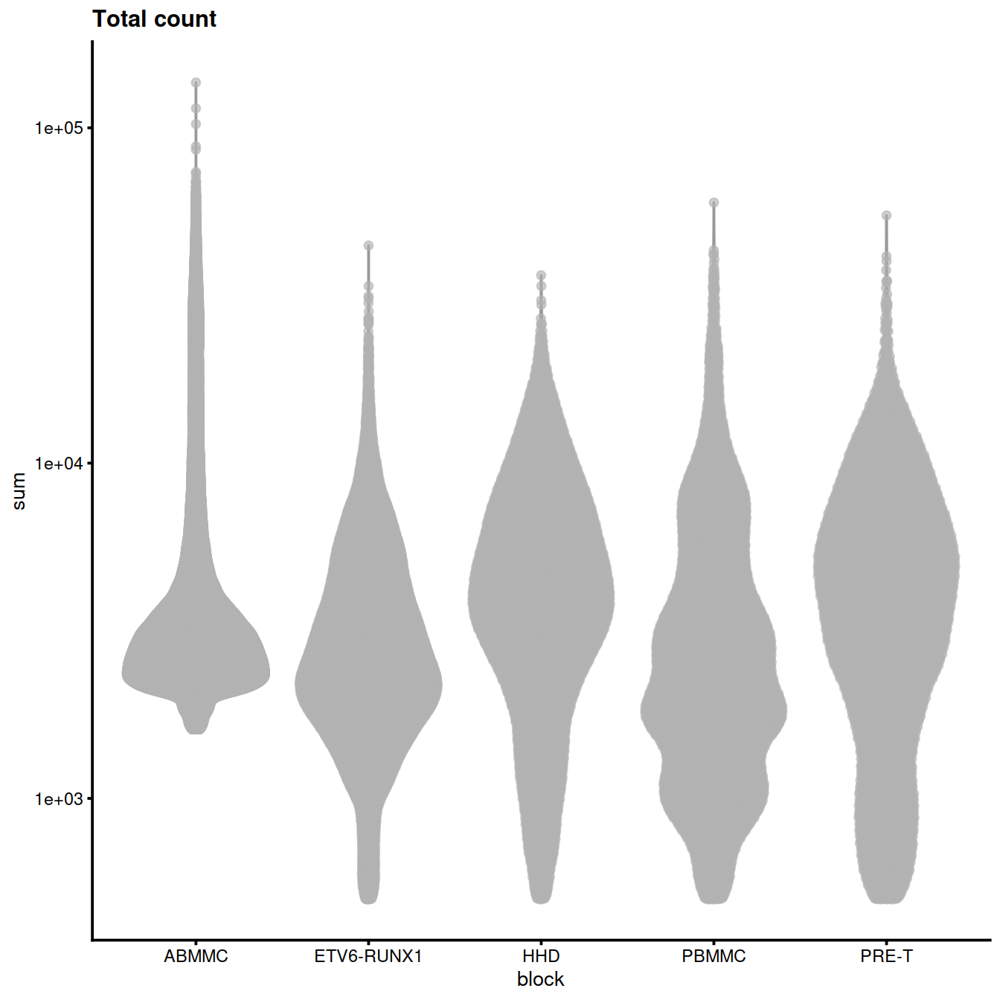

Number of genes ('detected'):


```r
    plotColData(sce, x="block", y="detected", 
        other_fields="setName") + #facet_wrap(~setName) + 
        scale_y_log10() + ggtitle("Detected features")
```

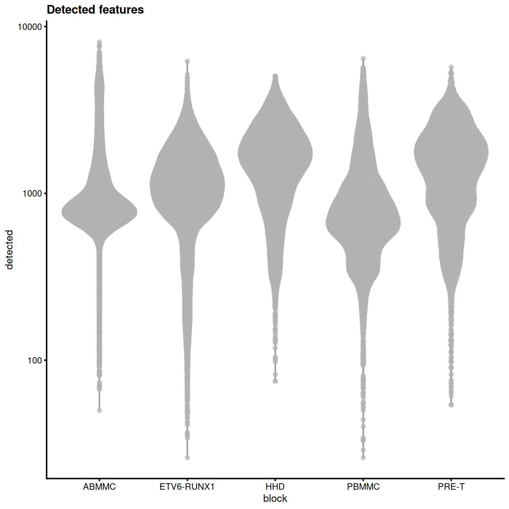

Mitochondrial content ('subsets_Mito_percent'):


```r
    plotColData(sce, x="block", y="subsets_Mito_percent", 
        other_fields="setName") + # facet_wrap(~setName) +
        ggtitle("Mito percent")
```

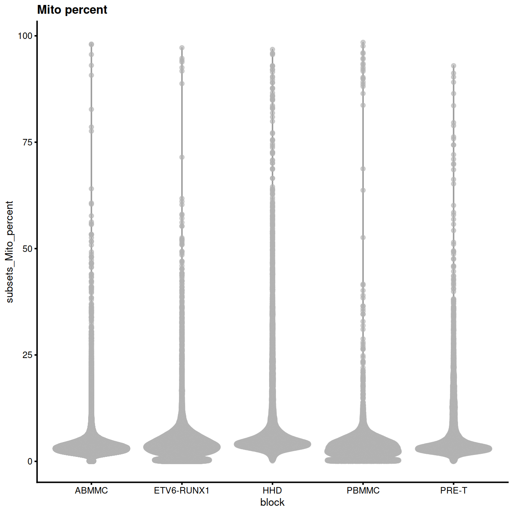

Correlation between the number of genes detected and library size ('detected' against 'sum'):


```r
sp <- ggplot(data.frame(colData(sce)),
	     aes(x=sum,
		 y=detected,
		 col=source_name)) +
  geom_point(alpha=0.3)
sp + facet_wrap(~source_name)
```

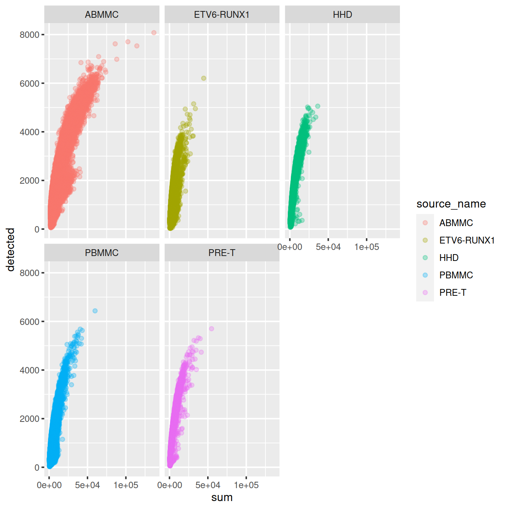

Correlation between the mitochondrial content and library size ('subsets_Mito_percent' against 'sum'):


```r
sp <- ggplot(data.frame(colData(sce)), aes(x=sum, y=detected, col=subsets_Mito_percent)) +
  geom_point()
sp + facet_wrap(~source_name)
```

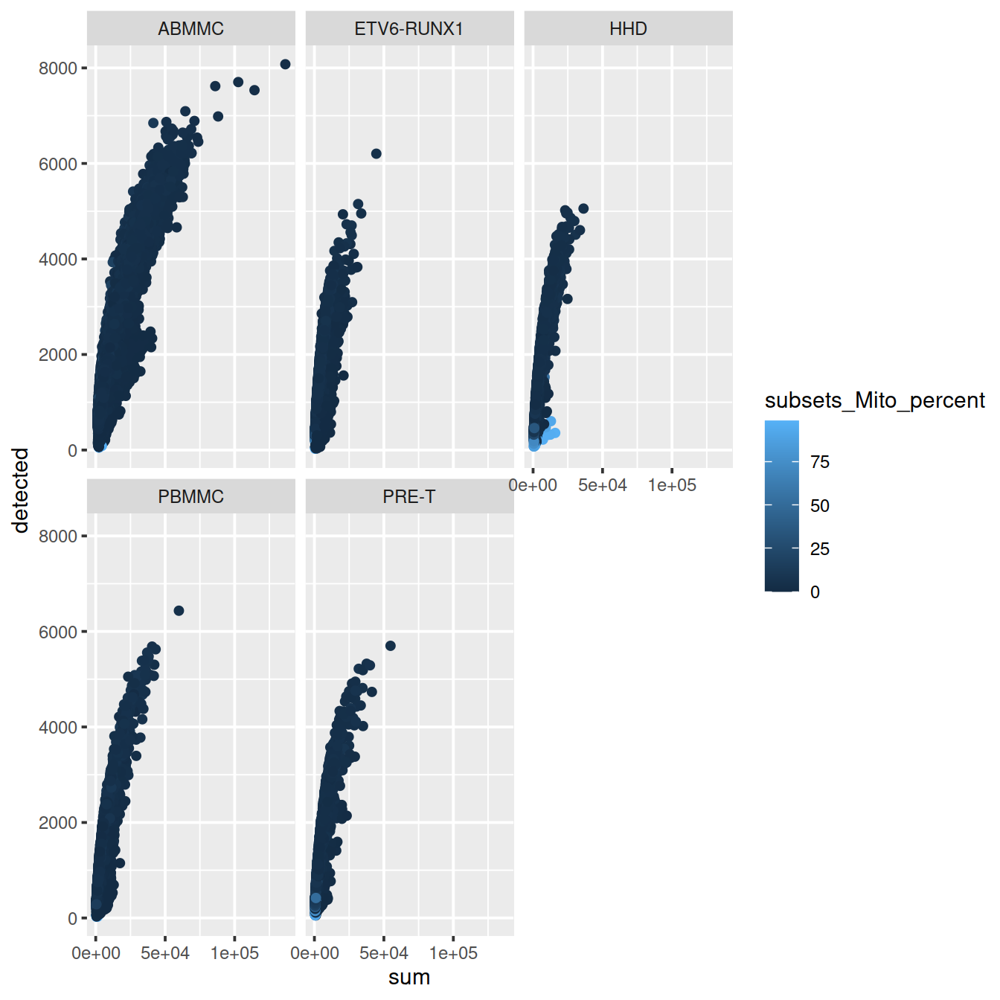

## Identification of low-quality cells with adaptive thresholds

One can use hard threshold for the library size, number of genes detected and mitochondrial content. These will however vary across runs. It may therefore be preferable to rely on outlier detection to identify cells that markedly differ from most cells.

We saw above that the distribution of the QC metrics is close to Normal. Hence, we can detect outlier using the median and the median absolute deviation (MAD) from the median (not the mean and the standard deviation that both are sensitive to outliers).

For a given metric, an outlier value is one that lies over some number of MADs away from the median. A cell will be excluded if it is an outlier in the part of the range to avoid, for example low gene counts, or high mitochondrial content. For a normal distribution, a threshold defined with a distance of 3 MADs from the median retains about 99% of values.

### Library size

For the library size we use the log scale to avoid negative values for lower part of the distribution.


```r
qc.lib2 <- isOutlier(sce$sum, log=TRUE, type="lower")
table(qc.lib2)
```

```
## qc.lib2
##  FALSE   TRUE 
## 245250   3604
```

Threshold values:


```r
attr(qc.lib2, "thresholds")
```

```
##    lower   higher 
## 920.8674      Inf
```

### Number of genes

For the number of genes detected we also use the log scale to avoid negative values for lower part of the distribution.


```r
qc.nexprs2 <- isOutlier(sce$detected, log=TRUE, type="lower")
table(qc.nexprs2)
```

```
## qc.nexprs2
##  FALSE   TRUE 
## 246349   2505
```

Threshold values:


```r
attr(qc.nexprs2, "thresholds")
```

```
##    lower   higher 
## 302.3803      Inf
```

### Mitochondrial content

For the mitochondrial content the exclusion zone is in the higher part of the distribution.


```r
qc.mito2 <- isOutlier(sce$subsets_Mito_percent, type="higher")
table(qc.mito2)
```

```
## qc.mito2
##  FALSE   TRUE 
## 237080  11774
```

Threshold values:


```r
attr(qc.mito2, "thresholds")
```

```
##    lower   higher 
##     -Inf 7.613065
```

### Summary


```r
discard2 <- qc.lib2 | qc.nexprs2 | qc.mito2

# Summarize the number of cells removed for each reason.
DataFrame(LibSize=sum(qc.lib2),
	  NExprs=sum(qc.nexprs2),
	  MitoProp=sum(qc.mito2),
	  Total=sum(discard2))
```

```
## DataFrame with 1 row and 4 columns
##     LibSize    NExprs  MitoProp     Total
##   <integer> <integer> <integer> <integer>
## 1      3604      2505     11774     15386
```

### All steps at once

The steps above may be run at once with quickPerCellQC():


```r
reasons <- quickPerCellQC(colData(sce),
			  percent_subsets=c("subsets_Mito_percent"))
colSums(as.matrix(reasons)) %>%
  as.data.frame() %>%
	datatable(rownames = TRUE)
```

```{=html}
<div id="htmlwidget-97451b7175b72fbc355e" style="width:100%;height:auto;" class="datatables html-widget"></div>
<script type="application/json" data-for="htmlwidget-97451b7175b72fbc355e">{"x":{"filter":"none","data":[["low_lib_size","low_n_features","high_subsets_Mito_percent","discard"],[3604,2505,11774,15386]],"container":"<table class=\"display\">\n  <thead>\n    <tr>\n      <th> <\/th>\n      <th>.<\/th>\n    <\/tr>\n  <\/thead>\n<\/table>","options":{"columnDefs":[{"className":"dt-right","targets":1},{"orderable":false,"targets":0}],"order":[],"autoWidth":false,"orderClasses":false}},"evals":[],"jsHooks":[]}</script>
```

### Assumptions

Data quality depends on the tissue analysed, some being difficult to dissociate, e.g. brain, so that one level of QC stringency will not fit all data sets.

Filtering based on QC metrics as done here assumes that these QC metrics are not correlated with biology. This may not necessarily be true in highly heterogenous data sets where some cell types represented by good-quality cells may have low RNA content or high mitochondrial content.

## Experimental factors

The two data sets analysed here may have been obtained in experiments with different settings, such as cell preparation or sequencing depth. Such differences between these two batches would affect the adaptive thresholds discussed above. We will now perform QC in each batch separately.

We will use the quickPerCellQC() 'batch' option.


```r
batch.reasons <- quickPerCellQC(colData(sce), percent_subsets=c("subsets_Mito_percent"), batch=sce$setName)
colSums(as.matrix(batch.reasons))
```

```
##              low_lib_size            low_n_features high_subsets_Mito_percent 
##                         0                      1034                     11046 
##                   discard 
##                     12014
```

```r
sce$discard <- batch.reasons$discard
```

Fewer cells are discarded, in particular because of small library size and low gene number.

But the differences are deeper as the two sets only partially overlap:


```r
table(reasons$discard, batch.reasons$discard)
```

```
##        
##          FALSE   TRUE
##   FALSE 231781   1687
##   TRUE    5059  10327
```


```r
# see chunks below for each of the metric separately
tmpFn <- sprintf("%s/%s/%s/qc_metricDistrib_plotColDataBatch%s.png",
		 projDir, outDirBit, qcPlotDirBit, setSuf)
CairoPNG(tmpFn)
gridExtra::grid.arrange(
    plotColData(sce, x="block", y="sum", colour_by="discard",
        other_fields="setName") +
	#facet_wrap(~setName) + 
        scale_y_log10() + ggtitle("Total count"),
    plotColData(sce, x="block", y="detected", colour_by="discard", 
        other_fields="setName") +
	#facet_wrap(~setName) + 
        scale_y_log10() + ggtitle("Detected features"),
    plotColData(sce, x="block", y="subsets_Mito_percent", 
        colour_by="discard", other_fields="setName") + 
        #facet_wrap(~setName) +
	ggtitle("Mito percent"),
    ncol=1
)
```

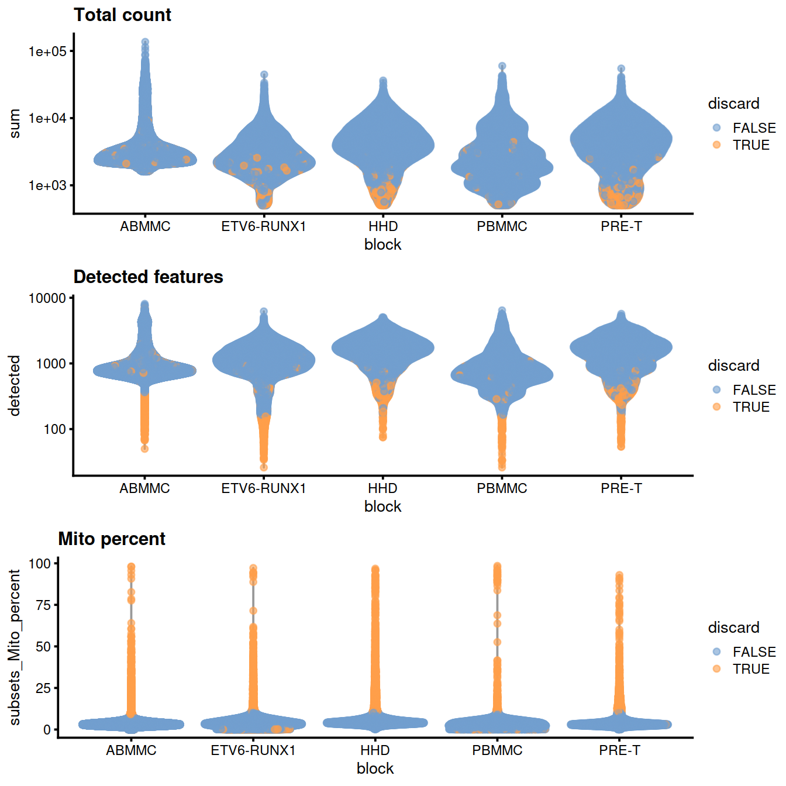

```r
dev.off()
```

```
## pdf 
##   2
```


```r
# eval=FALSE; see chunks below for each of the metric separately
tmpFn <- sprintf("%s/%s/qc_metricDistrib_plotColDataBatch%s.png",
                 dirRel, qcPlotDirBit, setSuf)
knitr::include_graphics(tmpFn, auto_pdf = TRUE)
rm(tmpFn)
```

Library size:


```r
plotColData(sce, x="block", y="sum", colour_by="discard",
        other_fields="setName") +
	#facet_wrap(~setName) + 
        scale_y_log10() + ggtitle("Total count")
```

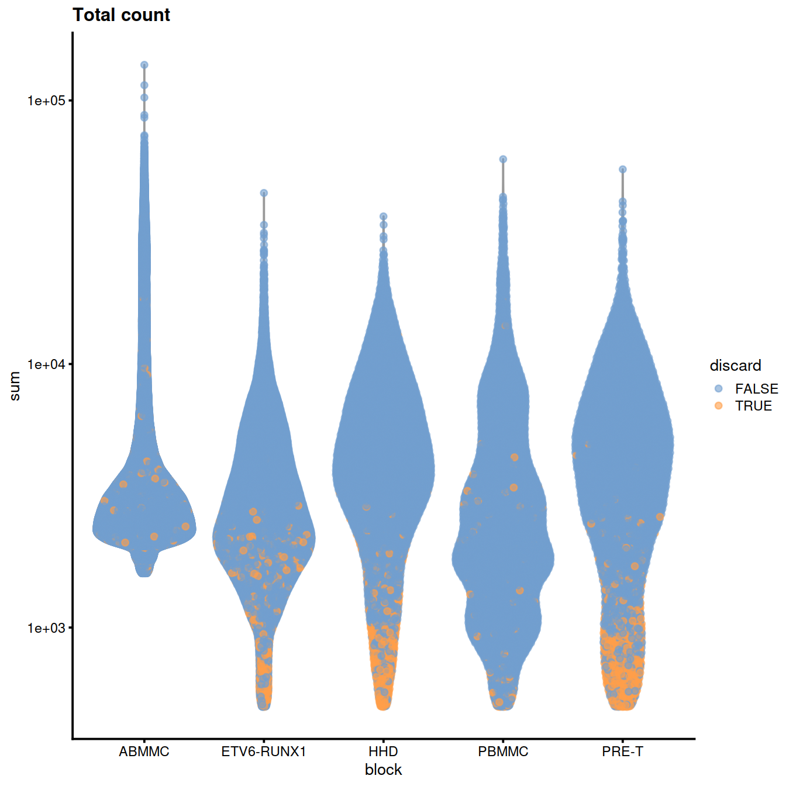

Number of genes detected:


```r
    plotColData(sce, x="block", y="detected", colour_by="discard", 
        other_fields="setName") +
	#facet_wrap(~setName) + 
        scale_y_log10() + ggtitle("Detected features")
```

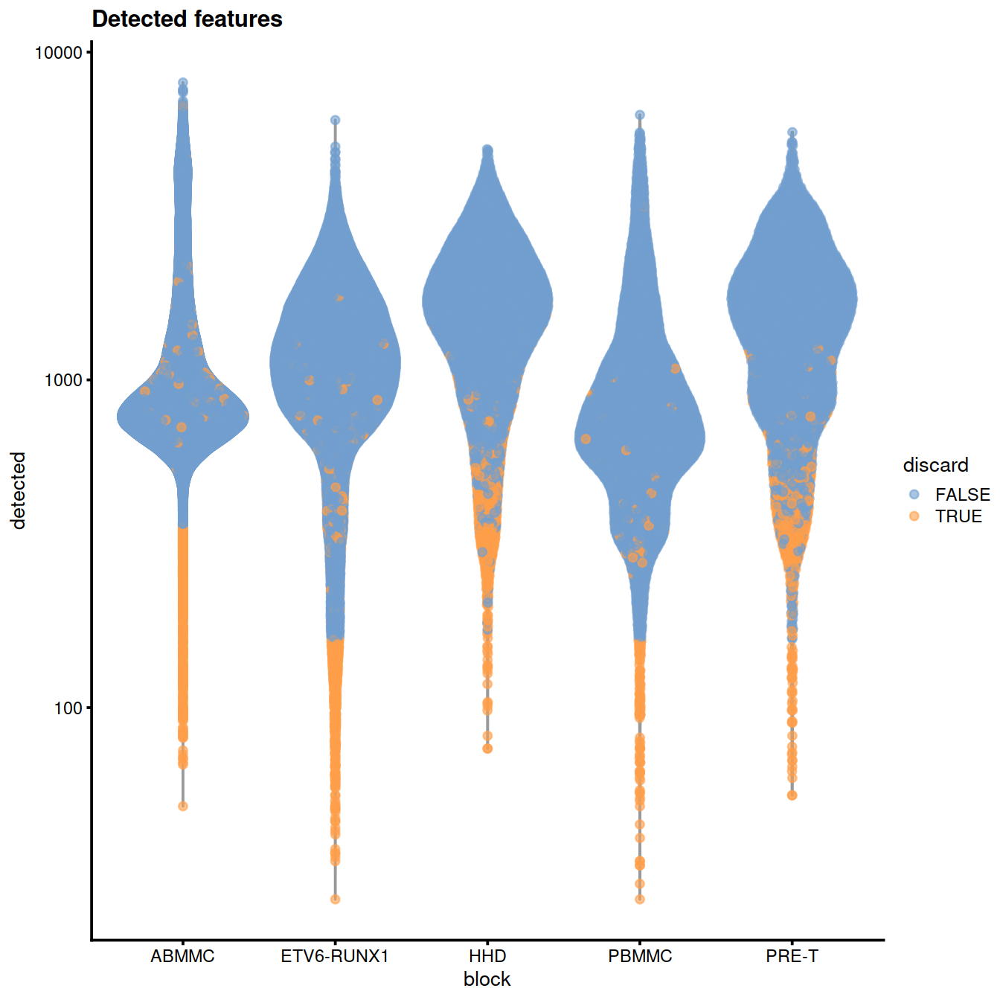


```r
plotColData(sce, x="block", y="detected", colour_by="discard", 
        other_fields="setName") +
	      facet_wrap(~colour_by) + 
        scale_y_log10() + ggtitle("Detected features")
```

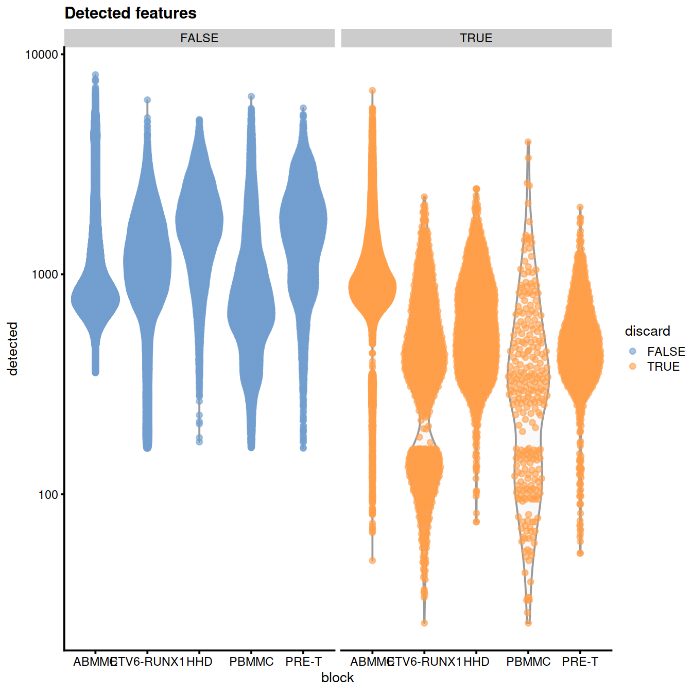

Mitochondrial content:


```r
    plotColData(sce, x="block", y="subsets_Mito_percent", 
        colour_by="discard", other_fields="setName") + 
        #facet_wrap(~setName) +
  	ggtitle("Mito percent")
```

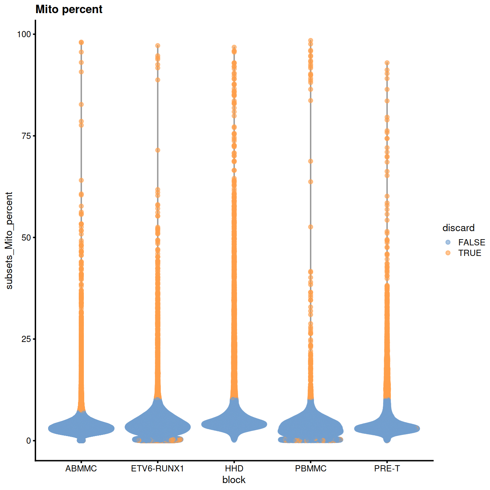


```r
sp <- ggplot(data.frame(colData(sce)),
             aes(x=detected, y=subsets_Mito_percent, col=discard)) +
  geom_point(size = 0.05, alpha = 0.2) +
  geom_density_2d(size = 0.5, colour = "blue") +
  guides(colour = guide_legend(override.aes = list(size=1, alpha=1))) +
  theme(legend.position="bottom")

#sp
ggExtra::ggMarginal(sp)
```

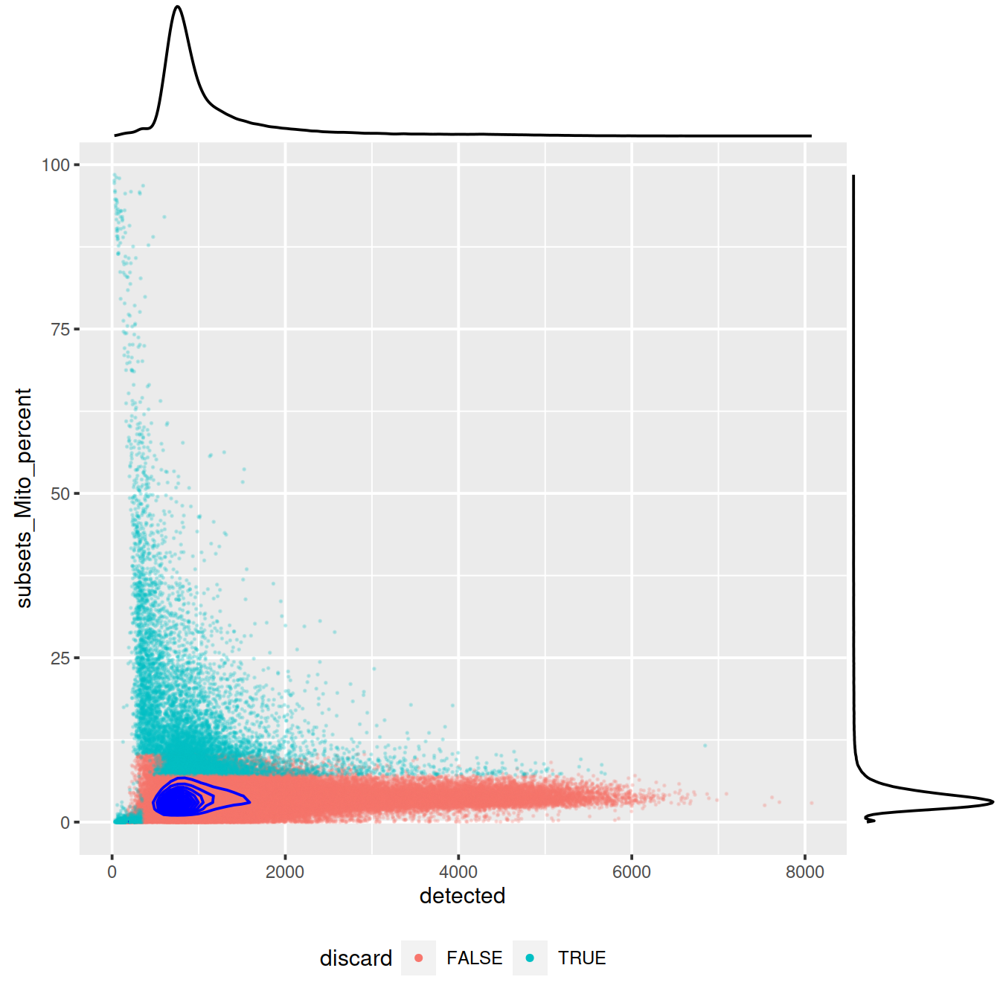


```r
sp <- ggplot(data.frame(colData(sce)), aes(x=detected, y=subsets_Mito_percent, col=discard)) +
  geom_point(size = 0.05, alpha = 0.2)
sp + facet_wrap(~source_name)
```

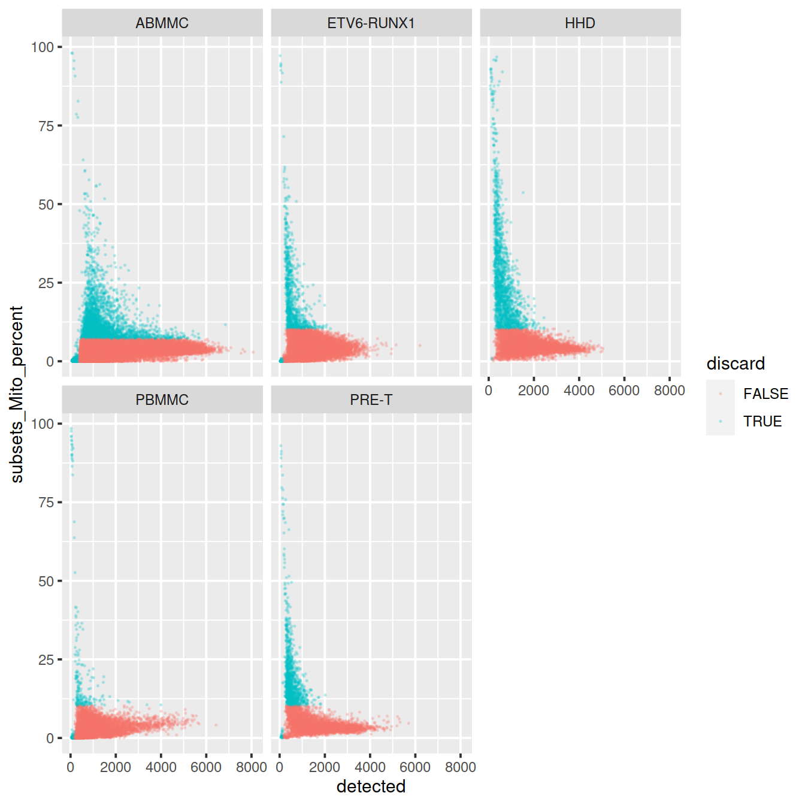


```r
sp <- ggplot(data.frame(colData(sce)), aes(x=detected, y=subsets_Mito_percent)) +
  geom_point(size = 0.05, alpha = 0.0)
sp + 
  #geom_density_2d_filled(alpha = 0.5) +
  geom_density_2d(size = 0.5, colour = "black")
```


```r
sp <- ggplot(data.frame(colData(sce)), aes(x=detected, y=subsets_Mito_percent)) +
  geom_point(size = 0.05, alpha = 0.2) +
  geom_density_2d(size = 0.5, colour = "blue")
ggExtra::ggMarginal(sp)
```

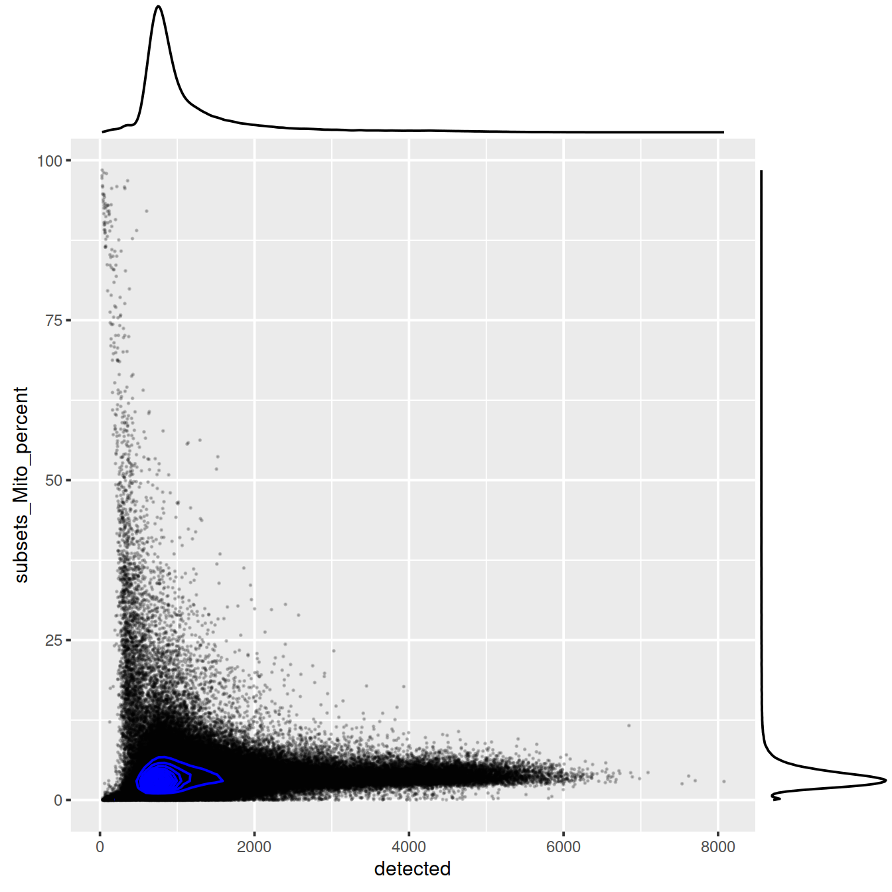

### Identify poor-quality batches

We will now consider the 'sample' batch to illustrate how to identify batches with overall low quality or different from other batches. Let's compare thresholds across sample groups.

#### Number of genes detected


```r
# compute
discard.nexprs <- isOutlier(sce$detected, log=TRUE, type="lower", batch=sce$Sample.Name)
nexprs.thresholds <- attr(discard.nexprs, "thresholds")["lower",]
nexprs.thresholds %>%
  round(0) %>%
  as.data.frame() %>%
	datatable(rownames = TRUE)
```

```{=html}
<div id="htmlwidget-9d025bb25c871b90ef46" style="width:100%;height:auto;" class="datatables html-widget"></div>
<script type="application/json" data-for="htmlwidget-9d025bb25c871b90ef46">{"x":{"filter":"none","data":[["GSM3872434","GSM3872435","GSM3872436","GSM3872437","GSM3872438","GSM3872439","GSM3872440","GSM3872441","GSM3872442","GSM3872443","GSM3872444","MantonBM1","MantonBM2","MantonBM3","MantonBM4","MantonBM5","MantonBM6","MantonBM7","MantonBM8"],[607,336,328,141,157,572,196,264,71,132,237,435,412,394,314,239,466,371,342]],"container":"<table class=\"display\">\n  <thead>\n    <tr>\n      <th> <\/th>\n      <th>.<\/th>\n    <\/tr>\n  <\/thead>\n<\/table>","options":{"columnDefs":[{"className":"dt-right","targets":1},{"orderable":false,"targets":0}],"order":[],"autoWidth":false,"orderClasses":false}},"evals":[],"jsHooks":[]}</script>
```

Without block:


```r
# plots - without blocking
discard.nexprs.woBlock <- isOutlier(sce$detected, log=TRUE, type="lower")
without.blocking <- plotColData(sce, x="Sample.Name", y="detected",
    colour_by=I(discard.nexprs.woBlock))

without.blocking + theme(axis.text.x = element_text(angle = 90, hjust = 1))
```

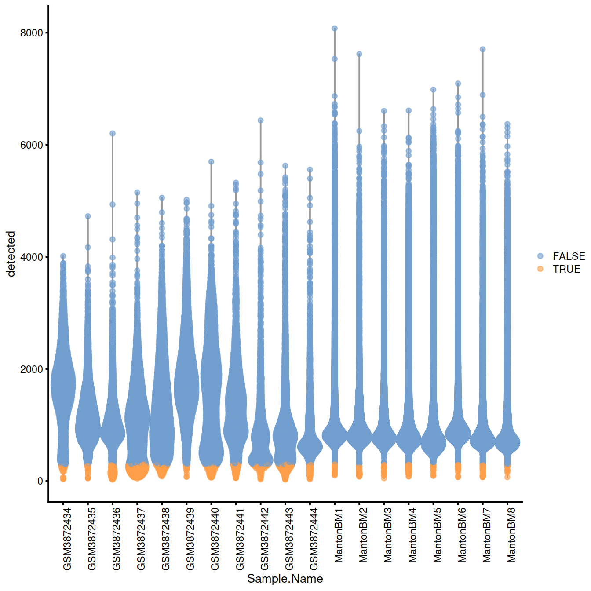

With block:


```r
# plots - with blocking
with.blocking <- plotColData(sce, x="Sample.Name", y="detected",
    colour_by=I(discard.nexprs))
with.blocking + theme(axis.text.x = element_text(angle = 90, hjust = 1))
```

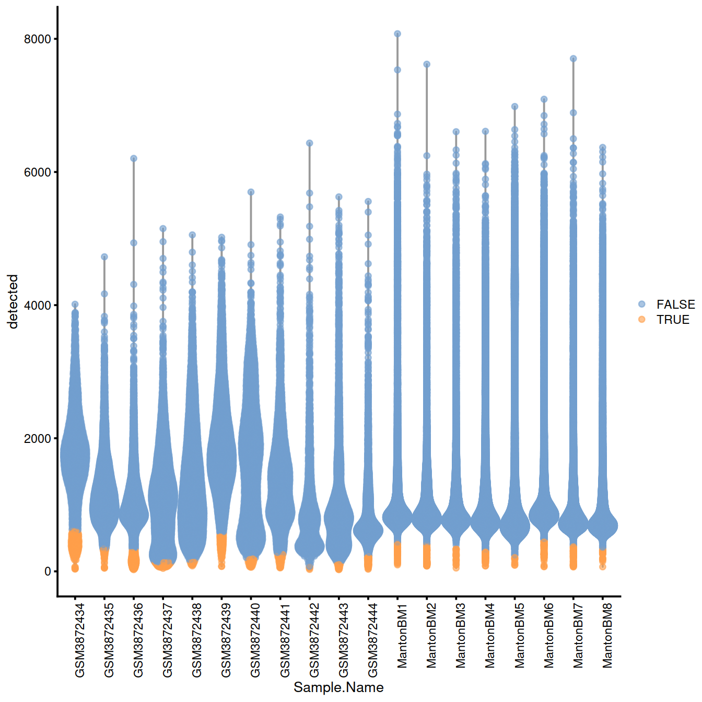

##### Mitochondrial content


```r
discard.mito <- isOutlier(sce$subsets_Mito_percent, type="higher", batch=sce$Sample.Name)
mito.thresholds <- attr(discard.mito, "thresholds")["higher",]
mito.thresholds %>%
  round(0) %>%
  as.data.frame() %>%
	datatable(rownames = TRUE)
```

```{=html}
<div id="htmlwidget-b16621a4fd64068753d3" style="width:100%;height:auto;" class="datatables html-widget"></div>
<script type="application/json" data-for="htmlwidget-b16621a4fd64068753d3">{"x":{"filter":"none","data":[["GSM3872434","GSM3872435","GSM3872436","GSM3872437","GSM3872438","GSM3872439","GSM3872440","GSM3872441","GSM3872442","GSM3872443","GSM3872444","MantonBM1","MantonBM2","MantonBM3","MantonBM4","MantonBM5","MantonBM6","MantonBM7","MantonBM8"],[13,9,7,13,17,7,8,8,8,13,9,8,7,7,8,7,7,7,7]],"container":"<table class=\"display\">\n  <thead>\n    <tr>\n      <th> <\/th>\n      <th>.<\/th>\n    <\/tr>\n  <\/thead>\n<\/table>","options":{"columnDefs":[{"className":"dt-right","targets":1},{"orderable":false,"targets":0}],"order":[],"autoWidth":false,"orderClasses":false}},"evals":[],"jsHooks":[]}</script>
```

Without block:


```r
# plots - without blocking
discard.mito.woBlock <- isOutlier(sce$subsets_Mito_percent, type="higher")
without.blocking <- plotColData(sce, x="Sample.Name", y="subsets_Mito_percent",
    colour_by=I(discard.mito.woBlock))
without.blocking + theme(axis.text.x = element_text(angle = 90, hjust = 1))
```

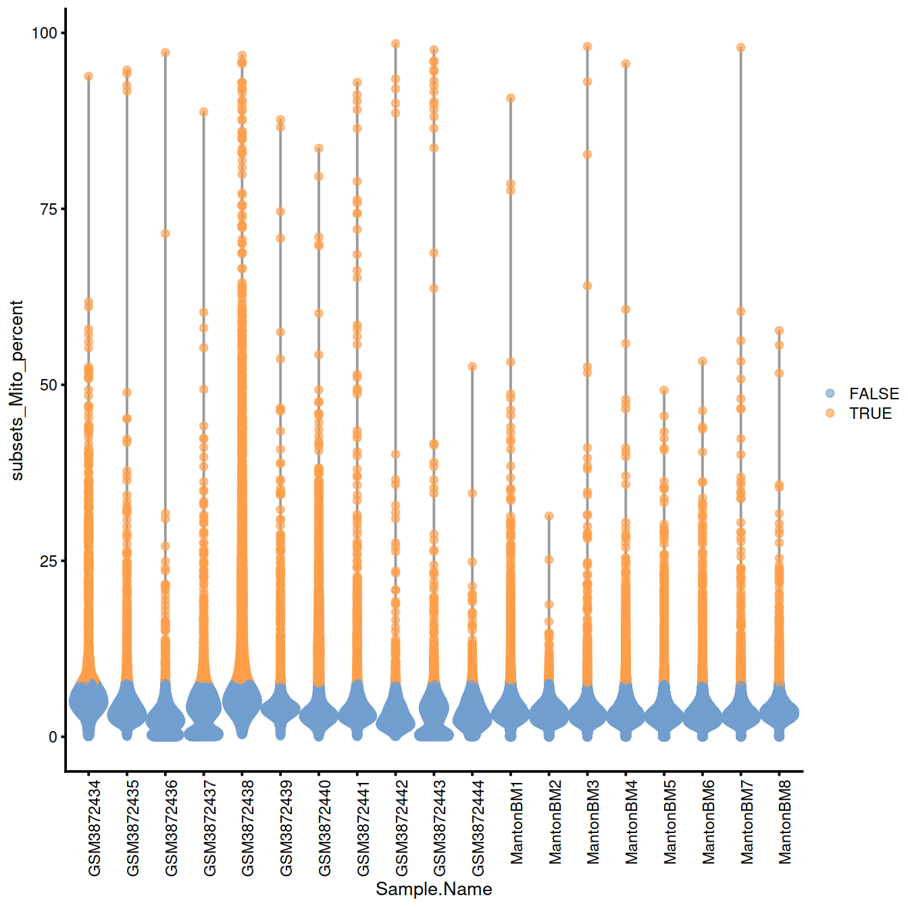

With block:


```r
# plots - with blocking
with.blocking <- plotColData(sce, x="Sample.Name", y="subsets_Mito_percent",
    colour_by=I(discard.mito))
with.blocking + theme(axis.text.x = element_text(angle = 90, hjust = 1))
```

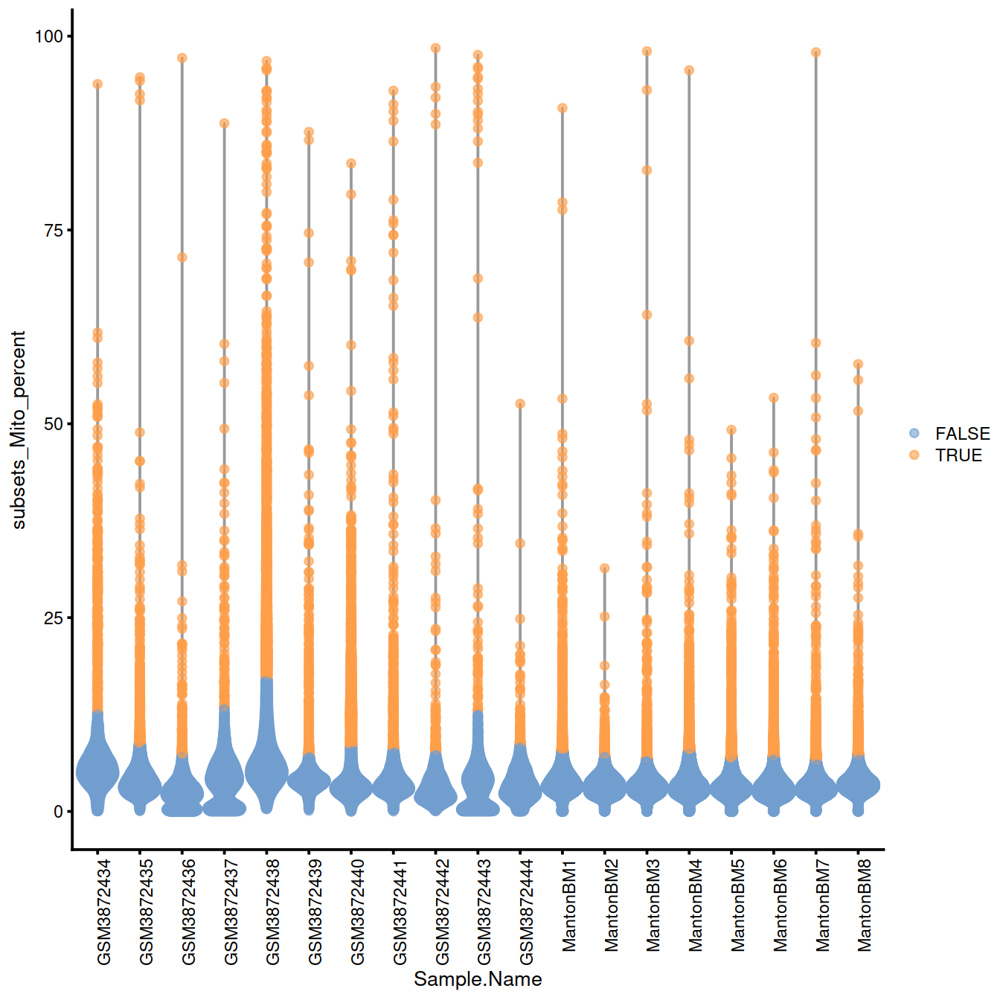

#### Samples to check

Names of samples with a 'low' threshold for the number of genes detected:


```r
# names
names(nexprs.thresholds)[isOutlier(nexprs.thresholds, type="lower")]
```

```
## character(0)
```

Names of samples with a 'high' threshold for mitocondrial content:


```r
# names
names(mito.thresholds)[isOutlier(mito.thresholds, type="higher")]
```

```
## [1] "GSM3872434" "GSM3872437" "GSM3872438" "GSM3872443"
```

### QC metrics space

A similar approach exists to identify outliers using a set of metrics together. We will the same QC metrics as above:


```r
# slow
stats <- cbind(log10(sce$sum),
	       log10(sce$detected),
	       sce$subsets_Mito_percent)

library(robustbase)
outlying <- adjOutlyingness(stats, only.outlyingness = TRUE)
multi.outlier <- isOutlier(outlying, type = "higher")
```


```r
summary(multi.outlier)
```

```
##    Mode   FALSE    TRUE 
## logical  232401   16453
```

Compare with previous filtering:


```r
table(sce$discard, multi.outlier)
```

```
##        multi.outlier
##          FALSE   TRUE
##   FALSE 226413  10427
##   TRUE    5988   6026
```

### QC PCA

One can also perform a principal components analysis (PCA) on cells, based on the column metadata in a SingleCellExperiment object. Here we will only use the library size, the number of genes detected (which is correlated with library size) and the mitochondrial content.


```r
sce <- runColDataPCA(sce, variables=list(
    "sum", "detected", "subsets_Mito_percent"),
    outliers=TRUE)

#reducedDimNames(sce)
#head(reducedDim(sce))
#head(colData(sce))

#p <- plotReducedDim(sce, dimred="PCA_coldata", colour_by = "Sample.Name")
p <- plotReducedDim(sce, dimred="PCA_coldata", colour_by = "outlier")
p + facet_wrap(~sce$discard)
```

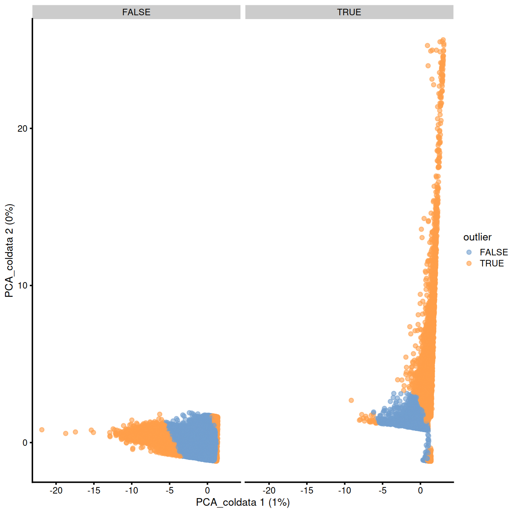

Compare with previous filtering:

* `discard` and `runColDataPCA`'s `outlier`:


```r
table(sce$discard, sce$outlier)
```

```
##        
##          FALSE   TRUE
##   FALSE 227999   8841
##   TRUE    5611   6403
```

* `adjOutlyingness`' `multi.outlier` and `runColDataPCA`'s `outlier`:


```r
table(multi.outlier, sce$outlier)
```

```
##              
## multi.outlier  FALSE   TRUE
##         FALSE 226248   6153
##         TRUE    7362   9091
```

### Other diagnostic plots

Mitochondrial content against library size:


```r
plotColData(sce, x="sum", y="subsets_Mito_percent", colour_by="discard")
```

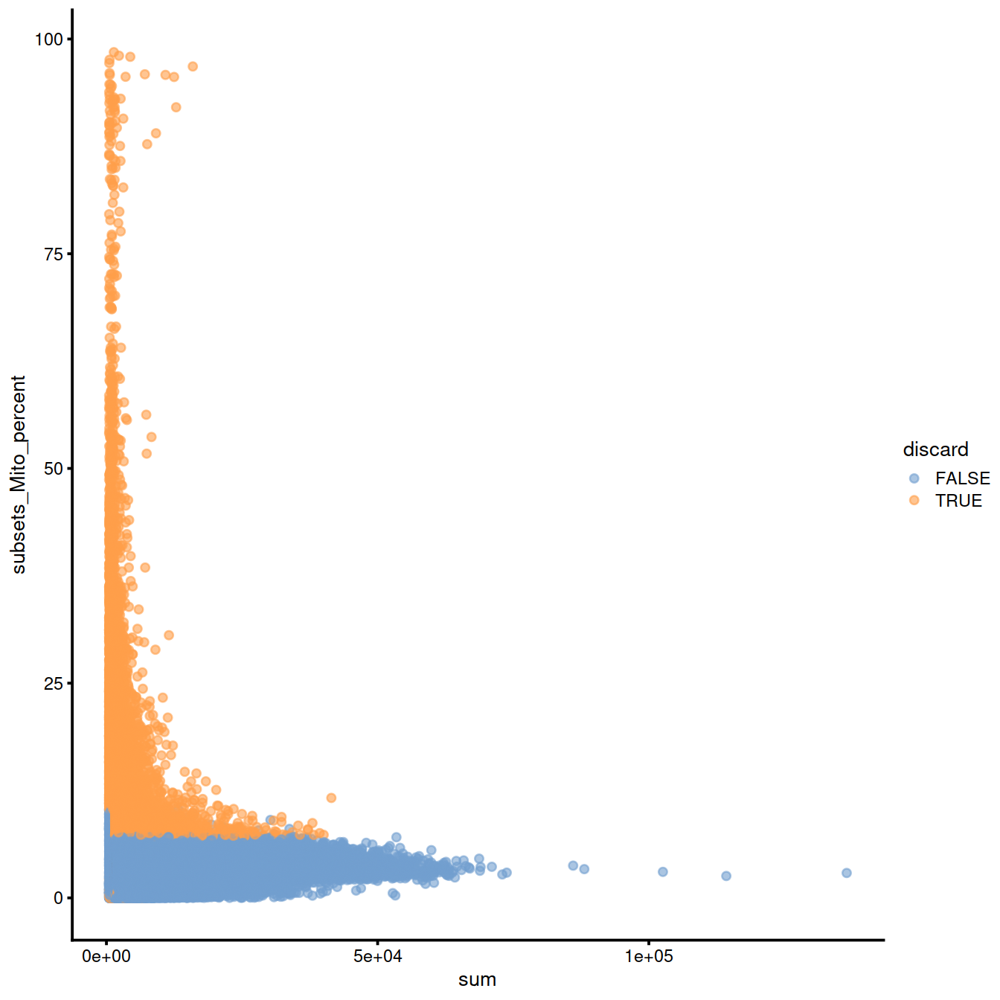


```r
sp <- ggplot(data.frame(colData(sce)),
             aes(x=sum, y=subsets_Mito_percent, col=discard)) +
  geom_point(size = 0.05, alpha = 0.7) +
  geom_density_2d(size = 0.5, colour = "blue") +
  guides(colour = guide_legend(override.aes = list(size=1, alpha=1))) +
  theme(legend.position="bottom")
#sp
ggExtra::ggMarginal(sp)
```

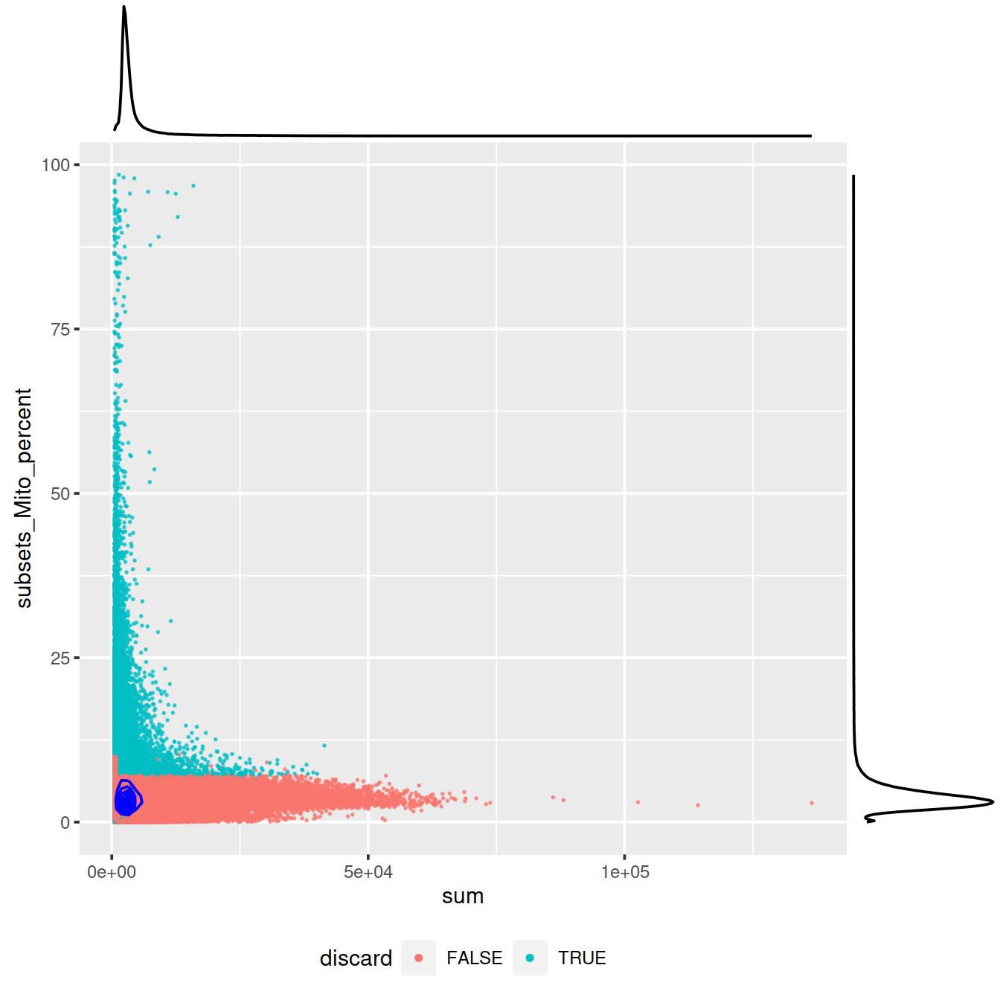

Mind distributions:


```r
sp + facet_wrap(~source_name)
```

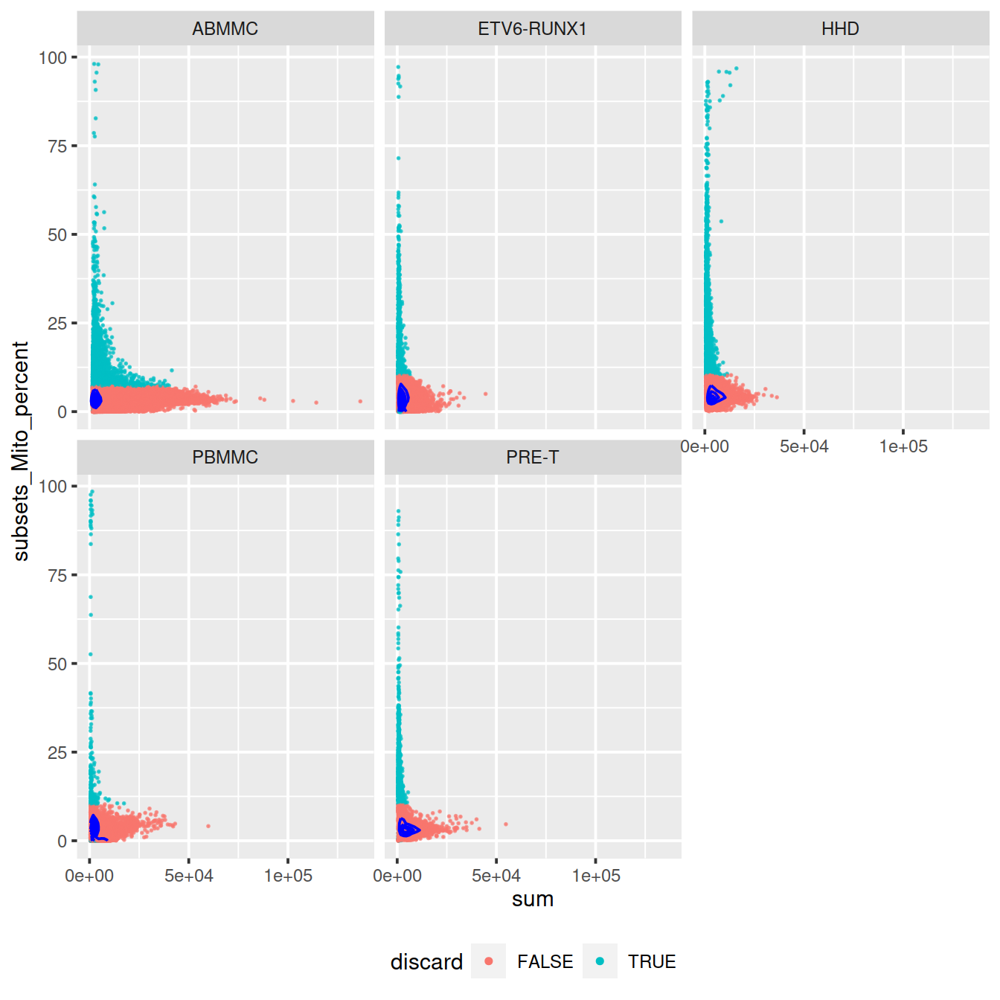

### Filter low-quality cells out

We will now exclude poor-quality cells.


```r
scePreQc <- sce
sce <- scePreQc[,!scePreQc$discard]
sce
```

```
## class: SingleCellExperiment 
## dim: 33538 236840 
## metadata(20): Samples Samples ... Samples Samples
## assays(1): counts
## rownames(33538): ENSG00000243485 ENSG00000237613 ... ENSG00000277475
##   ENSG00000268674
## rowData names(10): ensembl_gene_id external_gene_name ... mean detected
## colnames: NULL
## colData names(15): Sample Barcode ... discard outlier
## reducedDimNames(1): PCA_coldata
## altExpNames(0):
```

We also write the R object to file to use later if need be.


```r
# Write object to file
tmpFn <- sprintf("%s/%s/Robjects/sce_postQc%s.Rds",
		 projDir, outDirBit, setSuf)
saveRDS(sce, tmpFn)
```


```r
# Read object in:
tmpFn <- sprintf("%s/%s/Robjects/sce_postQc%s.Rds",
		 projDir, outDirBit, setSuf)
print("DEV"); print(getwd()); print(tmpFn)
#sce <- readRDS(tmpFn)
```

## Novelty

The number of genes per UMI for each cell informs on the level of sequencing saturation achieved ( [hbctraining](https://hbctraining.github.io/In-depth-NGS-Data-Analysis-Course/sessionIV/lessons/SC_quality_control_analysis.html)). For a given cell, as sequencing depth increases each extra UMI is less likely to correspnf to a gene not already detected in that cell. Cells with small library size tend to have higher overall 'novelty' i.e. they have not reached saturation for any given gene. Outlier cell may have a library with low complexity. This may suggest the some cell types, e.g. red blood cells. The expected novelty is about 0.8.

Here we see that some PBMMCs have low novelty, ie overall fewer genes were detected for an equivalent number of UMIs in these cells than in others.


```r
p <- colData(sce) %>%
  data.frame() %>%
  ggplot(aes(x=sum, y=detected, color=subsets_Mito_percent)) + 
  geom_point() + 
  stat_smooth(method=lm) +
  scale_x_log10() + 
  scale_y_log10() + 
  geom_vline(xintercept = 800) +
  facet_wrap(~source_name)
p
```

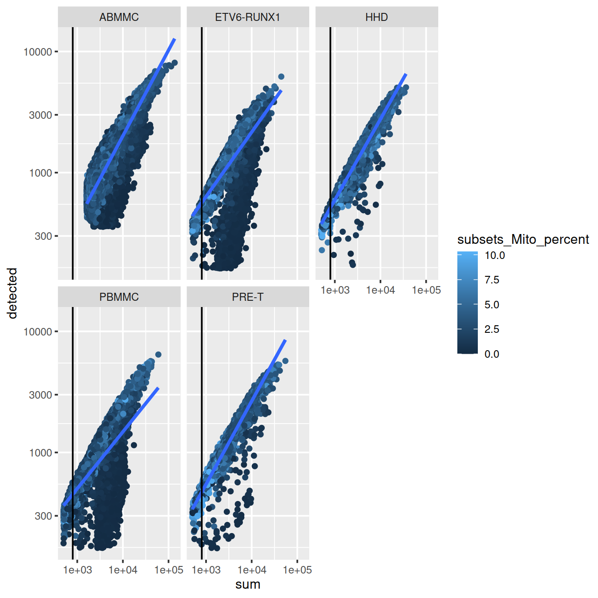

```r
# write plot to file

tmpFn <- sprintf("%s/%s/%s/novelty_scat%s.png",
		 projDir, outDirBit, qcPlotDirBit, setSuf)
#print("DEV"); print(getwd()); print(tmpFn)
ggsave(plot=p, file=tmpFn, type="cairo-png")

# Novelty
# the number of genes per UMI for each cell,
# https://hbctraining.github.io/In-depth-NGS-Data-Analysis-Course/sessionIV/lessons/SC_quality_control_analysis.html

# Add number of UMIs per gene for each cell to metadata
colData(sce)$log10GenesPerUMI <- log10(colData(sce)$detected) / log10(colData(sce)$sum)
```


```r
#```{r novelty_dens_allCells, cache.lazy = FALSE}
# Visualize the overall novelty of the gene expression by visualizing the genes detected per UMI
p <- colData(sce) %>%
	data.frame() %>%
        ggplot(aes(x=log10GenesPerUMI, color = source_name, fill = source_name)) +
        geom_density()
p
```

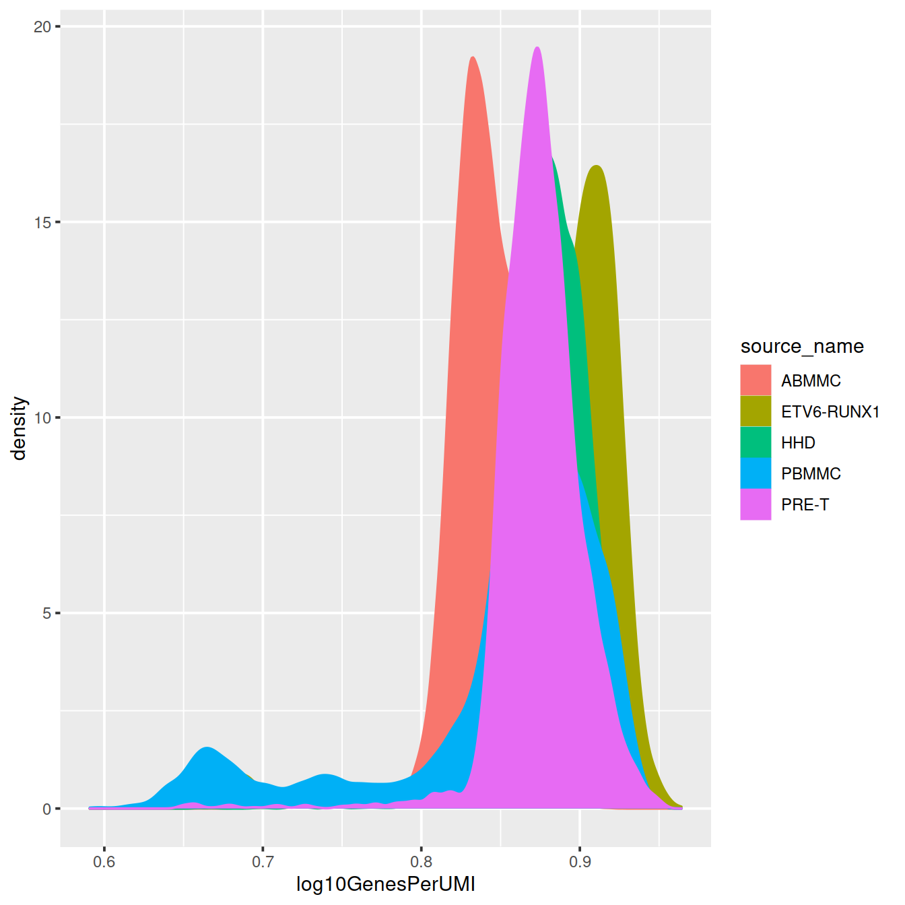

```r
tmpFn <- sprintf("%s/%s/%s/novelty_dens%s.png",
		 projDir, outDirBit, qcPlotDirBit, setSuf)
#print("DEV"); print(getwd()); print(tmpFn)
ggsave(plot=p, file=tmpFn, type="cairo-png")
```


```r
rm(sce)
```

## QC based on sparsity

The approach above identified poor-quality using thresholds on the number of genes detected and mitochondrial content. We will here specifically look at the sparsity of the data, both at the gene and cell levels. 

### Remove genes that are not expressed at all

Genes that are not expressed at all are not informative, so we remove them


```r
not.expressed <- rowSums(counts(scePreQc)) == 0

# store the cell-wise information
cols.meta <- colData(scePreQc)
rows.meta <- rowData(scePreQc)

nz.counts <- counts(scePreQc)[!not.expressed, ]
sce.nz <- SingleCellExperiment(list(counts=nz.counts))

# reset the column data on the new object
colData(sce.nz) <- cols.meta
rowData(sce.nz) <- rows.meta[!not.expressed, ]

sce.nz
```

```
## class: SingleCellExperiment 
## dim: 27795 248854 
## metadata(0):
## assays(1): counts
## rownames(27795): ENSG00000243485 ENSG00000238009 ... ENSG00000271254
##   ENSG00000268674
## rowData names(10): ensembl_gene_id external_gene_name ... mean detected
## colnames: NULL
## colData names(15): Sample Barcode ... discard outlier
## reducedDimNames(0):
## altExpNames(0):
```


```r
# Write object to file
tmpFn <- sprintf("%s/%s/Robjects/sce_nz%s.Rds",
		 projDir, outDirBit, setSuf)
saveRDS(sce.nz, tmpFn)
```


```r
# Write object to file
tmpFn <- sprintf("%s/%s/Robjects/sce_nz%s.Rds",
		 projDir, outDirBit, setSuf)
sce.nz <- readRDS(tmpFn)
```

Number of genes 27795.

Number of cells 248854.

### Sparsity plots

We will compute:

* the cell sparsity: for each cell, the proportion of genes that are not detected
* the gene sparsity: for each gene, the proportion of cells in which it is not detected


```r
# compute - SLOW
cell_sparsity <- apply(counts(sce.nz) == 0, 2, sum)/nrow(counts(sce.nz))
gene_sparsity <- apply(counts(sce.nz) == 0, 1, sum)/ncol(counts(sce.nz))

colData(sce.nz)$cell_sparsity <- cell_sparsity
rowData(sce.nz)$gene_sparsity <- gene_sparsity

# write outcome to file for later use
tmpFn <- sprintf("%s/%s/Robjects/sce_nz_sparsityCellGene%s.Rds",
		 projDir, outDirBit, setSuf)
saveRDS(list("colData" = colData(sce.nz),
	     "rowData" = rowData(sce.nz)),
	tmpFn)
```


```r
# Read object in:
tmpFn <- sprintf("%s/%s/Robjects/sce_nz_sparsityCellGene%s.Rds",
		 projDir, outDirBit, setSuf)
tmpList <- readRDS(tmpFn)
cell_sparsity <- tmpList$colData$cell_sparsity
gene_sparsity <- tmpList$rowData$gene_sparsity
```

We now plot the distribution of these two metrics.

The cell sparsity plot shows that cells have between 85% and 99% 0's, which is typical.

The gene sparsity plot shows that a large number of genes are almost never detected, which is alo regularly observed.


```r
# plot
tmpFn <- sprintf("%s/%s/%s/sparsity%s.png",
		 projDir, outDirBit, qcPlotDirBit, setSuf)
#print("DEV"); print(getwd()); print(tmpFn)
CairoPNG(tmpFn)
par(mfrow=c(1, 2))
hist(cell_sparsity, breaks=50, col="grey80", xlab="Cell sparsity", main="")
hist(gene_sparsity, breaks=50, col="grey80", xlab="Gene sparsity", main="")
abline(v=40, lty=2, col='purple')
```

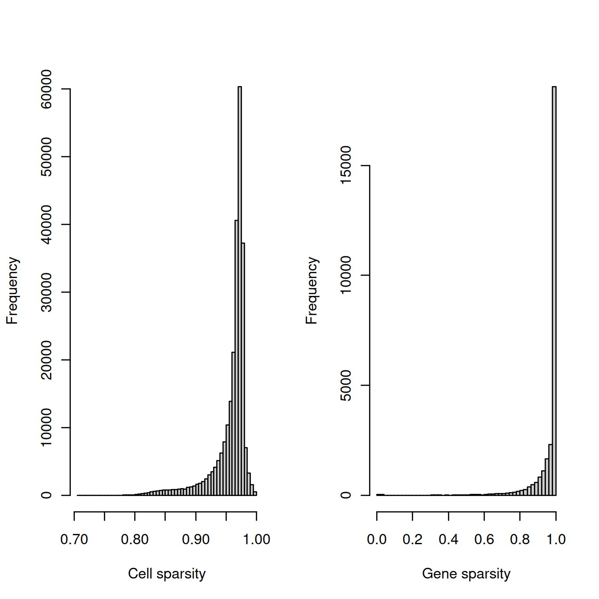

```r
dev.off()
```

```
## pdf 
##   2
```


```r
tmpFn <- sprintf("%s/%s/sparsity%s.png",
		 dirRel, qcPlotDirBit, setSuf)
knitr::include_graphics(tmpFn, auto_pdf = TRUE)
```

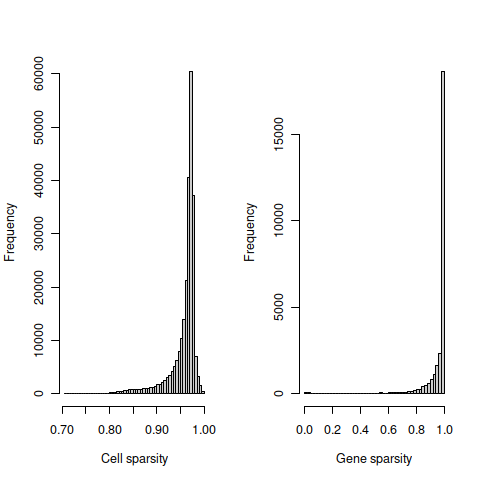

```r
rm(tmpFn)
```

### Filters

We also remove cells with sparsity higher than 0.99, and/or mitochondrial content higher than 20%.

Genes detected in a few cells only are unlikely to be informative and would hinder normalisation. We will remove genes that are expressed in fewer than 20 cells.


```r
# filter
sparse.cells <- cell_sparsity > 0.99
mito.cells <- sce.nz$subsets_Mito_percent > 20

min.cells <- 1 - (20/length(cell_sparsity))
sparse.genes <- gene_sparsity > min.cells
```

Number of genes removed:


```r
table(sparse.genes)
```

```
## sparse.genes
## FALSE  TRUE 
## 21579  6216
```

Number of cells removed:


```r
table(sparse.cells, mito.cells)
```

```
##             mito.cells
## sparse.cells  FALSE   TRUE
##        FALSE 244996   1785
##        TRUE    1859    214
```


```r
# remove cells from the SCE object that are poor quality
# remove the sparse genes, then re-set the counts and row data accordingly
cols.meta <- colData(sce.nz)
rows.meta <- rowData(sce.nz)

counts.nz <- counts(sce.nz)[!sparse.genes, !(sparse.cells | mito.cells)]
sce.nz <- SingleCellExperiment(assays=list(counts=counts.nz))
colData(sce.nz) <- cols.meta[!(sparse.cells | mito.cells),]
rowData(sce.nz) <- rows.meta[!sparse.genes, ]
sce.nz
```

```
## class: SingleCellExperiment 
## dim: 21579 244996 
## metadata(0):
## assays(1): counts
## rownames(21579): ENSG00000238009 ENSG00000237491 ... ENSG00000275063
##   ENSG00000271254
## rowData names(11): ensembl_gene_id external_gene_name ... detected
##   gene_sparsity
## colnames: NULL
## colData names(16): Sample Barcode ... outlier cell_sparsity
## reducedDimNames(0):
## altExpNames(0):
```

```r
rm(counts.nz)
```


```r
# Write object to file
tmpFn <- sprintf("%s/%s/Robjects/sce_nz_postQc%s.Rds",
		 projDir, outDirBit, setSuf)
saveRDS(sce.nz, tmpFn)
```


```r
# Read object in:
tmpFn <- sprintf("%s/%s/Robjects/sce_nz_postQc%s.Rds",
		 projDir, outDirBit, setSuf)
print("DEV"); print(getwd()); print(tmpFn)
##sce.nz <- readRDS(tmpFn)
```

Compare with filter above (mind that the comparison is not fair because we used a less stringent, hard filtering on mitochondrial content):


```r
table(scePreQc$discard, (sparse.cells | mito.cells))
```

```
##        
##          FALSE   TRUE
##   FALSE 235832   1008
##   TRUE    9164   2850
```


```r
rm(scePreQc)
```

### Separate Caron and Hca batches

We will now check sparsity for each batch separately.


```r
sce.nz.caron <- sce.nz[,sce.nz$setName=="Caron"]
sce.nz.hca <- sce.nz[,sce.nz$setName=="Hca"]
```

### Caron only


```r
setName <- "caron"
sce.x <- sce.nz.caron # for code re-use
rm(sce.nz.caron)
```


```r
# compute - SLOW
cell_sparsity <- apply(counts(sce.x) == 0, 2, sum)/nrow(counts(sce.x))
gene_sparsity <- apply(counts(sce.x) == 0, 1, sum)/ncol(counts(sce.x))

colData(sce.x)$cell_sparsity <- cell_sparsity
rowData(sce.x)$gene_sparsity <- gene_sparsity

# write outcome to file for later use
tmpFn <- sprintf("%s/%s/Robjects/%s_sce_nz_sparsityCellGene%s.Rds",
		 projDir, outDirBit, setName, setSuf)
saveRDS(list("colData" = colData(sce.x),
	     "rowData" = rowData(sce.x)),
	tmpFn)
```


```r
# Read object in:
tmpFn <- sprintf("%s/%s/Robjects/%s_sce_nz_sparsityCellGene%s.Rds",
		 projDir, outDirBit, setName, setSuf)
tmpList <- readRDS(tmpFn)
cell_sparsity <- tmpList$colData$cell_sparsity
gene_sparsity <- tmpList$rowData$gene_sparsity
```


```r
# plot
tmpFn <- sprintf("%s/%s/%s/%s_sparsity%s.png",
		 projDir, outDirBit, qcPlotDirBit, setName, setSuf)
CairoPNG(tmpFn)
par(mfrow=c(1, 2))
hist(cell_sparsity, breaks=50, col="grey80", xlab="Cell sparsity", main="")
hist(gene_sparsity, breaks=50, col="grey80", xlab="Gene sparsity", main="")
abline(v=40, lty=2, col='purple')
```

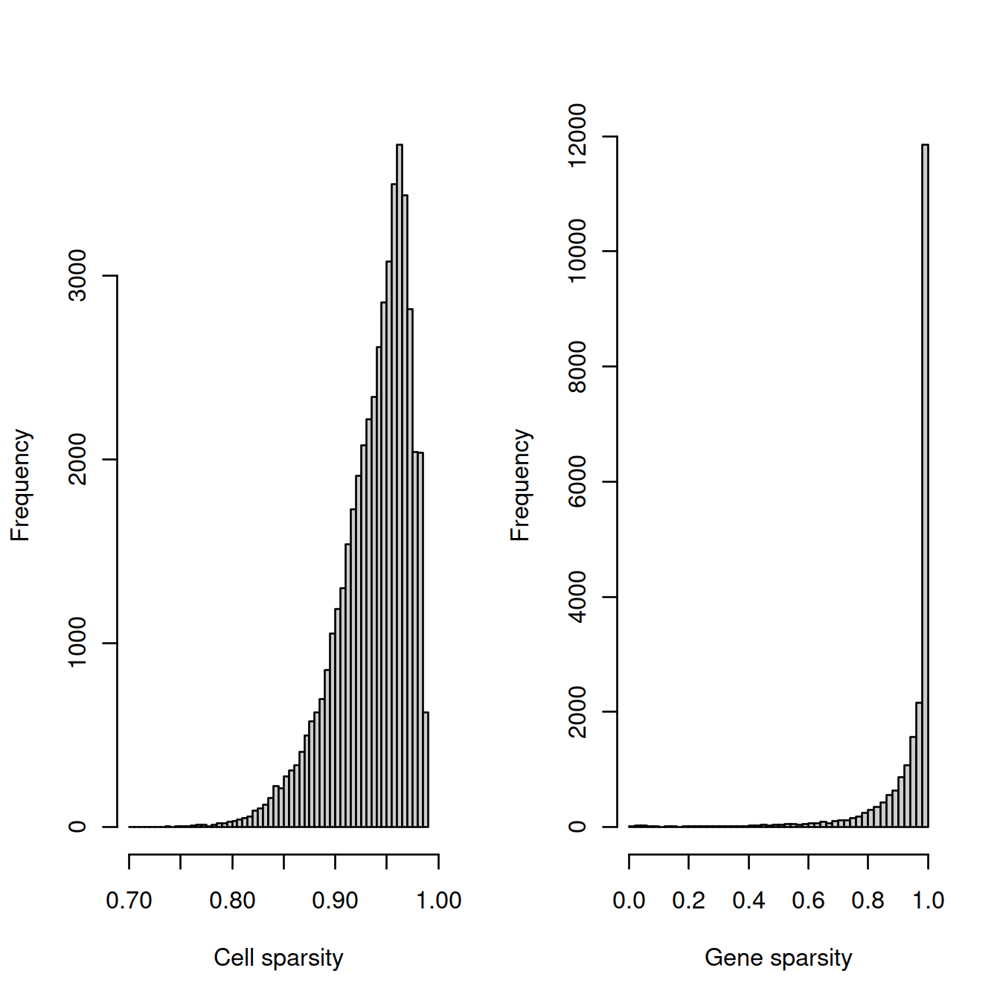

```r
dev.off()
```

```
## pdf 
##   2
```


```r
tmpFn <- sprintf("%s/%s/%s_sparsity%s.png",
		 dirRel, qcPlotDirBit, setName, setSuf)
knitr::include_graphics(tmpFn, auto_pdf = TRUE)
```


```r
rm(tmpFn)
```


```r
# filter
sparse.cells <- cell_sparsity > 0.99
mito.cells <- sce.x$subsets_Mito_percent > 20

min.cells <- 1 - (20/length(cell_sparsity))
sparse.genes <- gene_sparsity > min.cells
```


```r
# remove cells from the SCE object that are poor quality
# remove the sparse genes, then re-set the counts and row data accordingly
cols.meta <- colData(sce.x)
rows.meta <- rowData(sce.x)

counts.x <- counts(sce.x)[!sparse.genes, !(sparse.cells | mito.cells)]
sce.x <- SingleCellExperiment(assays=list(counts=counts.x))
colData(sce.x) <- cols.meta[!(sparse.cells | mito.cells),]
rowData(sce.x) <- rows.meta[!sparse.genes, ]
sce.x
```

```
## class: SingleCellExperiment 
## dim: 18431 47830 
## metadata(0):
## assays(1): counts
## rownames(18431): ENSG00000238009 ENSG00000237491 ... ENSG00000275063
##   ENSG00000271254
## rowData names(11): ensembl_gene_id external_gene_name ... detected
##   gene_sparsity
## colnames: NULL
## colData names(16): Sample Barcode ... outlier cell_sparsity
## reducedDimNames(0):
## altExpNames(0):
```

We write the R object to caron_sce_nz_postQc_allCells.Rds.


```r
# Write object to file
tmpFn <- sprintf("%s/%s/Robjects/%s_sce_nz_postQc%s.Rds",
		 projDir, outDirBit, setName, setSuf)
saveRDS(sce.x, tmpFn)

# rename to sce.nz.caron
sce.nz.caron <- sce.x # TODO sce.nz.caron not used
rm(sce.x)
```


```r
# Read object in:
tmpFn <- sprintf("%s/%s/Robjects/%s_sce_nz_postQc%s.Rds",
		 projDir, outDirBit, setName, setSuf)
sce.nz.caron <- readRDS(tmpFn)
```

### Hca only


```r
setName <- "hca"
sce.x <- sce.nz.hca # for code re-use
rm(sce.nz.hca)
```


```r
# compute - SLOW
cell_sparsity <- apply(counts(sce.x) == 0, 2, sum)/nrow(counts(sce.x))
gene_sparsity <- apply(counts(sce.x) == 0, 1, sum)/ncol(counts(sce.x))

colData(sce.x)$cell_sparsity <- cell_sparsity
rowData(sce.x)$gene_sparsity <- gene_sparsity

# write outcome to file for later use
tmpFn <- sprintf("%s/%s/Robjects/%s_sce_nz_sparsityCellGene%s.Rds",
		 projDir, outDirBit, setName, setSuf)
saveRDS(list("colData" = colData(sce.x),
	     "rowData" = rowData(sce.x)),
	tmpFn)
```


```r
# Read object in:
tmpFn <- sprintf("%s/%s/Robjects/%s_sce_nz_sparsityCellGene%s.Rds",
		 projDir, outDirBit, setName, setSuf)
tmpList <- readRDS(tmpFn)
cell_sparsity <- tmpList$colData$cell_sparsity
gene_sparsity <- tmpList$rowData$gene_sparsity
```


```r
#```{r Hca_sparsity_plot_allCells, eval=runAll}
# plot
tmpFn <- sprintf("%s/%s/%s/%s_sparsity%s.png",
                 projDir, outDirBit, qcPlotDirBit, setName, setSuf)
#print("DEV"); print(getwd()); print(tmpFn)
CairoPNG(tmpFn)
par(mfrow=c(1, 2))
hist(cell_sparsity, breaks=50, col="grey80", xlab="Cell sparsity", main="")
hist(gene_sparsity, breaks=50, col="grey80", xlab="Gene sparsity", main="")
abline(v=40, lty=2, col='purple')
```

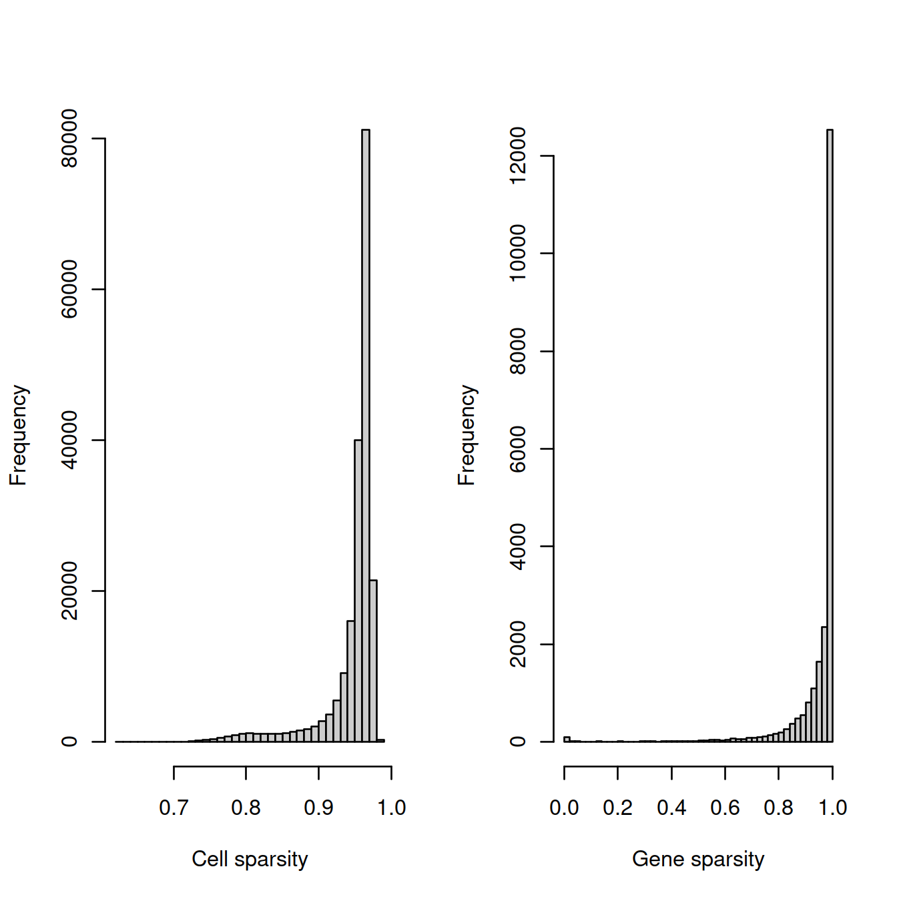

```r
dev.off()
```

```
## pdf 
##   2
```


```r
#tmpFn <- sprintf("%s/%s/%s/%s_sparsity.png", projDir, outDirBit, qcPlotDirBit, setName)
tmpFn <- sprintf("%s/%s/%s_sparsity%s.png",
		 dirRel, qcPlotDirBit, setName, setSuf)
knitr::include_graphics(tmpFn, auto_pdf = TRUE)
```

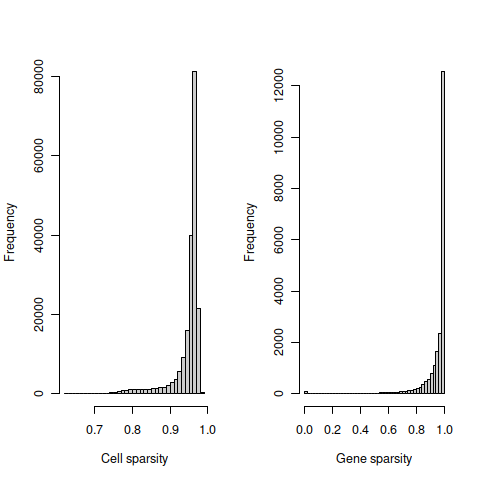

```r
rm(tmpFn)
```


```r
# filter
sparse.cells <- cell_sparsity > 0.99
mito.cells <- sce.x$subsets_Mito_percent > 20

min.cells <- 1 - (20/length(cell_sparsity))
sparse.genes <- gene_sparsity > min.cells
```


```r
# remove cells from the SCE object that are poor quality
# remove the sparse genes, then re-set the counts and row data accordingly
cols.meta <- colData(sce.x)
rows.meta <- rowData(sce.x)

counts.x <- counts(sce.x)[!sparse.genes, !(sparse.cells | mito.cells)]
sce.x <- SingleCellExperiment(assays=list(counts=counts.x))
colData(sce.x) <- cols.meta[!(sparse.cells | mito.cells),]
rowData(sce.x) <- rows.meta[!sparse.genes, ]
sce.x
```

```
## class: SingleCellExperiment 
## dim: 20425 197166 
## metadata(0):
## assays(1): counts
## rownames(20425): ENSG00000238009 ENSG00000237491 ... ENSG00000275063
##   ENSG00000271254
## rowData names(11): ensembl_gene_id external_gene_name ... detected
##   gene_sparsity
## colnames: NULL
## colData names(16): Sample Barcode ... outlier cell_sparsity
## reducedDimNames(0):
## altExpNames(0):
```

```r
rm(counts.x)
```

We write the R object to hca_sce_nz_postQc_allCells.Rds.


```r
# Write object to file
tmpFn <- sprintf("%s/%s/Robjects/%s_sce_nz_postQc%s.Rds",
		 projDir, outDirBit, setName, setSuf)
saveRDS(sce.x, tmpFn)

# rename to sce.nz.hca
sce.nz.hca <- sce.x # TODO sce.nz.hca only used for sce.nz.hca.5k
rm(sce.x)
```


```r
# Read object in:
tmpFn <- sprintf("%s/%s/Robjects/%s_sce_nz_postQc%s.Rds",
		 projDir, outDirBit, setName, setSuf)
sce.nz.hca <- readRDS(tmpFn)
```

## Subsample Hca set

The HCA data comprises about 25,000 cells per samples, compared to 5,000 for the Caron study. We will randomly subsample the HCA samples down to 5000 cells.


```r
sce.nz.hca
```

```
## class: SingleCellExperiment 
## dim: 20425 197166 
## metadata(0):
## assays(1): counts
## rownames(20425): ENSG00000238009 ENSG00000237491 ... ENSG00000275063
##   ENSG00000271254
## rowData names(11): ensembl_gene_id external_gene_name ... detected
##   gene_sparsity
## colnames: NULL
## colData names(16): Sample Barcode ... outlier cell_sparsity
## reducedDimNames(0):
## altExpNames(0):
```

```r
# have new list of cell barcodes for each sample
sce.nz.hca.5k.bc <- colData(sce.nz.hca) %>%
	data.frame() %>%
	group_by(Sample.Name) %>%
	sample_n(5000) %>%
	pull(Barcode)

table(colData(sce.nz.hca)$Barcode %in% sce.nz.hca.5k.bc)
```

```
## 
##  FALSE   TRUE 
## 157166  40000
```

```r
tmpInd <- which(colData(sce.nz.hca)$Barcode %in% sce.nz.hca.5k.bc)

sce.nz.hca.5k <- sce.nz.hca[,tmpInd]

# mind that genes were filtered using all cells, not just those sampled here.
```

We write the R object to 'hca_sce_nz_postQc_5kCellPerSpl.Rds'.


```r
# Write object to file
tmpFn <- sprintf("%s/%s/Robjects/%s_sce_nz_postQc_5kCellPerSpl.Rds", projDir, outDirBit, setName)
saveRDS(sce.nz.hca.5k, tmpFn)
```


```r
rm(sce.nz.hca)
rm(sce.nz.hca.5k)
gc()
```

```
##              used    (Mb) gc trigger    (Mb)   max used    (Mb)
## Ncells    8536994   456.0   13988780   747.1   13988780   747.1
## Vcells 2685439024 20488.3 4893692944 37336.0 4065286169 31015.7
```

## Session information


```r
sessionInfo()
```

```
## R version 4.0.3 (2020-10-10)
## Platform: x86_64-pc-linux-gnu (64-bit)
## Running under: CentOS Linux 8
## 
## Matrix products: default
## BLAS:   /opt/R/R-4.0.3/lib64/R/lib/libRblas.so
## LAPACK: /opt/R/R-4.0.3/lib64/R/lib/libRlapack.so
## 
## locale:
##  [1] LC_CTYPE=en_GB.UTF-8       LC_NUMERIC=C              
##  [3] LC_TIME=en_GB.UTF-8        LC_COLLATE=en_GB.UTF-8    
##  [5] LC_MONETARY=en_GB.UTF-8    LC_MESSAGES=en_GB.UTF-8   
##  [7] LC_PAPER=en_GB.UTF-8       LC_NAME=C                 
##  [9] LC_ADDRESS=C               LC_TELEPHONE=C            
## [11] LC_MEASUREMENT=en_GB.UTF-8 LC_IDENTIFICATION=C       
## 
## attached base packages:
## [1] stats4    parallel  stats     graphics  grDevices utils     datasets 
## [8] methods   base     
## 
## other attached packages:
##  [1] robustbase_0.93-7           mixtools_1.2.0             
##  [3] Cairo_1.5-12.2              dplyr_1.0.5                
##  [5] DT_0.18                     irlba_2.3.3                
##  [7] biomaRt_2.46.3              Matrix_1.3-2               
##  [9] igraph_1.2.6                DropletUtils_1.10.3        
## [11] scater_1.18.6               ggplot2_3.3.3              
## [13] scran_1.18.7                SingleCellExperiment_1.12.0
## [15] SummarizedExperiment_1.20.0 Biobase_2.50.0             
## [17] GenomicRanges_1.42.0        GenomeInfoDb_1.26.7        
## [19] IRanges_2.24.1              S4Vectors_0.28.1           
## [21] BiocGenerics_0.36.1         MatrixGenerics_1.2.1       
## [23] matrixStats_0.58.0          knitr_1.32                 
## 
## loaded via a namespace (and not attached):
##   [1] ggbeeswarm_0.6.0          colorspace_2.0-0         
##   [3] ellipsis_0.3.2            scuttle_1.0.4            
##   [5] bluster_1.0.0             XVector_0.30.0           
##   [7] BiocNeighbors_1.8.2       bit64_4.0.5              
##   [9] AnnotationDbi_1.52.0      fansi_0.4.2              
##  [11] xml2_1.3.2                codetools_0.2-18         
##  [13] splines_4.0.3             R.methodsS3_1.8.1        
##  [15] sparseMatrixStats_1.2.1   cachem_1.0.4             
##  [17] jsonlite_1.7.2            kernlab_0.9-29           
##  [19] dbplyr_2.1.1              R.oo_1.24.0              
##  [21] HDF5Array_1.18.1          compiler_4.0.3           
##  [23] httr_1.4.2                dqrng_0.3.0              
##  [25] assertthat_0.2.1          fastmap_1.1.0            
##  [27] limma_3.46.0              BiocSingular_1.6.0       
##  [29] htmltools_0.5.1.1         prettyunits_1.1.1        
##  [31] tools_4.0.3               rsvd_1.0.5               
##  [33] gtable_0.3.0              glue_1.4.2               
##  [35] GenomeInfoDbData_1.2.4    rappdirs_0.3.3           
##  [37] Rcpp_1.0.6                jquerylib_0.1.3          
##  [39] vctrs_0.3.7               rhdf5filters_1.2.0       
##  [41] DelayedMatrixStats_1.12.3 xfun_0.22                
##  [43] stringr_1.4.0             beachmat_2.6.4           
##  [45] lifecycle_1.0.0           statmod_1.4.35           
##  [47] XML_3.99-0.6              DEoptimR_1.0-8           
##  [49] edgeR_3.32.1              MASS_7.3-54              
##  [51] zlibbioc_1.36.0           scales_1.1.1             
##  [53] hms_1.0.0                 rhdf5_2.34.0             
##  [55] curl_4.3.1                yaml_2.2.1               
##  [57] memoise_2.0.0             gridExtra_2.3            
##  [59] sass_0.3.1                segmented_1.3-3          
##  [61] stringi_1.5.3             RSQLite_2.2.6            
##  [63] BiocParallel_1.24.1       rlang_0.4.10             
##  [65] pkgconfig_2.0.3           bitops_1.0-7             
##  [67] evaluate_0.14             lattice_0.20-44          
##  [69] purrr_0.3.4               Rhdf5lib_1.12.1          
##  [71] htmlwidgets_1.5.3         bit_4.0.4                
##  [73] tidyselect_1.1.1          magrittr_2.0.1           
##  [75] bookdown_0.22             R6_2.5.0                 
##  [77] generics_0.1.0            DelayedArray_0.16.3      
##  [79] DBI_1.1.1                 pillar_1.6.0             
##  [81] withr_2.4.2               survival_3.2-11          
##  [83] RCurl_1.98-1.3            tibble_3.1.1             
##  [85] crayon_1.4.1              utf8_1.2.1               
##  [87] BiocFileCache_1.14.0      rmarkdown_2.7            
##  [89] viridis_0.6.0             progress_1.2.2           
##  [91] locfit_1.5-9.4            grid_4.0.3               
##  [93] blob_1.2.1                digest_0.6.27            
##  [95] R.utils_2.10.1            openssl_1.4.4            
##  [97] munsell_0.5.0             beeswarm_0.3.1           
##  [99] viridisLite_0.4.0         vipor_0.4.5              
## [101] bslib_0.2.4               askpass_1.1
```
